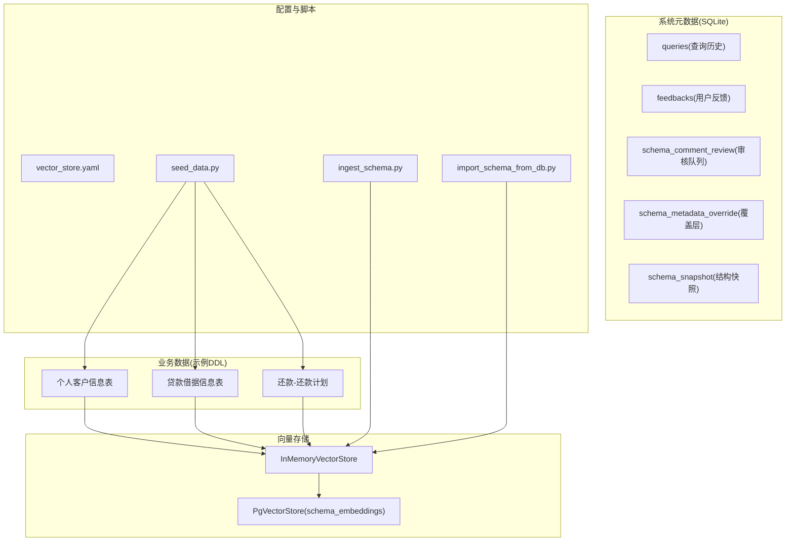
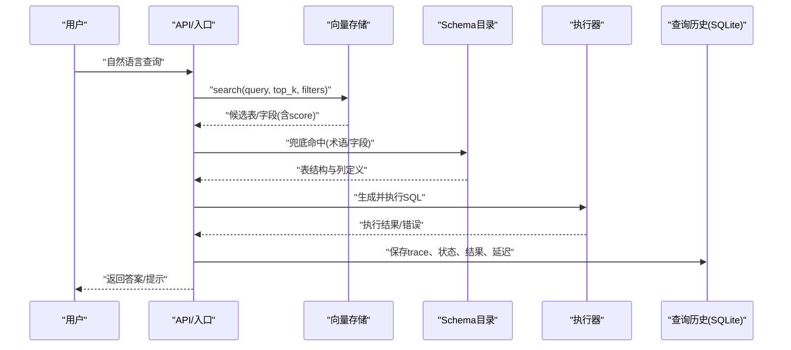
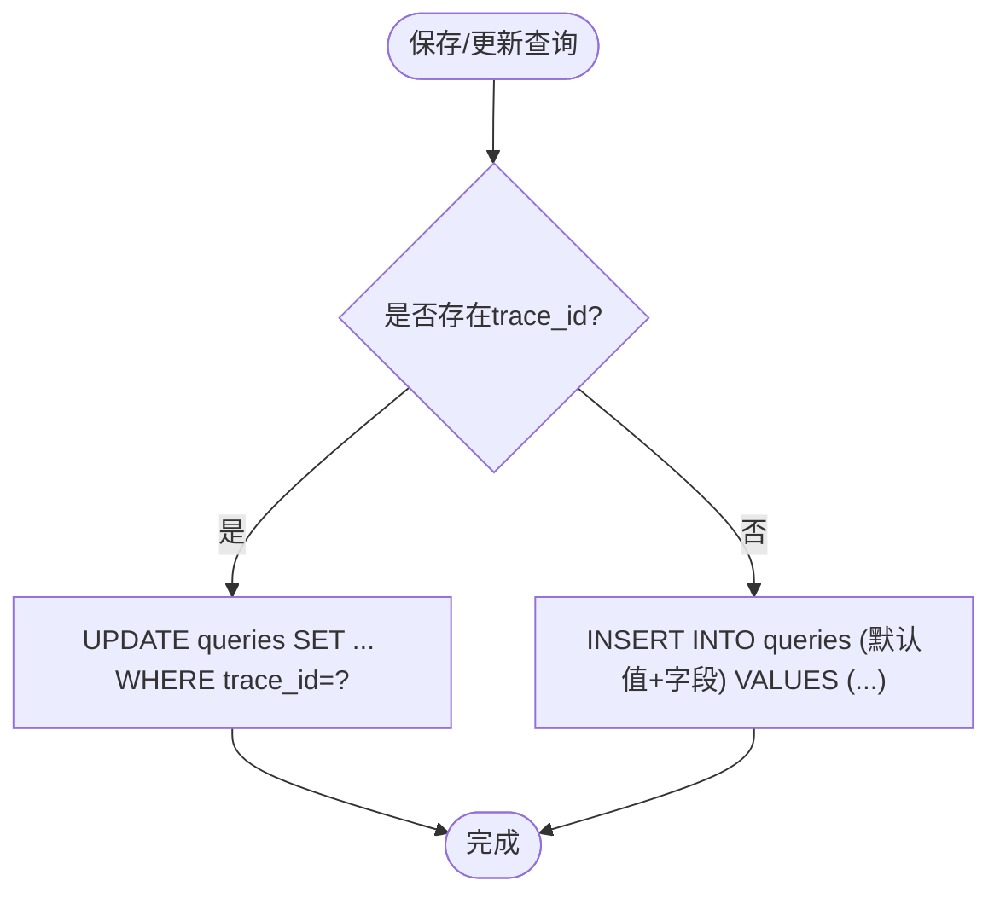
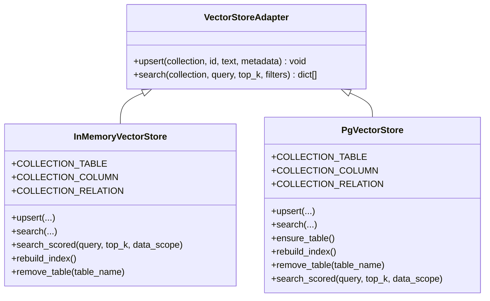
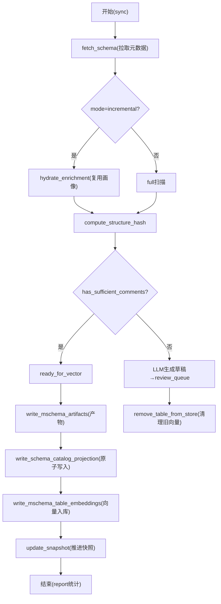
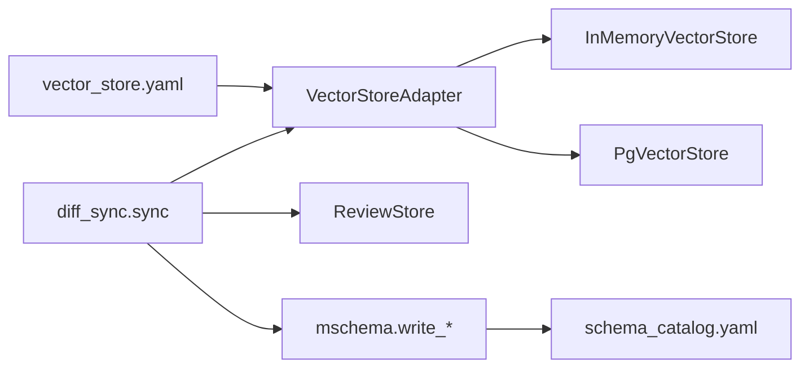

# 数据库设计

<cite>
**本文引用的文件**   
- [query_store.py](file://nl2sql_agent/services/query_store.py)
- [base.py](file://nl2sql_agent/services/vector_store/base.py)
- [pg.py](file://nl2sql_agent/services/vector_store/pg.py)
- [memory.py](file://nl2sql_agent/services/vector_store/memory.py)
- [schema_catalog.py](file://nl2sql_agent/services/schema_catalog.py)
- [diff_sync.py](file://nl2sql_agent/services/schema_ingest/diff_sync.py)
- [review_queue.py](file://nl2sql_agent/services/schema_ingest/review_queue.py)
- [mschema.py](file://nl2sql_agent/services/schema_ingest/mschema.py)
- [ingest_schema.py](file://scripts/ingest_schema.py)
- [import_schema_from_db.py](file://scripts/import_schema_from_db.py)
- [seed_data.py](file://scripts/seed_data.py)
- [vector_store.yaml](file://nl2sql_agent/config/vector_store.yaml)
- [个人客户信息表.sql](file://sql/个人客户信息表.sql)
- [贷款借据信息表.sql](file://sql/贷款借据信息表.sql)
- [还款-还款计划.sql](file://sql/还款-还款计划.sql)
</cite>

## 目录
1. [引言](#引言)
2. [项目结构](#项目结构)
3. [核心组件](#核心组件)
4. [架构总览](#架构总览)
5. [详细组件分析](#详细组件分析)
6. [依赖关系分析](#依赖关系分析)
7. [性能考虑](#性能考虑)
8. [故障排查指南](#故障排查指南)
9. [结论](#结论)
10. [附录](#附录)

## 引言
本文件面向NL2SQL项目的数据库与向量存储设计，覆盖业务主数据、查询历史与审批审计、Schema元数据、向量索引与相似度检索、数据迁移与版本管理、访问模式与缓存策略、生命周期与归档、安全与隐私、初始化脚本与导入工具、以及性能监控方法。文档既适合初学者理解设计原则，也为DBA提供运维级参考。

## 项目结构
本项目将“业务数据”“系统元数据”“向量存储”分层治理：
- 业务数据：以MySQL/Hive风格DDL定义（如个人客户、授信申请、借据、还款计划、代偿等），通过分区与分桶优化查询。
- 系统元数据：SQLite持久化查询历史、反馈、审核队列、覆盖层与结构快照。
- 向量存储：内存或PostgreSQL+pgvector实现，用于Schema语义检索与表级/字段级相似度匹配。
- 配置与脚本：向量后端选择、Schema入库与增量同步、数据种子生成等。

图表来源
- [personal_customer.sql:1-66](file://sql/个人客户信息表.sql#L1-L66)
- [loan_info.sql:1-52](file://sql/贷款借据信息表.sql#L1-L52)
- [repay_plan.sql:1-41](file://sql/还款-还款计划.sql#L1-L41)
- [query_store.py:31-91](file://nl2sql_agent/services/query_store.py#L31-L91)
- [review_queue.py:19-49](file://nl2sql_agent/services/schema_ingest/review_queue.py#L19-L49)
- [base.py:11-21](file://nl2sql_agent/services/vector_store/base.py#L11-L21)
- [pg.py:15-80](file://nl2sql_agent/services/vector_store/pg.py#L15-L80)
- [memory.py:18-50](file://nl2sql_agent/services/vector_store/memory.py#L18-L50)
- [vector_store.yaml:1-6](file://nl2sql_agent/config/vector_store.yaml#L1-L6)
- [ingest_schema.py:1-67](file://scripts/ingest_schema.py#L1-L67)
- [import_schema_from_db.py:1-44](file://scripts/import_schema_from_db.py#L1-L44)
- [seed_data.py:1-271](file://scripts/seed_data.py#L1-L271)

章节来源
- [query_store.py:31-91](file://nl2sql_agent/services/query_store.py#L31-L91)
- [review_queue.py:19-49](file://nl2sql_agent/services/schema_ingest/review_queue.py#L19-L49)
- [base.py:11-21](file://nl2sql_agent/services/vector_store/base.py#L11-L21)
- [pg.py:15-80](file://nl2sql_agent/services/vector_store/pg.py#L15-L80)
- [memory.py:18-50](file://nl2sql_agent/services/vector_store/memory.py#L18-L50)
- [vector_store.yaml:1-6](file://nl2sql_agent/config/vector_store.yaml#L1-L6)
- [ingest_schema.py:1-67](file://scripts/ingest_schema.py#L1-L67)
- [import_schema_from_db.py:1-44](file://scripts/import_schema_from_db.py#L1-L44)
- [seed_data.py:1-271](file://scripts/seed_data.py#L1-L271)

## 核心组件
- 查询历史与审计存储：SQLite表queries与feedbacks，记录trace_id、状态、SQL、执行结果、节点延迟、审批与风险决策等，支持按用户、时间范围过滤与待审列表。
- Schema元数据目录：从YAML加载各业务线表结构，支持共享表与行级权限注入，提供术语命中与字段定位。
- 向量存储接口与实现：统一接口VectorStoreAdapter；内存实现用于测试与快速验证；pgvector实现用于生产，使用余弦距离检索并支持business_line过滤。
- Schema入库编排：全量/增量同步、质量门禁、LLM注释草稿、审核队列、覆盖层生效、删除幽灵表清理、M-Schema产物落盘与catalog投影。
- 审核与覆盖层：SQLite维护审核队列、最终覆盖层与结构快照，支撑增量同步的diff判断。
- M-Schema与Catalog投影：有效M-Schema为唯一事实源，单向投影生成schema_catalog.yaml，供模块3/8使用。

章节来源
- [query_store.py:31-91](file://nl2sql_agent/services/query_store.py#L31-L91)
- [schema_catalog.py:27-95](file://nl2sql_agent/services/schema_catalog.py#L27-L95)
- [base.py:11-21](file://nl2sql_agent/services/vector_store/base.py#L11-L21)
- [pg.py:15-80](file://nl2sql_agent/services/vector_store/pg.py#L15-L80)
- [memory.py:18-50](file://nl2sql_agent/services/vector_store/memory.py#L18-50)
- [diff_sync.py:155-311](file://nl2sql_agent/services/schema_ingest/diff_sync.py#L155-L311)
- [review_queue.py:19-49](file://nl2sql_agent/services/schema_ingest/review_queue.py#L19-L49)
- [mschema.py:195-223](file://nl2sql_agent/services/schema_ingest/mschema.py#L195-L223)

## 架构总览
下图展示从自然语言到SQL生成的关键数据路径：查询进入后，先进行Schema检索（向量库或目录兜底），再结合敏感规则与复杂度检查生成SQL，执行后写入查询历史与反馈；Schema变更通过入库编排更新向量索引与catalog。

图表来源
- [pg.py:46-65](file://nl2sql_agent/services/vector_store/pg.py#L46-L65)
- [memory.py:39-49](file://nl2sql_agent/services/vector_store/memory.py#L39-49)
- [schema_catalog.py:64-86](file://nl2sql_agent/services/schema_catalog.py#L64-L86)
- [query_store.py:99-144](file://nl2sql_agent/services/query_store.py#L99-L144)

## 详细组件分析

### 查询历史与审计存储（SQLite）
- 表：queries（主键trace_id）、feedbacks（自增id）。
- 关键字段：user_id、user_query、data_scope、status、generated_sql、plan_json、retrieved_schema、sensitive_reasons、execution_result、final_answer、trace_steps、node_latencies、retry_count、plan_retry_count、approved、approver、next_node、retrieval_confidence、retrieval_candidates、clarification_reason、low_confidence_flag、execution_error、risk_decision、created_at、finished_at。
- 行为：upsert逻辑（存在则更新，不存在则插入默认值），JSON序列化Decimal/日期，线程锁保护，支持按用户/业务线/时间范围分页查询，待审列表按创建时间排序。

图表来源
- [query_store.py:99-133](file://nl2sql_agent/services/query_store.py#L99-L133)

章节来源
- [query_store.py:31-91](file://nl2sql_agent/services/query_store.py#L31-L91)
- [query_store.py:99-144](file://nl2sql_agent/services/query_store.py#L99-L144)
- [query_store.py:174-180](file://nl2sql_agent/services/query_store.py#L174-L180)

### Schema元数据目录（YAML）
- 数据结构：TableDef(name, comment, business_line, columns, shared)，按业务线组织，支持共享表跨平台可见但行级过滤。
- 能力：按data_scope过滤表集合、术语命中返回整表列定义、查找包含某字段的表、汇总敏感字段。

章节来源
- [schema_catalog.py:15-24](file://nl2sql_agent/services/schema_catalog.py#L15-L24)
- [schema_catalog.py:27-95](file://nl2sql_agent/services/schema_catalog.py#L27-L95)

### 向量存储接口与实现
- 接口：VectorStoreAdapter.upsert(collection, id, text, metadata)、search(collection, query, top_k, filters)。
- 内存实现：cosine相似度，支持filters匹配，search_scored按data_scope过滤返回[(SchemaHit, score)]。
- pgvector实现：embedding写入schema_embeddings表，余弦距离检索，支持business_line过滤；ensure_table根据模型维度建表；rebuild_index从effective M-Schema重建；remove_table清理表级/字段级/关系级条目。

图表来源
- [base.py:11-21](file://nl2sql_agent/services/vector_store/base.py#L11-L21)
- [memory.py:18-50](file://nl2sql_agent/services/vector_store/memory.py#L18-50)
- [pg.py:15-80](file://nl2sql_agent/services/vector_store/pg.py#L15-L80)

章节来源
- [base.py:11-21](file://nl2sql_agent/services/vector_store/base.py#L11-L21)
- [memory.py:18-50](file://nl2sql_agent/services/vector_store/memory.py#L18-50)
- [pg.py:46-65](file://nl2sql_agent/services/vector_store/pg.py#L46-L65)
- [pg.py:69-80](file://nl2sql_agent/services/vector_store/pg.py#L69-L80)
- [pg.py:120-136](file://nl2sql_agent/services/vector_store/pg.py#L120-L136)

### Schema入库编排与审核（全量/增量）
- 流程要点：
  - 计算structure_hash，增量模式下仅处理变化表或带覆盖层的表。
  - 质量门禁：达标直接入库；不达标则LLM生成草稿进入审核队列，不入向量库。
  - 清理幽灵表：被删表从向量库与快照中移除。
  - 产出M-Schema（raw/effective）与manifest，原子写入schema_catalog.yaml。
  - 基于effective M-Schema构建向量文档，成功后推进快照。
- 审核队列：SQLite三表（审核、覆盖层、快照），支持approve/reject、pending计数、覆盖层合并。

图表来源
- [diff_sync.py:155-311](file://nl2sql_agent/services/schema_ingest/diff_sync.py#L155-L311)
- [review_queue.py:19-49](file://nl2sql_agent/services/schema_ingest/review_queue.py#L19-L49)
- [mschema.py:195-223](file://nl2sql_agent/services/schema_ingest/mschema.py#L195-L223)

章节来源
- [diff_sync.py:155-311](file://nl2sql_agent/services/schema_ingest/diff_sync.py#L155-L311)
- [review_queue.py:19-49](file://nl2sql_agent/services/schema_ingest/review_queue.py#L19-L49)
- [mschema.py:195-223](file://nl2sql_agent/services/schema_ingest/mschema.py#L195-L223)

### 业务主数据表结构（示例DDL）
- 个人客户信息表：包含身份、联系、职业、收入、地址等字段，按PLATFORM_CODE分区，CUST_ID聚簇分桶。
- 贷款借据信息表：借据、合同、产品、利率、金额、状态、日期等，按PLATFORM_CODE分区，LOAN_NO聚簇分桶。
- 还款-还款计划：每期应还本金/利息/罚息、起止日期、宽限期等，按PLATFORM_CODE分区，LOAN_NO聚簇分桶。

章节来源
- [个人客户信息表.sql:1-66](file://sql/个人客户信息表.sql#L1-L66)
- [贷款借据信息表.sql:1-52](file://sql/贷款借据信息表.sql#L1-L52)
- [还款-还款计划.sql:1-41](file://sql/还款-还款计划.sql#L1-L41)

## 依赖关系分析
- 向量存储后端由配置显式选择（memory/pgvector），避免隐式二选一。
- Schema入库编排依赖执行器、LLM、ReviewStore、TextBuilder与向量存储。
- catalog投影依赖effective M-Schema与manifest，保证单向一致性。

图表来源
- [vector_store.yaml:1-6](file://nl2sql_agent/config/vector_store.yaml#L1-L6)
- [diff_sync.py:155-311](file://nl2sql_agent/services/schema_ingest/diff_sync.py#L155-L311)
- [mschema.py:195-223](file://nl2sql_agent/services/schema_ingest/mschema.py#L195-L223)

章节来源
- [vector_store.yaml:1-6](file://nl2sql_agent/config/vector_store.yaml#L1-L6)
- [diff_sync.py:155-311](file://nl2sql_agent/services/schema_ingest/diff_sync.py#L155-L311)
- [mschema.py:195-223](file://nl2sql_agent/services/schema_ingest/mschema.py#L195-L223)

## 性能考虑
- 向量检索
  - pgvector使用余弦距离与LIMIT top_k，建议对collection与business_line建立合适索引；embedding维度来自模型配置，确保建表一致。
  - 内存实现适合开发/测试，生产建议使用pgvector以获得稳定检索与扩展性。
- Schema入库
  - 增量模式仅处理structure_hash变化或覆盖层表，减少重复工作；未变化表复用画像分类结果。
  - effective M-Schema落盘后再写向量，失败可重试，避免不一致。
- 查询历史
  - SQLite单进程并发通过线程锁保障；大表查询建议加created_at索引并按时间倒序分页。
- 业务表
  - 分区与分桶提升按平台与主键查询效率；注意分区键与聚簇键的选择。

[本节为通用指导，无需具体文件引用]

## 故障排查指南
- 向量入库失败
  - 检查pg连接URL与pgvector扩展是否启用；确认embedding维度与建表一致；查看rebuild_index日志。
- 审核队列积压
  - 使用pending_count与list_reviews查看待审项；approve/reject后观察覆盖层生效与向量重建。
- 增量同步未变化
  - 核对structure_hash与snapshot；确认覆盖层是否触发重处理。
- 查询历史异常
  - 检查trace_id是否存在；确认JSON字段序列化是否正常；查看execution_error与risk_decision。

章节来源
- [pg.py:69-80](file://nl2sql_agent/services/vector_store/pg.py#L69-L80)
- [review_queue.py:151-158](file://nl2sql_agent/services/schema_ingest/review_queue.py#L151-L158)
- [diff_sync.py:253-258](file://nl2sql_agent/services/schema_ingest/diff_sync.py#L253-L258)
- [query_store.py:126-133](file://nl2sql_agent/services/query_store.py#L126-L133)

## 结论
本设计以“有效M-Schema为唯一事实源”，配合审核覆盖层与向量索引，实现了高质量、可追溯、可扩展的Schema语义检索与查询审计体系。通过增量同步与结构化快照，保障数据一致性与可回滚；通过配置化向量后端与严格的质量门禁，兼顾性能与准确性。

[本节为总结，无需具体文件引用]

## 附录

### 数据迁移策略
- 版本管理
  - manifest包含format_version、snapshot_id、structure_hash、semantic_hash、prompt_version，便于追踪与回滚。
- 增量升级
  - 基于structure_hash差异与覆盖层决定处理范围；未变化表跳过，已删除表清理。
- 回滚方案
  - 利用snapshot_id与manifest回溯；必要时重新运行full模式重建向量与catalog。

章节来源
- [mschema.py:226-260](file://nl2sql_agent/services/schema_ingest/mschema.py#L226-L260)
- [diff_sync.py:193-203](file://nl2sql_agent/services/schema_ingest/diff_sync.py#L193-L203)

### 数据访问模式与缓存策略
- 访问模式
  - 向量检索优先，目录兜底；敏感字段与业务线过滤贯穿检索与执行。
- 缓存策略
  - 内存向量实现作为临时缓存；pgvector作为持久化索引；catalog在运行时加载，避免频繁IO。

章节来源
- [memory.py:39-49](file://nl2sql_agent/services/vector_store/memory.py#L39-49)
- [pg.py:46-65](file://nl2sql_agent/services/vector_store/pg.py#L46-L65)
- [schema_catalog.py:27-51](file://nl2sql_agent/services/schema_catalog.py#L27-L51)

### 数据生命周期与归档
- 生命周期
  - 审核草稿→覆盖层生效→effective M-Schema落盘→向量入库→catalog投影。
- 保留与归档
  - 查询历史可按时间范围归档；向量索引随effective M-Schema重建；审核队列与快照定期清理。

章节来源
- [diff_sync.py:260-311](file://nl2sql_agent/services/schema_ingest/diff_sync.py#L260-L311)
- [query_store.py:146-172](file://nl2sql_agent/services/query_store.py#L146-L172)

### 安全性与隐私保护
- 敏感字段识别与脱敏：入库前自动标注敏感字段；LLM生成草稿时样例脱敏。
- 访问控制：共享表表级可见，行级按PLATFORM_CODE过滤；business_line过滤限制检索范围。
- 审计：查询历史与反馈完整记录，支持审计与回溯。

章节来源
- [diff_sync.py:107-152](file://nl2sql_agent/services/schema_ingest/diff_sync.py#L107-L152)
- [schema_catalog.py:52-62](file://nl2sql_agent/services/schema_catalog.py#L52-L62)
- [query_store.py:39-66](file://nl2sql_agent/services/query_store.py#L39-L66)

### 初始化脚本与导入工具
- 向量后端选择：vector_store.yaml指定backend与pgvector URL。
- Schema入库：ingest_schema.py支持full/incremental模式，自动生成M-Schema与catalog投影，重建向量索引。
- 旧版导入：import_schema_from_db.py已弃用，建议改用ingest_schema.py。
- 数据种子：seed_data.py生成演示数据，覆盖多张业务表，便于测试与演示。

章节来源
- [vector_store.yaml:1-6](file://nl2sql_agent/config/vector_store.yaml#L1-L6)
- [ingest_schema.py:1-67](file://scripts/ingest_schema.py#L1-L67)
- [import_schema_from_db.py:1-44](file://scripts/import_schema_from_db.py#L1-L44)
- [seed_data.py:1-271](file://scripts/seed_data.py#L1-L271)

### 性能监控方法
- 向量检索
  - 监控top_k、score分布、business_line命中率；pgvector侧关注embedding维度与索引大小。
- 入库同步
  - 监控report.ingested/queued/skipped/removed与errors；关注rebuild_index耗时。
- 查询历史
  - 监控queries表增长速率、平均执行时长、error率；按created_at分页查询性能。

[本节为通用指导，无需具体文件引用]