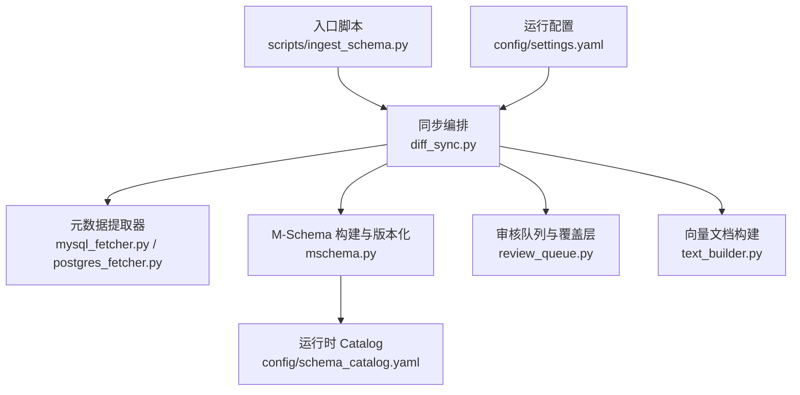
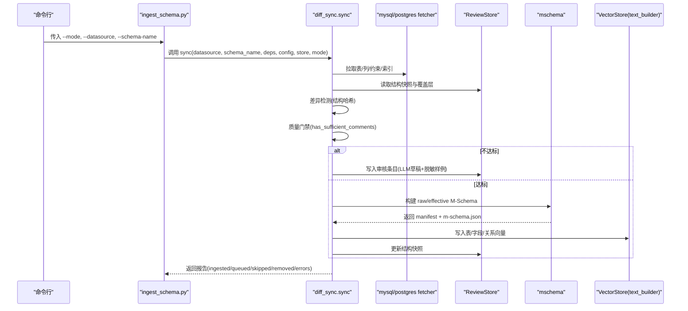
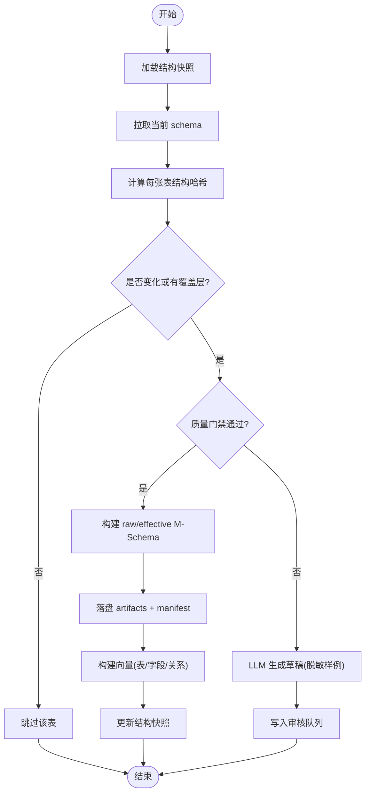
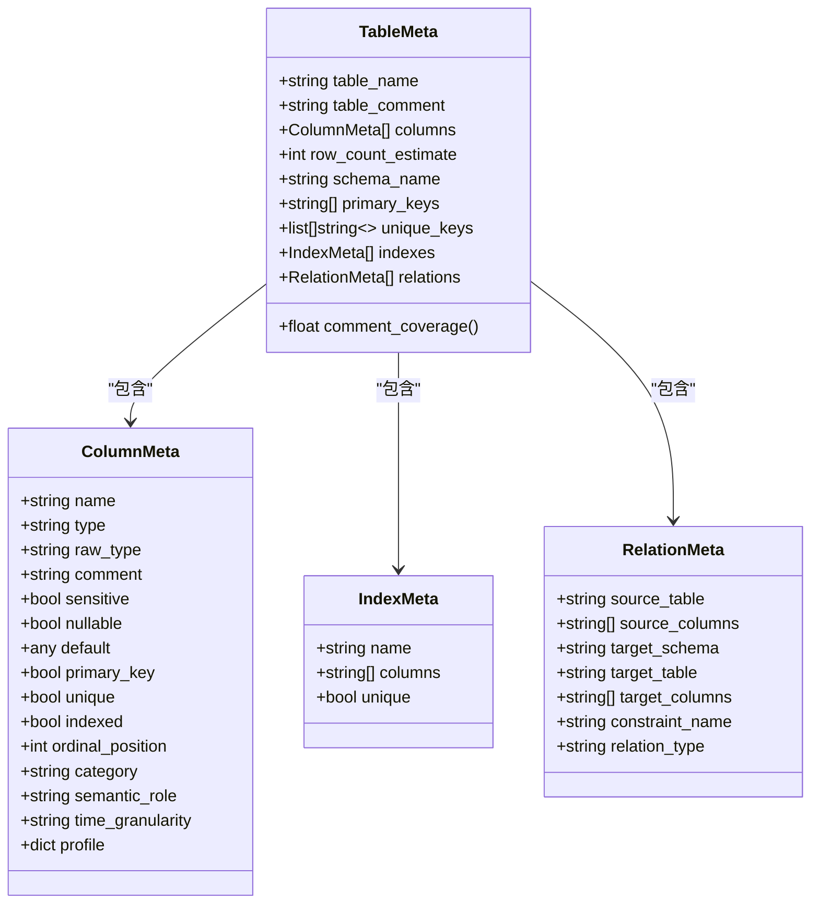
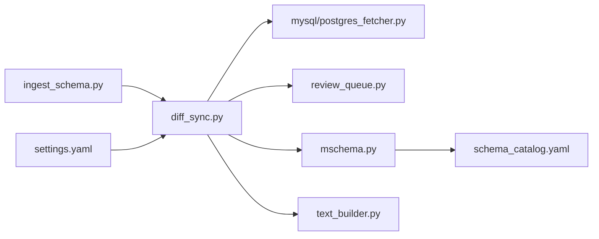

# 数据迁移

<cite>
**本文引用的文件**   
- [ingest_schema.py](file://scripts/ingest_schema.py)
- [diff_sync.py](file://nl2sql_agent/services/schema_ingest/diff_sync.py)
- [mysql_fetcher.py](file://nl2sql_agent/services/schema_ingest/mysql_fetcher.py)
- [postgres_fetcher.py](file://nl2sql_agent/services/schema_ingest/postgres_fetcher.py)
- [mschema.py](file://nl2sql_agent/services/schema_ingest/mschema.py)
- [review_queue.py](file://nl2sql_agent/services/schema_ingest/review_queue.py)
- [text_builder.py](file://nl2sql_agent/services/schema_ingest/text_builder.py)
- [settings.yaml](file://nl2sql_agent/config/settings.yaml)
- [schema_catalog.yaml](file://nl2sql_agent/config/schema_catalog.yaml)
- [test_schema_ingest.py](file://nl2sql_agent/tests/test_schema_ingest.py)
- [seed_data.py](file://scripts/seed_data.py)
</cite>

## 目录
1. [简介](#简介)
2. [项目结构](#项目结构)
3. [核心组件](#核心组件)
4. [架构总览](#架构总览)
5. [详细组件分析](#详细组件分析)
6. [依赖关系分析](#依赖关系分析)
7. [性能考量](#性能考量)
8. [故障排除指南](#故障排除指南)
9. [结论](#结论)
10. [附录](#附录)

## 简介
本文件面向“表结构与元数据”的数据迁移与同步，覆盖版本管理策略、增量升级机制、回滚方案、数据同步流程、脚本编写规范、测试方法与部署流程，并提供常见场景处理与排障指南。系统以 M-Schema 为事实源，通过全量/增量两种模式从 MySQL/PostgreSQL 拉取 schema，结合审核队列与覆盖层生成 effective M-Schema，并投影出运行时使用的 schema_catalog.yaml，最终构建向量索引供检索使用。

## 项目结构
与数据迁移相关的代码主要分布在以下位置：
- 入口脚本：scripts/ingest_schema.py（全量/增量）
- 同步编排：nl2sql_agent/services/schema_ingest/diff_sync.py
- 元数据提取器：mysql_fetcher.py、postgres_fetcher.py
- M-Schema 构建与版本化落盘：mschema.py
- 审核队列与覆盖层：review_queue.py
- 向量文档构建：text_builder.py
- 运行配置：config/settings.yaml
- 运行时 catalog：config/schema_catalog.yaml
- 验收测试：tests/test_schema_ingest.py
- 示例数据：scripts/seed_data.py

图表来源
- [ingest_schema.py:1-67](file://scripts/ingest_schema.py#L1-L67)
- [diff_sync.py:1-317](file://nl2sql_agent/services/schema_ingest/diff_sync.py#L1-L317)
- [mysql_fetcher.py:1-218](file://nl2sql_agent/services/schema_ingest/mysql_fetcher.py#L1-L218)
- [postgres_fetcher.py:1-159](file://nl2sql_agent/services/schema_ingest/postgres_fetcher.py#L1-L159)
- [mschema.py:1-289](file://nl2sql_agent/services/schema_ingest/mschema.py#L1-L289)
- [review_queue.py:1-207](file://nl2sql_agent/services/schema_ingest/review_queue.py#L1-L207)
- [text_builder.py:1-180](file://nl2sql_agent/services/schema_ingest/text_builder.py#L1-L180)
- [settings.yaml:1-30](file://nl2sql_agent/config/settings.yaml#L1-L30)
- [schema_catalog.yaml:1-800](file://nl2sql_agent/config/schema_catalog.yaml#L1-L800)

章节来源
- [ingest_schema.py:1-67](file://scripts/ingest_schema.py#L1-L67)
- [diff_sync.py:1-317](file://nl2sql_agent/services/schema_ingest/diff_sync.py#L1-L317)

## 核心组件
- 入口脚本 ingest_schema.py：提供 --mode full/incremental 参数，加载配置与依赖，调用 sync 完成入库报告输出。
- 同步编排 diff_sync.py：负责差异检测、质量门禁、LLM 草稿生成、审核队列写入、effective M-Schema 落盘、向量重建与幽灵表清理。
- 元数据提取器 mysql_fetcher.py/postgres_fetcher.py：从 information_schema/pg_* 拉取表/列/约束/索引等元数据，统一为 TableMeta/ColumnMeta/IndexMeta/RelationMeta。
- M-Schema 构建 mschema.py：构建 raw/effective M-Schema，计算结构/语义哈希，生成快照与 manifest，投影 schema_catalog.yaml。
- 审核队列 review_queue.py：SQLite 存储待审核条目、覆盖层与结构快照，支持 approve/reject 与 pending 统计。
- 向量文档 text_builder.py：基于 effective M-Schema 构建表级、字段级、关系级文本，写入向量库，支持按组分块与删除旧条目。
- 配置 settings.yaml：SQL 方言、执行限制、只读事务等；schema_catalog.yaml 为运行时精简视图。

章节来源
- [ingest_schema.py:1-67](file://scripts/ingest_schema.py#L1-L67)
- [diff_sync.py:1-317](file://nl2sql_agent/services/schema_ingest/diff_sync.py#L1-L317)
- [mysql_fetcher.py:1-218](file://nl2sql_agent/services/schema_ingest/mysql_fetcher.py#L1-L218)
- [postgres_fetcher.py:1-159](file://nl2sql_agent/services/schema_ingest/postgres_fetcher.py#L1-L159)
- [mschema.py:1-289](file://nl2sql_agent/services/schema_ingest/mschema.py#L1-L289)
- [review_queue.py:1-207](file://nl2sql_agent/services/schema_ingest/review_queue.py#L1-L207)
- [text_builder.py:1-180](file://nl2sql_agent/services/schema_ingest/text_builder.py#L1-L180)
- [settings.yaml:1-30](file://nl2sql_agent/config/settings.yaml#L1-L30)
- [schema_catalog.yaml:1-800](file://nl2sql_agent/config/schema_catalog.yaml#L1-L800)

## 架构总览
下图展示一次增量同步的端到端流程：入口脚本解析参数 → 调用 sync → 读取数据库元数据 → 差异检测 → 质量门禁 → LLM 草稿 → 审核队列 → effective M-Schema 落盘 → 向量重建 → 更新快照与报告。

图表来源
- [ingest_schema.py:1-67](file://scripts/ingest_schema.py#L1-L67)
- [diff_sync.py:1-317](file://nl2sql_agent/services/schema_ingest/diff_sync.py#L1-L317)
- [mysql_fetcher.py:1-218](file://nl2sql_agent/services/schema_ingest/mysql_fetcher.py#L1-L218)
- [postgres_fetcher.py:1-159](file://nl2sql_agent/services/schema_ingest/postgres_fetcher.py#L1-L159)
- [mschema.py:1-289](file://nl2sql_agent/services/schema_ingest/mschema.py#L1-L289)
- [review_queue.py:1-207](file://nl2sql_agent/services/schema_ingest/review_queue.py#L1-L207)
- [text_builder.py:1-180](file://nl2sql_agent/services/schema_ingest/text_builder.py#L1-L180)

## 详细组件分析

### 版本管理与兼容性策略
- Schema 版本号设计
  - M-Schema 格式版本：FORMAT_VERSION="1.0"，用于标识 M-Schema 数据结构版本。
  - Catalog 投影版本：CATALOG_PROJECTION_VERSION="1.0"，用于标识 schema_catalog.yaml 的投影格式版本。
  - 语义哈希与结构哈希：manifest 中 semantic_hash 与 structure_hash 分别对 effective M-Schema 与结构视图进行内容寻址，snapshot_id 取自语义哈希前缀，确保幂等与可追溯。
- 向后兼容保证
  - 所有新增字段均有默认值，兼容旧调用方式（如 ColumnMeta 的新增字段）。
  - 投影 schema_catalog.yaml 时仅包含必要字段，保持下游模块稳定。
- 向前兼容处理
  - 增量同步时 hydrate_enrichment 从上一版本恢复未变化表的画像与分类，避免重复计算。
  - 向量缓存持久化：若 vector_store 支持 persist_cache，则在成功完成后持久化，失败可重试。

章节来源
- [mschema.py:1-289](file://nl2sql_agent/services/schema_ingest/mschema.py#L1-L289)
- [diff_sync.py:1-317](file://nl2sql_agent/services/schema_ingest/diff_sync.py#L1-L317)
- [mysql_fetcher.py:1-218](file://nl2sql_agent/services/schema_ingest/mysql_fetcher.py#L1-L218)

### 增量升级机制
- 差异检测算法
  - compute_structure_hash：对表名、注释、主键、唯一键、索引、关系、列元数据进行 JSON 序列化后 SHA256，作为结构指纹。
  - 增量模式：比较 snapshot 中的结构哈希，仅处理变化的表或存在覆盖层的表。
- 变更影响分析
  - 对变化表执行 enrich_table 画像与分类；未变化表复用上一版本画像，降低开销。
  - 若当前版本未通过质量门禁，则移除该表在向量库中的陈旧条目，避免误导检索。
- 自动修复逻辑
  - 审核通过后将覆盖层写入覆盖表，下次同步用覆盖注释重新评估质量。
  - 被删表清理：对比当前表集合与快照，删除向量条目与快照记录，消除幽灵表。

图表来源
- [diff_sync.py:1-317](file://nl2sql_agent/services/schema_ingest/diff_sync.py#L1-L317)
- [review_queue.py:1-207](file://nl2sql_agent/services/schema_ingest/review_queue.py#L1-L207)
- [text_builder.py:1-180](file://nl2sql_agent/services/schema_ingest/text_builder.py#L1-L180)

章节来源
- [diff_sync.py:1-317](file://nl2sql_agent/services/schema_ingest/diff_sync.py#L1-L317)
- [test_schema_ingest.py:1-200](file://nl2sql_agent/tests/test_schema_ingest.py#L1-L200)

### 回滚方案
- 事务管理
  - 运行配置 settings.yaml 中 execution.read_only=true，表示执行层采用只读事务，避免迁移过程中的写操作污染业务库。
- 数据备份恢复
  - 每次有效同步会生成 snapshots/{snapshot_id}/raw-m-schema.json、effective-m-schema.json、manifest.json，可作为回滚依据。
  - schema_catalog.yaml 由 effective M-Schema 单向投影，回滚时可切换至历史 m-schema.json 并重建 catalog。
- 错误处理策略
  - 向量写入失败不会推进结构快照，下一次增量同步可自动重试。
  - 审核队列保留草稿与证据，便于人工复核与修正。

章节来源
- [settings.yaml:1-30](file://nl2sql_agent/config/settings.yaml#L1-L30)
- [mschema.py:1-289](file://nl2sql_agent/services/schema_ingest/mschema.py#L1-L289)
- [diff_sync.py:1-317](file://nl2sql_agent/services/schema_ingest/diff_sync.py#L1-L317)

### 数据同步流程
- 源数据库连接
  - 通过 SQLExecutor 执行 information_schema 查询，MySQL/PostgreSQL 双实现，统一输出内部模型。
  - 敏感字段识别：根据列名/注释匹配敏感关键词，标记 sensitive=True。
- 数据提取转换
  - 提取表/列/约束/索引信息，构造 TableMeta/ColumnMeta/IndexMeta/RelationMeta。
  - 增量模式下从上一版本恢复画像与分类，减少重复计算。
- 目标库写入
  - 先落盘 effective M-Schema 与 manifest，再构建向量文档，成功后更新结构快照。
  - 向量文档包含表级、字段级、关系级三类集合，便于多维度检索。

图表来源
- [mysql_fetcher.py:1-218](file://nl2sql_agent/services/schema_ingest/mysql_fetcher.py#L1-L218)
- [postgres_fetcher.py:1-159](file://nl2sql_agent/services/schema_ingest/postgres_fetcher.py#L1-L159)

章节来源
- [mysql_fetcher.py:1-218](file://nl2sql_agent/services/schema_ingest/mysql_fetcher.py#L1-L218)
- [postgres_fetcher.py:1-159](file://nl2sql_agent/services/schema_ingest/postgres_fetcher.py#L1-L159)
- [diff_sync.py:1-317](file://nl2sql_agent/services/schema_ingest/diff_sync.py#L1-L317)

### 迁移脚本编写规范
- 入口脚本规范
  - 使用 argparse 定义参数：--mode、--datasource、--schema-name、--business-line、--review-db。
  - 加载环境变量与依赖，调用 sync 并打印报告与提示。
- 审核工具规范
  - scripts/review_schema_comments.py 提供 list/show/approve/reject 子命令，支持编辑草稿并写入覆盖层。
- 示例数据规范
  - scripts/seed_data.py 生成真实感业务数据，支持重复运行且避免冲突。

章节来源
- [ingest_schema.py:1-67](file://scripts/ingest_schema.py#L1-L67)
- [review_queue.py:1-207](file://nl2sql_agent/services/schema_ingest/review_queue.py#L1-L207)
- [seed_data.py:1-271](file://scripts/seed_data.py#L1-L271)

### 测试方法
- 验收用例覆盖
  - 质量门禁：注释齐全直接入库，不足进入审核队列。
  - 覆盖层生效：approve 后重新入库使用覆盖注释。
  - 脱敏样例：敏感字段采样中间打码。
  - 增量重处理：修改单字段注释仅重处理该表。
  - 幽灵表清理：删除表后向量条目与快照被清理。
- 测试依赖
  - FakeSchemaExecutor 模拟 information_schema 查询与数据取样。
  - build_test_deps 构建测试依赖，支持注入 fake_llm。

章节来源
- [test_schema_ingest.py:1-200](file://nl2sql_agent/tests/test_schema_ingest.py#L1-L200)

### 部署流程
- 环境准备
  - 设置 DATABASE_URL 与 dialect，确保 SQLExecutor 能正确选择执行器。
  - 可选 pgvector_url 用于 PostgreSQL 向量后端。
- 全量导入
  - 首次运行 uv run python scripts/ingest_schema.py --mode full --datasource <db> --schema-name <schema>。
- 增量同步
  - 定时任务每日运行 --mode incremental，仅处理变化表与有覆盖层的表。
- 审核与发布
  - 使用 review_schema_comments.py 审核草稿，approve 后再次运行增量同步以入库。
- 验证
  - 检查 schema_catalog.yaml 的 _meta 与 tables 列表，确认 snapshot_id 与 semantic_hash 一致。
  - 检查向量库集合 schema_table/column/relation 是否存在对应条目。

章节来源
- [settings.yaml:1-30](file://nl2sql_agent/config/settings.yaml#L1-L30)
- [schema_catalog.yaml:1-800](file://nl2sql_agent/config/schema_catalog.yaml#L1-L800)
- [ingest_schema.py:1-67](file://scripts/ingest_schema.py#L1-L67)

## 依赖关系分析
- 组件耦合
  - ingest_schema.py 依赖 diff_sync.sync、ConfigLoader、ReviewStore。
  - diff_sync.py 依赖 fetcher、comment_generator、mschema、profiler、review_queue、text_builder。
  - mschema.py 依赖 json/yaml 与 datetime，输出 artifacts 与 manifest。
  - review_queue.py 使用 SQLite 存储审核与覆盖层，线程安全锁保护。
  - text_builder.py 依赖 VectorStoreAdapter 接口，抽象向量后端。
- 外部依赖
  - SQLExecutor 封装数据库连接与执行，支持 MySQL/PostgreSQL。
  - 向量后端支持内存与 pgvector，按需选择。

图表来源
- [ingest_schema.py:1-67](file://scripts/ingest_schema.py#L1-L67)
- [diff_sync.py:1-317](file://nl2sql_agent/services/schema_ingest/diff_sync.py#L1-L317)
- [mschema.py:1-289](file://nl2sql_agent/services/schema_ingest/mschema.py#L1-L289)
- [review_queue.py:1-207](file://nl2sql_agent/services/schema_ingest/review_queue.py#L1-L207)
- [text_builder.py:1-180](file://nl2sql_agent/services/schema_ingest/text_builder.py#L1-L180)
- [settings.yaml:1-30](file://nl2sql_agent/config/settings.yaml#L1-L30)

章节来源
- [ingest_schema.py:1-67](file://scripts/ingest_schema.py#L1-L67)
- [diff_sync.py:1-317](file://nl2sql_agent/services/schema_ingest/diff_sync.py#L1-L317)

## 性能考量
- 增量优化
  - 未变化表复用画像与分类，避免重复 enrich_table。
  - 向量构建按列分组分块，控制每块列数 columns_per_chunk。
- 只读事务
  - 执行层 read_only=true，避免迁移期间对业务库产生写放大。
- 缓存与持久化
  - 向量后端支持 persist_cache，成功完成后持久化，失败可重试。
- 资源限制
  - execution.limit 与 timeout_seconds 限制查询规模与超时，防止长尾查询拖慢同步。

[本节为通用指导，无需引用具体文件]

## 故障排除指南
- 常见问题
  - 向量写入失败：检查 vector_store 权限与连接，查看 report.errors 中 vector_write 错误。
  - 审核队列堆积：使用 review_schema_comments.py list 查看 pending 数量，approve 后重新同步。
  - 幽灵表残留：确认增量同步已清理，检查向量集合与快照一致性。
- 定位手段
  - 查看 manifest.json 的 snapshot_id 与 semantic_hash，确认版本一致性。
  - 检查 schema_catalog.yaml 的 _meta.m_schema_path 指向正确的 m-schema.json。
  - 启用日志观察 LLM 草稿生成与脱敏样例是否正确。

章节来源
- [diff_sync.py:1-317](file://nl2sql_agent/services/schema_ingest/diff_sync.py#L1-L317)
- [review_queue.py:1-207](file://nl2sql_agent/services/schema_ingest/review_queue.py#L1-L207)
- [mschema.py:1-289](file://nl2sql_agent/services/schema_ingest/mschema.py#L1-L289)

## 结论
本迁移体系以 M-Schema 为核心事实源，通过严格的质量门禁与审核流程保障元数据质量，利用结构哈希与语义哈希实现幂等与可追溯的增量升级。配合只读事务、快照与向量缓存，提供稳健的回滚与容错能力。开发者可基于现有脚本与测试快速扩展新数据源与向量后端，运维人员可按部署流程与排障指南高效维护生产环境。

[本节为总结性内容，无需引用具体文件]

## 附录
- 常用命令
  - 全量导入：uv run python scripts/ingest_schema.py --mode full --datasource nl2sql
  - 增量同步：uv run python scripts/ingest_schema.py --mode incremental --datasource nl2sql
  - 审核清单：uv run python scripts/review_schema_comments.py list --status pending
  - 审核通过：uv run python scripts/review_schema_comments.py approve --id <id> [--edit "最终注释"]
  - 示例数据：uv run python scripts/seed_data.py [--count 1000]

章节来源
- [ingest_schema.py:1-67](file://scripts/ingest_schema.py#L1-L67)
- [review_queue.py:1-207](file://nl2sql_agent/services/schema_ingest/review_queue.py#L1-L207)
- [seed_data.py:1-271](file://scripts/seed_data.py#L1-L271)