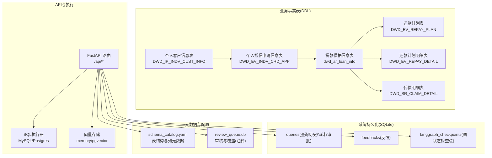
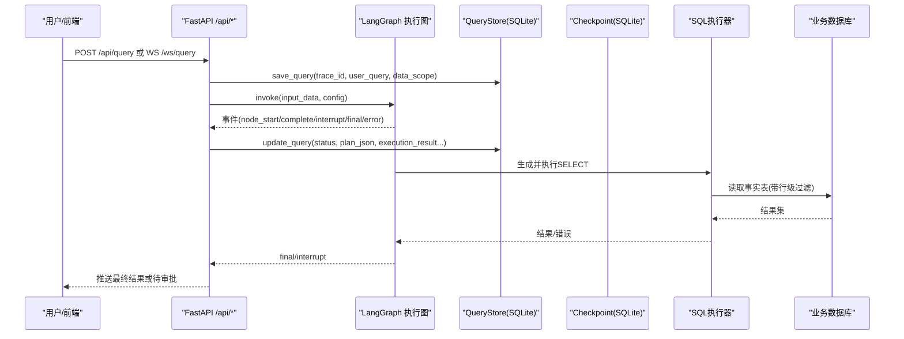
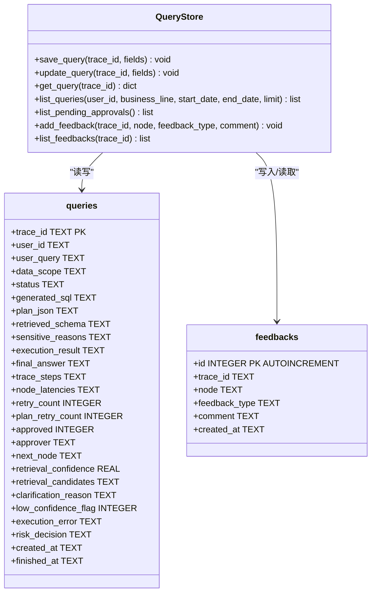
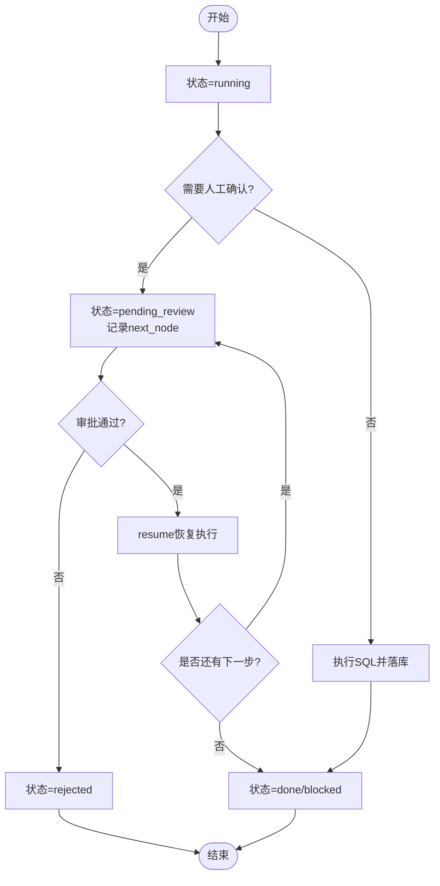
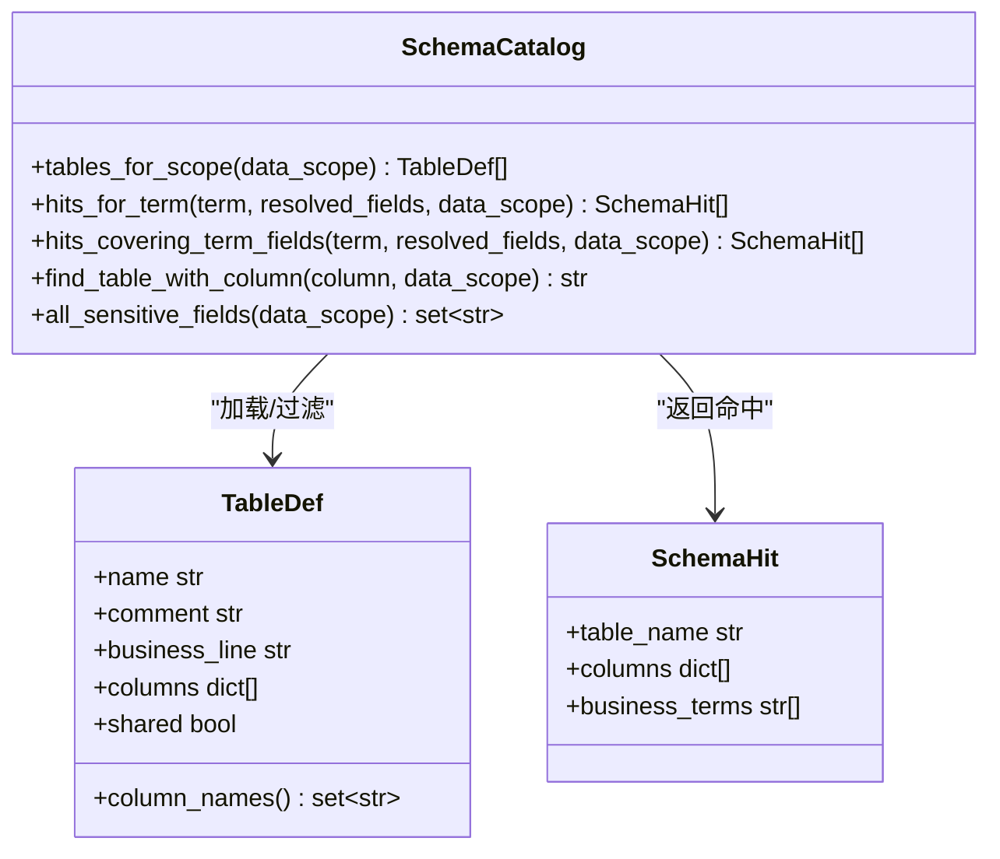
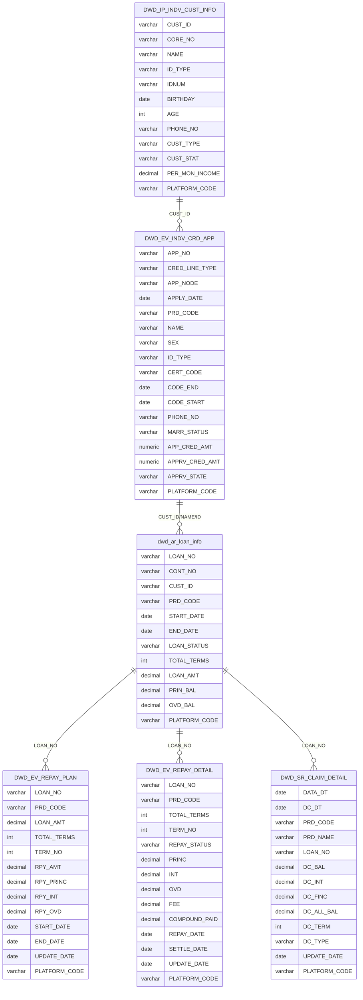
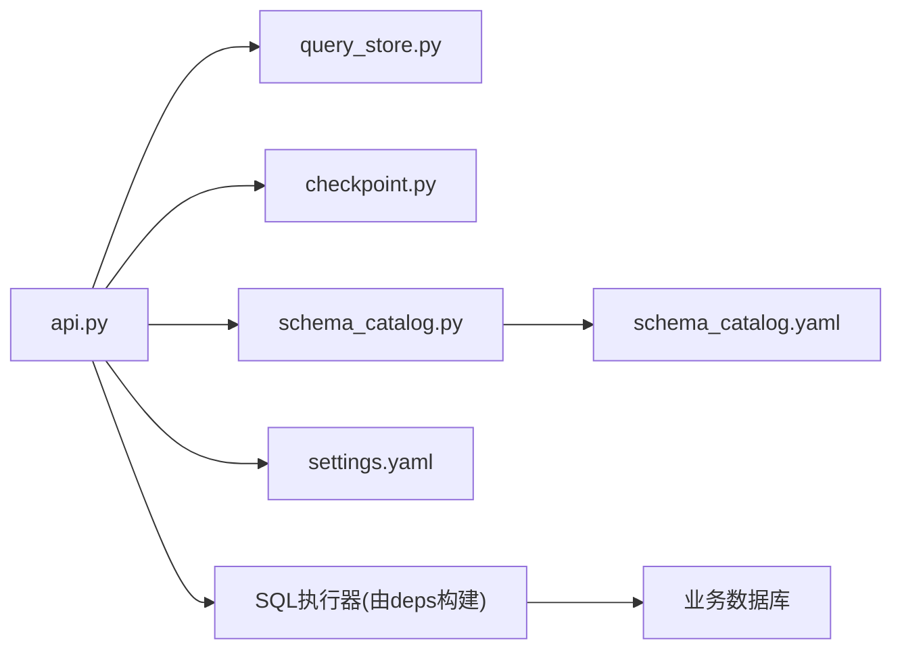

# 核心业务表

<cite>
**本文引用的文件**   
- [个人客户信息表.sql](file://sql/个人客户信息表.sql)
- [个人授信申请信息.sql](file://sql/个人授信申请信息.sql)
- [代偿表.sql](file://sql/代偿表.sql)
- [还款-还款计划.sql](file://sql/还款-还款计划.sql)
- [还款-还款计划明细.sql](file://sql/还款-还款计划明细.sql)
- [schema_catalog.yaml](file://nl2sql_agent/config/schema_catalog.yaml)
- [query_store.py](file://nl2sql_agent/services/query_store.py)
- [checkpoint.py](file://nl2sql_agent/services/checkpoint.py)
- [api.py](file://nl2sql_agent/api.py)
- [seed_data.py](file://scripts/seed_data.py)
- [settings.yaml](file://nl2sql_agent/config/settings.yaml)
</cite>

## 目录
1. [引言](#引言)
2. [项目结构](#项目结构)
3. [核心组件](#核心组件)
4. [架构总览](#架构总览)
5. [详细组件分析](#详细组件分析)
6. [依赖关系分析](#依赖关系分析)
7. [性能考量](#性能考量)
8. [故障排查指南](#故障排查指南)
9. [结论](#结论)
10. [附录](#附录)

## 引言
本文件面向开发者与DBA，系统化梳理NL2SQL项目的核心业务表与系统内相关持久化表：用户（查询历史/审计/审批）表、Schema元数据表，以及风险域事实表（客户、授信申请、借据、还款计划、还款明细、代偿）。文档覆盖字段定义、数据类型与约束、主外键与索引设计、数据验证与业务规则、CRUD模式、数据访问与缓存策略、生命周期与归档、迁移脚本与优化建议。

## 项目结构
- 业务事实表DDL位于 sql 目录，采用分区与分桶存储，按平台代码隔离数据。
- 查询历史与审批反馈使用 SQLite 持久化，供前端历史页、审计页、审批队列页查询。
- Schema元数据通过 schema_catalog.yaml 描述，配合审核与重入库流程更新向量索引与映射。
- API层提供查询、审批、历史、审计、反馈、配置与Schema管理接口。

图表来源
- [个人客户信息表.sql:1-66](file://sql/个人客户信息表.sql#L1-L66)
- [个人授信申请信息.sql:1-71](file://sql/个人授信申请信息.sql#L1-L71)
- [代偿表.sql:1-39](file://sql/代偿表.sql#L1-L39)
- [还款-还款计划.sql:1-41](file://sql/还款-还款计划.sql#L1-L41)
- [还款-还款计划明细.sql:1-40](file://sql/还款-还款计划明细.sql#L1-L40)
- [query_store.py:31-91](file://nl2sql_agent/services/query_store.py#L31-L91)
- [checkpoint.py:32-40](file://nl2sql_agent/services/checkpoint.py#L32-L40)
- [schema_catalog.yaml:1-120](file://nl2sql_agent/config/schema_catalog.yaml#L1-L120)
- [api.py:31-50](file://nl2sql_agent/api.py#L31-L50)

章节来源
- [个人客户信息表.sql:1-66](file://sql/个人客户信息表.sql#L1-L66)
- [个人授信申请信息.sql:1-71](file://sql/个人授信申请信息.sql#L1-L71)
- [代偿表.sql:1-39](file://sql/代偿表.sql#L1-L39)
- [还款-还款计划.sql:1-41](file://sql/还款-还款计划.sql#L1-L41)
- [还款-还款计划明细.sql:1-40](file://sql/还款-还款计划明细.sql#L1-L40)
- [query_store.py:31-91](file://nl2sql_agent/services/query_store.py#L31-L91)
- [checkpoint.py:32-40](file://nl2sql_agent/services/checkpoint.py#L32-L40)
- [schema_catalog.yaml:1-120](file://nl2sql_agent/config/schema_catalog.yaml#L1-L120)
- [api.py:31-50](file://nl2sql_agent/api.py#L31-L50)

## 核心组件
- 业务事实表族：客户、授信申请、借据、还款计划、还款明细、代偿，均按 PLATFORM_CODE 分区，部分表按 LOAN_NO/CUST_ID/APP_NO 分桶，便于跨平台分析与聚合。
- 查询历史与审批表：SQLite 的 queries 与 feedbacks，记录每次自然语言查询的生命周期、SQL、计划、执行结果、审批与反馈。
- Schema元数据：schema_catalog.yaml 描述表名、列名、类型、注释、敏感标记等；支持审核覆盖与增量重入库。
- API与执行：FastAPI暴露REST/WebSocket接口，驱动LangGraph图执行，持久化到SQLite并调用SQL执行器访问目标库。

章节来源
- [schema_catalog.yaml:12-120](file://nl2sql_agent/config/schema_catalog.yaml#L12-L120)
- [query_store.py:31-91](file://nl2sql_agent/services/query_store.py#L31-L91)
- [api.py:31-50](file://nl2sql_agent/api.py#L31-L50)

## 架构总览
下图展示从用户提问到SQL执行与结果返回的关键路径，以及查询历史与审批落库位置。

图表来源
- [api.py:134-157](file://nl2sql_agent/api.py#L134-L157)
- [api.py:234-264](file://nl2sql_agent/api.py#L234-L264)
- [query_store.py:99-134](file://nl2sql_agent/services/query_store.py#L99-L134)
- [checkpoint.py:32-40](file://nl2sql_agent/services/checkpoint.py#L32-L40)

## 详细组件分析

### 用户表（查询历史/审计/审批）
- 表名与用途
  - queries：保存每条查询的主键trace_id、用户ID、原始问题、数据范围、状态、生成的SQL、计划JSON、检索到的Schema、敏感原因、执行结果、最终答案、链路追踪、重试计数、审批信息与时间戳。
  - feedbacks：记录对某次查询在某个节点的反馈类型与评论。
- 主键与索引
  - queries.trace_id 为主键。
  - feedbacks.id 自增主键；trace_id用于关联查询。
- 字段与约束要点
  - status 枚举值：running/done/pending_review/error/rejected/blocked。
  - JSON字段以TEXT存储，读写时序列化为JSON字符串。
  - created_at/finished_at 为ISO时间字符串。
- 数据验证与业务规则
  - 插入或更新时自动序列化复杂对象为JSON。
  - 列表查询支持按user_id、business_line(data_scope模糊匹配)、时间范围过滤与分页限制。
- CRUD模式
  - 创建：save_query(trace_id, **fields)，不存在则初始化默认值后插入。
  - 更新：update_query(trace_id, **fields)。
  - 查询：get_query/list_queries/list_pending_approvals。
  - 反馈：add_feedback/list_feedbacks。

图表来源
- [query_store.py:31-91](file://nl2sql_agent/services/query_store.py#L31-L91)
- [query_store.py:99-134](file://nl2sql_agent/services/query_store.py#L99-L134)
- [query_store.py:141-193](file://nl2sql_agent/services/query_store.py#L141-L193)
- [query_store.py:197-214](file://nl2sql_agent/services/query_store.py#L197-L214)

章节来源
- [query_store.py:31-91](file://nl2sql_agent/services/query_store.py#L31-L91)
- [query_store.py:99-134](file://nl2sql_agent/services/query_store.py#L99-L134)
- [query_store.py:141-193](file://nl2sql_agent/services/query_store.py#L141-L193)
- [query_store.py:197-214](file://nl2sql_agent/services/query_store.py#L197-L214)

### 审批记录与恢复机制
- 审批状态流转
  - running → pending_review（人工确认/澄清）→ done/rejected/blocked（终态）或继续运行。
- 恢复与检查点
  - LangGraph状态通过SqliteSaver持久化，支持服务重启后恢复中断节点。
- API交互
  - approve/resume接口先置running再异步恢复，避免前端误判。

图表来源
- [api.py:280-314](file://nl2sql_agent/api.py#L280-L314)
- [api.py:322-353](file://nl2sql_agent/api.py#L322-L353)
- [checkpoint.py:32-40](file://nl2sql_agent/services/checkpoint.py#L32-L40)

章节来源
- [api.py:280-314](file://nl2sql_agent/api.py#L280-L314)
- [api.py:322-353](file://nl2sql_agent/api.py#L322-L353)
- [checkpoint.py:32-40](file://nl2sql_agent/services/checkpoint.py#L32-L40)

### Schema元数据表
- 数据来源
  - schema_catalog.yaml 描述各业务线表结构、列定义、敏感标记、语义角色等。
  - 支持共享表（shared=true），行级权限通过 row_level_filters 注入PLATFORM_CODE过滤。
- 能力
  - 按data_scope获取表集合；术语命中与字段覆盖；敏感字段收集；覆盖注释与重入库。
- 审核与覆盖
  - review_store维护覆盖项（表/列注释），支持approve/reject与reingest同步至schema_catalog与向量索引。

图表来源
- [schema_catalog.yaml:1-120](file://nl2sql_agent/config/schema_catalog.yaml#L1-L120)
- [schema_catalog.py:27-126](file://nl2sql_agent/services/schema_catalog.py#L27-L126)
- [state.py:14-20](file://nl2sql_agent/state.py#L14-L20)

章节来源
- [schema_catalog.yaml:1-120](file://nl2sql_agent/config/schema_catalog.yaml#L1-L120)
- [schema_catalog.py:27-126](file://nl2sql_agent/services/schema_catalog.py#L27-L126)
- [state.py:14-20](file://nl2sql_agent/state.py#L14-L20)

### 业务事实表族（客户、授信申请、借据、还款计划、还款明细、代偿）
- 共同特征
  - 均按 PLATFORM_CODE 分区，便于多平台数据隔离与分析。
  - 多数表按关键维度分桶（如LOAN_NO/CUST_ID/APP_NO），提升局部扫描性能。
  - 存储格式多为 holodesk/orc_transaction，适合大数据场景。
- 表间关系（逻辑）
  - 客户(CUST_ID) → 授信申请(APP_NO) → 借据(LOAN_NO) → 还款计划/明细 → 代偿。
  - 借据与还款计划/明细通过LOAN_NO关联；代偿通过LOAN_NO关联逾期借据。
- 关键字段与约束
  - 金额类字段多为DECIMAL(24,6)/NUMERIC，保证精度。
  - 日期字段DATE/TIMESTAMP，用于时间窗口分析。
  - 状态字段VARCHAR编码业务状态（如REPAY_STATUS、APPRV_STATE、LOAN_STATUS）。
  - 平台代码PLATFORM_CODE作为分区键，必须参与查询谓词以提升性能。
- 示例数据与种子脚本
  - seed_data.py生成约1000条真实感数据，覆盖各表并建立逻辑关联，便于演示与测试。

图表来源
- [个人客户信息表.sql:1-66](file://sql/个人客户信息表.sql#L1-L66)
- [个人授信申请信息.sql:1-71](file://sql/个人授信申请信息.sql#L1-L71)
- [还款-还款计划.sql:1-41](file://sql/还款-还款计划.sql#L1-L41)
- [还款-还款计划明细.sql:1-40](file://sql/还款-还款计划明细.sql#L1-L40)
- [代偿表.sql:1-39](file://sql/代偿表.sql#L1-L39)

章节来源
- [个人客户信息表.sql:1-66](file://sql/个人客户信息表.sql#L1-L66)
- [个人授信申请信息.sql:1-71](file://sql/个人授信申请信息.sql#L1-L71)
- [还款-还款计划.sql:1-41](file://sql/还款-还款计划.sql#L1-L41)
- [还款-还款计划明细.sql:1-40](file://sql/还款-还款计划明细.sql#L1-L40)
- [代偿表.sql:1-39](file://sql/代偿表.sql#L1-L39)
- [seed_data.py:66-271](file://scripts/seed_data.py#L66-L271)

## 依赖关系分析
- API依赖QueryStore与Checkpointer进行状态持久化与恢复。
- SchemaCatalog依赖schema_catalog.yaml与审核覆盖，影响SQL生成时的表/列选择与敏感字段处理。
- SQL执行器根据settings.yaml中的dialect与database_url选择MySQL或Postgres执行器，并受row_level_filter控制行级权限。

图表来源
- [api.py:31-50](file://nl2sql_agent/api.py#L31-L50)
- [query_store.py:31-91](file://nl2sql_agent/services/query_store.py#L31-L91)
- [checkpoint.py:32-40](file://nl2sql_agent/services/checkpoint.py#L32-L40)
- [schema_catalog.py:27-126](file://nl2sql_agent/services/schema_catalog.py#L27-L126)
- [settings.yaml:1-29](file://nl2sql_agent/config/settings.yaml#L1-L29)

章节来源
- [api.py:31-50](file://nl2sql_agent/api.py#L31-L50)
- [settings.yaml:1-29](file://nl2sql_agent/config/settings.yaml#L1-L29)

## 性能考量
- 分区与分桶
  - 所有事实表按PLATFORM_CODE分区，查询务必带上该条件，避免全表扫描。
  - 常用维度（LOAN_NO/CUST_ID/APP_NO）分桶，提升等值连接与聚合效率。
- 只读与限流
  - settings.execution.read_only=true确保事务只读；limit限制未聚合查询行数；timeout_seconds控制超时。
- 向量兜底与内存后端
  - vector_store.backend=memory适用于开发；生产可切换pgvector提升召回质量。
- 执行前校验
  - explain_row_threshold阈值拒绝预估行数过大的查询，降低慢查询风险。

章节来源
- [settings.yaml:1-29](file://nl2sql_agent/config/settings.yaml#L1-L29)
- [个人客户信息表.sql:55-66](file://sql/个人客户信息表.sql#L55-L66)
- [个人授信申请信息.sql:57-71](file://sql/个人授信申请信息.sql#L57-L71)
- [还款-还款计划.sql:19-41](file://sql/还款-还款计划.sql#L19-L41)
- [还款-还款计划明细.sql:16-40](file://sql/还款-还款计划明细.sql#L16-L40)
- [代偿表.sql:18-39](file://sql/代偿表.sql#L18-L39)

## 故障排查指南
- 查询历史为空或状态异常
  - 检查QueryStore的save/update逻辑与API持久化调用；确认trace_id一致。
  - 查看error状态与execution_error字段定位执行失败原因。
- 审批无法恢复
  - 确认checkpointer文件存在且WAL模式开启；检查pending_review状态与next_node。
- Schema不生效
  - 检查schema_catalog.yaml是否包含目标表；审核覆盖是否已应用；必要时调用reingest。
- 数据量过大导致超时
  - 增加explain_row_threshold阈值判断；确保WHERE包含PLATFORM_CODE与必要维度；考虑物化视图或预聚合。

章节来源
- [query_store.py:99-134](file://nl2sql_agent/services/query_store.py#L99-L134)
- [api.py:280-314](file://nl2sql_agent/api.py#L280-L314)
- [checkpoint.py:32-40](file://nl2sql_agent/services/checkpoint.py#L32-L40)
- [api.py:544-567](file://nl2sql_agent/api.py#L544-L567)

## 结论
本项目围绕“自然语言转SQL”的核心目标，构建了完善的事实表族与系统持久化体系。通过分区与分桶、只读与限流、行级过滤与审核覆盖，兼顾了性能与安全。建议在上线阶段强化分区裁剪、索引设计与监控告警，并结合向量存储与解释性指标持续优化召回与准确率。

## 附录

### 数据生命周期与保留策略
- 查询历史与反馈
  - 建议按created_at定期归档或清理，保留策略可按合规要求设定（如90天热数据+长期归档）。
- 图检查点
  - langgraph_checkpoints.db仅用于恢复中断状态，可在任务完成后清理或压缩。
- 事实表
  - 基于PLATFORM_CODE分区，按平台与时间窗口归档；历史数据可冷备至对象存储。

[本节为通用运维建议，不直接引用具体文件]

### 数据迁移脚本与示例
- 种子数据
  - scripts/seed_data.py生成约1000条跨表关联数据，覆盖客户、授信申请、借据、还款计划、还款明细、代偿，便于演示与测试。
- Schema审核与重入库
  - 通过API /schema/review/* 与 /schema/reingest 完成注释覆盖与元数据同步。

章节来源
- [seed_data.py:66-271](file://scripts/seed_data.py#L66-L271)
- [api.py:489-567](file://nl2sql_agent/api.py#L489-L567)

### 常见CRUD操作模式
- 查询历史
  - 创建：_store.save_query(trace_id, user_id, user_query, data_scope)
  - 更新：_store.update_query(trace_id, status, generated_sql, plan_json, execution_result, ...)
  - 查询：_store.get_query / _store.list_queries / _store.list_pending_approvals
  - 反馈：_store.add_feedback / _store.list_feedbacks
- 事实表
  - 批量插入：seed_data.py中executemany批量写入，注意PLATFORM_CODE必填。
  - 查询：务必携带PLATFORM_CODE与必要维度，避免全表扫描。

章节来源
- [query_store.py:99-134](file://nl2sql_agent/services/query_store.py#L99-L134)
- [query_store.py:141-193](file://nl2sql_agent/services/query_store.py#L141-L193)
- [query_store.py:197-214](file://nl2sql_agent/services/query_store.py#L197-L214)
- [seed_data.py:106-262](file://scripts/seed_data.py#L106-L262)

### 数据验证与业务规则
- 状态枚举
  - queries.status取值：running/done/pending_review/error/rejected/blocked。
  - repayment状态：REPAY_STATUS编码（如00正常、01提前、03逾期、04逾期还款等）。
- 敏感字段
  - schema_catalog中标记sensitive的列（如IDTYPE、IDNUM、PHONE_NO等）需脱敏或限制输出。
- 行级过滤
  - settings.row_level_filter.enabled=false时关闭；启用时需注入row_level_filters（如PLATFORM_CODE白名单）。

章节来源
- [query_store.py:31-91](file://nl2sql_agent/services/query_store.py#L31-L91)
- [schema_catalog.yaml:12-120](file://nl2sql_agent/config/schema_catalog.yaml#L12-L120)
- [settings.yaml:24-29](file://nl2sql_agent/config/settings.yaml#L24-L29)