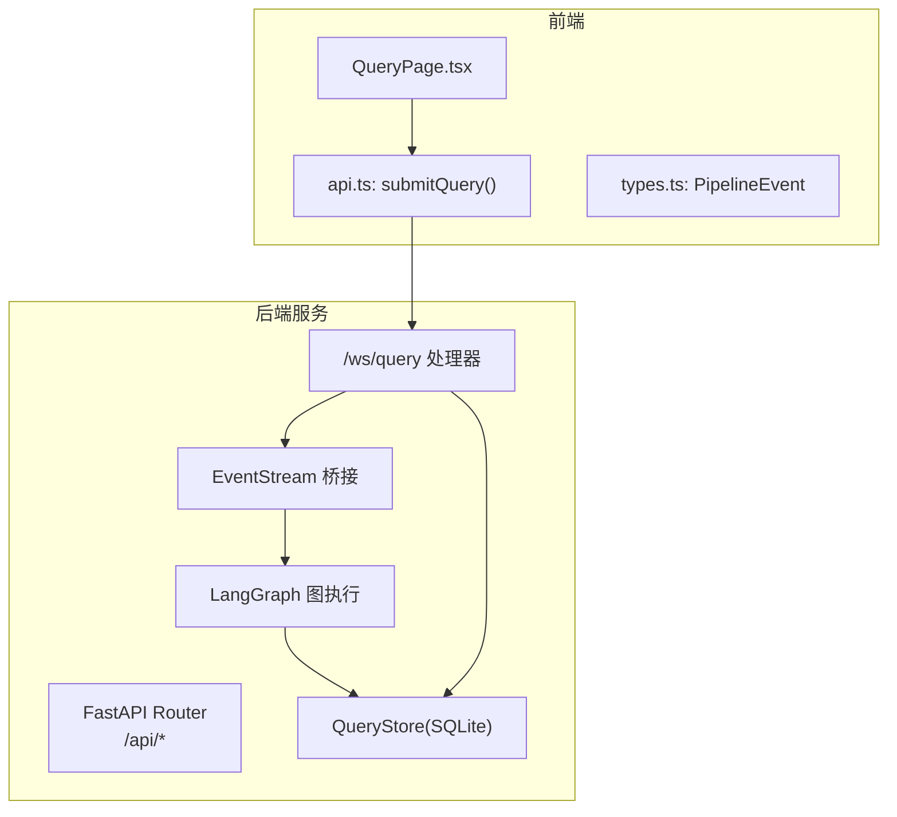
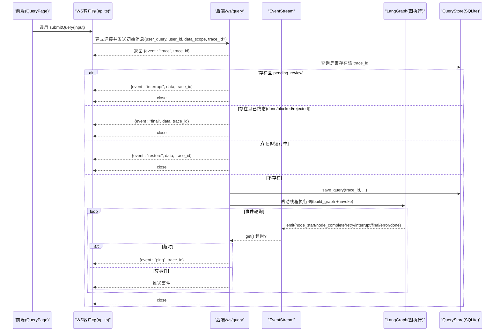
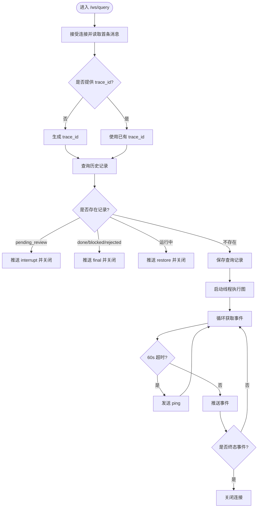
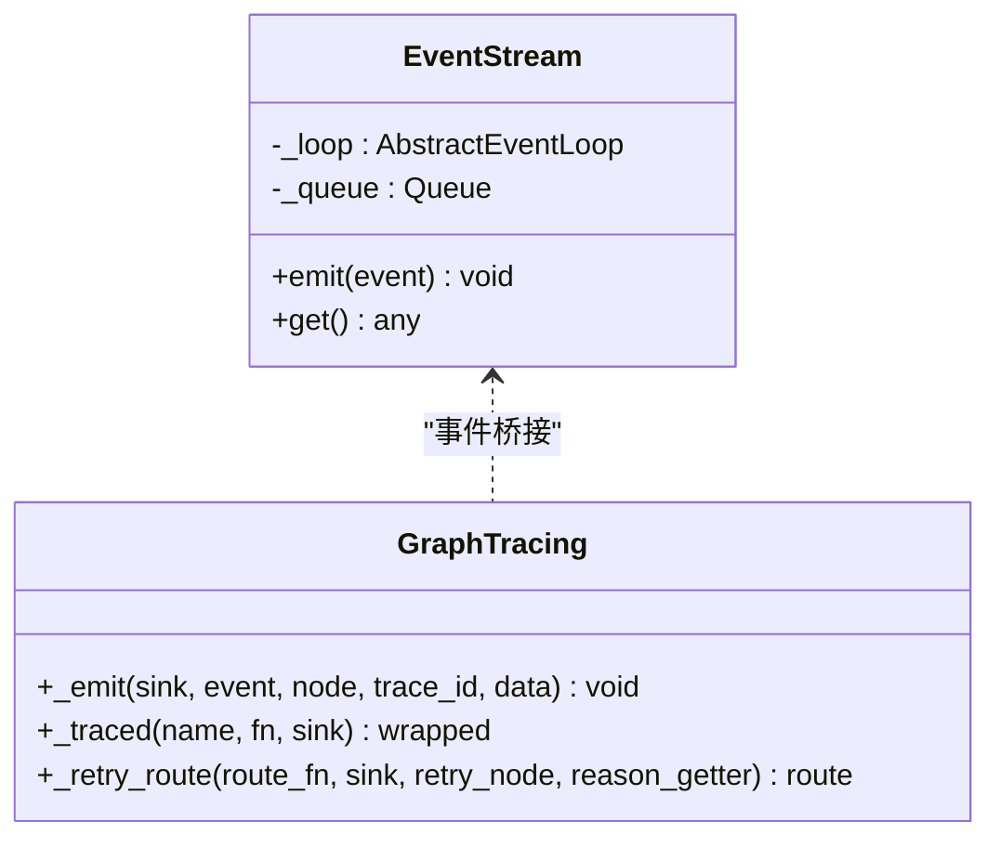
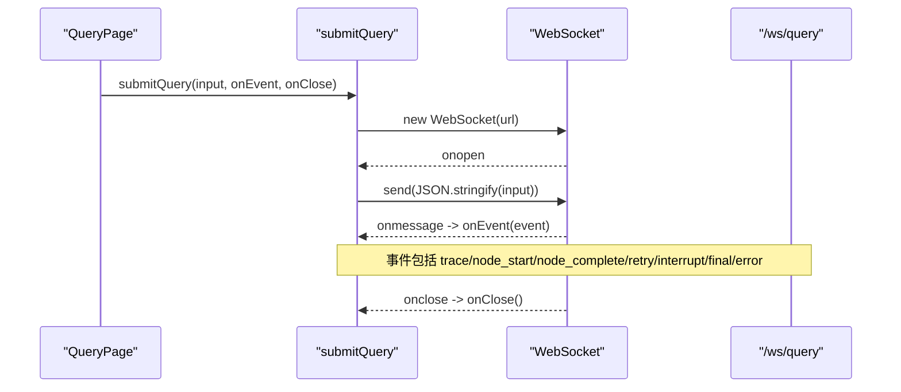
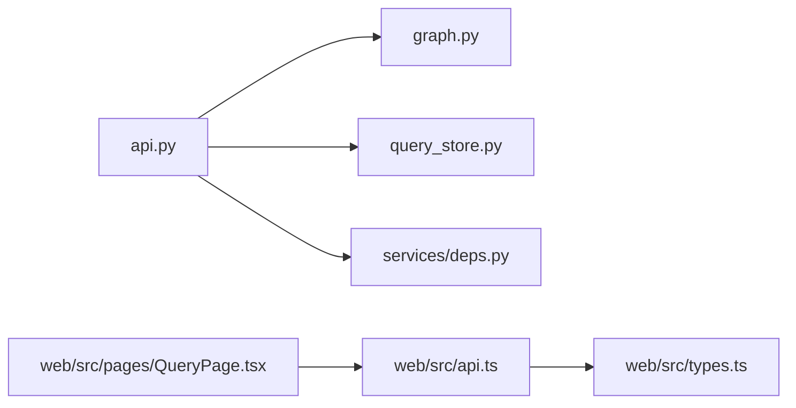

# WebSocket 通信机制

<cite>
**本文引用的文件**
- [nl2sql_agent/api.py](file://nl2sql_agent/api.py)
- [nl2sql_agent/graph.py](file://nl2sql_agent/graph.py)
- [nl2sql_agent/services/query_store.py](file://nl2sql_agent/services/query_store.py)
- [web/src/api.ts](file://web/src/api.ts)
- [web/src/types.ts](file://web/src/types.ts)
- [web/src/pages/QueryPage.tsx](file://web/src/pages/QueryPage.tsx)
</cite>

## 目录
1. [简介](#简介)
2. [项目结构](#项目结构)
3. [核心组件](#核心组件)
4. [架构总览](#架构总览)
5. [详细组件分析](#详细组件分析)
6. [依赖关系分析](#依赖关系分析)
7. [性能考量](#性能考量)
8. [故障排查指南](#故障排查指南)
9. [结论](#结论)
10. [附录](#附录)

## 简介
本文件面向 NL2SQL 系统的 WebSocket 通信机制，重点说明：
- 连接建立、维护与关闭流程
- 心跳检测与断线重连策略
- /ws/query 接口的实现细节（请求参数、会话管理、资源清理）
- 事件推送原理（异步消息桥接、批量发送、错误处理）
- 连接状态监控与调试方法
- 性能优化建议
- 客户端连接示例与常见问题解决方案

## 项目结构
后端通过 FastAPI 暴露 REST 与 WebSocket 接口；WebSocket 用于流式推送 LangGraph 执行过程中的节点事件。前端使用浏览器原生 WebSocket API 进行连接与事件消费，并通过 REST 接口完成历史查询、审批与恢复等辅助操作。



图表来源
- [web/src/pages/QueryPage.tsx:267-357](file://web/src/pages/QueryPage.tsx#L267-L357)
- [web/src/api.ts:31-49](file://web/src/api.ts#L31-L49)
- [web/src/types.ts:37-54](file://web/src/types.ts#L37-L54)
- [nl2sql_agent/api.py:213-222](file://nl2sql_agent/api.py#L213-L222)
- [nl2sql_agent/api.py:54-66](file://nl2sql_agent/api.py#L54-L66)
- [nl2sql_agent/graph.py:174-312](file://nl2sql_agent/graph.py#L174-L312)
- [nl2sql_agent/services/query_store.py:31-96](file://nl2sql_agent/services/query_store.py#L31-L96)

章节来源
- [nl2sql_agent/api.py:1-573](file://nl2sql_agent/api.py#L1-L573)
- [web/src/api.ts:1-49](file://web/src/api.ts#L1-L49)
- [web/src/types.ts:1-72](file://web/src/types.ts#L1-L72)
- [web/src/pages/QueryPage.tsx:1-574](file://web/src/pages/QueryPage.tsx#L1-L574)

## 核心组件
- WebSocket 路由与处理器：/ws/query，负责接收初始消息、分配 trace_id、启动后台线程执行图、轮询事件并回推给前端。
- 事件桥接 EventStream：同步线程到 asyncio 事件循环的桥，保证跨线程安全的事件投递。
- 图执行器：基于 LangGraph 的 pipeline，按节点产出 node_start/node_complete/retry/interrupt/final/error/done 等事件。
- 持久化存储 QueryStore：SQLite 存储查询记录、状态、审计与反馈，支撑断线重连与历史恢复。
- 前端客户端：submitQuery 封装 WebSocket 连接、消息收发与生命周期回调；QueryPage 管理会话状态与渲染。

章节来源
- [nl2sql_agent/api.py:54-66](file://nl2sql_agent/api.py#L54-L66)
- [nl2sql_agent/api.py:134-157](file://nl2sql_agent/api.py#L134-L157)
- [nl2sql_agent/api.py:161-222](file://nl2sql_agent/api.py#L161-L222)
- [nl2sql_agent/graph.py:72-103](file://nl2sql_agent/graph.py#L72-L103)
- [nl2sql_agent/services/query_store.py:31-96](file://nl2sql_agent/services/query_store.py#L31-L96)
- [web/src/api.ts:31-49](file://web/src/api.ts#L31-L49)
- [web/src/pages/QueryPage.tsx:291-333](file://web/src/pages/QueryPage.tsx#L291-L333)

## 架构总览
下图展示了从前端发起查询到后端事件推送的完整时序，包括心跳、断线重连与恢复逻辑。



图表来源
- [web/src/api.ts:31-49](file://web/src/api.ts#L31-L49)
- [nl2sql_agent/api.py:161-222](file://nl2sql_agent/api.py#L161-L222)
- [nl2sql_agent/api.py:134-157](file://nl2sql_agent/api.py#L134-L157)
- [nl2sql_agent/graph.py:72-103](file://nl2sql_agent/graph.py#L72-L103)
- [nl2sql_agent/services/query_store.py:99-144](file://nl2sql_agent/services/query_store.py#L99-L144)

## 详细组件分析

### /ws/query 接口实现
- 连接建立：接受 WebSocket 连接，读取第一条 JSON 消息。
- 参数验证与默认值：
  - 支持 user_query 或 query 字段（兼容两种命名）。
  - 可选 user_id、data_scope、conversation_history、trace_id。
  - 若未提供 trace_id，则生成唯一标识。
- 会话管理与断线重连：
  - 根据 trace_id 查询历史记录，若存在：
    - pending_review：推送 interrupt 并关闭连接，提示前端进入审批/澄清流程。
    - done/blocked/rejected：推送 final 并关闭连接。
    - 其他运行中状态：推送 restore 并关闭连接，由前端决定后续行为。
- 事件推送与心跳：
  - 启动独立线程执行图，通过 EventStream 将事件投递到 asyncio 队列。
  - 主协程以 60 秒为超时等待事件，超时则发送 ping 保持连接活跃。
  - 当收到 final/interrupt/error/done 任一终态事件后，关闭连接。
- 资源清理：
  - 无论成功或异常，最终都会发送 done 事件并关闭连接。
  - 异常路径会记录 error 事件并更新数据库状态为 error。



图表来源
- [nl2sql_agent/api.py:161-222](file://nl2sql_agent/api.py#L161-L222)
- [nl2sql_agent/services/query_store.py:99-144](file://nl2sql_agent/services/query_store.py#L99-L144)

章节来源
- [nl2sql_agent/api.py:161-222](file://nl2sql_agent/api.py#L161-L222)
- [nl2sql_agent/services/query_store.py:99-144](file://nl2sql_agent/services/query_store.py#L99-L144)

### 事件推送与异步消息桥接
- EventStream 类：
  - 在构造时持有当前事件循环引用。
  - emit(): 使用 call_soon_threadsafe 将事件放入 asyncio.Queue，确保线程安全。
  - get(): 协程阻塞等待队列中的下一个事件。
- 图执行侧：
  - _emit() 包装节点事件，统一格式 event/node/trace_id/data。
  - _traced() 在每个节点前后推送 node_start 与 node_complete，并记录耗时与步骤顺序。
  - _retry_route() 在重试分支推送 retry 事件，包含 attempt 与 reason。
- 错误处理：
  - 事件推送失败不影响图执行（异常被捕获忽略）。
  - 图执行异常会推送 error 事件并落库标记 error。



图表来源
- [nl2sql_agent/api.py:54-66](file://nl2sql_agent/api.py#L54-L66)
- [nl2sql_agent/graph.py:72-125](file://nl2sql_agent/graph.py#L72-L125)

章节来源
- [nl2sql_agent/api.py:54-66](file://nl2sql_agent/api.py#L54-L66)
- [nl2sql_agent/graph.py:72-125](file://nl2sql_agent/graph.py#L72-L125)

### 前端客户端与会话管理
- 连接建立：
  - 根据协议选择 ws/wss，连接到 /api/ws/query。
  - onopen 发送初始消息（user_query/user_id/data_scope/trace_id）。
  - onmessage 解析事件并回调 onEvent。
  - onclose/onerror 触发 onClose。
- 事件处理：
  - trace：记录 trace_id。
  - node_start/node_complete：更新对应节点状态与数据。
  - retry：追加重试信息。
  - interrupt：进入 pending_review 状态，展示交互卡片。
  - final：重建各步骤状态，结束会话。
  - error：标记错误状态。
- 断线重连与恢复：
  - 打开历史会话时拉取最新状态，若 pending_review 则轮询直至终态。
  - resume 接口用于恢复中断（如候选表选择、低置信继续与否）。



图表来源
- [web/src/api.ts:31-49](file://web/src/api.ts#L31-L49)
- [web/src/pages/QueryPage.tsx:291-333](file://web/src/pages/QueryPage.tsx#L291-L333)

章节来源
- [web/src/api.ts:31-49](file://web/src/api.ts#L31-L49)
- [web/src/types.ts:37-54](file://web/src/types.ts#L37-L54)
- [web/src/pages/QueryPage.tsx:291-333](file://web/src/pages/QueryPage.tsx#L291-L333)

### 连接池管理与心跳检测
- 连接池：
  - 当前实现为每个 /ws/query 请求创建独立的 WebSocket 连接，无全局连接池。
  - 适合短生命周期查询场景；高并发下需考虑连接数限制与资源占用。
- 心跳检测：
  - 后端每 60 秒无事件时发送 ping 事件，避免空闲连接被中间设备断开。
  - 前端可监听 ping 事件作为保活信号，必要时实现应用层心跳确认。
- 断线重连：
  - 后端支持基于 trace_id 的重连恢复：
    - pending_review：推送 interrupt 并关闭，引导前端进入审批/澄清。
    - done/blocked/rejected：推送 final 并关闭。
    - 运行中：推送 restore 并关闭，前端可选择重新连接或轮询。
  - 前端可通过 REST 接口 /api/query/{trace_id} 拉取最新状态，结合轮询实现稳定恢复。

章节来源
- [nl2sql_agent/api.py:161-222](file://nl2sql_agent/api.py#L161-L222)
- [web/src/pages/QueryPage.tsx:359-392](file://web/src/pages/QueryPage.tsx#L359-L392)

### 资源清理与错误处理
- 正常流程：
  - 收到 final/interrupt/error/done 任一事件后关闭连接。
  - 最终发送 done 事件，确保前端感知流程结束。
- 异常流程：
  - 图执行异常：推送 error 事件，更新数据库状态为 error，并记录 finished_at。
  - WebSocket 断开：捕获 WebSocketDisconnect 或 ValueError，直接关闭连接。
- 持久化：
  - QueryStore 使用 SQLite，线程锁保护写入，JSON 字段自动序列化。
  - 支持迁移新增列，兼容旧库结构。

章节来源
- [nl2sql_agent/api.py:134-157](file://nl2sql_agent/api.py#L134-L157)
- [nl2sql_agent/api.py:213-222](file://nl2sql_agent/api.py#L213-L222)
- [nl2sql_agent/services/query_store.py:99-144](file://nl2sql_agent/services/query_store.py#L99-L144)

## 依赖关系分析
- 模块耦合：
  - api.py 依赖 graph.py（构建图）、query_store.py（持久化）、deps（环境加载与依赖注入）。
  - 前端 api.ts 依赖 types.ts 定义事件类型，QueryPage.tsx 管理会话状态。
- 外部依赖：
  - FastAPI 提供 WebSocket 支持。
  - websockets 库版本 15.0.1（见 uv.lock）。
  - SQLite 用于轻量级持久化。



图表来源
- [nl2sql_agent/api.py:1-573](file://nl2sql_agent/api.py#L1-L573)
- [nl2sql_agent/graph.py:1-313](file://nl2sql_agent/graph.py#L1-L313)
- [nl2sql_agent/services/query_store.py:1-214](file://nl2sql_agent/services/query_store.py#L1-L214)
- [web/src/api.ts:1-49](file://web/src/api.ts#L1-L49)
- [web/src/types.ts:1-72](file://web/src/types.ts#L1-L72)
- [web/src/pages/QueryPage.tsx:1-574](file://web/src/pages/QueryPage.tsx#L1-L574)

章节来源
- [nl2sql_agent/api.py:1-573](file://nl2sql_agent/api.py#L1-L573)
- [nl2sql_agent/graph.py:1-313](file://nl2sql_agent/graph.py#L1-L313)
- [nl2sql_agent/services/query_store.py:1-214](file://nl2sql_agent/services/query_store.py#L1-L214)
- [web/src/api.ts:1-49](file://web/src/api.ts#L1-L49)
- [web/src/types.ts:1-72](file://web/src/types.ts#L1-L72)
- [web/src/pages/QueryPage.tsx:1-574](file://web/src/pages/QueryPage.tsx#L1-L574)

## 性能考量
- 事件推送开销：
  - 每个节点产生至少两个事件（start/complete），复杂查询可能产生大量事件。
  - 建议前端对高频事件进行节流或合并渲染。
- 心跳间隔：
  - 60 秒心跳适用于长耗时查询，可根据业务调整。
- 数据库写入：
  - QueryStore 每次状态变更都写库，高并发下需注意 SQLite 锁竞争。
  - 可考虑批量化写入或引入内存缓冲。
- 连接数限制：
  - 当前无连接池，高并发时需评估服务器最大连接数与资源占用。
- 网络传输：
  - execution_result 在前端仅显示前 20 行，避免大结果集刷屏。

[本节为通用指导，不直接分析具体文件]

## 故障排查指南
- 连接无法建立：
  - 检查前端协议（ws/wss）与后端地址是否正确。
  - 查看浏览器控制台是否有 CORS 或网络错误。
- 事件未推送：
  - 确认后端是否收到初始消息并生成 trace_id。
  - 检查 EventStream 队列是否正常投递。
  - 查看日志中是否有异常被捕获。
- 断线重连无效：
  - 确认 trace_id 是否正确传递。
  - 检查数据库中记录状态是否符合预期（pending_review/done/blocked/rejected）。
  - 前端是否正确处理 restore 事件并决定是否重新连接。
- 心跳超时：
  - 调整后端心跳间隔或前端超时阈值。
  - 检查中间代理（Nginx/CDN）是否配置了 WebSocket 超时。
- 审批/恢复失败：
  - 检查 /api/query/{trace_id}/resume 接口权限与状态校验。
  - 确认 next_node 与实际暂停节点一致。

章节来源
- [nl2sql_agent/api.py:161-222](file://nl2sql_agent/api.py#L161-L222)
- [web/src/pages/QueryPage.tsx:359-402](file://web/src/pages/QueryPage.tsx#L359-L402)

## 结论
NL2SQL 系统的 WebSocket 通信机制通过 FastAPI 与 LangGraph 协作，实现了高效的流式事件推送与断线重连恢复。EventStream 桥接确保了跨线程安全，QueryStore 提供了可靠的持久化支持。前端通过简洁的 API 封装与状态管理，提供了良好的用户体验。在高并发场景下，建议进一步优化连接池、事件批处理与数据库写入策略。

[本节为总结性内容，不直接分析具体文件]

## 附录

### 客户端连接示例（JavaScript）
```javascript
// 建立 WebSocket 连接并发送查询
const ws = new WebSocket(`${location.protocol === 'https:' ? 'wss' : 'ws'}://${location.host}/api/ws/query`);
ws.onopen = () => {
  ws.send(JSON.stringify({
    user_query: "查询新信贷的逾期率",
    user_id: "u1",
    data_scope: ["risk_mart"],
    trace_id: "t123456" // 可选，用于重连恢复
  }));
};
ws.onmessage = (event) => {
  const msg = JSON.parse(event.data);
  console.log("收到事件:", msg.event, msg.trace_id);
  // 根据 msg.event 处理不同事件
};
ws.onclose = () => {
  console.log("连接已关闭");
};
ws.onerror = (error) => {
  console.error("WebSocket 错误:", error);
};
```

### 常见事件类型
- trace：分配 trace_id
- node_start：节点开始执行
- node_complete：节点执行完成
- retry：节点重试
- interrupt：需要人工干预（审批/澄清）
- final：查询完成
- error：发生错误
- done：流程结束
- ping：心跳保活
- restore：断线重连恢复

章节来源
- [web/src/types.ts:37-54](file://web/src/types.ts#L37-L54)
- [nl2sql_agent/api.py:161-222](file://nl2sql_agent/api.py#L161-L222)