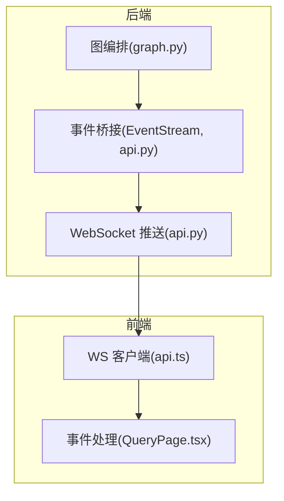
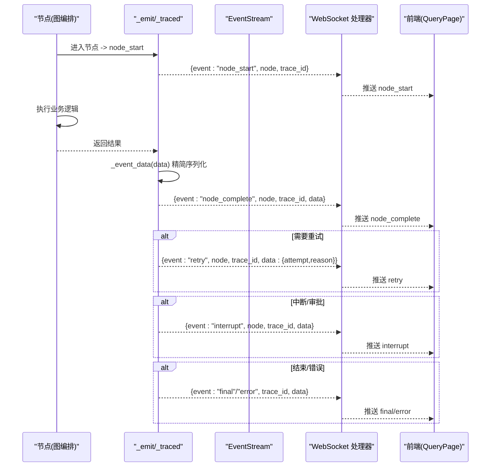
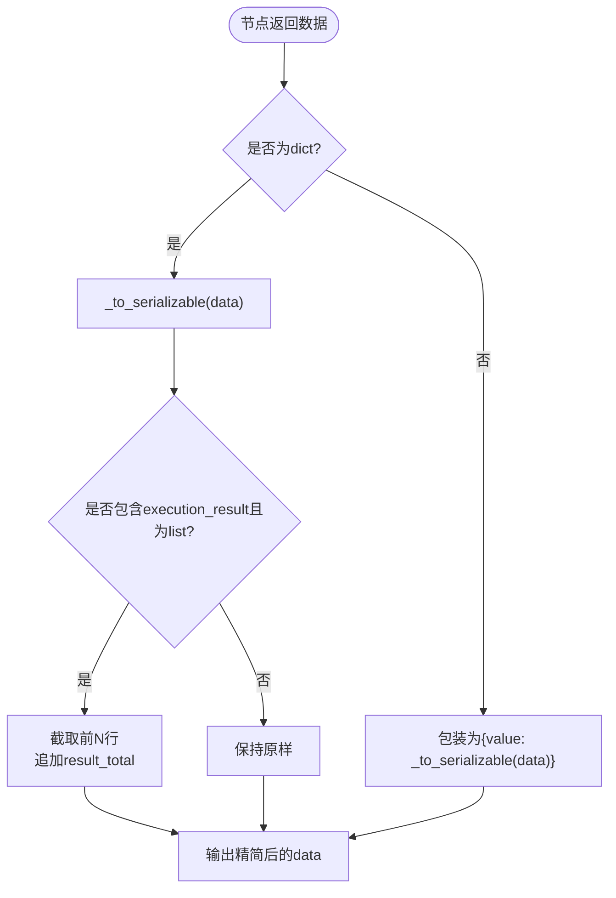
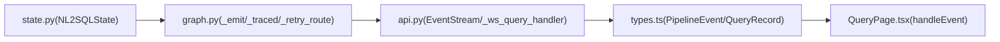

# 事件类型与数据结构

<cite>
**本文引用的文件**   
- [graph.py](file://nl2sql_agent/graph.py)
- [state.py](file://nl2sql_agent/state.py)
- [api.py](file://nl2sql_agent/api.py)
- [types.ts](file://web/src/types.ts)
- [QueryPage.tsx](file://web/src/pages/QueryPage.tsx)
- [api.ts](file://web/src/api.ts)
</cite>

## 目录
1. [简介](#简介)
2. [项目结构](#项目结构)
3. [核心组件](#核心组件)
4. [架构总览](#架构总览)
5. [详细组件分析](#详细组件分析)
6. [依赖关系分析](#依赖关系分析)
7. [性能考量](#性能考量)
8. [故障排查指南](#故障排查指南)
9. [结论](#结论)
10. [附录](#附录)

## 简介
本文件面向 NL2SQL 系统的事件体系，系统化梳理所有事件类型的定义、触发时机与用途，并详细说明每个事件的数据结构与序列化过程。文档还涵盖事件监听与处理的最佳实践（含错误处理与重试逻辑）、事件流追踪与调试方法，以及自定义事件的扩展方式，帮助读者快速理解并安全地扩展事件机制。

## 项目结构
事件机制贯穿后端图编排、WebSocket 流式推送、前端状态更新三个层面：
- 后端图编排层负责在节点执行前后产生事件，并通过 sink 回调统一输出。
- API 层通过 EventStream 将同步线程产生的事件桥接到异步 WebSocket 协程。
- 前端通过 WebSocket 接收事件，按 event 类型更新 UI 状态与步骤卡片。

图表来源
- [graph.py:72-103](file://nl2sql_agent/graph.py#L72-L103)
- [api.py:54-65](file://nl2sql_agent/api.py#L54-L65)
- [api.ts:31-49](file://web/src/api.ts#L31-L49)
- [QueryPage.tsx:291-333](file://web/src/pages/QueryPage.tsx#L291-L333)

章节来源
- [graph.py:72-103](file://nl2sql_agent/graph.py#L72-L103)
- [api.py:54-65](file://nl2sql_agent/api.py#L54-L65)
- [api.ts:31-49](file://web/src/api.ts#L31-L49)
- [QueryPage.tsx:291-333](file://web/src/pages/QueryPage.tsx#L291-L333)

## 核心组件
- 事件发射器：_emit 函数统一构造事件对象并调用 sink；异常被吞掉以保证流程不中断。
- 节点追踪器：_traced 包装每个节点，自动发送 node_start/node_complete，并记录延迟与顺序。
- 重试路由包装：_retry_route 在决定重试时发送 retry 事件，包含 attempt 与 reason。
- 事件数据精简：_event_data 对返回数据进行 Pydantic 序列化与结果集截断，避免刷屏。
- 事件桥接：EventStream 提供线程安全的队列，将同步线程事件投递到 asyncio 事件循环。
- WebSocket 推送：_ws_query_handler 持续从队列取事件并转发给前端，支持 ping 保活与恢复。
- 前端事件处理：QueryPage.tsx 根据 event 类型更新步骤状态、重试历史、中断与最终结果。

章节来源
- [graph.py:60-126](file://nl2sql_agent/graph.py#L60-L126)
- [api.py:54-65](file://nl2sql_agent/api.py#L54-L65)
- [api.py:161-210](file://nl2sql_agent/api.py#L161-L210)
- [QueryPage.tsx:291-333](file://web/src/pages/QueryPage.tsx#L291-L333)

## 架构总览
下图展示了事件从节点执行到前端渲染的完整链路，包括关键事件类型与字段传递。

图表来源
- [graph.py:72-126](file://nl2sql_agent/graph.py#L72-L126)
- [api.py:161-210](file://nl2sql_agent/api.py#L161-L210)
- [QueryPage.tsx:291-333](file://web/src/pages/QueryPage.tsx#L291-L333)

## 详细组件分析

### 事件类型与触发时机
- trace
  - 触发时机：WebSocket 连接建立后，服务端生成或复用 trace_id 并立即推送。
  - 用途：为后续所有事件提供唯一会话标识。
  - 字段：event="trace", trace_id, node=null。
- node_start
  - 触发时机：每个节点开始执行前由 _traced 自动发送。
  - 用途：前端标记节点进入“运行中”状态。
  - 字段：event="node_start", node, trace_id。
- node_complete
  - 触发时机：节点执行完成后由 _traced 自动发送。
  - 用途：前端更新节点结果为“完成”，并展示 data。
  - 字段：event="node_complete", node, trace_id, data（已精简序列化）。
- retry
  - 触发时机：路由判定需要重试时由 _retry_route 发送。
  - 用途：前端记录重试次数与原因，保持节点处于“运行中”。
  - 字段：event="retry", node, trace_id, data:{attempt, reason}。
- interrupt
  - 触发时机：流程被中断（如人工确认、候选澄清、低置信提示）时由 WS 处理器发送。
  - 用途：前端切换到“待审批/待澄清”状态，展示对应节点数据。
  - 字段：event="interrupt", node, trace_id, data。
- final
  - 触发时机：查询成功结束时由 WS 处理器发送。
  - 用途：前端切换状态为“完成”，并渲染最终结果与链路信息。
  - 字段：event="final", trace_id, data（包含 trace_steps、node_latencies 等）。
- error
  - 触发时机：发生不可恢复错误时由 WS 处理器发送。
  - 用途：前端切换状态为“错误”。
  - 字段：event="error", trace_id, message?。
- done
  - 触发时机：部分场景用于表示流程结束（例如非中断路径）。
  - 用途：前端收尾处理。
  - 字段：event="done", trace_id, data?。
- ping
  - 触发时机：WS 长时间无事件时定时发送。
  - 用途：心跳保活，防止连接超时断开。
  - 字段：event="ping", trace_id。
- restore
  - 触发时机：断线重连时，若存在未完成的查询，服务端推送当前快照。
  - 用途：前端恢复本地会话状态，无需重新发起查询。
  - 字段：event="restore", trace_id, data（快照）。

章节来源
- [api.py:161-210](file://nl2sql_agent/api.py#L161-L210)
- [graph.py:72-126](file://nl2sql_agent/graph.py#L72-L126)
- [types.ts:37-54](file://web/src/types.ts#L37-L54)

### 事件数据结构与字段说明
- 通用字段
  - event: 事件类型字符串，限定于上述集合。
  - node: 节点名称（与后端节点名一致），可为空（如 trace/final/error）。
  - trace_id: 会话唯一标识，贯穿整个生命周期。
  - data: 事件相关数据，具体结构随事件类型变化。
  - message: 可选消息文本，用于错误提示等。
- 各事件 data 典型结构
  - node_complete.data: 节点返回值，经 _event_data 精简序列化；execution_result 列表会被截断至前若干行，并附带 result_total。
  - retry.data: {attempt: number, reason: string}。
  - interrupt.data: 中断上下文（如 human_review/candidates/low_confidence 所需数据）。
  - final.data: 包含 trace_steps、node_latencies、执行结果摘要等。
  - restore.data: 查询快照（与 QueryRecord 对齐）。

章节来源
- [graph.py:60-85](file://nl2sql_agent/graph.py#L60-L85)
- [graph.py:106-126](file://nl2sql_agent/graph.py#L106-L126)
- [api.py:161-210](file://nl2sql_agent/api.py#L161-L210)
- [types.ts:37-54](file://web/src/types.ts#L37-L54)

### 事件数据的序列化与精简策略
- Pydantic 模型转换
  - 使用 _to_serializable 递归将 Pydantic 模型与嵌套结构转换为可 JSON 序列化的 dict。
  - 针对 BaseModel 实例调用 model_dump()，对 list/tuple 进行元素级递归转换。
- 数据精简
  - execution_result 列表被限制为前若干行，并追加 result_total 以告知总量，避免前端刷屏。
  - 其他字段按需保留，确保传输体积可控。
- 落库序列化
  - _state_to_dict 将 state(values) 转为字典，Pydantic 字段通过 model_dump() 序列化，便于持久化与 REST 响应。

图表来源
- [graph.py:47-69](file://nl2sql_agent/graph.py#L47-L69)
- [api.py:68-98](file://nl2sql_agent/api.py#L68-L98)

章节来源
- [graph.py:47-69](file://nl2sql_agent/graph.py#L47-L69)
- [api.py:68-98](file://nl2sql_agent/api.py#L68-L98)

### 事件监听与处理最佳实践
- 后端
  - 使用 _emit 统一封装事件发送，确保异常不影响主流程。
  - 通过 _traced 自动注入 node_start/node_complete，避免遗漏。
  - 使用 _retry_route 在路由决策处发送 retry 事件，保证前端可见的重试语义。
  - EventStream 提供线程安全队列，避免跨线程并发问题。
- 前端
  - 在 handleEvent 中对每种 event 做分支处理，确保未知事件被忽略而非崩溃。
  - 对 node_start/node_complete 维护 steps 的状态与重试历史。
  - 对 interrupt 切换 pending_review 状态，并轮询恢复。
  - 对 final/error 设置终态，停止轮询。
  - 使用 ws.onerror/onclose 做好连接异常处理与资源释放。

章节来源
- [graph.py:72-126](file://nl2sql_agent/graph.py#L72-L126)
- [api.py:54-65](file://nl2sql_agent/api.py#L54-L65)
- [QueryPage.tsx:291-333](file://web/src/pages/QueryPage.tsx#L291-L333)
- [api.ts:31-49](file://web/src/api.ts#L31-L49)

### 事件流追踪与调试方法
- 链路追踪
  - trace_steps：记录节点执行顺序，便于定位问题节点。
  - node_latencies：记录每个节点的耗时（毫秒），用于性能分析。
  - trace_id：贯穿全链路的唯一标识，便于日志关联。
- 调试建议
  - 在后端打印关键事件（如 retry.reason、blocked_reason、execution_error）。
  - 在前端控制台输出收到的事件，核对 data 结构是否符合预期。
  - 使用 /api/query/{trace_id} 拉取历史快照，对比 trace_steps 与 node_latencies。
  - 对于中断场景，检查 next_node 与 resume 参数是否正确。

章节来源
- [state.py:143-146](file://nl2sql_agent/state.py#L143-L146)
- [api.py:266-271](file://nl2sql_agent/api.py#L266-L271)
- [QueryPage.tsx:359-392](file://web/src/pages/QueryPage.tsx#L359-L392)

### 自定义事件的扩展方式
- 后端扩展
  - 在需要的地方调用 _emit(sink, "your_event", node, trace_id, data)，遵循统一字段约定。
  - 若涉及重试语义，参考 _retry_route 模式，在路由函数中插入事件推送。
  - 确保 data 经过 _event_data 处理，避免大对象或不可序列化类型。
- 前端扩展
  - 在 types.ts 的 PipelineEvent.event 联合类型中添加新事件名。
  - 在 QueryPage.tsx 的 handleEvent switch 中新增分支处理逻辑。
  - 若需要轮询或特殊 UI 行为，确保与现有状态机兼容。

章节来源
- [graph.py:72-85](file://nl2sql_agent/graph.py#L72-L85)
- [graph.py:106-126](file://nl2sql_agent/graph.py#L106-L126)
- [types.ts:37-54](file://web/src/types.ts#L37-L54)
- [QueryPage.tsx:291-333](file://web/src/pages/QueryPage.tsx#L291-L333)

## 依赖关系分析
事件机制的关键依赖如下：
- graph.py 依赖 state.py 中的 NL2SQLState 与各类模型，用于序列化与校验。
- api.py 依赖 graph.py 的 build_graph 与 event_sink 回调，实现事件桥接与 WS 推送。
- 前端 types.ts 定义 PipelineEvent 与 QueryRecord，与后端状态对齐。
- QueryPage.tsx 消费 PipelineEvent，驱动 UI 状态更新。

图表来源
- [state.py:83-146](file://nl2sql_agent/state.py#L83-L146)
- [graph.py:72-126](file://nl2sql_agent/graph.py#L72-L126)
- [api.py:54-65](file://nl2sql_agent/api.py#L54-L65)
- [types.ts:37-54](file://web/src/types.ts#L37-L54)
- [QueryPage.tsx:291-333](file://web/src/pages/QueryPage.tsx#L291-L333)

章节来源
- [state.py:83-146](file://nl2sql_agent/state.py#L83-L146)
- [graph.py:72-126](file://nl2sql_agent/graph.py#L72-L126)
- [api.py:54-65](file://nl2sql_agent/api.py#L54-L65)
- [types.ts:37-54](file://web/src/types.ts#L37-L54)
- [QueryPage.tsx:291-333](file://web/src/pages/QueryPage.tsx#L291-L333)

## 性能考量
- 事件推送失败不影响主流程：_emit 捕获异常，避免阻塞节点执行。
- 数据精简：execution_result 截断与 Pydantic 序列化减少网络负载。
- 心跳保活：ping 事件防止长连接超时。
- 断线恢复：restore 事件避免重复计算，提升用户体验。
- 重试上限：plan_retry_count 与 retry_count 控制回环次数，防止死循环。

[本节为通用指导，不直接分析具体文件]

## 故障排查指南
- 常见问题
  - 前端未收到事件：检查 WS 连接是否正常，确认 _ws_query_handler 是否启动。
  - 事件 data 为空：确认节点返回值是否为 dict，必要时使用 _event_data 包装。
  - 重试无限循环：检查路由函数与 max_retries/max_plan_retries 配置。
  - 中断无法恢复：确认 next_node 与 resume 参数匹配。
- 调试步骤
  - 在后端打印事件与 state 快照，比对 trace_steps 与 node_latencies。
  - 在前端控制台输出事件，核对 event 类型与 data 结构。
  - 使用 /api/query/{trace_id} 获取历史快照，验证状态一致性。

章节来源
- [graph.py:72-85](file://nl2sql_agent/graph.py#L72-L85)
- [api.py:161-210](file://nl2sql_agent/api.py#L161-L210)
- [QueryPage.tsx:359-392](file://web/src/pages/QueryPage.tsx#L359-L392)

## 结论
NL2SQL 系统的事件机制通过统一的 _emit 接口、节点追踪器与事件桥接，实现了端到端的实时事件流。事件类型覆盖节点生命周期、重试、中断与终态，数据结构清晰且经过精简序列化。前端基于 PipelineEvent 类型定义与 handleEvent 逻辑，能够稳定地驱动 UI 状态。通过链路追踪与调试方法，开发者可以快速定位问题并扩展自定义事件。

[本节为总结性内容，不直接分析具体文件]

## 附录
- 事件类型速查表
  - trace: 会话初始化，包含 trace_id。
  - node_start/node_complete: 节点执行起止，包含 node 与 data。
  - retry: 重试决策，包含 attempt 与 reason。
  - interrupt: 中断请求，包含 node 与上下文数据。
  - final/error/done/ping/restore: 终态、错误、心跳与恢复。
- 关键字段说明
  - trace_id: 全局唯一会话标识。
  - node: 节点名称，与后端节点一致。
  - data: 事件数据，经 _event_data 精简序列化。
  - trace_steps/node_latencies: 链路追踪与性能指标。

[本节为补充信息，不直接分析具体文件]