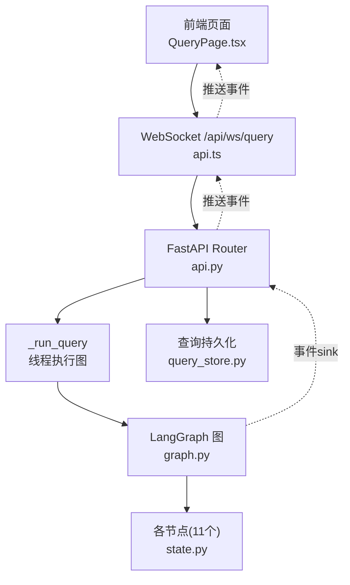
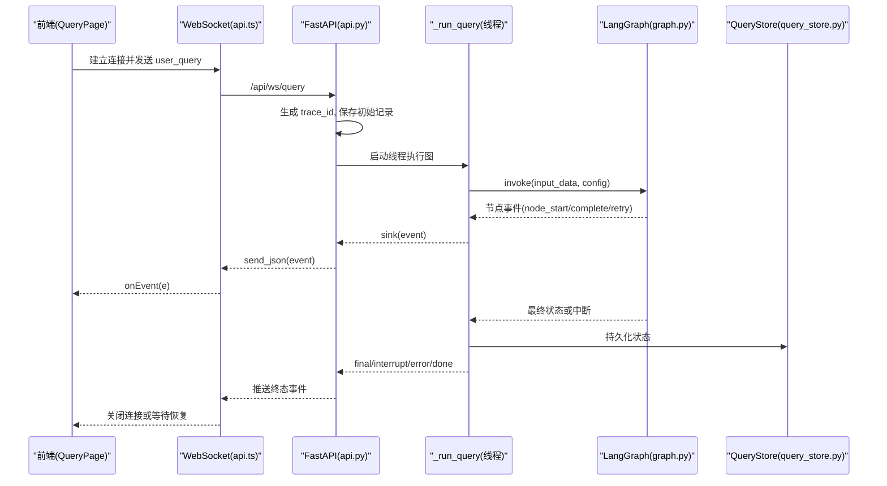
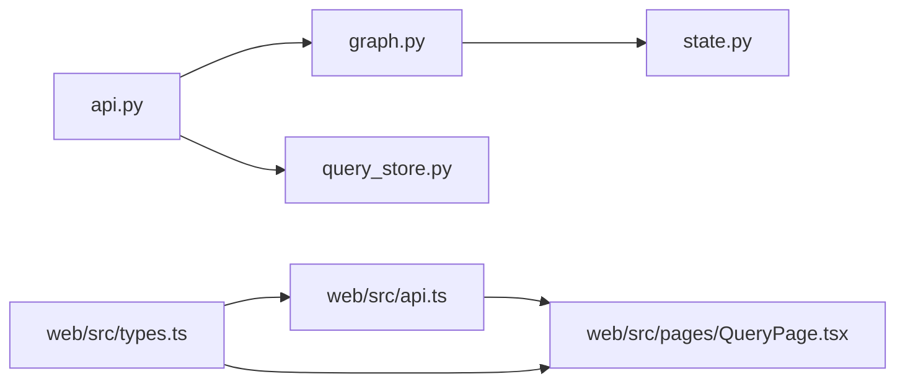

# 事件驱动架构

<cite>
**本文引用的文件**   
- [nl2sql_agent/api.py](file://nl2sql_agent/api.py)
- [nl2sql_agent/graph.py](file://nl2sql_agent/graph.py)
- [nl2sql_agent/state.py](file://nl2sql_agent/state.py)
- [nl2sql_agent/services/query_store.py](file://nl2sql_agent/services/query_store.py)
- [web/src/api.ts](file://web/src/api.ts)
- [web/src/types.ts](file://web/src/types.ts)
- [web/src/pages/QueryPage.tsx](file://web/src/pages/QueryPage.tsx)
- [web/src/components/StepCards.tsx](file://web/src/components/StepCards.tsx)
</cite>

## 目录
1. [简介](#简介)
2. [项目结构](#项目结构)
3. [核心组件](#核心组件)
4. [架构总览](#架构总览)
5. [详细组件分析](#详细组件分析)
6. [依赖关系分析](#依赖关系分析)
7. [性能考量](#性能考量)
8. [故障排查指南](#故障排查指南)
9. [结论](#结论)
10. [附录：扩展点与自定义事件](#附录扩展点与自定义事件)

## 简介
本文件面向 NL2SQL 系统的事件驱动架构，重点说明基于 WebSocket 的实时通信机制、事件类型定义、数据结构设计、事件流追踪与调试方法、前端事件处理逻辑，以及可扩展的事件体系与错误处理、性能优化实践。读者无需深入源码即可理解整体流程与扩展方式。

## 项目结构
后端以 FastAPI 提供 REST 与 WebSocket 接口；LangGraph 编排 11 个节点构成查询流水线；事件通过线程桥接从同步执行线程推送到异步 WebSocket 队列；前端使用 React + Ant Design 消费事件并渲染步骤卡片、重试时间线、结果表格等。

图表来源
- [nl2sql_agent/api.py:161-221](file://nl2sql_agent/api.py#L161-L221)
- [nl2sql_agent/graph.py:174-312](file://nl2sql_agent/graph.py#L174-L312)
- [web/src/api.ts:31-49](file://web/src/api.ts#L31-L49)
- [web/src/pages/QueryPage.tsx:291-333](file://web/src/pages/QueryPage.tsx#L291-L333)

章节来源
- [nl2sql_agent/api.py:1-573](file://nl2sql_agent/api.py#L1-L573)
- [nl2sql_agent/graph.py:1-313](file://nl2sql_agent/graph.py#L1-L313)
- [web/src/api.ts:1-50](file://web/src/api.ts#L1-L50)
- [web/src/types.ts:1-72](file://web/src/types.ts#L1-L72)

## 核心组件
- 事件桥 EventStream：将同步线程中的事件安全投递到 asyncio 队列，供 WebSocket 协程消费。
- 查询执行器 _run_query：在独立线程中运行 LangGraph 图，按阶段推送 final/interrupt/error/done 并落库。
- 图构建 build_graph：组装 11 个节点、路由与中断点，并通过 _traced/_retry_route 注入 node_start/node_complete/retry 事件。
- 状态模型 NL2SQLState：统一描述查询生命周期中的字段（检索、计划、校验、敏感判定、执行、解释、追踪）。
- 持久化 QueryStore：SQLite 存储查询记录、审批、反馈，支持断线重连恢复。
- 前端事件处理 submitQuery/handleEvent：建立 WS、解析事件、维护会话状态、渲染步骤卡片与重试时间线。

章节来源
- [nl2sql_agent/api.py:54-66](file://nl2sql_agent/api.py#L54-L66)
- [nl2sql_agent/api.py:134-157](file://nl2sql_agent/api.py#L134-L157)
- [nl2sql_agent/graph.py:88-126](file://nl2sql_agent/graph.py#L88-L126)
- [nl2sql_agent/state.py:83-146](file://nl2sql_agent/state.py#L83-L146)
- [nl2sql_agent/services/query_store.py:31-95](file://nl2sql_agent/services/query_store.py#L31-L95)
- [web/src/api.ts:31-49](file://web/src/api.ts#L31-L49)
- [web/src/pages/QueryPage.tsx:291-333](file://web/src/pages/QueryPage.tsx#L291-L333)

## 架构总览
下图展示一次查询从前端发起、经 WebSocket 进入后端、在 LangGraph 中流转、事件回推到前端的完整时序。

图表来源
- [nl2sql_agent/api.py:161-221](file://nl2sql_agent/api.py#L161-L221)
- [nl2sql_agent/api.py:134-157](file://nl2sql_agent/api.py#L134-L157)
- [nl2sql_agent/graph.py:174-312](file://nl2sql_agent/graph.py#L174-L312)
- [web/src/api.ts:31-49](file://web/src/api.ts#L31-L49)
- [web/src/pages/QueryPage.tsx:291-333](file://web/src/pages/QueryPage.tsx#L291-L333)

## 详细组件分析

### WebSocket 实时通信机制
- 连接管理
  - 前端通过 ws/wss 连接到 /api/ws/query，打开后发送 JSON 请求体（user_query/user_id/data_scope/conversation_history/trace_id）。
  - 后端接受连接后立即返回 trace 事件，包含本次会话的 trace_id。
- 事件推送
  - 后端在独立线程执行图，通过 EventStream.emit 将事件放入 asyncio.Queue，WS 协程轮询 get() 并 send_json。
  - 心跳 ping：若 60 秒无事件则发送 ping 保持连接活跃。
- 断线重连与恢复
  - 若 trace_id 已存在且处于 pending_review/done/blocked/rejected，直接推送对应事件并关闭连接，前端据此渲染历史状态。
  - 其他中间状态返回 restore 事件，提示前端可继续轮询。
- 消息格式
  - 所有事件为 JSON，包含 event、trace_id，部分事件含 node、data、message。
  - 事件类型见“事件类型与数据结构”。

章节来源
- [web/src/api.ts:31-49](file://web/src/api.ts#L31-L49)
- [nl2sql_agent/api.py:161-221](file://nl2sql_agent/api.py#L161-L221)
- [nl2sql_agent/api.py:197-210](file://nl2sql_agent/api.py#L197-L210)

### 事件类型定义与数据结构
- 事件类型
  - trace：分配 trace_id
  - node_start：节点开始
  - node_complete：节点完成
  - retry：触发重试（含 attempt、reason）
  - interrupt：流程暂停（人工确认/候选澄清/低置信澄清）
  - final：最终结果（包含完整 state 快照）
  - error：异常（含 message）
  - done：流程结束（用于清理）
  - ping：心跳保活
  - restore：断线恢复提示
- 数据结构
  - PipelineEvent：event/node/trace_id/data/message
  - 数据载荷 data 通常由 _state_to_dict 序列化，包含 generated_sql、plan、retrieved_schema、execution_result、final_answer、trace_steps、node_latencies、retry_count、plan_retry_count、blocked_reason、is_sensitive、risk_decision、human_approved、retrieval_confidence、retrieval_candidates、clarification_reason、low_confidence_flag 等。

章节来源
- [web/src/types.ts:37-54](file://web/src/types.ts#L37-L54)
- [nl2sql_agent/api.py:68-98](file://nl2sql_agent/api.py#L68-L98)
- [nl2sql_agent/api.py:145-156](file://nl2sql_agent/api.py#L145-L156)

### 事件流的追踪与调试
- 追踪字段
  - trace_id：会话唯一标识
  - trace_steps：节点执行顺序
  - node_latencies：各节点耗时（毫秒）
  - retry_count/plan_retry_count：重试次数
- 调试手段
  - 前端右侧面板显示 trace_id、状态、执行步骤、各节点耗时。
  - 历史页可按用户/业务线/时间范围筛选，点击条目拉取最新状态。
  - 审计接口 /api/audit/{trace_id} 返回记录及反馈列表。

章节来源
- [web/src/pages/QueryPage.tsx:527-570](file://web/src/pages/QueryPage.tsx#L527-L570)
- [nl2sql_agent/api.py:372-378](file://nl2sql_agent/api.py#L372-L378)
- [nl2sql_agent/services/query_store.py:146-172](file://nl2sql_agent/services/query_store.py#L146-L172)

### 前端事件处理逻辑
- 连接与发送
  - submitQuery 创建 WS，onopen 发送输入，onmessage 解析为 PipelineEvent 调用 onEvent。
- 事件分发 handleEvent
  - node_start：标记节点 running
  - node_complete：标记节点 done，写入 data
  - retry：追加重试记录
  - interrupt：设置 next_node 并切换状态为 pending_review
  - final：根据 data 重建 stepsFromState，更新 trace_steps/node_latencies
  - error：切换状态为 error
- 交互与恢复
  - 对 pending_review 会话轮询 /api/query/{trace_id}，直到 done/error/pending_review(next_node)。
  - resume 接口提交恢复值（如选定表、是否继续），后台恢复执行。

章节来源
- [web/src/api.ts:31-49](file://web/src/api.ts#L31-L49)
- [web/src/pages/QueryPage.tsx:291-333](file://web/src/pages/QueryPage.tsx#L291-L333)
- [web/src/pages/QueryPage.tsx:359-402](file://web/src/pages/QueryPage.tsx#L359-L402)

### 图与节点事件注入
- 节点包装 _traced
  - 在每个节点前后分别推送 node_start 与 node_complete，并累计 latency 与 trace_steps。
- 重试路由 _retry_route
  - 当路由返回 retry 时，推送 retry 事件，携带 attempt 与 reason。
- 中断与终态
  - 图编译时声明 interrupt_before 节点，运行时若 snap.next 非空，则推送 interrupt 并持久化 pending_review。
  - 正常结束时推送 final，并持久化 done/blocked。

章节来源
- [nl2sql_agent/graph.py:88-126](file://nl2sql_agent/graph.py#L88-L126)
- [nl2sql_agent/graph.py:174-312](file://nl2sql_agent/graph.py#L174-L312)
- [nl2sql_agent/api.py:134-157](file://nl2sql_agent/api.py#L134-L157)

### 状态模型与数据流
- NL2SQLState 字段覆盖意图澄清、Schema 检索、复杂度判断、计划、SQL 生成与校验、敏感判定、执行与解释、身份权限、追踪字段。
- _state_to_dict 将 Pydantic 对象序列化为 JSON 安全的字典，并对 execution_result 做截断避免刷屏。

章节来源
- [nl2sql_agent/state.py:83-146](file://nl2sql_agent/state.py#L83-L146)
- [nl2sql_agent/api.py:68-98](file://nl2sql_agent/api.py#L68-L98)

### 持久化与恢复
- QueryStore 维护 queries 与 feedbacks 两张表，支持插入/更新/查询/分页/条件过滤。
- 断线重连时，根据 trace_id 读取记录，推送相应事件，前端据此渲染历史状态。

章节来源
- [nl2sql_agent/services/query_store.py:31-95](file://nl2sql_agent/services/query_store.py#L31-L95)
- [nl2sql_agent/services/query_store.py:141-172](file://nl2sql_agent/services/query_store.py#L141-L172)
- [nl2sql_agent/api.py:165-180](file://nl2sql_agent/api.py#L165-L180)

## 依赖关系分析
- 模块耦合
  - api.py 依赖 graph.py（构建图）、services/query_store.py（持久化）、services/deps.py（依赖注入与环境加载）。
  - graph.py 依赖 state.py（状态模型）与各 nodes 模块。
  - 前端依赖 types.ts 定义共享类型，api.ts 封装 WS 与 HTTP 请求，QueryPage.tsx 实现事件处理与 UI。
- 外部依赖
  - FastAPI、LangGraph、Pydantic、SQLite。

图表来源
- [nl2sql_agent/api.py:1-573](file://nl2sql_agent/api.py#L1-L573)
- [nl2sql_agent/graph.py:1-313](file://nl2sql_agent/graph.py#L1-L313)
- [nl2sql_agent/state.py:1-146](file://nl2sql_agent/state.py#L1-L146)
- [web/src/api.ts:1-50](file://web/src/api.ts#L1-L50)
- [web/src/types.ts:1-72](file://web/src/types.ts#L1-L72)
- [web/src/pages/QueryPage.tsx:1-574](file://web/src/pages/QueryPage.tsx#L1-L574)

章节来源
- [nl2sql_agent/api.py:1-573](file://nl2sql_agent/api.py#L1-L573)
- [nl2sql_agent/graph.py:1-313](file://nl2sql_agent/graph.py#L1-L313)
- [web/src/api.ts:1-50](file://web/src/api.ts#L1-L50)
- [web/src/types.ts:1-72](file://web/src/types.ts#L1-L72)
- [web/src/pages/QueryPage.tsx:1-574](file://web/src/pages/QueryPage.tsx#L1-L574)

## 性能考量
- 事件推送
  - EventStream 使用 call_soon_threadsafe 避免跨线程阻塞，WS 侧采用超时 60 秒的 wait_for 与 ping 保活。
  - execution_result 在前端展示前进行截断，减少网络与渲染压力。
- 并发与资源
  - 查询执行在独立线程中进行，避免阻塞 FastAPI 事件循环。
  - SQLite 使用线程锁保护读写，避免并发写冲突。
- 重试策略
  - plan_validation 与 static_validation/sandbox_execution 均有限定最大重试次数，避免无限循环。
- 前端渲染
  - 步骤卡片按需渲染，仅显示有状态的节点；重试时间线折叠展示，降低视觉噪音。

[本节为通用指导，不直接分析具体文件]

## 故障排查指南
- 常见问题定位
  - 连接失败：检查前端协议 ws/wss 与后端端口，确认 CORS 配置允许开发服务器地址。
  - 事件缺失：查看后端日志与 _run_query 的 sink 调用，确认 EventStream 队列未阻塞。
  - 中断卡住：确认 next_node 是否为 human_review/clarify_candidates/clarify_low_confidence，检查 resume/approve 接口调用。
  - 数据不一致：通过 /api/query/{trace_id} 拉取最新记录，对比前端状态。
- 关键接口
  - /api/ws/query：事件流入口
  - /api/query/{trace_id}：查询状态
  - /api/query/{trace_id}/approve：人工确认
  - /api/query/{trace_id}/resume：通用恢复
  - /api/history：历史列表
  - /api/audit/{trace_id}：审计详情
- 调试技巧
  - 前端控制台打印 PipelineEvent 序列，核对 event/node/trace_id/data。
  - 后端打印 _run_query 的 sink 调用与异常堆栈。
  - 使用浏览器 Network 面板观察 WS 帧与 REST 响应。

章节来源
- [nl2sql_agent/api.py:161-221](file://nl2sql_agent/api.py#L161-L221)
- [nl2sql_agent/api.py:266-314](file://nl2sql_agent/api.py#L266-L314)
- [web/src/pages/QueryPage.tsx:359-402](file://web/src/pages/QueryPage.tsx#L359-L402)

## 结论
NL2SQL 的事件驱动架构通过 LangGraph 编排查询流水线，结合 FastAPI 的 WebSocket 与线程桥接，实现了高内聚、低耦合、可观测、可恢复的实时交互体验。事件类型清晰、数据结构规范、前端处理健壮，便于扩展新节点与自定义事件。

[本节为总结性内容，不直接分析具体文件]

## 附录：扩展点与自定义事件
- 新增节点
  - 在 graph.py 中添加节点与边，使用 _traced 包装以自动注入 node_start/node_complete。
  - 如需重试，使用 _retry_route 包装路由函数，确保推送 retry 事件。
- 自定义事件
  - 在节点内部或 _run_query 中通过 sink 推送自定义事件（例如 "custom_metric"），并在前端 handleEvent 中增加分支处理。
  - 注意保持 event/trace_id 必填，data/message 可选，避免破坏现有解析逻辑。
- 中断与恢复
  - 在 graph.compile 的 interrupt_before 中声明新的中断节点，_run_query 会推送 interrupt 并持久化 pending_review。
  - 前端通过 resume 接口传递恢复值，后端通过 Command(resume=...) 恢复执行。
- 数据模型扩展
  - 在 NL2SQLState 中新增字段，并在 _state_to_dict 中序列化，确保前端 types.ts 同步更新。
- 性能与安全
  - 对大数据量字段（如 execution_result）进行截断或分页。
  - 对敏感操作进行拦截与人工确认，避免危险 SQL 直接执行。

章节来源
- [nl2sql_agent/graph.py:88-126](file://nl2sql_agent/graph.py#L88-L126)
- [nl2sql_agent/graph.py:174-312](file://nl2sql_agent/graph.py#L174-L312)
- [nl2sql_agent/api.py:134-157](file://nl2sql_agent/api.py#L134-L157)
- [nl2sql_agent/state.py:83-146](file://nl2sql_agent/state.py#L83-L146)
- [web/src/types.ts:37-54](file://web/src/types.ts#L37-L54)