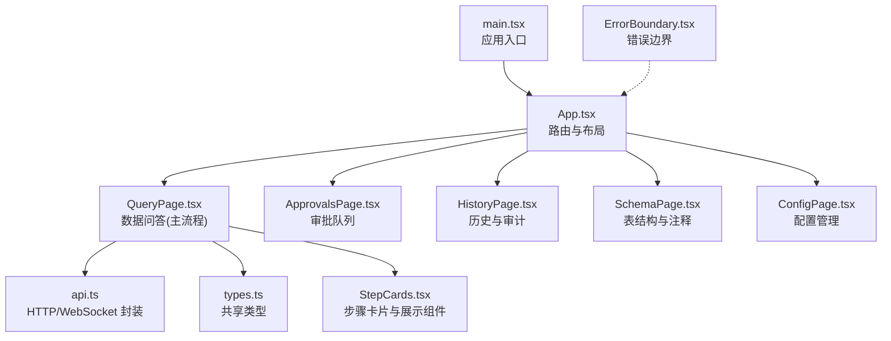
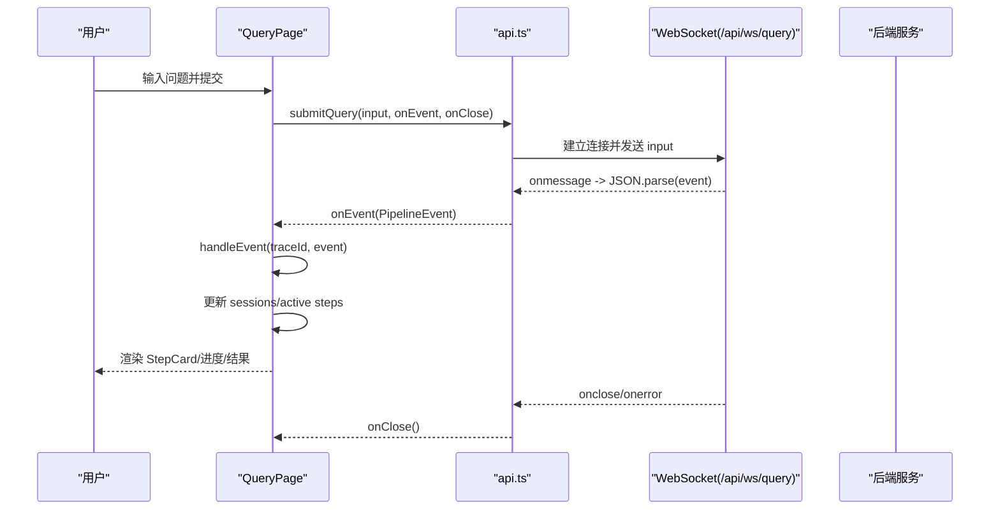
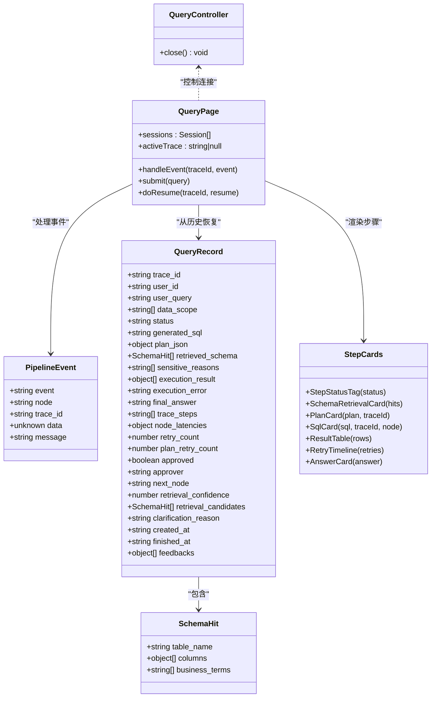
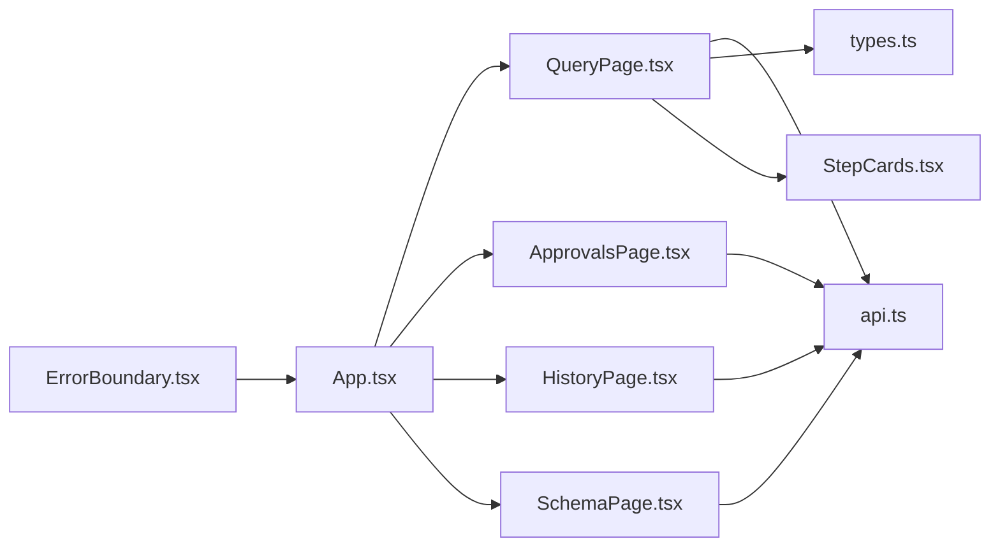

# 前端事件集成

<cite>
**本文引用的文件**   
- [web/src/App.tsx](file://web/src/App.tsx)
- [web/src/main.tsx](file://web/src/main.tsx)
- [web/src/api.ts](file://web/src/api.ts)
- [web/src/types.ts](file://web/src/types.ts)
- [web/src/pages/QueryPage.tsx](file://web/src/pages/QueryPage.tsx)
- [web/src/pages/ApprovalsPage.tsx](file://web/src/pages/ApprovalsPage.tsx)
- [web/src/pages/HistoryPage.tsx](file://web/src/pages/HistoryPage.tsx)
- [web/src/components/StepCards.tsx](file://web/src/components/StepCards.tsx)
- [web/src/components/ErrorBoundary.tsx](file://web/src/components/ErrorBoundary.tsx)
- [web/package.json](file://web/package.json)
</cite>

## 目录
1. [简介](#简介)
2. [项目结构](#项目结构)
3. [核心组件](#核心组件)
4. [架构总览](#架构总览)
5. [详细组件分析](#详细组件分析)
6. [依赖关系分析](#依赖关系分析)
7. [性能考虑](#性能考虑)
8. [故障排查指南](#故障排查指南)
9. [结论](#结论)
10. [附录：完整集成示例与常见问题](#附录完整集成示例与常见问题)

## 简介
本文件面向 NL2SQL 系统的前端开发者，系统化说明如何建立和维护 WebSocket 连接、处理实时事件、渲染流式查询结果、实现事件过滤与搜索，并提供性能优化建议与常见问题解决方案。文档基于仓库中的 React + Ant Design 前端代码进行梳理，确保所有描述均可追溯到具体源码位置。

## 项目结构
前端采用 React + Vite + TypeScript + Ant Design 构建，页面按功能模块划分，API 封装在统一文件中，类型定义集中管理，UI 组件复用度高。

图表来源
- [web/src/main.tsx:1-15](file://web/src/main.tsx#L1-L15)
- [web/src/App.tsx:1-58](file://web/src/App.tsx#L1-L58)
- [web/src/pages/QueryPage.tsx:1-574](file://web/src/pages/QueryPage.tsx#L1-L574)
- [web/src/pages/ApprovalsPage.tsx:1-223](file://web/src/pages/ApprovalsPage.tsx#L1-L223)
- [web/src/pages/HistoryPage.tsx:1-179](file://web/src/pages/HistoryPage.tsx#L1-L179)
- [web/src/pages/SchemaPage.tsx:1-355](file://web/src/pages/SchemaPage.tsx#L1-L355)
- [web/src/components/ErrorBoundary.tsx:1-37](file://web/src/components/ErrorBoundary.tsx#L1-L37)
- [web/src/api.ts:1-50](file://web/src/api.ts#L1-L50)
- [web/src/types.ts:1-72](file://web/src/types.ts#L1-L72)
- [web/src/components/StepCards.tsx:1-347](file://web/src/components/StepCards.tsx#L1-L347)

章节来源
- [web/src/main.tsx:1-15](file://web/src/main.tsx#L1-L15)
- [web/src/App.tsx:1-58](file://web/src/App.tsx#L1-L58)
- [web/package.json:1-26](file://web/package.json#L1-L26)

## 核心组件
- API 层：统一的 fetch 请求封装与 WebSocket 提交接口，负责连接后端 /api/ws/query 并转发 pipeline 事件。
- 类型层：前后端共享的 PipelineEvent、QueryRecord、SchemaHit 等类型，保证事件与状态一致性。
- 页面层：QueryPage 为核心交互页，维护会话状态、事件处理、轮询恢复、用户操作（如人工确认）。
- 组件层：StepCards 提供步骤卡片、SQL 高亮、结果表格、重试时间线、答案摘要等可复用 UI。
- 错误边界：全局捕获渲染异常，避免整页白屏。

章节来源
- [web/src/api.ts:1-50](file://web/src/api.ts#L1-L50)
- [web/src/types.ts:1-72](file://web/src/types.ts#L1-L72)
- [web/src/pages/QueryPage.tsx:1-574](file://web/src/pages/QueryPage.tsx#L1-L574)
- [web/src/components/StepCards.tsx:1-347](file://web/src/components/StepCards.tsx#L1-L347)
- [web/src/components/ErrorBoundary.tsx:1-37](file://web/src/components/ErrorBoundary.tsx#L1-L37)

## 架构总览
前端通过 submitQuery 建立 WebSocket 连接，将自然语言查询发送至后端；后端以 PipelineEvent 形式推送各节点执行状态与中间结果；QueryPage 根据事件更新本地 Session 状态，驱动 StepCard 渲染，形成“事件驱动”的实时界面。

图表来源
- [web/src/api.ts:30-49](file://web/src/api.ts#L30-L49)
- [web/src/pages/QueryPage.tsx:291-333](file://web/src/pages/QueryPage.tsx#L291-L333)

章节来源
- [web/src/api.ts:30-49](file://web/src/api.ts#L30-L49)
- [web/src/pages/QueryPage.tsx:291-333](file://web/src/pages/QueryPage.tsx#L291-L333)

## 详细组件分析

### WebSocket 连接与事件处理
- 连接建立：submitQuery 根据当前协议选择 ws/wss，连接 /api/ws/query，并在 onopen 时发送查询输入。
- 事件接收：onmessage 解析 JSON 为 PipelineEvent，调用上层 onEvent 回调。
- 关闭与错误：onclose 触发 onClose；onerror 直接关闭连接，由上层决定重连策略。
- 控制器返回：返回 QueryController.close 用于主动断开。

章节来源
- [web/src/api.ts:30-49](file://web/src/api.ts#L30-L49)

#### 事件处理与状态更新
- handleEvent 对 trace/node_start/node_complete/retry/interrupt/final/error 等事件进行分类处理，更新对应节点的 status/data/retries，以及整体 session 状态。
- 中断事件（human_review/clarify_candidates/clarify_low_confidence）会将会话置为 pending_review，等待用户操作或轮询恢复。
- final 事件会合并最终 state，重建 steps，并更新 trace_steps 与 node_latencies。

章节来源
- [web/src/pages/QueryPage.tsx:291-333](file://web/src/pages/QueryPage.tsx#L291-L333)

#### 自动重连与断线恢复
- 当前实现未内置自动重连逻辑；onerror 仅关闭连接。建议在 submitQuery 外层增加指数退避重连，或在 onclose 中根据 trace_id 拉取最新记录进行恢复。
- 历史恢复：openHistory 通过 /api/query/{trace_id} 获取完整记录，重建 Session，若处于 pending_review 则启动轮询 pollUntilDone。

章节来源
- [web/src/pages/QueryPage.tsx:359-392](file://web/src/pages/QueryPage.tsx#L359-L392)

#### 错误处理
- HTTP 错误：request 函数统一抛出包含 detail 的错误信息。
- WebSocket 错误：onerror 关闭连接；onmessage 解析失败被忽略，避免崩溃。
- 渲染错误：ErrorBoundary 捕获并显示堆栈，防止整页白屏。

章节来源
- [web/src/api.ts:3-13](file://web/src/api.ts#L3-L13)
- [web/src/components/ErrorBoundary.tsx:1-37](file://web/src/components/ErrorBoundary.tsx#L1-L37)

### 实时查询结果的展示机制
- 流式数据渲染：每个 PipelineEvent 都会触发一次状态更新，StepCard 即时反映节点运行、完成、重试、中断等状态。
- 进度指示：running 状态显示加载图标；整体运行态使用 Spin 与 Tag 提示当前节点标题。
- 错误提示：error 事件将会话状态置为 error，并展示错误卡片；节点级错误在 StepCard 内显示。
- 结果表格：sandbox_execution 节点完成后，ResultTable 动态生成列并分页展示。

章节来源
- [web/src/pages/QueryPage.tsx:464-501](file://web/src/pages/QueryPage.tsx#L464-L501)
- [web/src/components/StepCards.tsx:278-296](file://web/src/components/StepCards.tsx#L278-L296)

### 事件过滤与搜索
- 历史与审计：HistoryPage 支持按 user_id、business_line、时间范围筛选，并导出 CSV。
- 审批队列：ApprovalsPage 定时刷新列表，支持查看详情、通过/驳回操作。
- 查询页侧边栏：history 列表点击打开历史会话，支持快速定位 trace_id 对应的步骤。

章节来源
- [web/src/pages/HistoryPage.tsx:52-65](file://web/src/pages/HistoryPage.tsx#L52-L65)
- [web/src/pages/ApprovalsPage.tsx:42-51](file://web/src/pages/ApprovalsPage.tsx#L42-L51)
- [web/src/pages/QueryPage.tsx:418-439](file://web/src/pages/QueryPage.tsx#L418-L439)

### 用户界面响应与交互
- 人工确认：当 human_review/clarify_candidates/clarify_low_confidence 触发 interrupt，StepCard 展示相应按钮，调用 doResume 向后端提交 resume 指令。
- 反馈闭环：PlanCard/SqlCard 支持“理解不对/这个不对”反馈，提交到 /api/feedback，便于后续规则修正。
- 元信息与耗时：右侧面板展示 trace_id、状态、执行步骤顺序与各节点耗时。

章节来源
- [web/src/pages/QueryPage.tsx:394-408](file://web/src/pages/QueryPage.tsx#L394-L408)
- [web/src/components/StepCards.tsx:120-211](file://web/src/components/StepCards.tsx#L120-L211)
- [web/src/components/StepCards.tsx:215-274](file://web/src/components/StepCards.tsx#L215-L274)
- [web/src/pages/QueryPage.tsx:527-570](file://web/src/pages/QueryPage.tsx#L527-L570)

### 类图（关键数据结构与组件关系）

图表来源
- [web/src/types.ts:3-54](file://web/src/types.ts#L3-L54)
- [web/src/pages/QueryPage.tsx:39-54](file://web/src/pages/QueryPage.tsx#L39-L54)
- [web/src/components/StepCards.tsx:32-347](file://web/src/components/StepCards.tsx#L32-L347)
- [web/src/api.ts:26-28](file://web/src/api.ts#L26-L28)

## 依赖关系分析
- 页面依赖 api.ts 提供的 HTTP 与 WebSocket 能力。
- QueryPage 依赖 types.ts 的类型定义，确保事件与状态一致。
- StepCards 依赖 antd 组件库与 api.ts 的反馈接口。
- ErrorBoundary 作为全局包裹，提升鲁棒性。

图表来源
- [web/src/App.tsx:1-58](file://web/src/App.tsx#L1-L58)
- [web/src/pages/QueryPage.tsx:1-574](file://web/src/pages/QueryPage.tsx#L1-L574)
- [web/src/pages/ApprovalsPage.tsx:1-223](file://web/src/pages/ApprovalsPage.tsx#L1-L223)
- [web/src/pages/HistoryPage.tsx:1-179](file://web/src/pages/HistoryPage.tsx#L1-L179)
- [web/src/pages/SchemaPage.tsx:1-355](file://web/src/pages/SchemaPage.tsx#L1-L355)
- [web/src/api.ts:1-50](file://web/src/api.ts#L1-L50)
- [web/src/types.ts:1-72](file://web/src/types.ts#L1-L72)
- [web/src/components/StepCards.tsx:1-347](file://web/src/components/StepCards.tsx#L1-L347)
- [web/src/components/ErrorBoundary.tsx:1-37](file://web/src/components/ErrorBoundary.tsx#L1-L37)

章节来源
- [web/src/App.tsx:1-58](file://web/src/App.tsx#L1-L58)
- [web/src/api.ts:1-50](file://web/src/api.ts#L1-L50)
- [web/src/types.ts:1-72](file://web/src/types.ts#L1-L72)

## 性能考虑
- 事件去重：同一 trace_id 的事件应确保幂等处理，避免重复渲染；可在 handleEvent 中对相同节点状态变更做最小化更新。
- 内存管理：限制 sessions 数量，定期清理已完成的历史会话；避免长时间持有大对象引用。
- 虚拟滚动：当 history 列表或步骤卡片较多时，建议使用虚拟滚动（如 react-window）减少 DOM 节点数量。
- 批量更新：合并多次 setState 调用，降低重绘频率；对频繁更新的节点可使用 useRef 缓存中间结果。
- 网络优化：对轮询接口设置合理间隔（如 1.5s），避免频繁请求；必要时改用 SSE 或长轮询替代短轮询。

[本节为通用指导，不直接分析具体文件]

## 故障排查指南
- WebSocket 无法连接：检查浏览器控制台网络面板，确认 /api/ws/query 是否可达；确认协议 ws/wss 选择正确。
- 事件丢失或解析失败：onmessage 已忽略非法帧，需检查后端推送格式是否符合 PipelineEvent 定义。
- 页面白屏：ErrorBoundary 会捕获并显示错误堆栈，优先查看该区域信息。
- 审批卡住：确认 next_node 是否正确，轮询是否仍在运行；必要时手动刷新或重新打开历史会话。
- 反馈无效：检查 /api/feedback 接口是否成功，确认 trace_id 与 node 字段正确。

章节来源
- [web/src/api.ts:3-13](file://web/src/api.ts#L3-L13)
- [web/src/components/ErrorBoundary.tsx:1-37](file://web/src/components/ErrorBoundary.tsx#L1-L37)
- [web/src/pages/QueryPage.tsx:359-392](file://web/src/pages/QueryPage.tsx#L359-L392)

## 结论
NL2SQL 前端以事件驱动为核心，通过 WebSocket 实时接收后端 pipeline 事件，结合清晰的类型定义与可复用的步骤卡片组件，实现了流畅的交互式查询体验。当前实现已具备完整的实时渲染、人工确认与反馈闭环能力；建议在自动重连、内存管理与虚拟滚动方面进一步增强，以提升稳定性与性能。

[本节为总结，不直接分析具体文件]

## 附录：完整集成示例与常见问题

### 集成要点清单
- 建立连接：调用 submitQuery，传入 user_query、user_id、data_scope、trace_id。
- 事件处理：实现 onEvent，根据 event 类型更新状态与 UI。
- 关闭与重连：监听 onClose，必要时发起重连或恢复历史。
- 人工确认：在 interrupt 节点渲染操作按钮，调用 /api/query/{trace_id}/resume。
- 反馈闭环：在 PlanCard/SqlCard 中提交反馈至 /api/feedback。

章节来源
- [web/src/api.ts:30-49](file://web/src/api.ts#L30-L49)
- [web/src/pages/QueryPage.tsx:394-408](file://web/src/pages/QueryPage.tsx#L394-L408)
- [web/src/components/StepCards.tsx:120-211](file://web/src/components/StepCards.tsx#L120-L211)

### 常见问题与解决方案
- 问：如何实现自动重连？
  - 答：在 submitQuery 外层包装重连逻辑，依据 onclose 与 onerror 触发指数退避重连，并在重连后通过 /api/query/{trace_id} 恢复状态。
- 问：如何处理大量历史会话导致卡顿？
  - 答：限制 sessions 长度，使用虚拟滚动，按需加载详情。
- 问：如何过滤与搜索事件？
  - 答：在 HistoryPage 中按 user_id、business_line、时间范围筛选；在 QueryPage 侧边栏按 trace_id 快速定位。
- 问：如何展示流式结果？
  - 答：每个 PipelineEvent 触发一次状态更新，StepCard 即时渲染；ResultTable 动态生成列并分页。
- 问：如何避免重复渲染？
  - 答：对相同节点的状态变更做最小化更新，必要时使用 useMemo/useRef 缓存中间结果。

章节来源
- [web/src/pages/HistoryPage.tsx:52-65](file://web/src/pages/HistoryPage.tsx#L52-L65)
- [web/src/pages/QueryPage.tsx:418-439](file://web/src/pages/QueryPage.tsx#L418-L439)
- [web/src/components/StepCards.tsx:278-296](file://web/src/components/StepCards.tsx#L278-L296)