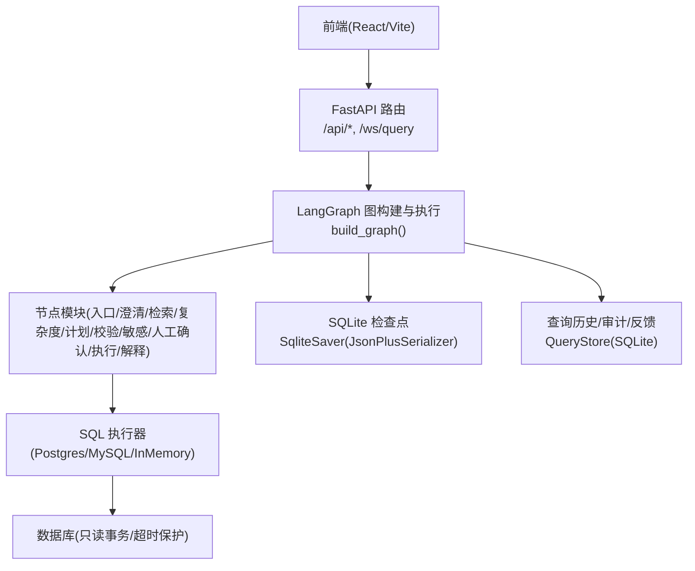
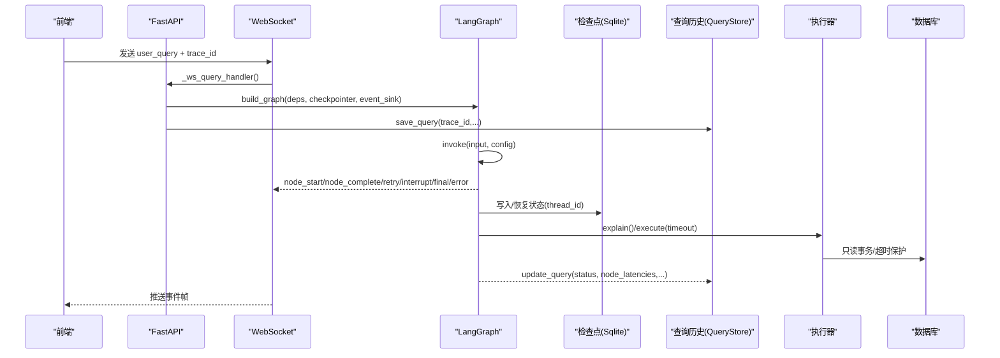
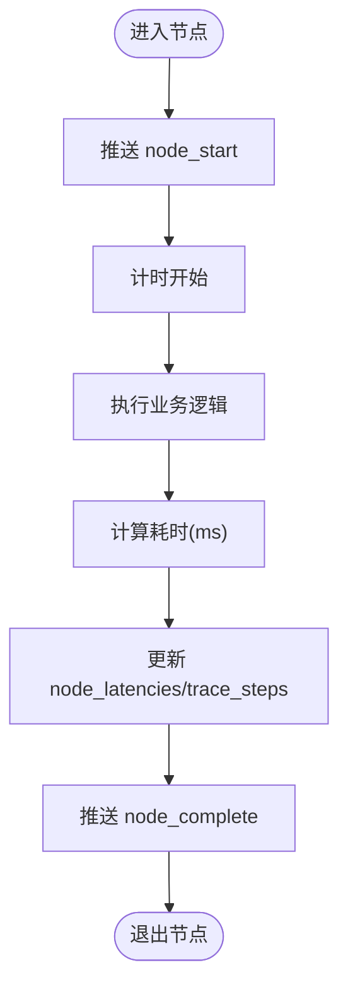
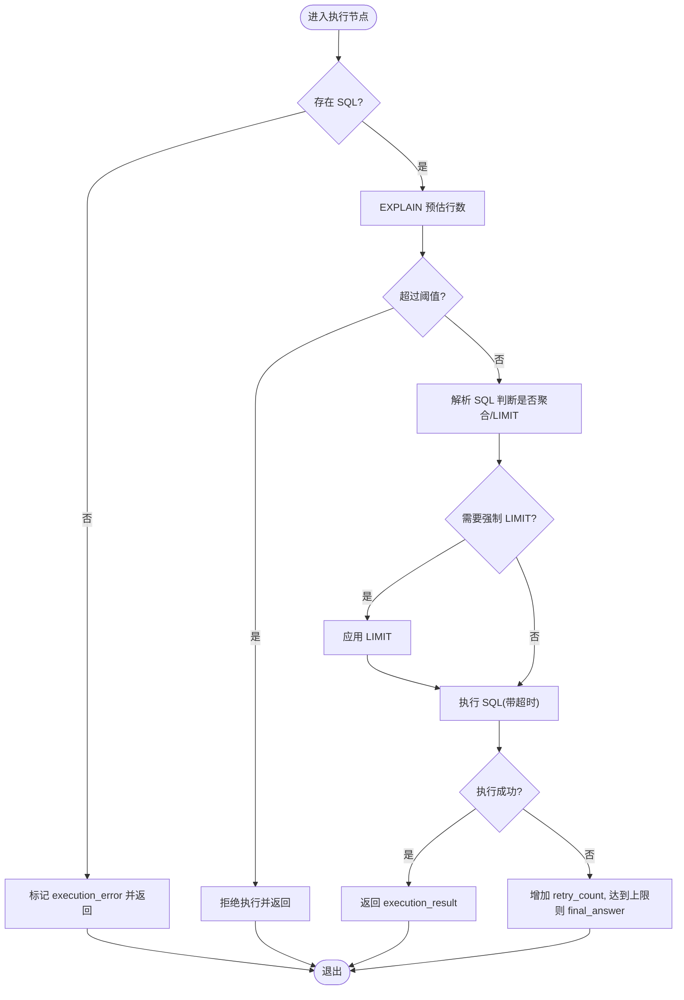
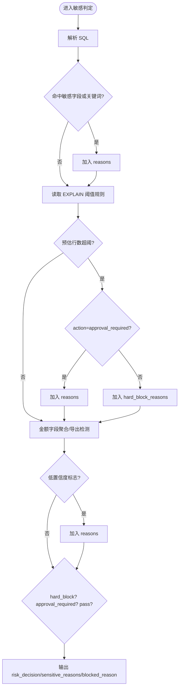
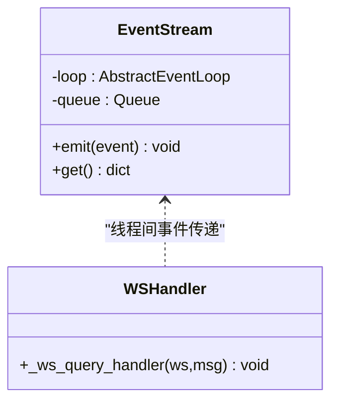
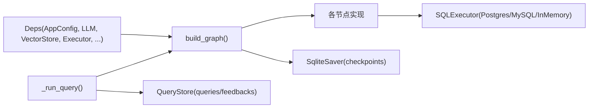
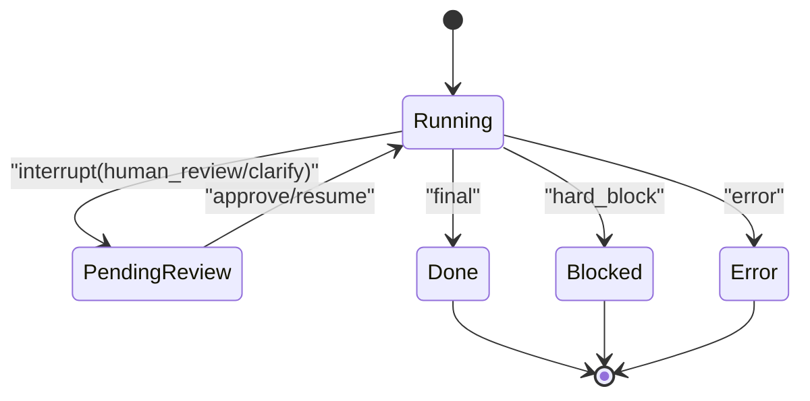

# 性能优化与监控

<cite>
**本文引用的文件**   
- [nl2sql_agent/main.py](file://nl2sql_agent/main.py)
- [nl2sql_agent/api.py](file://nl2sql_agent/api.py)
- [nl2sql_agent/graph.py](file://nl2sql_agent/graph.py)
- [nl2sql_agent/state.py](file://nl2sql_agent/state.py)
- [nl2sql_agent/services/checkpoint.py](file://nl2sql_agent/services/checkpoint.py)
- [nl2sql_agent/services/executor.py](file://nl2sql_agent/services/executor.py)
- [nl2sql_agent/services/query_store.py](file://nl2sql_agent/services/query_store.py)
- [nl2sql_agent/nodes/m10_sandbox_execution.py](file://nl2sql_agent/nodes/m10_sandbox_execution.py)
- [nl2sql_agent/nodes/m9_sensitive_check.py](file://nl2sql_agent/nodes/m9_sensitive_check.py)
- [web/src/pages/QueryPage.tsx](file://web/src/pages/QueryPage.tsx)
</cite>

## 目录
1. [简介](#简介)
2. [项目结构](#项目结构)
3. [核心组件](#核心组件)
4. [架构总览](#架构总览)
5. [详细组件分析](#详细组件分析)
6. [依赖关系分析](#依赖关系分析)
7. [性能考量与优化策略](#性能考量与优化策略)
8. [监控指标与事件流](#监控指标与事件流)
9. [检查点机制与恢复优化](#检查点机制与恢复优化)
10. [调试与诊断工具](#调试与诊断工具)
11. [生产环境告警与故障排查](#生产环境告警与故障排查)
12. [结论](#结论)

## 简介
本文件面向 NL2SQL 系统的事件驱动架构，聚焦性能优化与监控。内容涵盖：
- 事件处理瓶颈识别与优化（批处理、异步、内存管理）
- 事件流监控指标（延迟、吞吐、错误率）
- 检查点机制对性能的影响（状态持久化、恢复时间优化）
- 事件驱动的调试方法（日志、链路追踪、性能分析）
- 生产环境监控告警配置与故障排查指南

## 项目结构
NL2SQL 采用 FastAPI + LangGraph 的事件驱动图编排，结合 SQLite 检查点与查询历史存储，通过 WebSocket 向前端推送节点级事件，形成“请求→图执行→事件流→前端”的闭环。

**图表来源** 
- [nl2sql_agent/api.py:1-120](file://nl2sql_agent/api.py#L1-L120)
- [nl2sql_agent/graph.py:174-312](file://nl2sql_agent/graph.py#L174-L312)
- [nl2sql_agent/services/checkpoint.py:1-40](file://nl2sql_agent/services/checkpoint.py#L1-L40)
- [nl2sql_agent/services/query_store.py:1-120](file://nl2sql_agent/services/query_store.py#L1-L120)
- [nl2sql_agent/services/executor.py:53-159](file://nl2sql_agent/services/executor.py#L53-L159)

**章节来源**
- [nl2sql_agent/main.py:1-152](file://nl2sql_agent/main.py#L1-L152)
- [nl2sql_agent/api.py:1-120](file://nl2sql_agent/api.py#L1-L120)
- [nl2sql_agent/graph.py:174-312](file://nl2sql_agent/graph.py#L174-L312)

## 核心组件
- 事件桥接与流式推送：EventStream 将同步线程中的事件安全投递到 asyncio 队列，供 WebSocket 协程消费。
- 图编排与追踪：_traced 包装每个节点，记录 node_start/node_complete 事件与节点耗时；_retry_route 在重试时推送 retry 事件。
- 检查点与持久化：SqliteSaver(JsonPlusSerializer) 持久化完整图状态，支持服务重启后恢复中断流程。
- 查询历史与审计：QueryStore 持久化 trace、状态、节点耗时、重试计数等，支撑历史页、审批队列与审计。
- 沙箱执行器：Postgres/MySQL 执行器提供只读事务、语句超时、EXPLAIN 预估行数保护；InMemoryExecutor 用于测试。

**章节来源**
- [nl2sql_agent/api.py:54-157](file://nl2sql_agent/api.py#L54-L157)
- [nl2sql_agent/graph.py:88-126](file://nl2sql_agent/graph.py#L88-L126)
- [nl2sql_agent/services/checkpoint.py:16-40](file://nl2sql_agent/services/checkpoint.py#L16-L40)
- [nl2sql_agent/services/query_store.py:31-134](file://nl2sql_agent/services/query_store.py#L31-L134)
- [nl2sql_agent/services/executor.py:53-159](file://nl2sql_agent/services/executor.py#L53-L159)

## 架构总览
下图展示一次查询从前端到后端执行的端到端流程，包括事件流与检查点交互。

**图表来源** 
- [nl2sql_agent/api.py:161-211](file://nl2sql_agent/api.py#L161-L211)
- [nl2sql_agent/graph.py:174-312](file://nl2sql_agent/graph.py#L174-L312)
- [nl2sql_agent/services/checkpoint.py:32-40](file://nl2sql_agent/services/checkpoint.py#L32-L40)
- [nl2sql_agent/services/query_store.py:99-134](file://nl2sql_agent/services/query_store.py#L99-L134)
- [nl2sql_agent/services/executor.py:65-159](file://nl2sql_agent/services/executor.py#L65-L159)

## 详细组件分析

### 事件流与追踪（graph._traced/_retry_route）
- 每个节点被 _traced 包裹，记录 node_start 与 node_complete，并累计 node_latencies 与 trace_steps。
- 重试路径通过 _retry_route 注入 retry 事件，包含 attempt 与 reason，便于定位失败原因与重试次数。

**图表来源** 
- [nl2sql_agent/graph.py:88-104](file://nl2sql_agent/graph.py#L88-L104)
- [nl2sql_agent/graph.py:106-126](file://nl2sql_agent/graph.py#L106-L126)

**章节来源**
- [nl2sql_agent/graph.py:88-126](file://nl2sql_agent/graph.py#L88-L126)

### 沙箱执行器（m10_sandbox_execution）
- 执行前 EXPLAIN 预估扫描行数，超过阈值直接拒绝，避免大表全扫。
- 未聚合查询强制 LIMIT，限制返回行数。
- 执行带超时，异常统一回退至 SQL 生成节点重试，打满上限后给出人工介入提示。

**图表来源** 
- [nl2sql_agent/nodes/m10_sandbox_execution.py:20-65](file://nl2sql_agent/nodes/m10_sandbox_execution.py#L20-L65)
- [nl2sql_agent/services/executor.py:65-159](file://nl2sql_agent/services/executor.py#L65-L159)

**章节来源**
- [nl2sql_agent/nodes/m10_sandbox_execution.py:1-65](file://nl2sql_agent/nodes/m10_sandbox_execution.py#L1-L65)
- [nl2sql_agent/services/executor.py:53-159](file://nl2sql_agent/services/executor.py#L53-L159)

### 敏感判定（m9_sensitive_check）
- 基于规则判定三态：pass/approval_required/hard_block。
- 命中敏感字段、EXPLAIN 预估行数超阈、金额字段聚合/导出均触发风险。
- hard_block 直接结束，不进入人工确认；approval_required 进入 human_review。

**图表来源** 
- [nl2sql_agent/nodes/m9_sensitive_check.py:19-106](file://nl2sql_agent/nodes/m9_sensitive_check.py#L19-L106)

**章节来源**
- [nl2sql_agent/nodes/m9_sensitive_check.py:1-106](file://nl2sql_agent/nodes/m9_sensitive_check.py#L1-L106)

### 事件桥接与 WebSocket 流（api.EventStream）
- EventStream 使用 call_soon_threadsafe 将同步线程事件放入 asyncio.Queue，避免跨线程调用问题。
- WebSocket 循环以超时轮询事件，保持连接活跃（ping），并在 final/interrupt/error/done 时关闭。

**图表来源** 
- [nl2sql_agent/api.py:54-66](file://nl2sql_agent/api.py#L54-L66)
- [nl2sql_agent/api.py:161-211](file://nl2sql_agent/api.py#L161-L211)

**章节来源**
- [nl2sql_agent/api.py:54-66](file://nl2sql_agent/api.py#L54-L66)
- [nl2sql_agent/api.py:161-211](file://nl2sql_agent/api.py#L161-L211)

## 依赖关系分析
- graph.build_graph 依赖 deps.Deps（LLM、向量库、执行器、方言、术语映射等）。
- api._run_query 使用全局 _checkpointer（SqliteSaver）保证 resume 一致性。
- query_store 与 checkpoint 均为 SQLite 后端，但职责不同：前者存查询历史/审计，后者存图状态。

**图表来源** 
- [nl2sql_agent/services/deps.py:40-184](file://nl2sql_agent/services/deps.py#L40-L184)
- [nl2sql_agent/api.py:40-50](file://nl2sql_agent/api.py#L40-L50)
- [nl2sql_agent/services/query_store.py:31-134](file://nl2sql_agent/services/query_store.py#L31-L134)
- [nl2sql_agent/services/checkpoint.py:32-40](file://nl2sql_agent/services/checkpoint.py#L32-L40)

**章节来源**
- [nl2sql_agent/services/deps.py:40-184](file://nl2sql_agent/services/deps.py#L40-L184)
- [nl2sql_agent/api.py:40-50](file://nl2sql_agent/api.py#L40-L50)

## 性能考量与优化策略
- 事件批处理
  - 当前为逐节点事件推送，适合实时性要求高的场景。若需降低网络开销，可在 EventStream 内引入缓冲窗口（如 50ms 批量合并），减少帧数。
  - 注意：批处理会增加端到端延迟，需权衡用户体验与带宽。
- 异步处理
  - 图执行在独立线程中运行，通过 EventStream 桥接至 asyncio，避免阻塞 WS 协程。
  - REST 接口也采用后台线程执行，避免长连接占用。
- 内存管理
  - _event_data 对 execution_result 做截断（仅前 20 行），防止前端刷屏与内存膨胀。
  - 建议：对大型结果集进行分页或采样，避免一次性传输大量数据。
- 执行保护
  - EXPLAIN 预估行数阈值拦截、未聚合查询强制 LIMIT、语句超时，避免慢查询与资源耗尽。
- 重试与降级
  - 计划校验与静态校验、执行失败均有上限重试，超限后给出明确终态，避免死循环。

[本节为通用指导，无需特定文件引用]

## 监控指标与事件流
- 延迟统计
  - 节点级延迟：node_latencies（毫秒），由 _traced 自动记录。
  - 前端展示：QueryPage 显示各节点耗时，便于定位瓶颈。
- 吞吐量监控
  - 可通过统计单位时间内 final 事件数量估算吞吐。
  - 建议：在 _persist 或 _run_query 中追加计数器（如 Prometheus metrics）以便外部采集。
- 错误率追踪
  - error 事件与 status="error"/"blocked"/"rejected" 作为错误信号。
  - 重试计数：retry_count、plan_retry_count，配合 retry 事件的 reason 定位根因。
- 链路追踪
  - trace_id 贯穿全流程，WS 首帧即返回 trace_id，便于前端关联事件。
  - trace_steps 记录节点顺序，辅助时序分析。

**章节来源**
- [nl2sql_agent/graph.py:88-104](file://nl2sql_agent/graph.py#L88-L104)
- [nl2sql_agent/api.py:161-211](file://nl2sql_agent/api.py#L161-L211)
- [web/src/pages/QueryPage.tsx:558-573](file://web/src/pages/QueryPage.tsx#L558-L573)

## 检查点机制与恢复优化
- 状态持久化策略
  - SqliteSaver(JsonPlusSerializer) 保存完整图状态，允许服务重启后继续审批或澄清。
  - 注册 NL2SQLState 及相关类型，避免反序列化告警。
- 恢复时间优化
  - 使用 WAL 模式与 busy_timeout 提升并发读写性能。
  - 建议在高频写入场景考虑分库或归档旧检查点，减少单文件大小。
- 恢复流程
  - 前端重连携带 trace_id，服务端根据 QueryStore 状态决定推送 final/interrupt/restore。
  - approve/resume 接口通过 Command(resume=...) 恢复中断节点。

**图表来源** 
- [nl2sql_agent/services/checkpoint.py:32-40](file://nl2sql_agent/services/checkpoint.py#L32-L40)
- [nl2sql_agent/api.py:280-353](file://nl2sql_agent/api.py#L280-L353)

**章节来源**
- [nl2sql_agent/services/checkpoint.py:1-40](file://nl2sql_agent/services/checkpoint.py#L1-L40)
- [nl2sql_agent/api.py:280-353](file://nl2sql_agent/api.py#L280-L353)

## 调试与诊断工具
- 日志记录
  - 关键路径打印（如 approve 开始/结束），便于定位审批流程。
  - 建议在 _run_query 与 _persist 中增加结构化日志（trace_id、status、latency）。
- 链路追踪
  - trace_id 与 trace_steps 可用于前后端联动排查。
  - 前端可记录事件到达时间与节点耗时，辅助定位网络与后端差异。
- 性能分析
  - 利用 node_latencies 与前端展示定位热点节点。
  - 建议接入 APM（如 OpenTelemetry）收集分布式追踪与指标。

**章节来源**
- [nl2sql_agent/api.py:290-314](file://nl2sql_agent/api.py#L290-L314)
- [nl2sql_agent/graph.py:88-104](file://nl2sql_agent/graph.py#L88-L104)
- [web/src/pages/QueryPage.tsx:558-573](file://web/src/pages/QueryPage.tsx#L558-L573)

## 生产环境告警与故障排查
- 告警建议
  - 错误率：error 事件频率或 status="error"/"blocked"/"rejected" 占比超过阈值。
  - 延迟：P95/P99 节点延迟超过阈值（如 >2s）。
  - 重试：retry_count 频繁增长或 plan_retry_count 接近上限。
  - 执行：EXPLAIN 预估行数持续超阈、执行超时比例升高。
- 故障排查步骤
  - 通过 trace_id 查询 QueryStore 获取完整状态与节点耗时。
  - 检查 checkpoint 文件是否损坏或过大，必要时清理归档。
  - 查看执行器日志与数据库慢查询日志，定位 SQL 问题。
  - 针对敏感判定与人工确认流程，核对规则配置与用户输入。

[本节为通用指导，无需特定文件引用]

## 结论
本系统通过 LangGraph 事件驱动编排、SQLite 检查点与 WebSocket 流式事件，实现了高可观测性与强韧性的 NL2SQL 流程。在生产环境中，应重点关注事件批处理与异步优化、节点延迟与错误率监控、检查点持久化与恢复效率，并结合结构化日志与链路追踪快速定位问题。通过合理的阈值配置与重试策略，可有效避免慢查询与死循环，保障系统稳定与用户体验。