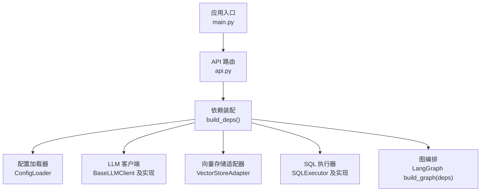
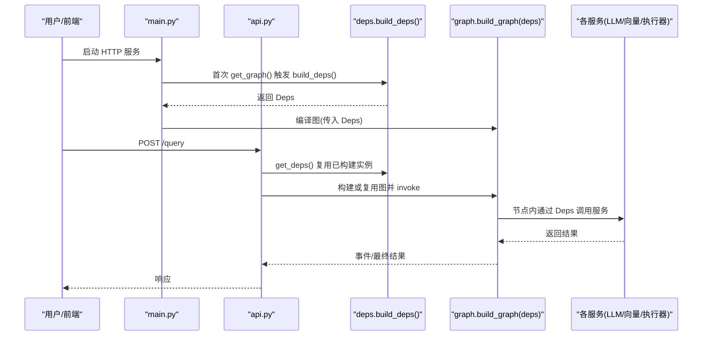
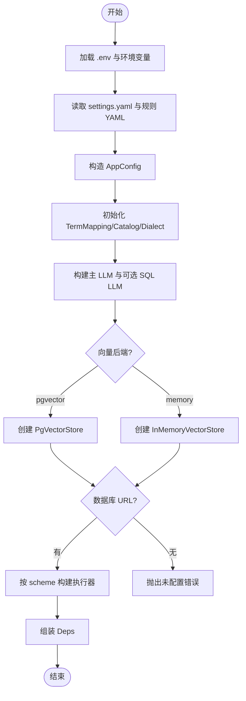
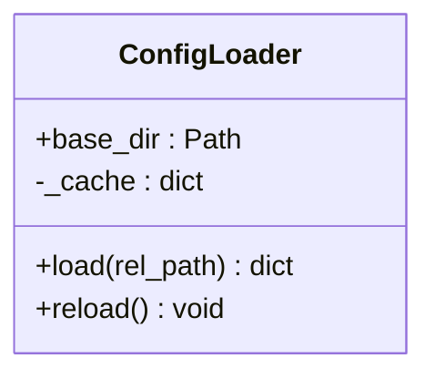
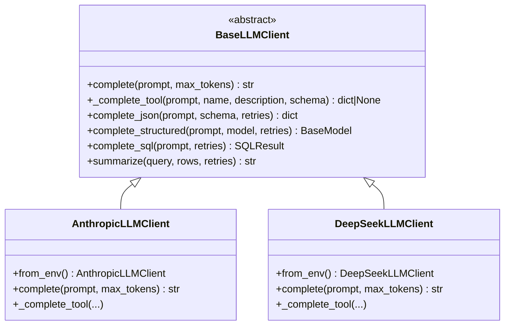
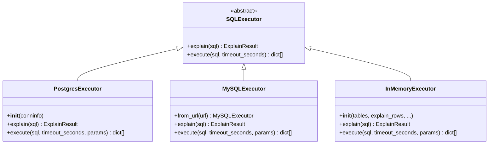
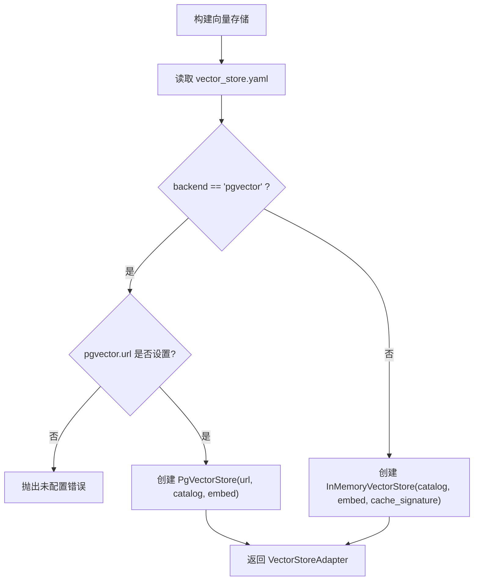
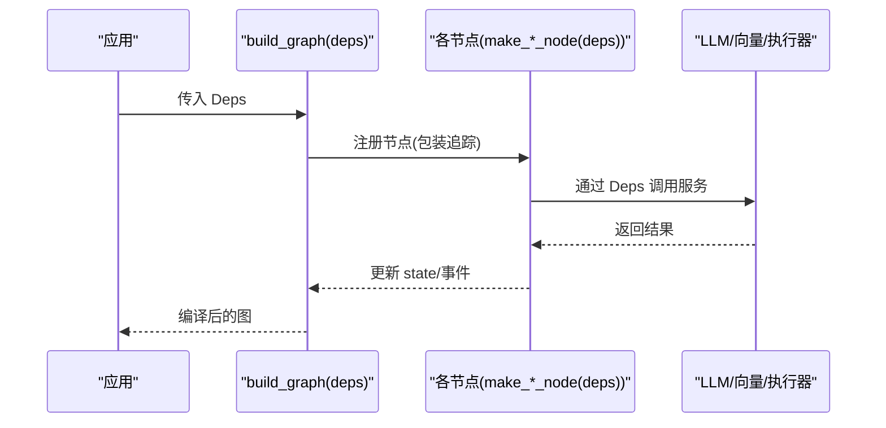
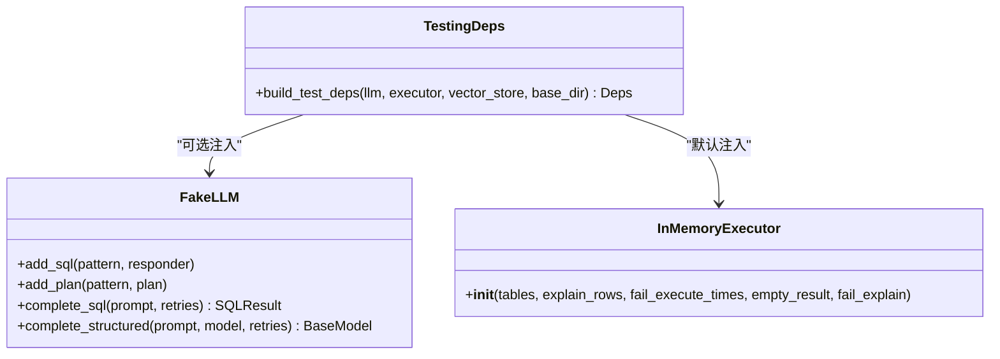
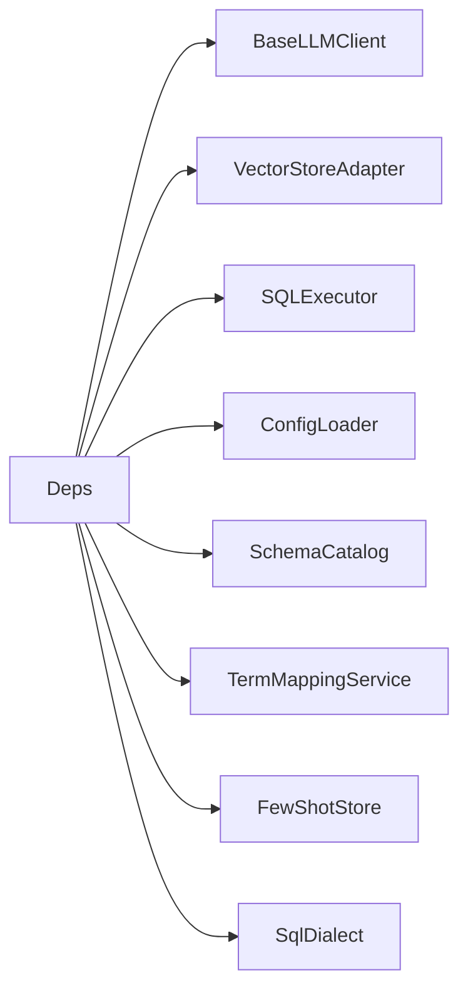

# 依赖注入模式

<cite>
**本文引用的文件**   
- [deps.py](file://nl2sql_agent/services/deps.py)
- [main.py](file://nl2sql_agent/main.py)
- [api.py](file://nl2sql_agent/api.py)
- [testing.py](file://nl2sql_agent/testing.py)
- [config_loader.py](file://nl2sql_agent/services/config_loader.py)
- [llm.py](file://nl2sql_agent/services/llm.py)
- [executor.py](file://nl2sql_agent/services/executor.py)
- [graph.py](file://nl2sql_agent/graph.py)
- [settings.yaml](file://nl2sql_agent/config/settings.yaml)
- [model_config.yaml](file://nl2sql_agent/config/model_config.yaml)
- [vector_store.yaml](file://nl2sql_agent/config/vector_store.yaml)
- [conftest.py](file://nl2sql_agent/tests/conftest.py)
</cite>

## 目录
1. [简介](#简介)
2. [项目结构](#项目结构)
3. [核心组件](#核心组件)
4. [架构总览](#架构总览)
5. [详细组件分析](#详细组件分析)
6. [依赖关系分析](#依赖关系分析)
7. [性能考量](#性能考量)
8. [故障排查指南](#故障排查指南)
9. [结论](#结论)
10. [附录](#附录)

## 简介
本文件系统化阐述 NL2SQL 系统的依赖注入（DI）模式，围绕 Deps 类的设计与实现，覆盖服务装配、生命周期管理、配置管理与测试替换机制。重点说明如何通过 DI 解耦模块间依赖，以及如何注册和获取 LLM 客户端、向量存储、执行器等关键服务，并给出最佳实践与常见问题解决方案。

## 项目结构
NL2SQL 的依赖注入集中在 services/deps.py，通过 build_deps 统一装配；运行时由 main.py 与 api.py 在进程启动时构建一次并复用；测试环境通过 testing.py 提供 build_test_deps 以注入 FakeLLM、InMemoryExecutor 等双打。

**图表来源** 
- [main.py:63-80](file://nl2sql_agent/main.py#L63-L80)
- [api.py:44-49](file://nl2sql_agent/api.py#L44-L49)
- [deps.py:110-181](file://nl2sql_agent/services/deps.py#L110-L181)
- [config_loader.py:14-36](file://nl2sql_agent/services/config_loader.py#L14-L36)
- [llm.py:280-328](file://nl2sql_agent/services/llm.py#L280-L328)
- [executor.py:23-205](file://nl2sql_agent/services/executor.py#L23-L205)
- [graph.py:174-313](file://nl2sql_agent/graph.py#L174-L313)

**章节来源**
- [deps.py:1-181](file://nl2sql_agent/services/deps.py#L1-L181)
- [main.py:1-152](file://nl2sql_agent/main.py#L1-L152)
- [api.py:1-573](file://nl2sql_agent/api.py#L1-L573)

## 核心组件
- AppConfig：集中承载运行期配置项（方言、检索 Top-K、执行限制、超时、阈值、行级过滤开关与列名、各类规则）。
- Deps：依赖容器，聚合配置、配置加载器、LLM 客户端（主模型与 SQL 专用）、术语映射、Schema 目录、向量存储、SQL 执行器、Few-shot 存储、SQL 方言等。
- ConfigLoader：YAML 配置加载器，具备本地缓存与基于 mtime 的热更新能力。
- LLM 抽象与实现：BaseLLMClient 定义统一接口；AnthropicLLMClient、DeepSeekLLMClient 为具体实现；build_llm/build_sql_llm 按环境变量选择。
- SQL 执行器抽象与实现：SQLExecutor 定义 explain/execute；PostgresExecutor、MySQLExecutor、InMemoryExecutor 为具体实现。
- 向量存储适配器：VectorStoreAdapter 抽象，InMemoryVectorStore、PgVectorStore 为具体实现，后端由 vector_store.yaml 显式选择。

**章节来源**
- [deps.py:40-71](file://nl2sql_agent/services/deps.py#L40-L71)
- [config_loader.py:14-36](file://nl2sql_agent/services/config_loader.py#L14-L36)
- [llm.py:70-160](file://nl2sql_agent/services/llm.py#L70-L160)
- [executor.py:23-205](file://nl2sql_agent/services/executor.py#L23-L205)

## 架构总览
依赖注入贯穿“配置 → 服务装配 → 图编排 → 请求处理”的全链路。进程启动时调用 load_env 与 build_deps 完成一次性装配，随后将 Deps 注入到 LangGraph 图中，所有节点通过 Deps 访问服务，避免硬编码与全局状态耦合。

**图表来源** 
- [main.py:63-80](file://nl2sql_agent/main.py#L63-L80)
- [api.py:44-49](file://nl2sql_agent/api.py#L44-L49)
- [deps.py:110-181](file://nl2sql_agent/services/deps.py#L110-L181)
- [graph.py:174-313](file://nl2sql_agent/graph.py#L174-L313)

## 详细组件分析

### Deps 类与服务装配
- 设计理念：以 dataclass 作为依赖容器，显式声明所有外部依赖，便于测试替换与静态检查。
- 装配流程：
  - 加载 .env 与环境变量（如 ANTHROPIC_API_KEY、DATABASE_URL 等）。
  - 读取 settings.yaml 与规则 YAML，构造 AppConfig。
  - 初始化 TermMappingService、SchemaCatalog、SqlDialect。
  - 根据环境变量与 model_config.yaml 构建主 LLM 与可选 SQL 专用 LLM。
  - 根据 vector_store.yaml 选择向量存储后端（memory/pgvector），支持注入 embed 函数用于测试。
  - 根据 database_url 自动选择 MySQL/Postgres 执行器，未配置则抛出明确错误。
  - 组装 FewShotStore 并返回 Deps。

**图表来源** 
- [deps.py:32-38](file://nl2sql_agent/services/deps.py#L32-L38)
- [deps.py:110-181](file://nl2sql_agent/services/deps.py#L110-L181)
- [vector_store.yaml:1-6](file://nl2sql_agent/config/vector_store.yaml#L1-L6)
- [settings.yaml:1-30](file://nl2sql_agent/config/settings.yaml#L1-L30)

**章节来源**
- [deps.py:40-71](file://nl2sql_agent/services/deps.py#L40-L71)
- [deps.py:110-181](file://nl2sql_agent/services/deps.py#L110-L181)

### 配置管理（ConfigLoader 与热更新）
- 功能：按相对路径加载 YAML，内部缓存键为文件名，值包含 mtime 与数据。
- 热更新：当文件 mtime 变化时自动重载；提供 reload() 清空缓存供外部触发。
- 使用场景：settings.yaml、rules、term_mapping、model_config.yaml、vector_store.yaml 等均由其加载。

**图表来源** 
- [config_loader.py:14-36](file://nl2sql_agent/services/config_loader.py#L14-L36)

**章节来源**
- [config_loader.py:14-36](file://nl2sql_agent/services/config_loader.py#L14-L36)

### LLM 客户端（抽象与实现）
- 抽象：BaseLLMClient 定义 complete、_complete_tool、complete_json、complete_structured、complete_sql、summarize。
- 实现：
  - AnthropicLLMClient：通过 Messages API 与 tool_use。
  - DeepSeekLLMClient：OpenAI 兼容接口，thinking 模式下回退纯文本解析。
- 工厂：build_llm 依据 LLM_PROVIDER 或密钥存在性选择 provider；build_sql_llm 支持独立端点或同 provider 的不同模型。

**图表来源** 
- [llm.py:70-160](file://nl2sql_agent/services/llm.py#L70-L160)
- [llm.py:162-243](file://nl2sql_agent/services/llm.py#L162-L243)
- [llm.py:280-328](file://nl2sql_agent/services/llm.py#L280-L328)

**章节来源**
- [llm.py:70-160](file://nl2sql_agent/services/llm.py#L70-L160)
- [llm.py:280-328](file://nl2sql_agent/services/llm.py#L280-L328)

### SQL 执行器（抽象与实现）
- 抽象：SQLExecutor 定义 explain、execute。
- 实现：
  - PostgresExecutor：只读事务 + statement_timeout。
  - MySQLExecutor：READ ONLY 事务 + MAX_EXECUTION_TIME + EXPLAIN FORMAT=JSON。
  - InMemoryExecutor：测试用，按表返回预置数据，支持模拟失败与空结果。
- 选择：build_executor_from_url 根据 URL scheme 自动选择。

**图表来源** 
- [executor.py:23-205](file://nl2sql_agent/services/executor.py#L23-L205)

**章节来源**
- [executor.py:23-205](file://nl2sql_agent/services/executor.py#L23-L205)

### 向量存储（适配器与后端选择）
- 抽象：VectorStoreAdapter（由 deps.py 导入的适配层）。
- 后端：
  - memory：InMemoryVectorStore，适合测试与演示。
  - pgvector：PgVectorStore，需 PGVECTOR_URL。
- 选择逻辑：build_vector_store 读取 vector_store.yaml 的 backend 字段，显式决定后端。

**图表来源** 
- [deps.py:87-108](file://nl2sql_agent/services/deps.py#L87-L108)
- [vector_store.yaml:1-6](file://nl2sql_agent/config/vector_store.yaml#L1-L6)

**章节来源**
- [deps.py:87-108](file://nl2sql_agent/services/deps.py#L87-L108)

### 图编排与依赖注入
- build_graph 接收 Deps，将各节点封装为带追踪的事件回调，并通过 StateGraph 组合成完整工作流。
- 节点均通过 make_*_node(deps) 形式获取依赖，保证强类型与可测试性。
- checkpointer 默认内存保存，生产可通过 create_sqlite_checkpointer 持久化。

**图表来源** 
- [graph.py:174-313](file://nl2sql_agent/graph.py#L174-L313)

**章节来源**
- [graph.py:174-313](file://nl2sql_agent/graph.py#L174-L313)

### 测试环境下的模拟与替换
- 通过 testing.build_test_deps 注入 FakeLLM、InMemoryExecutor、InMemoryVectorStore（确定性 embedding）。
- conftest 隔离配置目录，确保测试不受真实配置影响。
- 可在单元测试中自定义 FakeLLM 规则，精确控制 SQL/计划输出。

**图表来源** 
- [testing.py:148-187](file://nl2sql_agent/testing.py#L148-L187)
- [conftest.py:46-66](file://nl2sql_agent/tests/conftest.py#L46-L66)

**章节来源**
- [testing.py:148-187](file://nl2sql_agent/testing.py#L148-L187)
- [conftest.py:46-66](file://nl2sql_agent/tests/conftest.py#L46-L66)

## 依赖关系分析
- 低耦合：各服务通过 Deps 暴露，节点仅依赖抽象接口，便于替换与扩展。
- 高内聚：配置加载、服务装配集中于 deps.py，职责清晰。
- 外部依赖：
  - LLM：Anthropic/DeepSeek，通过环境变量选择。
  - 向量存储：memory/pgvector，通过 vector_store.yaml 选择。
  - 数据库：MySQL/Postgres，通过 database_url scheme 选择。
- 潜在循环：未发现循环依赖；图编排仅在编译阶段引用节点模块。

**图表来源** 
- [deps.py:54-71](file://nl2sql_agent/services/deps.py#L54-L71)

**章节来源**
- [deps.py:54-71](file://nl2sql_agent/services/deps.py#L54-L71)

## 性能考量
- 配置热更新：ConfigLoader 基于 mtime 缓存，避免频繁 IO；必要时调用 reload() 主动刷新。
- 连接池与超时：执行器层面设置只读事务与超时，防止长尾查询阻塞。
- 向量存储：memory 后端重启重建，pgvector 适合持久化与大规模索引。
- LLM 调用：结构化输出优先 function calling，失败回退纯文本解析并带重试，减少无效调用。

[本节为通用指导，不直接分析具体文件]

## 故障排查指南
- 未配置数据库连接：build_deps 会抛出明确错误，需在 .env 或 settings.yaml 中设置 DATABASE_URL。
- 向量存储未配置 pgvector：当 backend=pgvector 但未设置 url 时会报错，请检查 vector_store.yaml 与 PGVECTOR_URL。
- LLM 环境变量缺失：Anthropic/DeepSeek 需要对应 API KEY 与 MODEL，缺失将抛出配置错误。
- 测试失败：确认 conftest 已隔离配置目录，且 build_test_deps 正确注入 FakeLLM/InMemoryExecutor。

**章节来源**
- [deps.py:110-181](file://nl2sql_agent/services/deps.py#L110-L181)
- [llm.py:280-328](file://nl2sql_agent/services/llm.py#L280-L328)
- [conftest.py:46-66](file://nl2sql_agent/tests/conftest.py#L46-L66)

## 结论
通过 Deps 与 build_deps，NL2SQL 实现了清晰的依赖注入体系：配置驱动、服务抽象、可插拔实现、测试友好。该模式有效解耦了模块间依赖，提升了可维护性与可扩展性，并为多环境部署与自动化测试提供了坚实基础。

[本节为总结性内容，不直接分析具体文件]

## 附录
- 服务注册与获取方式
  - 注册：build_deps(base_dir, llm, sql_llm, executor, vector_store)
  - 获取：main.py 与 api.py 通过全局缓存 _graph/_deps 复用实例
- 最佳实践
  - 始终通过 Deps 访问服务，避免全局单例与隐式依赖
  - 使用环境变量与 YAML 管理配置，禁止硬编码
  - 测试中优先注入 Fake/InMemory 实现，确保可重复与快速
- 常见问题
  - 配置未生效：检查 CONFIG_DIR 与 mtime 缓存，必要时调用 loader.reload()
  - 执行失败：查看 execution_error 与 trace_steps，定位最近失败节点

**章节来源**
- [main.py:63-80](file://nl2sql_agent/main.py#L63-L80)
- [api.py:44-49](file://nl2sql_agent/api.py#L44-L49)
- [config_loader.py:14-36](file://nl2sql_agent/services/config_loader.py#L14-L36)