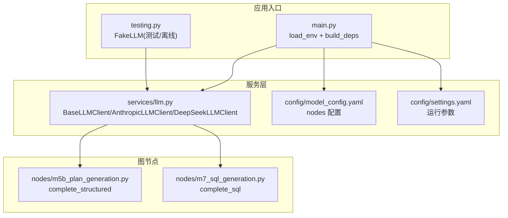
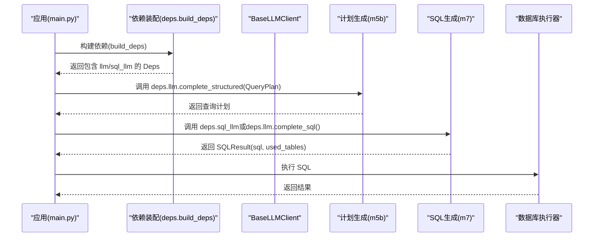
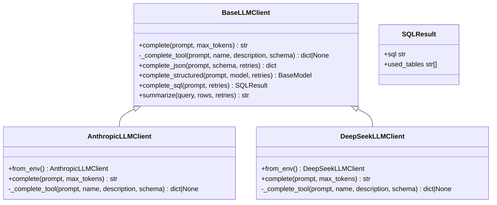
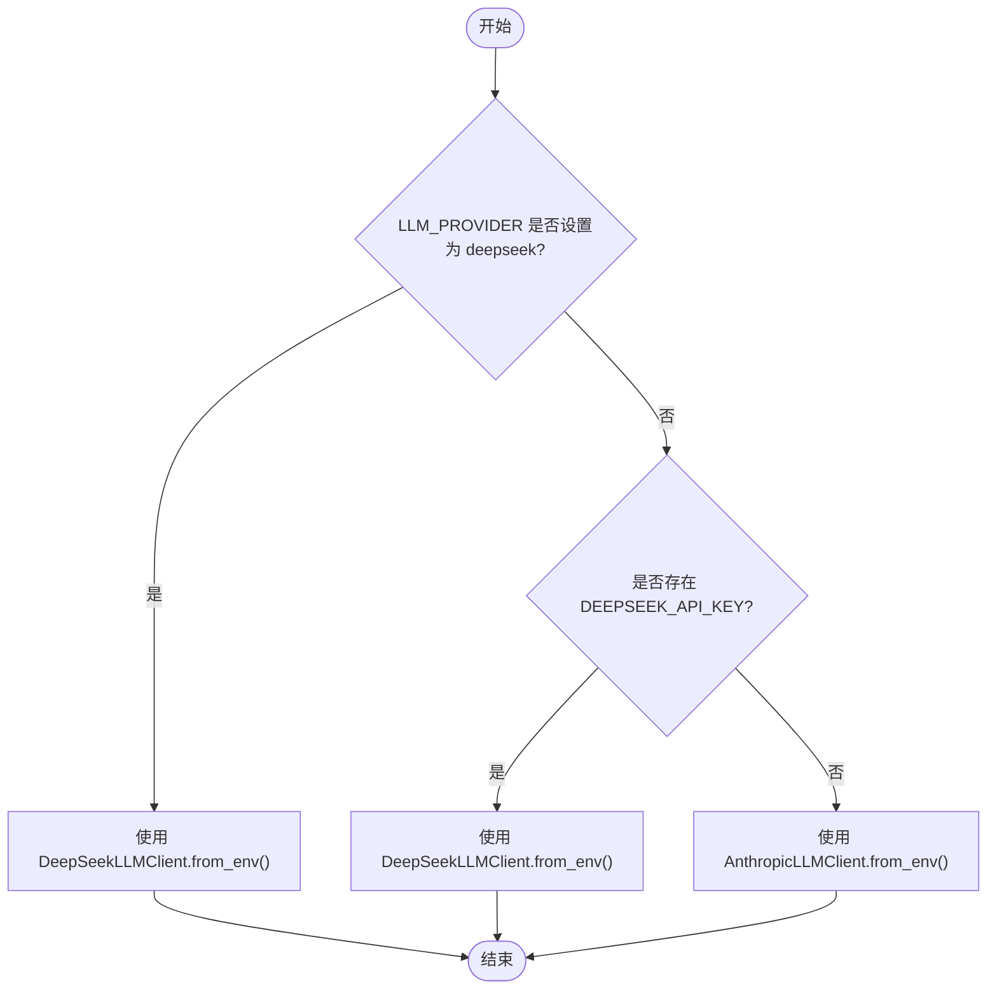
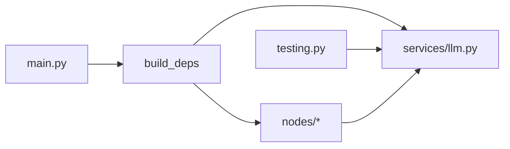

# LLM扩展点

<cite>
**本文引用的文件**   
- [nl2sql_agent/services/llm.py](file://nl2sql_agent/services/llm.py)
- [nl2sql_agent/config/model_config.yaml](file://nl2sql_agent/config/model_config.yaml)
- [nl2sql_agent/config/settings.yaml](file://nl2sql_agent/config/settings.yaml)
- [nl2sql_agent/testing.py](file://nl2sql_agent/testing.py)
- [nl2sql_agent/main.py](file://nl2sql_agent/main.py)
- [nl2sql_agent/nodes/m5b_plan_generation.py](file://nl2sql_agent/nodes/m5b_plan_generation.py)
- [nl2sql_agent/nodes/m7_sql_generation.py](file://nl2sql_agent/nodes/m7_sql_generation.py)
- [nl2sql_agent/tests/test_llm.py](file://nl2sql_agent/tests/test_llm.py)
</cite>

## 目录
1. [简介](#简介)
2. [项目结构](#项目结构)
3. [核心组件](#核心组件)
4. [架构总览](#架构总览)
5. [详细组件分析](#详细组件分析)
6. [依赖关系分析](#依赖关系分析)
7. [性能与可靠性](#性能与可靠性)
8. [故障排查指南](#故障排查指南)
9. [结论](#结论)
10. [附录：自定义LLM Provider开发示例](#附录自定义llm-provider开发示例)

## 简介
本文件面向 NL2SQL 系统的 LLM 扩展点，系统性说明 BaseLLMClient 抽象基类的设计与实现、内置 AnthropicLLMClient 与 DeepSeekLLMClient 的调用模式、模型选择机制（build_llm、get_model_for_node）、环境变量配置与故障转移策略，并提供完整的自定义 LLM Provider 开发指南与工具调用（function calling）最佳实践。文档力求让非专业读者也能理解并安全扩展系统。

## 项目结构
围绕 LLM 扩展点的代码主要分布在以下位置：
- 服务层 LLM 抽象与实现：nl2sql_agent/services/llm.py
- 节点中 LLM 使用方式：nl2sql_agent/nodes/m5b_plan_generation.py、nl2sql_agent/nodes/m7_sql_generation.py
- 运行入口与环境加载：nl2sql_agent/main.py
- 测试与离线双打：nl2sql_agent/testing.py
- 模型与节点级配置：nl2sql_agent/config/model_config.yaml、nl2sql_agent/config/settings.yaml
- 单元测试验证行为：nl2sql_agent/tests/test_llm.py

图表来源 
- [nl2sql_agent/services/llm.py:1-328](file://nl2sql_agent/services/llm.py#L1-L328)
- [nl2sql_agent/config/model_config.yaml:1-18](file://nl2sql_agent/config/model_config.yaml#L1-L18)
- [nl2sql_agent/config/settings.yaml:1-30](file://nl2sql_agent/config/settings.yaml#L1-L30)
- [nl2sql_agent/nodes/m5b_plan_generation.py:71-90](file://nl2sql_agent/nodes/m5b_plan_generation.py#L71-L90)
- [nl2sql_agent/nodes/m7_sql_generation.py:94-113](file://nl2sql_agent/nodes/m7_sql_generation.py#L94-L113)
- [nl2sql_agent/main.py:29-79](file://nl2sql_agent/main.py#L29-L79)
- [nl2sql_agent/testing.py:26-66](file://nl2sql_agent/testing.py#L26-L66)

章节来源
- [nl2sql_agent/services/llm.py:1-328](file://nl2sql_agent/services/llm.py#L1-L328)
- [nl2sql_agent/config/model_config.yaml:1-18](file://nl2sql_agent/config/model_config.yaml#L1-L18)
- [nl2sql_agent/config/settings.yaml:1-30](file://nl2sql_agent/config/settings.yaml#L1-L30)
- [nl2sql_agent/nodes/m5b_plan_generation.py:71-90](file://nl2sql_agent/nodes/m5b_plan_generation.py#L71-L90)
- [nl2sql_agent/nodes/m7_sql_generation.py:94-113](file://nl2sql_agent/nodes/m7_sql_generation.py#L94-L113)
- [nl2sql_agent/main.py:29-79](file://nl2sql_agent/main.py#L29-L79)
- [nl2sql_agent/testing.py:26-66](file://nl2sql_agent/testing.py#L26-L66)

## 核心组件
- BaseLLMClient：统一抽象接口，定义 complete 与 _complete_tool，提供 complete_json、complete_structured、complete_sql、summarize 等高层方法。
- AnthropicLLMClient：基于 Anthropic Messages API 的实现，支持 tool_use。
- DeepSeekLLMClient：基于 OpenAI 兼容接口的实现；thinking/reasoning 模式下不支持 tool_choice，回退到纯文本解析。
- build_llm / get_model_for_node / build_sql_llm：按环境变量与配置文件选择具体 provider 与模型。

章节来源
- [nl2sql_agent/services/llm.py:70-160](file://nl2sql_agent/services/llm.py#L70-L160)
- [nl2sql_agent/services/llm.py:162-203](file://nl2sql_agent/services/llm.py#L162-L203)
- [nl2sql_agent/services/llm.py:205-243](file://nl2sql_agent/services/llm.py#L205-L243)
- [nl2sql_agent/services/llm.py:254-328](file://nl2sql_agent/services/llm.py#L254-L328)

## 架构总览
下图展示 LLM 扩展点在系统中的角色与交互：主流程通过 deps.llm 进行计划生成与结果解释，SQL 生成优先使用 deps.sql_llm（若配置），否则回退至 deps.llm。节点级任务可通过 get_model_for_node 获取更便宜的专用模型。

图表来源 
- [nl2sql_agent/main.py:29-79](file://nl2sql_agent/main.py#L29-L79)
- [nl2sql_agent/nodes/m5b_plan_generation.py:71-90](file://nl2sql_agent/nodes/m5b_plan_generation.py#L71-L90)
- [nl2sql_agent/nodes/m7_sql_generation.py:94-113](file://nl2sql_agent/nodes/m7_sql_generation.py#L94-L113)

## 详细组件分析

### BaseLLMClient 抽象基类
- 设计要点
  - complete(prompt, max_tokens)：纯文本补全，由子类实现。
  - _complete_tool(prompt, name, description, schema)：函数调用强制结构化输出；若模型未走工具调用则返回 None。
  - complete_json(prompt, schema, retries)：优先 function calling，失败回退到纯文本 + extract_json，并对“回显 schema”的情况做校验与重试。
  - complete_structured(prompt, model, retries)：将 Pydantic BaseModel 转为 JSON Schema 后复用 complete_json，再实例化对象。
  - complete_sql(prompt, retries)：固定 schema 要求返回 sql 与 used_tables，封装为 SQLResult。
  - summarize(query, rows, retries)：对查询结果做中文摘要。
- 错误处理与重试
  - 多次尝试（默认 retries=2）确保鲁棒性；异常被捕获并记录，最终抛出 ValueError 提示多次解析失败。
- 复杂度与性能
  - 每次 complete_json 最多触发 1 次 tool call + retries 次纯文本请求；extract_json 线性扫描，时间复杂度 O(n)。

图表来源 
- [nl2sql_agent/services/llm.py:70-160](file://nl2sql_agent/services/llm.py#L70-L160)
- [nl2sql_agent/services/llm.py:162-203](file://nl2sql_agent/services/llm.py#L162-L203)
- [nl2sql_agent/services/llm.py:205-243](file://nl2sql_agent/services/llm.py#L205-L243)
- [nl2sql_agent/services/llm.py:31-35](file://nl2sql_agent/services/llm.py#L31-L35)

章节来源
- [nl2sql_agent/services/llm.py:70-160](file://nl2sql_agent/services/llm.py#L70-L160)

### AnthropicLLMClient 实现
- 初始化与工厂方法
  - from_env：从 ANTHROPIC_MODEL、ANTHROPIC_API_KEY 读取配置，构造 anthropic.Anthropic 客户端。
- 调用细节
  - complete：调用 messages.create，拼接 text 块。
  - _complete_tool：通过 tools 与 tool_choice 强制工具调用，解析 tool_use 块返回 input。
- 特性
  - 原生支持 tool_use，适合强约束的结构化输出。

章节来源
- [nl2sql_agent/services/llm.py:162-203](file://nl2sql_agent/services/llm.py#L162-L203)

### DeepSeekLLMClient 实现
- 初始化与工厂方法
  - from_env：从 DEEPSEEK_API_KEY、DEEPSEEK_MODEL、DEEPSEEK_BASE_URL 读取配置，构造 openai.OpenAI 客户端。
- 调用细节
  - complete：调用 chat.completions.create，取 choices[0].message.content。
  - _complete_tool：thinking/reasoning 模式不支持 tool_choice，直接返回 None，交由上层纯文本路径处理。
- 特性
  - 兼容 OpenAI 接口；tool use 能力受限于模型模式，需依赖纯文本解析与校验。

章节来源
- [nl2sql_agent/services/llm.py:205-243](file://nl2sql_agent/services/llm.py#L205-L243)

### 模型选择机制
- build_llm：根据 LLM_PROVIDER 与是否存在 DEEPSEEK_API_KEY 决定 provider；未设置时默认 Anthropic。
- get_model_for_node：按 config/model_config.yaml 的 nodes.<node_key> 指定模型；未配置则回退主模型。
- build_sql_llm：优先独立 SQL 模型（SQL_MODEL + SQL_API_KEY + SQL_BASE_URL），其次同 provider 的 SQL 模型名（DEEPSEEK_SQL_MODEL / ANTHROPIC_SQL_MODEL）。

图表来源 
- [nl2sql_agent/services/llm.py:275-283](file://nl2sql_agent/services/llm.py#L275-L283)

章节来源
- [nl2sql_agent/services/llm.py:254-328](file://nl2sql_agent/services/llm.py#L254-L328)
- [nl2sql_agent/config/model_config.yaml:13-18](file://nl2sql_agent/config/model_config.yaml#L13-L18)

### 节点中的 LLM 使用
- 计划生成（m5b）：调用 deps.llm.complete_structured(QueryPlan)，严格结构化输出，失败写入 plan_validation_errors 供后续判定重试。
- SQL 生成（m7）：优先 deps.sql_llm（若配置），否则 deps.llm；调用 complete_sql 同时返回 SQL 与 used_tables，便于后续静态校验与安全检查。

章节来源
- [nl2sql_agent/nodes/m5b_plan_generation.py:71-90](file://nl2sql_agent/nodes/m5b_plan_generation.py#L71-L90)
- [nl2sql_agent/nodes/m7_sql_generation.py:94-113](file://nl2sql_agent/nodes/m7_sql_generation.py#L94-L113)

### 环境变量与配置
- 主模型选择
  - LLM_PROVIDER：deepseek | anthropic（可选）
  - DEEPSEEK_API_KEY、DEEPSEEK_MODEL、DEEPSEEK_BASE_URL
  - ANTHROPIC_API_KEY、ANTHROPIC_MODEL
- SQL 专用模型
  - SQL_MODEL、SQL_API_KEY、SQL_BASE_URL（完全独立端点）
  - DEEPSEEK_SQL_MODEL 或 ANTHROPIC_SQL_MODEL（同 provider 的模型名）
- 节点级模型
  - config/model_config.yaml 的 nodes.<node_key>.model（可覆盖 api_key/base_url）
- 运行参数
  - settings.yaml 控制 dialect、schema_search_top_k、execution.*、row_level_filter 等

章节来源
- [nl2sql_agent/services/llm.py:275-328](file://nl2sql_agent/services/llm.py#L275-L328)
- [nl2sql_agent/config/model_config.yaml:13-18](file://nl2sql_agent/config/model_config.yaml#L13-L18)
- [nl2sql_agent/config/settings.yaml:1-30](file://nl2sql_agent/config/settings.yaml#L1-L30)

## 依赖关系分析
- 模块耦合
  - main.py 启动时 load_env 并构建 Deps，注入 llm/sql_llm。
  - 节点 m5b/m7 通过 deps.llm 与 deps.sql_llm 调用 LLM。
  - testing.py 提供 FakeLLM 替代真实 LLM，用于离线/测试。
- 外部依赖
  - anthropic、openai SDK 按需导入，避免冷启动开销。
- 潜在循环依赖
  - 无直接循环；LLM 模块不反向依赖节点。

图表来源 
- [nl2sql_agent/main.py:29-79](file://nl2sql_agent/main.py#L29-L79)
- [nl2sql_agent/testing.py:26-66](file://nl2sql_agent/testing.py#L26-L66)
- [nl2sql_agent/nodes/m5b_plan_generation.py:71-90](file://nl2sql_agent/nodes/m5b_plan_generation.py#L71-L90)
- [nl2sql_agent/nodes/m7_sql_generation.py:94-113](file://nl2sql_agent/nodes/m7_sql_generation.py#L94-L113)

章节来源
- [nl2sql_agent/main.py:29-79](file://nl2sql_agent/main.py#L29-L79)
- [nl2sql_agent/testing.py:26-66](file://nl2sql_agent/testing.py#L26-L66)

## 性能与可靠性
- 结构化输出稳定性
  - complete_json 先尝试 function calling，失败回退纯文本解析，并检测“回显 schema”的情况，提升成功率。
- 重试策略
  - 默认 retries=2，可根据场景调整；过多重试会增加延迟与成本。
- 工具调用差异
  - Anthropic 原生 tool_use，DeepSeek 在 thinking/reasoning 模式下不支持 tool_choice，需依赖纯文本解析。
- 资源与延迟
  - 按需导入 anthropic/openai，减少冷启动开销；建议合理设置 max_tokens。

章节来源
- [nl2sql_agent/services/llm.py:82-129](file://nl2sql_agent/services/llm.py#L82-L129)
- [nl2sql_agent/services/llm.py:239-243](file://nl2sql_agent/services/llm.py#L239-L243)

## 故障排查指南
- 常见错误
  - EnvConfigError：缺少必要环境变量（如 DEEPSEEK_API_KEY、DEEPSEEK_MODEL、ANTHROPIC_MODEL 等）。
  - ValueError：多次结构化解析失败（complete_json/complete_structured 重试耗尽）。
- 定位步骤
  - 检查环境变量是否正确设置（LLM_PROVIDER、*_API_KEY、*_MODEL、*_BASE_URL）。
  - 查看节点日志中的 plan_validation_errors/validation_errors/execution_error。
  - 使用 FakeLLM 快速复现问题，确认 prompt 与 schema 是否合理。
- 恢复策略
  - 调整 retries 或优化 prompt/schema；必要时切换 provider 或模型。

章节来源
- [nl2sql_agent/services/llm.py:27-28](file://nl2sql_agent/services/llm.py#L27-L28)
- [nl2sql_agent/nodes/m5b_plan_generation.py:82-87](file://nl2sql_agent/nodes/m5b_plan_generation.py#L82-L87)
- [nl2sql_agent/nodes/m7_sql_generation.py:17-28](file://nl2sql_agent/nodes/m7_sql_generation.py#L17-L28)

## 结论
BaseLLMClient 提供了统一的 LLM 抽象与强大的结构化输出能力，结合 build_llm/get_model_for_node/build_sql_llm 实现了灵活的模型选择与故障转移。AnthropicLLMClient 与 DeepSeekLLMClient 分别适配不同 API 特性，满足生产环境的多样性需求。通过完善的重试与校验机制，系统在复杂业务场景下具备高鲁棒性与可维护性。

## 附录：自定义LLM Provider开发示例
- 目标
  - 新增一个自定义 LLM Provider，遵循 BaseLLMClient 接口，并在 build_llm 或 get_model_for_node 中接入。
- 步骤
  1. 继承 BaseLLMClient，实现 complete 与 _complete_tool。
     - complete：调用第三方 SDK 完成文本生成。
     - _complete_tool：若支持 function calling，则强制工具调用并解析返回；否则返回 None 以走纯文本路径。
  2. 提供 from_env 工厂方法，从环境变量读取 API Key、Model、Base URL 等。
  3. 在 build_llm 或 get_model_for_node 中增加条件分支，按环境变量或配置返回新 Provider。
  4. 编写单元测试，覆盖正常路径、tool use 路径、纯文本回退路径与错误重试。
- 工具调用（function calling）实现要点
  - 定义清晰的 tool name/description/input_schema，确保模型能正确识别。
  - 解析响应中的 tool_use/tool_calls 字段，提取输入参数。
  - 若模型不支持 tool_choice，应回退到纯文本路径并确保 extract_json 健壮。
- 错误处理最佳实践
  - 捕获网络异常、鉴权失败、模型限流等，给出明确错误信息。
  - 对结构化输出进行二次校验（必填字段、类型、范围），失败时触发重试。
  - 记录关键上下文（prompt、schema、retries 次数）以便诊断。

章节来源
- [nl2sql_agent/services/llm.py:70-160](file://nl2sql_agent/services/llm.py#L70-L160)
- [nl2sql_agent/services/llm.py:254-328](file://nl2sql_agent/services/llm.py#L254-L328)
- [nl2sql_agent/tests/test_llm.py:92-151](file://nl2sql_agent/tests/test_llm.py#L92-L151)