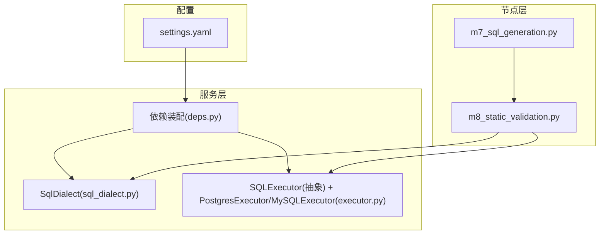
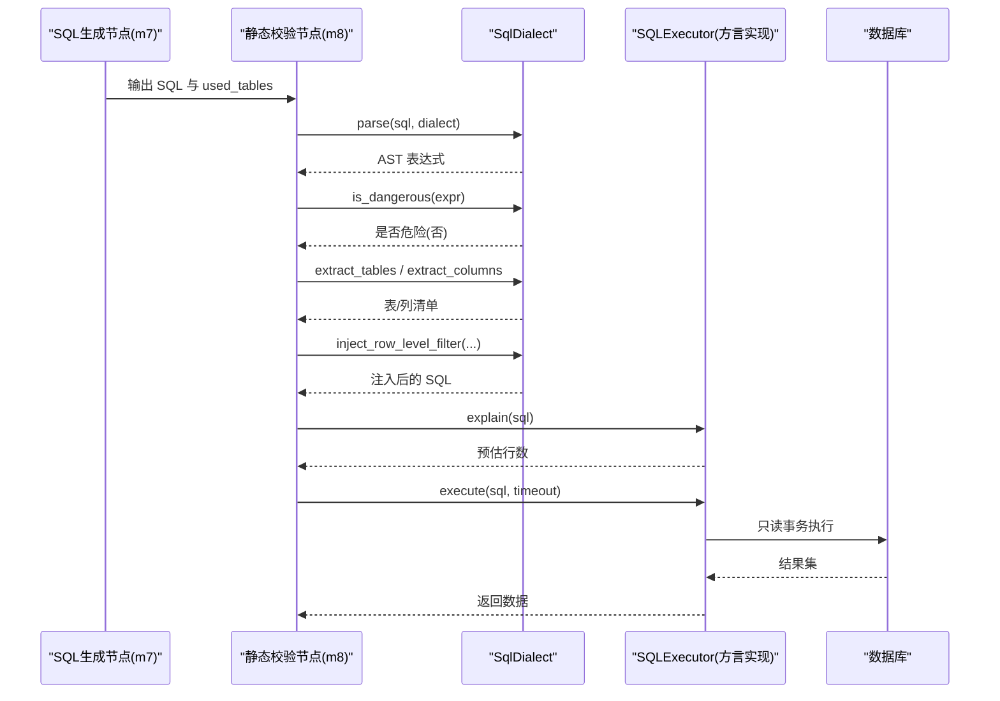
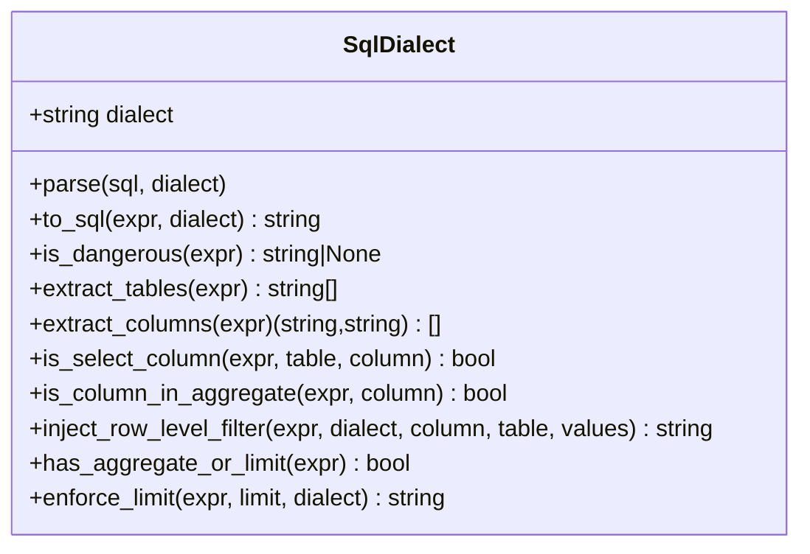
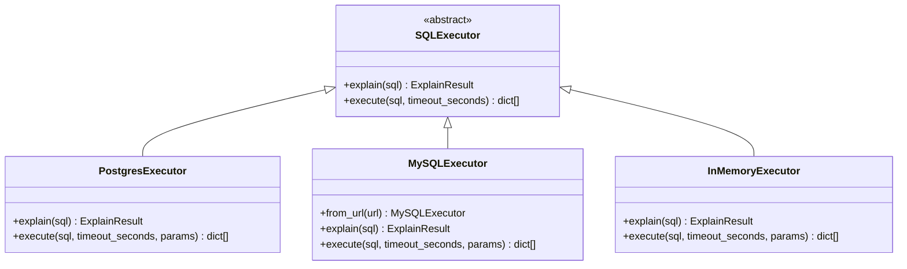
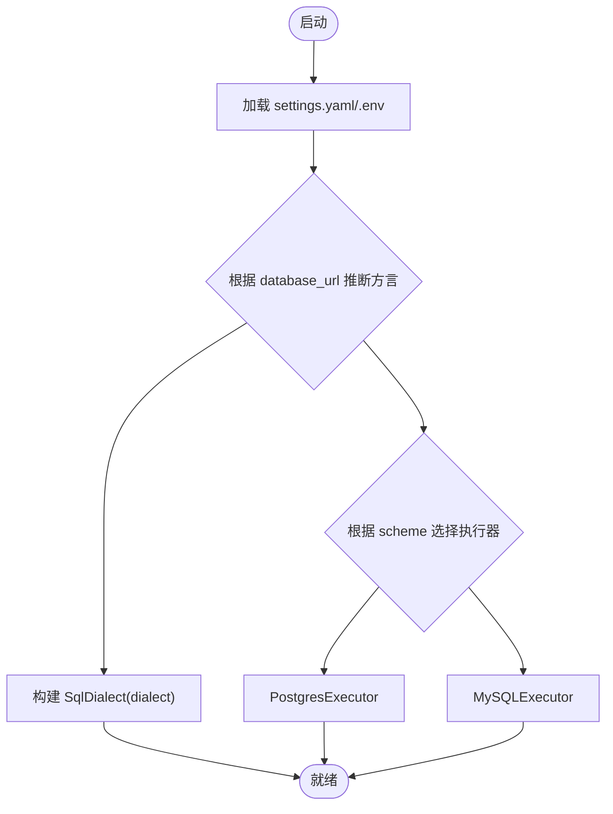
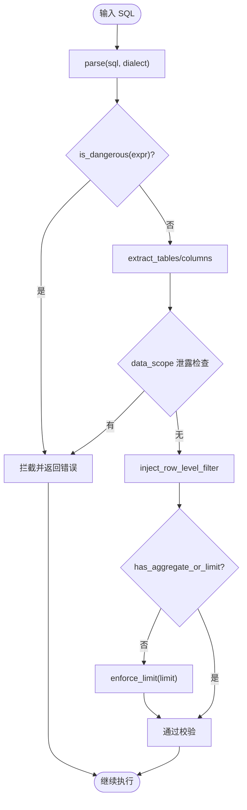
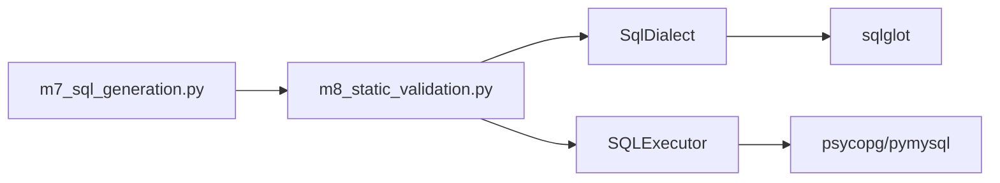

# SQL方言扩展点

<cite>
**本文引用的文件**   
- [nl2sql_agent/services/sql_dialect.py](file://nl2sql_agent/services/sql_dialect.py)
- [nl2sql_agent/services/executor.py](file://nl2sql_agent/services/executor.py)
- [nl2sql_agent/services/deps.py](file://nl2sql_agent/services/deps.py)
- [nl2sql_agent/config/settings.yaml](file://nl2sql_agent/config/settings.yaml)
- [nl2sql_agent/nodes/m8_static_validation.py](file://nl2sql_agent/nodes/m8_static_validation.py)
- [nl2sql_agent/nodes/m7_sql_generation.py](file://nl2sql_agent/nodes/m7_sql_generation.py)
- [nl2sql_agent/tests/test_mysql_executor.py](file://nl2sql_agent/tests/test_mysql_executor.py)
</cite>

## 目录
1. [简介](#简介)
2. [项目结构](#项目结构)
3. [核心组件](#核心组件)
4. [架构总览](#架构总览)
5. [详细组件分析](#详细组件分析)
6. [依赖关系分析](#依赖关系分析)
7. [性能与优化建议](#性能与优化建议)
8. [故障排查指南](#故障排查指南)
9. [结论](#结论)
10. [附录：自定义方言实现与测试指南](#附录自定义方言实现与测试指南)

## 简介
本文件面向 NL2SQL 系统的 SQL 方言扩展点，围绕 SqlDialect 抽象基类的设计与使用进行系统化说明。内容涵盖语法解析、AST 校验、危险操作检测、行级权限注入、未聚合查询的 LIMIT 强制等能力；解释如何基于 sqlglot 支持 MySQL、PostgreSQL、SQLite 等方言差异；给出 SQL 生成器的方言适配机制、查询优化建议与性能考量；并提供完整的自定义方言实现示例、错误处理策略与测试用例编写指南；最后总结与 sqlglot 库的集成方式及方言切换最佳实践。

## 项目结构
下图展示与方言扩展点相关的模块组织与交互关系。SqlDialect 作为统一封装层，被静态校验节点调用以完成 AST 层面的合法性与安全校验；执行器按数据库方言选择具体实现；配置通过 settings.yaml 驱动方言与执行参数。

图表来源
- [nl2sql_agent/config/settings.yaml:1-30](file://nl2sql_agent/config/settings.yaml#L1-L30)
- [nl2sql_agent/services/deps.py:113-184](file://nl2sql_agent/services/deps.py#L113-L184)
- [nl2sql_agent/services/sql_dialect.py:12-111](file://nl2sql_agent/services/sql_dialect.py#L12-L111)
- [nl2sql_agent/services/executor.py:23-205](file://nl2sql_agent/services/executor.py#L23-L205)
- [nl2sql_agent/nodes/m8_static_validation.py:39-152](file://nl2sql_agent/nodes/m8_static_validation.py#L39-L152)
- [nl2sql_agent/nodes/m7_sql_generation.py:1-113](file://nl2sql_agent/nodes/m7_sql_generation.py#L1-L113)

章节来源
- [nl2sql_agent/config/settings.yaml:1-30](file://nl2sql_agent/config/settings.yaml#L1-L30)
- [nl2sql_agent/services/deps.py:113-184](file://nl2sql_agent/services/deps.py#L113-L184)

## 核心组件
- SqlDialect：统一的 SQL 方言封装，提供解析、序列化、AST 安全校验、列/表抽取、行级权限注入、LIMIT 强制等能力。
- SQLExecutor 及其方言实现：PostgresExecutor、MySQLExecutor、InMemoryExecutor，负责只读事务、超时控制、EXPLAIN 预估行数提取等。
- 依赖装配 Deps：从配置加载 dialect、构建 SqlDialect 实例、根据 URL scheme 选择执行器。
- 静态校验节点 m8_static_validation：调用 SqlDialect 进行语法、危险操作、字段幻觉、敏感信息泄露等校验，并注入行级过滤条件。
- SQL 生成节点 m7_sql_generation：生成 SELECT 查询，配合后续校验与执行。

章节来源
- [nl2sql_agent/services/sql_dialect.py:12-111](file://nl2sql_agent/services/sql_dialect.py#L12-L111)
- [nl2sql_agent/services/executor.py:23-205](file://nl2sql_agent/services/executor.py#L23-L205)
- [nl2sql_agent/services/deps.py:113-184](file://nl2sql_agent/services/deps.py#L113-L184)
- [nl2sql_agent/nodes/m8_static_validation.py:39-152](file://nl2sql_agent/nodes/m8_static_validation.py#L39-L152)
- [nl2sql_agent/nodes/m7_sql_generation.py:1-113](file://nl2sql_agent/nodes/m7_sql_generation.py#L1-L113)

## 架构总览
下图展示了从 SQL 生成到静态校验、再到执行的完整流程，以及 SqlDialect 在其中的关键作用。

图表来源
- [nl2sql_agent/nodes/m7_sql_generation.py:94-113](file://nl2sql_agent/nodes/m7_sql_generation.py#L94-L113)
- [nl2sql_agent/nodes/m8_static_validation.py:39-152](file://nl2sql_agent/nodes/m8_static_validation.py#L39-L152)
- [nl2sql_agent/services/sql_dialect.py:16-111](file://nl2sql_agent/services/sql_dialect.py#L16-L111)
- [nl2sql_agent/services/executor.py:53-159](file://nl2sql_agent/services/executor.py#L53-L159)

## 详细组件分析

### SqlDialect 抽象基类设计
- 解析与序列化
  - parse：基于 sqlglot 将 SQL 字符串解析为 AST，支持传入方言覆盖默认方言。
  - to_sql：将 AST 序列化为指定方言的 SQL 字符串。
- 安全校验（AST 层面）
  - is_dangerous：仅允许 SELECT 子树（Select/Subquery/Union/Except/Intersect），其他顶层或内部命令（DDL/DML）直接判定为危险。
  - extract_tables / extract_columns：按出现顺序去重抽取表名与列名，用于字段幻觉校验与敏感字段识别。
  - is_select_column / is_column_in_aggregate：辅助判断列是否在投影或聚合函数中出现。
- 行级权限注入
  - inject_row_level_filter：在 WHERE 中追加 IN(values) 条件，避免交给 LLM 自行构造，确保确定性。
- 未聚合强制 LIMIT
  - has_aggregate_or_limit：检测是否存在 limit/group/distinct/聚合函数。
  - enforce_limit：对无保护查询强制追加 LIMIT，防止大结果集。

图表来源
- [nl2sql_agent/services/sql_dialect.py:12-111](file://nl2sql_agent/services/sql_dialect.py#L12-L111)

章节来源
- [nl2sql_agent/services/sql_dialect.py:12-111](file://nl2sql_agent/services/sql_dialect.py#L12-L111)

### SQL 执行器与方言适配
- SQLExecutor 抽象接口
  - explain：获取 EXPLAIN 预估行数，用于执行前风险拦截。
  - execute：执行 SQL 并返回结果集，支持超时控制。
- PostgresExecutor
  - 只读账号 + READ ONLY 事务 + statement_timeout。
  - EXPLAIN (FORMAT JSON) 解析 Plan Rows。
- MySQLExecutor
  - START TRANSACTION READ ONLY + MAX_EXECUTION_TIME 毫秒级超时。
  - EXPLAIN FORMAT=JSON 递归提取最大 rows 估值。
- InMemoryExecutor
  - 测试/演示用，支持模拟失败、空结果、固定预估行数。

图表来源
- [nl2sql_agent/services/executor.py:23-205](file://nl2sql_agent/services/executor.py#L23-L205)

章节来源
- [nl2sql_agent/services/executor.py:23-205](file://nl2sql_agent/services/executor.py#L23-L205)

### 依赖装配与方言切换
- 配置来源
  - settings.yaml 中的 dialect 决定默认方言；database_url 的 scheme 可覆盖为 mysql/postgres。
- 装配逻辑
  - build_deps 读取 settings.yaml 与环境变量，确定 dialect，构建 SqlDialect 实例。
  - 根据 database_url scheme 选择 PostgresExecutor 或 MySQLExecutor。
- 行为影响
  - 所有 SQL 解析/序列化均通过 SqlDialect 的 dialect 参数传递至 sqlglot，保证跨方言一致性。

图表来源
- [nl2sql_agent/services/deps.py:113-184](file://nl2sql_agent/services/deps.py#L113-L184)
- [nl2sql_agent/config/settings.yaml:1-30](file://nl2sql_agent/config/settings.yaml#L1-L30)

章节来源
- [nl2sql_agent/services/deps.py:113-184](file://nl2sql_agent/services/deps.py#L113-L184)
- [nl2sql_agent/config/settings.yaml:1-30](file://nl2sql_agent/config/settings.yaml#L1-L30)

### 静态校验与行级权限注入流程
- 语法与方言合法性：通过 SqlDialect.parse 校验。
- 危险操作检测：is_dangerous 命中即硬失败，不进入重试。
- 字段幻觉与敏感值泄露：抽取表/列与字面量，比对 data_scope。
- 行级权限注入：inject_row_level_filter 自动追加 WHERE 条件。
- 未聚合强制 LIMIT：enforce_limit 保障结果集规模可控。

图表来源
- [nl2sql_agent/nodes/m8_static_validation.py:39-152](file://nl2sql_agent/nodes/m8_static_validation.py#L39-L152)
- [nl2sql_agent/services/sql_dialect.py:25-111](file://nl2sql_agent/services/sql_dialect.py#L25-L111)

章节来源
- [nl2sql_agent/nodes/m8_static_validation.py:39-152](file://nl2sql_agent/nodes/m8_static_validation.py#L39-L152)
- [nl2sql_agent/services/sql_dialect.py:25-111](file://nl2sql_agent/services/sql_dialect.py#L25-L111)

### 与 SQLGlot 的集成与方言切换最佳实践
- 解析与序列化
  - 始终通过 SqlDialect.parse/to_sql 调用，避免直接使用 sqlglot API，确保统一方言上下文。
- 方言切换
  - 通过 settings.yaml 的 dialect 或 database_url scheme 动态切换；必要时可在调用处传入 dialect 覆盖默认值。
- 兼容性映射
  - 函数映射、数据类型适配由 sqlglot 内置方言支持承担；如需扩展，建议在 SqlDialect 中增加转换方法或在调用侧做最小化适配。
- 安全优先
  - 所有写操作与 DDL 通过 AST 结构判定拦截；敏感信息与系统命名空间不得出现在 SQL 字面量中。

章节来源
- [nl2sql_agent/services/sql_dialect.py:16-21](file://nl2sql_agent/services/sql_dialect.py#L16-L21)
- [nl2sql_agent/services/deps.py:131-138](file://nl2sql_agent/services/deps.py#L131-L138)

## 依赖关系分析
- 低耦合高内聚
  - SqlDialect 仅依赖 sqlglot，职责单一；执行器与方言无关的校验逻辑解耦。
- 外部依赖
  - sqlglot：解析/序列化与 AST 遍历。
  - psycopg/pymysql：数据库连接与执行。
- 潜在循环依赖
  - 当前未发现循环导入；依赖方向清晰：节点 -> 服务 -> 配置/外部库。

图表来源
- [nl2sql_agent/nodes/m7_sql_generation.py:94-113](file://nl2sql_agent/nodes/m7_sql_generation.py#L94-L113)
- [nl2sql_agent/nodes/m8_static_validation.py:39-152](file://nl2sql_agent/nodes/m8_static_validation.py#L39-L152)
- [nl2sql_agent/services/sql_dialect.py:12-111](file://nl2sql_agent/services/sql_dialect.py#L12-L111)
- [nl2sql_agent/services/executor.py:53-159](file://nl2sql_agent/services/executor.py#L53-L159)

章节来源
- [nl2sql_agent/services/sql_dialect.py:12-111](file://nl2sql_agent/services/sql_dialect.py#L12-L111)
- [nl2sql_agent/services/executor.py:53-159](file://nl2sql_agent/services/executor.py#L53-L159)

## 性能与优化建议
- 预估行数拦截
  - 通过 EXPLAIN 预估行数超过阈值直接拒绝，避免全表扫描与大结果集。
- 只读事务与超时
  - Postgres 使用 statement_timeout，MySQL 使用 MAX_EXECUTION_TIME，确保长耗时查询及时中断。
- 未聚合强制 LIMIT
  - 对无聚合/分组/去重的查询强制 LIMIT，降低内存与网络开销。
- AST 校验优于正则
  - 使用 AST 判定字段幻觉与危险操作，减少误判与漏判，提高稳定性。
- 方言切换成本
  - 尽量复用 SqlDialect 实例，避免频繁创建；仅在必要时覆盖 dialect 参数。

[本节为通用指导，不直接分析具体文件]

## 故障排查指南
- SQL 语法错误
  - 现象：静态校验阶段抛出语法错误。
  - 排查：确认 dialect 设置与 sqlglot 支持；检查生成的 SQL 是否符合目标方言。
- 危险操作拦截
  - 现象：is_dangerous 返回非 SELECT 类型名。
  - 排查：定位写入/DDL 语句，改为只读查询或使用受控接口。
- 字段幻觉/敏感值泄露
  - 现象：校验发现不在 schema 中的列或 data_scope 值出现在字面量。
  - 排查：修正 prompt 或模型输出，确保 only use provided tables/columns。
- 执行超时/预估行数过大
  - 现象：执行器超时或 EXPLAIN 预估行数超过阈值。
  - 排查：添加索引、缩小范围、增加聚合/分组或 LIMIT。
- MySQL URL 解析异常
  - 现象：from_url 抛错或端口/字符集不正确。
  - 排查：检查 URL scheme、端口、charset 参数。

章节来源
- [nl2sql_agent/nodes/m8_static_validation.py:39-152](file://nl2sql_agent/nodes/m8_static_validation.py#L39-L152)
- [nl2sql_agent/services/executor.py:137-159](file://nl2sql_agent/services/executor.py#L137-L159)
- [nl2sql_agent/tests/test_mysql_executor.py:10-30](file://nl2sql_agent/tests/test_mysql_executor.py#L10-L30)

## 结论
SqlDialect 作为 NL2SQL 系统的方言扩展点，提供了基于 sqlglot 的统一解析、AST 安全校验、行级权限注入与 LIMIT 强制等能力；结合 SQLExecutor 的方言实现，系统能够安全、稳定地支持 MySQL、PostgreSQL 等多种数据库。通过配置驱动的方言切换与严格的校验流程，系统在功能性与安全性之间取得良好平衡。未来可扩展更多方言与函数/类型映射，同时保持 AST 层面的确定性校验原则。

[本节为总结性内容，不直接分析具体文件]

## 附录：自定义方言实现与测试指南

### 自定义方言实现要点
- 继承与扩展
  - 若需新增方言特定行为，可在 SqlDialect 基础上派生子类，重写 parse/to_sql 或增加转换方法。
- 函数映射与类型适配
  - 优先利用 sqlglot 内置方言；如必须定制，建议在调用侧集中处理，避免散落在业务代码。
- 语法验证规则
  - 通过 is_dangerous 与 extract_* 系列方法确保 AST 结构合法；新增规则应遵循“结构上可判定”的原则。
- 错误处理策略
  - 语法错误、危险操作、字段幻觉、敏感值泄露分别返回明确错误信息，便于上层重试或阻断。

章节来源
- [nl2sql_agent/services/sql_dialect.py:25-111](file://nl2sql_agent/services/sql_dialect.py#L25-L111)

### 测试用例编写指南
- 单元测试
  - 覆盖 URL 解析、EXPLAIN 行数提取、方言切换、危险操作拦截、字段幻觉校验等场景。
- 集成测试
  - 使用 InMemoryExecutor 模拟执行，验证端到端流程；必要时注入 FakeLLM 与 FewShotStore。
- 回归测试
  - 针对常见错误模式（如 data_scope 泄露、used_tables 不一致）建立用例，确保修复不引入回归。

章节来源
- [nl2sql_agent/tests/test_mysql_executor.py:10-50](file://nl2sql_agent/tests/test_mysql_executor.py#L10-L50)
- [nl2sql_agent/nodes/m8_static_validation.py:39-152](file://nl2sql_agent/nodes/m8_static_validation.py#L39-L152)