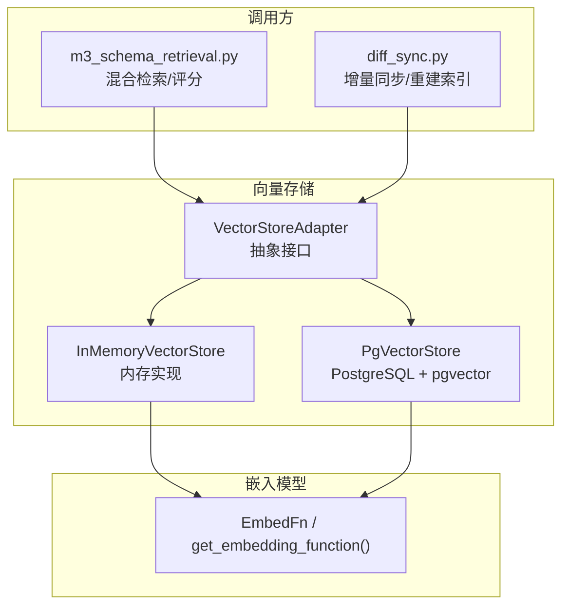
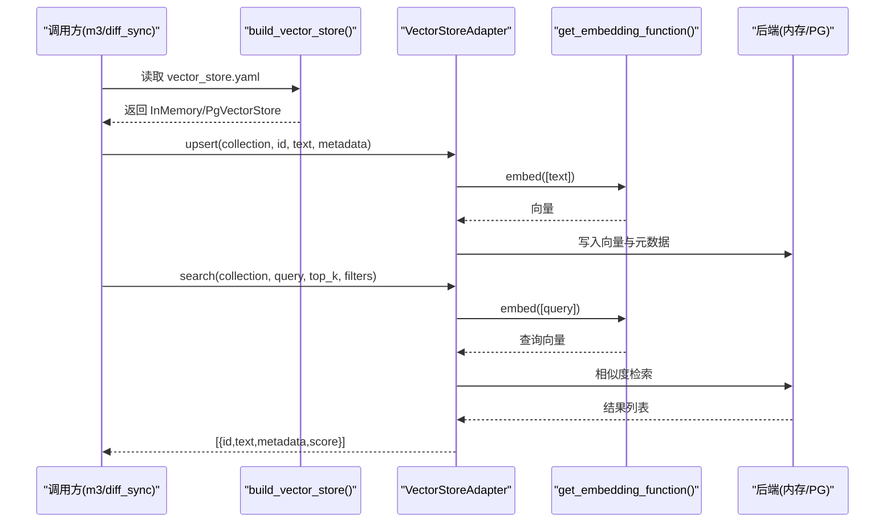
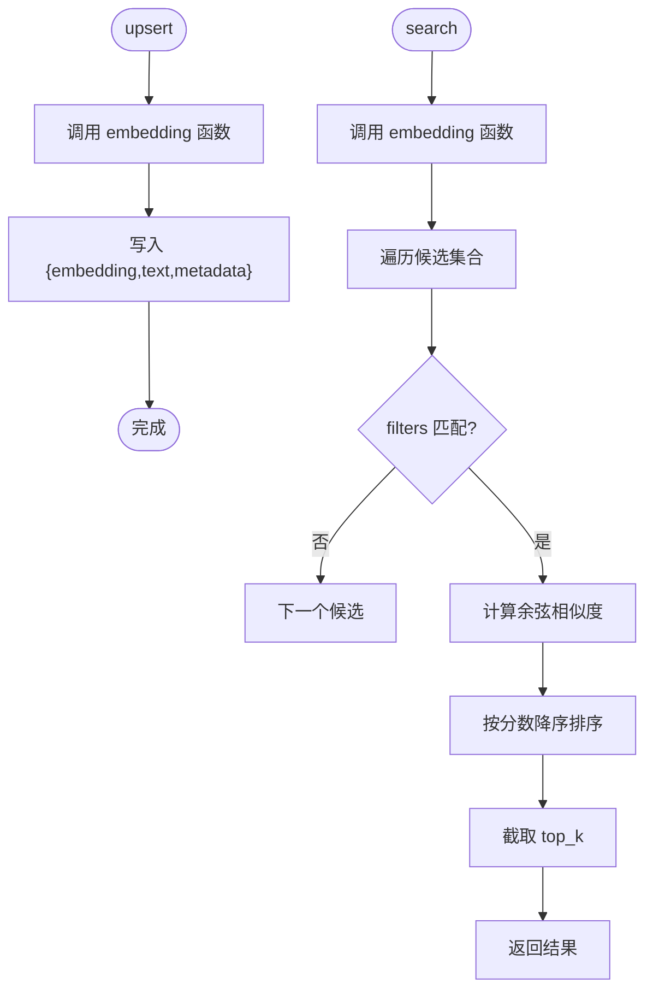
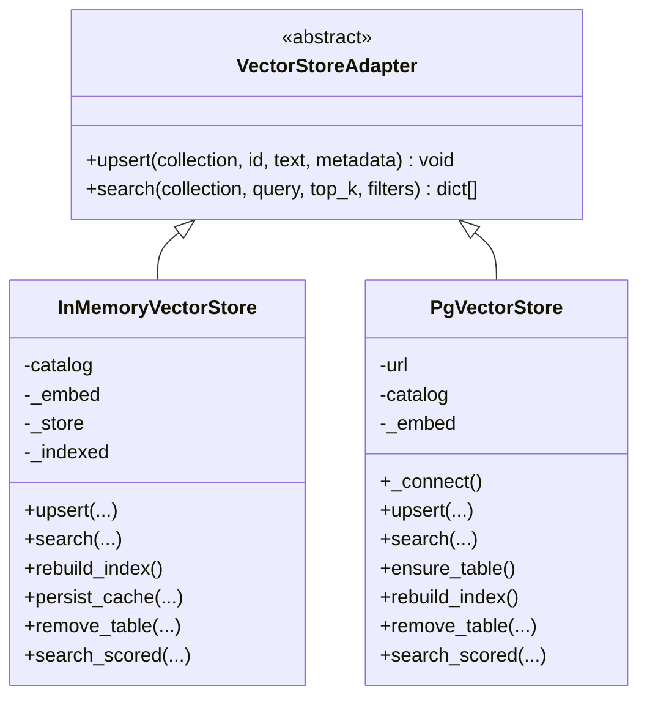
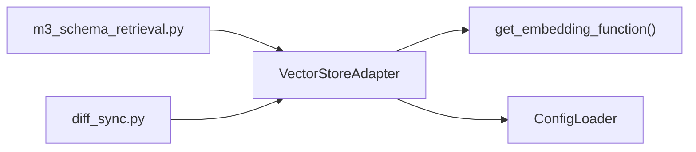

# 向量存储扩展点

<cite>
**本文引用的文件**   
- [base.py](file://nl2sql_agent/services/vector_store/base.py)
- [memory.py](file://nl2sql_agent/services/vector_store/memory.py)
- [pg.py](file://nl2sql_agent/services/vector_store/pg.py)
- [__init__.py](file://nl2sql_agent/services/vector_store/__init__.py)
- [deps.py](file://nl2sql_agent/services/deps.py)
- [config_loader.py](file://nl2sql_agent/services/config_loader.py)
- [router.py](file://nl2sql_agent/services/embedding/router.py)
- [vector_store.yaml](file://nl2sql_agent/config/vector_store.yaml)
- [m3_schema_retrieval.py](file://nl2sql_agent/nodes/m3_schema_retrieval.py)
- [diff_sync.py](file://nl2sql_agent/services/schema_ingest/diff_sync.py)
- [test_vector_store.py](file://nl2sql_agent/tests/test_vector_store.py)
</cite>

## 目录
1. [简介](#简介)
2. [项目结构](#项目结构)
3. [核心组件](#核心组件)
4. [架构总览](#架构总览)
5. [详细组件分析](#详细组件分析)
6. [依赖关系分析](#依赖关系分析)
7. [性能与优化](#性能与优化)
8. [故障排查指南](#故障排查指南)
9. [结论](#结论)
10. [附录：自定义实现示例](#附录自定义实现示例)

## 简介
本文件面向 NL2SQL 系统的“向量存储扩展点”，系统性说明抽象接口、内存与 PostgreSQL 两种后端的实现差异、索引构建与管理、相似度检索配置、批量操作与性能优化，以及与嵌入模型的集成方式。读者可据此快速理解现有实现并扩展新的向量存储后端。

## 项目结构
向量存储相关代码集中在 services/vector_store 包内，并通过 deps 装配器按配置文件选择具体后端；schema 检索节点与增量同步流程使用该扩展点完成语义召回与更新。

图表来源
- [base.py:11-21](file://nl2sql_agent/services/vector_store/base.py#L11-L21)
- [memory.py:21-66](file://nl2sql_agent/services/vector_store/memory.py#L21-L66)
- [pg.py:15-66](file://nl2sql_agent/services/vector_store/pg.py#L15-L66)
- [router.py:34-61](file://nl2sql_agent/services/embedding/router.py#L34-L61)
- [m3_schema_retrieval.py:73-128](file://nl2sql_agent/nodes/m3_schema_retrieval.py#L73-L128)
- [diff_sync.py:200-317](file://nl2sql_agent/services/schema_ingest/diff_sync.py#L200-L317)

章节来源
- [base.py:1-21](file://nl2sql_agent/services/vector_store/base.py#L1-L21)
- [memory.py:1-197](file://nl2sql_agent/services/vector_store/memory.py#L1-L197)
- [pg.py:1-174](file://nl2sql_agent/services/vector_store/pg.py#L1-L174)
- [deps.py:87-111](file://nl2sql_agent/services/deps.py#L87-L111)
- [vector_store.yaml:1-6](file://nl2sql_agent/config/vector_store.yaml#L1-L6)

## 核心组件
- 抽象接口 VectorStoreAdapter：定义 upsert、search 两个核心方法，屏蔽不同后端细节。
- 内存实现 InMemoryVectorStore：基于 dict 的内存存储，使用余弦相似度计算分数，支持缓存持久化与增量清理。
- PostgreSQL 实现 PgVectorStore：通过 psycopg 连接数据库，利用 pgvector 扩展进行向量检索，提供建表、重建、删除等能力。
- 嵌入路由 EmbedFn：统一 embedding 函数入口，支持本地模型或测试 fake 模式。

章节来源
- [base.py:11-21](file://nl2sql_agent/services/vector_store/base.py#L11-L21)
- [memory.py:21-66](file://nl2sql_agent/services/vector_store/memory.py#L21-L66)
- [pg.py:15-66](file://nl2sql_agent/services/vector_store/pg.py#L15-L66)
- [router.py:34-61](file://nl2sql_agent/services/embedding/router.py#L34-L61)

## 架构总览
系统通过配置显式选择后端（memory 或 pgvector），由依赖装配器 build_vector_store 创建对应实例。上层节点通过统一的 search/search_scored/upsert 接口进行语义检索与写入。

图表来源
- [deps.py:87-111](file://nl2sql_agent/services/deps.py#L87-L111)
- [memory.py:35-53](file://nl2sql_agent/services/vector_store/memory.py#L35-L53)
- [pg.py:32-65](file://nl2sql_agent/services/vector_store/pg.py#L32-L65)
- [router.py:34-61](file://nl2sql_agent/services/embedding/router.py#L34-L61)

## 详细组件分析

### 抽象接口 VectorStoreAdapter
- 设计目标：为所有向量存储后端提供统一契约，避免调用方感知后端差异。
- 关键方法：
  - upsert(collection, id, text, metadata)：写入一条记录，embedding 由内部调用统一 embedding 函数生成。
  - search(collection, query, top_k, filters)：语义相似度检索，返回包含 id、text、metadata、score 的结果列表，score ∈ [0,1]。
- 扩展点：新增后端只需实现上述两个方法，即可无缝接入。

章节来源
- [base.py:11-21](file://nl2sql_agent/services/vector_store/base.py#L11-L21)

### 内存实现 InMemoryVectorStore
- 数据结构：dict[collection][id] = {embedding, text, metadata}。
- 相似度算法：余弦相似度，归一化后取 max(0, score)。
- 过滤机制：filters 为键值对匹配，仅当 metadata 中 key=value 全部满足时命中。
- 索引构建：
  - _ensure_indexed：首次访问时从 catalog 或 m-schema 源构建表级/字段级/关系级向量。
  - rebuild_index：全量重建，适用于切换 embedding 模型后。
  - prepare_incremental：增量同步前恢复上一快照，减少重复计算。
- 缓存与持久化：
  - persist_cache：原子写入 vector-cache.json，校验 semantic_hash 与 embedding_signature 一致性。
  - _load_cache：重启后加载缓存，跳过重复构建。
- 删除与清理：
  - remove_table：按表名清理表级、字段级、关系级条目。
- schema 层方法：
  - search_scored：结合 data_scope 过滤，返回 (SchemaHit, score) 列表供模块 3/3.5 使用。

图表来源
- [memory.py:35-53](file://nl2sql_agent/services/vector_store/memory.py#L35-L53)
- [memory.py:62-66](file://nl2sql_agent/services/vector_store/memory.py#L62-L66)
- [memory.py:105-138](file://nl2sql_agent/services/vector_store/memory.py#L105-L138)

章节来源
- [memory.py:21-197](file://nl2sql_agent/services/vector_store/memory.py#L21-L197)

### PostgreSQL 实现 PgVectorStore
- 连接管理：延迟导入 psycopg，使用 with 上下文确保连接释放。
- 建表与维度：ensure_table 根据模型配置动态确定 embedding 维度，创建 schema_embeddings 表。
- 写入与更新：upsert 使用 ON CONFLICT DO UPDATE 保证幂等写入。
- 检索与过滤：search 使用 pgvector 的 <=> 算子计算余弦距离，并按 business_line 过滤。
- 重建与删除：rebuild_index 清空指定 collection 后重新写入；remove_table 按表名清理多类条目。
- schema 层方法：search_scored 基于 catalog 表列表与 SQL 检索组合，返回 (SchemaHit, score)。

图表来源
- [base.py:11-21](file://nl2sql_agent/services/vector_store/base.py#L11-L21)
- [memory.py:21-66](file://nl2sql_agent/services/vector_store/memory.py#L21-L66)
- [pg.py:15-66](file://nl2sql_agent/services/vector_store/pg.py#L15-L66)

章节来源
- [pg.py:15-174](file://nl2sql_agent/services/vector_store/pg.py#L15-L174)

### 配置与后端选择
- 配置文件 vector_store.yaml：
  - backend: memory | pgvector
  - pgvector.url: 环境变量展开后的数据库连接串
- 依赖装配器 build_vector_store：
  - 读取 vector_store.yaml，显式选择后端
  - pgvector 模式下校验 url 是否存在
  - memory 模式下根据 embedding 配置生成 cache_signature，用于缓存一致性校验

章节来源
- [vector_store.yaml:1-6](file://nl2sql_agent/config/vector_store.yaml#L1-L6)
- [deps.py:87-111](file://nl2sql_agent/services/deps.py#L87-L111)

### 嵌入模型集成
- EmbedFn：统一签名 texts -> vectors
- get_embedding_function：
  - provider=local：使用 sentence-transformers，支持 model_path 或 model 名
  - provider=fake：确定性词袋向量，用于测试
- 错误处理：模型加载失败抛出 RuntimeError，提示镜像或离线缓存设置

章节来源
- [router.py:34-61](file://nl2sql_agent/services/embedding/router.py#L34-L61)

## 依赖关系分析
- 调用方依赖：
  - m3_schema_retrieval.py：通过 deps.vector_store.search 和 search_scored 进行混合检索与评分。
  - diff_sync.py：在增量同步流程中调用 prepare_incremental、write_mschema_table_embeddings、persist_cache 等方法。
- 嵌入依赖：
  - 两个后端均依赖 get_embedding_function 生成向量。
- 配置依赖：
  - config_loader 负责 YAML 热加载与缓存。

图表来源
- [m3_schema_retrieval.py:73-128](file://nl2sql_agent/nodes/m3_schema_retrieval.py#L73-L128)
- [diff_sync.py:200-317](file://nl2sql_agent/services/schema_ingest/diff_sync.py#L200-L317)
- [config_loader.py:14-36](file://nl2sql_agent/services/config_loader.py#L14-L36)

章节来源
- [m3_schema_retrieval.py:73-128](file://nl2sql_agent/nodes/m3_schema_retrieval.py#L73-L128)
- [diff_sync.py:200-317](file://nl2sql_agent/services/schema_ingest/diff_sync.py#L200-L317)
- [config_loader.py:14-36](file://nl2sql_agent/services/config_loader.py#L14-L36)

## 性能与优化
- 内存实现优化：
  - 首次构建后缓存到 vector-cache.json，重启后若 semantic_hash 与 embedding_signature 一致则直接复用，避免重复 embedding。
  - 增量同步前调用 prepare_incremental 恢复上一快照，仅重算变化表。
  - 过滤采用 O(n) 扫描，适合中小规模数据集；大规模建议切换到 pgvector。
- PostgreSQL 实现优化：
  - 使用 pgvector 的 <=> 算子，利用数据库索引加速近似最近邻搜索。
  - ensure_table 自动按模型维度建表，避免维度不匹配导致的性能退化。
  - 批量写入建议使用事务或批量插入（当前 upsert 单条提交，可在上层封装批处理）。
- 相似度算法配置：
  - 内存：余弦相似度，分数范围 [0,1]。
  - PG：1 - (embedding <=> query)/2 映射到 [0,1]。
- 批量操作建议：
  - 在 diff_sync 中 write_mschema_table_embeddings 可按 columns_per_chunk 分块写入，降低单次负载。
  - 对于高频写入场景，可封装批量 upsert，减少网络往返与事务开销。

章节来源
- [memory.py:105-138](file://nl2sql_agent/services/vector_store/memory.py#L105-L138)
- [memory.py:139-152](file://nl2sql_agent/services/vector_store/memory.py#L139-L152)
- [pg.py:69-80](file://nl2sql_agent/services/vector_store/pg.py#L69-L80)
- [pg.py:32-45](file://nl2sql_agent/services/vector_store/pg.py#L32-L45)
- [diff_sync.py:297-313](file://nl2sql_agent/services/schema_ingest/diff_sync.py#L297-L313)

## 故障排查指南
- 后端选择错误：
  - 现象：运行时未找到期望的后端类型。
  - 排查：检查 vector_store.yaml 的 backend 字段与 pgvector.url 是否配置正确。
- 嵌入模型加载失败：
  - 现象：RuntimeError 提示模型加载失败。
  - 排查：确认 HF_ENDPOINT 或 model_path 配置，或使用 provider=fake 进行测试。
- 向量检索结果为空：
  - 现象：search 返回空列表。
  - 排查：确认 filters 条件是否正确；检查业务线命名空间是否匹配；验证索引是否已构建。
- 增量同步失败：
  - 现象：vector_write 报错导致快照未推进。
  - 排查：查看 diff_sync 的错误日志；确认向量后端可用性；必要时调用 rebuild_index 全量重建。

章节来源
- [deps.py:97-111](file://nl2sql_agent/services/deps.py#L97-L111)
- [router.py:45-53](file://nl2sql_agent/services/embedding/router.py#L45-L53)
- [test_vector_store.py:44-68](file://nl2sql_agent/tests/test_vector_store.py#L44-L68)
- [diff_sync.py:308-313](file://nl2sql_agent/services/schema_ingest/diff_sync.py#L308-L313)

## 结论
向量存储扩展点通过统一的抽象接口屏蔽了内存与 PostgreSQL 后端的差异，配合嵌入模型路由与配置驱动的后端选择，实现了灵活可扩展的语义检索能力。内存实现适合开发与测试，PostgreSQL 实现适合生产环境的大规模数据与高性能检索。通过缓存、增量同步与分块写入等策略，系统在易用性与性能之间取得了良好平衡。

## 附录：自定义实现示例
以下提供一个完整的自定义向量存储实现要点，涵盖数据持久化、连接池管理与错误恢复：

- 继承 VectorStoreAdapter，实现 upsert 与 search。
- 数据持久化：
  - 设计存储结构：collection -> id -> {embedding, text, metadata}。
  - 支持序列化到文件或数据库，确保 atomic 写入与一致性校验。
- 连接池管理：
  - 使用连接池（如 SQLAlchemy 或 psycopg pool）管理数据库连接。
  - 在 search/upsert 中使用上下文管理器确保连接释放。
- 错误恢复：
  - 捕获网络异常与数据库错误，重试机制与降级策略。
  - 记录错误日志并提供诊断信息。
- 相似度算法：
  - 根据后端能力选择合适的相似度计算（余弦、欧氏、内积等）。
  - 确保分数范围归一化到 [0,1]。
- 与嵌入模型集成：
  - 使用 get_embedding_function 获取 EmbedFn，支持本地模型或 API。
  - 处理模型加载失败的异常情况。
- 性能优化：
  - 批量写入与查询，减少网络往返。
  - 使用索引加速检索，合理设置 top_k 与过滤条件。
- 测试与验证：
  - 编写单元测试覆盖 upsert、search、filters、错误路径。
  - 使用 fake_embedding 进行无依赖测试。

章节来源
- [base.py:11-21](file://nl2sql_agent/services/vector_store/base.py#L11-L21)
- [memory.py:21-66](file://nl2sql_agent/services/vector_store/memory.py#L21-L66)
- [pg.py:15-66](file://nl2sql_agent/services/vector_store/pg.py#L15-L66)
- [router.py:34-61](file://nl2sql_agent/services/embedding/router.py#L34-L61)
- [test_vector_store.py:12-25](file://nl2sql_agent/tests/test_vector_store.py#L12-L25)