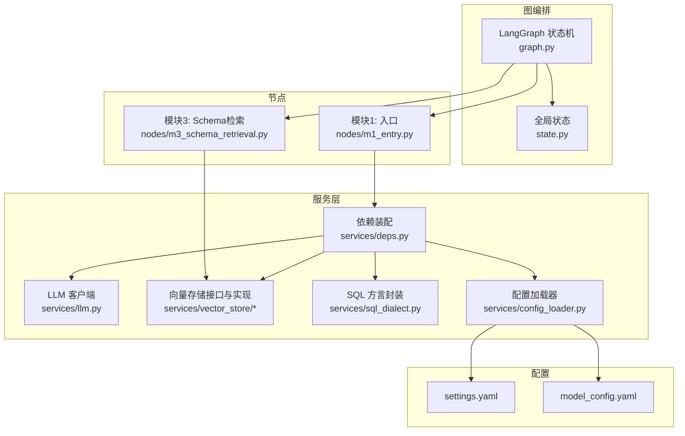
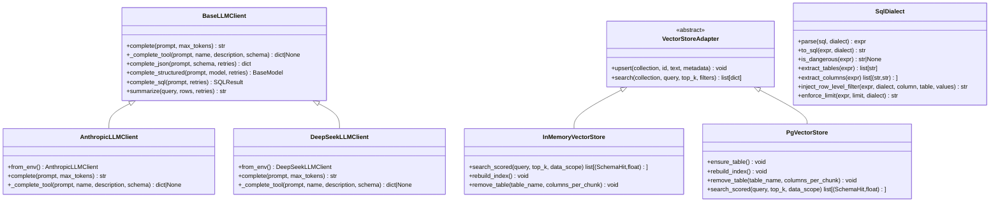
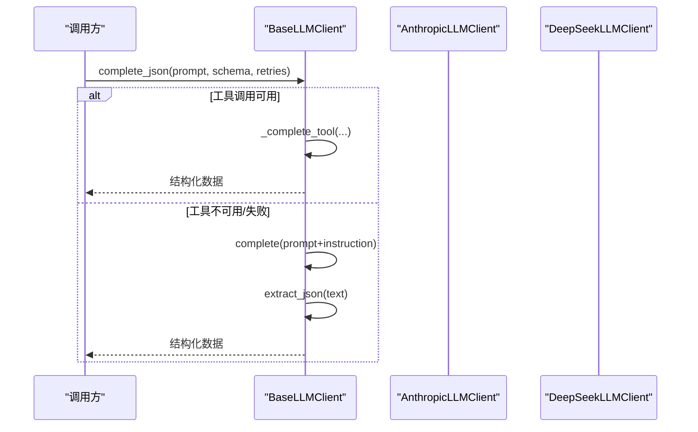
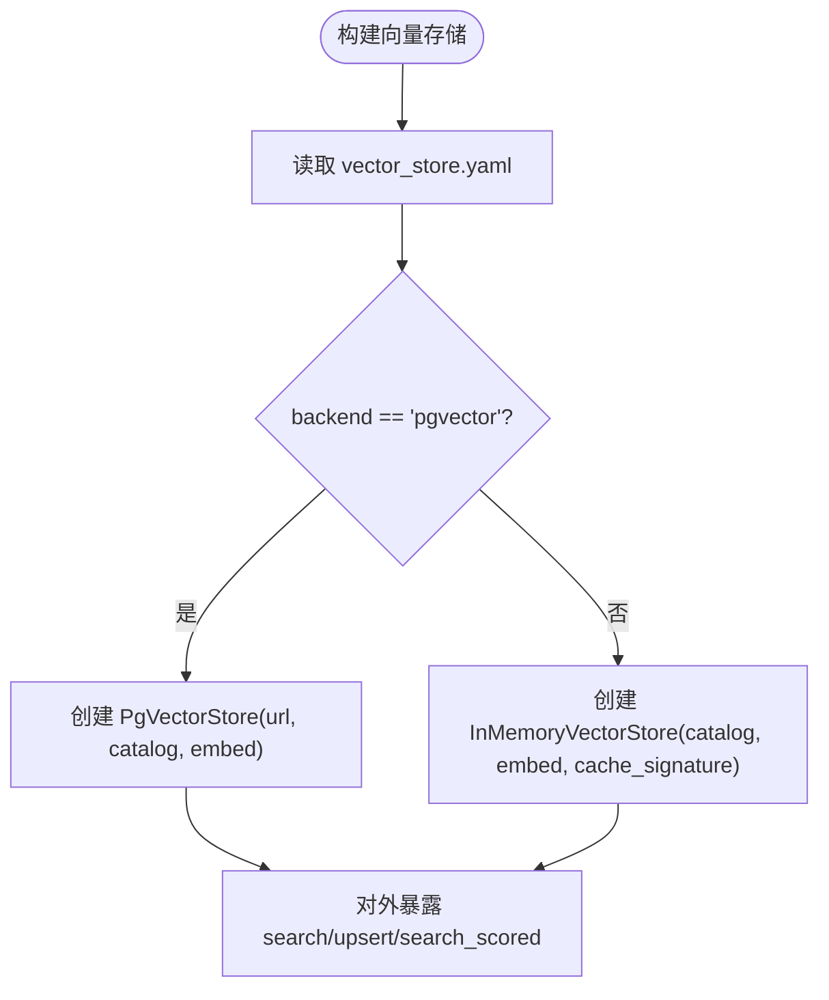
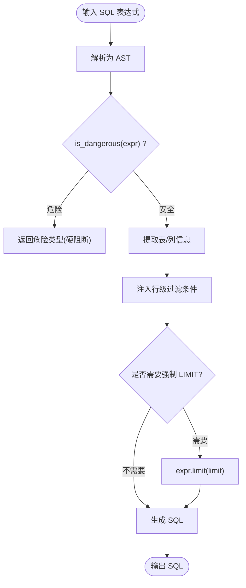
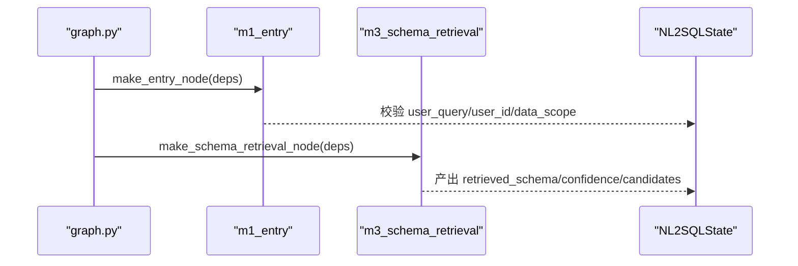
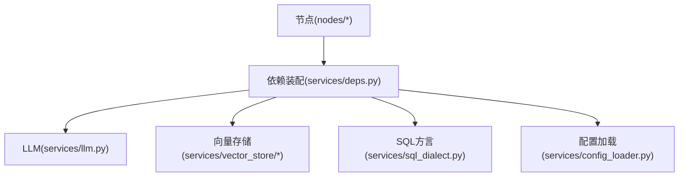

# 扩展点设计

<cite>
**本文引用的文件**   
- [nl2sql_agent/services/vector_store/base.py](file://nl2sql_agent/services/vector_store/base.py)
- [nl2sql_agent/services/vector_store/memory.py](file://nl2sql_agent/services/vector_store/memory.py)
- [nl2sql_agent/services/vector_store/pg.py](file://nl2sql_agent/services/vector_store/pg.py)
- [nl2sql_agent/services/vector_store/__init__.py](file://nl2sql_agent/services/vector_store/__init__.py)
- [nl2sql_agent/services/llm.py](file://nl2sql_agent/services/llm.py)
- [nl2sql_agent/services/sql_dialect.py](file://nl2sql_agent/services/sql_dialect.py)
- [nl2sql_agent/services/deps.py](file://nl2sql_agent/services/deps.py)
- [nl2sql_agent/services/config_loader.py](file://nl2sql_agent/services/config_loader.py)
- [nl2sql_agent/graph.py](file://nl2sql_agent/graph.py)
- [nl2sql_agent/state.py](file://nl2sql_agent/state.py)
- [nl2sql_agent/nodes/m1_entry.py](file://nl2sql_agent/nodes/m1_entry.py)
- [nl2sql_agent/nodes/m3_schema_retrieval.py](file://nl2sql_agent/nodes/m3_schema_retrieval.py)
- [nl2sql_agent/config/model_config.yaml](file://nl2sql_agent/config/model_config.yaml)
- [nl2sql_agent/config/settings.yaml](file://nl2sql_agent/config/settings.yaml)
</cite>

## 目录
1. [引言](#引言)
2. [项目结构](#项目结构)
3. [核心组件](#核心组件)
4. [架构总览](#架构总览)
5. [详细组件分析](#详细组件分析)
6. [依赖关系分析](#依赖关系分析)
7. [性能考量](#性能考量)
8. [故障排除指南](#故障排除指南)
9. [结论](#结论)
10. [附录](#附录)

## 引言
本设计文档面向 NL2SQL 系统的扩展点，目标是提供清晰的插件化架构与实现规范，覆盖以下关键扩展点：
- LLM Provider（大模型客户端）
- Vector Store（向量存储）
- SQL Dialect（SQL 方言与安全校验）
- 节点（Node）扩展
- 服务注册与配置机制
- 第三方组件集成方式
- 向后兼容性与版本管理策略

读者可据此开发自定义节点、扩展服务与集成第三方组件，并掌握扩展点的注册、配置与最佳实践。

## 项目结构
NL2SQL 系统采用“图编排 + 服务层 + 配置驱动”的架构：
- 图编排：基于 LangGraph 的状态机，定义模块 1~11 的节点与路由规则。
- 服务层：LLM、向量存储、SQL 方言、执行器、术语映射、Schema 目录等能力以依赖注入形式装配。
- 配置驱动：YAML 配置集中管理运行参数、模型选择、向量后端等。

图表来源
- [nl2sql_agent/graph.py:174-312](file://nl2sql_agent/graph.py#L174-L312)
- [nl2sql_agent/state.py:83-146](file://nl2sql_agent/state.py#L83-L146)
- [nl2sql_agent/services/deps.py:113-184](file://nl2sql_agent/services/deps.py#L113-L184)
- [nl2sql_agent/services/config_loader.py:14-36](file://nl2sql_agent/services/config_loader.py#L14-L36)
- [nl2sql_agent/config/settings.yaml:1-30](file://nl2sql_agent/config/settings.yaml#L1-L30)
- [nl2sql_agent/config/model_config.yaml:1-18](file://nl2sql_agent/config/model_config.yaml#L1-L18)

章节来源
- [nl2sql_agent/graph.py:174-312](file://nl2sql_agent/graph.py#L174-L312)
- [nl2sql_agent/state.py:83-146](file://nl2sql_agent/state.py#L83-L146)
- [nl2sql_agent/services/deps.py:113-184](file://nl2sql_agent/services/deps.py#L113-L184)
- [nl2sql_agent/services/config_loader.py:14-36](file://nl2sql_agent/services/config_loader.py#L14-L36)
- [nl2sql_agent/config/settings.yaml:1-30](file://nl2sql_agent/config/settings.yaml#L1-L30)
- [nl2sql_agent/config/model_config.yaml:1-18](file://nl2sql_agent/config/model_config.yaml#L1-L18)

## 核心组件
- LLM Provider：抽象基类 BaseLLMClient，提供 complete_json / complete_structured / complete_sql 等结构化输出能力；内置 Anthropic 与 DeepSeek 实现；通过环境变量与 build_llm()/build_sql_llm() 动态选择。
- Vector Store：统一接口 VectorStoreAdapter，内存与 pgvector 两种实现；通过 config/vector_store.yaml 显式选择后端。
- SQL Dialect：SqlDialect 封装 sqlglot 解析、AST 危险操作检测、列抽取、行级权限注入与强制 LIMIT。
- 依赖装配：Deps 聚合所有服务；build_deps() 按 settings.yaml/.env 自动装配；支持测试注入 FakeLLM/InMemoryExecutor。
- 配置加载：ConfigLoader 提供 mtime 热更新缓存，避免重启重载。

章节来源
- [nl2sql_agent/services/llm.py:70-150](file://nl2sql_agent/services/llm.py#L70-L150)
- [nl2sql_agent/services/llm.py:162-243](file://nl2sql_agent/services/llm.py#L162-L243)
- [nl2sql_agent/services/llm.py:280-328](file://nl2sql_agent/services/llm.py#L280-L328)
- [nl2sql_agent/services/vector_store/base.py:11-21](file://nl2sql_agent/services/vector_store/base.py#L11-L21)
- [nl2sql_agent/services/vector_store/memory.py:21-66](file://nl2sql_agent/services/vector_store/memory.py#L21-L66)
- [nl2sql_agent/services/vector_store/pg.py:15-66](file://nl2sql_agent/services/vector_store/pg.py#L15-L66)
- [nl2sql_agent/services/sql_dialect.py:12-111](file://nl2sql_agent/services/sql_dialect.py#L12-L111)
- [nl2sql_agent/services/deps.py:40-71](file://nl2sql_agent/services/deps.py#L40-L71)
- [nl2sql_agent/services/deps.py:113-184](file://nl2sql_agent/services/deps.py#L113-L184)
- [nl2sql_agent/services/config_loader.py:14-36](file://nl2sql_agent/services/config_loader.py#L14-L36)

## 架构总览
下图展示扩展点在系统中的位置与交互：

图表来源
- [nl2sql_agent/services/llm.py:70-150](file://nl2sql_agent/services/llm.py#L70-L150)
- [nl2sql_agent/services/llm.py:162-243](file://nl2sql_agent/services/llm.py#L162-L243)
- [nl2sql_agent/services/vector_store/base.py:11-21](file://nl2sql_agent/services/vector_store/base.py#L11-L21)
- [nl2sql_agent/services/vector_store/memory.py:21-66](file://nl2sql_agent/services/vector_store/memory.py#L21-L66)
- [nl2sql_agent/services/vector_store/pg.py:15-66](file://nl2sql_agent/services/vector_store/pg.py#L15-L66)
- [nl2sql_agent/services/sql_dialect.py:12-111](file://nl2sql_agent/services/sql_dialect.py#L12-L111)

## 详细组件分析

### LLM Provider 扩展点
- 抽象接口：BaseLLMClient 定义 complete 与 _complete_tool，上层通过 complete_json/complete_structured/complete_sql 统一调用。
- 内置实现：AnthropicLLMClient、DeepSeekLLMClient，分别适配 Messages API 与 OpenAI 兼容接口。
- 选择机制：build_llm() 根据环境变量 LLM_PROVIDER/DEEPSEEK_API_KEY/ANTHROPIC_API_KEY 等决定主模型；build_sql_llm() 支持独立 SQL 专用模型或同 provider 的 SQL 模型名。
- 节点模型：get_model_for_node(node_key) 从 model_config.yaml 的 nodes.<node_key>.model 读取，未配置回退主模型。

图表来源
- [nl2sql_agent/services/llm.py:82-128](file://nl2sql_agent/services/llm.py#L82-L128)
- [nl2sql_agent/services/llm.py:162-203](file://nl2sql_agent/services/llm.py#L162-L203)
- [nl2sql_agent/services/llm.py:205-243](file://nl2sql_agent/services/llm.py#L205-L243)

章节来源
- [nl2sql_agent/services/llm.py:70-150](file://nl2sql_agent/services/llm.py#L70-L150)
- [nl2sql_agent/services/llm.py:162-243](file://nl2sql_agent/services/llm.py#L162-L243)
- [nl2sql_agent/services/llm.py:280-328](file://nl2sql_agent/services/llm.py#L280-L328)
- [nl2sql_agent/config/model_config.yaml:13-18](file://nl2sql_agent/config/model_config.yaml#L13-L18)

### Vector Store 扩展点
- 统一接口：VectorStoreAdapter 定义 upsert/search；InMemoryVectorStore 与 PgVectorStore 分别实现内存与 pgvector。
- 选择机制：deps.build_vector_store() 读取 vector_store.yaml 的 backend 字段，显式选择 memory 或 pgvector。
- Schema 检索：search_scored() 返回带置信度的表级结果，供模块 3/3.5 使用。
- 索引与缓存：内存实现支持持久化缓存与增量重建；pgvector 实现支持建表与全量重建。

图表来源
- [nl2sql_agent/services/deps.py:87-111](file://nl2sql_agent/services/deps.py#L87-L111)
- [nl2sql_agent/services/vector_store/memory.py:21-66](file://nl2sql_agent/services/vector_store/memory.py#L21-L66)
- [nl2sql_agent/services/vector_store/pg.py:15-66](file://nl2sql_agent/services/vector_store/pg.py#L15-L66)

章节来源
- [nl2sql_agent/services/vector_store/base.py:11-21](file://nl2sql_agent/services/vector_store/base.py#L11-L21)
- [nl2sql_agent/services/vector_store/memory.py:21-197](file://nl2sql_agent/services/vector_store/memory.py#L21-L197)
- [nl2sql_agent/services/vector_store/pg.py:15-174](file://nl2sql_agent/services/vector_store/pg.py#L15-L174)
- [nl2sql_agent/services/deps.py:87-111](file://nl2sql_agent/services/deps.py#L87-L111)

### SQL Dialect 扩展点
- 功能：解析/生成 SQL、AST 危险操作检测、列/表抽取、行级权限注入、强制 LIMIT。
- 安全：is_dangerous() 在 AST 层面拦截非 SELECT 类顶层节点与内部写命令。
- 权限：inject_row_level_filter() 在 WHERE 追加 IN(values)，由服务端鉴权注入，不交给 LLM。
- 限制：has_aggregate_or_limit()/enforce_limit() 保证无聚合查询强制 LIMIT。

图表来源
- [nl2sql_agent/services/sql_dialect.py:22-38](file://nl2sql_agent/services/sql_dialect.py#L22-L38)
- [nl2sql_agent/services/sql_dialect.py:79-111](file://nl2sql_agent/services/sql_dialect.py#L79-L111)

章节来源
- [nl2sql_agent/services/sql_dialect.py:12-111](file://nl2sql_agent/services/sql_dialect.py#L12-L111)

### 节点扩展点
- 节点签名：每个节点函数接收 deps 与 state，返回 state 或 dict 合并到状态机。
- 入口节点：m1_entry 负责用户提问校验与 trace_id 初始化。
- 检索节点：m3_schema_retrieval 实现混合检索（术语映射 + 向量召回 + 关系补充）。
- 图编排：graph.py 将节点注册到 StateGraph，并通过路由函数控制流程分支与重试。

图表来源
- [nl2sql_agent/graph.py:185-198](file://nl2sql_agent/graph.py#L185-L198)
- [nl2sql_agent/nodes/m1_entry.py:14-27](file://nl2sql_agent/nodes/m1_entry.py#L14-L27)
- [nl2sql_agent/nodes/m3_schema_retrieval.py:230-331](file://nl2sql_agent/nodes/m3_schema_retrieval.py#L230-L331)

章节来源
- [nl2sql_agent/graph.py:174-312](file://nl2sql_agent/graph.py#L174-L312)
- [nl2sql_agent/nodes/m1_entry.py:14-27](file://nl2sql_agent/nodes/m1_entry.py#L14-L27)
- [nl2sql_agent/nodes/m3_schema_retrieval.py:230-331](file://nl2sql_agent/nodes/m3_schema_retrieval.py#L230-L331)

### 服务注册与配置机制
- Deps：聚合 AppConfig、loader、llm、term_mapping、catalog、vector_store、executor、few_shot、sql 等。
- build_deps()：从 settings.yaml/.env 读取数据库连接、dialect、执行参数；按 URL scheme 选择执行器；按 vector_store.yaml 选择向量后端；默认构建 LLM 与 SQL LLM。
- ConfigLoader：YAML 文件热更新，基于 mtime 缓存，无需重启。

章节来源
- [nl2sql_agent/services/deps.py:40-71](file://nl2sql_agent/services/deps.py#L40-L71)
- [nl2sql_agent/services/deps.py:113-184](file://nl2sql_agent/services/deps.py#L113-L184)
- [nl2sql_agent/services/config_loader.py:14-36](file://nl2sql_agent/services/config_loader.py#L14-L36)
- [nl2sql_agent/config/settings.yaml:1-30](file://nl2sql_agent/config/settings.yaml#L1-L30)

## 依赖关系分析
- 耦合与内聚：服务层通过 Deps 解耦，节点仅依赖抽象接口（如 VectorStoreAdapter、BaseLLMClient），降低耦合度。
- 外部依赖：sqlglot（SQL 解析）、anthropic/openai（LLM 客户端）、psycopg（pgvector 连接）。
- 潜在循环：当前未发现循环依赖；节点与服务之间通过 deps 单向依赖。

图表来源
- [nl2sql_agent/graph.py:174-312](file://nl2sql_agent/graph.py#L174-L312)
- [nl2sql_agent/services/deps.py:113-184](file://nl2sql_agent/services/deps.py#L113-L184)

章节来源
- [nl2sql_agent/graph.py:174-312](file://nl2sql_agent/graph.py#L174-L312)
- [nl2sql_agent/services/deps.py:113-184](file://nl2sql_agent/services/deps.py#L113-L184)

## 性能考量
- 向量检索：内存实现使用余弦相似度与本地缓存；pgvector 利用向量距离排序与 JSONB 过滤。
- 索引重建：切换 embedding 模型后需调用 rebuild_index()；内存实现支持原子持久化缓存。
- 执行限制：SQL 强制 LIMIT、超时与 EXPLAIN 行数阈值保护执行资源。
- 事件推送：graph.py 的事件推送异常不影响流程执行，保障稳定性。

章节来源
- [nl2sql_agent/services/vector_store/memory.py:121-138](file://nl2sql_agent/services/vector_store/memory.py#L121-L138)
- [nl2sql_agent/services/vector_store/pg.py:69-80](file://nl2sql_agent/services/vector_store/pg.py#L69-L80)
- [nl2sql_agent/services/sql_dialect.py:96-111](file://nl2sql_agent/services/sql_dialect.py#L96-L111)
- [nl2sql_agent/graph.py:72-86](file://nl2sql_agent/graph.py#L72-L86)

## 故障排除指南
- LLM 结构化输出失败：检查 complete_json 的重试逻辑与 extract_json 的 JSON 提取；确认 tool_choice 是否被模型支持。
- 向量存储连接失败：检查 vector_store.yaml 的 backend 与 pgvector.url；确保 pgvector 表存在且维度匹配。
- SQL 危险操作拦截：确认 is_dangerous() 返回的危险类型；调整 SQL 生成提示或上游计划。
- 依赖装配错误：检查 settings.yaml 的 database_url/dialect；确认 .env 变量是否设置。

章节来源
- [nl2sql_agent/services/llm.py:82-128](file://nl2sql_agent/services/llm.py#L82-L128)
- [nl2sql_agent/services/vector_store/pg.py:69-80](file://nl2sql_agent/services/vector_store/pg.py#L69-L80)
- [nl2sql_agent/services/sql_dialect.py:22-38](file://nl2sql_agent/services/sql_dialect.py#L22-L38)
- [nl2sql_agent/services/deps.py:125-170](file://nl2sql_agent/services/deps.py#L125-L170)

## 结论
NL2SQL 系统通过抽象接口与依赖装配实现了良好的扩展性：
- LLM Provider、Vector Store、SQL Dialect 均提供清晰接口与多种实现。
- 配置驱动与热更新提升运维灵活性。
- 图编排与节点模式便于扩展业务流程。
建议遵循本文档的扩展点设计与最佳实践，确保向后兼容与版本管理。

## 附录

### 扩展点开发与集成步骤
- 自定义 LLM Provider：
  - 继承 BaseLLMClient，实现 complete 与 _complete_tool。
  - 通过环境变量或 build_sql_llm()/get_model_for_node() 接入。
- 自定义 Vector Store：
  - 实现 VectorStoreAdapter 的 upsert/search 方法。
  - 在 vector_store.yaml 中配置 backend 指向新实现。
- 自定义 SQL Dialect：
  - 扩展 SqlDialect 的方法，保持 AST 层面的安全检测与权限注入。
- 自定义节点：
  - 实现节点函数，接收 deps 与 state，返回状态更新。
  - 在 graph.py 中注册节点与路由。

章节来源
- [nl2sql_agent/services/llm.py:70-150](file://nl2sql_agent/services/llm.py#L70-L150)
- [nl2sql_agent/services/vector_store/base.py:11-21](file://nl2sql_agent/services/vector_store/base.py#L11-L21)
- [nl2sql_agent/services/sql_dialect.py:12-111](file://nl2sql_agent/services/sql_dialect.py#L12-L111)
- [nl2sql_agent/graph.py:185-198](file://nl2sql_agent/graph.py#L185-L198)

### 向后兼容性与版本管理
- 状态字段：NL2SQLState 保留旧字段（如 risk_decision 兼容 pass/approval_required/hard_block）。
- 配置迁移：settings.yaml 兼容旧字段（如 pg_database_url/pg_database_url）。
- 向量缓存：内存实现通过 semantic_hash 与 embedding_signature 保证缓存一致性。
- 节点路由：graph.py 的路由函数保持向后兼容，新增分支不影响既有流程。

章节来源
- [nl2sql_agent/state.py:123-128](file://nl2sql_agent/state.py#L123-L128)
- [nl2sql_agent/config/settings.yaml:13-16](file://nl2sql_agent/config/settings.yaml#L13-L16)
- [nl2sql_agent/services/vector_store/memory.py:121-138](file://nl2sql_agent/services/vector_store/memory.py#L121-L138)
- [nl2sql_agent/graph.py:130-170](file://nl2sql_agent/graph.py#L130-L170)