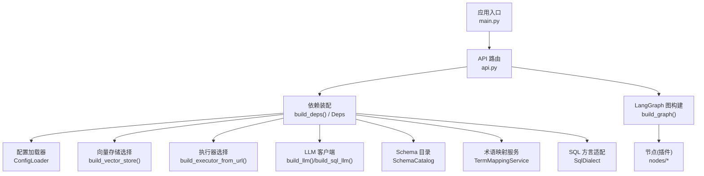
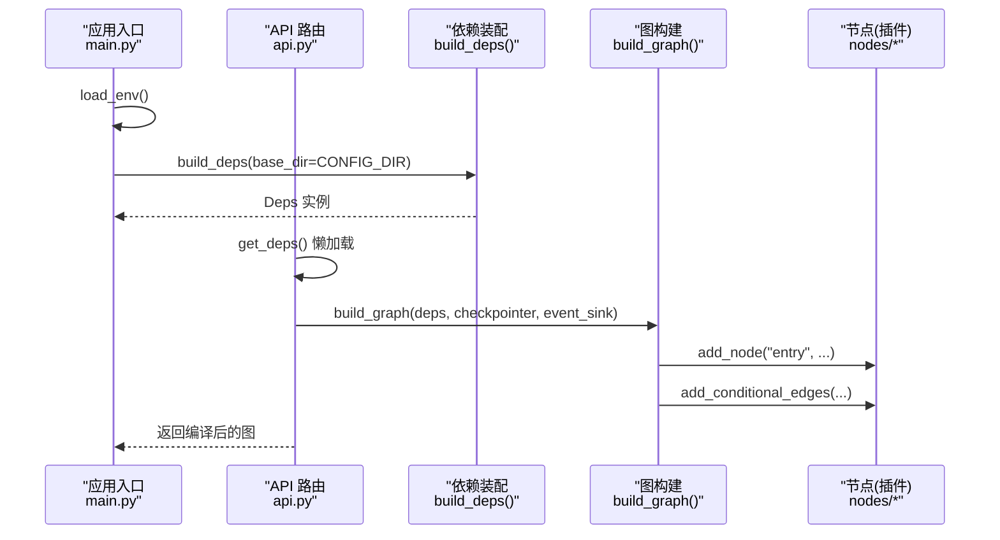
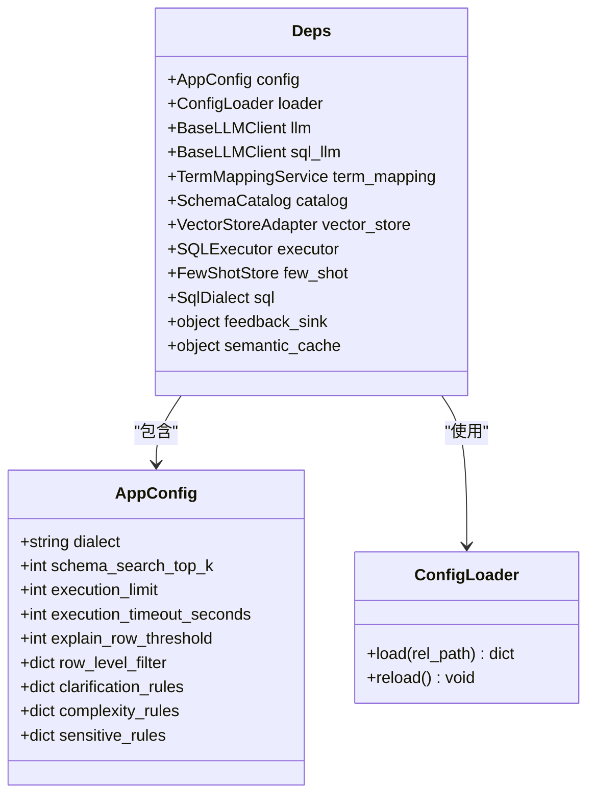
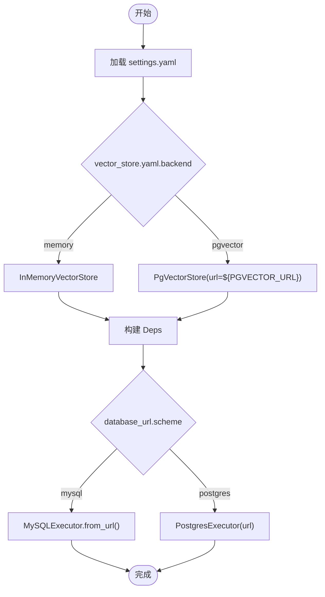
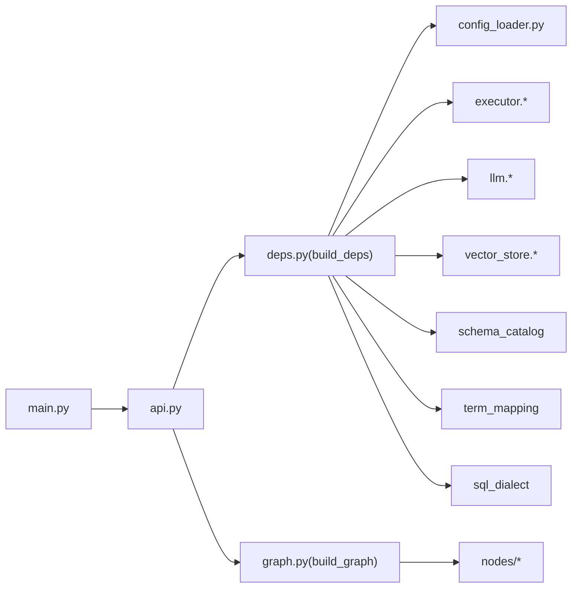

# 插件注册机制

<cite>
**本文引用的文件**   
- [deps.py](file://nl2sql_agent/services/deps.py)
- [config_loader.py](file://nl2sql_agent/services/config_loader.py)
- [settings.yaml](file://nl2sql_agent/config/settings.yaml)
- [vector_store.yaml](file://nl2sql_agent/config/vector_store.yaml)
- [model_config.yaml](file://nl2sql_agent/config/model_config.yaml)
- [main.py](file://nl2sql_agent/main.py)
- [api.py](file://nl2sql_agent/api.py)
- [graph.py](file://nl2sql_agent/graph.py)
- [term_mapping.py](file://nl2sql_agent/services/term_mapping.py)
- [testing.py](file://nl2sql_agent/testing.py)
</cite>

## 目录
1. [简介](#简介)
2. [项目结构](#项目结构)
3. [核心组件](#核心组件)
4. [架构总览](#架构总览)
5. [详细组件分析](#详细组件分析)
6. [依赖关系分析](#依赖关系分析)
7. [性能考量](#性能考量)
8. [故障排查指南](#故障排查指南)
9. [结论](#结论)
10. [附录](#附录)

## 简介
本文件面向 NL2SQL 系统的“插件注册机制”，围绕依赖注入容器（Deps 类）的设计原理与实现，系统阐述服务发现、生命周期管理、配置绑定等核心能力；解释插件的注册流程（静态注册与动态加载）；文档化插件配置文件格式与规范（settings.yaml 结构与环境变量映射）；提供完整插件注册示例（服务插件、中间件插件、扩展点）；并说明版本兼容性检查、冲突解决策略与热重载机制。最后给出插件开发的目录结构与命名约定建议，帮助开发者快速扩展系统能力。

## 项目结构
NL2SQL 的插件与依赖装配集中在 services 层与 config 层：
- 依赖装配与容器：services/deps.py 定义 AppConfig、Deps 以及 build_deps 构建器，负责从配置与环境变量装配服务实例。
- 配置加载与热更新：services/config_loader.py 提供基于 mtime 的 YAML 缓存与自动重载。
- 运行时入口：main.py 与 api.py 在进程启动时调用 load_env 与 build_deps，完成全局依赖初始化。
- 图编排与节点：graph.py 通过 build_graph 将各模块节点注册到 LangGraph，形成可插拔的执行流。
- 术语映射与热更新：services/term_mapping.py 支持按业务线 namespace 的术语映射文件热更新。
- 测试与双打：testing.py 提供 FakeLLM、InMemoryExecutor 等替换实现，便于无外部依赖运行。

图表来源 
- [main.py:24-80](file://nl2sql_agent/main.py#L24-L80)
- [api.py:44-49](file://nl2sql_agent/api.py#L44-L49)
- [deps.py:113-183](file://nl2sql_agent/services/deps.py#L113-L183)
- [config_loader.py:14-36](file://nl2sql_agent/services/config_loader.py#L14-L36)
- [graph.py:174-198](file://nl2sql_agent/graph.py#L174-L198)

章节来源
- [deps.py:1-183](file://nl2sql_agent/services/deps.py#L1-L183)
- [config_loader.py:1-36](file://nl2sql_agent/services/config_loader.py#L1-L36)
- [main.py:1-152](file://nl2sql_agent/main.py#L1-L152)
- [api.py:1-573](file://nl2sql_agent/api.py#L1-L573)
- [graph.py:1-313](file://nl2sql_agent/graph.py#L1-L313)

## 核心组件
- 依赖容器 Deps：集中持有所有运行时服务实例（配置、LLM、向量存储、执行器、Schema 目录、术语映射、SQL 方言、Few-Shot 存储等），并提供扩展预留字段（feedback_sink、semantic_cache）。
- 应用配置 AppConfig：从 settings.yaml 与规则文件装载运行时参数（dialect、top_k、执行限制、超时、行级过滤、各类规则集）。
- 配置加载器 ConfigLoader：YAML 文件读取、内存缓存、mtime 变更检测与 reload 清空缓存，实现毫秒级热更新。
- 构建器函数：
  - build_deps：统一装配 Deps，解析 settings.yaml、环境变量、数据库 URL scheme、向量存储后端、LLM 客户端等。
  - build_vector_store：根据 vector_store.yaml 选择 memory/pgvector 后端。
  - build_executor_from_url：根据 database_url scheme 选择 MySQL/Postgres 执行器。
- 图构建 build_graph：将 nodes/* 中的节点（插件）注册为 LangGraph 节点，并通过路由函数控制流程分支与重试。

章节来源
- [deps.py:40-183](file://nl2sql_agent/services/deps.py#L40-L183)
- [config_loader.py:14-36](file://nl2sql_agent/services/config_loader.py#L14-L36)
- [graph.py:174-198](file://nl2sql_agent/graph.py#L174-L198)

## 架构总览
下图展示依赖注入容器与插件注册的整体交互：应用入口加载环境并构建 Deps；API 层使用 Deps 构建 LangGraph；图构建阶段将各节点（插件）注册到图中；运行时通过 event_sink 推送节点事件，支持 WebSocket 流式输出。

图表来源 
- [main.py:24-80](file://nl2sql_agent/main.py#L24-L80)
- [api.py:44-49](file://nl2sql_agent/api.py#L44-L49)
- [deps.py:113-183](file://nl2sql_agent/services/deps.py#L113-L183)
- [graph.py:174-198](file://nl2sql_agent/graph.py#L174-L198)

## 详细组件分析

### 依赖注入容器（Deps 类）设计原理
- 职责边界：Deps 作为单一数据源聚合所有服务实例，避免散落的 global 状态；AppConfig 承载配置项，分离配置与实例。
- 服务发现：通过 build_deps 内部按名称解析配置与环境变量，再实例化具体服务（如 SQLExecutor、VectorStoreAdapter、BaseLLMClient）。
- 生命周期管理：
  - 进程级单例：main.py 与 api.py 中通过全局变量缓存 _graph/_checkpointer/_deps，确保同一进程内共享。
  - 按需构建：get_deps() 懒加载，首次访问才构建 Deps。
- 配置绑定：
  - settings.yaml 为主配置源，结合 .env 环境变量覆盖（如 DATABASE_URL、PG_DATABASE_URL、PGVECTOR_URL）。
  - 规则文件（clarification_rules.yaml、complexity_rules.yaml、sensitive_rules.yaml）由 AppConfig 装载。
- 扩展点预留：feedback_sink、semantic_cache 字段用于未来反馈闭环与语义缓存扩展。

图表来源 
- [deps.py:40-71](file://nl2sql_agent/services/deps.py#L40-L71)
- [config_loader.py:14-36](file://nl2sql_agent/services/config_loader.py#L14-L36)

章节来源
- [deps.py:40-183](file://nl2sql_agent/services/deps.py#L40-L183)

### 插件注册流程（静态注册与动态加载）
- 静态注册（图节点）：
  - graph.py 的 build_graph 中通过 add_node 将 nodes/* 下的每个节点以固定名称注册为 LangGraph 节点，形成确定的执行拓扑。
  - 路由函数（route_clarify、route_complexity、route_plan_validation、route_static_validation、route_sensitive、route_human_review、route_sandbox）决定分支与重试。
- 动态加载（配置驱动的服务）：
  - build_vector_store 根据 vector_store.yaml 的 backend 字段动态选择 InMemoryVectorStore 或 PgVectorStore。
  - build_executor_from_url 根据 database_url 的 scheme 动态选择 MySQLExecutor 或 PostgresExecutor。
  - TermMappingService 扫描 term_mapping/*.yaml 并按业务线 namespace 加载映射，支持热更新。

图表来源 
- [deps.py:87-111](file://nl2sql_agent/services/deps.py#L87-L111)
- [deps.py:73-84](file://nl2sql_agent/services/deps.py#L73-L84)
- [vector_store.yaml:1-6](file://nl2sql_agent/config/vector_store.yaml#L1-L6)
- [settings.yaml:1-30](file://nl2sql_agent/config/settings.yaml#L1-L30)

章节来源
- [graph.py:174-198](file://nl2sql_agent/graph.py#L174-L198)
- [deps.py:73-111](file://nl2sql_agent/services/deps.py#L73-L111)
- [term_mapping.py:47-80](file://nl2sql_agent/services/term_mapping.py#L47-L80)

### 插件配置文件格式与规范（settings.yaml 与环境变量映射）
- settings.yaml 关键键：
  - dialect：SQL 方言（mysql/postgres/duckdb 等），影响 SqlDialect 与执行器选择。
  - schema_search_top_k：向量兜底检索 Top-K。
  - database_url：主数据库连接字符串，优先于环境变量。
  - pg_database_url：兼容旧字段（仅 postgres）。
  - pgvector_url：pgvector 后端 URL（可通过 ${PGVECTOR_URL} 环境变量展开）。
  - execution.*：read_only、limit、timeout_seconds、explain_row_threshold。
  - row_level_filter.enabled/column：行级过滤开关与列名。
- 环境变量映射：
  - DATABASE_URL、PG_DATABASE_URL：数据库连接覆盖。
  - PGVECTOR_URL：pgvector.url 的环境变量展开。
  - ANTHROPIC_API_KEY、ANTHROPIC_MODEL：LLM 认证与模型名（由 load_env 加载 .env）。
- 其他配置：
  - vector_store.yaml：backend 与 pgvector.url。
  - model_config.yaml：embedding.provider、model、model_path、dimension，以及 nodes.* 专用模型。

章节来源
- [settings.yaml:1-30](file://nl2sql_agent/config/settings.yaml#L1-L30)
- [vector_store.yaml:1-6](file://nl2sql_agent/config/vector_store.yaml#L1-L6)
- [model_config.yaml:1-18](file://nl2sql_agent/config/model_config.yaml#L1-L18)
- [deps.py:121-137](file://nl2sql_agent/services/deps.py#L121-L137)

### 完整的插件注册示例
- 服务插件（向量存储）：
  - 在 vector_store.yaml 设置 backend=pgvector，并在 pgvector.url 中使用 ${PGVECTOR_URL} 环境变量；build_vector_store 会据此创建 PgVectorStore。
- 服务插件（执行器）：
  - 在 settings.yaml 设置 database_url=mysql://... 或 postgresql://...；build_executor_from_url 会根据 scheme 选择对应执行器。
- 中间件插件（CORS）：
  - main.py 通过 FastAPI 的 CORSMiddleware 添加跨域中间件，允许前端开发服务器访问。
- 扩展点（反馈闭环、语义缓存）：
  - Deps.feedback_sink 与 Deps.semantic_cache 预留字段，可在上层组装时注入自定义实现，例如将反馈写入审计库或实现查询结果语义缓存。

章节来源
- [deps.py:87-111](file://nl2sql_agent/services/deps.py#L87-L111)
- [deps.py:73-84](file://nl2sql_agent/services/deps.py#L73-L84)
- [main.py:49-55](file://nl2sql_agent/main.py#L49-L55)
- [deps.py:68-71](file://nl2sql_agent/services/deps.py#L68-L71)

### 版本兼容性检查、冲突解决策略与热重载机制
- 版本兼容性检查：
  - 当前代码未显式实现插件版本字段校验；建议在 AppConfig 或 Deps 扩展中加入 version 字段，并在 build_deps 中进行最小版本检查与告警。
- 冲突解决策略：
  - 配置优先级：settings.yaml > .env 环境变量 > 默认值；当存在同名键时，以上层覆盖下层。
  - 执行器与向量存储后端选择：基于 URL scheme 与 vector_store.yaml.backend 明确二选一，避免歧义。
- 热重载机制：
  - ConfigLoader.reload() 清空缓存，下一次 load 重新读取文件；TermMappingService._refresh_if_changed 基于 mtime 比对触发刷新。
  - API 层在修改术语映射后调用 loader.reload() 与 term_mapping._refresh() 实现即时生效。

章节来源
- [config_loader.py:14-36](file://nl2sql_agent/services/config_loader.py#L14-L36)
- [term_mapping.py:47-80](file://nl2sql_agent/services/term_mapping.py#L47-L80)
- [api.py:426-433](file://nl2sql_agent/api.py#L426-L433)

### 插件开发的目录结构与命名约定
- 目录结构建议：
  - nl2sql_agent/nodes/*：每个节点一个文件，命名遵循 mX_*.py（如 m1_entry.py、m2_clarify_time_range.py），对外暴露 make_*_node(deps) 工厂函数。
  - nl2sql_agent/services/*：服务实现（executor、llm、vector_store、schema_catalog、term_mapping 等）。
  - nl2sql_agent/config/*：YAML 配置文件（settings.yaml、vector_store.yaml、model_config.yaml、rules/*.yaml、term_mapping/*.yaml）。
- 命名约定：
  - 节点工厂函数统一以 make_前缀命名，接收 deps 参数，返回节点函数。
  - 配置键采用小写下划线风格，环境变量采用大写加下划线。
  - 业务线命名空间使用 snake_case（如 risk_mart、dw、core）。

章节来源
- [graph.py:185-198](file://nl2sql_agent/graph.py#L185-L198)
- [m1_entry.py:14-28](file://nl2sql_agent/nodes/m1_entry.py#L14-L28)

## 依赖关系分析
- 组件耦合与内聚：
  - Deps 高内聚地聚合服务实例，降低模块间直接耦合；graph.py 仅依赖 Deps 与 nodes 接口，保持编排与实现的解耦。
- 直接/间接依赖：
  - main.py/api.py 依赖 deps.build_deps 与 graph.build_graph；build_deps 依赖 config_loader、executor、llm、vector_store、schema_catalog、term_mapping、sql_dialect。
- 潜在循环依赖：
  - 当前未发现循环导入；节点通过 make_*_node 工厂函数延迟绑定，避免在模块加载期产生循环。
- 外部依赖与集成点：
  - FastAPI、LangGraph、Pydantic、dotenv、yaml、sqlite（checkpoint）、数据库驱动（MySQL/Postgres）。

图表来源 
- [main.py:24-80](file://nl2sql_agent/main.py#L24-L80)
- [api.py:44-49](file://nl2sql_agent/api.py#L44-L49)
- [deps.py:113-183](file://nl2sql_agent/services/deps.py#L113-L183)
- [graph.py:174-198](file://nl2sql_agent/graph.py#L174-L198)

章节来源
- [deps.py:113-183](file://nl2sql_agent/services/deps.py#L113-L183)
- [graph.py:174-198](file://nl2sql_agent/graph.py#L174-L198)

## 性能考量
- 配置加载缓存：ConfigLoader 基于 mtime 缓存，避免重复 IO；reload() 仅在需要时清空缓存。
- 懒加载与单例：get_deps() 与 _graph/_checkpointer 全局缓存减少重复构建开销。
- 事件推送容错：_emit 捕获异常，避免事件推送失败阻塞主流程。
- 向量存储签名：InMemoryVectorStore 使用 embedding_cfg 的 JSON 签名作为缓存键，避免模型切换导致缓存污染。

[本节为通用性能指导，不直接分析具体文件]

## 故障排查指南
- 未配置数据库连接：
  - 现象：build_deps 抛出 RuntimeError，提示未配置 DATABASE_URL 或 settings.yaml 的 database_url。
  - 处理：在 .env 设置 DATABASE_URL，或在 settings.yaml 填写 database_url。
- pgvector 后端未配置 URL：
  - 现象：vector_store.yaml.backend=pgvector 但未提供 pgvector.url 或 PGVECTOR_URL。
  - 处理：在 vector_store.yaml 的 pgvector.url 中设置 ${PGVECTOR_URL}，并确保环境变量已设置。
- 术语映射热更新无效：
  - 现象：修改 term_mapping/*.yaml 后未生效。
  - 处理：调用 API 层的 put_term_mapping，触发 loader.reload() 与 term_mapping._refresh()。
- 节点未注册或路由错误：
  - 现象：build_graph 缺少 add_node 或路由函数返回未知分支。
  - 处理：检查 graph.py 中节点注册与路由函数返回值是否匹配。

章节来源
- [deps.py:162-170](file://nl2sql_agent/services/deps.py#L162-L170)
- [deps.py:97-110](file://nl2sql_agent/services/deps.py#L97-L110)
- [api.py:426-433](file://nl2sql_agent/api.py#L426-L433)
- [graph.py:174-198](file://nl2sql_agent/graph.py#L174-L198)

## 结论
NL2SQL 的插件注册机制以 Deps 为核心，通过 build_deps 统一装配服务实例，结合 ConfigLoader 的热重载与 settings.yaml/.env 的配置优先级，实现了灵活、可扩展的依赖注入体系。图构建阶段将节点（插件）静态注册到 LangGraph，同时通过配置驱动的服务选择（向量存储、执行器）实现动态加载。未来可在 Deps 中引入版本字段与兼容性检查，完善冲突解决策略，进一步提升插件生态的可维护性与稳定性。

[本节为总结性内容，不直接分析具体文件]

## 附录
- 测试与双打：
  - testing.py 提供 FakeLLM、InMemoryExecutor、fake_embedding，便于在无外部依赖环境下运行与回归测试。
  - conftest.py 通过隔离配置目录与 set_test_config_dir 保证测试独立性。

章节来源
- [testing.py:148-187](file://nl2sql_agent/testing.py#L148-L187)
- [conftest.py:46-56](file://nl2sql_agent/tests/conftest.py#L46-L56)