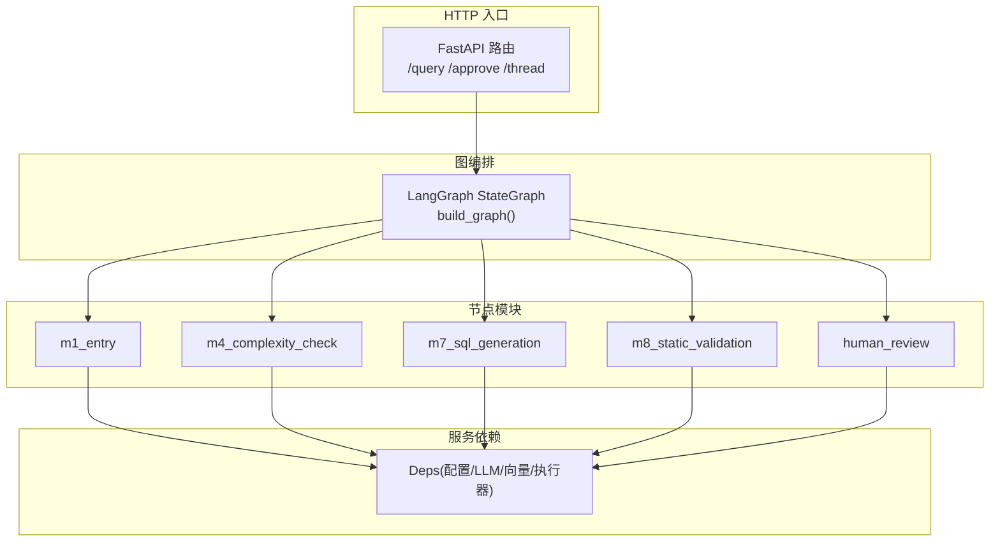
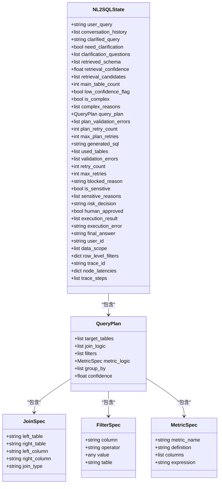
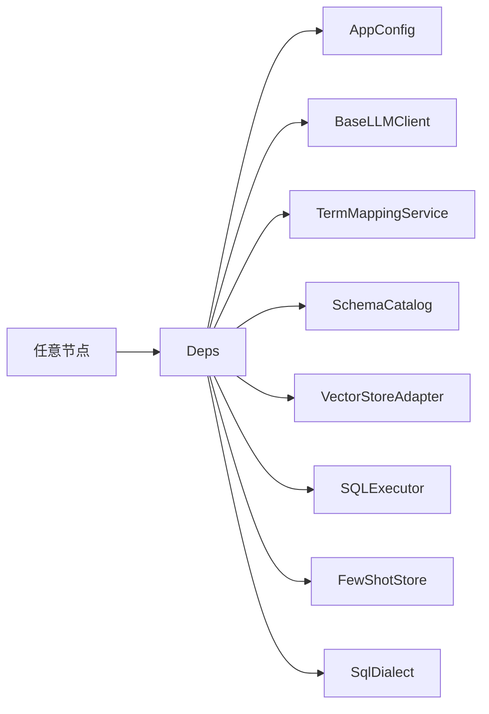

# 自定义节点开发

<cite>
**本文引用的文件**   
- [graph.py](file://nl2sql_agent/graph.py)
- [state.py](file://nl2sql_agent/state.py)
- [deps.py](file://nl2sql_agent/services/deps.py)
- [main.py](file://nl2sql_agent/main.py)
- [m1_entry.py](file://nl2sql_agent/nodes/m1_entry.py)
- [m4_complexity_check.py](file://nl2sql_agent/nodes/m4_complexity_check.py)
- [m7_sql_generation.py](file://nl2sql_agent/nodes/m7_sql_generation.py)
- [m8_static_validation.py](file://nl2sql_agent/nodes/m8_static_validation.py)
- [human_review.py](file://nl2sql_agent/nodes/human_review.py)
- [testing.py](file://nl2sql_agent/testing.py)
- [test_nodes.py](file://nl2sql_agent/tests/test_nodes.py)
- [conftest.py](file://nl2sql_agent/tests/conftest.py)
</cite>

## 目录
1. [引言](#引言)
2. [项目结构](#项目结构)
3. [核心组件](#核心组件)
4. [架构总览](#架构总览)
5. [详细组件分析](#详细组件分析)
6. [依赖分析](#依赖分析)
7. [性能考虑](#性能考虑)
8. [故障排查指南](#故障排查指南)
9. [结论](#结论)
10. [附录：自定义节点开发示例与最佳实践](#附录自定义节点开发示例与最佳实践)

## 引言
本文件面向希望在 NL2SQL 系统中基于 LangGraph 工作流开发“自定义节点”的工程师，系统性阐述节点架构、状态管理、输入输出规范、错误处理、事件与异步模式、注册与依赖注入、版本兼容与测试策略。文档以仓库现有实现为依据，提供可操作的步骤与图示，帮助读者快速上手并安全扩展。

## 项目结构
NL2SQL 系统采用“图编排 + 节点模块 + 服务依赖”的分层组织：
- 图编排：定义节点、边与路由规则，编译为可执行图。
- 节点模块：每个业务环节一个节点，遵循统一签名与状态读写约定。
- 服务依赖：通过 Deps 装配 LLM、向量库、执行器、配置等外部能力。
- HTTP 入口：FastAPI 暴露查询、审批、线程状态接口，驱动图的运行与中断恢复。



**图表来源** 
- [graph.py:174-312](file://nl2sql_agent/graph.py#L174-L312)
- [main.py:83-145](file://nl2sql_agent/main.py#L83-L145)

**章节来源**
- [graph.py:174-312](file://nl2sql_agent/graph.py#L174-L312)
- [main.py:83-145](file://nl2sql_agent/main.py#L83-L145)

## 核心组件
- 全局状态 NL2SQLState：所有节点共享的状态模型，包含用户输入、检索结果、计划、SQL、校验、敏感判定、执行结果、权限与追踪字段。
- 依赖装配 Deps：集中装配 AppConfig、LLM、TermMapping、SchemaCatalog、VectorStore、Executor、FewShot、SqlDialect 等。
- 图构建 build_graph：将节点加入图、添加边与条件路由、设置检查点与中断点、返回可执行图。
- HTTP 入口：封装 query/approve/thread 接口，调用 graph.invoke/get_state，支持人工确认中断恢复。

**章节来源**
- [state.py:83-146](file://nl2sql_agent/state.py#L83-L146)
- [deps.py:40-71](file://nl2sql_agent/services/deps.py#L40-L71)
- [deps.py:113-184](file://nl2sql_agent/services/deps.py#L113-L184)
- [graph.py:174-312](file://nl2sql_agent/graph.py#L174-L312)
- [main.py:83-145](file://nl2sql_agent/main.py#L83-L145)

## 架构总览
下图展示从请求到执行的端到端流程，包括关键路由与重试回路。

```mermaid
sequenceDiagram
participant Client as "客户端"
participant API as "FastAPI"
participant Graph as "LangGraph 图"
participant Node1 as "entry"
participant Node4 as "complexity_check"
participant Node7 as "sql_generation"
participant Node8 as "static_validation"
participant NodeH as "human_review"
participant Node10 as "sandbox_execution"
participant Node11 as "result_interpretation"
Client->>API : POST /query
API->>Graph : invoke(state, config)
Graph->>Node1 : 校验输入/生成 trace_id
Node1-->>Graph : 更新 user_query/trace_id
Graph->>Node4 : 复杂度判断
alt 简单路径
Graph->>Node7 : 生成 SQL
Node7-->>Graph : generated_sql/used_tables
Graph->>Node8 : 静态校验
Node8-->>Graph : 通过或失败(含 blocked_reason)
alt 非危险且失败
Graph->>Node7 : 重试(最多 max_retries)
end
alt 通过
Graph->>NodeH : 敏感判定需审批?
NodeH-->>Graph : 批准/拒绝
alt 批准
Graph->>Node10 : 沙箱执行
Node10-->>Graph : 成功/失败
alt 失败
Graph->>Node7 : 重试(最多 max_retries)
end
Graph->>Node11 : 结果解释
Node11-->>Graph : final_answer
else 拒绝
Graph-->>API : 终止
end
end
else 复杂路径
Graph->>Node7 : 生成 SQL (带计划)
...
end
Graph-->>API : 返回最终状态
API-->>Client : JSON 响应
```

**图表来源** 
- [graph.py:174-312](file://nl2sql_agent/graph.py#L174-L312)
- [main.py:83-145](file://nl2sql_agent/main.py#L83-L145)

## 详细组件分析

### 节点状态管理与输入输出规范
- 状态模型 NL2SQLState：
  - 输入区：user_query、conversation_history、user_id、data_scope、row_level_filters、trace_id。
  - 中间区：retrieved_schema、retrieval_confidence、is_complex、query_plan、generated_sql、validation_errors、risk_decision、human_approved。
  - 输出区：execution_result、final_answer、blocked_reason、node_latencies、trace_steps。
- 节点函数签名：接受 state: NL2SQLState，返回 NL2SQLState | dict（推荐返回 dict 增量更新）。
- 事件与追踪：图在节点外层包装 _traced，记录 node_start/node_complete、延迟与步骤；_emit 推送结构化事件给 event_sink。

**章节来源**
- [state.py:83-146](file://nl2sql_agent/state.py#L83-L146)
- [graph.py:88-103](file://nl2sql_agent/graph.py#L88-L103)
- [graph.py:72-86](file://nl2sql_agent/graph.py#L72-L86)

### 节点注册与依赖注入
- 注册方式：在 build_graph 中通过 g.add_node(name, wrapped_fn) 注册节点，wrapped_fn 由 _traced(name, fn, event_sink) 包装。
- 依赖注入：每个节点工厂 make_xxx_node(deps) 接收 deps，内部按需使用 deps.config、deps.llm、deps.executor、deps.vector_store 等。
- 图编译：g.compile(checkpointer=..., interrupt_before=[...]) 启用持久化与中断点（如 human_review、clarify_candidates、clarify_low_confidence）。

**章节来源**
- [graph.py:174-210](file://nl2sql_agent/graph.py#L174-L210)
- [graph.py:210-312](file://nl2sql_agent/graph.py#L210-L312)
- [deps.py:40-71](file://nl2sql_agent/services/deps.py#L40-L71)

### 节点间通信协议与事件传递
- 状态通信：节点之间通过 NL2SQLState 字段进行数据交换，节点仅写自身关心的字段，避免耦合。
- 事件推送：_emit 将 {event, node, trace_id, data} 推送到 event_sink，用于前端流式展示与调试。
- 重试事件：_retry_route 在决定重试时推送 retry 事件，包含 attempt 与 reason。

**章节来源**
- [graph.py:72-86](file://nl2sql_agent/graph.py#L72-L86)
- [graph.py:106-126](file://nl2sql_agent/graph.py#L106-L126)

### 异步处理模式
- 当前节点实现均为同步函数，由 LangGraph 调度执行。
- 如需异步，可在节点内调用异步服务并通过 await 等待，但需确保图运行时环境支持异步回调。
- 事件推送 _emit 对异常吞掉，保证事件失败不影响主流程。

**章节来源**
- [graph.py:72-86](file://nl2sql_agent/graph.py#L72-L86)

### 错误处理机制
- 节点级错误：抛出异常会被上层捕获，建议尽量返回结构化错误字段（如 validation_errors、blocked_reason），便于重试与诊断。
- 重试控制：route_* 函数根据 state 字段决定 pass/retry/give_up/blocked，限制最大重试次数。
- 危险操作拦截：静态校验检测到危险 SQL 直接 blocked，不进入重试。

**章节来源**
- [graph.py:138-170](file://nl2sql_agent/graph.py#L138-L170)
- [m8_static_validation.py:33-56](file://nl2sql_agent/nodes/m8_static_validation.py#L33-L56)

### 节点开发范式与示例

#### 简单数据处理节点（示例：m1_entry）
- 职责：校验必填字段、规范化输入、生成 trace_id。
- 输入：user_query、user_id、data_scope。
- 输出：user_query（去空白）、trace_id。
- 错误：缺失必填字段抛错。

**章节来源**
- [m1_entry.py:14-27](file://nl2sql_agent/nodes/m1_entry.py#L14-L27)

#### 复杂业务逻辑节点（示例：m7_sql_generation）
- 职责：根据 QueryPlan 或自然语言生成 SQL，同时输出 used_tables。
- 输入：state.query_plan/state.retrieved_schema/state.user_query。
- 输出：generated_sql、used_tables、清空上一轮 validation_errors/execution_error。
- 依赖：deps.sql_llm 或 deps.llm 的 complete_sql。

**章节来源**
- [m7_sql_generation.py:94-113](file://nl2sql_agent/nodes/m7_sql_generation.py#L94-L113)

#### 路由与决策节点（示例：m4_complexity_check）
- 职责：依据规则判断是否走计划路径。
- 输入：state.clarified_query/state.data_scope/state.main_table_count/state.low_confidence_flag。
- 输出：is_complex、complex_reasons。

**章节来源**
- [m4_complexity_check.py:17-52](file://nl2sql_agent/nodes/m4_complexity_check.py#L17-L52)

#### 安全与校验节点（示例：m8_static_validation）
- 职责：语法/方言校验、危险操作拦截、字段幻觉检测、行级过滤注入。
- 输入：generated_sql、used_tables、retrieved_schema、row_level_filters。
- 输出：validation_errors、blocked_reason、injected SQL。

**章节来源**
- [m8_static_validation.py:33-153](file://nl2sql_agent/nodes/m8_static_validation.py#L33-L153)

#### 人工确认节点（示例：human_review）
- 职责：通过 interrupt 暂停流程，等待人工审批。
- 输入：interrupt(payload)。
- 输出：human_approved、final_answer（拒绝时）。

**章节来源**
- [human_review.py:15-32](file://nl2sql_agent/nodes/human_review.py#L15-L32)

### 类关系与数据模型


**图表来源** 
- [state.py:14-82](file://nl2sql_agent/state.py#L14-L82)
- [state.py:83-146](file://nl2sql_agent/state.py#L83-L146)

## 依赖分析
- 节点与服务的耦合：节点通过 deps 访问配置、LLM、向量库、执行器等，降低硬编码耦合。
- 图与节点的解耦：build_graph 负责组装，节点只关注自身逻辑。
- 外部依赖：数据库连接、LLM 密钥、向量存储后端均通过配置与环境变量注入。



**图表来源** 
- [deps.py:40-71](file://nl2sql_agent/services/deps.py#L40-L71)

**章节来源**
- [deps.py:113-184](file://nl2sql_agent/services/deps.py#L113-L184)

## 性能考虑
- 事件推送优化：_event_data 对 execution_result 截断前 20 条，避免刷屏。
- 重试上限：plan_retry_count、retry_count、max_plan_retries/max_retries 限制循环次数。
- 向量检索权重：按查询特征动态调整表/列权重，减少无效召回。
- 检查点序列化：JsonPlusSerializer 允许特定模块类型，避免反序列化告警。

**章节来源**
- [graph.py:60-70](file://nl2sql_agent/graph.py#L60-L70)
- [graph.py:296-312](file://nl2sql_agent/graph.py#L296-L312)

## 故障排查指南
- 常见错误定位：
  - 必填字段缺失：入口节点会抛错，检查 user_query/user_id/data_scope。
  - SQL 语法/方言错误：静态校验返回具体错误信息，查看 validation_errors。
  - 危险操作拦截：blocked_reason 指示原因，禁止重试。
  - 字段幻觉：检查 used_tables 与 AST 解析结果一致性。
- 调试技巧：
  - 使用 event_sink 观察 node_start/node_complete/retry 事件。
  - 通过 /thread/{id} 获取完整 state 快照。
  - 单元测试中使用 FakeLLM/InMemoryExecutor 隔离外部依赖。

**章节来源**
- [m1_entry.py:14-27](file://nl2sql_agent/nodes/m1_entry.py#L14-L27)
- [m8_static_validation.py:33-56](file://nl2sql_agent/nodes/m8_static_validation.py#L33-L56)
- [main.py:142-145](file://nl2sql_agent/main.py#L142-L145)
- [testing.py:26-66](file://nl2sql_agent/testing.py#L26-L66)

## 结论
NL2SQL 的自定义节点体系以 NL2SQLState 为核心，结合 LangGraph 的图编排与事件机制，实现了高内聚、低耦合、可观测、可重试的工作流。通过 Deps 注入外部能力，节点只需专注业务逻辑。遵循本文规范，开发者可安全扩展新节点，并保持向后兼容与可测试性。

## 附录：自定义节点开发示例与最佳实践

### 开发步骤
1. 新建节点文件 nodes/mX_xxx.py，实现 make_xxx_node(deps) 工厂函数。
2. 在 graph.py 的 build_graph 中注册节点与边，必要时添加条件路由。
3. 在 NL2SQLState 中新增必要字段（如需），保持向后兼容（默认值）。
4. 编写单元测试，使用 testing.build_test_deps 与 conftest 夹具。

**章节来源**
- [graph.py:174-210](file://nl2sql_agent/graph.py#L174-L210)
- [state.py:83-146](file://nl2sql_agent/state.py#L83-L146)
- [testing.py:148-187](file://nl2sql_agent/testing.py#L148-L187)
- [conftest.py:46-66](file://nl2sql_agent/tests/conftest.py#L46-L66)

### 节点注册与依赖注入示例
- 注册：g.add_node("your_node", t("your_node", mX_your.make_your_node(deps)))
- 依赖：在节点内使用 deps.config、deps.llm、deps.executor 等。

**章节来源**
- [graph.py:185-198](file://nl2sql_agent/graph.py#L185-L198)
- [deps.py:40-71](file://nl2sql_agent/services/deps.py#L40-L71)

### 状态流转控制与路由
- 使用 route_* 函数根据 state 字段决定 next 节点。
- 使用 _retry_route 包装路由，自动推送 retry 事件。

**章节来源**
- [graph.py:130-170](file://nl2sql_agent/graph.py#L130-L170)
- [graph.py:106-126](file://nl2sql_agent/graph.py#L106-L126)

### 事件传递与异步处理
- 事件推送：_emit(sink, event, node, trace_id, data)
- 异步：节点内可使用 async/await，但需确保图运行时支持。

**章节来源**
- [graph.py:72-86](file://nl2sql_agent/graph.py#L72-L86)

### 测试策略与调试技巧
- 使用 FakeLLM/InMemoryExecutor 构造确定性测试。
- 通过 pytest 夹具隔离配置，避免污染真实环境。
- 使用 /thread/{id} 查看状态快照，结合事件日志定位问题。

**章节来源**
- [testing.py:26-66](file://nl2sql_agent/testing.py#L26-L66)
- [conftest.py:46-66](file://nl2sql_agent/tests/conftest.py#L46-L66)
- [test_nodes.py:1-450](file://nl2sql_agent/tests/test_nodes.py#L1-L450)

### 版本管理与向后兼容性
- 新增状态字段必须提供默认值，避免破坏旧状态。
- 路由变更需保持旧分支兼容，逐步迁移。
- 配置项新增需提供默认值与回退逻辑。

**章节来源**
- [state.py:83-146](file://nl2sql_agent/state.py#L83-L146)
- [deps.py:113-184](file://nl2sql_agent/services/deps.py#L113-L184)