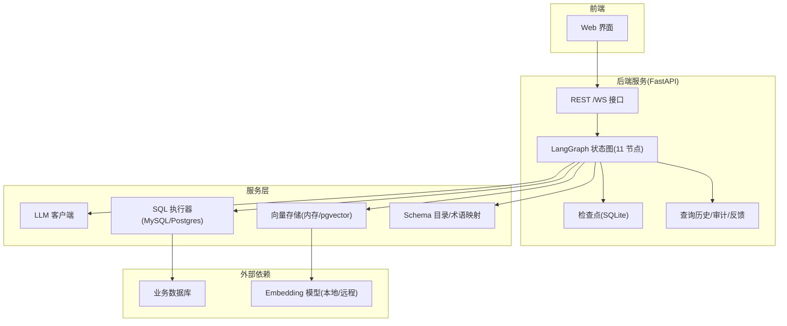
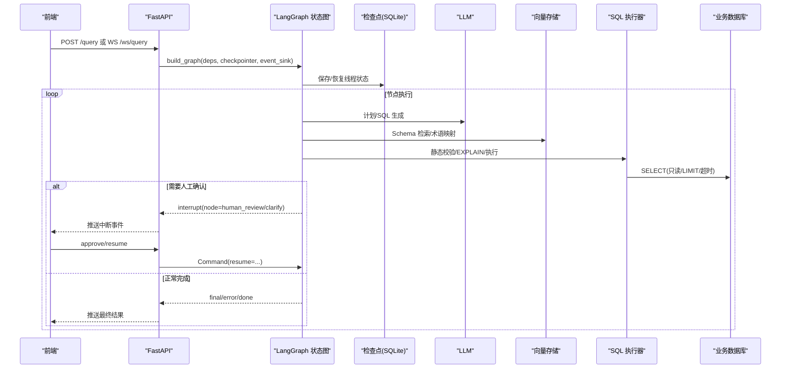
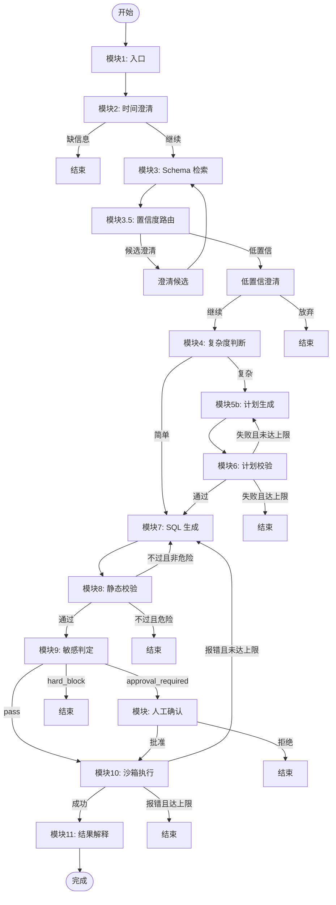
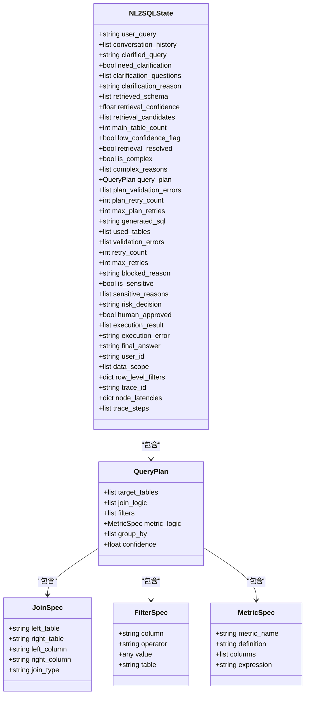
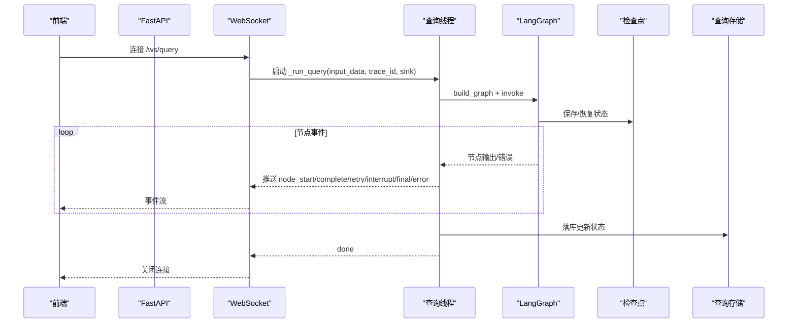
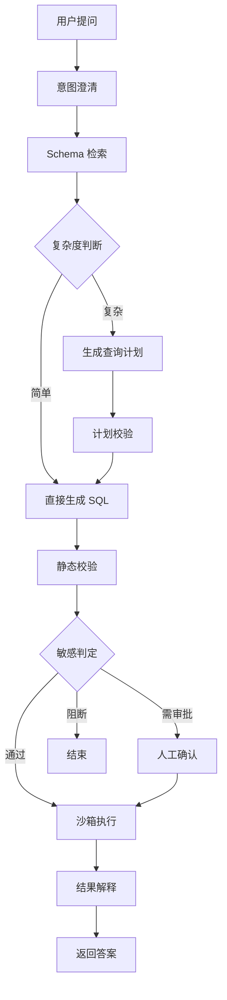
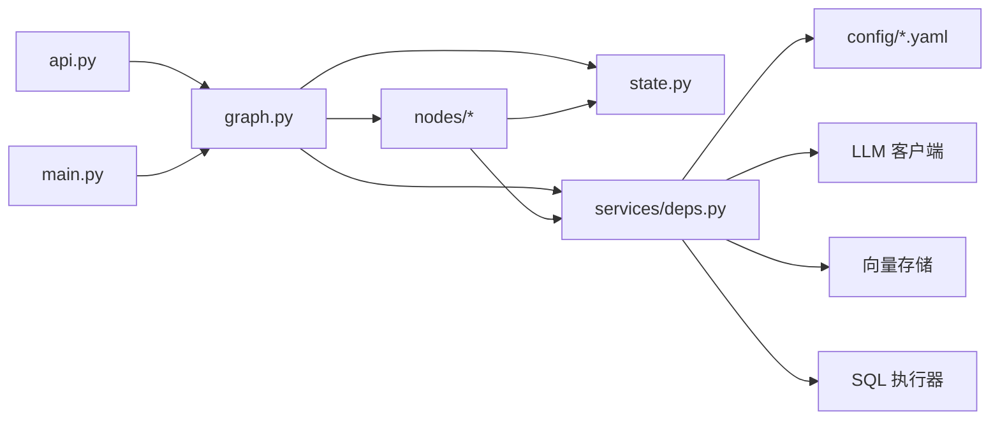

# 整体架构概览

<cite>
**本文引用的文件**   
- [graph.py](file://nl2sql_agent/graph.py)
- [state.py](file://nl2sql_agent/state.py)
- [main.py](file://nl2sql_agent/main.py)
- [api.py](file://nl2sql_agent/api.py)
- [deps.py](file://nl2sql_agent/services/deps.py)
- [settings.yaml](file://nl2sql_agent/config/settings.yaml)
- [model_config.yaml](file://nl2sql_agent/config/model_config.yaml)
- [NL2SQL.md](file://NL2SQL.md)
- [pyproject.toml](file://pyproject.toml)
- [m1_entry.py](file://nl2sql_agent/nodes/m1_entry.py)
- [m7_sql_generation.py](file://nl2sql_agent/nodes/m7_sql_generation.py)
- [m9_sensitive_check.py](file://nl2sql_agent/nodes/m9_sensitive_check.py)
</cite>

## 目录
1. [简介](#简介)
2. [项目结构](#项目结构)
3. [核心组件](#核心组件)
4. [架构总览](#架构总览)
5. [详细组件分析](#详细组件分析)
6. [依赖关系分析](#依赖关系分析)
7. [性能与可扩展性](#性能与可扩展性)
8. [故障排查指南](#故障排查指南)
9. [结论](#结论)
10. [附录：技术栈与版本兼容性](#附录技术栈与版本兼容性)

## 简介
本文件为 NL2SQL 系统的整体架构概览，聚焦基于 LangGraph 的状态机工作流模式。系统通过“状态图 + 节点 + 路由”的方式编排从自然语言到 SQL 生成、校验、执行与结果解释的完整链路，并在关键路径引入人工确认与敏感策略拦截，确保安全性与可解释性。文档同时说明选择 LangGraph 的原因与权衡、系统上下文与技术栈、基础设施需求、部署拓扑与可扩展性设计，并提供面向初学者与高级开发者的分层解读。

## 项目结构
- 后端服务入口与 HTTP API：FastAPI 提供 REST 与 WebSocket 接口，负责查询提交、审批恢复、历史与审计、配置管理等。
- 工作流引擎：LangGraph StateGraph 定义 11 个模块节点与路由规则，内置检查点与中断机制，支持线程级状态持久化与断线重连。
- 状态模型：Pydantic 强类型状态描述全链路数据流转，包含权限、检索、计划、校验、风险决策、执行与结果等字段。
- 服务装配：依赖注入统一构建 LLM、向量存储、SQL 方言、执行器、术语映射与 Few-shot 存储等。
- 配置中心：YAML 集中管理运行参数、模型配置、规则集（澄清/复杂度/敏感）与向量库后端。
- 前端：React/Vite 页面用于查询、审批、历史、Schema 审核与配置管理。

图表来源
- [main.py:1-152](file://nl2sql_agent/main.py#L1-L152)
- [api.py:1-573](file://nl2sql_agent/api.py#L1-L573)
- [graph.py:1-313](file://nl2sql_agent/graph.py#L1-L313)
- [deps.py:1-178](file://nl2sql_agent/services/deps.py#L1-L178)

章节来源
- [main.py:1-152](file://nl2sql_agent/main.py#L1-L152)
- [api.py:1-573](file://nl2sql_agent/api.py#L1-L573)
- [graph.py:1-313](file://nl2sql_agent/graph.py#L1-L313)
- [deps.py:1-178](file://nl2sql_agent/services/deps.py#L1-L178)

## 核心组件
- 状态机与工作流：StateGraph 定义 11 个节点与条件边，形成“澄清→检索→复杂度→计划/直出→SQL→静态校验→敏感判定→人工确认→沙箱执行→结果解释”的主干流程，并内置两条重试回路（计划校验失败回退至计划；执行失败回退至 SQL 生成）。
- 状态模型：NL2SQLState 以 Pydantic 强类型约束全链路数据，包括用户输入、权限范围、检索命中、计划、校验错误、风险决策、执行结果与追踪信息。
- 服务装配：Deps 聚合 AppConfig、ConfigLoader、LLM、TermMapping、SchemaCatalog、VectorStore、Executor、FewShot、SqlDialect 等，按配置动态选择后端（如 pgvector vs 内存向量库）。
- API 与事件流：REST 提供非流式查询与审批；WebSocket 提供节点事件流（node_start/complete/retry/interrupt/final/error），并通过 EventStream 桥接同步线程与异步事件循环。
- 检查点与中断：SQLite Checkpointer 持久化线程状态，支持 interrupt_before 暂停在人工确认或澄清节点，允许断线重连与恢复。

章节来源
- [graph.py:1-313](file://nl2sql_agent/graph.py#L1-L313)
- [state.py:1-146](file://nl2sql_agent/state.py#L1-L146)
- [deps.py:1-178](file://nl2sql_agent/services/deps.py#L1-L178)
- [api.py:1-573](file://nl2sql_agent/api.py#L1-L573)

## 架构总览
下图展示系统上下文与主要交互：前端通过 FastAPI 发起查询，后端构建并调用 LangGraph 状态图，节点间通过 NL2SQLState 传递数据，必要时触发人工确认或安全阻断；执行阶段连接业务数据库，向量存储用于 Schema 语义检索，LLM 用于计划与 SQL 生成。

图表来源
- [main.py:1-152](file://nl2sql_agent/main.py#L1-L152)
- [api.py:1-573](file://nl2sql_agent/api.py#L1-L573)
- [graph.py:1-313](file://nl2sql_agent/graph.py#L1-L313)

## 详细组件分析

### 工作流与状态机（LangGraph）
- 节点与路由：11 个节点分别对应入口、时间澄清、Schema 检索、置信度路由、复杂度判断、计划生成、计划校验、SQL 生成、静态校验、敏感判定、人工确认、沙箱执行、结果解释。
- 重试边界：计划校验失败仅在计划内部重试（上限 max_plan_retries）；执行失败仅退回 SQL 生成（上限 max_retries）；危险操作直接阻断不进入重试。
- 中断与恢复：interrupt_before 指定 human_review、clarify_candidates、clarify_low_confidence 三个节点可被中断，配合 Command(resume=...) 恢复。

图表来源
- [graph.py:1-313](file://nl2sql_agent/graph.py#L1-L313)

章节来源
- [graph.py:1-313](file://nl2sql_agent/graph.py#L1-L313)

### 状态模型（NL2SQLState）
- 字段分组：用户输入与对话历史、澄清相关、Schema 检索与置信度、复杂度判断、查询计划、SQL 生成与校验、敏感判定与人工确认、执行与结果、身份与权限、追踪信息。
- 强类型约束：使用 Pydantic 严格校验 JoinSpec、FilterSpec、MetricSpec、QueryPlan 等结构，避免非法字段与类型错误。
- 运行时扩展：trace_id、node_latencies、trace_steps 用于链路追踪与性能分析。

图表来源
- [state.py:1-146](file://nl2sql_agent/state.py#L1-L146)

章节来源
- [state.py:1-146](file://nl2sql_agent/state.py#L1-L146)

### API 与事件流（REST + WebSocket）
- REST：/api/query 非流式提交，返回 trace_id 与状态；/api/query/{id} 查询状态；/api/query/{id}/approve 与 /resume 恢复中断；/history、/approvals、/audit、/feedback 提供历史与审计能力；/config/* 提供配置读写。
- WebSocket：/ws/query 流式推送节点事件，支持断线重连与恢复；EventStream 将同步线程事件安全投递到异步队列。
- 检查点共享：_checkpointer 全局单例，确保查询与审批使用同一实例，保证线程状态一致性。

图表来源
- [api.py:1-573](file://nl2sql_agent/api.py#L1-L573)
- [main.py:1-152](file://nl2sql_agent/main.py#L1-L152)

章节来源
- [api.py:1-573](file://nl2sql_agent/api.py#L1-L573)
- [main.py:1-152](file://nl2sql_agent/main.py#L1-L152)

### 关键节点实现要点
- 入口节点（模块1）：校验 user_id、data_scope 与 user_query 必填，规范化 trace_id，后续权限信息不再重复获取。
- SQL 生成（模块7）：根据是否具备计划构建不同 prompt，强制只生成 SELECT，输出 used_tables 供静态校验交叉比对；失败时携带上一次错误进行重试提示。
- 敏感判定（模块9）：依据配置规则（敏感字段、EXPLAIN 预估行数、金额字段聚合/导出、低置信度）输出 pass/approval_required/hard_block，硬阻断直接结束。

章节来源
- [m1_entry.py:1-28](file://nl2sql_agent/nodes/m1_entry.py#L1-L28)
- [m7_sql_generation.py:1-113](file://nl2sql_agent/nodes/m7_sql_generation.py#L1-L113)
- [m9_sensitive_check.py:1-106](file://nl2sql_agent/nodes/m9_sensitive_check.py#L1-L106)

### 概念性概览（面向初学者）
- 目标：把自然语言问题转化为安全、准确、可执行的 SQL，并在高风险场景引入人工确认。
- 方法：先澄清意图，再检索相关表结构，判断复杂度决定是否需要结构化计划，随后生成 SQL 并进行语法与安全校验，最后执行并解释结果。
- 保障：强类型状态、规则驱动的安全策略、检查点与中断、事件流可视化与审计。

[此图为概念流程图，不直接映射具体代码文件]

## 依赖关系分析
- 组件耦合：graph 依赖 nodes 与 services；nodes 依赖 state 与 deps；api/main 依赖 graph 与 services；services 之间通过 Deps 解耦。
- 外部依赖：LLM（Anthropic/OpenAI）、向量存储（内存/pgvector）、SQL 执行器（MySQL/Postgres）、检查点（SQLite）。
- 配置驱动：dialect、schema_search_top_k、execution 限制、row_level_filter、embedding provider 等均通过 YAML 配置。

图表来源
- [graph.py:1-313](file://nl2sql_agent/graph.py#L1-L313)
- [deps.py:1-178](file://nl2sql_agent/services/deps.py#L1-L178)
- [api.py:1-573](file://nl2sql_agent/api.py#L1-L573)
- [main.py:1-152](file://nl2sql_agent/main.py#L1-L152)

章节来源
- [graph.py:1-313](file://nl2sql_agent/graph.py#L1-L313)
- [deps.py:1-178](file://nl2sql_agent/services/deps.py#L1-L178)

## 性能与可扩展性
- 性能特性
  - 事件流：WebSocket 推送节点事件，减少前端等待；EventStream 线程安全桥接。
  - 检查点：SQLite 持久化线程状态，支持断线重连与恢复，避免重复计算。
  - 重试边界：最小化重试范围，降低无效回溯成本。
  - 执行保护：只读事务、LIMIT、超时熔断、EXPLAIN 阈值拒绝大扫描。
- 可扩展性
  - 节点扩展：新增节点只需注册到 StateGraph 并添加路由边。
  - 服务替换：LLM、向量存储、执行器均可通过 Deps 注入替换。
  - 配置热更新：term_mapping 与规则 YAML 支持热加载，无需重启。
  - 多业务线：data_scope 与 row_level_filters 支持行级隔离与多租户。

[本节为通用指导，不直接分析具体文件]

## 故障排查指南
- 常见问题定位
  - 查询卡在人工确认：检查 interrupt_before 节点与 resume 请求参数是否正确。
  - 执行失败重试过多：查看 validation_errors 与 execution_error，确认 SQL 生成提示词与 Few-shot 示例质量。
  - 敏感阻断：核对 config/sensitive_rules.yaml 的规则阈值与关键词。
  - 向量检索召回不足：调整 schema_search_top_k 与 embedding 维度/模型。
- 日志与追踪
  - 使用 trace_id、trace_steps、node_latencies 定位瓶颈节点。
  - 通过 /api/history、/api/audit/{trace_id} 查看历史与反馈。

章节来源
- [api.py:1-573](file://nl2sql_agent/api.py#L1-L573)
- [graph.py:1-313](file://nl2sql_agent/graph.py#L1-L313)
- [state.py:1-146](file://nl2sql_agent/state.py#L1-L146)

## 结论
本系统以 LangGraph 为核心编排引擎，结合强类型状态与规则驱动的安全策略，构建了端到端的 NL2SQL 工作流。通过检查点与中断机制，系统在可靠性与可观测性上具备良好基础；通过配置化与依赖注入，系统在可扩展性与可维护性上具备良好弹性。建议在生产环境优先完善向量检索质量与 Few-shot 示例，持续优化敏感规则与执行保护阈值，以提升准确率与稳定性。

[本节为总结，不直接分析具体文件]

## 附录：技术栈与版本兼容性
- 运行时与包管理
  - Python >= 3.11
  - 构建系统：hatchling；包名 nl2sql
- 核心依赖
  - langgraph>=1.1、langgraph-checkpoint>=4.0、langgraph-checkpoint-sqlite>=3.1.1
  - pydantic>=2.10、sqlglot>=30.14
  - anthropic>=0.40、openai>=1.40
  - fastapi>=0.115、uvicorn>=0.30
  - sentence-transformers>=3.0、modelscope>=1.39.0
  - psycopg>=3.2、pymysql>=1.1、PyYAML>=6.0、python-dotenv>=1.0
- 配置要点
  - settings.yaml：dialect、schema_search_top_k、database_url、execution 限制、row_level_filter
  - model_config.yaml：embedding provider、模型名称与维度、节点专用模型
- 环境变量
  - ANTHROPIC_API_KEY、ANTHROPIC_MODEL、DATABASE_URL（或 PG_DATABASE_URL/pg_database_url）
  - NL2SQL_DEMO=1 启用测试模式（FakeLLM + InMemoryExecutor）

章节来源
- [pyproject.toml:1-44](file://pyproject.toml#L1-L44)
- [settings.yaml:1-30](file://nl2sql_agent/config/settings.yaml#L1-L30)
- [model_config.yaml:1-16](file://nl2sql_agent/config/model_config.yaml#L1-L16)
- [main.py:1-152](file://nl2sql_agent/main.py#L1-L152)