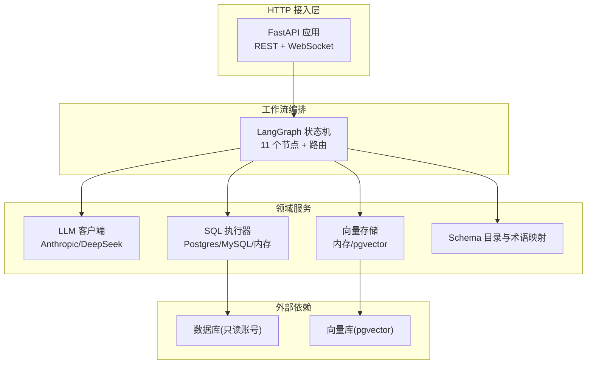
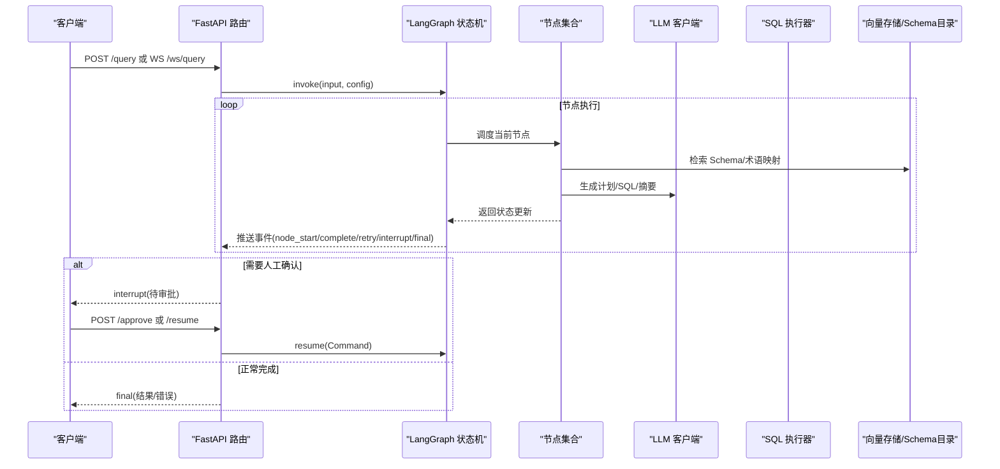
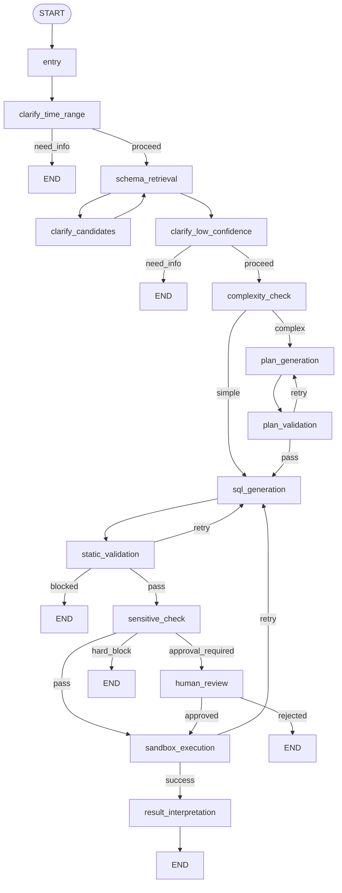
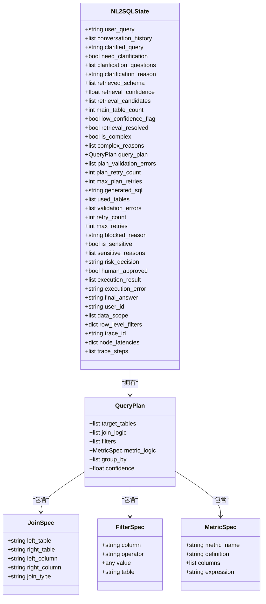
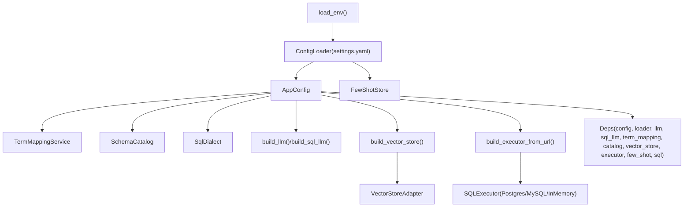
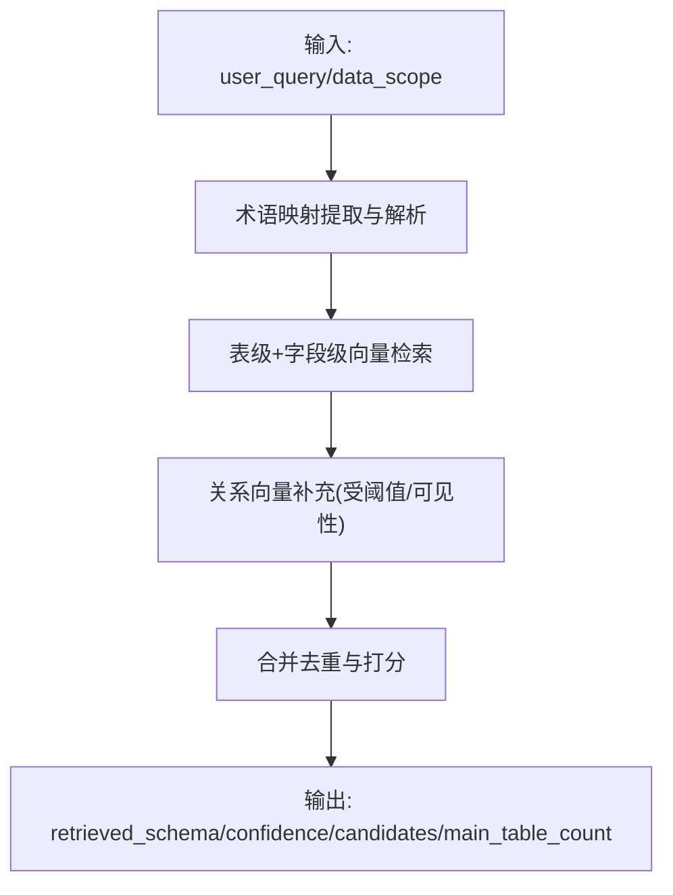
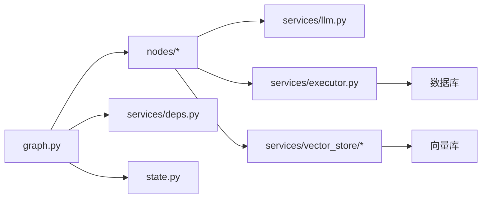
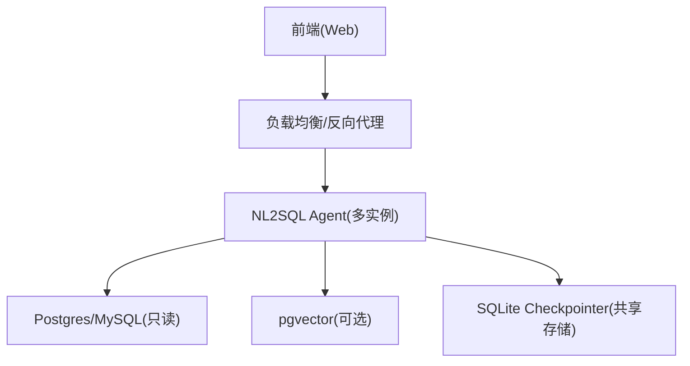

# 架构设计

<cite>
**本文引用的文件**   
- [graph.py](file://nl2sql_agent/graph.py)
- [state.py](file://nl2sql_agent/state.py)
- [deps.py](file://nl2sql_agent/services/deps.py)
- [main.py](file://nl2sql_agent/main.py)
- [api.py](file://nl2sql_agent/api.py)
- [m1_entry.py](file://nl2sql_agent/nodes/m1_entry.py)
- [m3_schema_retrieval.py](file://nl2sql_agent/nodes/m3_schema_retrieval.py)
- [m4_complexity_check.py](file://nl2sql_agent/nodes/m4_complexity_check.py)
- [m7_sql_generation.py](file://nl2sql_agent/nodes/m7_sql_generation.py)
- [m9_sensitive_check.py](file://nl2sql_agent/nodes/m9_sensitive_check.py)
- [m10_sandbox_execution.py](file://nl2sql_agent/nodes/m10_sandbox_execution.py)
- [executor.py](file://nl2sql_agent/services/executor.py)
- [llm.py](file://nl2sql_agent/services/llm.py)
- [requirements.txt](file://requirements.txt)
</cite>

## 目录
1. [简介](#简介)
2. [项目结构](#项目结构)
3. [核心组件](#核心组件)
4. [架构总览](#架构总览)
5. [详细组件分析](#详细组件分析)
6. [依赖关系分析](#依赖关系分析)
7. [性能考量](#性能考量)
8. [故障排查指南](#故障排查指南)
9. [结论](#结论)
10. [附录](#附录)

## 简介
本架构设计文档面向 NL2SQL 系统，基于 LangGraph 的状态机编排模式，描述 11 个节点的编排逻辑与数据流转。重点说明依赖注入（Deps）、状态管理（NL2SQLState）、事件驱动架构等核心设计模式；给出系统上下文图与组件分解图；解释技术决策权衡（为何选择 LangGraph）；并覆盖基础设施需求、可扩展性、部署拓扑以及横切关注点（安全性、监控、灾难恢复）。

## 项目结构
- 服务入口与 HTTP API：FastAPI 应用提供 REST 与 WebSocket 接口，负责请求接入、线程化执行、事件桥接与持久化。
- 工作流编排：LangGraph StateGraph 定义 11 个节点及路由规则，支持中断与恢复（人工确认、候选澄清、低置信澄清）。
- 状态模型：Pydantic 强类型状态 NL2SQLState，贯穿所有节点，承载权限、检索结果、计划、SQL、校验、风险判定、执行与结果解释等全链路信息。
- 依赖装配：Deps 统一装配配置、LLM、向量存储、Schema 目录、SQL 方言、执行器、Few-shot 存储等，支持测试替换与环境变量加载。
- 节点实现：每个模块一个节点，职责单一，输入输出围绕 NL2SQLState，便于独立演进与测试。
- 服务层：执行器（Postgres/MySQL/内存）、LLM 客户端（Anthropic/DeepSeek）、向量存储（内存/pgvector）、配置加载器等。

**图表来源** 
- [main.py:1-152](file://nl2sql_agent/main.py#L1-L152)
- [api.py:1-573](file://nl2sql_agent/api.py#L1-L573)
- [graph.py:1-313](file://nl2sql_agent/graph.py#L1-L313)
- [deps.py:1-178](file://nl2sql_agent/services/deps.py#L1-L178)
- [executor.py:1-205](file://nl2sql_agent/services/executor.py#L1-L205)
- [llm.py:1-328](file://nl2sql_agent/services/llm.py#L1-L328)

**章节来源**
- [main.py:1-152](file://nl2sql_agent/main.py#L1-L152)
- [api.py:1-573](file://nl2sql_agent/api.py#L1-L573)
- [graph.py:1-313](file://nl2sql_agent/graph.py#L1-L313)

## 核心组件
- 依赖注入（Deps）
  - 集中装配 AppConfig、ConfigLoader、LLM、TermMapping、SchemaCatalog、VectorStore、SQLExecutor、FewShotStore、SqlDialect，支持 SQL 专用模型与扩展点（反馈闭环、语义缓存预留）。
  - 构建流程读取 settings.yaml、.env、vector_store.yaml，按 URL scheme 选择执行器，按环境变量选择 LLM provider。
- 状态管理（NL2SQLState）
  - 以 Pydantic BaseModel 定义，包含用户查询、澄清、检索、复杂度、计划、SQL、校验、敏感判定、执行与结果解释、身份权限、追踪字段等。
  - 严格约束 QueryPlan 子结构（JoinSpec、FilterSpec、MetricSpec），避免危险操作在结构层面表达。
- 事件驱动与可观测性
  - graph 内通过 _emit 推送 node_start/node_complete/retry/interrupt/final/error 等事件，经 EventStream 桥接到 WebSocket 前端。
  - 节点延迟与步骤写入 state.node_latencies / trace_steps，供审计与性能分析。
- 检查点与中断恢复
  - 使用 InMemorySaver 或 SQLite Checkpointer，支持 human_review、clarify_candidates、clarify_low_confidence 三个中断点，通过 Command(resume=...) 恢复。

**章节来源**
- [deps.py:1-178](file://nl2sql_agent/services/deps.py#L1-L178)
- [state.py:1-146](file://nl2sql_agent/state.py#L1-L146)
- [graph.py:1-313](file://nl2sql_agent/graph.py#L1-L313)
- [api.py:1-573](file://nl2sql_agent/api.py#L1-L573)

## 架构总览
下图展示从 HTTP 请求到 LangGraph 执行、再到外部依赖的完整调用链，以及事件回推前端的机制。

**图表来源** 
- [main.py:83-145](file://nl2sql_agent/main.py#L83-L145)
- [api.py:134-211](file://nl2sql_agent/api.py#L134-L211)
- [graph.py:174-313](file://nl2sql_agent/graph.py#L174-L313)
- [llm.py:135-149](file://nl2sql_agent/services/llm.py#L135-L149)
- [executor.py:71-81](file://nl2sql_agent/services/executor.py#L71-L81)

## 详细组件分析

### 工作流编排（LangGraph 状态机）
- 节点清单（11 个）
  - entry（模块1）：入口校验与 trace_id 初始化
  - clarify_time_range（模块2）：时间范围澄清
  - schema_retrieval（模块3）：混合检索（术语映射+向量召回+关系补充）
  - clarify_candidates（模块3.5）：候选表澄清
  - clarify_low_confidence（模块3.5）：低置信度澄清
  - complexity_check（模块4）：复杂度判断（简单/复杂）
  - plan_generation（模块5b）：查询计划生成（复杂路径）
  - plan_validation（模块6）：计划校验（失败重试上限）
  - sql_generation（模块7）：SQL 生成（机械翻译）
  - static_validation（模块8）：静态校验（语法/安全）
  - sensitive_check（模块9）：敏感判定（pass/approval_required/hard_block）
  - sandbox_execution（模块10）：沙箱执行（EXPLAIN/LIMIT/超时）
  - result_interpretation（模块11）：结果解释（摘要）
- 路由与重试回路
  - 模块5b→6 内部打转（plan_retry_count ≤ max_plan_retries）
  - 模块7→8→9→10→11 主链路
  - 模块10 报错退回模块7（retry_count ≤ max_retries）
  - 模块8 非危险失败退回模块7；危险直接 END
- 中断点
  - human_review、clarify_candidates、clarify_low_confidence 三处可暂停，等待外部恢复

**图表来源** 
- [graph.py:174-313](file://nl2sql_agent/graph.py#L174-L313)

**章节来源**
- [graph.py:1-313](file://nl2sql_agent/graph.py#L1-L313)

### 状态模型（NL2SQLState）
- 关键字段分组
  - 输入与澄清：user_query、conversation_history、clarified_query、need_clarification、clarification_questions、clarification_reason
  - 检索：retrieved_schema、retrieval_confidence、retrieval_candidates、main_table_count、low_confidence_flag、retrieval_resolved
  - 复杂度：is_complex、complex_reasons
  - 计划：query_plan、plan_validation_errors、plan_retry_count、max_plan_retries
  - SQL：generated_sql、used_tables、validation_errors、retry_count、max_retries、blocked_reason
  - 敏感：is_sensitive、sensitive_reasons、risk_decision、human_approved
  - 执行与结果：execution_result、execution_error、final_answer
  - 权限：user_id、data_scope、row_level_filters
  - 追踪：trace_id、node_latencies、trace_steps
- 数据结构约束
  - QueryPlan 仅允许 SELECT 元素（target_tables、join_logic、filters、metric_logic、group_by、confidence），禁止写操作在结构上表达

**图表来源** 
- [state.py:1-146](file://nl2sql_agent/state.py#L1-L146)

**章节来源**
- [state.py:1-146](file://nl2sql_agent/state.py#L1-L146)

### 依赖注入（Deps）
- 配置来源
  - settings.yaml：dialect、schema_search_top_k、execution.limit/timeout/explain_row_threshold、row_level_filter、rules 引用
  - .env：DATABASE_URL、ANTHROPIC_API_KEY/MODEL、DEEPSEEK_*、SQL_* 等
  - vector_store.yaml：backend（memory/pgvector）与 pgvector.url
- 构建顺序
  - load_env → ConfigLoader → AppConfig → TermMappingService → SchemaCatalog → SqlDialect → LLM(sql_llm可选) → VectorStore → Executor(FewShotStore)
- 扩展点
  - feedback_sink、semantic_cache 预留，便于后续接入反馈闭环与语义缓存

**图表来源** 
- [deps.py:107-178](file://nl2sql_agent/services/deps.py#L107-L178)

**章节来源**
- [deps.py:1-178](file://nl2sql_agent/services/deps.py#L1-L178)

### 关键节点详解

#### 模块3：Schema 检索（混合检索）
- 策略
  - 术语映射优先（业务线命名空间→全局兜底）
  - 表级与字段级向量融合评分
  - 关系向量补充关联表（受阈值与业务线可见性约束）
- 产出
  - retrieved_schema、retrieval_confidence、retrieval_candidates、main_table_count
- 关键点
  - 检索阶段必须按 data_scope 过滤，无权限表绝不进入结果
  - 置信度与候选用于模块3.5 的澄清路由

**图表来源** 
- [m3_schema_retrieval.py:166-249](file://nl2sql_agent/nodes/m3_schema_retrieval.py#L166-L249)

**章节来源**
- [m3_schema_retrieval.py:1-249](file://nl2sql_agent/nodes/m3_schema_retrieval.py#L1-L249)

#### 模块4：复杂度判断（确定性规则）
- 规则来源：complexity_rules.yaml
- 信号
  - 涉及表数量≥阈值
  - 命中复合口径指标（composite_metric=true）
  - 多步聚合关键词命中
- 行为
  - 低置信度强制走计划路径
  - 任一信号即判复杂（保守策略）

**章节来源**
- [m4_complexity_check.py:1-53](file://nl2sql_agent/nodes/m4_complexity_check.py#L1-L53)

#### 模块7：SQL 生成（机械翻译）
- Prompt 来源
  - 有计划：按 QueryPlan 构建 prompt
  - 无计划：自然语言 + few-shot 构建 prompt
- 输出
  - SQL 与 used_tables（JSON 结构化输出，函数调用优先，纯文本解析兜底）
- 重试反馈
  - 将上一轮 validation_errors 与 execution_error 作为反馈提示，避免“放宽条件”规避错误

**章节来源**
- [m7_sql_generation.py:1-113](file://nl2sql_agent/nodes/m7_sql_generation.py#L1-L113)
- [llm.py:135-149](file://nl2sql_agent/services/llm.py#L135-L149)

#### 模块9：敏感判定（规则驱动）
- 规则来源：sensitive_rules.yaml
- 判定维度
  - 敏感字段列表（含关键词兜底）
  - EXPLAIN 预估行数超过阈值（可配置 action：approval_required 或 hard_block）
  - 金额字段参与聚合或导出
  - 低置信度强制进人工确认
- 输出
  - risk_decision ∈ {pass, approval_required, hard_block}
  - 硬阻断设置 blocked_reason 并直接结束

**章节来源**
- [m9_sensitive_check.py:1-106](file://nl2sql_agent/nodes/m9_sensitive_check.py#L1-L106)

#### 模块10：沙箱执行（安全执行）
- 安全措施
  - 只读事务（Postgres READ ONLY / MySQL START TRANSACTION READ ONLY）
  - 语句超时（statement_timeout / MAX_EXECUTION_TIME）
  - EXPLAIN 预估扫描行数阈值拒绝
  - 未聚合查询强制 LIMIT
- 错误处理
  - 执行报错带具体消息退回模块7（最多 max_retries 次）
  - 空结果为合法业务结果，直接进入结果解释

**章节来源**
- [m10_sandbox_execution.py:1-65](file://nl2sql_agent/nodes/m10_sandbox_execution.py#L1-L65)
- [executor.py:53-159](file://nl2sql_agent/services/executor.py#L53-L159)

### 事件驱动与前端交互
- 事件类型
  - node_start / node_complete / retry / interrupt / final / error / done
- 传输机制
  - 同步线程 emit → EventStream asyncio.Queue → WebSocket 推送
- 断线重连
  - 通过 trace_id 恢复当前阶段（pending_review/done/blocked/error）

**章节来源**
- [api.py:54-211](file://nl2sql_agent/api.py#L54-L211)
- [graph.py:60-126](file://nl2sql_agent/graph.py#L60-L126)

## 依赖关系分析
- 组件耦合
  - graph 依赖 nodes、services.deps、state
  - nodes 依赖 deps（config/llm/vector_store/executor/sql）
  - services.executor 依赖 sqlglot 与数据库驱动（psycopg/pymysql）
  - services.llm 抽象 BaseLLMClient，支持 Anthropic/DeepSeek
- 外部依赖
  - 数据库（Postgres/MySQL）只读账号
  - 向量库（pgvector）可选
  - LLM 服务（Anthropic/DeepSeek OpenAI 兼容）

**图表来源** 
- [graph.py:1-313](file://nl2sql_agent/graph.py#L1-L313)
- [deps.py:1-178](file://nl2sql_agent/services/deps.py#L1-L178)
- [executor.py:1-205](file://nl2sql_agent/services/executor.py#L1-L205)
- [llm.py:1-328](file://nl2sql_agent/services/llm.py#L1-L328)

**章节来源**
- [graph.py:1-313](file://nl2sql_agent/graph.py#L1-L313)
- [deps.py:1-178](file://nl2sql_agent/services/deps.py#L1-L178)

## 性能考量
- 检索优化
  - 术语映射优先，减少向量召回开销
  - 表级与字段级向量融合，关系向量仅做受限补充
- 执行保护
  - EXPLAIN 预估行数阈值拒绝大扫描
  - 未聚合查询强制 LIMIT，避免全表扫描
  - 语句级超时控制，防止长尾查询阻塞
- 重试边界
  - 计划校验失败仅在模块5b内部重试（上限 max_plan_retries）
  - 执行失败退回模块7（上限 max_retries），避免死循环
- 序列化与检查点
  - JsonPlusSerializer 注册状态类型，避免反序列化告警
  - SQLite Checkpointer 持久化线程状态，支持中断恢复

[本节为通用指导，不直接分析具体文件]

## 故障排查指南
- 常见错误定位
  - 执行报错：查看 execution_error 与 retry_count，确认是否达到 max_retries
  - 计划校验失败：检查 plan_validation_errors 与 plan_retry_count
  - 静态校验失败：检查 validation_errors 与 blocked_reason
  - 敏感阻断：查看 sensitive_reasons 与 risk_decision
- 事件与日志
  - 通过 WebSocket 事件观察 node_start/complete/retry/interrupt/final/error
  - 使用 /thread/{id} 查看当前状态与 next 节点
- 恢复流程
  - 人工确认：POST /approve 或 /resume，传入 approved/comment/resume 值
  - 候选/低置信澄清：通过 /resume 传入对应 resume 值

**章节来源**
- [api.py:280-353](file://nl2sql_agent/api.py#L280-L353)
- [graph.py:106-170](file://nl2sql_agent/graph.py#L106-L170)

## 结论
本系统以 LangGraph 为核心编排引擎，结合强类型状态 NL2SQLState 与依赖注入 Deps，实现了高内聚、低耦合的 NL2SQL 流水线。通过明确的节点职责、严格的校验与安全策略、事件驱动的实时交互与检查点恢复能力，系统在准确性、安全性与可运维性之间取得良好平衡。未来可在反馈闭环与语义缓存方向进一步扩展。

[本节为总结，不直接分析具体文件]

## 附录

### 技术栈与版本兼容性
- 框架与工具
  - langgraph>=1.1、langgraph-checkpoint>=4.0、langgraph-checkpoint-sqlite>=3.1.1
  - fastapi>=0.115、uvicorn>=0.30
  - pydantic>=2.10、PyYAML>=6.0、python-dotenv>=1.0
  - sqlglot>=30.14
- LLM 客户端
  - anthropic>=0.40、openai>=1.40
- 数据库驱动
  - psycopg>=3.2（Postgres）、pymysql>=1.1（MySQL）
- 测试
  - pytest>=8.0

**章节来源**
- [requirements.txt:1-15](file://requirements.txt#L1-L15)

### 基础设施需求
- 运行时
  - Python 环境，安装 requirements.txt 依赖
  - 环境变量：ANTHROPIC_API_KEY/MODEL 或 DEEPSEEK_*、SQL_*、DATABASE_URL
- 数据存储
  - Postgres/MySQL 只读账号（执行器连接）
  - 向量库（pgvector）可选，需配置 url
- 检查点存储
  - SQLite 文件（langgraph_checkpoints.db）用于线程状态持久化

**章节来源**
- [deps.py:107-178](file://nl2sql_agent/services/deps.py#L107-L178)
- [main.py:63-80](file://nl2sql_agent/main.py#L63-L80)

### 部署拓扑
- 单进程部署
  - uvicorn 启动 FastAPI，进程内构建并缓存 Graph 实例
  - 线程化执行查询，EventStream 桥接 WebSocket
- 水平扩展
  - 多实例共享 SQLite Checkpointer 与 QueryStore（建议迁移至分布式存储）
  - 向量库与数据库采用中心化服务

[本节为概念性图示，不直接映射具体代码文件]

### 横切关注点
- 安全性
  - 只读事务与语句超时、EXPLAIN 阈值拒绝、敏感字段与金额字段规则、行级权限（row_level_filters）
- 监控与审计
  - 节点延迟与步骤追踪、WebSocket 事件流、历史查询与审批记录、审计接口
- 灾难恢复
  - 检查点持久化、断线重连恢复、错误状态落库与可查询

**章节来源**
- [api.py:101-157](file://nl2sql_agent/api.py#L101-L157)
- [m9_sensitive_check.py:1-106](file://nl2sql_agent/nodes/m9_sensitive_check.py#L1-L106)
- [m10_sandbox_execution.py:1-65](file://nl2sql_agent/nodes/m10_sandbox_execution.py#L1-L65)