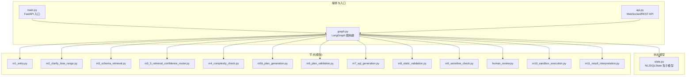
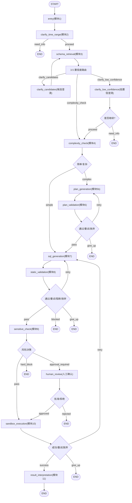
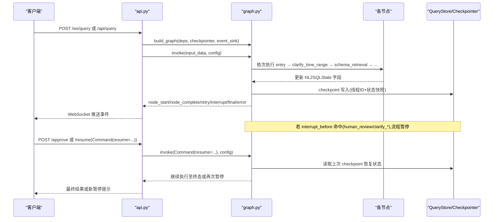
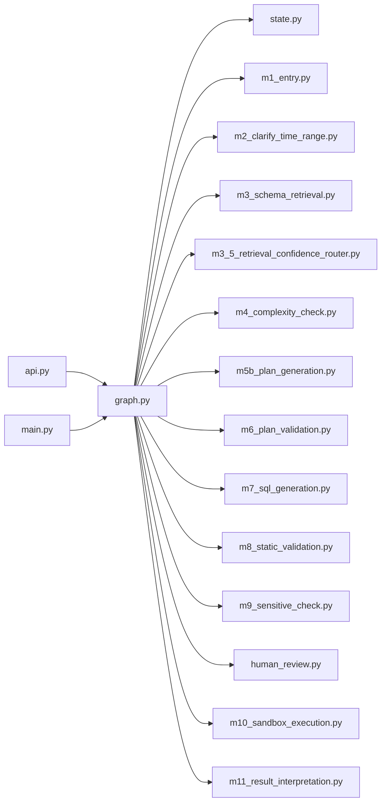

# 状态机设计

<cite>
**本文引用的文件**   
- [graph.py](file://nl2sql_agent/graph.py)
- [state.py](file://nl2sql_agent/state.py)
- [main.py](file://nl2sql_agent/main.py)
- [api.py](file://nl2sql_agent/api.py)
- [m1_entry.py](file://nl2sql_agent/nodes/m1_entry.py)
- [m2_clarify_time_range.py](file://nl2sql_agent/nodes/m2_clarify_time_range.py)
- [m3_schema_retrieval.py](file://nl2sql_agent/nodes/m3_schema_retrieval.py)
- [m3_5_retrieval_confidence_router.py](file://nl2sql_agent/nodes/m3_5_retrieval_confidence_router.py)
- [m4_complexity_check.py](file://nl2sql_agent/nodes/m4_complexity_check.py)
- [m5b_plan_generation.py](file://nl2sql_agent/nodes/m5b_plan_generation.py)
- [m6_plan_validation.py](file://nl2sql_agent/nodes/m6_plan_validation.py)
- [m7_sql_generation.py](file://nl2sql_agent/nodes/m7_sql_generation.py)
- [m8_static_validation.py](file://nl2sql_agent/nodes/m8_static_validation.py)
- [m9_sensitive_check.py](file://nl2sql_agent/nodes/m9_sensitive_check.py)
- [human_review.py](file://nl2sql_agent/nodes/human_review.py)
- [m10_sandbox_execution.py](file://nl2sql_agent/nodes/m10_sandbox_execution.py)
- [m11_result_interpretation.py](file://nl2sql_agent/nodes/m11_result_interpretation.py)
</cite>

## 目录
1. [引言](#引言)
2. [项目结构](#项目结构)
3. [核心组件](#核心组件)
4. [架构总览](#架构总览)
5. [详细组件分析](#详细组件分析)
6. [依赖关系分析](#依赖关系分析)
7. [性能考量](#性能考量)
8. [故障排查指南](#故障排查指南)
9. [结论](#结论)
10. [附录](#附录)

## 引言
本设计文档面向 NL2SQL 系统的状态机，基于 LangGraph 编排 11 个节点（模块），覆盖从用户提问、意图澄清、Schema 检索与置信度路由、复杂度判断、查询计划生成与校验、SQL 生成与静态校验、敏感判定与人工审批、沙箱执行到结果解释的完整链路。文档重点说明：
- 每个节点的职责、输入输出与转换条件
- 状态流转规则、重试机制与错误处理策略
- 路由函数实现逻辑（如 route_clarify、route_complexity、route_plan_validation 等）
- 状态机的完整流程图与节点间数据传递机制
- 状态持久化与恢复的实现细节

## 项目结构
NL2SQL 的状态机由 graph.py 构建并编译，节点位于 nodes/ 下，全局状态定义在 state.py，HTTP 入口与流式事件在 main.py 与 api.py 中。整体组织遵循“图编排 + 节点实现 + 状态模型”的分层模式。

图表来源
- [graph.py:174-312](file://nl2sql_agent/graph.py#L174-L312)
- [state.py:83-146](file://nl2sql_agent/state.py#L83-L146)
- [main.py:83-120](file://nl2sql_agent/main.py#L83-L120)
- [api.py:134-157](file://nl2sql_agent/api.py#L134-L157)

章节来源
- [graph.py:1-313](file://nl2sql_agent/graph.py#L1-L313)
- [state.py:1-146](file://nl2sql_agent/state.py#L1-L146)
- [main.py:1-152](file://nl2sql_agent/main.py#L1-L152)
- [api.py:1-573](file://nl2sql_agent/api.py#L1-L573)

## 核心组件
- 全局状态 NL2SQLState：承载用户问题、历史、澄清信息、Schema 检索结果、复杂度标记、查询计划、SQL 与校验结果、敏感判定、执行结果、权限与追踪字段等。
- 图编排 StateGraph：定义 11 个节点与条件边，封装重试包装器 _retry_route、事件追踪 _traced、序列化辅助 _to_serializable/_event_data。
- 路由函数：route_clarify、route_complexity、route_plan_validation、route_static_validation、route_sensitive、route_human_review、route_sandbox。
- 检查点与中断：InMemorySaver/JsonPlusSerializer 注册类型；interrupt_before 指定 human_review、clarify_candidates、clarify_low_confidence 三个暂停点。

章节来源
- [state.py:83-146](file://nl2sql_agent/state.py#L83-L146)
- [graph.py:106-170](file://nl2sql_agent/graph.py#L106-L170)
- [graph.py:174-312](file://nl2sql_agent/graph.py#L174-L312)

## 架构总览
下图展示 11 个节点与关键路由分支，体现两条重试回路（计划校验失败回 5b、静态校验失败回 7）以及安全拦截与人工审批路径。

图表来源
- [graph.py:200-294](file://nl2sql_agent/graph.py#L200-L294)

章节来源
- [graph.py:174-312](file://nl2sql_agent/graph.py#L174-L312)

## 详细组件分析

### 全局状态 NL2SQLState
- 关键字段分组：
  - 用户提问与澄清：user_query、conversation_history、clarified_query、need_clarification、clarification_questions、clarification_reason
  - Schema 检索：retrieved_schema、retrieval_confidence、retrieval_candidates、main_table_count、low_confidence_flag、retrieval_resolved
  - 复杂度：is_complex、complex_reasons
  - 计划：query_plan、plan_validation_errors、plan_retry_count、max_plan_retries
  - SQL 生成与校验：generated_sql、used_tables、validation_errors、retry_count、max_retries、blocked_reason
  - 敏感与人工：is_sensitive、sensitive_reasons、risk_decision、human_approved
  - 执行与结果：execution_result、execution_error、final_answer
  - 权限与追踪：user_id、data_scope、row_level_filters、trace_id、node_latencies、trace_steps

- 数据结构：
  - SchemaHit：表名、列定义、业务术语
  - QueryPlan：目标表、连接、过滤、指标口径、分组、置信度
  - JoinSpec/FilterSpec/MetricSpec：严格约束 join_type、operator、metric_name 等

章节来源
- [state.py:14-82](file://nl2sql_agent/state.py#L14-L82)
- [state.py:83-146](file://nl2sql_agent/state.py#L83-L146)

### 节点 1：入口 entry
- 职责：校验 user_id、data_scope、user_query，规范化 trace_id
- 输入：user_query、user_id、data_scope、conversation_history、trace_id
- 输出：规范化后的 user_query、trace_id

章节来源
- [m1_entry.py:14-27](file://nl2sql_agent/nodes/m1_entry.py#L14-L27)

### 节点 2：时间范围澄清 clarify_time_range
- 职责：依据 clarification_rules.yaml 检测缺时间范围的意图，必要时触发澄清
- 输入：user_query/clarified_query、conversation_history、rules.enabled/time_range_missing/sensitivity
- 输出：need_clarification、clarification_questions、clarification_reason、final_answer

章节来源
- [m2_clarify_time_range.py:34-61](file://nl2sql_agent/nodes/m2_clarify_time_range.py#L34-L61)

### 节点 3：Schema 检索 schema_retrieval
- 职责：混合检索（术语映射 → 表级/字段级向量 → 关系向量补充），按 data_scope 过滤，产出 retrieved_schema、retrieval_confidence、retrieval_candidates、main_table_count
- 输入：user_query/clarified_query、data_scope、term_mapping、vector_store、catalog
- 输出：retrieved_schema、retrieval_confidence、retrieval_candidates、main_table_count

章节来源
- [m3_schema_retrieval.py:230-331](file://nl2sql_agent/nodes/m3_schema_retrieval.py#L230-L331)

### 节点 3.5：检索后置信度路由
- 路由函数 make_route_after_retrieval：多候选→clarify_candidates；低置信→clarify_low_confidence；否则→complexity_check
- 候选澄清 clarify_candidates：用户选定主表，收窄 retrieved_schema，提升置信度为 1.0，标记 retrieval_resolved 避免重复
- 低置信澄清 clarify_low_confidence：询问是否继续；继续则设置 low_confidence_flag 进入模块 4；不继续结束
- 路由函数 route_after_low_confidence：根据 need_clarification 决定 END 或 proceed

章节来源
- [m3_5_retrieval_confidence_router.py:26-37](file://nl2sql_agent/nodes/m3_5_retrieval_confidence_router.py#L26-L37)
- [m3_5_retrieval_confidence_router.py:40-92](file://nl2sql_agent/nodes/m3_5_retrieval_confidence_router.py#L40-L92)
- [m3_5_retrieval_confidence_router.py:95-127](file://nl2sql_agent/nodes/m3_5_retrieval_confidence_router.py#L95-L127)

### 节点 4：复杂度判断 complexity_check
- 职责：基于 rules.complexity_rules 与 main_table_count、复合指标、关键词等信号判定 is_complex
- 输入：user_query/clarified_query、data_scope、term_mapping、main_table_count、low_confidence_flag
- 输出：is_complex、complex_reasons

章节来源
- [m4_complexity_check.py:17-52](file://nl2sql_agent/nodes/m4_complexity_check.py#L17-L52)

### 节点 5b：查询计划生成 plan_generation
- 职责：调用 LLM 结构化输出 QueryPlan，失败时记录 plan_validation_errors
- 输入：retrieved_schema、term_mapping、plan_validation_errors（用于反馈）
- 输出：query_plan、清空 plan_validation_errors

章节来源
- [m5b_plan_generation.py:71-89](file://nl2sql_agent/nodes/m5b_plan_generation.py#L71-L89)

### 节点 6：计划校验 plan_validation
- 职责：校验 target_tables/join/filters/metric_logic 与 retrieved_schema 和术语映射一致性；累计 plan_retry_count；超限写 final_answer
- 输入：query_plan、retrieved_schema、term_mapping、data_scope
- 输出：plan_validation_errors、plan_retry_count、可能 final_answer

章节来源
- [m6_plan_validation.py:100-126](file://nl2sql_agent/nodes/m6_plan_validation.py#L100-L126)

### 节点 7：SQL 生成 sql_generation
- 职责：按计划或自然语言生成 SQL，同时输出 used_tables；失败时清空 validation_errors
- 输入：query_plan/retrieved_schema、few_shot（可选）、LLM
- 输出：generated_sql、used_tables、清空 validation_errors、execution_error=None

章节来源
- [m7_sql_generation.py:94-112](file://nl2sql_agent/nodes/m7_sql_generation.py#L94-L112)

### 节点 8：静态校验 static_validation
- 职责：语法/方言校验、危险操作硬阻断、命名空间泄露拦截、AST 表/字段一致性校验、行级权限注入
- 输入：generated_sql、used_tables、retrieved_schema、row_level_filters、dialect
- 输出：validation_errors、blocked_reason、injected SQL、可能 final_answer

章节来源
- [m8_static_validation.py:33-152](file://nl2sql_agent/nodes/m8_static_validation.py#L33-L152)

### 节点 9：敏感判定 sensitive_check
- 职责：基于 sensitive_rules.yaml 判定 pass/approval_required/hard_block；EXPLAIN 预估行数阈值；金额字段聚合/导出；低置信强制人工确认
- 输入：generated_sql、retrieved_schema、executor.explain、sensitive_rules
- 输出：risk_decision、is_sensitive、sensitive_reasons、blocked_reason、final_answer

章节来源
- [m9_sensitive_check.py:19-105](file://nl2sql_agent/nodes/m9_sensitive_check.py#L19-L105)

### 节点 人工确认 human_review
- 职责：通过 interrupt 暂停流程，等待 approved/rejected；拒绝时写入 final_answer
- 输入：user_query、generated_sql、sensitive_reasons、data_scope
- 输出：human_approved、可能 final_answer

章节来源
- [human_review.py:15-31](file://nl2sql_agent/nodes/human_review.py#L15-L31)

### 节点 10：沙箱执行 sandbox_execution
- 职责：EXPLAIN 守门、未聚合强制 LIMIT、带超时执行；失败返回 execution_error 并递增 retry_count
- 输入：generated_sql、executor.explain/execute、config.explain_row_threshold/execution_limit/timeout
- 输出：execution_result、execution_error、retry_count、可能 final_answer

章节来源
- [m10_sandbox_execution.py:31-64](file://nl2sql_agent/nodes/m10_sandbox_execution.py#L31-L64)

### 节点 11：结果解释 result_interpretation
- 职责：LLM 摘要结果，不可用时降级确定性摘要；保留 execution_result 供核对
- 输入：user_query、execution_result、LLM.summarize
- 输出：final_answer

章节来源
- [m11_result_interpretation.py:25-38](file://nl2sql_agent/nodes/m11_result_interpretation.py#L25-L38)

### 路由函数详解
- route_clarify：need_clarification 为真→need_info，否则 proceed
- route_complexity：is_complex→complex，否则 simple
- route_plan_validation：无错误 pass；有错误且 plan_retry_count < max_plan_retries→retry；否则 give_up
- route_static_validation：blocked_reason→blocked；无错误 pass；有错误且 retry_count < max_retries→retry；否则 give_up
- route_sensitive：直接返回 risk_decision
- route_human_review：human_approved→approved，否则 rejected
- route_sandbox：无 execution_error→success；有错误且 retry_count < max_retries→retry；否则 give_up

章节来源
- [graph.py:130-169](file://nl2sql_agent/graph.py#L130-L169)

### 状态机完整流程图（代码级）

图表来源
- [api.py:134-157](file://nl2sql_agent/api.py#L134-L157)
- [api.py:280-353](file://nl2sql_agent/api.py#L280-L353)
- [graph.py:296-312](file://nl2sql_agent/graph.py#L296-L312)

## 依赖关系分析
- 节点依赖外部服务：term_mapping、vector_store、catalog、llm/sql_llm、executor、sql、few_shot、config
- 图依赖 LangGraph 的 StateGraph、checkpointer、interrupt、Command
- 持久化依赖：Sqlite Checkpointer + JsonPlusSerializer 注册 NL2SQLState 及其子类型

图表来源
- [graph.py:174-312](file://nl2sql_agent/graph.py#L174-L312)
- [api.py:134-157](file://nl2sql_agent/api.py#L134-L157)
- [main.py:83-120](file://nl2sql_agent/main.py#L83-L120)

章节来源
- [graph.py:174-312](file://nl2sql_agent/graph.py#L174-L312)
- [api.py:1-573](file://nl2sql_agent/api.py#L1-L573)
- [main.py:1-152](file://nl2sql_agent/main.py#L1-L152)

## 性能考量
- 节点延迟追踪：_traced 包装每个节点，记录 node_latencies 与 trace_steps
- 事件精简：_event_data 对 execution_result 截断前 20 行，减少前端刷屏
- 重试上限：计划校验 max_plan_retries=2，SQL 与执行重试 max_retries=3，避免死循环
- 向量检索优化：按 business_line 分域检索并按 id 去重取最高分；关系扩展与最短 FK 路径补表控制开销
- 执行保护：EXPLAIN 阈值、LIMIT 强制、statement_timeout 防止长尾查询

章节来源
- [graph.py:88-104](file://nl2sql_agent/graph.py#L88-L104)
- [graph.py:60-70](file://nl2sql_agent/graph.py#L60-L70)
- [m3_schema_retrieval.py:73-84](file://nl2sql_agent/nodes/m3_schema_retrieval.py#L73-L84)
- [m10_sandbox_execution.py:31-64](file://nl2sql_agent/nodes/m10_sandbox_execution.py#L31-L64)

## 故障排查指南
- 常见问题定位
  - 计划多次失败：查看 plan_validation_errors 与 plan_retry_count；检查术语映射与 retrieved_schema 一致性
  - SQL 静态校验失败：查看 validation_errors，关注 AST 表/字段不一致、命名空间泄露、危险操作 blocked_reason
  - 执行失败：查看 execution_error 与 retry_count；检查 EXPLAIN 阈值、LIMIT 注入、数据库连接与权限
  - 敏感拦截：查看 sensitive_reasons 与 risk_decision；调整 sensitive_rules.yaml 或提供 row_level_filters
- 恢复与重试
  - 使用 /thread/{id} 获取当前 next 与 values；通过 /approve 或 /resume 恢复被 interrupt 的流程
  - 断线重连：WS 支持 trace_id 恢复，已终态直接返回 final，pending_review 返回 interrupt
- 调试建议
  - 观察 node_latencies 与 trace_steps 定位慢节点
  - 打印 _event_data 中的 execution_result 前 20 行快速验证结果规模

章节来源
- [m6_plan_validation.py:100-126](file://nl2sql_agent/nodes/m6_plan_validation.py#L100-L126)
- [m8_static_validation.py:33-152](file://nl2sql_agent/nodes/m8_static_validation.py#L33-L152)
- [m10_sandbox_execution.py:31-64](file://nl2sql_agent/nodes/m10_sandbox_execution.py#L31-L64)
- [m9_sensitive_check.py:19-105](file://nl2sql_agent/nodes/m9_sensitive_check.py#L19-L105)
- [api.py:161-211](file://nl2sql_agent/api.py#L161-L211)
- [api.py:280-353](file://nl2sql_agent/api.py#L280-L353)
- [main.py:122-145](file://nl2sql_agent/main.py#L122-L145)

## 结论
该状态机以 LangGraph 为核心，将 NL2SQL 的关键步骤解耦为 11 个职责清晰的节点，并通过严格的校验与重试边界保障稳定性与安全性。检索阶段的多源融合与置信度路由提升了准确率，计划与 SQL 的两阶段生成降低了幻觉风险，静态校验与敏感判定构建了强安全护栏，沙箱执行确保可控落地。配合检查点与中断机制，系统具备可恢复、可审计、可扩展的能力。

## 附录

### 状态持久化与恢复
- 检查点：InMemorySaver + JsonPlusSerializer，注册 nl2sql_agent.state 下的所有 Pydantic 类型，避免反序列化告警
- 线程 ID：每次查询分配 thread_id，作为 checkpoint 键
- 中断点：compile(..., interrupt_before=["human_review", "clarify_candidates", "clarify_low_confidence"])
- 恢复接口：/approve 与 /resume 通过 Command(resume=...) 恢复流程；WS 断线重连按 trace_id 恢复状态

章节来源
- [graph.py:296-312](file://nl2sql_agent/graph.py#L296-L312)
- [api.py:280-353](file://nl2sql_agent/api.py#L280-L353)
- [api.py:161-211](file://nl2sql_agent/api.py#L161-L211)
- [main.py:83-120](file://nl2sql_agent/main.py#L83-L120)