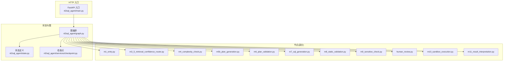
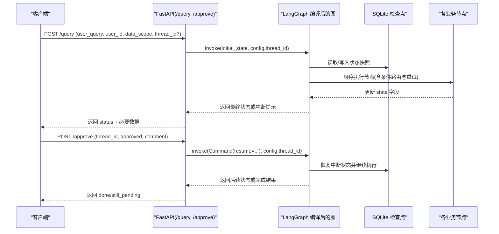
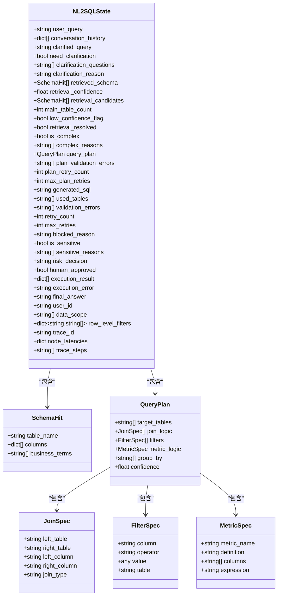
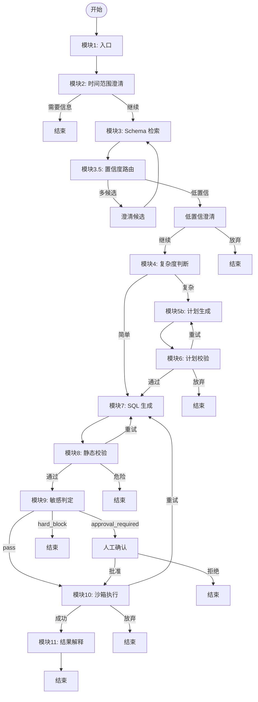
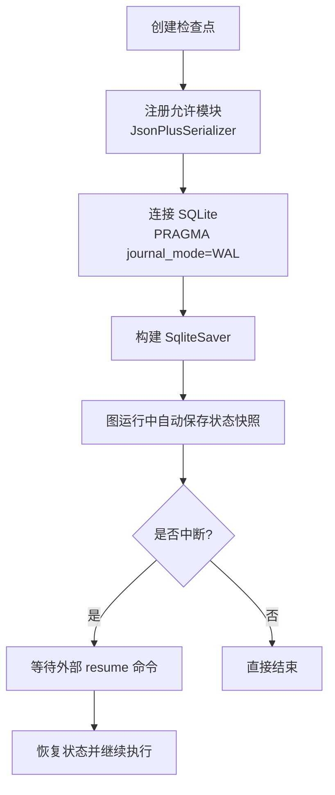
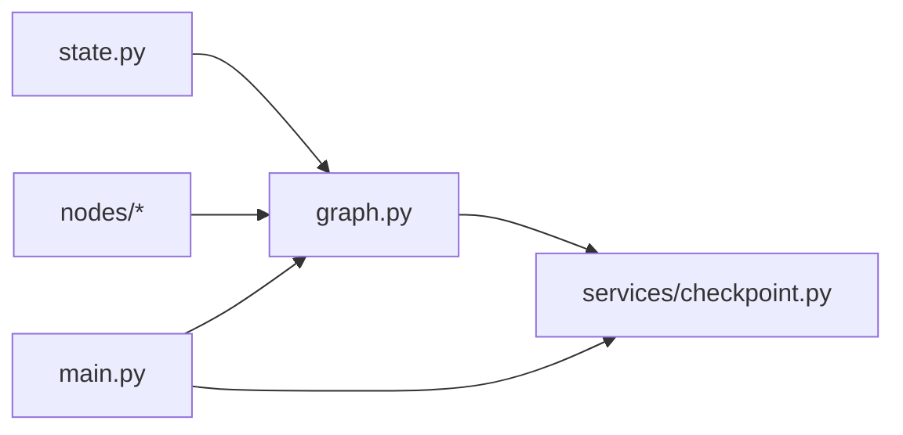
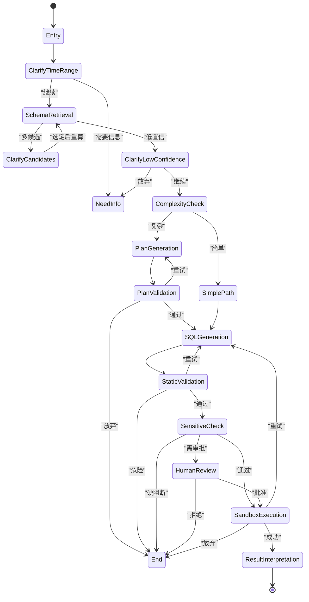

# 状态流转控制

<cite>
**本文引用的文件**   
- [state.py](file://nl2sql_agent/state.py)
- [graph.py](file://nl2sql_agent/graph.py)
- [checkpoint.py](file://nl2sql_agent/services/checkpoint.py)
- [main.py](file://nl2sql_agent/main.py)
- [m1_entry.py](file://nl2sql_agent/nodes/m1_entry.py)
- [m3_5_retrieval_confidence_router.py](file://nl2sql_agent/nodes/m3_5_retrieval_confidence_router.py)
- [m4_complexity_check.py](file://nl2sql_agent/nodes/m4_complexity_check.py)
- [m5b_plan_generation.py](file://nl2sql_agent/nodes/m5b_plan_generation.py)
- [m6_plan_validation.py](file://nl2sql_agent/nodes/m6_plan_validation.py)
- [m7_sql_generation.py](file://nl2sql_agent/nodes/m7_sql_generation.py)
- [m8_static_validation.py](file://nl2sql_agent/nodes/m8_static_validation.py)
- [m9_sensitive_check.py](file://nl2sql_agent/nodes/m9_sensitive_check.py)
- [human_review.py](file://nl2sql_agent/nodes/human_review.py)
- [m10_sandbox_execution.py](file://nl2sql_agent/nodes/m10_sandbox_execution.py)
- [m11_result_interpretation.py](file://nl2sql_agent/nodes/m11_result_interpretation.py)
</cite>

## 目录
1. [引言](#引言)
2. [项目结构](#项目结构)
3. [核心组件](#核心组件)
4. [架构总览](#架构总览)
5. [详细组件分析](#详细组件分析)
6. [依赖关系分析](#依赖关系分析)
7. [性能考量](#性能考量)
8. [故障排查指南](#故障排查指南)
9. [结论](#结论)
10. [附录](#附录)

## 引言
本文件面向 NL2SQL 系统的“状态流转控制”，围绕 NL2SQLState 模型与 LangGraph 编排，系统性地说明：
- 状态字段的设计、用途、数据类型与约束
- 状态流转规则（正常流程、异常处理、分支逻辑）
- 持久化机制（检查点保存与恢复策略）
- 监控、调试与故障排查方法
- 关键时序图与状态机图

## 项目结构
NL2SQL 的状态管理由三部分组成：
- 状态定义：集中定义 NL2SQLState 及其子结构，贯穿所有节点读写
- 图编排：基于 LangGraph 的 StateGraph，将 11 个模块组织为有向图，并定义路由与重试边界
- 检查点：使用 SQLite 持久化完整图状态，支持服务重启后继续审批或澄清

**图表来源** 
- [state.py:83-146](file://nl2sql_agent/state.py#L83-L146)
- [graph.py:174-312](file://nl2sql_agent/graph.py#L174-L312)
- [checkpoint.py:16-39](file://nl2sql_agent/services/checkpoint.py#L16-L39)
- [main.py:83-145](file://nl2sql_agent/main.py#L83-L145)

**章节来源**
- [state.py:83-146](file://nl2sql_agent/state.py#L83-L146)
- [graph.py:174-312](file://nl2sql_agent/graph.py#L174-L312)
- [checkpoint.py:16-39](file://nl2sql_agent/services/checkpoint.py#L16-L39)
- [main.py:83-145](file://nl2sql_agent/main.py#L83-L145)

## 核心组件
- NL2SQLState：承载查询生命周期中的全部上下文，包括用户输入、检索结果、计划、SQL、校验与执行结果、权限与追踪等。
- 图编排（LangGraph）：以 StateGraph 组织 11 个节点，并通过条件边实现路由与重试；通过 interrupt 实现人工确认/澄清暂停。
- 检查点（SQLite）：序列化 NL2SQLState 及子类型到 SQLite，支持跨进程共享与中断恢复。

**章节来源**
- [state.py:83-146](file://nl2sql_agent/state.py#L83-L146)
- [graph.py:174-312](file://nl2sql_agent/graph.py#L174-L312)
- [checkpoint.py:16-39](file://nl2sql_agent/services/checkpoint.py#L16-L39)

## 架构总览
下图展示从 HTTP 请求到图执行的端到端流程，以及检查点的作用位置。

**图表来源** 
- [main.py:83-145](file://nl2sql_agent/main.py#L83-L145)
- [graph.py:174-312](file://nl2sql_agent/graph.py#L174-L312)
- [checkpoint.py:16-39](file://nl2sql_agent/services/checkpoint.py#L16-L39)

## 详细组件分析

### NL2SQLState 模型设计
- 设计原则
  - 按模块分块声明字段，便于定位与审计
  - 对关键字段设置默认值与约束，保证可序列化与健壮性
  - 区分“运行时追踪字段”（trace_steps、node_latencies）与“业务字段”
- 关键字段与约束
  - 用户与权限：user_id、data_scope、row_level_filters（只读注入）
  - 澄清与检索：need_clarification、clarification_questions、retrieved_schema、retrieval_confidence、retrieval_candidates、low_confidence_flag、retrieval_resolved
  - 复杂度：is_complex、complex_reasons
  - 计划：query_plan、plan_validation_errors、plan_retry_count、max_plan_retries
  - SQL 生成与校验：generated_sql、used_tables、validation_errors、retry_count、max_retries、blocked_reason
  - 敏感判定：is_sensitive、sensitive_reasons、risk_decision、human_approved
  - 执行与结果：execution_result、execution_error、final_answer
  - 追踪：trace_id、node_latencies、trace_steps

**图表来源** 
- [state.py:14-81](file://nl2sql_agent/state.py#L14-L81)
- [state.py:83-146](file://nl2sql_agent/state.py#L83-L146)

**章节来源**
- [state.py:14-81](file://nl2sql_agent/state.py#L14-L81)
- [state.py:83-146](file://nl2sql_agent/state.py#L83-L146)

### 状态流转规则与条件
- 主路径
  - 模块1 → 模块2 → 模块3 → 模块4
  - 简单路径：模块4 → 模块7
  - 复杂路径：模块4 → 模块5b → 模块6 →（通过）→ 模块7
- 校验与重试
  - 模块7 → 模块8 → 通过 → 模块9；不过（非危险）→ 回模块7（上限 max_retries）；危险 → END
  - 模块9 → 可审批风险 → 人工确认 → 模块10；硬阻断 → END；无风险 → 模块10
  - 模块10 → 成功 → 模块11；报错/结果为空 → 回模块7（上限 max_retries）；打满 → END
- 分支与澄清
  - 模块2 缺时间范围 → END；否则 → 模块3
  - 模块3 之后：多候选 → clarify_candidates → 回到模块3；低置信 → clarify_low_confidence → 继续则进模块4（带 low_confidence_flag），不继续 → END
- 中断与恢复
  - 在 human_review、clarify_candidates、clarify_low_confidence 处中断，等待外部 Command(resume=...) 恢复

**图表来源** 
- [graph.py:200-294](file://nl2sql_agent/graph.py#L200-L294)
- [m3_5_retrieval_confidence_router.py:26-37](file://nl2sql_agent/nodes/m3_5_retrieval_confidence_router.py#L26-L37)
- [m4_complexity_check.py:17-52](file://nl2sql_agent/nodes/m4_complexity_check.py#L17-L52)
- [m5b_plan_generation.py:71-89](file://nl2sql_agent/nodes/m5b_plan_generation.py#L71-L89)
- [m6_plan_validation.py:100-126](file://nl2sql_agent/nodes/m6_plan_validation.py#L100-L126)
- [m7_sql_generation.py:94-112](file://nl2sql_agent/nodes/m7_sql_generation.py#L94-L112)
- [m8_static_validation.py:33-152](file://nl2sql_agent/nodes/m8_static_validation.py#L33-L152)
- [m9_sensitive_check.py:19-105](file://nl2sql_agent/nodes/m9_sensitive_check.py#L19-L105)
- [human_review.py:15-31](file://nl2sql_agent/nodes/human_review.py#L15-L31)
- [m10_sandbox_execution.py:31-64](file://nl2sql_agent/nodes/m10_sandbox_execution.py#L31-L64)
- [m11_result_interpretation.py:25-38](file://nl2sql_agent/nodes/m11_result_interpretation.py#L25-L38)

**章节来源**
- [graph.py:200-294](file://nl2sql_agent/graph.py#L200-L294)
- [m3_5_retrieval_confidence_router.py:26-37](file://nl2sql_agent/nodes/m3_5_retrieval_confidence_router.py#L26-L37)
- [m4_complexity_check.py:17-52](file://nl2sql_agent/nodes/m4_complexity_check.py#L17-L52)
- [m5b_plan_generation.py:71-89](file://nl2sql_agent/nodes/m5b_plan_generation.py#L71-L89)
- [m6_plan_validation.py:100-126](file://nl2sql_agent/nodes/m6_plan_validation.py#L100-L126)
- [m7_sql_generation.py:94-112](file://nl2sql_agent/nodes/m7_sql_generation.py#L94-L112)
- [m8_static_validation.py:33-152](file://nl2sql_agent/nodes/m8_static_validation.py#L33-L152)
- [m9_sensitive_check.py:19-105](file://nl2sql_agent/nodes/m9_sensitive_check.py#L19-L105)
- [human_review.py:15-31](file://nl2sql_agent/nodes/human_review.py#L15-L31)
- [m10_sandbox_execution.py:31-64](file://nl2sql_agent/nodes/m10_sandbox_execution.py#L31-L64)
- [m11_result_interpretation.py:25-38](file://nl2sql_agent/nodes/m11_result_interpretation.py#L25-L38)

### 持久化机制：检查点保存与恢复
- 序列化器：注册 NL2SQLState 及其子类型，确保 Pydantic 对象可被 JSON+MsgPack 安全序列化
- 存储后端：SQLite，开启 WAL 模式与 busy_timeout，支持线程安全与跨进程共享
- 中断恢复：在 human_review、clarify_candidates、clarify_low_confidence 处中断，调用 graph.invoke(Command(resume=...)) 恢复

**图表来源** 
- [checkpoint.py:16-39](file://nl2sql_agent/services/checkpoint.py#L16-L39)
- [graph.py:296-312](file://nl2sql_agent/graph.py#L296-L312)

**章节来源**
- [checkpoint.py:16-39](file://nl2sql_agent/services/checkpoint.py#L16-L39)
- [graph.py:296-312](file://nl2sql_agent/graph.py#L296-L312)

### 监控、调试与故障排查
- 事件追踪
  - 每个节点执行前后推送 node_start/node_complete 事件，附带 trace_id 与精简数据
  - 节点延迟与顺序写入 state.node_latencies 与 state.trace_steps
- 重试事件
  - 当触发 retry 时，推送 retry 事件，包含 attempt 与 reason
- 前端展示
  - execution_result 截断前 20 行，避免刷屏
- 常见错误定位
  - 计划失败：查看 plan_validation_errors 与 plan_retry_count
  - SQL 校验失败：查看 validation_errors、retry_count、blocked_reason
  - 执行失败：查看 execution_error、retry_count
  - 敏感拦截：查看 sensitive_reasons、risk_decision、blocked_reason

**章节来源**
- [graph.py:47-125](file://nl2sql_agent/graph.py#L47-L125)
- [graph.py:174-312](file://nl2sql_agent/graph.py#L174-L312)
- [m6_plan_validation.py:100-126](file://nl2sql_agent/nodes/m6_plan_validation.py#L100-L126)
- [m8_static_validation.py:33-152](file://nl2sql_agent/nodes/m8_static_validation.py#L33-L152)
- [m9_sensitive_check.py:19-105](file://nl2sql_agent/nodes/m9_sensitive_check.py#L19-L105)
- [m10_sandbox_execution.py:31-64](file://nl2sql_agent/nodes/m10_sandbox_execution.py#L31-L64)

### 关键节点的职责与状态影响
- 入口（m1_entry）：校验 user_id、data_scope、user_query，初始化 trace_id
- 澄清路由（m3_5）：根据检索置信度与候选数量决定澄清或放行
- 复杂度判断（m4）：依据规则与 low_confidence_flag 决定是否走计划路径
- 计划生成（m5b）：结构化输出 QueryPlan，失败记录 plan_validation_errors
- 计划校验（m6）：交叉核对表/字段/口径，失败回退 m5b，达到上限结束
- SQL 生成（m7）：按计划或自然语言生成 SQL 与 used_tables，清空上一轮错误
- 静态校验（m8）：语法/方言、危险操作、字段幻觉、行级权限注入
- 敏感判定（m9）：三态决策 pass/approval_required/hard_block
- 人工确认（human_review）：中断等待审批，拒绝则终止
- 沙箱执行（m10）：EXPLAIN 守门、强制 LIMIT、超时保护，失败回退 m7
- 结果解释（m11）：LLM 摘要或确定性摘要

**章节来源**
- [m1_entry.py:14-27](file://nl2sql_agent/nodes/m1_entry.py#L14-L27)
- [m3_5_retrieval_confidence_router.py:26-37](file://nl2sql_agent/nodes/m3_5_retrieval_confidence_router.py#L26-L37)
- [m4_complexity_check.py:17-52](file://nl2sql_agent/nodes/m4_complexity_check.py#L17-L52)
- [m5b_plan_generation.py:71-89](file://nl2sql_agent/nodes/m5b_plan_generation.py#L71-L89)
- [m6_plan_validation.py:100-126](file://nl2sql_agent/nodes/m6_plan_validation.py#L100-L126)
- [m7_sql_generation.py:94-112](file://nl2sql_agent/nodes/m7_sql_generation.py#L94-L112)
- [m8_static_validation.py:33-152](file://nl2sql_agent/nodes/m8_static_validation.py#L33-L152)
- [m9_sensitive_check.py:19-105](file://nl2sql_agent/nodes/m9_sensitive_check.py#L19-L105)
- [human_review.py:15-31](file://nl2sql_agent/nodes/human_review.py#L15-L31)
- [m10_sandbox_execution.py:31-64](file://nl2sql_agent/nodes/m10_sandbox_execution.py#L31-L64)
- [m11_result_interpretation.py:25-38](file://nl2sql_agent/nodes/m11_result_interpretation.py#L25-L38)

## 依赖关系分析
- 图编排依赖状态定义与各节点实现
- 检查点依赖 JsonPlusSerializer 与 SQLite
- HTTP 入口依赖图与检查点，提供 /query、/approve、/thread 接口

**图表来源** 
- [graph.py:174-312](file://nl2sql_agent/graph.py#L174-L312)
- [checkpoint.py:16-39](file://nl2sql_agent/services/checkpoint.py#L16-L39)
- [main.py:83-145](file://nl2sql_agent/main.py#L83-L145)

**章节来源**
- [graph.py:174-312](file://nl2sql_agent/graph.py#L174-L312)
- [checkpoint.py:16-39](file://nl2sql_agent/services/checkpoint.py#L16-L39)
- [main.py:83-145](file://nl2sql_agent/main.py#L83-L145)

## 性能考量
- 节点延迟统计：通过 node_latencies 与 trace_steps 定位慢节点
- 事件推送失败不影响执行：异常吞掉，保障链路稳定性
- 执行层防护：EXPLAIN 阈值、LIMIT 强制、超时限制，避免长尾查询
- 检查点 IO：WAL 模式提升并发写性能，busy_timeout 降低锁冲突

[本节为通用指导，无需引用具体文件]

## 故障排查指南
- 快速定位
  - 查看 thread/{id} 获取 next 与 values，确认当前中断点与状态
  - 关注 blocked_reason、validation_errors、plan_validation_errors、execution_error、sensitive_reasons
- 常见问题
  - 计划多次失败：检查术语映射与 schema 一致性，必要时人工介入
  - SQL 校验失败：修正字段幻觉、危险操作、方言问题
  - 执行失败：调整 EXPLAIN 阈值或优化 SQL，避免空结果误判
  - 敏感拦截：根据 sensitive_rules 调整阈值或补充白名单
- 恢复策略
  - 人工确认：POST /approve 传入 approved 与 comment
  - 澄清选择：通过 Command(resume=...) 指定候选或继续/放弃

**章节来源**
- [main.py:123-145](file://nl2sql_agent/main.py#L123-L145)
- [graph.py:296-312](file://nl2sql_agent/graph.py#L296-L312)
- [m6_plan_validation.py:100-126](file://nl2sql_agent/nodes/m6_plan_validation.py#L100-L126)
- [m8_static_validation.py:33-152](file://nl2sql_agent/nodes/m8_static_validation.py#L33-L152)
- [m9_sensitive_check.py:19-105](file://nl2sql_agent/nodes/m9_sensitive_check.py#L19-L105)
- [m10_sandbox_execution.py:31-64](file://nl2sql_agent/nodes/m10_sandbox_execution.py#L31-L64)

## 结论
NL2SQL 的状态流转以 NL2SQLState 为核心，结合 LangGraph 的条件路由与中断恢复，实现了高可控、可观测、可恢复的查询流水线。通过严格的校验与安全策略，系统在灵活性与安全性之间取得平衡；借助检查点与事件追踪，运维与排障效率显著提升。

[本节为总结，无需引用具体文件]

## 附录

### 状态机图（高层）

**图表来源** 
- [graph.py:200-294](file://nl2sql_agent/graph.py#L200-L294)
- [m3_5_retrieval_confidence_router.py:26-37](file://nl2sql_agent/nodes/m3_5_retrieval_confidence_router.py#L26-L37)
- [m4_complexity_check.py:17-52](file://nl2sql_agent/nodes/m4_complexity_check.py#L17-L52)
- [m5b_plan_generation.py:71-89](file://nl2sql_agent/nodes/m5b_plan_generation.py#L71-L89)
- [m6_plan_validation.py:100-126](file://nl2sql_agent/nodes/m6_plan_validation.py#L100-L126)
- [m7_sql_generation.py:94-112](file://nl2sql_agent/nodes/m7_sql_generation.py#L94-L112)
- [m8_static_validation.py:33-152](file://nl2sql_agent/nodes/m8_static_validation.py#L33-L152)
- [m9_sensitive_check.py:19-105](file://nl2sql_agent/nodes/m9_sensitive_check.py#L19-L105)
- [human_review.py:15-31](file://nl2sql_agent/nodes/human_review.py#L15-L31)
- [m10_sandbox_execution.py:31-64](file://nl2sql_agent/nodes/m10_sandbox_execution.py#L31-L64)
- [m11_result_interpretation.py:25-38](file://nl2sql_agent/nodes/m11_result_interpretation.py#L25-L38)