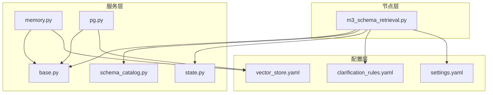
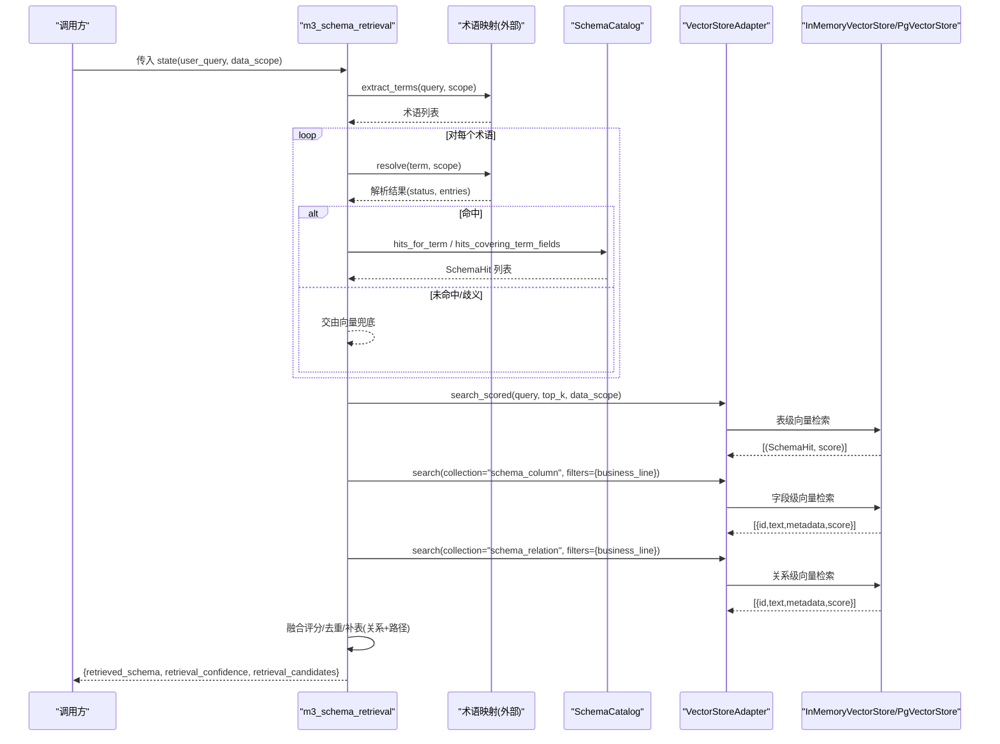
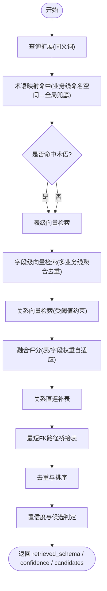
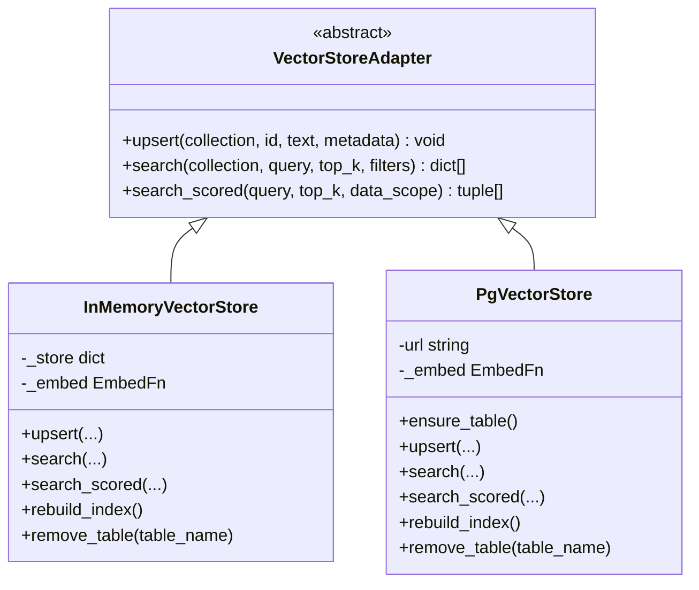
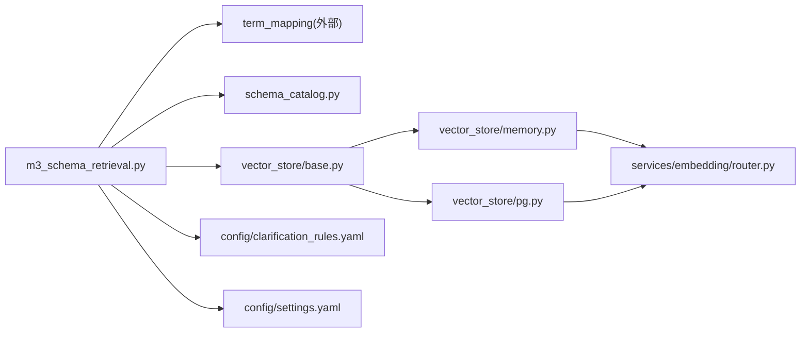

# Schema检索节点 (m3_schema_retrieval)

<cite>
**本文引用的文件**   
- [m3_schema_retrieval.py](file://nl2sql_agent/nodes/m3_schema_retrieval.py)
- [base.py](file://nl2sql_agent/services/vector_store/base.py)
- [memory.py](file://nl2sql_agent/services/vector_store/memory.py)
- [pg.py](file://nl2sql_agent/services/vector_store/pg.py)
- [vector_store.yaml](file://nl2sql_agent/config/vector_store.yaml)
- [clarification_rules.yaml](file://nl2sql_agent/config/clarification_rules.yaml)
- [settings.yaml](file://nl2sql_agent/config/settings.yaml)
- [state.py](file://nl2sql_agent/state.py)
- [schema_catalog.py](file://nl2sql_agent/services/schema_catalog.py)
- [test_nodes.py](file://nl2sql_agent/tests/test_nodes.py)
</cite>

## 目录
1. [简介](#简介)
2. [项目结构](#项目结构)
3. [核心组件](#核心组件)
4. [架构总览](#架构总览)
5. [详细组件分析](#详细组件分析)
6. [依赖关系分析](#依赖关系分析)
7. [性能与索引优化](#性能与索引优化)
8. [故障排查指南](#故障排查指南)
9. [结论](#结论)
10. [附录：配置与示例](#附录配置与示例)

## 简介
本文件面向 NL2SQL 系统的 Schema 检索节点（模块 3，m3_schema_retrieval），系统性阐述其向量检索实现、语义匹配算法与候选表选择策略。重点说明：
- 如何从向量存储中召回相关 Schema（表级、字段级、关系级）；
- 如何计算相似度分数并进行融合排序；
- 如何通过术语映射与向量兜底协同提升召回准确率；
- 如何基于业务线 data_scope 进行权限隔离；
- 检索配置参数、索引构建与性能调优方法；
- 不同查询场景下的行为与结果分析方法。

## 项目结构
Schema 检索节点位于 nodes 层，依赖 services 层的向量存储抽象与具体实现、目录服务、状态模型以及配置中心。关键文件如下：
- 节点实现：m3_schema_retrieval.py
- 向量存储接口与实现：base.py、memory.py、pg.py
- 配置：vector_store.yaml、clarification_rules.yaml、settings.yaml
- 状态与目录：state.py、schema_catalog.py
- 测试用例：test_nodes.py

图表来源
- [m3_schema_retrieval.py:1-331](file://nl2sql_agent/nodes/m3_schema_retrieval.py#L1-L331)
- [base.py:1-21](file://nl2sql_agent/services/vector_store/base.py#L1-L21)
- [memory.py:1-197](file://nl2sql_agent/services/vector_store/memory.py#L1-L197)
- [pg.py:1-174](file://nl2sql_agent/services/vector_store/pg.py#L1-L174)
- [vector_store.yaml:1-6](file://nl2sql_agent/config/vector_store.yaml#L1-L6)
- [clarification_rules.yaml:1-62](file://nl2sql_agent/config/clarification_rules.yaml#L1-L62)
- [settings.yaml:1-30](file://nl2sql_agent/config/settings.yaml#L1-L30)
- [state.py:1-146](file://nl2sql_agent/state.py#L1-L146)
- [schema_catalog.py:1-126](file://nl2sql_agent/services/schema_catalog.py#L1-L126)

章节来源
- [m3_schema_retrieval.py:1-331](file://nl2sql_agent/nodes/m3_schema_retrieval.py#L1-L331)
- [vector_store.yaml:1-6](file://nl2sql_agent/config/vector_store.yaml#L1-L6)
- [clarification_rules.yaml:1-62](file://nl2sql_agent/config/clarification_rules.yaml#L1-L62)
- [settings.yaml:1-30](file://nl2sql_agent/config/settings.yaml#L1-L30)
- [state.py:1-146](file://nl2sql_agent/state.py#L1-L146)
- [schema_catalog.py:1-126](file://nl2sql_agent/services/schema_catalog.py#L1-L126)

## 核心组件
- m3_schema_retrieval 节点：负责混合检索（术语映射 + 表/字段向量 + 关系扩展）、置信度评估与候选生成。
- 向量存储抽象 VectorStoreAdapter：统一 upsert/search/search_scored 接口。
- InMemoryVectorStore：内存实现，余弦相似度，支持缓存与增量重建。
- PgVectorStore：Postgres + pgvector 实现，SQL 侧向量检索。
- SchemaCatalog：按 data_scope 过滤的表/字段目录，提供术语命中覆盖能力。
- 配置：clarification_rules 控制检索阈值、权重、扩展策略；settings 控制 Top-K 等运行参数；vector_store.yaml 选择后端。

章节来源
- [m3_schema_retrieval.py:1-331](file://nl2sql_agent/nodes/m3_schema_retrieval.py#L1-L331)
- [base.py:1-21](file://nl2sql_agent/services/vector_store/base.py#L1-L21)
- [memory.py:1-197](file://nl2sql_agent/services/vector_store/memory.py#L1-L197)
- [pg.py:1-174](file://nl2sql_agent/services/vector_store/pg.py#L1-L174)
- [schema_catalog.py:1-126](file://nl2sql_agent/services/schema_catalog.py#L1-L126)
- [clarification_rules.yaml:1-62](file://nl2sql_agent/config/clarification_rules.yaml#L1-L62)
- [settings.yaml:1-30](file://nl2sql_agent/config/settings.yaml#L1-L30)
- [vector_store.yaml:1-6](file://nl2sql_agent/config/vector_store.yaml#L1-L6)

## 架构总览
m3_schema_retrieval 节点采用“术语优先 + 向量兜底”的混合检索架构，结合表级、字段级与关系级三类向量召回，并通过业务线 data_scope 严格隔离权限。

图表来源
- [m3_schema_retrieval.py:230-331](file://nl2sql_agent/nodes/m3_schema_retrieval.py#L230-L331)
- [memory.py:172-197](file://nl2sql_agent/services/vector_store/memory.py#L172-L197)
- [pg.py:139-174](file://nl2sql_agent/services/vector_store/pg.py#L139-L174)
- [schema_catalog.py:64-111](file://nl2sql_agent/services/schema_catalog.py#L64-L111)

## 详细组件分析

### 混合检索流程与评分融合
- 术语层：先通过术语映射在 data_scope 内精确命中，得到主表集合与已命中的业务术语。
- 向量层：并行召回表级与字段级向量，按配置的融合权重合并为表级综合分；若仅单路有结果则沿用该路分数。
- 关系层：基于关系向量召回直接关联表，并基于最短 FK 路径补充桥接表，避免无约束扩散。
- 置信度与候选：术语命中时置信度为 1.0；否则以最高向量分作为置信度；Top-2 差距小于阈值或相对差距小于比例时视为相近候选，进入澄清流程。

图表来源
- [m3_schema_retrieval.py:64-129](file://nl2sql_agent/nodes/m3_schema_retrieval.py#L64-L129)
- [m3_schema_retrieval.py:131-208](file://nl2sql_agent/nodes/m3_schema_retrieval.py#L131-L208)
- [clarification_rules.yaml:27-62](file://nl2sql_agent/config/clarification_rules.yaml#L27-L62)

章节来源
- [m3_schema_retrieval.py:230-331](file://nl2sql_agent/nodes/m3_schema_retrieval.py#L230-L331)
- [clarification_rules.yaml:27-62](file://nl2sql_agent/config/clarification_rules.yaml#L27-L62)

### 向量存储接口与实现
- 接口定义：VectorStoreAdapter 统一 upsert/search/search_scored 三个核心方法，屏蔽后端差异。
- 内存实现：InMemoryVectorStore 使用余弦相似度，支持按 business_line 过滤；search_scored 基于 catalog 表列表与内存 embedding 缓存；具备持久化缓存与增量重建能力。
- PG 实现：PgVectorStore 将文本向量化后写入 schema_embeddings 表，利用 pgvector 的 <=> 算子做近似最近邻检索；search_scored 通过 SQL 限定 id 列表并按数据范围过滤。

图表来源
- [base.py:11-21](file://nl2sql_agent/services/vector_store/base.py#L11-L21)
- [memory.py:21-197](file://nl2sql_agent/services/vector_store/memory.py#L21-L197)
- [pg.py:15-174](file://nl2sql_agent/services/vector_store/pg.py#L15-L174)

章节来源
- [base.py:1-21](file://nl2sql_agent/services/vector_store/base.py#L1-L21)
- [memory.py:1-197](file://nl2sql_agent/services/vector_store/memory.py#L1-L197)
- [pg.py:1-174](file://nl2sql_agent/services/vector_store/pg.py#L1-L174)

### 目录与权限隔离
- SchemaCatalog 按 data_scope 聚合业务线表与共享表，确保检索结果不越权。
- 术语命中时，优先查找包含完整字段的表；若字段分散在多表，则用贪心覆盖策略返回能共同覆盖术语字段的表集合。
- 行级过滤由上层注入 row_level_filters，不在检索阶段改变表可见性，但保证后续执行安全。

章节来源
- [schema_catalog.py:27-126](file://nl2sql_agent/services/schema_catalog.py#L27-L126)
- [state.py:135-146](file://nl2sql_agent/state.py#L135-L146)

### 置信度与候选策略
- 置信度来源：术语命中=1.0；否则取最高向量分；若无结果则为 0.0。
- 候选判定：Top-2 绝对差值小于 candidate_gap_threshold 或相对差距小于 candidate_gap_ratio 时，视为相近候选，触发澄清。
- 补充策略：当术语命中存在时，基于字段相关性加权对向量候选进行补充，限制数量与最低阈值，避免无关表干扰。

章节来源
- [m3_schema_retrieval.py:36-61](file://nl2sql_agent/nodes/m3_schema_retrieval.py#L36-L61)
- [m3_schema_retrieval.py:230-331](file://nl2sql_agent/nodes/m3_schema_retrieval.py#L230-L331)
- [clarification_rules.yaml:27-62](file://nl2sql_agent/config/clarification_rules.yaml#L27-L62)

## 依赖关系分析
- m3_schema_retrieval 依赖：
  - 术语映射：extract_terms/resolve
  - SchemaCatalog：tables_for_scope/hits_for_term/hits_covering_term_fields
  - VectorStoreAdapter：search/search_scored
  - 配置：clarification_rules、settings
- 向量存储实现依赖：
  - InMemoryVectorStore：embedding router、text_builder（mschema 源加载）
  - PgVectorStore：psycopg、pgvector、embedding router

图表来源
- [m3_schema_retrieval.py:1-331](file://nl2sql_agent/nodes/m3_schema_retrieval.py#L1-L331)
- [schema_catalog.py:1-126](file://nl2sql_agent/services/schema_catalog.py#L1-L126)
- [base.py:1-21](file://nl2sql_agent/services/vector_store/base.py#L1-L21)
- [memory.py:1-197](file://nl2sql_agent/services/vector_store/memory.py#L1-L197)
- [pg.py:1-174](file://nl2sql_agent/services/vector_store/pg.py#L1-L174)
- [clarification_rules.yaml:1-62](file://nl2sql_agent/config/clarification_rules.yaml#L1-L62)
- [settings.yaml:1-30](file://nl2sql_agent/config/settings.yaml#L1-L30)

章节来源
- [m3_schema_retrieval.py:1-331](file://nl2sql_agent/nodes/m3_schema_retrieval.py#L1-L331)
- [schema_catalog.py:1-126](file://nl2sql_agent/services/schema_catalog.py#L1-L126)
- [base.py:1-21](file://nl2sql_agent/services/vector_store/base.py#L1-L21)
- [memory.py:1-197](file://nl2sql_agent/services/vector_store/memory.py#L1-L197)
- [pg.py:1-174](file://nl2sql_agent/services/vector_store/pg.py#L1-L174)

## 性能与索引优化
- 索引构建
  - 内存实现：首次检索自动构建表级/字段级/关系级向量，支持从 mschema 源批量写入；可持久化缓存 vector-cache.json，重启后复用（需语义哈希与 embedding 签名一致）。
  - PG 实现：ensure_table 建表（维度来自 embedding 模型配置）；rebuild_index 清空并重建，优先从 mschema 源恢复。
- 增量同步
  - remove_table 清理指定表的表级、字段级与关系级条目；prepare_incremental 恢复上一快照后再增量重算变化表。
- 检索优化
  - search_scored 按 data_scope 过滤，减少无效扫描；PG 端使用 id ANY 列表与 <=> 算子加速。
  - 字段级检索按 business_line 分别召回并去重保留最高分，避免重复计算。
- 权重与阈值调优
  - field_query_markers 控制字段型问题提高字段向量权重；table/column_vector_weight 控制融合权重。
  - relation_threshold、supplement_threshold、candidate_gap_* 控制召回与候选稳定性。
- 监控建议
  - 记录 node_latencies 与 trace_steps 定位慢点；关注 search_scored 耗时与 PG 向量索引命中率。

章节来源
- [memory.py:69-138](file://nl2sql_agent/services/vector_store/memory.py#L69-L138)
- [memory.py:139-197](file://nl2sql_agent/services/vector_store/memory.py#L139-L197)
- [pg.py:69-118](file://nl2sql_agent/services/vector_store/pg.py#L69-L118)
- [pg.py:139-174](file://nl2sql_agent/services/vector_store/pg.py#L139-L174)
- [clarification_rules.yaml:27-62](file://nl2sql_agent/config/clarification_rules.yaml#L27-L62)
- [settings.yaml:6-8](file://nl2sql_agent/config/settings.yaml#L6-L8)

## 故障排查指南
- 无结果或结果为空
  - 检查 data_scope 是否正确；确认 catalog.tables_for_scope 返回非空。
  - 确认向量索引已构建（内存：_ensure_indexed；PG：ensure_table/rebuild_index）。
  - 检查 business_line 过滤条件是否与 upsert 时一致。
- 置信度过低或候选过多
  - 调整 confidence_threshold、candidate_gap_threshold/candidate_gap_ratio。
  - 针对字段型问题，适当提高 column_vector_weight。
- 关联表缺失
  - 检查关系向量是否存在且 score >= relation_threshold。
  - 确认 mschema relations 正确，必要时扩大 max_join_path_hops。
- 性能问题
  - 增大 schema_search_top_k 可能增加开销；合理设置 supplement_top_n 与 relation_expand_top_n。
  - PG 端检查向量索引类型与维度配置；内存端检查缓存是否命中。

章节来源
- [m3_schema_retrieval.py:230-331](file://nl2sql_agent/nodes/m3_schema_retrieval.py#L230-L331)
- [memory.py:69-138](file://nl2sql_agent/services/vector_store/memory.py#L69-L138)
- [pg.py:69-118](file://nl2sql_agent/services/vector_store/pg.py#L69-L118)
- [clarification_rules.yaml:27-62](file://nl2sql_agent/config/clarification_rules.yaml#L27-L62)

## 结论
m3_schema_retrieval 节点通过“术语映射 + 表/字段向量 + 关系扩展”的混合检索机制，在保证权限隔离的前提下，实现了高召回与可控的候选集规模。通过清晰的配置项与可扩展的向量存储接口，系统可在内存与 PG 两种后端间灵活切换，并提供完善的索引构建、缓存与增量同步能力。合理的权重与阈值调优能有效平衡召回质量与澄清成本。

## 附录：配置与示例

### 关键配置项
- settings.yaml
  - schema_search_top_k：向量兜底 Top-K
  - database_url/pgvector_url：数据库连接（影响执行器与 PG 后端）
- clarification_rules.yaml
  - retrieval_confidence.*：置信度阈值、候选差距阈值/比例、补充数量与阈值、字段相关性权重、融合权重、关系扩展阈值与最大跳数、字段型问题标记词、领域查询扩展
- vector_store.yaml
  - backend：memory 或 pgvector
  - pgvector.url：PG 连接串

章节来源
- [settings.yaml:6-16](file://nl2sql_agent/config/settings.yaml#L6-L16)
- [clarification_rules.yaml:27-62](file://nl2sql_agent/config/clarification_rules.yaml#L27-L62)
- [vector_store.yaml:1-6](file://nl2sql_agent/config/vector_store.yaml#L1-L6)

### 典型查询场景与结果分析
- 术语精确命中
  - 输入：“查询新信贷的逾期本金”，data_scope=["risk_mart"]
  - 预期：retrieved_schema=[dwd_ar_loan_info]，confidence=1.0，candidates=[]
  - 依据：术语映射命中字段 → 目录覆盖 → 无需向量兜底
- 字段级向量命中
  - 输入：“最高学历”，data_scope=["risk_mart"]
  - 预期：customer_profile 被召回（字段 EDUCATION 注释“最高学历”）
  - 依据：字段级向量检索命中，融合后表级得分最高
- 领域查询扩展
  - 输入：“借了多少”，data_scope=["risk_mart"]
  - 预期：confidence=1.0，business_terms=["贷款金额"]
  - 依据：query_expansions 将“借了多少”扩展为“贷款金额/放款金额”，术语命中
- 关系直连补表
  - 输入：“贷款金额对应客户”，data_scope=["risk_mart"]
  - 预期：除 dwd_ar_loan_info 外，补充 customer_profile（关系向量命中且满足阈值）
- 最短路径桥接
  - 输入：跨表查询 customer ↔ loan
  - 预期：补充 application 作为桥接表（BFS 最短路径）

章节来源
- [test_nodes.py:65-108](file://nl2sql_agent/tests/test_nodes.py#L65-L108)
- [test_nodes.py:118-142](file://nl2sql_agent/tests/test_nodes.py#L118-L142)
- [test_nodes.py:144-200](file://nl2sql_agent/tests/test_nodes.py#L144-L200)

### 代码片段路径参考
- 混合检索入口与输出字段构造
  - [m3_schema_retrieval.py:230-331](file://nl2sql_agent/nodes/m3_schema_retrieval.py#L230-L331)
- 表级向量检索（内存）
  - [memory.py:172-197](file://nl2sql_agent/services/vector_store/memory.py#L172-L197)
- 表级向量检索（PG）
  - [pg.py:139-174](file://nl2sql_agent/services/vector_store/pg.py#L139-L174)
- 字段级向量检索（按业务线聚合去重）
  - [m3_schema_retrieval.py:73-84](file://nl2sql_agent/nodes/m3_schema_retrieval.py#L73-L84)
- 关系直连补表
  - [m3_schema_retrieval.py:131-155](file://nl2sql_agent/nodes/m3_schema_retrieval.py#L131-L155)
- 最短路径桥接表
  - [m3_schema_retrieval.py:157-208](file://nl2sql_agent/nodes/m3_schema_retrieval.py#L157-L208)
- 置信度与候选判定
  - [m3_schema_retrieval.py:36-61](file://nl2sql_agent/nodes/m3_schema_retrieval.py#L36-L61)
- 目录按 scope 过滤与术语覆盖
  - [schema_catalog.py:52-111](file://nl2sql_agent/services/schema_catalog.py#L52-L111)