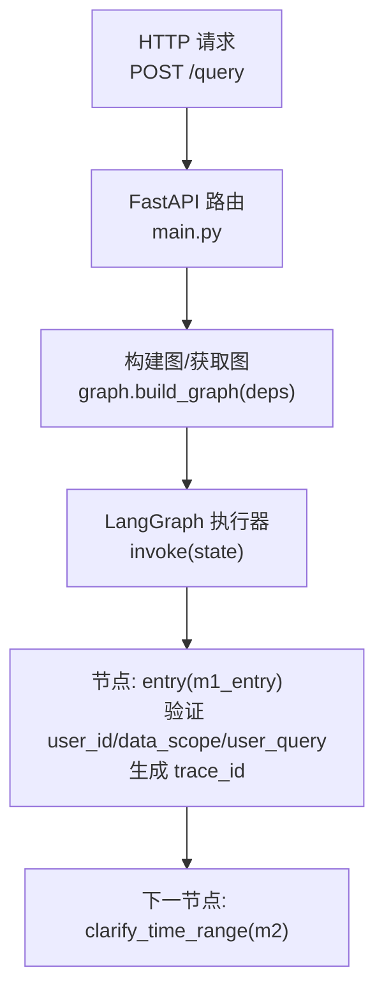
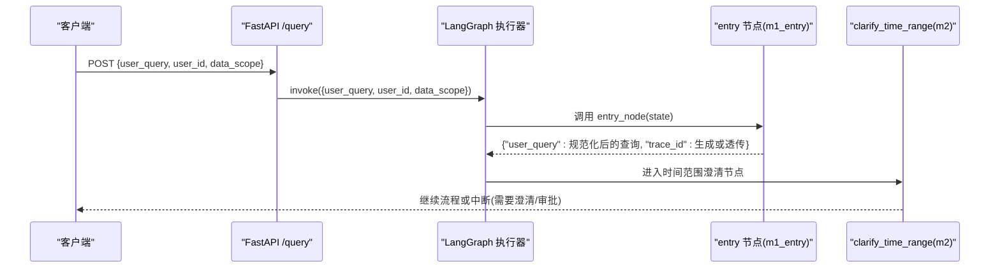
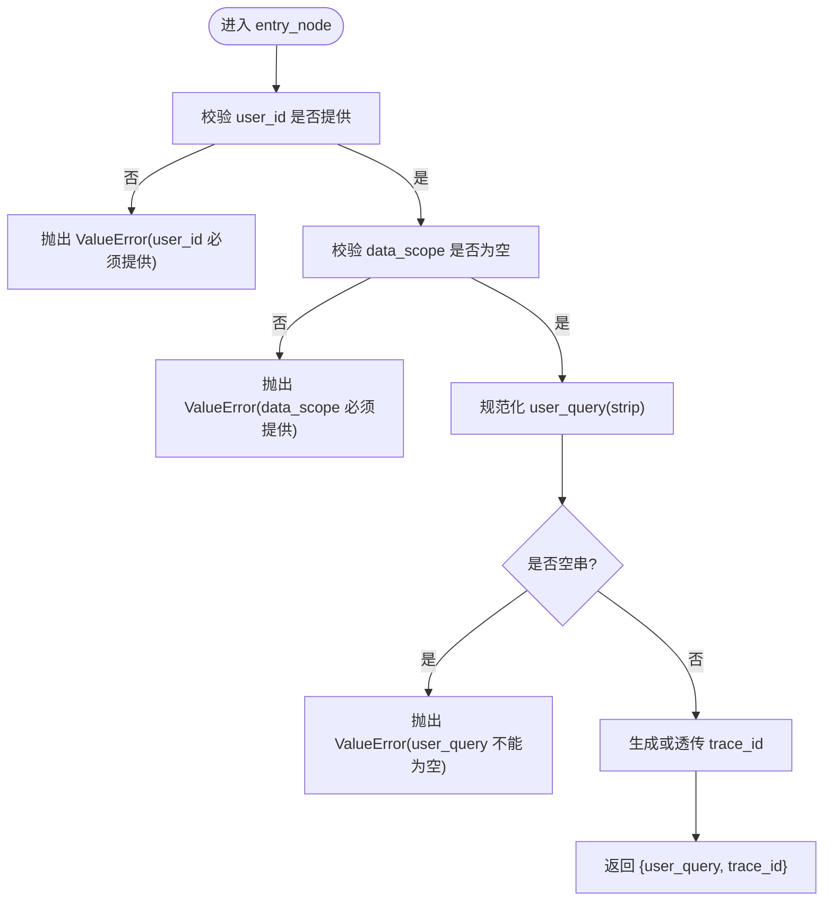
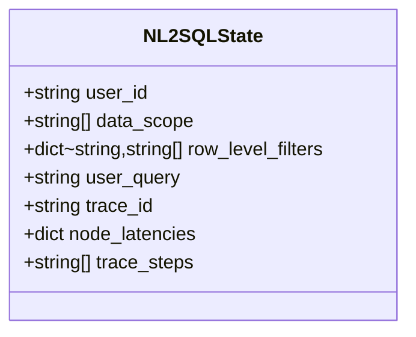
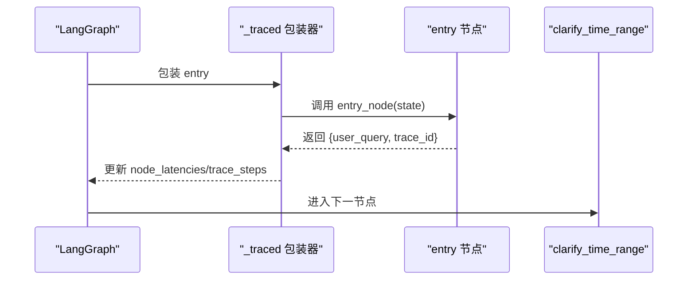
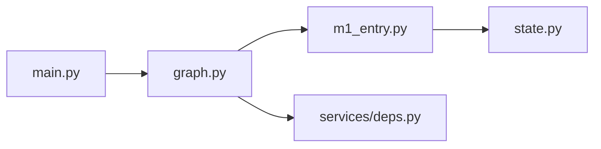

# 入口节点 (m1_entry)

<cite>
**本文引用的文件**   
- [nl2sql_agent/nodes/m1_entry.py](file://nl2sql_agent/nodes/m1_entry.py)
- [nl2sql_agent/state.py](file://nl2sql_agent/state.py)
- [nl2sql_agent/graph.py](file://nl2sql_agent/graph.py)
- [nl2sql_agent/services/deps.py](file://nl2sql_agent/services/deps.py)
- [nl2sql_agent/main.py](file://nl2sql_agent/main.py)
- [nl2sql_agent/tests/conftest.py](file://nl2sql_agent/tests/conftest.py)
</cite>

## 目录
1. [简介](#简介)
2. [项目结构](#项目结构)
3. [核心组件](#核心组件)
4. [架构总览](#架构总览)
5. [详细组件分析](#详细组件分析)
6. [依赖关系分析](#依赖关系分析)
7. [性能考量](#性能考量)
8. [故障排查指南](#故障排查指南)
9. [结论](#结论)
10. [附录：使用示例与最佳实践](#附录使用示例与最佳实践)

## 简介
本章节聚焦 NL2SQL 系统的入口节点 m1_entry，说明其职责、输入输出规范、错误处理机制、生命周期管理、依赖注入模式以及与全局状态的交互方式。该节点作为整个查询编排图的起点，负责接收原始自然语言问题、校验用户身份与数据权限（由调用方注入）、生成追踪ID等，确保后续所有节点基于一致的上下文运行。

## 项目结构
m1_entry 位于 nodes 模块中，通过 graph 模块注册为 LangGraph 的第一个节点，并在 main.py 的 HTTP 接口中被调用。状态定义在 state.py 中，依赖装配在 services/deps.py 中。

图表来源
- [nl2sql_agent/main.py:83-120](file://nl2sql_agent/main.py#L83-L120)
- [nl2sql_agent/graph.py:174-202](file://nl2sql_agent/graph.py#L174-L202)
- [nl2sql_agent/nodes/m1_entry.py:14-27](file://nl2sql_agent/nodes/m1_entry.py#L14-L27)

章节来源
- [nl2sql_agent/main.py:1-152](file://nl2sql_agent/main.py#L1-L152)
- [nl2sql_agent/graph.py:1-313](file://nl2sql_agent/graph.py#L1-L313)
- [nl2sql_agent/nodes/m1_entry.py:1-28](file://nl2sql_agent/nodes/m1_entry.py#L1-L28)

## 核心组件
- 入口节点函数 make_entry_node(deps)：返回一个符合 LangGraph 节点签名的函数 entry_node(state)。
- 全局状态 NL2SQLState：包含 user_id、data_scope、user_query、trace_id 等字段，供入口节点读取与写入。
- 图编排 graph：将 entry 节点加入图并设置 START → entry → clarify_time_range 的边。
- 依赖注入 deps：虽然入口节点不直接使用服务，但保持统一签名以兼容其他节点。

章节来源
- [nl2sql_agent/nodes/m1_entry.py:14-27](file://nl2sql_agent/nodes/m1_entry.py#L14-L27)
- [nl2sql_agent/state.py:83-146](file://nl2sql_agent/state.py#L83-L146)
- [nl2sql_agent/graph.py:174-202](file://nl2sql_agent/graph.py#L174-L202)
- [nl2sql_agent/services/deps.py:40-71](file://nl2sql_agent/services/deps.py#L40-L71)

## 架构总览
入口节点是 LangGraph 流程的起始点，承担“鉴权前置 + 规范化 + 追踪”的职责。它不直接访问外部服务，仅对 state 进行校验和补充，保证下游节点无需重复鉴权。

图表来源
- [nl2sql_agent/main.py:83-120](file://nl2sql_agent/main.py#L83-L120)
- [nl2sql_agent/graph.py:174-202](file://nl2sql_agent/graph.py#L174-L202)
- [nl2sql_agent/nodes/m1_entry.py:14-27](file://nl2sql_agent/nodes/m1_entry.py#L14-L27)

## 详细组件分析

### 入口节点职责与行为
- 输入参数规范
  - user_id: 字符串，必填，用于标识调用者身份。
  - data_scope: 字符串列表，必填，表示用户可访问的业务线（系统）集合。
  - user_query: 字符串，必填，原始自然语言问题；节点会做 strip() 规范化。
- 输出状态格式
  - 返回 dict，包含 user_query（规范化后）与 trace_id（若未提供则生成）。
  - 同时被 _traced 包装器记录 node_latencies 与 trace_steps。
- 错误处理机制
  - 缺失 user_id 或 data_scope 时抛出 ValueError。
  - 空 user_query 时抛出 ValueError。
  - 异常会在图编排层被捕获并向上返回，不会吞掉。

图表来源
- [nl2sql_agent/nodes/m1_entry.py:14-27](file://nl2sql_agent/nodes/m1_entry.py#L14-L27)

章节来源
- [nl2sql_agent/nodes/m1_entry.py:14-27](file://nl2sql_agent/nodes/m1_entry.py#L14-L27)

### 状态模型与字段语义
NL2SQLState 定义了入口节点读写的关键字段：
- user_id: 用户标识（入口注入，下游只读）
- data_scope: 用户可访问业务线列表（入口注入，下游只读）
- row_level_filters: 行级过滤条件（服务端鉴权层注入，不得从 data_scope 推导）
- user_query: 原始查询（入口规范化）
- trace_id: 追踪ID（入口生成或透传）
- node_latencies / trace_steps: 节点延迟与步骤顺序（由 _traced 自动维护）

图表来源
- [nl2sql_agent/state.py:83-146](file://nl2sql_agent/state.py#L83-L146)

章节来源
- [nl2sql_agent/state.py:83-146](file://nl2sql_agent/state.py#L83-L146)

### 生命周期管理与图编排
- 入口节点通过 graph.add_node("entry", ...) 注册，START → entry → clarify_time_range。
- _traced 包装器在每个节点前后推送事件，记录延迟与步骤，便于前端展示与调试。
- 入口节点不改变除 user_query 与 trace_id 之外的状态，避免污染下游逻辑。

图表来源
- [nl2sql_agent/graph.py:88-103](file://nl2sql_agent/graph.py#L88-L103)
- [nl2sql_agent/graph.py:174-202](file://nl2sql_agent/graph.py#L174-L202)

章节来源
- [nl2sql_agent/graph.py:88-103](file://nl2sql_agent/graph.py#L88-L103)
- [nl2sql_agent/graph.py:174-202](file://nl2sql_agent/graph.py#L174-L202)

### 依赖注入模式
- make_entry_node(deps) 接受 deps 参数以保持与其他节点一致的签名，尽管入口节点不使用任何服务。
- 生产环境通过 build_deps() 装配 LLM、向量存储、执行器等；测试环境通过 build_test_deps() 注入 FakeLLM/InMemoryExecutor。
- 入口节点不耦合具体服务，利于替换与测试。

章节来源
- [nl2sql_agent/services/deps.py:113-184](file://nl2sql_agent/services/deps.py#L113-L184)
- [nl2sql_agent/nodes/m1_entry.py:14-27](file://nl2sql_agent/nodes/m1_entry.py#L14-L27)

### 与全局状态的交互
- 入口节点读取 user_id、data_scope、user_query、trace_id，并写回 user_query 与 trace_id。
- 后续节点（如 m3_schema_retrieval、m8_static_validation、m9_sensitive_check）直接读取这些字段进行权限与敏感判定，不再重复查权限。

章节来源
- [nl2sql_agent/state.py:135-146](file://nl2sql_agent/state.py#L135-L146)
- [nl2sql_agent/nodes/m1_entry.py:14-27](file://nl2sql_agent/nodes/m1_entry.py#L14-L27)

## 依赖关系分析
- 入口节点仅依赖 NL2SQLState，无外部服务依赖。
- 图编排依赖 LangGraph 的 StateGraph、InMemorySaver、JsonPlusSerializer。
- HTTP 接口依赖 FastAPI，并通过 get_graph() 缓存编译后的图。

图表来源
- [nl2sql_agent/nodes/m1_entry.py:14-27](file://nl2sql_agent/nodes/m1_entry.py#L14-L27)
- [nl2sql_agent/state.py:83-146](file://nl2sql_agent/state.py#L83-L146)
- [nl2sql_agent/graph.py:174-202](file://nl2sql_agent/graph.py#L174-L202)
- [nl2sql_agent/services/deps.py:113-184](file://nl2sql_agent/services/deps.py#L113-L184)
- [nl2sql_agent/main.py:63-80](file://nl2sql_agent/main.py#L63-L80)

章节来源
- [nl2sql_agent/graph.py:174-202](file://nl2sql_agent/graph.py#L174-L202)
- [nl2sql_agent/main.py:63-80](file://nl2sql_agent/main.py#L63-L80)

## 性能考量
- 入口节点只做轻量校验与字符串规范化，时间复杂度 O(n)（n 为 query 长度），开销极低。
- trace_id 生成使用毫秒级时间戳，避免额外 I/O。
- _traced 包装器记录延迟与步骤，对整体流程有极小开销，适合线上监控。

[本节为通用指导，不直接分析具体文件]

## 故障排查指南
- 常见错误
  - ValueError: user_id 必须提供 → 检查调用方是否正确注入 user_id。
  - ValueError: data_scope 必须提供 → 检查调用方是否正确注入 data_scope。
  - ValueError: user_query 不能为空 → 检查用户输入是否被清空或仅含空白字符。
- 定位方法
  - 查看 trace_steps 与 node_latencies，确认 entry 节点是否成功执行。
  - 使用 /thread/{thread_id} 接口获取当前状态快照，核对 user_id、data_scope、user_query、trace_id。
  - 在测试环境中使用 make_input 构造标准输入，快速复现问题。

章节来源
- [nl2sql_agent/nodes/m1_entry.py:14-27](file://nl2sql_agent/nodes/m1_entry.py#L14-L27)
- [nl2sql_agent/main.py:142-146](file://nl2sql_agent/main.py#L142-L146)
- [nl2sql_agent/tests/conftest.py:69-76](file://nl2sql_agent/tests/conftest.py#L69-L76)

## 结论
m1_entry 作为 NL2SQL 系统的入口节点，承担了身份与权限前置校验、查询规范化与追踪ID生成的关键职责。它通过极简的状态操作与严格的输入校验，确保后续节点能在一致且可信的上下文中运行。配合 LangGraph 的编排与 _traced 的监控能力，入口节点为整个查询链路提供了稳定可靠的起点。

[本节为总结性内容，不直接分析具体文件]

## 附录：使用示例与最佳实践

### 正确调用入口节点的步骤
- 构造请求体
  - user_query: 非空字符串
  - user_id: 非空字符串
  - data_scope: 非空字符串列表（例如 ["risk_mart"]）
- 发起 HTTP 请求
  - POST /query，携带上述字段
- 解析响应
  - 若 status 为 human_review_pending，需调用 /approve 恢复流程
  - 若 status 为 done/blocked，查看 final_answer、execution_result、trace_id、trace_steps

章节来源
- [nl2sql_agent/main.py:32-44](file://nl2sql_agent/main.py#L32-L44)
- [nl2sql_agent/main.py:83-120](file://nl2sql_agent/main.py#L83-L120)

### 测试构造输入
- 使用 make_input(query, user_id="u_risk", data_scope=["risk_mart"]) 构造标准输入
- 适用于单元测试与集成测试，确保一致性

章节来源
- [nl2sql_agent/tests/conftest.py:69-76](file://nl2sql_agent/tests/conftest.py#L69-L76)

### 最佳实践
- 始终在调用前校验 user_id 与 data_scope 的有效性，避免运行时异常。
- 对 user_query 做前端二次校验（非空、长度限制），减少无效请求。
- 利用 trace_id 与 trace_steps 进行端到端追踪与问题定位。
- 在生产环境启用 event_sink（WebSocket）以便实时推送节点事件。

[本节为通用指导，不直接分析具体文件]