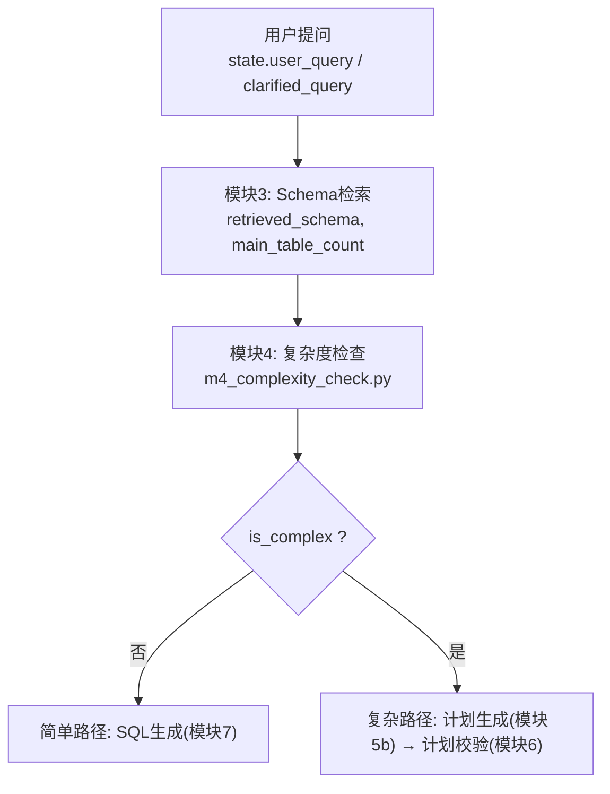
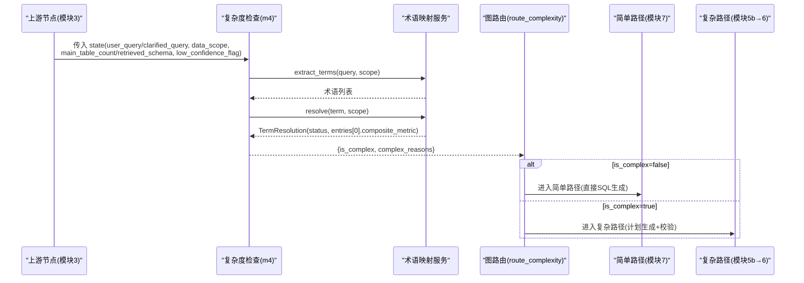
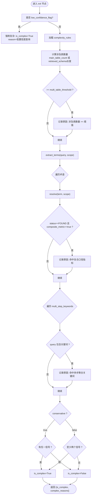
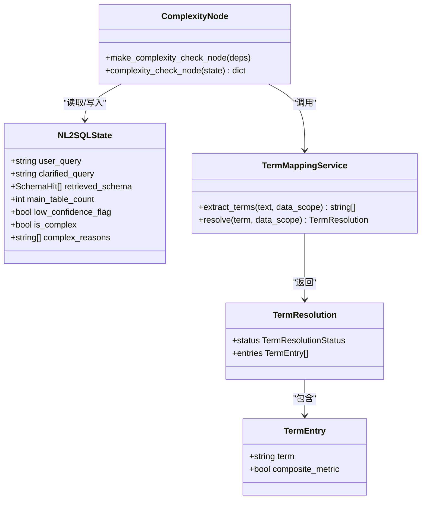
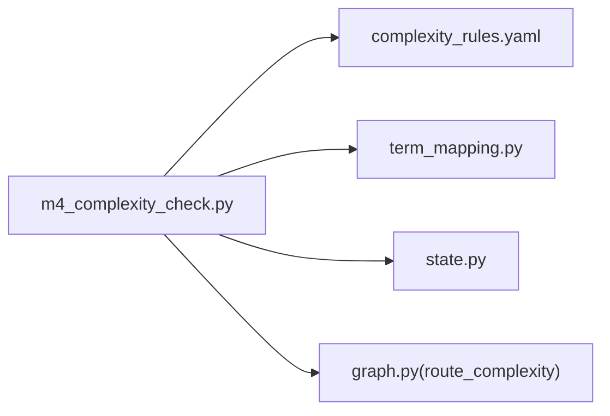

# 复杂度检查节点 (m4_complexity_check)

<cite>
**本文引用的文件**   
- [nl2sql_agent/nodes/m4_complexity_check.py](file://nl2sql_agent/nodes/m4_complexity_check.py)
- [nl2sql_agent/config/complexity_rules.yaml](file://nl2sql_agent/config/complexity_rules.yaml)
- [nl2sql_agent/state.py](file://nl2sql_agent/state.py)
- [nl2sql_agent/graph.py](file://nl2sql_agent/graph.py)
- [nl2sql_agent/services/term_mapping.py](file://nl2sql_agent/services/term_mapping.py)
- [nl2sql_agent/tests/test_nodes.py](file://nl2sql_agent/tests/test_nodes.py)
- [nl2sql_agent/tests/test_routing.py](file://nl2sql_agent/tests/test_routing.py)
- [nl2sql_agent/config/term_mapping/_global.yaml](file://nl2sql_agent/config/term_mapping/_global.yaml)
</cite>

## 目录
1. [简介](#简介)
2. [项目结构](#项目结构)
3. [核心组件](#核心组件)
4. [架构总览](#架构总览)
5. [详细组件分析](#详细组件分析)
6. [依赖关系分析](#依赖关系分析)
7. [性能考量](#性能考量)
8. [故障排查指南](#故障排查指南)
9. [结论](#结论)
10. [附录](#附录)

## 简介
本章节面向 NL2SQL 系统的“复杂度检查节点”（模块 4，m4_complexity_check），目标是帮助读者理解该节点如何在不调用大模型的前提下，基于确定性规则对查询进行复杂度评估，并据此决定走“简单路径”还是“计划路径”。文档将覆盖：
- 复杂度评估算法与指标定义
- 分流决策逻辑（保守策略、阈值配置）
- 查询结构分析（表关联数量、操作复杂度、多步聚合语义）
- 规则配置项与不同复杂度的处理策略
- 结合测试用例的评估结果与处理路径示例

## 项目结构
m4_complexity_check 作为 LangGraph 编排中的一个纯路由节点，位于 nodes 层，读取配置与状态，输出 is_complex 与 complex_reasons，供 graph 路由函数选择后续分支。

图表来源
- [nl2sql_agent/graph.py:174-235](file://nl2sql_agent/graph.py#L174-L235)
- [nl2sql_agent/nodes/m4_complexity_check.py:17-52](file://nl2sql_agent/nodes/m4_complexity_check.py#L17-L52)

章节来源
- [nl2sql_agent/graph.py:174-235](file://nl2sql_agent/graph.py#L174-L235)
- [nl2sql_agent/nodes/m4_complexity_check.py:17-52](file://nl2sql_agent/nodes/m4_complexity_check.py#L17-L52)

## 核心组件
- 复杂度检查节点：实现 m4_complexity_check 的核心逻辑，依据 rules 与 state 字段判定 is_complex 与 complex_reasons。
- 复杂度规则配置：complexity_rules.yaml 提供 conservative、multi_table_threshold、composite_metric_trigger、keyword_trigger、multi_step_keywords 等开关与阈值。
- 术语映射服务：term_mapping.py 负责从查询中提取术语并解析是否命中 composite_metric: true 的复合口径指标。
- 全局状态：state.py 中的 NL2SQLState 提供输入查询、数据范围、Schema 命中、主表计数、低置信度标记等上下文。
- 图编排：graph.py 将 m4 节点接入整体流程，并通过 route_complexity 路由到简单或复杂路径。

章节来源
- [nl2sql_agent/nodes/m4_complexity_check.py:17-52](file://nl2sql_agent/nodes/m4_complexity_check.py#L17-L52)
- [nl2sql_agent/config/complexity_rules.yaml:1-17](file://nl2sql_agent/config/complexity_rules.yaml#L1-L17)
- [nl2sql_agent/services/term_mapping.py:83-128](file://nl2sql_agent/services/term_mapping.py#L83-L128)
- [nl2sql_agent/state.py:83-146](file://nl2sql_agent/state.py#L83-L146)
- [nl2sql_agent/graph.py:134-136](file://nl2sql_agent/graph.py#L134-L136)

## 架构总览
下图展示了 m4 节点在整体链路中的位置与数据流：

图表来源
- [nl2sql_agent/nodes/m4_complexity_check.py:17-52](file://nl2sql_agent/nodes/m4_complexity_check.py#L17-L52)
- [nl2sql_agent/services/term_mapping.py:83-128](file://nl2sql_agent/services/term_mapping.py#L83-L128)
- [nl2sql_agent/graph.py:134-136](file://nl2sql_agent/graph.py#L134-L136)

## 详细组件分析

### 复杂度评估算法与指标定义
- 表数量维度：使用 state.main_table_count（优先）或 len(state.retrieved_schema) 作为涉及表数量；当达到 multi_table_threshold 即触发复杂信号。
- 复合口径指标维度：通过 term_mapping.extract_terms 提取术语，再 resolve 判断是否存在 composite_metric: true 的条目；若命中则触发复杂信号。
- 多步聚合关键词维度：遍历 multi_step_keywords，若 query 包含任一关键词则触发复杂信号。
- 综合决策：当 conservative=true 时，任意一条规则命中即判为复杂；否则需要至少两条规则命中才判为复杂。

图表来源
- [nl2sql_agent/nodes/m4_complexity_check.py:17-52](file://nl2sql_agent/nodes/m4_complexity_check.py#L17-L52)
- [nl2sql_agent/config/complexity_rules.yaml:1-17](file://nl2sql_agent/config/complexity_rules.yaml#L1-L17)
- [nl2sql_agent/services/term_mapping.py:83-128](file://nl2sql_agent/services/term_mapping.py#L83-L128)

章节来源
- [nl2sql_agent/nodes/m4_complexity_check.py:17-52](file://nl2sql_agent/nodes/m4_complexity_check.py#L17-L52)
- [nl2sql_agent/config/complexity_rules.yaml:1-17](file://nl2sql_agent/config/complexity_rules.yaml#L1-L17)
- [nl2sql_agent/services/term_mapping.py:83-128](file://nl2sql_agent/services/term_mapping.py#L83-L128)

### 分流决策逻辑与处理策略
- 简单路径（is_complex=false）：直接进入 SQL 生成（模块7），快速出结果。
- 复杂路径（is_complex=true）：进入计划生成（模块5b）与计划校验（模块6），确保复杂查询的口径与连接逻辑正确后再进入 SQL 生成。
- 低置信度强制复杂：当 state.low_confidence_flag=true 时，跳过规则判断，直接判为复杂，避免误判导致业务逻辑错误。

图表来源
- [nl2sql_agent/state.py:83-146](file://nl2sql_agent/state.py#L83-L146)
- [nl2sql_agent/nodes/m4_complexity_check.py:17-52](file://nl2sql_agent/nodes/m4_complexity_check.py#L17-L52)
- [nl2sql_agent/services/term_mapping.py:23-36](file://nl2sql_agent/services/term_mapping.py#L23-L36)

章节来源
- [nl2sql_agent/graph.py:230-235](file://nl2sql_agent/graph.py#L230-L235)
- [nl2sql_agent/nodes/m4_complexity_check.py:17-52](file://nl2sql_agent/nodes/m4_complexity_check.py#L17-L52)

### 复杂度规则配置与阈值设置
- conservative：默认 true，表示任意一条规则命中即判复杂；设为 false 时需至少两条规则命中。
- multi_table_threshold：默认 2，涉及表数量达到或超过该值即触发复杂信号。
- composite_metric_trigger：默认 true，启用复合口径指标检测。
- keyword_trigger：默认 true，启用多步聚合关键词检测。
- multi_step_keywords：可配置的关键词列表，如同比、环比、累计、占比、排名、均值等。

章节来源
- [nl2sql_agent/config/complexity_rules.yaml:1-17](file://nl2sql_agent/config/complexity_rules.yaml#L1-L17)

### 不同复杂度的处理策略
- 简单查询：直接生成 SQL，减少 LLM 调用与计划开销，提升响应速度。
- 复杂查询：先生成查询计划，再进行计划校验，确保口径一致性与连接逻辑正确，最后再生成 SQL。
- 低置信度查询：强制走复杂路径，便于人工审视理解过程，降低误判风险。

章节来源
- [nl2sql_agent/graph.py:230-235](file://nl2sql_agent/graph.py#L230-L235)
- [nl2sql_agent/nodes/m4_complexity_check.py:17-52](file://nl2sql_agent/nodes/m4_complexity_check.py#L17-L52)

### 代码示例与评估结果路径
以下示例来自单元测试，展示不同查询模式的复杂度评估结果与处理路径：

- 复合口径指标命中（复杂路径）
  - 输入：“查询新信贷的逾期率”
  - 预期：is_complex=true，complex_reasons 包含“命中复合口径指标”
  - 处理路径：进入计划生成与校验，最终可能触发敏感审批（金额聚合）
  
  章节来源
  - [nl2sql_agent/tests/test_nodes.py:208-218](file://nl2sql_agent/tests/test_nodes.py#L208-L218)
  - [nl2sql_agent/tests/test_routing.py:45-77](file://nl2sql_agent/tests/test_routing.py#L45-L77)

- 单表简单查询（简单路径）
  - 输入：“查询新信贷的贷款余额”
  - 预期：is_complex=false
  - 处理路径：直接 SQL 生成，无需计划
  
  章节来源
  - [nl2sql_agent/tests/test_nodes.py:220-229](file://nl2sql_agent/tests/test_nodes.py#L220-L229)

- 术语映射与复合指标配置
  - 术语库中“逾期率”标记为 composite_metric=true，用于触发复杂判断
  
  章节来源
  - [nl2sql_agent/config/term_mapping/_global.yaml:10-15](file://nl2sql_agent/config/term_mapping/_global.yaml#L10-L15)

## 依赖关系分析
- 节点依赖 deps.config.complexity_rules 与 deps.term_mapping。
- 状态依赖 state.clarified_query/user_query、state.data_scope、state.main_table_count/retrieved_schema、state.low_confidence_flag。
- 图路由依赖 state.is_complex 决定分支。

图表来源
- [nl2sql_agent/nodes/m4_complexity_check.py:17-52](file://nl2sql_agent/nodes/m4_complexity_check.py#L17-L52)
- [nl2sql_agent/config/complexity_rules.yaml:1-17](file://nl2sql_agent/config/complexity_rules.yaml#L1-L17)
- [nl2sql_agent/services/term_mapping.py:83-128](file://nl2sql_agent/services/term_mapping.py#L83-L128)
- [nl2sql_agent/state.py:83-146](file://nl2sql_agent/state.py#L83-L146)
- [nl2sql_agent/graph.py:134-136](file://nl2sql_agent/graph.py#L134-L136)

章节来源
- [nl2sql_agent/nodes/m4_complexity_check.py:17-52](file://nl2sql_agent/nodes/m4_complexity_check.py#L17-L52)
- [nl2sql_agent/graph.py:134-136](file://nl2sql_agent/graph.py#L134-L136)

## 性能考量
- 无 LLM 调用：m4 节点为纯规则判断，避免额外延迟。
- 术语匹配优化：extract_terms 按最长优先匹配，避免重复子串匹配；resolve 仅查已命名空间与全局映射。
- 保守策略权衡：宁可多走一次计划路径，也不漏判复杂查询，以降低业务逻辑错误的风险。

## 故障排查指南
- 误判为简单路径：检查 multi_table_threshold 是否过低；确认 main_table_count 是否正确；验证术语映射中 composite_metric 标记。
- 误判为复杂路径：检查 multi_step_keywords 是否过于宽泛；确认 conservative 配置；核对 low_confidence_flag 是否被上游设置为 true。
- 低置信度强制复杂：若不希望强制复杂，需在上游调整 retrieval_confidence 或澄清策略，避免设置 low_confidence_flag。

章节来源
- [nl2sql_agent/nodes/m4_complexity_check.py:17-52](file://nl2sql_agent/nodes/m4_complexity_check.py#L17-L52)
- [nl2sql_agent/config/complexity_rules.yaml:1-17](file://nl2sql_agent/config/complexity_rules.yaml#L1-L17)
- [nl2sql_agent/state.py:83-146](file://nl2sql_agent/state.py#L83-L146)

## 结论
m4_complexity_check 以确定性规则为核心，结合表数量、复合口径指标与多步聚合关键词三大维度，对查询进行复杂度评估。其保守策略确保了复杂查询不被漏判，同时通过简单路径优化了常见查询的性能。配合术语映射与图编排，形成了稳定可靠的分流机制。

## 附录
- 术语映射示例：_global.yaml 中定义了跨业务线的通用术语与复合指标标记。
- 测试用例：test_nodes.py 与 test_routing.py 提供了复杂度判断的典型场景与端到端流程验证。

章节来源
- [nl2sql_agent/config/term_mapping/_global.yaml:1-43](file://nl2sql_agent/config/term_mapping/_global.yaml#L1-L43)
- [nl2sql_agent/tests/test_nodes.py:208-229](file://nl2sql_agent/tests/test_nodes.py#L208-L229)
- [nl2sql_agent/tests/test_routing.py:45-77](file://nl2sql_agent/tests/test_routing.py#L45-L77)