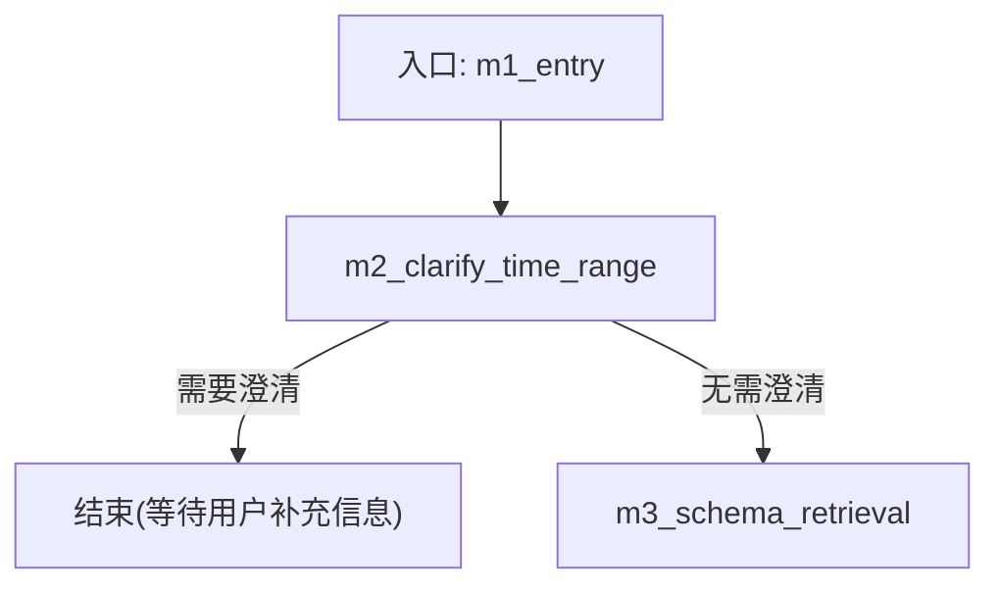
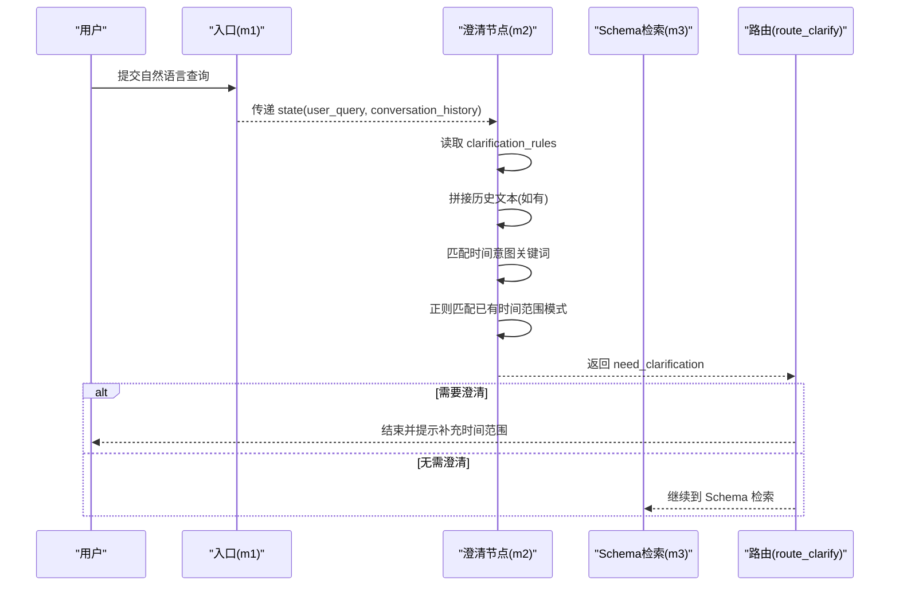
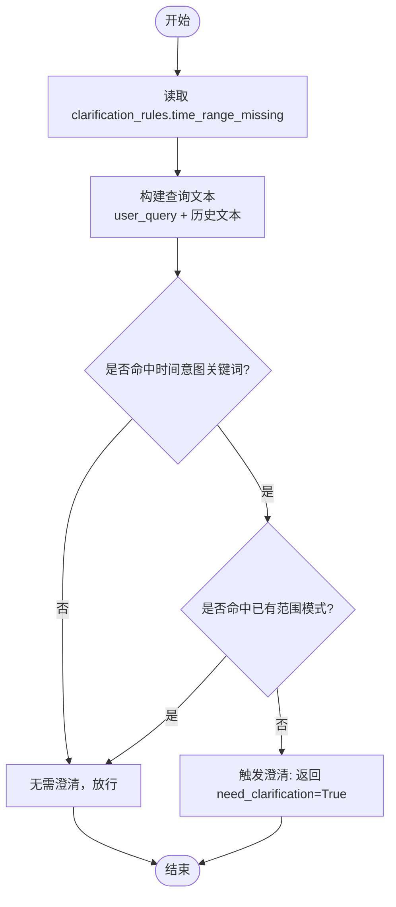
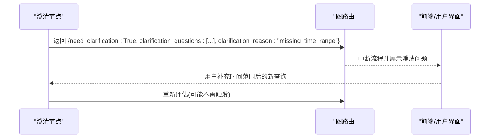
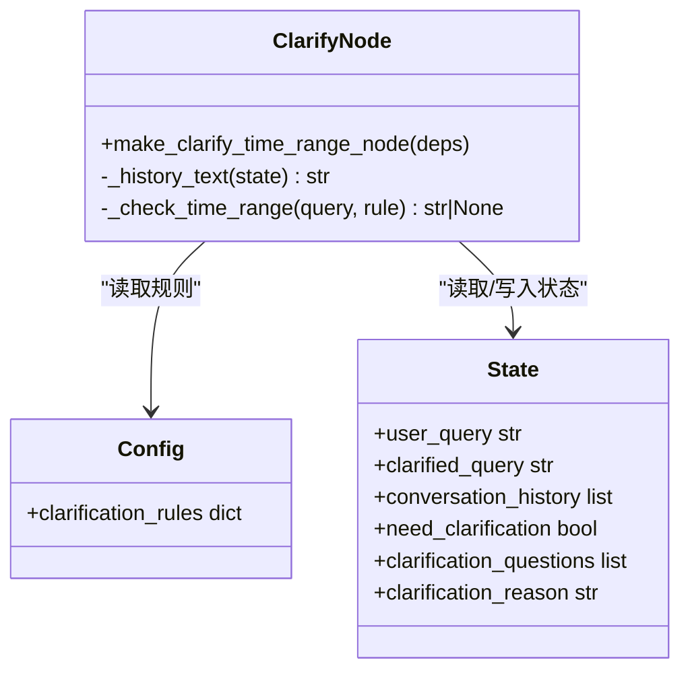
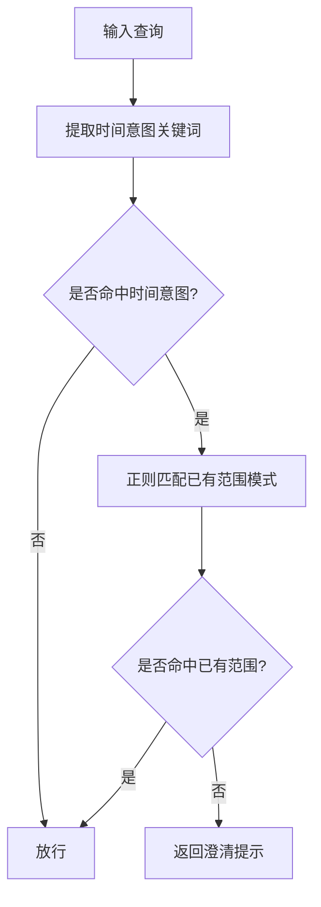

# 意图澄清节点 (m2_clarify_time_range)

<cite>
**本文引用的文件**   
- [nl2sql_agent/nodes/m2_clarify_time_range.py](file://nl2sql_agent/nodes/m2_clarify_time_range.py)
- [nl2sql_agent/config/clarification_rules.yaml](file://nl2sql_agent/config/clarification_rules.yaml)
- [nl2sql_agent/state.py](file://nl2sql_agent/state.py)
- [nl2sql_agent/graph.py](file://nl2sql_agent/graph.py)
- [nl2sql_agent/tests/test_nodes.py](file://nl2sql_agent/tests/test_nodes.py)
- [NL2SQL.md](file://NL2SQL.md)
</cite>

## 目录
1. [简介](#简介)
2. [项目结构](#项目结构)
3. [核心组件](#核心组件)
4. [架构总览](#架构总览)
5. [详细组件分析](#详细组件分析)
6. [依赖关系分析](#依赖关系分析)
7. [性能与可扩展性](#性能与可扩展性)
8. [故障排查指南](#故障排查指南)
9. [结论](#结论)
10. [附录：配置规则与示例场景](#附录配置规则与示例场景)

## 简介
本文件为 NL2SQL 系统的“意图澄清节点（模块2）”——m2_clarify_time_range 的完整技术文档。该节点专注于时间范围缺失的意图澄清，通过规则匹配判断用户问题是否包含明确的时间范围；若缺少明确范围且存在时间意图，则触发澄清流程，要求用户补充起止时间。该节点不处理术语映射、指标口径歧义等职责，这些已移交至模块3.5（检索后置信度路由）。

## 项目结构
- 节点实现位于 nl2sql_agent/nodes/m2_clarify_time_range.py
- 规则定义位于 nl2sql_agent/config/clarification_rules.yaml
- 状态模型位于 nl2sql_agent/state.py
- 图编排与路由位于 nl2sql_agent/graph.py
- 单元测试覆盖验证行为位于 nl2sql_agent/tests/test_nodes.py
- 整体设计说明参考 NL2SQL.md

图表来源
- [nl2sql_agent/graph.py:186-209](file://nl2sql_agent/graph.py#L186-L209)

章节来源
- [nl2sql_agent/nodes/m2_clarify_time_range.py:1-61](file://nl2sql_agent/nodes/m2_clarify_time_range.py#L1-L61)
- [nl2sql_agent/config/clarification_rules.yaml:1-25](file://nl2sql_agent/config/clarification_rules.yaml#L1-L25)
- [nl2sql_agent/state.py:83-91](file://nl2sql_agent/state.py#L83-L91)
- [nl2sql_agent/graph.py:186-209](file://nl2sql_agent/graph.py#L186-L209)
- [NL2SQL.md:33-35](file://NL2SQL.md#L33-L35)

## 核心组件
- 节点函数 make_clarify_time_range_node(deps)：构建并返回澄清节点逻辑
- 内部辅助函数 _history_text(state)：拼接对话历史文本，避免重复追问
- 内部检查函数 _check_time_range(query, rule)：基于规则进行时间意图与范围判定
- 状态字段 need_clarification / clarification_questions / clarification_reason：用于驱动前端交互与后续路由

章节来源
- [nl2sql_agent/nodes/m2_clarify_time_range.py:16-31](file://nl2sql_agent/nodes/m2_clarify_time_range.py#L16-L31)
- [nl2sql_agent/state.py:88-91](file://nl2sql_agent/state.py#L88-L91)

## 架构总览
m2_clarify_time_range 作为第二节点，在入口之后立即执行，负责拦截“有時間意圖但缺明確範圍”的问题。其输出决定是进入 Schema 检索还是直接结束等待用户澄清。

图表来源
- [nl2sql_agent/graph.py:186-209](file://nl2sql_agent/graph.py#L186-L209)
- [nl2sql_agent/nodes/m2_clarify_time_range.py:34-61](file://nl2sql_agent/nodes/m2_clarify_time_range.py#L34-L61)

章节来源
- [nl2sql_agent/graph.py:186-209](file://nl2sql_agent/graph.py#L186-L209)

## 详细组件分析

### 时间范围解析与歧义消解算法
- 时间意图识别：从配置 time_intent_keywords 中匹配用户输入中的关键词，如“时间、期间、月份、季度、周、年、月、日期、日、date、最近、本期、时间段、时段”。
- 已有范围检测：使用 range_present_patterns 的正则表达式集合判断是否已包含明确时间范围，支持中文数字与量词（如“近三个月”“最近两个月”）、年份格式（如“2024-01”）、相对时间（如“今年以来、上月、本月、本季度、本年度、上周、本周、去年、今年”）、季度表达（Q1-Q4、第X季度）、区间符号（到、至、~、>=、<=、>、<、between、以来、至今、起止）。
- 歧义消解策略：若命中时间意图但未检测到明确范围，则返回澄清消息；否则直接放行。

图表来源
- [nl2sql_agent/nodes/m2_clarify_time_range.py:23-31](file://nl2sql_agent/nodes/m2_clarify_time_range.py#L23-L31)
- [nl2sql_agent/config/clarification_rules.yaml:11-25](file://nl2sql_agent/config/clarification_rules.yaml#L11-L25)

章节来源
- [nl2sql_agent/nodes/m2_clarify_time_range.py:23-31](file://nl2sql_agent/nodes/m2_clarify_time_range.py#L23-L31)
- [nl2sql_agent/config/clarification_rules.yaml:11-25](file://nl2sql_agent/config/clarification_rules.yaml#L11-L25)

### 用户交互流程
- 当 need_clarification=True 时，图路由将直接结束当前查询，等待用户补充时间范围。
- 节点会返回 clarification_questions 列表与 clarification_reason="missing_time_range"，以及 final_answer 提示语。
- 历史上下文会被拼接进查询文本，避免重复追问已在历史中提供的范围。

图表来源
- [nl2sql_agent/nodes/m2_clarify_time_range.py:34-61](file://nl2sql_agent/nodes/m2_clarify_time_range.py#L34-L61)
- [nl2sql_agent/graph.py:186-209](file://nl2sql_agent/graph.py#L186-L209)

章节来源
- [nl2sql_agent/nodes/m2_clarify_time_range.py:34-61](file://nl2sql_agent/nodes/m2_clarify_time_range.py#L34-L61)
- [nl2sql_agent/graph.py:186-209](file://nl2sql_agent/graph.py#L186-L209)

### 敏感度阈值与可靠性控制
- sensitivity：全局阈值（0~1），数值越低越容易触发澄清；可通过配置调整误报率。
- reliability：规则可靠性权重，默认1.0；实际触发条件为 reliability × 触发信号 >= sensitivity。
- 通过 sensitivity 与 reliability 的组合，可精细控制时间范围澄清的灵敏度。

章节来源
- [nl2sql_agent/config/clarification_rules.yaml:6-8](file://nl2sql_agent/config/clarification_rules.yaml#L6-L8)
- [nl2sql_agent/nodes/m2_clarify_time_range.py:49-52](file://nl2sql_agent/nodes/m2_clarify_time_range.py#L49-L52)

### 对话管理机制
- 历史文本拼接：_history_text(state) 将 conversation_history 中的内容按行拼接，供 _check_time_range 再次匹配，避免重复追问。
- 状态字段：
  - user_query：原始用户查询
  - clarified_query：可选的已澄清查询（优先使用）
  - conversation_history：历史消息列表
  - need_clarification：是否需要澄清
  - clarification_questions：澄清问题列表
  - clarification_reason：澄清原因（如 missing_time_range）

章节来源
- [nl2sql_agent/nodes/m2_clarify_time_range.py:16-21](file://nl2sql_agent/nodes/m2_clarify_time_range.py#L16-L21)
- [nl2sql_agent/state.py:84-91](file://nl2sql_agent/state.py#L84-L91)

### 时间范围解析的具体场景与处理结果
以下为典型场景及预期行为（基于测试与规则）：
- “查询新信贷贷款余额的时间段分布” → 触发澄清（缺少明确范围）
- “查询新信贷近三个月的贷款余额” → 无需澄清（已含明确范围）
- “查询新信贷的逾期率” → 无需澄清（无时间意图）
- “查询放款成功率” → 无需澄清（无时间意图）

章节来源
- [nl2sql_agent/tests/test_nodes.py:411-438](file://nl2sql_agent/tests/test_nodes.py#L411-L438)
- [nl2sql_agent/config/clarification_rules.yaml:11-25](file://nl2sql_agent/config/clarification_rules.yaml#L11-L25)

## 依赖关系分析
- 节点依赖 deps.config.clarification_rules 获取规则配置
- 节点依赖 NL2SQLState 提供用户查询与历史上下文
- 图编排通过 route_clarify 决定下一步走向

图表来源
- [nl2sql_agent/nodes/m2_clarify_time_range.py:34-61](file://nl2sql_agent/nodes/m2_clarify_time_range.py#L34-L61)
- [nl2sql_agent/state.py:83-91](file://nl2sql_agent/state.py#L83-L91)
- [nl2sql_agent/config/clarification_rules.yaml:1-25](file://nl2sql_agent/config/clarification_rules.yaml#L1-L25)

章节来源
- [nl2sql_agent/nodes/m2_clarify_time_range.py:34-61](file://nl2sql_agent/nodes/m2_clarify_time_range.py#L34-L61)
- [nl2sql_agent/state.py:83-91](file://nl2sql_agent/state.py#L83-L91)
- [nl2sql_agent/config/clarification_rules.yaml:1-25](file://nl2sql_agent/config/clarification_rules.yaml#L1-L25)

## 性能与可扩展性
- 复杂度：时间意图与范围检测均为 O(n) 字符串匹配与正则扫描，开销极低。
- 可扩展性：规则完全由 YAML 配置驱动，新增时间表达或修改提示语无需改动代码。
- 可观测性：节点延迟与步骤记录由 graph._traced 包装器自动注入 state.node_latencies 与 state.trace_steps。

章节来源
- [nl2sql_agent/graph.py:88-103](file://nl2sql_agent/graph.py#L88-L103)
- [nl2sql_agent/config/clarification_rules.yaml:1-25](file://nl2sql_agent/config/clarification_rules.yaml#L1-L25)

## 故障排查指南
- 频繁触发澄清：检查 sensitivity 是否过低；适当提高阈值以减少误报。
- 未触发澄清：确认 time_intent_keywords 是否覆盖用户表达；检查 range_present_patterns 是否正确匹配已有范围。
- 历史未生效：确保 conversation_history 非空且消息字典包含 content 字段。
- 路由异常：确认 route_clarify 返回值与图边配置一致。

章节来源
- [nl2sql_agent/nodes/m2_clarify_time_range.py:34-61](file://nl2sql_agent/nodes/m2_clarify_time_range.py#L34-L61)
- [nl2sql_agent/graph.py:130-132](file://nl2sql_agent/graph.py#L130-L132)
- [nl2sql_agent/config/clarification_rules.yaml:6-8](file://nl2sql_agent/config/clarification_rules.yaml#L6-L8)

## 结论
m2_clarify_time_range 节点以轻量、可配置的规则匹配为核心，精准拦截“有时间意图但缺明确范围”的用户问题，并通过对话历史避免重复追问。其设计简洁、扩展性强，配合 graph 的路由机制与 state 的状态管理，形成稳定的意图澄清闭环。

## 附录：配置规则与示例场景

### 配置项说明
- enabled：是否启用时间范围澄清规则
- sensitivity：全局敏感度阈值（0~1）
- time_range_missing.enabled：子规则开关
- time_range_missing.reliability：规则可靠性权重
- time_range_missing.time_intent_keywords：时间意图关键词列表
- time_range_missing.range_present_patterns：已有时间范围的正则模式集合
- time_range_missing.message：澄清提示信息

章节来源
- [nl2sql_agent/config/clarification_rules.yaml:6-25](file://nl2sql_agent/config/clarification_rules.yaml#L6-L25)

### 典型场景与处理结果
- 场景A：“查询新信贷贷款余额的时间段分布”
  - 行为：触发澄清，reason=missing_time_range
- 场景B：“查询新信贷近三个月的贷款余额”
  - 行为：无需澄清，直接进入 Schema 检索
- 场景C：“查询新信贷的逾期率”
  - 行为：无需澄清（无时间意图）
- 场景D：“查询放款成功率”
  - 行为：无需澄清（无时间意图）

章节来源
- [nl2sql_agent/tests/test_nodes.py:411-438](file://nl2sql_agent/tests/test_nodes.py#L411-L438)

### 流程图：时间范围解析决策

图表来源
- [nl2sql_agent/nodes/m2_clarify_time_range.py:23-31](file://nl2sql_agent/nodes/m2_clarify_time_range.py#L23-L31)
- [nl2sql_agent/config/clarification_rules.yaml:11-25](file://nl2sql_agent/config/clarification_rules.yaml#L11-L25)