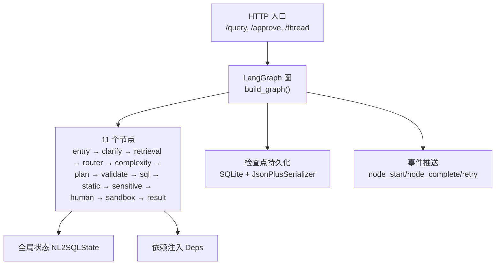
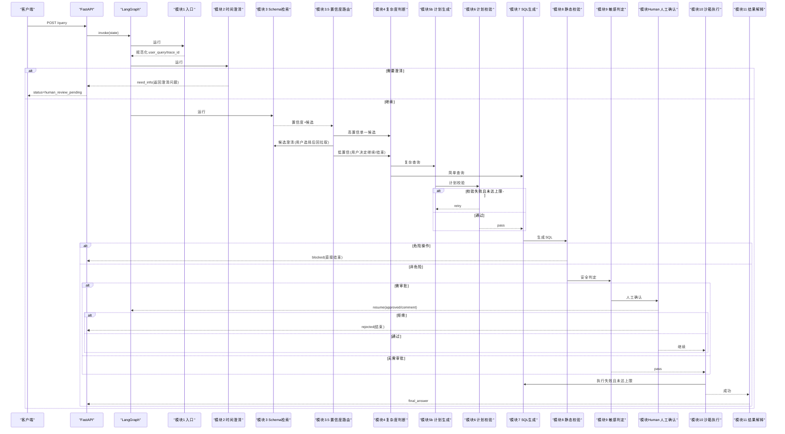
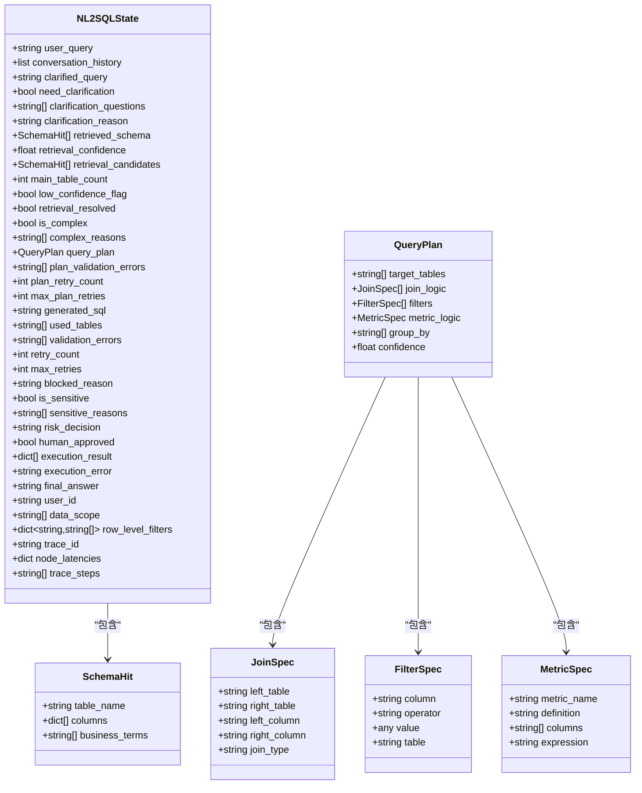

# 节点架构设计

<cite>
**本文引用的文件**   
- [graph.py](file://nl2sql_agent/graph.py)
- [state.py](file://nl2sql_agent/state.py)
- [main.py](file://nl2sql_agent/main.py)
- [m1_entry.py](file://nl2sql_agent/nodes/m1_entry.py)
- [m2_clarify_time_range.py](file://nl2sql_agent/nodes/m2_clarify_time_range.py)
- [m3_schema_retrieval.py](file://nl2sql_agent/nodes/m3_schema_retrieval.py)
- [m3_5_retrieval_confidence_router.py](file://nl2sql_agent/nodes/m3_5_retrieval_confidence_router.py)
- [m4_complexity_check.py](file://nl2sql_agent/nodes/m4_complexity_check.py)
- [m5b_plan_generation.py](file://nl2sql_agent/nodes/m5b_plan_generation.py)
- [m6_plan_validation.py](file://nl2sql_agent/nodes/m6_plan_validation.py)
- [m7_sql_generation.py](file://nl2sql_agent/nodes/m7_sql_generation.py)
- [m8_static_validation.py](file://nl2sql_agent/nodes/m8_static_validation.py)
- [m9_sensitive_check.py](file://nl2sql_agent/nodes/m9_sensitive_check.py)
- [m10_sandbox_execution.py](file://nl2sql_agent/nodes/m10_sandbox_execution.py)
- [m11_result_interpretation.py](file://nl2sql_agent/nodes/m11_result_interpretation.py)
- [human_review.py](file://nl2sql_agent/nodes/human_review.py)
</cite>

## 目录
1. [简介](#简介)
2. [项目结构](#项目结构)
3. [核心组件](#核心组件)
4. [架构总览](#架构总览)
5. [详细组件分析](#详细组件分析)
6. [依赖关系分析](#依赖关系分析)
7. [性能考量](#性能考量)
8. [故障排查指南](#故障排查指南)
9. [结论](#结论)
10. [附录：扩展与最佳实践](#附录扩展与最佳实践)

## 简介
本文件面向 NL2SQL 系统的“基于 LangGraph 的 11 个核心节点”架构，系统性阐述每个节点的职责边界、输入输出规范、数据转换逻辑、生命周期管理、依赖注入机制与错误处理策略。同时文档化节点间通信协议、状态传递格式与事件触发机制，并提供自定义节点开发指南与示例路径，帮助读者快速扩展系统能力。

## 项目结构
- 编排层：LangGraph StateGraph 定义 11 个节点与路由规则，统一编译为可执行图。
- 状态层：NL2SQLState 作为全局状态载体，贯穿所有节点。
- 服务层：Deps 提供 LLM、向量库、术语映射、SQL 方言、执行器等外部能力。
- 入口层：FastAPI 暴露 /query、/approve、/thread 接口，负责线程管理与中断恢复。

**图表来源** 
- [graph.py:174-312](file://nl2sql_agent/graph.py#L174-L312)
- [main.py:83-145](file://nl2sql_agent/main.py#L83-L145)

**章节来源**
- [graph.py:1-312](file://nl2sql_agent/graph.py#L1-L312)
- [main.py:1-152](file://nl2sql_agent/main.py#L1-L152)

## 核心组件
- 全局状态 NL2SQLState：承载用户问题、检索结果、计划、SQL、校验、敏感判定、执行结果、权限与追踪字段。
- 依赖注入 Deps：集中提供配置、LLM、SQL 方言、向量存储、术语映射、执行器、Few-shot 等能力。
- 事件与追踪：traced 包装器记录节点耗时与步骤；event_sink 推送 node_start/node_complete/retry 事件。
- 检查点与中断：支持 SQLite 持久化与 interrupt_before 暂停（人工确认、候选澄清、低置信澄清）。

**章节来源**
- [state.py:83-146](file://nl2sql_agent/state.py#L83-L146)
- [graph.py:88-126](file://nl2sql_agent/graph.py#L88-L126)
- [graph.py:296-312](file://nl2sql_agent/graph.py#L296-L312)

## 架构总览
下图展示从入口到结束的完整流程，包括两条重试回路（计划校验失败回 5b、执行失败回 7）与三条中断点（候选澄清、低置信澄清、人工确认）。

**图表来源** 
- [graph.py:200-294](file://nl2sql_agent/graph.py#L200-L294)
- [main.py:83-145](file://nl2sql_agent/main.py#L83-L145)

## 详细组件分析

### 模块1 入口（m1_entry）
- 职责：校验 user_id/data_scope/user_query，规范化并生成 trace_id。
- 输入：NL2SQLState（含 user_query、user_id、data_scope、conversation_history）。
- 输出：更新后的 state（规范化 user_query、trace_id）。
- 错误处理：缺失必填字段抛出异常，阻止后续流程。
- 依赖：无外部依赖，仅读取 state。

**章节来源**
- [m1_entry.py:14-27](file://nl2sql_agent/nodes/m1_entry.py#L14-L27)

### 模块2 时间范围澄清（m2_clarify_time_range）
- 职责：基于规则检测是否缺少时间范围，必要时提示补充。
- 输入：NL2SQLState 与 clarification_rules。
- 输出：need_clarification、clarification_questions、clarification_reason、final_answer。
- 错误处理：规则关闭或置信度低于阈值则不触发澄清。

**章节来源**
- [m2_clarify_time_range.py:34-61](file://nl2sql_agent/nodes/m2_clarify_time_range.py#L34-L61)

### 模块3 Schema 检索（m3_schema_retrieval）
- 职责：混合检索（术语映射 + 表级/字段级向量 + 关系向量），按 data_scope 过滤，产出 retrieved_schema、retrieval_confidence、retrieval_candidates、main_table_count。
- 输入：NL2SQLState、term_mapping、vector_store、catalog。
- 输出：更新检索相关字段。
- 关键点：术语精确命中置信度高；多候选交由 3.5 路由；关联表通过关系向量与最短 FK 路径补充。

**章节来源**
- [m3_schema_retrieval.py:230-331](file://nl2sql_agent/nodes/m3_schema_retrieval.py#L230-L331)

### 模块3.5 检索后置信度路由（m3_5_retrieval_confidence_router）
- 职责：根据检索置信度与候选数量决定路由至“候选澄清”、“低置信澄清”或“复杂度判断”。
- 输入：NL2SQLState、clarification_rules。
- 输出：路由字符串（clarify_candidates / clarify_low_confidence / complexity_check）。
- 交互：使用 interrupt 进行用户选择或继续决策。

**章节来源**
- [m3_5_retrieval_confidence_router.py:26-37](file://nl2sql_agent/nodes/m3_5_retrieval_confidence_router.py#L26-L37)
- [m3_5_retrieval_confidence_router.py:40-92](file://nl2sql_agent/nodes/m3_5_retrieval_confidence_router.py#L40-L92)
- [m3_5_retrieval_confidence_router.py:95-127](file://nl2sql_agent/nodes/m3_5_retrieval_confidence_router.py#L95-L127)

### 模块4 复杂度判断（m4_complexity_check）
- 职责：确定性规则判断是否走计划路径（复杂）或直接 SQL 生成（简单）。
- 输入：NL2SQLState、complexity_rules、term_mapping。
- 输出：is_complex、complex_reasons。
- 特点：低置信度强制走计划路径；保守策略宁可误判也不漏判。

**章节来源**
- [m4_complexity_check.py:17-52](file://nl2sql_agent/nodes/m4_complexity_check.py#L17-L52)

### 模块5b 计划生成（m5b_plan_generation）
- 职责：调用 LLM 生成结构化 QueryPlan（严格 JSON），避免自由文本。
- 输入：NL2SQLState、term_mapping、schema_view。
- 输出：query_plan、清空历史 plan_validation_errors。
- 错误处理：结构化解析失败记入 plan_validation_errors，交由 6 判定重试。

**章节来源**
- [m5b_plan_generation.py:71-89](file://nl2sql_agent/nodes/m5b_plan_generation.py#L71-L89)

### 模块6 计划校验（m6_plan_validation）
- 职责：校验 target_tables、join_logic、filters、metric_logic 与术语映射一致性。
- 输入：NL2SQLState、retrieved_schema、term_mapping。
- 输出：plan_validation_errors、plan_retry_count、可能 final_answer。
- 重试：达到 max_plan_retries 停止并提示人工介入。

**章节来源**
- [m6_plan_validation.py:100-126](file://nl2sql_agent/nodes/m6_plan_validation.py#L100-L126)

### 模块7 SQL 生成（m7_sql_generation）
- 职责：按计划或自然语言生成 SQL，同时输出 used_tables；每次重新生成清空上一轮 validation_errors。
- 输入：NL2SQLState、few_shot、schema_view。
- 输出：generated_sql、used_tables、validation_errors、execution_error。
- 模型：优先使用 SQL 专用模型，否则回退主模型。

**章节来源**
- [m7_sql_generation.py:94-112](file://nl2sql_agent/nodes/m7_sql_generation.py#L94-L112)

### 模块8 静态校验（m8_static_validation）
- 职责：语法/方言合法性、危险操作拦截、表/字段一致性、字段幻觉检测、行级权限注入。
- 输入：NL2SQLState、dialect、sql service。
- 输出：validation_errors、blocked_reason、injected SQL（如启用行级过滤）。
- 关键：危险操作硬失败不重试；data_scope 不得泄露为字面值；行级过滤由服务端可信值注入。

**章节来源**
- [m8_static_validation.py:33-152](file://nl2sql_agent/nodes/m8_static_validation.py#L33-L152)

### 模块9 敏感判定（m9_sensitive_check）
- 职责：基于规则判定风险三态（pass/approval_required/hard_block），决定是否进入人工确认或阻断。
- 输入：NL2SQLState、sensitive_rules、executor.explain。
- 输出：risk_decision、is_sensitive、sensitive_reasons、blocked_reason、final_answer。
- 规则：敏感字段、EXPLAIN 行数阈值、金额字段聚合/导出、低置信度兜底。

**章节来源**
- [m9_sensitive_check.py:19-105](file://nl2sql_agent/nodes/m9_sensitive_check.py#L19-L105)

### 模块Human 人工确认（human_review）
- 职责：通过 interrupt 暂停流程，收集用户审批意见，写回 human_approved。
- 输入：NL2SQLState。
- 输出：human_approved、rejected 时 final_answer。

**章节来源**
- [human_review.py:15-31](file://nl2sql_agent/nodes/human_review.py#L15-L31)

### 模块10 沙箱执行（m10_sandbox_execution）
- 职责：只读执行、EXPLAIN 守门、未聚合强制 LIMIT、超时保护；失败带原因退回 SQL 生成。
- 输入：NL2SQLState、executor、config。
- 输出：execution_result、execution_error、retry_count、可能 final_answer。

**章节来源**
- [m10_sandbox_execution.py:31-64](file://nl2sql_agent/nodes/m10_sandbox_execution.py#L31-L64)

### 模块11 结果解释（m11_result_interpretation）
- 职责：将结构化结果转自然语言摘要，保留原始数据供核对；LLM 不可用时降级确定性摘要。
- 输入：NL2SQLState、llm.summarize。
- 输出：final_answer。

**章节来源**
- [m11_result_interpretation.py:25-38](file://nl2sql_agent/nodes/m11_result_interpretation.py#L25-L38)

## 依赖关系分析
- 节点对 Deps 的依赖：各节点通过 deps.config、deps.llm、deps.sql、deps.executor、deps.vector_store、deps.term_mapping、deps.few_shot 获取能力。
- 路由与重试：graph.py 中 _retry_route 包装路由函数，统一推送 retry 事件并限制重试次数。
- 中断与恢复：interrupt_before 指定 human_review、clarify_candidates、clarify_low_confidence 三个节点暂停，通过 Command(resume=...) 恢复。

**图表来源** 
- [state.py:14-82](file://nl2sql_agent/state.py#L14-L82)
- [state.py:83-146](file://nl2sql_agent/state.py#L83-L146)

**章节来源**
- [graph.py:106-126](file://nl2sql_agent/graph.py#L106-L126)
- [graph.py:296-312](file://nl2sql_agent/graph.py#L296-L312)

## 性能考量
- 检索阶段并行召回表级与字段级向量，并按业务线去重合并，减少冗余计算。
- 计划与 SQL 生成采用结构化输出与 Few-shot 提升准确率，降低重试成本。
- 静态校验与敏感判定在 LLM 之外完成，避免不必要的模型调用。
- 执行前 EXPLAIN 与 LIMIT 强制保护，防止大扫描与长耗时查询。
- 检查点序列化使用 JsonPlusSerializer，注册状态类型避免反序列化告警。

[本节为通用指导，不直接分析具体文件]

## 故障排查指南
- 入口校验失败：检查 user_id、data_scope、user_query 是否为空。
- 澄清触发：查看 clarification_rules.enabled 与 sensitivity 阈值。
- 检索置信度低：调整 retrieval_confidence 阈值与 candidate_gap_threshold。
- 计划校验失败：关注 plan_validation_errors 的具体错误信息，修正术语口径或字段引用。
- SQL 静态校验失败：检查 dialect、used_tables 与 AST 表/字段一致性，避免 data_scope 泄露。
- 敏感判定阻断：查看 sensitive_rules 配置与 EXPLAIN 预估行数阈值。
- 执行失败：查看 execution_error 与 EXPLAIN 阈值，必要时放宽条件或优化 SQL。

**章节来源**
- [m1_entry.py:14-27](file://nl2sql_agent/nodes/m1_entry.py#L14-L27)
- [m2_clarify_time_range.py:34-61](file://nl2sql_agent/nodes/m2_clarify_time_range.py#L34-L61)
- [m3_5_retrieval_confidence_router.py:26-37](file://nl2sql_agent/nodes/m3_5_retrieval_confidence_router.py#L26-L37)
- [m6_plan_validation.py:100-126](file://nl2sql_agent/nodes/m6_plan_validation.py#L100-L126)
- [m8_static_validation.py:33-152](file://nl2sql_agent/nodes/m8_static_validation.py#L33-L152)
- [m9_sensitive_check.py:19-105](file://nl2sql_agent/nodes/m9_sensitive_check.py#L19-L105)
- [m10_sandbox_execution.py:31-64](file://nl2sql_agent/nodes/m10_sandbox_execution.py#L31-L64)

## 结论
本架构以 LangGraph 为核心编排引擎，通过严格的节点职责划分、确定性校验与安全策略、以及可插拔的依赖注入机制，实现了从自然语言到安全可执行 SQL 的高可靠转化流程。节点间的通信以 NL2SQLState 为载体，事件与检查点保障可观测性与可恢复性。扩展新节点只需遵循统一的签名与状态约定，即可无缝接入现有链路。

[本节为总结性内容，不直接分析具体文件]

## 附录：扩展与最佳实践
- 节点开发规范
  - 函数签名：make_xxx_node(deps) -> (state: NL2SQLState) -> NL2SQLState | dict。
  - 输入输出：仅读写 state 字段，避免副作用；如需外部能力通过 deps 获取。
  - 错误处理：明确区分可重试与不可重试错误，设置 final_answer 或 blocked_reason。
  - 事件与追踪：如需额外事件，可通过 event_sink 推送（由 graph 层封装）。
- 自定义节点示例（创建“自定义澄清节点”）
  - 参考路径：[m2_clarify_time_range.py:34-61](file://nl2sql_agent/nodes/m2_clarify_time_range.py#L34-L61)
  - 步骤：
    1) 实现 make_custom_clarify_node(deps)，内部返回节点函数。
    2) 在 graph.py 中添加节点与边，使用 add_node 与 add_conditional_edges。
    3) 若需中断，使用 interrupt(payload) 并返回 state 更新。
- 最佳实践
  - 保持节点幂等与纯函数风格，便于测试与回放。
  - 使用 deps.config 管理阈值与开关，避免硬编码。
  - 在高风险路径（执行、敏感）增加前置校验与兜底降级。
  - 利用 trace_steps 与 node_latencies 定位瓶颈与问题节点。

**章节来源**
- [graph.py:185-198](file://nl2sql_agent/graph.py#L185-L198)
- [m2_clarify_time_range.py:34-61](file://nl2sql_agent/nodes/m2_clarify_time_range.py#L34-L61)
- [m3_5_retrieval_confidence_router.py:40-92](file://nl2sql_agent/nodes/m3_5_retrieval_confidence_router.py#L40-L92)
- [human_review.py:15-31](file://nl2sql_agent/nodes/human_review.py#L15-L31)