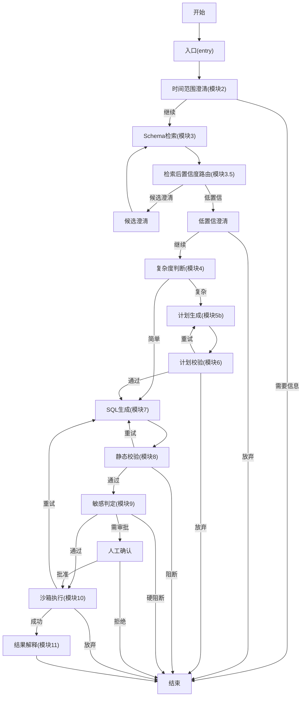
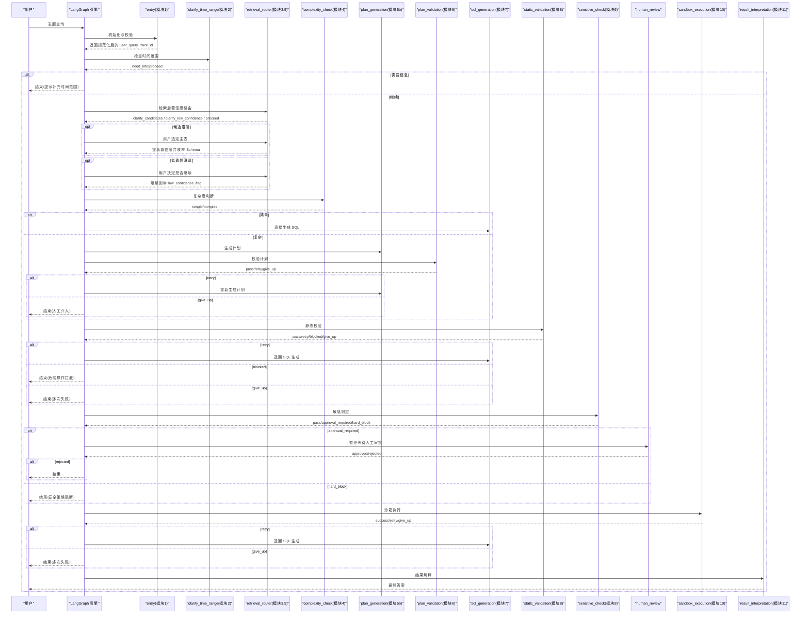
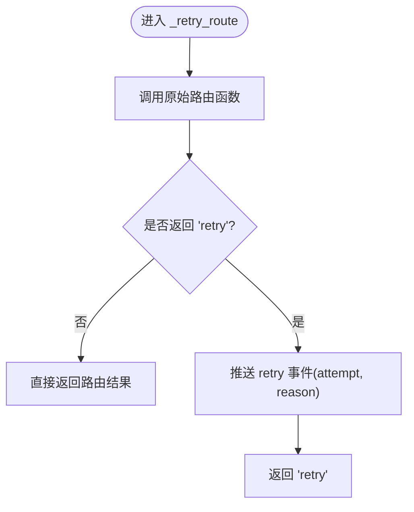
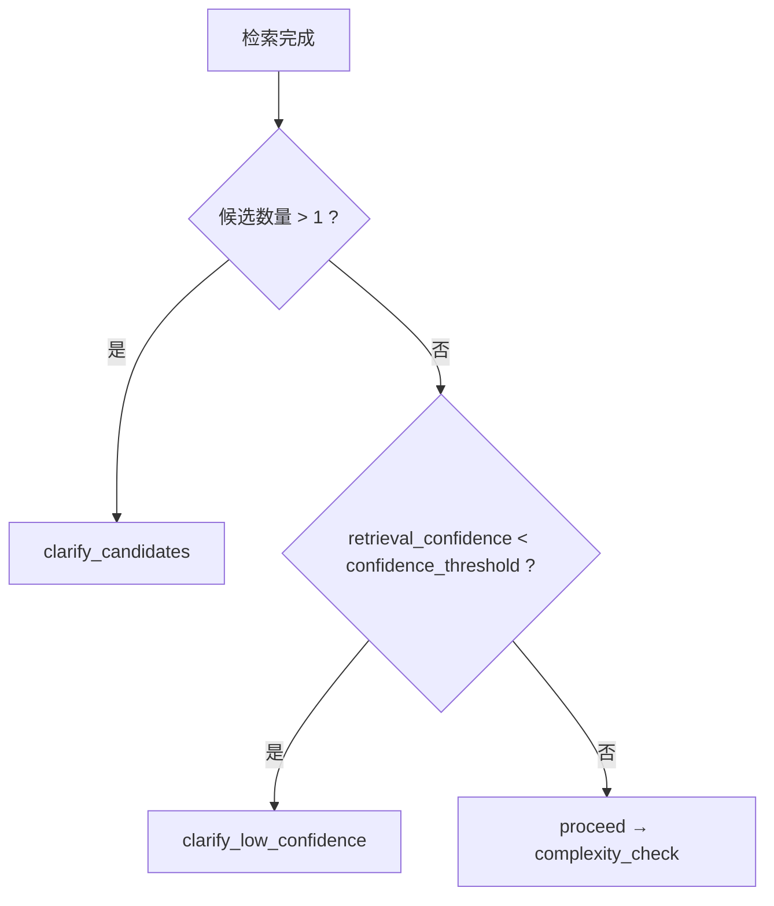
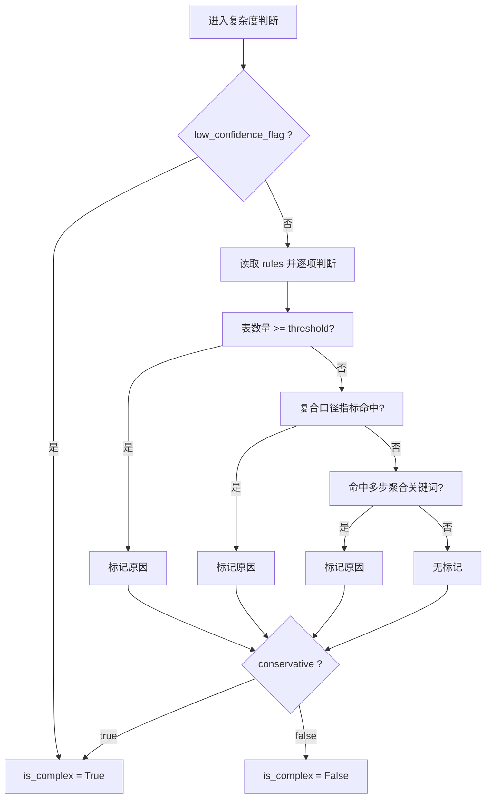
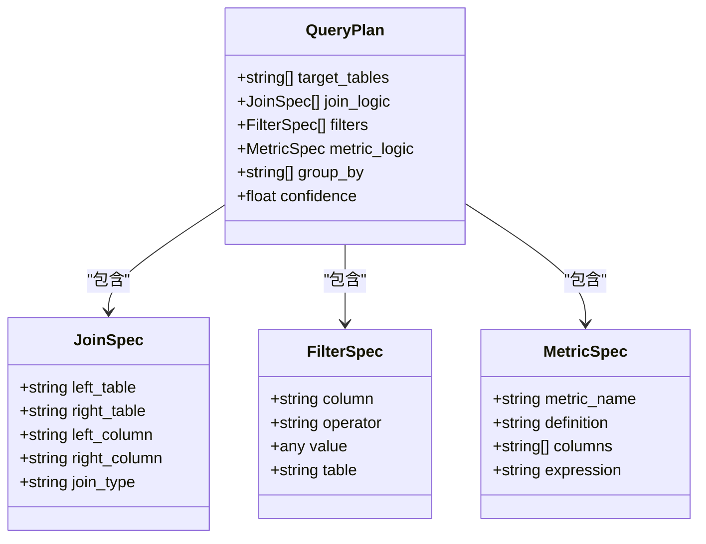
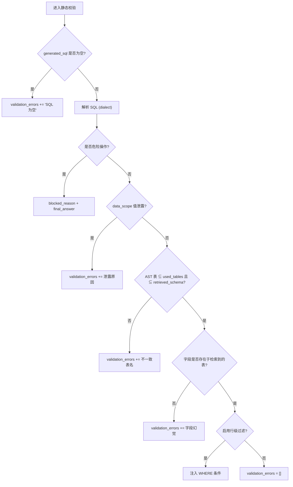
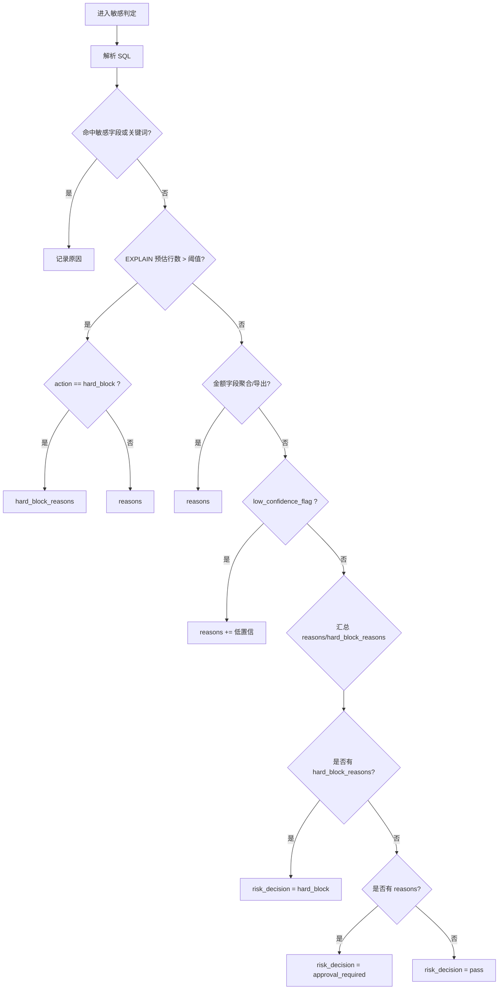
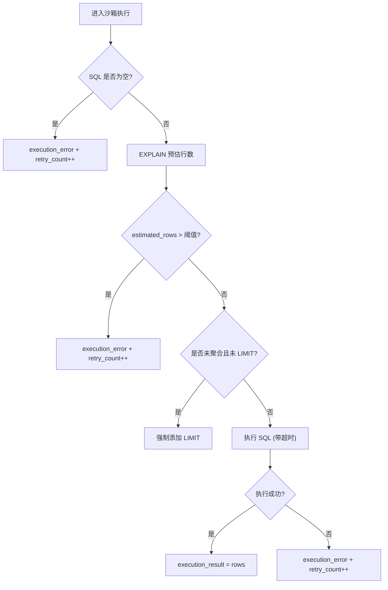
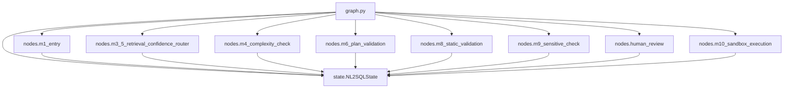

# 路由机制详解

<cite>
**本文引用的文件**   
- [graph.py](file://nl2sql_agent/graph.py)
- [state.py](file://nl2sql_agent/state.py)
- [m1_entry.py](file://nl2sql_agent/nodes/m1_entry.py)
- [m3_5_retrieval_confidence_router.py](file://nl2sql_agent/nodes/m3_5_retrieval_confidence_router.py)
- [m4_complexity_check.py](file://nl2sql_agent/nodes/m4_complexity_check.py)
- [m6_plan_validation.py](file://nl2sql_agent/nodes/m6_plan_validation.py)
- [m8_static_validation.py](file://nl2sql_agent/nodes/m8_static_validation.py)
- [m9_sensitive_check.py](file://nl2sql_agent/nodes/m9_sensitive_check.py)
- [human_review.py](file://nl2sql_agent/nodes/human_review.py)
- [m10_sandbox_execution.py](file://nl2sql_agent/nodes/m10_sandbox_execution.py)
- [clarification_rules.yaml](file://nl2sql_agent/config/clarification_rules.yaml)
- [complexity_rules.yaml](file://nl2sql_agent/config/complexity_rules.yaml)
- [sensitive_rules.yaml](file://nl2sql_agent/config/sensitive_rules.yaml)
- [settings.yaml](file://nl2sql_agent/config/settings.yaml)
- [test_routing.py](file://nl2sql_agent/tests/test_routing.py)
</cite>

## 目录
1. [简介](#简介)
2. [项目结构](#项目结构)
3. [核心组件](#核心组件)
4. [架构总览](#架构总览)
5. [详细组件分析](#详细组件分析)
6. [依赖关系分析](#依赖关系分析)
7. [性能考虑](#性能考虑)
8. [故障排查指南](#故障排查指南)
9. [结论](#结论)
10. [附录](#附录)

## 简介
本文件面向 NL2SQL 系统的路由机制，系统性梳理并解释所有关键路由函数与决策逻辑，包括：
- route_clarify、route_complexity、route_plan_validation、route_static_validation、route_sensitive、route_human_review、route_sandbox
- 条件判断规则、路由决策算法与动态路径选择机制
- 重试路由的实现原理与配置项
- 调试方法与性能优化建议
- 提供流程图与决策树，帮助快速定位问题与调优

## 项目结构
NL2SQL 使用 LangGraph 编排 11 个节点，并通过若干路由函数在节点之间进行条件跳转。整体流程遵循“两条重试回路”的边界不变式：
- 计划校验失败（模块 6）仅在模块 5b 内部打转，不退回模块 3
- 执行报错（模块 10）仅退回模块 7，不退回模块 5b
- 每种错误在离它最近的节点被消化，不允许一次报错把整条链路从头推倒

图表来源
- [graph.py:174-294](file://nl2sql_agent/graph.py#L174-L294)

章节来源
- [graph.py:1-313](file://nl2sql_agent/graph.py#L1-L313)

## 核心组件
- 状态模型 NL2SQLState：承载全链路上下文，包含用户输入、检索结果、计划、SQL、校验错误、风险决策、执行结果等字段，以及追踪字段 trace_id、trace_steps、node_latencies
- 图构建与路由：build_graph 定义节点与边，_retry_route 包装重试路由以推送事件；各 route_* 函数根据 state 字段决定下一跳
- 节点实现：每个业务节点负责单一职责（如 m8 静态校验、m9 敏感判定、m10 沙箱执行），并在必要时写入 final_answer 或 blocked_reason

章节来源
- [state.py:83-146](file://nl2sql_agent/state.py#L83-L146)
- [graph.py:174-313](file://nl2sql_agent/graph.py#L174-L313)

## 架构总览
下图展示从入口到结束的完整调用链路与关键路由点，标注了重试回路与中断点。

图表来源
- [graph.py:174-294](file://nl2sql_agent/graph.py#L174-L294)
- [m1_entry.py:14-27](file://nl2sql_agent/nodes/m1_entry.py#L14-L27)
- [m3_5_retrieval_confidence_router.py:26-37](file://nl2sql_agent/nodes/m3_5_retrieval_confidence_router.py#L26-L37)
- [m4_complexity_check.py:17-52](file://nl2sql_agent/nodes/m4_complexity_check.py#L17-L52)
- [m6_plan_validation.py:100-126](file://nl2sql_agent/nodes/m6_plan_validation.py#L100-L126)
- [m8_static_validation.py:33-152](file://nl2sql_agent/nodes/m8_static_validation.py#L33-L152)
- [m9_sensitive_check.py:19-105](file://nl2sql_agent/nodes/m9_sensitive_check.py#L19-L105)
- [human_review.py:15-31](file://nl2sql_agent/nodes/human_review.py#L15-L31)
- [m10_sandbox_execution.py:31-64](file://nl2sql_agent/nodes/m10_sandbox_execution.py#L31-L64)

## 详细组件分析

### 路由函数与决策逻辑
- route_clarify(state): 若 need_clarification 为真，进入 need_info（结束）；否则 proceed（继续）
- route_complexity(state): 依据 is_complex 决定 complex（走计划）或 simple（直出 SQL）
- route_plan_validation(state): 无错误 → pass；有错误且未达上限 → retry；达到上限 → give_up
- route_static_validation(state): blocked_reason 存在 → blocked（不重试）；无错误 → pass；有错误且未达上限 → retry；达到上限 → give_up
- route_sensitive(state): 直接返回 risk_decision（pass / approval_required / hard_block）
- route_human_review(state): human_approved 为真 → approved；否则 rejected
- route_sandbox(state): 无执行错误 → success；有错误且未达上限 → retry；达到上限 → give_up

这些路由函数均基于 NL2SQLState 的确定性字段进行决策，保证可预测性与可观测性。

章节来源
- [graph.py:130-169](file://nl2sql_agent/graph.py#L130-L169)
- [state.py:83-146](file://nl2sql_agent/state.py#L83-L146)

### 重试路由实现与事件推送
_retry_route 包装器用于在触发重试时向 event_sink 推送 retry 事件，包含 attempt 与 reason，便于前端与监控消费。

图表来源
- [graph.py:106-125](file://nl2sql_agent/graph.py#L106-L125)

章节来源
- [graph.py:106-125](file://nl2sql_agent/graph.py#L106-L125)

### 模块 2：时间范围澄清与路由
- 入口节点 m1 校验 user_id、data_scope、user_query，并生成 trace_id
- 模块 2 根据 clarification_rules.yaml 的时间范围规则判断是否需要追问
- route_clarify 将 need_clarification 映射为 need_info 或 proceed

章节来源
- [m1_entry.py:14-27](file://nl2sql_agent/nodes/m1_entry.py#L14-L27)
- [clarification_rules.yaml:1-25](file://nl2sql_agent/config/clarification_rules.yaml#L1-L25)
- [graph.py:200-209](file://nl2sql_agent/graph.py#L200-L209)

### 模块 3.5：检索后置信度路由
- 多候选 → clarify_candidates（用户选定主表，提升置信度并收窄 Schema）
- 低置信 → clarify_low_confidence（询问是否继续）
- 高置信单一候选 → 放行至复杂度判断

阈值来自 clarification_rules.yaml 的 retrieval_confidence 配置。

图表来源
- [m3_5_retrieval_confidence_router.py:26-37](file://nl2sql_agent/nodes/m3_5_retrieval_confidence_router.py#L26-L37)
- [clarification_rules.yaml:27-38](file://nl2sql_agent/config/clarification_rules.yaml#L27-L38)

章节来源
- [m3_5_retrieval_confidence_router.py:26-127](file://nl2sql_agent/nodes/m3_5_retrieval_confidence_router.py#L26-L127)
- [clarification_rules.yaml:27-62](file://nl2sql_agent/config/clarification_rules.yaml#L27-L62)

### 模块 4：复杂度判断
- 低置信查询强制走计划路径
- 规则来源 complexity_rules.yaml：
  - multi_table_threshold：涉及表数量阈值
  - composite_metric_trigger：复合口径指标命中即复杂
  - keyword_trigger：多步聚合关键词命中即复杂
- conservative=true 时，任一信号即判复杂

图表来源
- [m4_complexity_check.py:17-52](file://nl2sql_agent/nodes/m4_complexity_check.py#L17-L52)
- [complexity_rules.yaml:1-17](file://nl2sql_agent/config/complexity_rules.yaml#L1-L17)

章节来源
- [m4_complexity_check.py:17-52](file://nl2sql_agent/nodes/m4_complexity_check.py#L17-L52)
- [complexity_rules.yaml:1-17](file://nl2sql_agent/config/complexity_rules.yaml#L1-L17)

### 模块 5b/6：计划生成与校验
- 模块 5b 生成 QueryPlan（目标表、连接、过滤、指标口径、分组、置信度）
- 模块 6 校验：
  - target_tables 必须在 retrieved_schema 内
  - join 引用表与列必须合法
  - 字段引用必须存在于某张检索表
  - metric_logic 的 definition 必须与术语映射一致
- 失败则写入 plan_validation_errors，按 max_plan_retries 控制重试

图表来源
- [state.py:31-81](file://nl2sql_agent/state.py#L31-L81)

章节来源
- [m6_plan_validation.py:51-97](file://nl2sql_agent/nodes/m6_plan_validation.py#L51-L97)
- [m6_plan_validation.py:100-126](file://nl2sql_agent/nodes/m6_plan_validation.py#L100-L126)
- [state.py:31-81](file://nl2sql_agent/state.py#L31-L81)

### 模块 7/8：SQL 生成与静态校验
- 模块 7 生成 SQL 与 used_tables
- 模块 8 基于 sqlglot AST 做严格校验：
  - 语法与方言合法性
  - 危险操作检测（DROP/DELETE/UPDATE/TRUNCATE 等）→ blocked
  - data_scope 泄露检测
  - 表引用一致性（AST 表 ⊆ used_tables 且 ⊆ retrieved_schema）
  - 字段幻觉检测（SELECT 别名豁免）
  - 行级权限注入（row_level_filters）
- 非危险错误支持重试，最多 max_retries 次

图表来源
- [m8_static_validation.py:33-152](file://nl2sql_agent/nodes/m8_static_validation.py#L33-L152)

章节来源
- [m8_static_validation.py:33-152](file://nl2sql_agent/nodes/m8_static_validation.py#L33-L152)

### 模块 9：敏感判定
- 规则来源 sensitive_rules.yaml：
  - 敏感字段列表（含 keywords 兜底）
  - EXPLAIN 预估行数阈值（action 可为 hard_block 或 approval_required）
  - 金额类字段的聚合/导出触发
- 输出三态：pass / approval_required / hard_block
- hard_block 直接结束；approval_required 进入 human_review

图表来源
- [m9_sensitive_check.py:19-105](file://nl2sql_agent/nodes/m9_sensitive_check.py#L19-L105)
- [sensitive_rules.yaml:1-24](file://nl2sql_agent/config/sensitive_rules.yaml#L1-L24)

章节来源
- [m9_sensitive_check.py:19-105](file://nl2sql_agent/nodes/m9_sensitive_check.py#L19-L105)
- [sensitive_rules.yaml:1-24](file://nl2sql_agent/config/sensitive_rules.yaml#L1-L24)

### 人工确认节点
- 通过 interrupt 暂停流程，携带 user_query、SQL、敏感原因、data_scope
- resume 时写入 human_approved；拒绝则直接结束

章节来源
- [human_review.py:15-31](file://nl2sql_agent/nodes/human_review.py#L15-L31)

### 模块 10：沙箱执行
- 只读账号执行，执行前 EXPLAIN 守门
- 未聚合查询强制 LIMIT
- 超时视为 execution_error
- 报错退回模块 7；空结果为合法业务结果；重试打满降级

图表来源
- [m10_sandbox_execution.py:31-64](file://nl2sql_agent/nodes/m10_sandbox_execution.py#L31-L64)
- [settings.yaml:18-23](file://nl2sql_agent/config/settings.yaml#L18-L23)

章节来源
- [m10_sandbox_execution.py:31-64](file://nl2sql_agent/nodes/m10_sandbox_execution.py#L31-L64)
- [settings.yaml:18-23](file://nl2sql_agent/config/settings.yaml#L18-L23)

## 依赖关系分析
- graph.py 依赖 nl2sql_agent.nodes.* 与 services.deps.Deps、state.NL2SQLState
- 各节点依赖 deps.config、deps.term_mapping、deps.sql、deps.executor
- 配置依赖 clarification_rules.yaml、complexity_rules.yaml、sensitive_rules.yaml、settings.yaml

图表来源
- [graph.py:28-44](file://nl2sql_agent/graph.py#L28-L44)
- [state.py:83-146](file://nl2sql_agent/state.py#L83-L146)

章节来源
- [graph.py:28-44](file://nl2sql_agent/graph.py#L28-L44)
- [state.py:83-146](file://nl2sql_agent/state.py#L83-L146)

## 性能考虑
- 节点延迟与步骤追踪：_traced 包装器记录 node_latencies 与 trace_steps，便于定位瓶颈
- 事件推送失败不影响执行：_emit 异常被吞掉，避免阻塞主流程
- 计划与 SQL 重试上限：max_plan_retries 与 max_retries 防止死循环
- 执行前 EXPLAIN 守门与 LIMIT 强制，降低大查询风险
- 行级过滤注入仅在必要表上进行，减少不必要的 AST 改写

章节来源
- [graph.py:88-103](file://nl2sql_agent/graph.py#L88-L103)
- [graph.py:106-125](file://nl2sql_agent/graph.py#L106-L125)
- [m10_sandbox_execution.py:31-64](file://nl2sql_agent/nodes/m10_sandbox_execution.py#L31-L64)
- [m8_static_validation.py:121-148](file://nl2sql_agent/nodes/m8_static_validation.py#L121-L148)

## 故障排查指南
- 常见失败点与处理：
  - 计划校验失败：查看 plan_validation_errors，调整 QueryPlan 或术语映射
  - 静态校验失败：查看 validation_errors，修正字段幻觉或表引用不一致
  - 敏感阻断：查看 sensitive_reasons 与 blocked_reason，调整 sensitive_rules.yaml
  - 执行失败：查看 execution_error，检查 EXPLAIN 阈值与数据库连接
- 调试方法：
  - 观察 trace_steps 与 node_latencies，定位耗时与路径
  - 使用 test_routing.py 中的用例复现问题场景
  - 通过 event_sink 消费 retry 事件，获取 attempt 与 reason

章节来源
- [m6_plan_validation.py:100-126](file://nl2sql_agent/nodes/m6_plan_validation.py#L100-L126)
- [m8_static_validation.py:33-152](file://nl2sql_agent/nodes/m8_static_validation.py#L33-L152)
- [m9_sensitive_check.py:19-105](file://nl2sql_agent/nodes/m9_sensitive_check.py#L19-L105)
- [m10_sandbox_execution.py:31-64](file://nl2sql_agent/nodes/m10_sandbox_execution.py#L31-L64)
- [test_routing.py:1-215](file://nl2sql_agent/tests/test_routing.py#L1-L215)

## 结论
本路由机制通过明确的决策函数与严格的边界不变式，确保 NL2SQL 系统在复杂查询场景下的稳定性与安全性。配置驱动的规则与可观测的追踪数据，使运维与风控团队能够灵活调整策略并快速定位问题。建议在上线前充分覆盖测试用例，并结合生产监控持续优化阈值与规则。

## 附录
- 配置项速览：
  - clarification_rules.yaml：时间范围与检索置信度阈值
  - complexity_rules.yaml：复杂度判断规则
  - sensitive_rules.yaml：敏感判定规则
  - settings.yaml：执行参数与行级过滤开关

章节来源
- [clarification_rules.yaml:1-62](file://nl2sql_agent/config/clarification_rules.yaml#L1-L62)
- [complexity_rules.yaml:1-17](file://nl2sql_agent/config/complexity_rules.yaml#L1-L17)
- [sensitive_rules.yaml:1-24](file://nl2sql_agent/config/sensitive_rules.yaml#L1-L24)
- [settings.yaml:1-30](file://nl2sql_agent/config/settings.yaml#L1-L30)