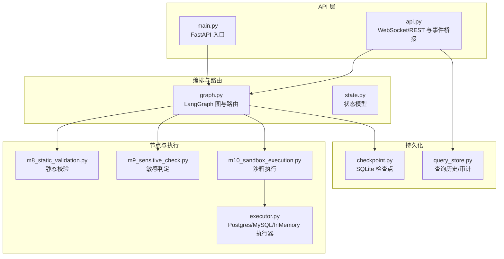
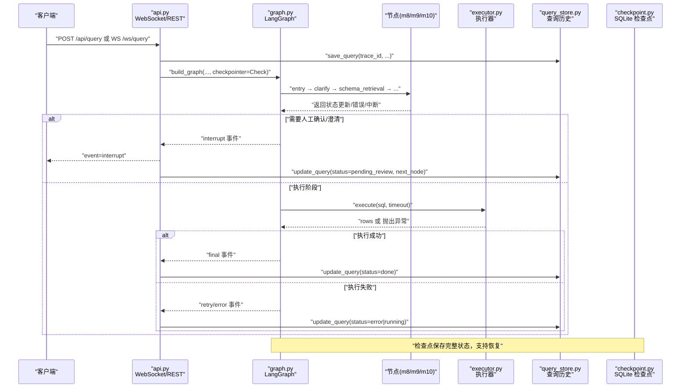
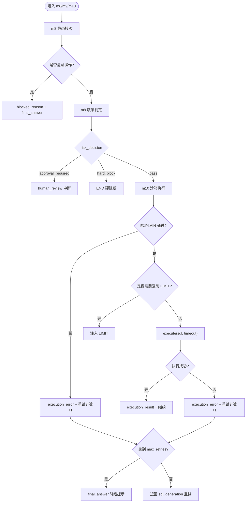
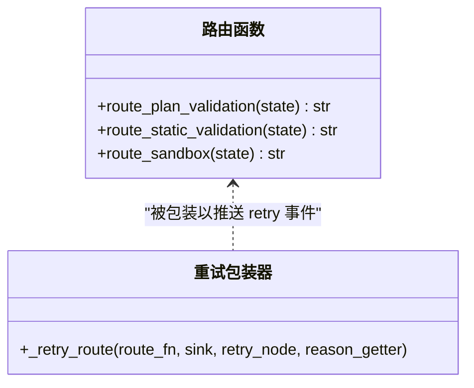
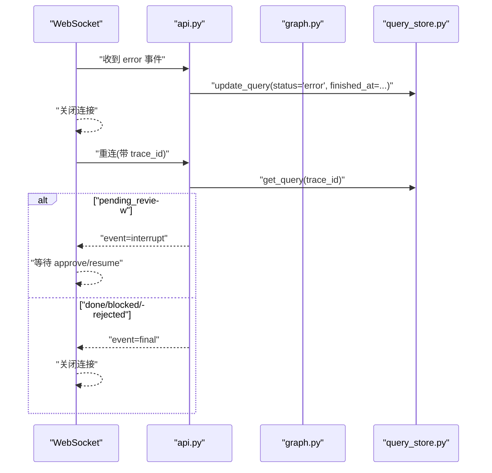
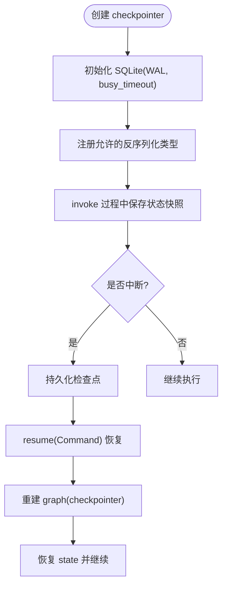
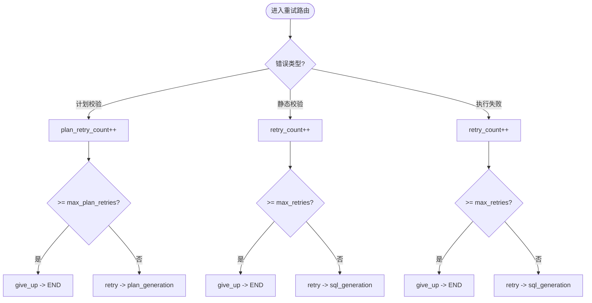
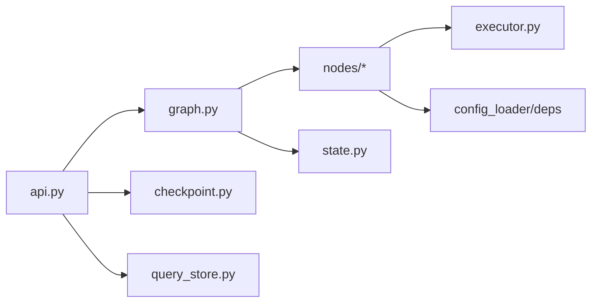

# 错误处理与恢复

<cite>
**本文引用的文件**   
- [nl2sql_agent/main.py](file://nl2sql_agent/main.py)
- [nl2sql_agent/api.py](file://nl2sql_agent/api.py)
- [nl2sql_agent/graph.py](file://nl2sql_agent/graph.py)
- [nl2sql_agent/state.py](file://nl2sql_agent/state.py)
- [nl2sql_agent/services/checkpoint.py](file://nl2sql_agent/services/checkpoint.py)
- [nl2sql_agent/services/executor.py](file://nl2sql_agent/services/executor.py)
- [nl2sql_agent/services/query_store.py](file://nl2sql_agent/services/query_store.py)
- [nl2sql_agent/nodes/m8_static_validation.py](file://nl2sql_agent/nodes/m8_static_validation.py)
- [nl2sql_agent/nodes/m9_sensitive_check.py](file://nl2sql_agent/nodes/m9_sensitive_check.py)
- [nl2sql_agent/nodes/m10_sandbox_execution.py](file://nl2sql_agent/nodes/m10_sandbox_execution.py)
- [NL2SQL.md](file://NL2SQL.md)
</cite>

## 目录
1. [引言](#引言)
2. [项目结构](#项目结构)
3. [核心组件](#核心组件)
4. [架构总览](#架构总览)
5. [详细组件分析](#详细组件分析)
6. [依赖关系分析](#依赖关系分析)
7. [性能考量](#性能考量)
8. [故障排查指南](#故障排查指南)
9. [结论](#结论)
10. [附录](#附录)

## 引言
本文件面向 NL2SQL 系统的“错误处理与恢复机制”，系统性说明节点级、路由级与全局级的错误处理策略；阐述重试机制（次数限制、退避策略、失败条件判断）；文档化检查点机制（状态保存、恢复策略、一致性保证）；并给出错误日志记录、监控告警与故障诊断方法，以及常见错误场景的处理方案与预防措施。目标是帮助读者在不深入代码细节的情况下，也能理解系统如何稳健地处理异常、自动恢复与人工介入。

## 项目结构
围绕错误处理与恢复，关键模块分布如下：
- 入口与 API 层：HTTP/WebSocket 入口、事件桥接、持久化落库、审批与恢复接口
- 图编排与路由：LangGraph 流程编排、条件路由、重试包装器、中断点配置
- 节点实现：静态校验、敏感判定、沙箱执行等关键节点的错误处理逻辑
- 执行器：只读执行、超时控制、EXPLAIN 预估行数
- 检查点与存储：SQLite 检查点持久化、查询历史与审计存储

图表来源
- [nl2sql_agent/main.py:1-152](file://nl2sql_agent/main.py#L1-L152)
- [nl2sql_agent/api.py:1-573](file://nl2sql_agent/api.py#L1-L573)
- [nl2sql_agent/graph.py:1-313](file://nl2sql_agent/graph.py#L1-L313)
- [nl2sql_agent/state.py:1-146](file://nl2sql_agent/state.py#L1-L146)
- [nl2sql_agent/services/checkpoint.py:1-40](file://nl2sql_agent/services/checkpoint.py#L1-L40)
- [nl2sql_agent/services/executor.py:1-205](file://nl2sql_agent/services/executor.py#L1-L205)
- [nl2sql_agent/services/query_store.py:1-214](file://nl2sql_agent/services/query_store.py#L1-L214)

章节来源
- [NL2SQL.md:1-76](file://NL2SQL.md#L1-L76)

## 核心组件
- 全局错误处理（API 层）
  - WebSocket/REST 调用图执行时，统一捕获异常，推送 error 事件并落库为 error 状态，确保前端可感知且可恢复。
- 路由级错误处理（图编排）
  - 通过条件路由函数决定 retry/give_up/blocked/pass，结合 _retry_route 包装器推送 retry 事件，避免整条链路重跑。
- 节点级错误处理（具体节点）
  - 静态校验：区分危险操作（硬阻断不重试）与非危险错误（带错误信息退回 SQL 生成重试）。
  - 敏感判定：三态决策 pass/approval_required/hard_block，hard_block 直接结束。
  - 沙箱执行：EXPLAIN 守门、强制 LIMIT、超时熔断；执行报错或空结果按策略回退或继续。
- 检查点与恢复
  - SQLite 检查点持久化完整图状态，支持服务重启后恢复中断线程（如 human_review、clarify_*）。
- 持久化与审计
  - 查询历史表记录 trace_id、状态、SQL、计划、执行结果、重试计数、风险决策等，支撑历史页、审计页与恢复。

章节来源
- [nl2sql_agent/api.py:134-157](file://nl2sql_agent/api.py#L134-L157)
- [nl2sql_agent/graph.py:106-170](file://nl2sql_agent/graph.py#L106-L170)
- [nl2sql_agent/nodes/m8_static_validation.py:22-56](file://nl2sql_agent/nodes/m8_static_validation.py#L22-L56)
- [nl2sql_agent/nodes/m9_sensitive_check.py:19-106](file://nl2sql_agent/nodes/m9_sensitive_check.py#L19-L106)
- [nl2sql_agent/nodes/m10_sandbox_execution.py:20-65](file://nl2sql_agent/nodes/m10_sandbox_execution.py#L20-L65)
- [nl2sql_agent/services/checkpoint.py:1-40](file://nl2sql_agent/services/checkpoint.py#L1-L40)
- [nl2sql_agent/services/query_store.py:31-91](file://nl2sql_agent/services/query_store.py#L31-L91)

## 架构总览
下图展示从请求到执行的端到端错误处理与恢复路径，包括事件流、中断恢复与持久化。

图表来源
- [nl2sql_agent/api.py:134-157](file://nl2sql_agent/api.py#L134-L157)
- [nl2sql_agent/graph.py:174-313](file://nl2sql_agent/graph.py#L174-L313)
- [nl2sql_agent/services/executor.py:148-159](file://nl2sql_agent/services/executor.py#L148-L159)
- [nl2sql_agent/services/query_store.py:99-134](file://nl2sql_agent/services/query_store.py#L99-L134)
- [nl2sql_agent/services/checkpoint.py:32-40](file://nl2sql_agent/services/checkpoint.py#L32-L40)

## 详细组件分析

### 节点级错误处理
- 静态校验（m8）
  - 语法与方言合法性检查；危险操作（DROP/DELETE/UPDATE/TRUNCATE）直接 hard_block，不进入重试；字段幻觉、未引用表、data_scope 误用等错误会累积并退回 SQL 生成重试；行级权限注入缺失将 blocked。
- 敏感判定（m9）
  - 基于规则三态决策：pass/approval_required/hard_block；命中敏感字段、EXPLAIN 预估扫描过大、金额汇总导出触发人工确认或硬阻断。
- 沙箱执行（m10）
  - EXPLAIN 预估行数超过阈值拒绝执行；未聚合查询强制 LIMIT；执行超时视为 execution_error；执行报错携带错误文本退回 SQL 生成重试；空结果为合法业务结果，直接进入结果解释。

图表来源
- [nl2sql_agent/nodes/m8_static_validation.py:22-56](file://nl2sql_agent/nodes/m8_static_validation.py#L22-L56)
- [nl2sql_agent/nodes/m9_sensitive_check.py:19-106](file://nl2sql_agent/nodes/m9_sensitive_check.py#L19-L106)
- [nl2sql_agent/nodes/m10_sandbox_execution.py:20-65](file://nl2sql_agent/nodes/m10_sandbox_execution.py#L20-L65)

章节来源
- [nl2sql_agent/nodes/m8_static_validation.py:1-153](file://nl2sql_agent/nodes/m8_static_validation.py#L1-L153)
- [nl2sql_agent/nodes/m9_sensitive_check.py:1-106](file://nl2sql_agent/nodes/m9_sensitive_check.py#L1-L106)
- [nl2sql_agent/nodes/m10_sandbox_execution.py:1-65](file://nl2sql_agent/nodes/m10_sandbox_execution.py#L1-L65)

### 路由级错误处理
- 条件路由函数
  - route_plan_validation：计划校验失败在 plan_generation 内部打转，上限 max_plan_retries。
  - route_static_validation：非危险错误退回 sql_generation 重试，上限 max_retries；危险操作直接 blocked。
  - route_sandbox：执行报错/空结果退回 sql_generation 重试，上限 max_retries。
- 重试包装器 _retry_route
  - 在决定 retry 时推送 retry 事件（attempt + reason），便于前端展示与监控。

图表来源
- [nl2sql_agent/graph.py:138-170](file://nl2sql_agent/graph.py#L138-L170)
- [nl2sql_agent/graph.py:106-126](file://nl2sql_agent/graph.py#L106-L126)

章节来源
- [nl2sql_agent/graph.py:128-170](file://nl2sql_agent/graph.py#L128-L170)

### 全局错误处理
- API 层统一捕获
  - _run_query 中 try/except 捕获所有异常，推送 event="error"，并落库 status="error"；finally 推送 done 事件，确保连接关闭。
- REST/WS 恢复
  - WS 断线重连：根据 trace_id 恢复当前状态（pending_review/done/blocked/rejected），避免重复发起查询。
  - approve/resume 接口：使用 Command(resume=...) 恢复中断线程，重新构建图并 invoke。

图表来源
- [nl2sql_agent/api.py:134-157](file://nl2sql_agent/api.py#L134-L157)
- [nl2sql_agent/api.py:161-211](file://nl2sql_agent/api.py#L161-L211)
- [nl2sql_agent/api.py:280-354](file://nl2sql_agent/api.py#L280-L354)

章节来源
- [nl2sql_agent/api.py:134-157](file://nl2sql_agent/api.py#L134-L157)
- [nl2sql_agent/api.py:161-211](file://nl2sql_agent/api.py#L161-L211)
- [nl2sql_agent/api.py:280-354](file://nl2sql_agent/api.py#L280-L354)

### 检查点机制（状态保存、恢复策略、一致性保证）
- 保存策略
  - 使用 SqliteSaver + JsonPlusSerializer，注册 NL2SQLState 及相关类型，确保跨进程共享与反序列化安全。
  - PRAGMA journal_mode=WAL、busy_timeout 提升并发与稳定性。
- 恢复策略
  - 中断点配置 interrupt_before=["human_review", "clarify_candidates", "clarify_low_confidence"]，支持 resume 恢复。
  - 服务重启后，重建 checkpointer 与 graph，使用相同 thread_id 恢复状态。
- 一致性保证
  - 查询历史表与检查点分离：历史表用于展示与审计，检查点用于恢复中断现场；两者通过 trace_id 关联。

图表来源
- [nl2sql_agent/services/checkpoint.py:16-40](file://nl2sql_agent/services/checkpoint.py#L16-L40)
- [nl2sql_agent/graph.py:296-313](file://nl2sql_agent/graph.py#L296-L313)

章节来源
- [nl2sql_agent/services/checkpoint.py:1-40](file://nl2sql_agent/services/checkpoint.py#L1-L40)
- [nl2sql_agent/graph.py:296-313](file://nl2sql_agent/graph.py#L296-L313)

### 重试机制详解
- 次数限制
  - 计划重试：max_plan_retries（默认 2），仅在 plan_generation 内部循环。
  - SQL 重试：max_retries（默认 3），在 static_validation/sandbox_execution 失败时退回 sql_generation。
- 退避策略
  - 当前实现为立即重试（无指数退避），可通过扩展 _retry_route 增加 delay。
- 失败条件判断
  - 计划校验失败：plan_validation_errors 非空。
  - 静态校验失败：validation_errors 非空且非危险操作。
  - 执行失败：execution_error 非空或空结果（空结果为合法，不触发重试）。

图表来源
- [nl2sql_agent/graph.py:138-170](file://nl2sql_agent/graph.py#L138-L170)

章节来源
- [nl2sql_agent/graph.py:138-170](file://nl2sql_agent/graph.py#L138-L170)

### 错误日志记录、监控告警与故障诊断
- 日志记录
  - 节点延迟与步骤：node_latencies、trace_steps 由 _traced 包装器写入 state。
  - 事件推送：node_start/node_complete/retry/interrupt/final/error/done 通过 event_sink 推送。
- 监控告警
  - 前端可监听 error 事件与 give_up 状态，触发告警；pending_review 队列可用于人工干预。
- 故障诊断
  - 通过 /api/history 与 /api/audit/{trace_id} 查看 trace、重试计数、风险决策、执行错误等；WS 断线重连可恢复当前阶段。

章节来源
- [nl2sql_agent/graph.py:88-104](file://nl2sql_agent/graph.py#L88-L104)
- [nl2sql_agent/api.py:356-391](file://nl2sql_agent/api.py#L356-L391)

## 依赖关系分析
- 组件耦合
  - api.py 依赖 graph.py、checkpoint.py、query_store.py；graph.py 依赖 nodes 与 state；nodes 依赖 executor.py 与 config。
- 外部依赖
  - Postgres/MySQL 执行器、sqlglot、sqlite3、pydantic、langgraph。
- 潜在循环依赖
  - 通过模块化与依赖注入避免循环；graph 仅依赖 deps 抽象。

图表来源
- [nl2sql_agent/api.py:1-573](file://nl2sql_agent/api.py#L1-L573)
- [nl2sql_agent/graph.py:1-313](file://nl2sql_agent/graph.py#L1-L313)
- [nl2sql_agent/services/executor.py:1-205](file://nl2sql_agent/services/executor.py#L1-L205)

章节来源
- [nl2sql_agent/api.py:1-573](file://nl2sql_agent/api.py#L1-L573)
- [nl2sql_agent/graph.py:1-313](file://nl2sql_agent/graph.py#L1-L313)

## 性能考量
- 事件推送失败不影响流程执行（_emit 捕获异常），保障主流程稳定。
- 执行器超时与 EXPLAIN 预估行数限制，防止长尾查询与资源占用。
- 检查点 WAL 模式与 busy_timeout 提升并发写入稳定性。
- 建议扩展重试退避策略（指数退避）以降低瞬时抖动影响。

[本节为通用指导，无需特定文件来源]

## 故障排查指南
- 常见问题
  - 字段幻觉：m8 静态校验拦截并退回 SQL 生成重试；检查 retrieved_schema 与 used_tables 一致性。
  - 危险操作：m8 直接 blocked，需调整 prompt 或规则。
  - 敏感判定：m9 三态决策，hard_block 需调整规则或用户授权。
  - 执行失败：m10 报错文本用于重试；空结果为合法，不应重试。
- 诊断步骤
  - 查看 /api/audit/{trace_id} 获取 trace_steps、node_latencies、retry_count、execution_error。
  - WS 断线重连恢复当前阶段；approve/resume 接口恢复中断。
  - 检查 checkpoint.db 与 nl2sql.db 完整性。

章节来源
- [nl2sql_agent/nodes/m8_static_validation.py:22-56](file://nl2sql_agent/nodes/m8_static_validation.py#L22-L56)
- [nl2sql_agent/nodes/m9_sensitive_check.py:19-106](file://nl2sql_agent/nodes/m9_sensitive_check.py#L19-L106)
- [nl2sql_agent/nodes/m10_sandbox_execution.py:20-65](file://nl2sql_agent/nodes/m10_sandbox_execution.py#L20-L65)
- [nl2sql_agent/api.py:356-391](file://nl2sql_agent/api.py#L356-L391)

## 结论
NL2SQL 系统在错误处理与恢复方面采用分层策略：节点级精准定位错误、路由级局部重试与边界控制、全局级统一捕获与持久化。检查点机制确保中断后可恢复，执行器与静态校验提供强约束与安全保障。通过事件流与历史审计，系统具备良好的可观测性与可诊断性。建议后续引入退避策略与更细粒度的监控告警，进一步提升鲁棒性。

[本节为总结，无需特定文件来源]

## 附录
- 术语与状态字段参考
  - NL2SQLState 包含 user_query、retrieved_schema、generated_sql、validation_errors、execution_error、risk_decision、retry_count、plan_retry_count、blocked_reason、trace_id 等关键字段。
- 流程图与序列图均映射至实际源码，便于进一步定位与扩展。

章节来源
- [nl2sql_agent/state.py:83-146](file://nl2sql_agent/state.py#L83-L146)