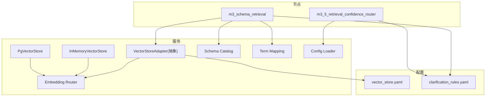
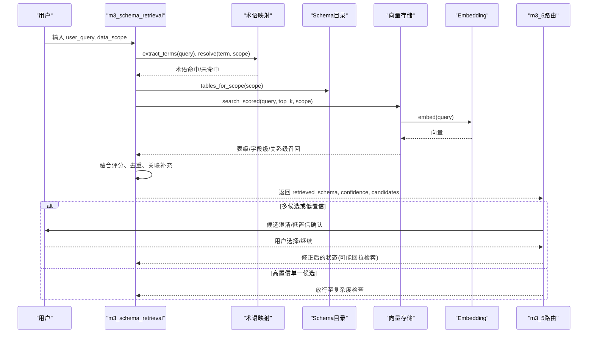
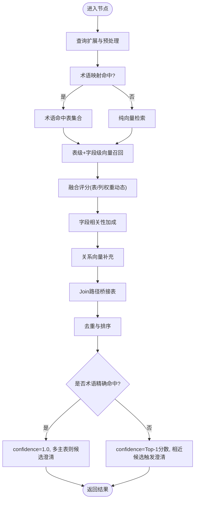
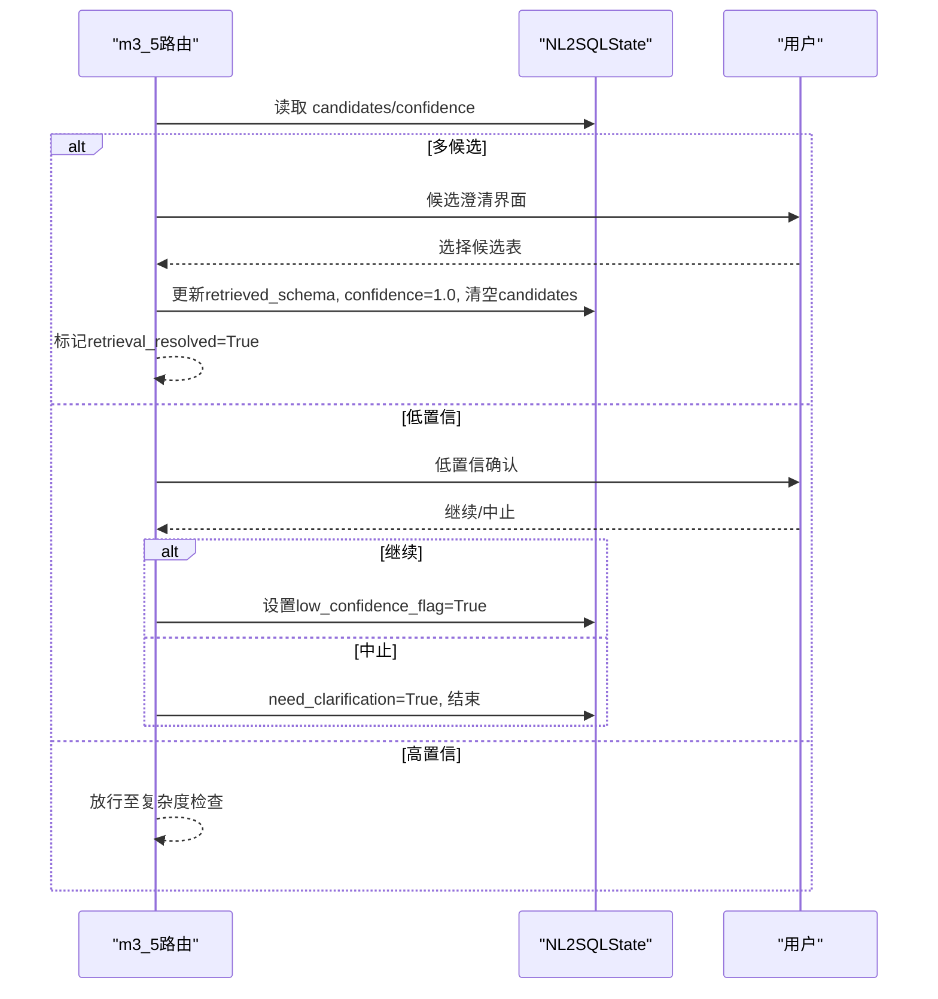
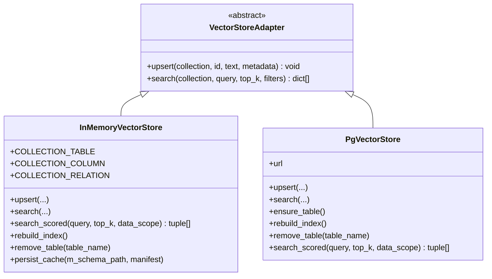
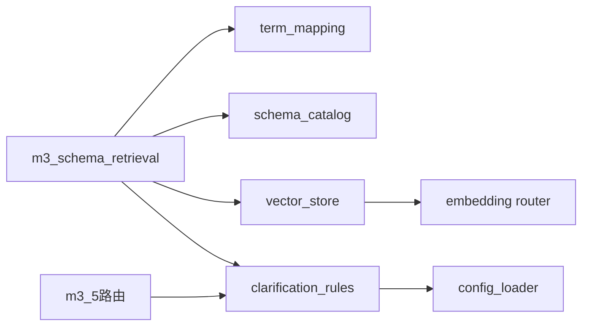

# Schema检索

<cite>
**本文引用的文件**   
- [m3_schema_retrieval.py](file://nl2sql_agent/nodes/m3_schema_retrieval.py)
- [m3_5_retrieval_confidence_router.py](file://nl2sql_agent/nodes/m3_5_retrieval_confidence_router.py)
- [base.py](file://nl2sql_agent/services/vector_store/base.py)
- [memory.py](file://nl2sql_agent/services/vector_store/memory.py)
- [pg.py](file://nl2sql_agent/services/vector_store/pg.py)
- [router.py](file://nl2sql_agent/services/embedding/router.py)
- [vector_store.yaml](file://nl2sql_agent/config/vector_store.yaml)
- [clarification_rules.yaml](file://nl2sql_agent/config/clarification_rules.yaml)
- [state.py](file://nl2sql_agent/state.py)
- [schema_catalog.py](file://nl2sql_agent/services/schema_catalog.py)
- [term_mapping.py](file://nl2sql_agent/services/term_mapping.py)
- [config_loader.py](file://nl2sql_agent/services/config_loader.py)
- [test_retrieval_confidence.py](file://nl2sql_agent/tests/test_retrieval_confidence.py)
- [test_vector_store.py](file://nl2sql_agent/tests/test_vector_store.py)
</cite>

## 目录
1. [简介](#简介)
2. [项目结构](#项目结构)
3. [核心组件](#核心组件)
4. [架构总览](#架构总览)
5. [详细组件分析](#详细组件分析)
6. [依赖关系分析](#依赖关系分析)
7. [性能考量与优化](#性能考量与优化)
8. [故障排查指南](#故障排查指南)
9. [结论](#结论)
10. [附录：配置与调优](#附录配置与调优)

## 简介
本文件为 NL2SQL 的 Schema 检索系统提供系统化文档，重点覆盖以下方面：
- 向量检索实现原理：文本向量化、相似度计算、候选表选择策略
- m3_schema_retrieval 节点处理流程：查询预处理、混合向量召回、结果排序与关联补充
- 置信度评估算法与 m3_5_retrieval_confidence_router 路由逻辑、阈值判断
- 向量存储后端抽象与具体实现（内存与 pgvector）
- 检索性能优化策略：索引构建、缓存机制、增量同步
- 配置示例与关键参数说明
- 常见问题与排障建议

## 项目结构
Schema 检索相关代码主要分布在 nodes、services/vector_store、services/embedding、services/schema_catalog、services/term_mapping 以及 config 目录下。整体采用“节点 + 服务 + 配置”的分层组织方式：
- nodes：工作流节点（如 m3_schema_retrieval、m3_5_retrieval_confidence_router）
- services：领域服务（向量存储、嵌入模型、目录与术语映射、配置加载）
- config：运行时可热更新的规则与后端选择配置

图表来源
- [m3_schema_retrieval.py:1-331](file://nl2sql_agent/nodes/m3_schema_retrieval.py#L1-L331)
- [m3_5_retrieval_confidence_router.py:1-127](file://nl2sql_agent/nodes/m3_5_retrieval_confidence_router.py#L1-L127)
- [base.py:1-21](file://nl2sql_agent/services/vector_store/base.py#L1-L21)
- [memory.py:1-197](file://nl2sql_agent/services/vector_store/memory.py#L1-L197)
- [pg.py:1-174](file://nl2sql_agent/services/vector_store/pg.py#L1-L174)
- [router.py:1-81](file://nl2sql_agent/services/embedding/router.py#L1-L81)
- [vector_store.yaml:1-6](file://nl2sql_agent/config/vector_store.yaml#L1-L6)
- [clarification_rules.yaml:1-62](file://nl2sql_agent/config/clarification_rules.yaml#L1-L62)

章节来源
- [m3_schema_retrieval.py:1-331](file://nl2sql_agent/nodes/m3_schema_retrieval.py#L1-L331)
- [m3_5_retrieval_confidence_router.py:1-127](file://nl2sql_agent/nodes/m3_5_retrieval_confidence_router.py#L1-L127)
- [base.py:1-21](file://nl2sql_agent/services/vector_store/base.py#L1-L21)
- [memory.py:1-197](file://nl2sql_agent/services/vector_store/memory.py#L1-L197)
- [pg.py:1-174](file://nl2sql_agent/services/vector_store/pg.py#L1-L174)
- [router.py:1-81](file://nl2sql_agent/services/embedding/router.py#L1-L81)
- [vector_store.yaml:1-6](file://nl2sql_agent/config/vector_store.yaml#L1-L6)
- [clarification_rules.yaml:1-62](file://nl2sql_agent/config/clarification_rules.yaml#L1-L62)

## 核心组件
- 向量存储抽象接口：定义 upsert/search 等统一方法，屏蔽后端差异
- 内存向量存储：基于本地字典与余弦相似度，支持 search_scored 与缓存持久化
- pgvector 向量存储：基于 PostgreSQL 的 vector 类型与 SQL 检索
- Embedding 适配层：按 provider 选择本地 sentence-transformers 或测试用 fake 词袋
- Schema 目录与术语映射：按 data_scope 过滤表结构，术语解析命中字段并回推表
- 检索节点与置信度路由：混合召回、融合评分、候选澄清与低置信处理

章节来源
- [base.py:1-21](file://nl2sql_agent/services/vector_store/base.py#L1-L21)
- [memory.py:1-197](file://nl2sql_agent/services/vector_store/memory.py#L1-L197)
- [pg.py:1-174](file://nl2sql_agent/services/vector_store/pg.py#L1-L174)
- [router.py:1-81](file://nl2sql_agent/services/embedding/router.py#L1-L81)
- [schema_catalog.py:1-126](file://nl2sql_agent/services/schema_catalog.py#L1-L126)
- [term_mapping.py:1-45](file://nl2sql_agent/services/term_mapping.py#L1-L45)
- [m3_schema_retrieval.py:1-331](file://nl2sql_agent/nodes/m3_schema_retrieval.py#L1-L331)
- [m3_5_retrieval_confidence_router.py:1-127](file://nl2sql_agent/nodes/m3_5_retrieval_confidence_router.py#L1-L127)

## 架构总览
下图展示从用户查询到 Schema 检索与置信度路由的关键路径，以及向量存储与嵌入模型的交互。

图表来源
- [m3_schema_retrieval.py:230-331](file://nl2sql_agent/nodes/m3_schema_retrieval.py#L230-L331)
- [m3_5_retrieval_confidence_router.py:26-37](file://nl2sql_agent/nodes/m3_5_retrieval_confidence_router.py#L26-L37)
- [memory.py:172-197](file://nl2sql_agent/services/vector_store/memory.py#L172-L197)
- [pg.py:139-174](file://nl2sql_agent/services/vector_store/pg.py#L139-L174)
- [router.py:34-61](file://nl2sql_agent/services/embedding/router.py#L34-L61)

## 详细组件分析

### m3_schema_retrieval 节点（混合检索与结果排序）
- 查询预处理：
  - 术语扩展：根据 clarification_rules 中的 query_expansions 进行同义扩展
  - 业务线过滤：依据 state.data_scope 限制检索范围
- 三层召回：
  - 术语映射优先：按 data_scope 命名空间→全局兜底，精确命中直接提升置信度
  - 表级+字段级向量并行召回：分别对 schema_table 与 schema_column 集合检索，再融合评分
  - 关系向量补充：仅补充与主候选直接相连且可见的关系表，避免无约束扩散
- 结果排序与补充：
  - 融合权重随查询类型动态调整（字段型问题提高 column 权重）
  - 字段相关性加成：剩余词与表字段名/注释重叠次数作为加分项
  - Join 路径桥接：在语义候选之间寻找最短 FK 路径，只返回必需桥接表
- 输出：
  - retrieved_schema：最终命中的表集合（含主表与补充关联表）
  - retrieval_confidence：术语精确命中为 1.0；向量兜底取 Top-1 分数
  - retrieval_candidates：Top-N 中接近最佳分数的候选，供 3.5 路由判断

图表来源
- [m3_schema_retrieval.py:64-71](file://nl2sql_agent/nodes/m3_schema_retrieval.py#L64-L71)
- [m3_schema_retrieval.py:97-128](file://nl2sql_agent/nodes/m3_schema_retrieval.py#L97-L128)
- [m3_schema_retrieval.py:131-154](file://nl2sql_agent/nodes/m3_schema_retrieval.py#L131-L154)
- [m3_schema_retrieval.py:157-207](file://nl2sql_agent/nodes/m3_schema_retrieval.py#L157-L207)
- [m3_schema_retrieval.py:210-228](file://nl2sql_agent/nodes/m3_schema_retrieval.py#L210-L228)
- [m3_schema_retrieval.py:230-331](file://nl2sql_agent/nodes/m3_schema_retrieval.py#L230-L331)

章节来源
- [m3_schema_retrieval.py:1-331](file://nl2sql_agent/nodes/m3_schema_retrieval.py#L1-L331)
- [clarification_rules.yaml:27-62](file://nl2sql_agent/config/clarification_rules.yaml#L27-L62)

### m3_5_retrieval_confidence_router（置信度路由与澄清）
- 路由逻辑：
  - 若 retrieval_candidates 数量 > 1 → clarify_candidates（候选澄清）
  - 若 retrieval_confidence < confidence_threshold → clarify_low_confidence（低置信确认）
  - 否则 → complexity_check（放行）
- 候选澄清：
  - 展示候选表与业务术语，用户选定后收窄 retrieved_schema，confidence 拉高至 1.0，清空候选，标记已解决
- 低置信澄清：
  - 提示指标不在已知范围，用户可选择继续；继续则设置 low_confidence_flag，后续强制计划路径与人工确认

图表来源
- [m3_5_retrieval_confidence_router.py:26-37](file://nl2sql_agent/nodes/m3_5_retrieval_confidence_router.py#L26-L37)
- [m3_5_retrieval_confidence_router.py:40-92](file://nl2sql_agent/nodes/m3_5_retrieval_confidence_router.py#L40-L92)
- [m3_5_retrieval_confidence_router.py:95-127](file://nl2sql_agent/nodes/m3_5_retrieval_confidence_router.py#L95-L127)
- [state.py:83-103](file://nl2sql_agent/state.py#L83-L103)

章节来源
- [m3_5_retrieval_confidence_router.py:1-127](file://nl2sql_agent/nodes/m3_5_retrieval_confidence_router.py#L1-L127)
- [state.py:83-103](file://nl2sql_agent/state.py#L83-L103)

### 向量存储后端抽象与实现
- 抽象接口 VectorStoreAdapter：
  - upsert(collection, id, text, metadata)：写入一条向量（内部调用 embedding）
  - search(collection, query, top_k, filters)：语义相似度检索，返回带 score 的结果
- InMemoryVectorStore：
  - 使用本地 dict 存储 embedding、text、metadata
  - 余弦相似度计算，支持 business_line 过滤
  - search_scored：按 data_scope 过滤表，返回 [(SchemaHit, score)]
  - 缓存机制：基于 manifest 的 semantic_hash 与 embedding_signature 校验，持久化 vector-cache.json
  - 重建与增量：rebuild_index() 全量重建；remove_table() 删除单表条目；prepare_incremental() 恢复快照
- PgVectorStore：
  - 基于 psycopg 连接 PostgreSQL，使用 vector 类型与 <=> 距离算子
  - ensure_table() 建表（维度来自模型配置）
  - rebuild_index() 优先从 effective M-Schema 恢复；search_scored() 通过 SQL 批量检索

图表来源
- [base.py:11-21](file://nl2sql_agent/services/vector_store/base.py#L11-L21)
- [memory.py:21-197](file://nl2sql_agent/services/vector_store/memory.py#L21-L197)
- [pg.py:15-174](file://nl2sql_agent/services/vector_store/pg.py#L15-L174)

章节来源
- [base.py:1-21](file://nl2sql_agent/services/vector_store/base.py#L1-L21)
- [memory.py:1-197](file://nl2sql_agent/services/vector_store/memory.py#L1-L197)
- [pg.py:1-174](file://nl2sql_agent/services/vector_store/pg.py#L1-L174)

### 文本向量化与相似度计算
- Embedding 适配层：
  - provider=local：使用 sentence-transformers，支持 model_path 或 huggingface 模型名
  - provider=fake：确定性词袋向量（中文二元组哈希到固定桶），用于测试
- 相似度计算：
  - 内存实现：余弦相似度，score ∈ [0,1]
  - pgvector 实现：1 - (embedding <=> query)/2，等价于余弦相似度归一化

章节来源
- [router.py:34-61](file://nl2sql_agent/services/embedding/router.py#L34-L61)
- [memory.py:17-18](file://nl2sql_agent/services/vector_store/memory.py#L17-L18)
- [pg.py:46-65](file://nl2sql_agent/services/vector_store/pg.py#L46-L65)

### 候选表选择策略
- 术语精确命中：confidence=1.0，多主表时进入候选澄清
- 向量兜底：confidence=Top-1 分数；若 Top-2 差距小于 candidate_gap_threshold 或相对差距小于 candidate_gap_ratio，视为相近候选，进入候选澄清
- 融合权重：字段型问题提高 column 权重，主题型问题保留 table 权重
- 关联补充：关系向量与 Join 路径桥接，确保多表 join 场景不缺失必要表

章节来源
- [m3_schema_retrieval.py:36-41](file://nl2sql_agent/nodes/m3_schema_retrieval.py#L36-L41)
- [m3_schema_retrieval.py:53-61](file://nl2sql_agent/nodes/m3_schema_retrieval.py#L53-L61)
- [m3_schema_retrieval.py:230-331](file://nl2sql_agent/nodes/m3_schema_retrieval.py#L230-L331)
- [clarification_rules.yaml:27-62](file://nl2sql_agent/config/clarification_rules.yaml#L27-L62)

## 依赖关系分析
- 节点与服务耦合：
  - m3_schema_retrieval 依赖 term_mapping、schema_catalog、vector_store、clarification_rules
  - m3_5 路由依赖 clarification_rules 与 state
- 向量存储与嵌入：
  - 所有向量存储实现依赖 embedding router 获取 embed 函数
- 配置热更新：
  - 所有 YAML 配置通过 ConfigLoader 加载，支持 mtime 热重载

图表来源
- [m3_schema_retrieval.py:230-331](file://nl2sql_agent/nodes/m3_schema_retrieval.py#L230-L331)
- [m3_5_retrieval_confidence_router.py:26-37](file://nl2sql_agent/nodes/m3_5_retrieval_confidence_router.py#L26-L37)
- [memory.py:172-197](file://nl2sql_agent/services/vector_store/memory.py#L172-L197)
- [pg.py:139-174](file://nl2sql_agent/services/vector_store/pg.py#L139-L174)
- [config_loader.py:14-36](file://nl2sql_agent/services/config_loader.py#L14-L36)

章节来源
- [m3_schema_retrieval.py:1-331](file://nl2sql_agent/nodes/m3_schema_retrieval.py#L1-L331)
- [m3_5_retrieval_confidence_router.py:1-127](file://nl2sql_agent/nodes/m3_5_retrieval_confidence_router.py#L1-L127)
- [config_loader.py:1-36](file://nl2sql_agent/services/config_loader.py#L1-L36)

## 性能考量与优化
- 索引构建与缓存：
  - 内存实现：首次检索触发 _ensure_indexed()，从 M-Schema 生成向量并持久化为 vector-cache.json；重启后若 semantic_hash 与 embedding_signature 一致则直接加载
  - pgvector：rebuild_index() 优先从 M-Schema 恢复，避免重复计算
- 增量同步：
  - remove_table() 清理单表的表级、字段级、关系级向量条目
  - prepare_incremental() 恢复上一快照后再增量重算变化表
- 检索优化：
  - search_scored() 按 data_scope 过滤表列表，减少无关检索
  - 字段级检索 top_k*3 后按表聚合最高分，降低噪声
- 模型切换：
  - 切换 embedding 模型后需调用 rebuild_index() 重建索引

章节来源
- [memory.py:69-120](file://nl2sql_agent/services/vector_store/memory.py#L69-L120)
- [memory.py:121-138](file://nl2sql_agent/services/vector_store/memory.py#L121-L138)
- [memory.py:139-171](file://nl2sql_agent/services/vector_store/memory.py#L139-L171)
- [pg.py:81-118](file://nl2sql_agent/services/vector_store/pg.py#L81-L118)
- [pg.py:139-174](file://nl2sql_agent/services/vector_store/pg.py#L139-L174)

## 故障排查指南
- 向量检索无结果或置信度异常：
  - 检查 data_scope 是否正确注入
  - 确认 vector-store 后端配置（backend: memory/pgvector）
  - 验证 embedding 模型加载（provider/local/fake）与模型路径
- 多候选频繁触发澄清：
  - 调整 candidate_gap_threshold 或 candidate_gap_ratio
  - 检查术语映射是否完善，必要时补充 alias 或定义
- 低置信持续出现：
  - 检查 clarification_rules 中 confidence_threshold
  - 扩大 query_expansions 以增强召回
- 索引重建失败：
  - 确认 M-Schema 路径有效，manifest 包含 semantic_hash
  - 切换模型后务必执行 rebuild_index()

章节来源
- [vector_store.yaml:1-6](file://nl2sql_agent/config/vector_store.yaml#L1-L6)
- [router.py:34-61](file://nl2sql_agent/services/embedding/router.py#L34-L61)
- [clarification_rules.yaml:27-62](file://nl2sql_agent/config/clarification_rules.yaml#L27-L62)
- [memory.py:166-171](file://nl2sql_agent/services/vector_store/memory.py#L166-L171)
- [pg.py:81-118](file://nl2sql_agent/services/vector_store/pg.py#L81-L118)

## 结论
本 Schema 检索系统通过“术语映射 + 混合向量召回 + 关系补充”的多层策略，在保证准确率的同时兼顾召回完整性。置信度路由将“是否澄清”的判断从术语库收录转向检索后的置信度分布，提升了系统的鲁棒性与可解释性。向量存储抽象使后端可插拔，配合缓存与增量同步机制，满足生产环境的性能与稳定性要求。

## 附录：配置与调优
- 向量存储后端选择：
  - backend: memory/pgvector
  - pgvector.url: ${PGVECTOR_URL}
- 澄清规则（clarification_rules.yaml）：
  - retrieval_confidence.confidence_threshold：低置信阈值
  - retrieval_confidence.candidate_gap_threshold / candidate_gap_ratio：候选相近判定
  - retrieval_confidence.supplement_top_n / supplement_threshold / supplement_relative_threshold：关联补充策略
  - retrieval_confidence.table_vector_weight / column_vector_weight：融合权重
  - retrieval_confidence.field_query_markers / field_query_table_weight / field_query_column_weight：字段型问题权重调整
  - retrieval_confidence.query_expansions：领域查询扩展
- 嵌入模型（model_config.yaml）：
  - embedding.provider: local/fake
  - embedding.model_path / embedding.model：模型路径或名称
  - embedding.dimension：向量维度（pgvector 建表使用）

章节来源
- [vector_store.yaml:1-6](file://nl2sql_agent/config/vector_store.yaml#L1-L6)
- [clarification_rules.yaml:1-62](file://nl2sql_agent/config/clarification_rules.yaml#L1-L62)
- [router.py:23-31](file://nl2sql_agent/services/embedding/router.py#L23-L31)