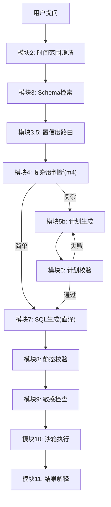
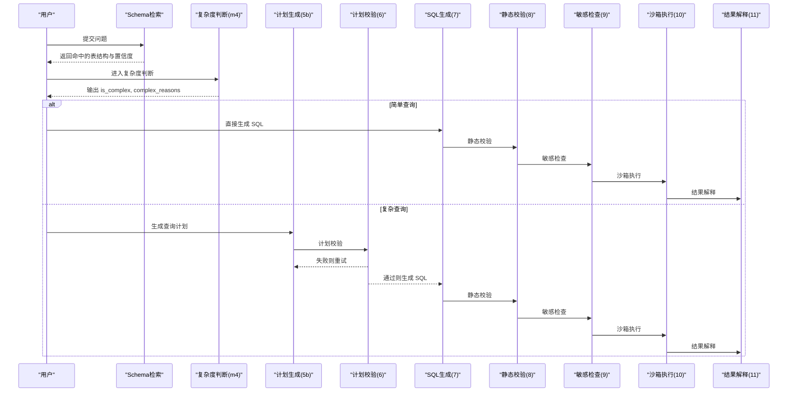
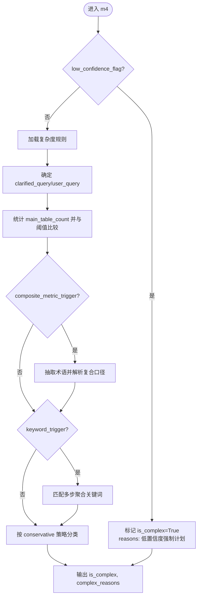
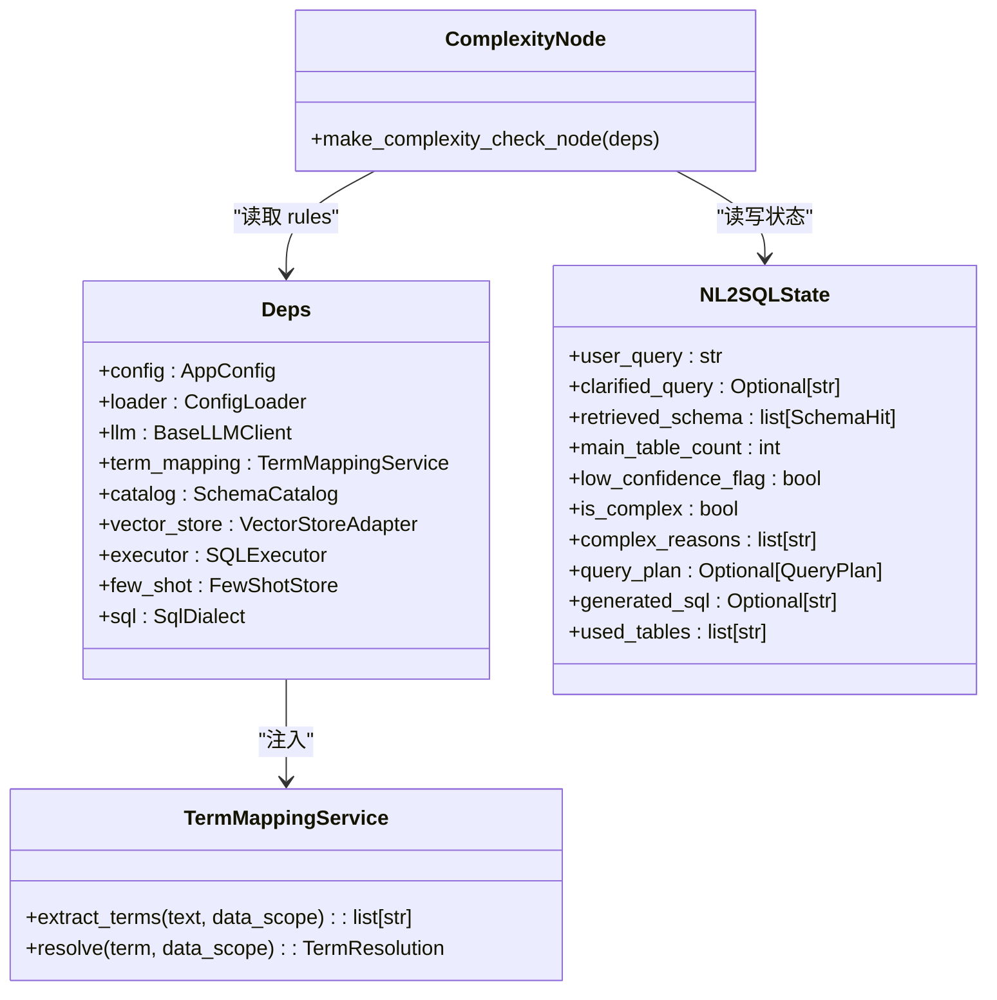

# 复杂度判断

<cite>
**本文引用的文件**   
- [m4_complexity_check.py](file://nl2sql_agent/nodes/m4_complexity_check.py)
- [complexity_rules.yaml](file://nl2sql_agent/config/complexity_rules.yaml)
- [state.py](file://nl2sql_agent/state.py)
- [graph.py](file://nl2sql_agent/graph.py)
- [term_mapping.py](file://nl2sql_agent/services/term_mapping.py)
- [deps.py](file://nl2sql_agent/services/deps.py)
- [m5b_plan_generation.py](file://nl2sql_agent/nodes/m5b_plan_generation.py)
- [m7_sql_generation.py](file://nl2sql_agent/nodes/m7_sql_generation.py)
- [test_routing.py](file://nl2sql_agent/tests/test_routing.py)
</cite>

## 目录
1. [简介](#简介)
2. [项目结构](#项目结构)
3. [核心组件](#核心组件)
4. [架构总览](#架构总览)
5. [详细组件分析](#详细组件分析)
6. [依赖关系分析](#依赖关系分析)
7. [性能与准确性优化](#性能与准确性优化)
8. [故障排查指南](#故障排查指南)
9. [结论](#结论)
10. [附录：配置与使用示例](#附录配置与使用示例)

## 简介
本文件面向 NL2SQL 查询复杂度判断系统，聚焦 m4_complexity_check 节点及其规则体系。内容涵盖：
- 复杂度评估算法：特征提取、指标计算与分类逻辑
- m4 节点处理流程：简单查询与复杂查询的区分标准
- 复杂度规则配置：权重与阈值设置方法
- 不同复杂度级别的处理策略：直接 SQL 生成 vs 计划生成
- 准确性优化方法与自定义规则配置
- 使用示例与性能调优建议

## 项目结构
与复杂度判断相关的代码与配置主要分布在以下位置：
- 节点实现：nl2sql_agent/nodes/m4_complexity_check.py
- 规则配置：nl2sql_agent/config/complexity_rules.yaml
- 状态模型：nl2sql_agent/state.py（包含 is_complex、complex_reasons 等字段）
- 图编排：nl2sql_agent/graph.py（定义模块 4 的路由分支）
- 术语映射服务：nl2sql_agent/services/term_mapping.py（复合口径指标判定）
- 依赖装配：nl2sql_agent/services/deps.py（加载 complexity_rules）
- 计划与 SQL 生成：nl2sql_agent/nodes/m5b_plan_generation.py、nl2sql_agent/nodes/m7_sql_generation.py
- 端到端路由测试：nl2sql_agent/tests/test_routing.py

图表来源
- [graph.py:174-294](file://nl2sql_agent/graph.py#L174-L294)

章节来源
- [graph.py:174-294](file://nl2sql_agent/graph.py#L174-L294)
- [state.py:83-146](file://nl2sql_agent/state.py#L83-L146)

## 核心组件
- 复杂度判断节点（m4）：纯确定性路由，不调用 LLM，依据规则输出 is_complex 与 complex_reasons
- 复杂度规则（complexity_rules.yaml）：保守策略，支持表数量阈值、复合口径指标触发、多步聚合关键词触发
- 术语映射服务（TermMappingService）：从自然语言中抽取术语并解析是否复合口径指标
- 状态模型（NL2SQLState）：承载 is_complex、complex_reasons、main_table_count、low_confidence_flag 等关键状态
- 图编排（graph.py）：根据 is_complex 决定走“简单路径”或“计划路径”

章节来源
- [m4_complexity_check.py:17-52](file://nl2sql_agent/nodes/m4_complexity_check.py#L17-L52)
- [complexity_rules.yaml:1-17](file://nl2sql_agent/config/complexity_rules.yaml#L1-L17)
- [term_mapping.py:39-144](file://nl2sql_agent/services/term_mapping.py#L39-L144)
- [state.py:83-146](file://nl2sql_agent/state.py#L83-L146)
- [graph.py:230-235](file://nl2sql_agent/graph.py#L230-L235)

## 架构总览
m4 节点位于 Schema 检索之后、SQL/计划分叉之前，承担“分流器”职责：
- 输入：clarified_query/user_query、data_scope、retrieved_schema、main_table_count、low_confidence_flag
- 输出：is_complex、complex_reasons
- 路由：
  - 简单路径：跳过计划生成，直接进入 SQL 生成（模块 7）
  - 复杂路径：进入计划生成（模块 5b），随后计划校验（模块 6），通过后进入 SQL 生成（模块 7）

图表来源
- [graph.py:230-294](file://nl2sql_agent/graph.py#L230-L294)
- [m4_complexity_check.py:17-52](file://nl2sql_agent/nodes/m4_complexity_check.py#L17-L52)
- [m5b_plan_generation.py:71-90](file://nl2sql_agent/nodes/m5b_plan_generation.py#L71-L90)
- [m7_sql_generation.py:94-113](file://nl2sql_agent/nodes/m7_sql_generation.py#L94-L113)

## 详细组件分析

### 复杂度判断节点（m4）
- 低置信度强制复杂：当 low_confidence_flag 为真时，直接标记 is_complex=True，避免误判导致业务逻辑错误
- 规则驱动的特征提取：
  - 表数量特征：基于 main_table_count（术语命中主表数，不含向量补充关联表）与 multi_table_threshold 比较
  - 复合口径指标：通过 TermMappingService 抽取术语并解析 composite_metric=true
  - 多步聚合关键词：匹配 multi_step_keywords 列表中的关键词
- 分类逻辑：
  - conservative=true：任一信号即判复杂
  - conservative=false：至少两条信号才判复杂
- 输出：is_complex 与 complex_reasons（用于调试与审计）

图表来源
- [m4_complexity_check.py:17-52](file://nl2sql_agent/nodes/m4_complexity_check.py#L17-L52)
- [term_mapping.py:100-128](file://nl2sql_agent/services/term_mapping.py#L100-L128)

章节来源
- [m4_complexity_check.py:17-52](file://nl2sql_agent/nodes/m4_complexity_check.py#L17-L52)
- [state.py:98-106](file://nl2sql_agent/state.py#L98-L106)

### 复杂度规则配置（complexity_rules.yaml）
- conservative：控制分类严格程度（true 表示任意一条命中即复杂）
- multi_table_threshold：表数量阈值（默认 2）
- composite_metric_trigger：是否启用复合口径指标触发（默认 true）
- multi_step_keywords：多步聚合语义关键词列表（同比、环比、累计、占比等）
- keyword_trigger：是否启用关键词触发（默认 true）

章节来源
- [complexity_rules.yaml:1-17](file://nl2sql_agent/config/complexity_rules.yaml#L1-L17)

### 术语映射服务（TermMappingService）
- extract_terms：从文本中抽取术语（支持别名匹配，最长优先）
- resolve：按 data_scope 命名空间解析术语，返回 FOUND/AMBIGUOUS/NOT_FOUND
- composite_metric：TermEntry 字段标识是否为复合口径指标（如逾期率）

章节来源
- [term_mapping.py:39-144](file://nl2sql_agent/services/term_mapping.py#L39-L144)

### 状态模型（NL2SQLState）
- is_complex：复杂度标志
- complex_reasons：复杂度原因列表
- main_table_count：术语命中主表数（供 m4 使用）
- low_confidence_flag：低置信度标志（强制复杂）
- query_plan：计划对象（复杂路径产出）
- generated_sql、used_tables：SQL 生成产物

章节来源
- [state.py:83-146](file://nl2sql_agent/state.py#L83-L146)

### 图编排（graph.py）
- route_complexity：根据 state.is_complex 路由到 plan_generation（复杂）或 sql_generation（简单）
- 计划路径：plan_generation → plan_validation（可重试）→ sql_generation
- 简单路径：sql_generation → static_validation → sensitive_check → sandbox_execution → result_interpretation

章节来源
- [graph.py:134-136](file://nl2sql_agent/graph.py#L134-L136)
- [graph.py:230-294](file://nl2sql_agent/graph.py#L230-L294)

### 计划生成（m5b）与 SQL 生成（m7）
- 计划生成：结构化输出 QueryPlan，包含 target_tables、join_logic、filters、metric_logic、group_by、confidence
- SQL 生成：
  - 有计划：按 QueryPlan 构建 prompt
  - 无计划：按自然语言 + few-shot 构建 prompt
  - 输出 used_tables 供后续校验

章节来源
- [m5b_plan_generation.py:71-90](file://nl2sql_agent/nodes/m5b_plan_generation.py#L71-L90)
- [m7_sql_generation.py:94-113](file://nl2sql_agent/nodes/m7_sql_generation.py#L94-L113)

## 依赖关系分析
- m4 依赖：
  - deps.config.complexity_rules：复杂度规则
  - deps.term_mapping：术语抽取与解析
  - state：NL2SQLState 字段
- graph 依赖：
  - 各节点工厂函数（make_*_node）
  - 路由函数（route_complexity 等）
- deps 装配：
  - 从 settings.yaml、complexity_rules.yaml 等加载配置
  - 初始化 TermMappingService、SchemaCatalog、LLM、Executor 等

图表来源
- [deps.py:54-67](file://nl2sql_agent/services/deps.py#L54-L67)
- [state.py:83-146](file://nl2sql_agent/state.py#L83-L146)
- [term_mapping.py:39-144](file://nl2sql_agent/services/term_mapping.py#L39-L144)
- [m4_complexity_check.py:17-52](file://nl2sql_agent/nodes/m4_complexity_check.py#L17-L52)

章节来源
- [deps.py:113-184](file://nl2sql_agent/services/deps.py#L113-L184)
- [graph.py:174-294](file://nl2sql_agent/graph.py#L174-L294)

## 性能与准确性优化
- 性能优化
  - 减少不必要的计划生成：合理设置 multi_table_threshold，避免简单查询误入计划路径
  - 术语映射缓存：TermMappingService 支持热更新与 mtime 缓存，避免频繁 IO
  - 事件推送容错：graph 的事件推送异常不影响流程执行，提升稳定性
- 准确性优化
  - 保守策略：conservative=true 降低漏判风险（宁可多走一次计划）
  - 低置信度强制复杂：low_confidence_flag 确保不确定性高的查询获得更严格的处理
  - 复合口径指标：通过术语映射确保 metric_logic 的 definition 与业务口径一致
  - 关键词词表维护：持续扩展 multi_step_keywords，覆盖更多业务场景
- 自定义规则配置
  - 调整 conservative 以平衡召回与误报
  - 调整 multi_table_threshold 以适应不同数据模型复杂度
  - 扩展 multi_step_keywords 以覆盖新业务语义
  - 在 term_mapping 中新增 composite_metric=true 的指标条目

章节来源
- [complexity_rules.yaml:1-17](file://nl2sql_agent/config/complexity_rules.yaml#L1-L17)
- [term_mapping.py:78-81](file://nl2sql_agent/services/term_mapping.py#L78-L81)
- [m4_complexity_check.py:17-52](file://nl2sql_agent/nodes/m4_complexity_check.py#L17-L52)

## 故障排查指南
- 常见问题
  - 误判为简单查询：检查 main_table_count 是否正确、multi_table_threshold 是否过高
  - 未触发复合口径指标：确认术语映射中 composite_metric=true 且术语被正确抽取
  - 关键词未命中：检查 multi_step_keywords 是否包含相关词汇
  - 低置信度未强制复杂：确认 low_confidence_flag 是否正确设置
- 调试手段
  - 查看 complex_reasons 了解具体命中规则
  - 检查 trace_steps 与 node_latencies 定位耗时节点
  - 使用 test_routing.py 中的用例验证路由行为

章节来源
- [m4_complexity_check.py:17-52](file://nl2sql_agent/nodes/m4_complexity_check.py#L17-L52)
- [graph.py:88-103](file://nl2sql_agent/graph.py#L88-L103)
- [test_routing.py:28-77](file://nl2sql_agent/tests/test_routing.py#L28-L77)

## 结论
m4 复杂度判断节点通过确定性规则与术语映射服务，实现对查询复杂度的快速、准确分流。其保守策略与低置信度强制机制有效降低了业务逻辑错误的风险。通过灵活配置与持续优化，可在保证准确率的同时提升整体性能。

## 附录：配置与使用示例
- 配置项说明
  - conservative：true/false，控制分类严格程度
  - multi_table_threshold：整数，表数量阈值
  - composite_metric_trigger：true/false，是否启用复合口径指标触发
  - multi_step_keywords：字符串数组，多步聚合关键词列表
  - keyword_trigger：true/false，是否启用关键词触发
- 使用示例
  - 简单查询：用户提问“查询新信贷的借据笔数”，不命中任何规则，is_complex=False，直接生成 SQL
  - 复杂查询：用户提问“查询新信贷的逾期率”，命中复合口径指标，is_complex=True，进入计划生成
- 性能调优建议
  - 根据业务数据模型调整 multi_table_threshold
  - 定期更新 multi_step_keywords 以覆盖新业务语义
  - 监控 complex_reasons 分布，识别高频触发规则

章节来源
- [complexity_rules.yaml:1-17](file://nl2sql_agent/config/complexity_rules.yaml#L1-L17)
- [test_routing.py:28-77](file://nl2sql_agent/tests/test_routing.py#L28-L77)