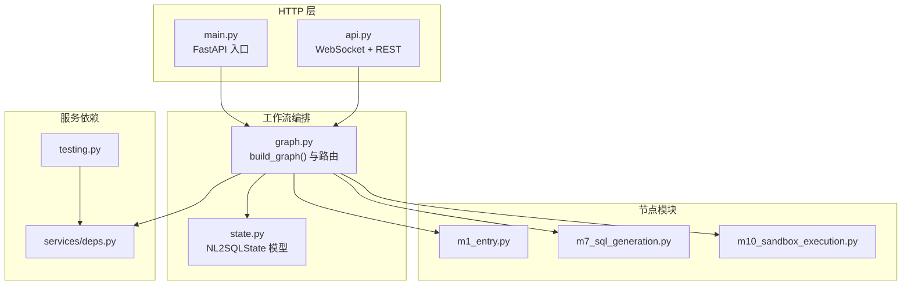
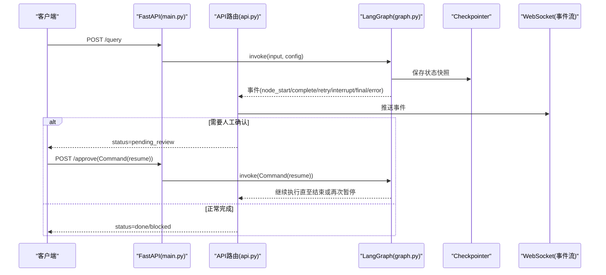
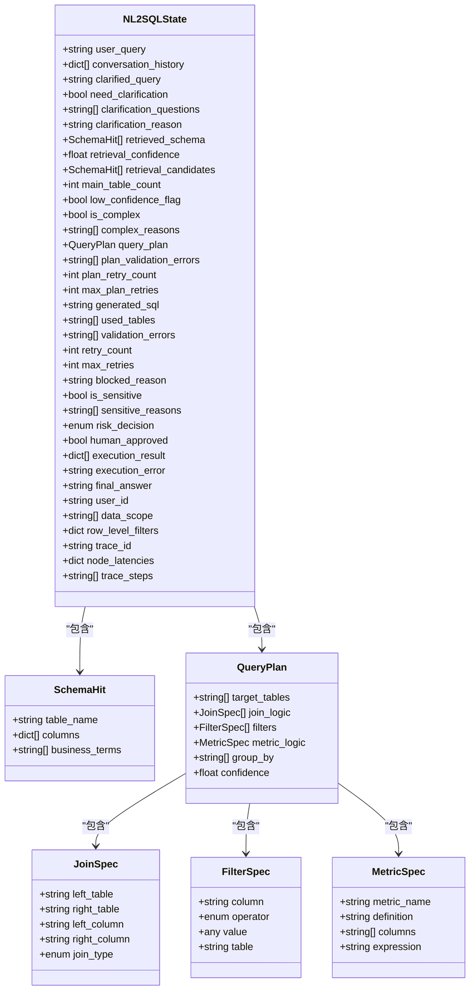
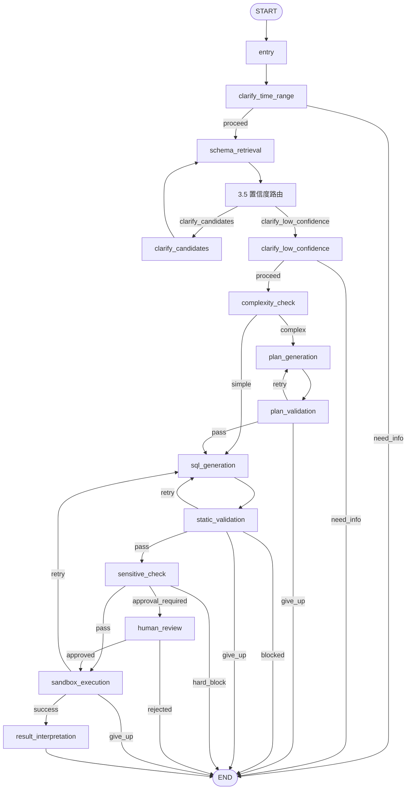
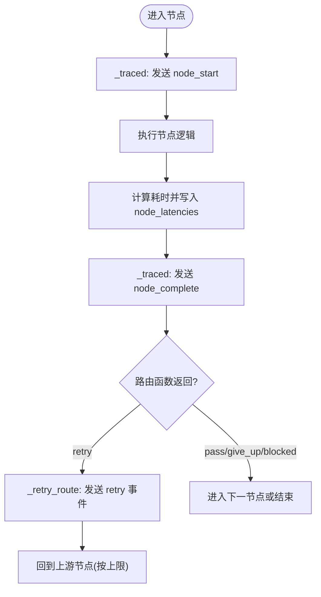
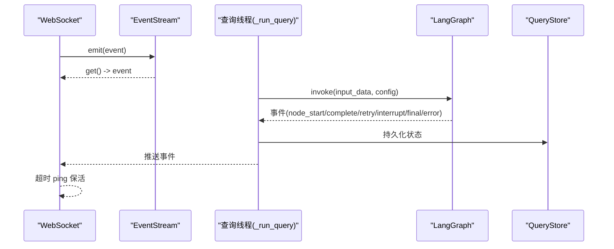
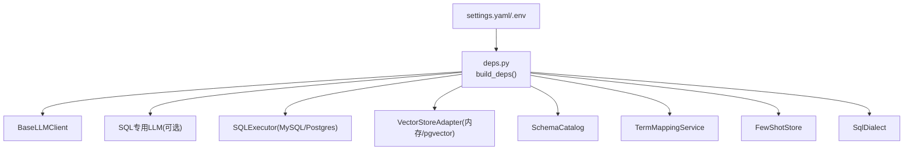

# 工作流编排

<cite>
**本文引用的文件**   
- [graph.py](file://nl2sql_agent/graph.py)
- [state.py](file://nl2sql_agent/state.py)
- [main.py](file://nl2sql_agent/main.py)
- [api.py](file://nl2sql_agent/api.py)
- [m1_entry.py](file://nl2sql_agent/nodes/m1_entry.py)
- [m7_sql_generation.py](file://nl2sql_agent/nodes/m7_sql_generation.py)
- [m10_sandbox_execution.py](file://nl2sql_agent/nodes/m10_sandbox_execution.py)
- [deps.py](file://nl2sql_agent/services/deps.py)
- [testing.py](file://nl2sql_agent/testing.py)
</cite>

## 目录
1. [简介](#简介)
2. [项目结构](#项目结构)
3. [核心组件](#核心组件)
4. [架构总览](#架构总览)
5. [详细组件分析](#详细组件分析)
6. [依赖关系分析](#依赖关系分析)
7. [性能考量](#性能考量)
8. [故障排查指南](#故障排查指南)
9. [结论](#结论)
10. [附录：扩展新节点与路由示例](#附录：扩展新节点与路由示例)

## 简介
本文件面向 NL2SQL 工作流编排系统，基于 LangGraph 的 StateGraph 构建 11 个节点的查询处理流水线。文档将深入解释状态机定义、节点注册与边连接逻辑；详解 build_graph() 的实现原理（事件追踪、重试机制、路由函数设计）；说明 START/END 配置与条件边缘添加方式；并给出事件推送、性能监控与错误处理策略。最后提供调试与排障指南以及扩展新节点和路由的具体方法。

## 项目结构
- 工作流图构建与编排位于 nl2sql_agent/graph.py，集中定义了 11 个节点、路由函数与边连接。
- 全局状态模型位于 nl2sql_agent/state.py，使用 Pydantic 定义 NL2SQLState 与各子结构。
- HTTP 入口与线程恢复在 nl2sql_agent/main.py，提供 /query、/approve、/thread/{id} 等接口。
- WebSocket 流式事件与 REST API 在 nl2sql_agent/api.py，实现事件桥接、断线重连、审批与历史查询。
- 关键节点实现包括 m1_entry.py（入口）、m7_sql_generation.py（SQL 生成）、m10_sandbox_execution.py（沙箱执行）。
- 依赖装配与配置加载在 nl2sql_agent/services/deps.py，统一注入 LLM、向量库、执行器、方言解析器等。
- 测试与演示环境通过 nl2sql_agent/testing.py 提供 FakeLLM 与 InMemoryExecutor。

**图表来源** 
- [main.py:1-152](file://nl2sql_agent/main.py#L1-L152)
- [api.py:1-573](file://nl2sql_agent/api.py#L1-L573)
- [graph.py:1-313](file://nl2sql_agent/graph.py#L1-L313)
- [state.py:1-146](file://nl2sql_agent/state.py#L1-L146)
- [m1_entry.py:1-28](file://nl2sql_agent/nodes/m1_entry.py#L1-L28)
- [m7_sql_generation.py:1-113](file://nl2sql_agent/nodes/m7_sql_generation.py#L1-L113)
- [m10_sandbox_execution.py:1-65](file://nl2sql_agent/nodes/m10_sandbox_execution.py#L1-L65)
- [deps.py:1-178](file://nl2sql_agent/services/deps.py#L1-L178)
- [testing.py:1-187](file://nl2sql_agent/testing.py#L1-L187)

**章节来源**
- [graph.py:1-313](file://nl2sql_agent/graph.py#L1-L313)
- [state.py:1-146](file://nl2sql_agent/state.py#L1-L146)
- [main.py:1-152](file://nl2sql_agent/main.py#L1-L152)
- [api.py:1-573](file://nl2sql_agent/api.py#L1-L573)

## 核心组件
- StateGraph 与节点注册：在 build_graph() 中创建 StateGraph(NL2SQLState)，依次 add_node 注册 11 个节点，并通过 add_edge 与 add_conditional_edges 建立边与路由。
- 路由函数：route_clarify、route_complexity、route_plan_validation、route_static_validation、route_sensitive、route_human_review、route_sandbox 等决定分支与重试。
- 事件追踪与延迟记录：_traced 包装每个节点，记录 node_start/node_complete 事件与 node_latencies、trace_steps。
- 重试机制：_retry_route 包装路由，当返回 retry 时推送 retry 事件（包含 attempt 与 reason），并在条件边中映射到对应回退节点。
- 中断与恢复：interrupt_before 指定 human_review、clarify_candidates、clarify_low_confidence 为暂停点，支持 Command(resume=...) 恢复。
- 检查点序列化：InMemorySaver + JsonPlusSerializer 允许对 NL2SQLState 及其子类型进行安全反序列化。

**章节来源**
- [graph.py:174-313](file://nl2sql_agent/graph.py#L174-L313)
- [graph.py:88-126](file://nl2sql_agent/graph.py#L88-L126)
- [graph.py:128-171](file://nl2sql_agent/graph.py#L128-L171)
- [state.py:83-146](file://nl2sql_agent/state.py#L83-L146)

## 架构总览
下图展示从 HTTP 请求到工作流执行的端到端流程，包括事件推送、检查点持久化与中断恢复。

**图表来源** 
- [main.py:83-145](file://nl2sql_agent/main.py#L83-L145)
- [api.py:134-211](file://nl2sql_agent/api.py#L134-L211)
- [graph.py:296-312](file://nl2sql_agent/graph.py#L296-L312)

## 详细组件分析

### 状态模型 NL2SQLState
- 字段覆盖用户提问、澄清、Schema 检索、复杂度判断、计划生成与校验、SQL 生成与静态校验、敏感判定与人工确认、执行与结果解释、身份权限、追踪信息。
- 关键字段：user_query、retrieved_schema、is_complex、query_plan、generated_sql、validation_errors、blocked_reason、risk_decision、execution_result、final_answer、row_level_filters、trace_id、node_latencies、trace_steps。
- 子结构：SchemaHit、JoinSpec、FilterSpec、MetricSpec、QueryPlan，均使用 Pydantic 严格约束与规范化。

**图表来源** 
- [state.py:14-82](file://nl2sql_agent/state.py#L14-L82)
- [state.py:83-146](file://nl2sql_agent/state.py#L83-L146)

**章节来源**
- [state.py:1-146](file://nl2sql_agent/state.py#L1-L146)

### 工作流图构建与路由
- build_graph(deps, checkpointer, event_sink)：
  - 创建 StateGraph(NL2SQLState)。
  - 通过 t(name, fn) = _traced(name, fn, event_sink) 包装节点，自动记录开始/完成事件与延迟。
  - add_node 注册 entry、clarify_time_range、schema_retrieval、clarify_candidates、clarify_low_confidence、complexity_check、plan_generation、plan_validation、sql_generation、static_validation、sensitive_check、human_review、sandbox_execution、result_interpretation。
  - 使用 add_edge 与 add_conditional_edges 建立边与路由，其中复杂路径包含两条重试回路：计划校验失败回 plan_generation（上限 max_plan_retries），静态校验失败回 sql_generation（上限 max_retries），执行失败回 sql_generation（上限 max_retries）。
  - interrupt_before 指定 human_review、clarify_candidates、clarify_low_confidence 为暂停点。
  - compile 时使用 InMemorySaver + JsonPlusSerializer 允许 NL2SQLState 及其子类型序列化。

**图表来源** 
- [graph.py:174-313](file://nl2sql_agent/graph.py#L174-L313)

**章节来源**
- [graph.py:174-313](file://nl2sql_agent/graph.py#L174-L313)

### 事件追踪与重试机制
- _traced：在每个节点执行前后发送 node_start 与 node_complete 事件，记录 latency_ms 并合并到 state.node_latencies，同时追加 trace_steps。
- _retry_route：包装路由函数，当返回 retry 时推送 retry 事件，包含 attempt（当前重试次数）与 reason（最近一次失败原因）。
- route_* 函数：根据 state 字段决定分支与是否重试，如 route_static_validation 区分 blocked（危险操作直接结束）、retry（非危险错误可重试）、pass（通过）。

**图表来源** 
- [graph.py:88-126](file://nl2sql_agent/graph.py#L88-L126)
- [graph.py:128-171](file://nl2sql_agent/graph.py#L128-L171)

**章节来源**
- [graph.py:88-126](file://nl2sql_agent/graph.py#L88-L126)
- [graph.py:128-171](file://nl2sql_agent/graph.py#L128-L171)

### 事件推送机制与前端交互
- EventStream：同步线程 → asyncio 队列桥接，确保图执行线程的事件能安全推送到 WebSocket。
- _run_query：在独立线程执行 graph.invoke，捕获 final/interrupt/error/done 事件并持久化到数据库。
- WebSocket /ws/query：接收消息后启动线程执行查询，循环读取事件并推送给前端，支持 ping 保活与断线重连（按 trace_id 恢复状态）。
- REST /api/*：提供非流式提交、状态查询、审批、历史、审计、反馈、配置管理等接口。

**图表来源** 
- [api.py:54-66](file://nl2sql_agent/api.py#L54-L66)
- [api.py:134-211](file://nl2sql_agent/api.py#L134-L211)

**章节来源**
- [api.py:1-573](file://nl2sql_agent/api.py#L1-L573)

### 关键节点实现要点
- 入口节点 m1_entry：校验 user_id、data_scope、user_query，生成 trace_id，不重新查权限。
- SQL 生成节点 m7_sql_generation：根据是否有计划选择 prompt 模板，调用 llm.complete_sql 返回 SQL 与 used_tables，清空上一轮校验错误。
- 沙箱执行节点 m10_sandbox_execution：EXPLAIN 预估行数阈值拒绝、未聚合强制 LIMIT、带超时执行，失败携带错误文本退回 SQL 生成重试。

**章节来源**
- [m1_entry.py:1-28](file://nl2sql_agent/nodes/m1_entry.py#L1-L28)
- [m7_sql_generation.py:1-113](file://nl2sql_agent/nodes/m7_sql_generation.py#L1-L113)
- [m10_sandbox_execution.py:1-65](file://nl2sql_agent/nodes/m10_sandbox_execution.py#L1-L65)

## 依赖关系分析
- Deps 统一装配 AppConfig、ConfigLoader、LLM、TermMappingService、SchemaCatalog、VectorStoreAdapter、SQLExecutor、FewShotStore、SqlDialect。
- build_deps 从 settings.yaml 与环境变量加载配置，动态选择 executor（MySQL/Postgres）与 vector_store（内存/pgvector）。
- testing.py 提供 FakeLLM 与 InMemoryExecutor，便于单元测试与回归测试。

**图表来源** 
- [deps.py:107-178](file://nl2sql_agent/services/deps.py#L107-L178)
- [testing.py:148-187](file://nl2sql_agent/testing.py#L148-L187)

**章节来源**
- [deps.py:1-178](file://nl2sql_agent/services/deps.py#L1-L178)
- [testing.py:1-187](file://nl2sql_agent/testing.py#L1-L187)

## 性能考量
- 节点延迟追踪：_traced 记录每个节点耗时，最终汇总到 state.node_latencies，便于定位瓶颈。
- 执行前 EXPLAIN：m10_sandbox_execution 在执行前预估扫描行数，超过阈值直接拒绝，避免大表全扫。
- 未聚合查询强制 LIMIT：防止无界结果集导致内存与网络压力。
- 超时控制：执行设置 timeout_seconds，超时视为执行错误，避免长时间阻塞。
- 检查点序列化：JsonPlusSerializer 限制允许的 msgpack 模块，提升序列化安全性与性能。

[本节为通用指导，无需具体文件引用]

## 故障排查指南
- 常见错误分类：
  - 危险操作（如 DROP TABLE）：static_validation 标记 blocked_reason，直接结束，不进入重试。
  - 字段幻觉或 used_tables 不一致：static_validation 产生 validation_errors，触发 retry 回 sql_generation。
  - 执行报错或空结果：sandbox_execution 设置 execution_error，触发 retry 回 sql_generation；空结果为合法业务结果，直接进入结果解释。
  - 计划校验失败：plan_validation 产生 plan_validation_errors，触发 retry 回 plan_generation，上限 max_plan_retries。
- 调试手段：
  - 查看 trace_steps 与 node_latencies 定位问题节点与耗时。
  - 通过 /thread/{thread_id} 获取当前状态快照。
  - 使用 /api/audit/{trace_id} 查看完整历史与反馈。
  - 在测试环境使用 FakeLLM 与 InMemoryExecutor 复现问题。

**章节来源**
- [m7_sql_generation.py:17-28](file://nl2sql_agent/nodes/m7_sql_generation.py#L17-L28)
- [m10_sandbox_execution.py:20-28](file://nl2sql_agent/nodes/m10_sandbox_execution.py#L20-L28)
- [main.py:142-145](file://nl2sql_agent/main.py#L142-L145)
- [api.py:372-378](file://nl2sql_agent/api.py#L372-L378)

## 结论
本工作流编排系统以 LangGraph 为核心，通过 StateGraph 清晰定义 11 个节点与复杂路由，结合事件追踪、重试机制与中断恢复，实现了健壮、可观测、可扩展的 NL2SQL 流水线。依赖装配与配置管理提供了灵活的环境适配能力，WebSocket 流式事件与 REST API 共同支撑了前端实时交互与管理功能。通过严格的静态校验与沙箱执行保护，系统在安全性与性能之间取得平衡。

[本节为总结性内容，无需具体文件引用]

## 附录：扩展新节点与路由示例
- 新增节点步骤：
  1. 在 nodes/ 目录下创建新模块（例如 mX_new_node.py），实现 make_xxx_node(deps) 工厂函数，返回接受 NL2SQLState 并返回 dict 或 NL2SQLState 的函数。
  2. 在 graph.py 的 build_graph() 中 g.add_node("new_node", t("new_node", mX_new_node.make_xxx_node(deps)))。
  3. 在适当位置添加边：g.add_edge("prev_node", "new_node") 或 g.add_conditional_edges("prev_node", route_fn, {"branch1": "next_node1", "branch2": "next_node2"})。
  4. 如需中断恢复，在 interrupt_before 中添加节点名。
  5. 在 state.py 中扩展 NL2SQLState 字段（如有必要）。
- 路由函数设计：
  - 简单分支：根据 state 布尔字段返回字符串（如 route_clarify、route_complexity）。
  - 重试分支：使用 _retry_route 包装，返回 "retry"/"pass"/"give_up"/"blocked" 等，确保事件推送与上限控制。
- 事件推送：
  - _traced 自动推送 node_start/node_complete，_retry_route 推送 retry 事件。
  - 自定义事件可在节点内部通过 sink 回调推送（需传入 event_sink）。
- 代码示例路径：
  - 节点注册与边连接：[graph.py:185-294](file://nl2sql_agent/graph.py#L185-L294)
  - 路由函数定义：[graph.py:128-171](file://nl2sql_agent/graph.py#L128-L171)
  - 事件追踪包装：[graph.py:88-103](file://nl2sql_agent/graph.py#L88-L103)
  - 重试路由包装：[graph.py:106-126](file://nl2sql_agent/graph.py#L106-L126)

**章节来源**
- [graph.py:185-294](file://nl2sql_agent/graph.py#L185-L294)
- [graph.py:128-171](file://nl2sql_agent/graph.py#L128-L171)
- [graph.py:88-126](file://nl2sql_agent/graph.py#L88-L126)