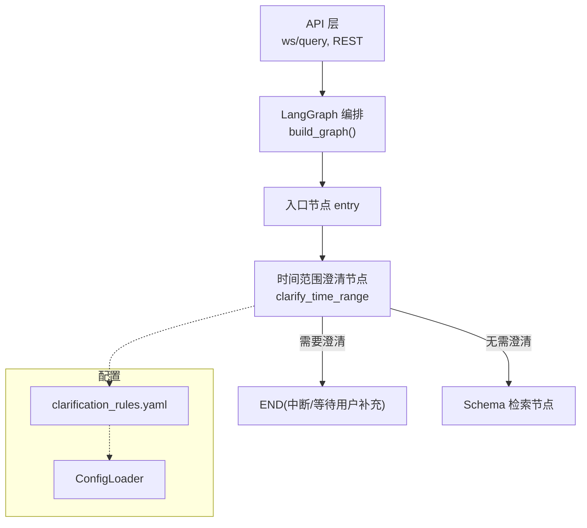
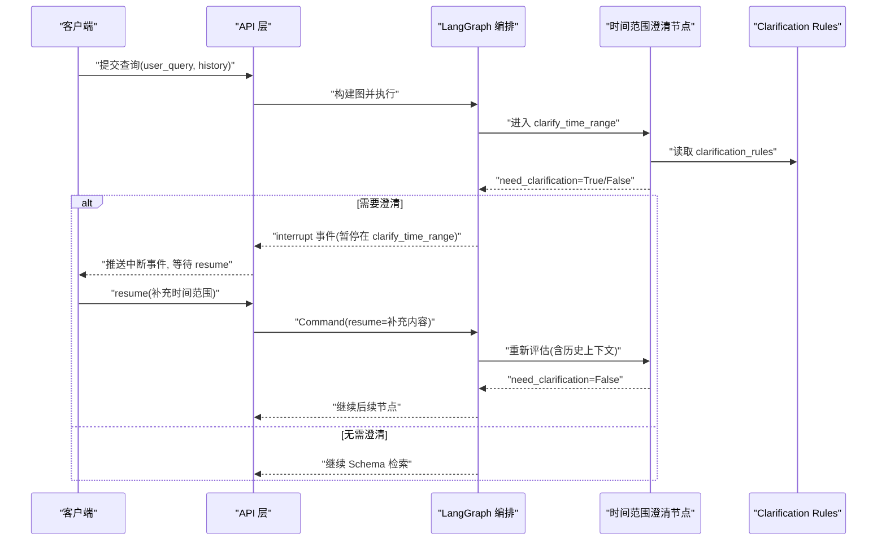
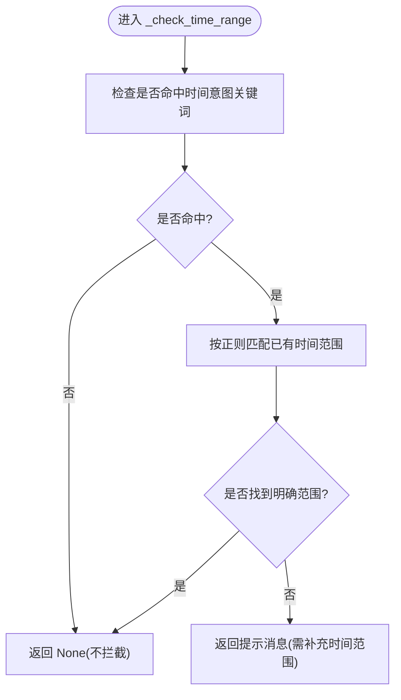
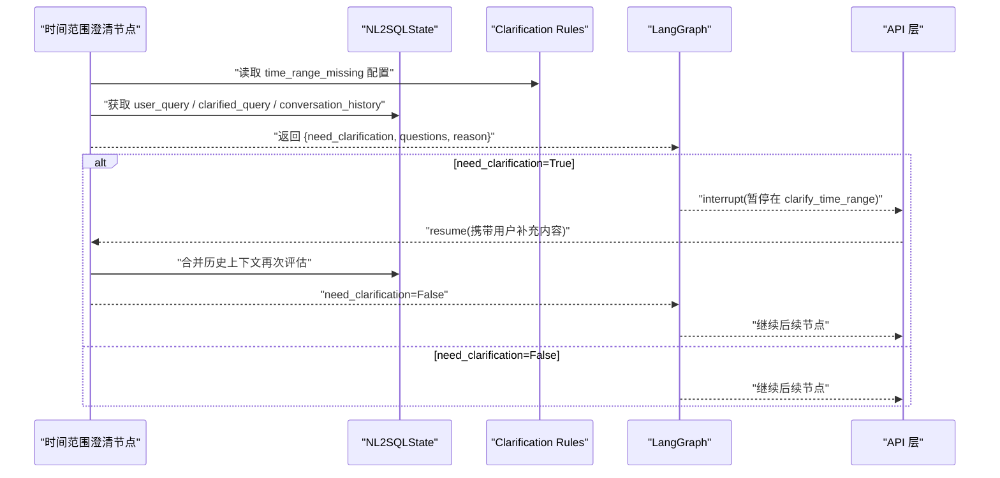
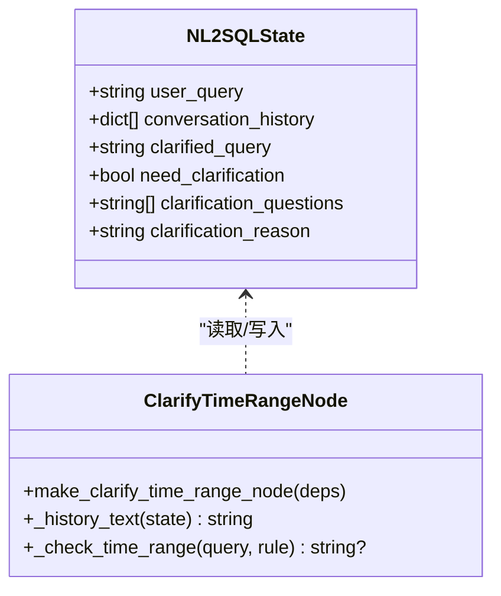
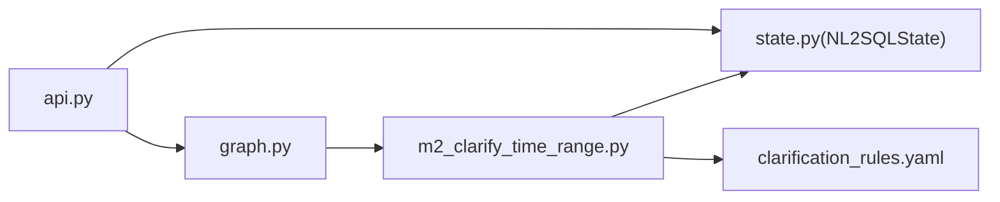

# 意图澄清

<cite>
**本文引用的文件**   
- [m2_clarify_time_range.py](file://nl2sql_agent/nodes/m2_clarify_time_range.py)
- [clarification_rules.yaml](file://nl2sql_agent/config/clarification_rules.yaml)
- [state.py](file://nl2sql_agent/state.py)
- [graph.py](file://nl2sql_agent/graph.py)
- [config_loader.py](file://nl2sql_agent/services/config_loader.py)
- [api.py](file://nl2sql_agent/api.py)
- [test_nodes.py](file://nl2sql_agent/tests/test_nodes.py)
- [conftest.py](file://nl2sql_agent/tests/conftest.py)
</cite>

## 目录
1. [简介](#简介)
2. [项目结构](#项目结构)
3. [核心组件](#核心组件)
4. [架构总览](#架构总览)
5. [详细组件分析](#详细组件分析)
6. [依赖关系分析](#依赖关系分析)
7. [性能考虑](#性能考虑)
8. [故障排查指南](#故障排查指南)
9. [结论](#结论)
10. [附录：使用示例与配置说明](#附录使用示例与配置说明)

## 简介
本文件面向 NL2SQL 意图澄清系统，聚焦“时间范围解析算法”和“歧义消解机制”，并详细说明 m2_clarify_time_range 节点的实现、输入验证、时间表达式识别与用户确认流程。文档同时给出澄清规则的配置格式、自定义方法、性能优化建议与错误处理策略，帮助读者快速理解并扩展该模块。

## 项目结构
围绕意图澄清的关键代码与配置分布如下：
- 节点实现：nl2sql_agent/nodes/m2_clarify_time_range.py
- 规则配置：nl2sql_agent/config/clarification_rules.yaml
- 状态模型：nl2sql_agent/state.py（NL2SQLState）
- 图编排与路由：nl2sql_agent/graph.py
- 配置加载器：nl2sql_agent/services/config_loader.py
- API 层（中断恢复/事件推送）：nl2sql_agent/api.py
- 测试用例：nl2sql_agent/tests/test_nodes.py, nl2sql_agent/tests/conftest.py

图表来源 
- [graph.py:174-312](file://nl2sql_agent/graph.py#L174-L312)
- [m2_clarify_time_range.py:34-61](file://nl2sql_agent/nodes/m2_clarify_time_range.py#L34-L61)
- [config_loader.py:14-36](file://nl2sql_agent/services/config_loader.py#L14-L36)

章节来源
- [graph.py:174-312](file://nl2sql_agent/graph.py#L174-L312)
- [m2_clarify_time_range.py:1-61](file://nl2sql_agent/nodes/m2_clarify_time_range.py#L1-L61)
- [clarification_rules.yaml:1-62](file://nl2sql_agent/config/clarification_rules.yaml#L1-L62)
- [config_loader.py:14-36](file://nl2sql_agent/services/config_loader.py#L14-L36)

## 核心组件
- 时间范围澄清节点（m2_clarify_time_range）：基于规则匹配判断是否缺少明确时间范围，必要时返回澄清问题并中断流程。
- 澄清规则（clarification_rules.yaml）：定义时间意图关键词、已有范围的匹配模式、敏感度阈值等。
- 全局状态（NL2SQLState）：承载用户查询、历史对话、澄清标志与原因等字段。
- 图编排（graph.py）：将 m2 节点接入 LangGraph，并在需要澄清时中断，等待用户补充信息后继续。
- 配置加载器（ConfigLoader）：热加载 YAML 配置，支持运行时修改生效。

章节来源
- [m2_clarify_time_range.py:1-61](file://nl2sql_agent/nodes/m2_clarify_time_range.py#L1-L61)
- [clarification_rules.yaml:1-62](file://nl2sql_agent/config/clarification_rules.yaml#L1-L62)
- [state.py:83-146](file://nl2sql_agent/state.py#L83-L146)
- [graph.py:174-312](file://nl2sql_agent/graph.py#L174-L312)
- [config_loader.py:14-36](file://nl2sql_agent/services/config_loader.py#L14-L36)

## 架构总览
下图展示从 API 到 m2 节点的调用链路与中断恢复机制。

图表来源 
- [api.py:134-157](file://nl2sql_agent/api.py#L134-L157)
- [graph.py:174-312](file://nl2sql_agent/graph.py#L174-L312)
- [m2_clarify_time_range.py:34-61](file://nl2sql_agent/nodes/m2_clarify_time_range.py#L34-L61)

## 详细组件分析

### 时间范围解析算法（自然语言时间表达式识别）
- 意图识别：通过 time_intent_keywords 列表检测“时间意图”是否存在于查询或历史中。
- 范围判定：通过 range_present_patterns 正则集合判断是否已包含明确的时间范围表达（如“近三个月”“2024-01”“Q1”“至今”等）。
- 输出决策：若存在时间意图且未检测到明确范围，则触发澄清；否则直接放行。

图表来源 
- [m2_clarify_time_range.py:23-31](file://nl2sql_agent/nodes/m2_clarify_time_range.py#L23-L31)
- [clarification_rules.yaml:11-25](file://nl2sql_agent/config/clarification_rules.yaml#L11-L25)

章节来源
- [m2_clarify_time_range.py:23-31](file://nl2sql_agent/nodes/m2_clarify_time_range.py#L23-L31)
- [clarification_rules.yaml:11-25](file://nl2sql_agent/config/clarification_rules.yaml#L11-L25)

### 歧义消解机制（用户交互与澄清规则）
- 用户交互流程：
  - 当 need_clarification=True 时，图编排会在 clarify_time_range 节点处中断，并通过 API 层推送 interrupt 事件给前端。
  - 前端收集用户补充的时间范围后，调用 resume 接口恢复执行，节点会结合 conversation_history 再次评估。
- 澄清规则配置：
  - enabled/sensitivity：控制整体开关与敏感度阈值。
  - time_range_missing：启用开关、可靠性权重、意图关键词、范围匹配模式、提示消息。
- 置信度判定：
  - 节点内部计算“触发 × reliability”，与 sensitivity 比较决定是否真正触发澄清。

图表来源 
- [m2_clarify_time_range.py:34-61](file://nl2sql_agent/nodes/m2_clarify_time_range.py#L34-L61)
- [graph.py:174-312](file://nl2sql_agent/graph.py#L174-L312)
- [api.py:134-157](file://nl2sql_agent/api.py#L134-L157)

章节来源
- [m2_clarify_time_range.py:34-61](file://nl2sql_agent/nodes/m2_clarify_time_range.py#L34-L61)
- [clarification_rules.yaml:1-62](file://nl2sql_agent/config/clarification_rules.yaml#L1-L62)
- [state.py:83-146](file://nl2sql_agent/state.py#L83-L146)
- [graph.py:174-312](file://nl2sql_agent/graph.py#L174-L312)
- [api.py:134-157](file://nl2sql_agent/api.py#L134-L157)

### m2_clarify_time_range 节点实现要点
- 输入验证：
  - 优先使用 clarified_query，否则回退到 user_query。
  - 若存在 conversation_history，将其拼接为上下文，避免重复追问已在历史中提供的范围。
- 时间表达式解析：
  - 先检查 time_intent_keywords 是否命中。
  - 再使用 range_present_patterns 的正则匹配判断是否已有明确范围。
- 用户确认流程：
  - 若命中且未满足灵敏度阈值，返回 need_clarification=True，并附带澄清问题与原因。
  - 图编排中断，等待用户通过 resume 补充信息后继续。

图表来源 
- [state.py:83-146](file://nl2sql_agent/state.py#L83-L146)
- [m2_clarify_time_range.py:16-31](file://nl2sql_agent/nodes/m2_clarify_time_range.py#L16-L31)

章节来源
- [m2_clarify_time_range.py:16-61](file://nl2sql_agent/nodes/m2_clarify_time_range.py#L16-L61)
- [state.py:83-146](file://nl2sql_agent/state.py#L83-L146)

### 澄清规则的配置格式与自定义方法
- 顶层开关与阈值：
  - enabled：是否启用时间范围澄清。
  - sensitivity：敏感度阈值（0~1），用于综合可靠性与触发条件。
- time_range_missing 子项：
  - enabled：是否启用该规则。
  - reliability：规则可靠性权重（默认 1.0）。
  - time_intent_keywords：时间意图关键词列表。
  - range_present_patterns：已有时间范围的正则模式列表。
  - message：缺失时间范围时的提示消息。
- 自定义方法：
  - 新增时间意图词：在 time_intent_keywords 追加。
  - 新增范围匹配模式：在 range_present_patterns 追加正则表达式。
  - 调整敏感度：修改 sensitivity 或 reliability 以平衡误报率与召回率。
  - 动态热更新：通过 ConfigLoader 的 mtime 缓存机制，修改 YAML 后下次读取即生效。

章节来源
- [clarification_rules.yaml:1-62](file://nl2sql_agent/config/clarification_rules.yaml#L1-L62)
- [config_loader.py:14-36](file://nl2sql_agent/services/config_loader.py#L14-L36)

## 依赖关系分析
- m2 节点依赖：
  - 状态模型 NL2SQLState（user_query、conversation_history、clarified_query 等）。
  - 配置 Clarification Rules（sensitivity、time_range_missing）。
- 图编排依赖：
  - 在 clarify_time_range 节点处根据 need_clarification 决定路由（proceed/need_info）。
  - 中断点设置（interrupt_before）确保在需要澄清时暂停，等待用户恢复。
- API 层依赖：
  - 事件桥接 EventStream 将线程内事件推送到 WebSocket。
  - resume 接口用于恢复中断的查询。

图表来源 
- [m2_clarify_time_range.py:1-61](file://nl2sql_agent/nodes/m2_clarify_time_range.py#L1-L61)
- [state.py:83-146](file://nl2sql_agent/state.py#L83-L146)
- [graph.py:174-312](file://nl2sql_agent/graph.py#L174-L312)
- [api.py:134-157](file://nl2sql_agent/api.py#L134-L157)

章节来源
- [m2_clarify_time_range.py:1-61](file://nl2sql_agent/nodes/m2_clarify_time_range.py#L1-L61)
- [state.py:83-146](file://nl2sql_agent/state.py#L83-L146)
- [graph.py:174-312](file://nl2sql_agent/graph.py#L174-L312)
- [api.py:134-157](file://nl2sql_agent/api.py#L134-L157)

## 性能考虑
- 规则匹配复杂度：
  - 时间意图关键词匹配为 O(k)，k 为关键词数量。
  - 正则匹配为 O(n×p)，n 为查询长度，p 为正则模式数量。可通过精简 patterns 提升性能。
- 历史文本拼接：
  - 仅当存在 conversation_history 时才拼接，避免不必要的字符串操作。
- 配置热加载：
  - ConfigLoader 基于 mtime 缓存，避免频繁 IO；仅在文件变更时重载。
- 中断与恢复：
  - 使用 LangGraph 的 checkpoint 机制保存状态，减少重复计算；resume 时只重算受影响节点。

[本节为通用指导，不直接分析具体文件]

## 故障排查指南
- 常见问题定位：
  - 未触发澄清但应触发：检查 time_intent_keywords 是否覆盖用户表达；确认 sensitivity/reliability 设置是否过高。
  - 过度澄清：检查 range_present_patterns 是否过宽；适当提高 sensitivity。
  - 历史未生效：确认 conversation_history 是否正确传入；节点会拼接历史进行二次评估。
- 调试手段：
  - 查看 state.clarification_reason 与 clarification_questions 了解触发原因与问题。
  - 通过 API 层的事件流（node_start/node_complete/interrupt/final/error）观察节点执行情况。
- 恢复流程：
  - 使用 resume 接口传入用户补充的时间范围，确保 next_node 正确恢复至 clarify_time_range。

章节来源
- [m2_clarify_time_range.py:34-61](file://nl2sql_agent/nodes/m2_clarify_time_range.py#L34-L61)
- [state.py:83-146](file://nl2sql_agent/state.py#L83-L146)
- [api.py:134-157](file://nl2sql_agent/api.py#L134-L157)

## 结论
m2_clarify_time_range 节点通过轻量级的规则匹配实现时间范围缺失的快速识别与澄清，结合 LangGraph 的中断恢复机制，提供流畅的用户交互体验。通过可配置的 clarification_rules.yaml，系统可在不同业务场景下灵活调整敏感度与匹配策略。配合 ConfigLoader 的热更新能力，运维人员可在线调优而不影响服务运行。

[本节为总结性内容，不直接分析具体文件]

## 附录：使用示例与配置说明
- 示例场景：
  - “查询新信贷贷款余额的时间段分布”：命中时间意图但未检测到明确范围 → 触发澄清。
  - “查询新信贷近三个月的贷款余额”：已包含明确范围 → 不触发澄清。
  - “查询新信贷的逾期率”：无时间意图 → 不触发澄清（交给后续模块处理）。
- 配置示例：
  - 新增时间意图词：在 time_intent_keywords 追加“季度”“半年”等。
  - 新增范围模式：在 range_present_patterns 追加“近X个周”“自X以来”等正则。
  - 调整敏感度：将 sensitivity 从 0.5 提升至 0.7 以降低误报。
- 测试参考：
  - test_clarify_time_range_missing：验证缺失时间范围时触发澄清。
  - test_clarify_not_triggered_when_range_present：验证已有范围时不触发。
  - test_clarify_term_not_consulted：验证模块 2 不再依赖术语映射。
  - test_clarify_sensitivity_knob：验证敏感度阈值对触发的影响。

章节来源
- [test_nodes.py:411-449](file://nl2sql_agent/tests/test_nodes.py#L411-L449)
- [conftest.py:69-76](file://nl2sql_agent/tests/conftest.py#L69-L76)
- [clarification_rules.yaml:11-25](file://nl2sql_agent/config/clarification_rules.yaml#L11-L25)