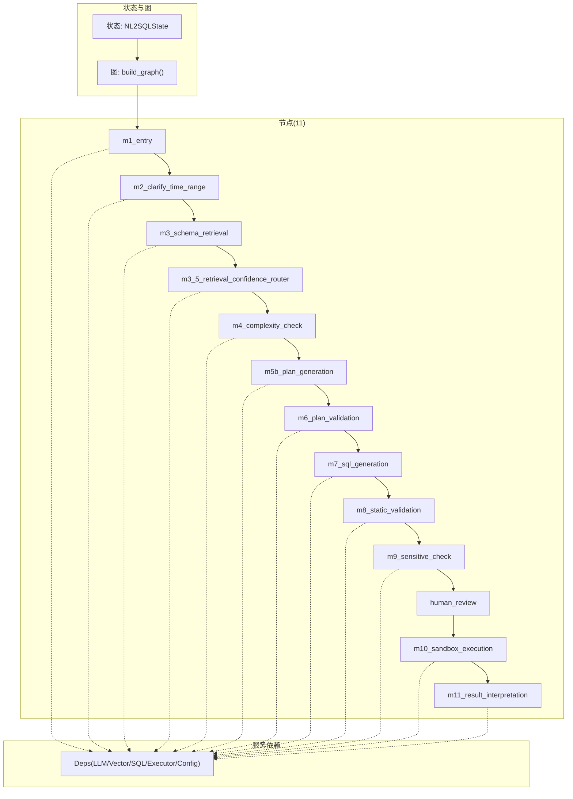
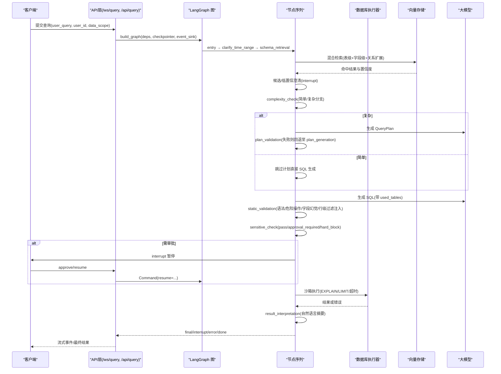
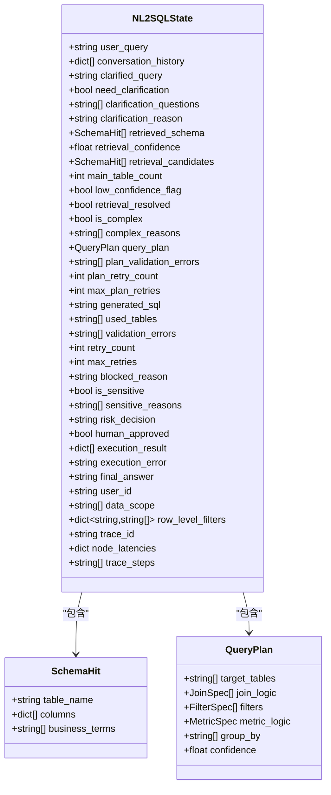
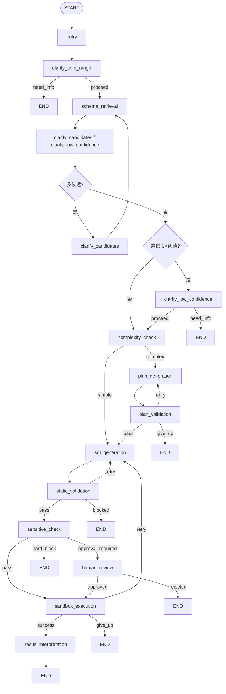
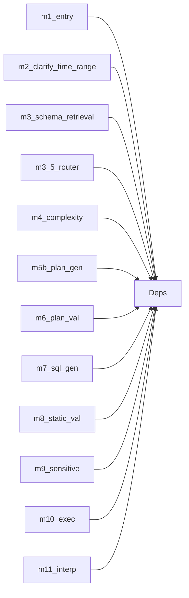

# 核心引擎

<cite>
**本文引用的文件**   
- [state.py](file://nl2sql_agent/state.py)
- [graph.py](file://nl2sql_agent/graph.py)
- [main.py](file://nl2sql_agent/main.py)
- [api.py](file://nl2sql_agent/api.py)
- [m1_entry.py](file://nl2sql_agent/nodes/m1_entry.py)
- [m2_clarify_time_range.py](file://nl2sql_agent/nodes/m2_clarify_time_range.py)
- [m3_schema_retrieval.py](file://nl2sql_agent/nodes/m3_schema_retrieval.py)
- [m3_5_retrieval_confidence_router.py](file://nl2sql_agent/nodes/m3_5_retrieval_confidence_router.py)
- [m4_complexity_check.py](file://nl2sql_agent/nodes/m4_complexity_check.py)
- [m5b_plan_generation.py](file://nl2sql_agent/nodes/m5b_plan_generation.py)
- [m6_plan_validation.py](file://nl2sql_agent/nodes/m6_plan_validation.py)
- [m7_sql_generation.py](file://nl2sql_agent/nodes/m7_sql_generation.py)
- [m8_static_validation.py](file://nl2sql_agent/nodes/m8_static_validation.py)
- [m9_sensitive_check.py](file://nl2sql_agent/nodes/m9_sensitive_check.py)
- [m10_sandbox_execution.py](file://nl2sql_agent/nodes/m10_sandbox_execution.py)
- [m11_result_interpretation.py](file://nl2sql_agent/nodes/m11_result_interpretation.py)
- [human_review.py](file://nl2sql_agent/nodes/human_review.py)
</cite>

## 目录
1. [简介](#简介)
2. [项目结构](#项目结构)
3. [核心组件](#核心组件)
4. [架构总览](#架构总览)
5. [详细组件分析](#详细组件分析)
6. [依赖关系分析](#依赖关系分析)
7. [性能考量](#性能考量)
8. [故障排查指南](#故障排查指南)
9. [结论](#结论)
10. [附录](#附录)

## 简介
本文件为 NL2SQL 核心引擎的权威文档，围绕基于 LangGraph 的 11 节点工作流进行系统化说明。内容涵盖：
- NL2SQLState 状态模型设计、字段语义与流转规则
- 意图澄清、Schema 检索、复杂度判断等关键算法的实现原理
- 各节点的职责、输入输出、错误处理与重试机制
- 节点间通信协议（事件/中断/恢复）、持久化与线程恢复
- 配置项、使用模式与调用方式
- 性能优化建议与常见问题定位方法

## 项目结构
NL2SQL 核心由“状态定义 + 图编排 + 节点实现 + 服务依赖 + API/HTTP 入口”构成：
- 状态定义：统一描述查询生命周期中的全部数据
- 图编排：LangGraph StateGraph 构建 11 个节点及路由、重试、中断点
- 节点实现：每个模块一个节点，职责单一、可独立测试
- 服务依赖：LLM、向量库、SQL 方言、执行器、配置加载等
- API/HTTP：REST 与 WebSocket 接口，支持流式事件推送、断线重连、审批恢复

图表来源
- [graph.py:174-312](file://nl2sql_agent/graph.py#L174-L312)
- [state.py:83-146](file://nl2sql_agent/state.py#L83-L146)

章节来源
- [graph.py:1-313](file://nl2sql_agent/graph.py#L1-L313)
- [state.py:1-146](file://nl2sql_agent/state.py#L1-L146)

## 核心组件
- NL2SQLState：承载用户问题、权限上下文、检索结果、计划、SQL、校验、敏感判定、执行结果与追踪信息的全局状态
- LangGraph 图：定义 11 个节点、条件路由、重试回路、中断点与检查点序列化
- 节点集合：从入口到结果解释的完整链路，覆盖澄清、检索、复杂度判断、计划生成与校验、SQL 生成与静态校验、敏感判定、人工确认、沙箱执行与结果解释
- 服务依赖：通过 Deps 注入 LLM、向量存储、SQL 方言、执行器、配置加载器等

章节来源
- [state.py:83-146](file://nl2sql_agent/state.py#L83-L146)
- [graph.py:174-312](file://nl2sql_agent/graph.py#L174-L312)

## 架构总览
下图展示端到端流程：REST/WS 请求进入后，构建图并运行；在需要时通过 interrupt 暂停等待外部输入；最终返回结构化结果或提示。

图表来源
- [graph.py:174-312](file://nl2sql_agent/graph.py#L174-L312)
- [api.py:134-157](file://nl2sql_agent/api.py#L134-L157)
- [m3_schema_retrieval.py:166-249](file://nl2sql_agent/nodes/m3_schema_retrieval.py#L166-L249)
- [m5b_plan_generation.py:71-90](file://nl2sql_agent/nodes/m5b_plan_generation.py#L71-L90)
- [m7_sql_generation.py:94-113](file://nl2sql_agent/nodes/m7_sql_generation.py#L94-L113)
- [m8_static_validation.py:33-153](file://nl2sql_agent/nodes/m8_static_validation.py#L33-L153)
- [m9_sensitive_check.py:19-106](file://nl2sql_agent/nodes/m9_sensitive_check.py#L19-L106)
- [m10_sandbox_execution.py:31-65](file://nl2sql_agent/nodes/m10_sandbox_execution.py#L31-L65)
- [m11_result_interpretation.py:25-39](file://nl2sql_agent/nodes/m11_result_interpretation.py#L25-L39)

## 详细组件分析

### NL2SQLState 状态模型
- 设计要点
  - 严格 Pydantic 模型，禁止额外字段，保证 checkpoint 序列化稳定
  - 明确区分系统权限(data_scope)与可信行级权限(row_level_filters)
  - 提供追踪字段(trace_id, trace_steps, node_latencies)便于观测
- 关键字段分组
  - 用户提问与澄清：user_query, conversation_history, clarified_query, need_clarification, clarification_questions, clarification_reason
  - Schema 检索：retrieved_schema, retrieval_confidence, retrieval_candidates, main_table_count, low_confidence_flag, retrieval_resolved
  - 复杂度判断：is_complex, complex_reasons
  - 计划：query_plan, plan_validation_errors, plan_retry_count, max_plan_retries
  - SQL 生成与校验：generated_sql, used_tables, validation_errors, retry_count, max_retries, blocked_reason
  - 敏感判定：is_sensitive, sensitive_reasons, risk_decision, human_approved
  - 执行与结果：execution_result, execution_error, final_answer
  - 身份与权限：user_id, data_scope, row_level_filters
  - 追踪：trace_id, node_latencies, trace_steps

图表来源
- [state.py:14-82](file://nl2sql_agent/state.py#L14-L82)
- [state.py:83-146](file://nl2sql_agent/state.py#L83-L146)

章节来源
- [state.py:1-146](file://nl2sql_agent/state.py#L1-L146)

### 图编排与路由
- 节点注册与追踪包装：所有节点通过 _traced 包装，记录开始/完成事件与耗时
- 条件路由：clarify、complexity、plan_validation、static_validation、sensitive、human_review、sandbox 等
- 重试回路：计划校验失败回 5b；静态校验失败回 7；执行失败回 7；每种错误就近消化
- 中断点：human_review、clarify_candidates、clarify_low_confidence 三处暂停，等待外部恢复
- 检查点：InMemorySaver + JsonPlusSerializer，注册 state 类型避免反序列化告警

图表来源
- [graph.py:174-312](file://nl2sql_agent/graph.py#L174-L312)

章节来源
- [graph.py:1-313](file://nl2sql_agent/graph.py#L1-L313)

### 节点详解

#### 模块 1：入口(entry)
- 职责：校验必填(user_id/data_scope/user_query)，规范化 trace_id
- 输入：user_query, user_id, data_scope, conversation_history, trace_id
- 输出：规范化后的 user_query 与 trace_id

章节来源
- [m1_entry.py:14-28](file://nl2sql_agent/nodes/m1_entry.py#L14-L28)

#### 模块 2：时间范围澄清(clarify_time_range)
- 职责：根据规则检测是否缺少时间范围，必要时触发澄清
- 算法：关键词匹配 + 正则检测已存在范围 + 灵敏度阈值
- 输出：need_clarification, clarification_questions, clarification_reason

章节来源
- [m2_clarify_time_range.py:34-62](file://nl2sql_agent/nodes/m2_clarify_time_range.py#L34-L62)

#### 模块 3：Schema 检索(schema_retrieval)
- 职责：混合检索(术语映射 + 表级/字段级向量 + 关系扩展)，产出 retrieved_schema、confidence、candidates
- 算法要点：
  - 术语映射优先(业务线命名空间→全局兜底)
  - 表级与字段级分数融合，按权重归一化
  - 关系向量仅补充与主候选直接关联的表
  - 字段相关度加成提升语义相关表的优先级
- 输出：retrieved_schema, retrieval_confidence, retrieval_candidates, main_table_count

章节来源
- [m3_schema_retrieval.py:166-249](file://nl2sql_agent/nodes/m3_schema_retrieval.py#L166-L249)

#### 模块 3.5：检索后置信度路由
- 职责：依据检索置信度与候选分布决定是否需要候选澄清或低置信澄清
- 阈值：confidence_threshold、candidate_gap_threshold
- 输出：路由到 clarify_candidates / clarify_low_confidence / complexity_check

章节来源
- [m3_5_retrieval_confidence_router.py:26-37](file://nl2sql_agent/nodes/m3_5_retrieval_confidence_router.py#L26-L37)
- [m3_5_retrieval_confidence_router.py:40-92](file://nl2sql_agent/nodes/m3_5_retrieval_confidence_router.py#L40-L92)
- [m3_5_retrieval_confidence_router.py:95-127](file://nl2sql_agent/nodes/m3_5_retrieval_confidence_router.py#L95-L127)

#### 模块 4：复杂度判断(complexity_check)
- 职责：纯规则路由，决定是否走计划路径
- 规则：多表阈值、复合口径指标、多步聚合关键词；低置信强制复杂
- 输出：is_complex, complex_reasons

章节来源
- [m4_complexity_check.py:17-53](file://nl2sql_agent/nodes/m4_complexity_check.py#L17-L53)

#### 模块 5b：计划生成(plan_generation)
- 职责：调用 LLM 生成结构化 QueryPlan，严格约束只表达 SELECT 类元素
- 提示工程：注入 schema_view、术语口径、上一轮校验错误反馈
- 输出：query_plan, 清空 plan_validation_errors

章节来源
- [m5b_plan_generation.py:71-90](file://nl2sql_agent/nodes/m5b_plan_generation.py#L71-L90)

#### 模块 6：计划校验(plan_validation)
- 职责：交叉核对目标表、join、字段引用与术语口径一致性
- 策略：错误写入 plan_validation_errors，达到上限则结束并提示人工介入
- 输出：errors, plan_retry_count

章节来源
- [m6_plan_validation.py:51-98](file://nl2sql_agent/nodes/m6_plan_validation.py#L51-L98)
- [m6_plan_validation.py:100-127](file://nl2sql_agent/nodes/m6_plan_validation.py#L100-L127)

#### 模块 7：SQL 生成(sql_generation)
- 职责：按计划或自然语言生成 SQL，同时输出 used_tables
- 提示工程：计划路径 vs 无计划路径(few-shot 示例)
- 输出：generated_sql, used_tables, 清空 validation_errors 与 execution_error

章节来源
- [m7_sql_generation.py:94-113](file://nl2sql_agent/nodes/m7_sql_generation.py#L94-L113)

#### 模块 8：静态校验(static_validation)
- 职责：语法/方言合法性、危险操作拦截、字段幻觉检测、行级权限注入
- 关键点：AST 解析、危险操作硬阻断、data_scope 不得泄露为字面值、行级过滤列值来自服务端可信注入
- 输出：validation_errors 或注入后的 SQL

章节来源
- [m8_static_validation.py:33-153](file://nl2sql_agent/nodes/m8_static_validation.py#L33-L153)

#### 模块 9：敏感判定(sensitive_check)
- 职责：基于规则判定 pass / approval_required / hard_block
- 规则：敏感字段、EXPLAIN 预估行数、金额字段聚合/导出、低置信度兜底
- 输出：risk_decision, sensitive_reasons, blocked_reason(硬阻断)

章节来源
- [m9_sensitive_check.py:19-106](file://nl2sql_agent/nodes/m9_sensitive_check.py#L19-L106)

#### 人工确认(human_review)
- 职责：interrupt 暂停，等待审批决策
- 恢复：Command(resume={"approved": bool, "comment": str})
- 输出：human_approved, 拒绝时 final_answer

章节来源
- [human_review.py:15-32](file://nl2sql_agent/nodes/human_review.py#L15-L32)

#### 模块 10：沙箱执行(sandbox_execution)
- 职责：EXPLAIN 守门、未聚合强制 LIMIT、执行超时保护
- 策略：执行报错退回 SQL 生成重试；空结果为合法业务结果
- 输出：execution_result 或 execution_error

章节来源
- [m10_sandbox_execution.py:31-65](file://nl2sql_agent/nodes/m10_sandbox_execution.py#L31-L65)

#### 模块 11：结果解释(result_interpretation)
- 职责：将结构化结果转自然语言摘要，LLM 不可用时确定性兜底
- 输出：final_answer

章节来源
- [m11_result_interpretation.py:25-39](file://nl2sql_agent/nodes/m11_result_interpretation.py#L25-L39)

### 关键算法与实现细节

#### 意图澄清(时间范围)
- 规则驱动：time_intent_keywords、range_present_patterns、message、sensitivity
- 历史上下文拼接避免重复追问
- 灵敏度阈值控制误报

章节来源
- [m2_clarify_time_range.py:34-62](file://nl2sql_agent/nodes/m2_clarify_time_range.py#L34-L62)

#### Schema 检索(混合召回)
- 术语映射优先，向量兜底；表级/字段级分数融合；关系向量受约束补表
- 字段相关度加成提升语义相关表优先级
- 置信度计算：术语精确命中为 1.0，向量为主时取 top 分

章节来源
- [m3_schema_retrieval.py:166-249](file://nl2sql_agent/nodes/m3_schema_retrieval.py#L166-L249)

#### 复杂度判断
- 保守策略：任一信号即判复杂；低置信强制复杂
- 指标：多表阈值、复合口径指标、多步聚合关键词

章节来源
- [m4_complexity_check.py:17-53](file://nl2sql_agent/nodes/m4_complexity_check.py#L17-L53)

#### 计划生成与校验
- 结构化输出约束，失败记入 plan_validation_errors
- 校验目标表、join、字段归属、术语口径一致性

章节来源
- [m5b_plan_generation.py:71-90](file://nl2sql_agent/nodes/m5b_plan_generation.py#L71-L90)
- [m6_plan_validation.py:51-98](file://nl2sql_agent/nodes/m6_plan_validation.py#L51-L98)

#### 静态校验与行级权限注入
- AST 解析与危险操作硬阻断
- data_scope 不得泄露为字面值
- 行级过滤列值来自 row_level_filters，按实际引用表别名注入

章节来源
- [m8_static_validation.py:33-153](file://nl2sql_agent/nodes/m8_static_validation.py#L33-L153)

#### 敏感判定
- 规则可配置，EXPLAIN 失败不视为风险
- 低置信度兜底进入人工确认

章节来源
- [m9_sensitive_check.py:19-106](file://nl2sql_agent/nodes/m9_sensitive_check.py#L19-L106)

### 节点间通信协议与事件
- 事件类型：node_start、node_complete、retry、interrupt、final、error、done
- 事件结构：event、node、trace_id、data(精简序列化)
- 传输通道：WebSocket 流式推送；REST 同步返回
- 断线重连：trace_id 恢复当前阶段(已完成/待审批/执行中)

章节来源
- [graph.py:60-104](file://nl2sql_agent/graph.py#L60-L104)
- [api.py:54-66](file://nl2sql_agent/api.py#L54-L66)
- [api.py:161-211](file://nl2sql_agent/api.py#L161-L211)

### 持久化与线程恢复
- 检查点：SQLite 持久化(checkpoints.db)，支持 resume
- 查询存储：nl2sql.db 保存每次查询的状态快照与审计信息
- 恢复机制：approve/resume 接口通过 Command(resume=...) 恢复中断节点

章节来源
- [main.py:63-81](file://nl2sql_agent/main.py#L63-L81)
- [api.py:101-157](file://nl2sql_agent/api.py#L101-L157)
- [api.py:280-354](file://nl2sql_agent/api.py#L280-L354)

### 使用模式与调用示例
- REST 调用
  - POST /api/query：非流式提交，返回 trace_id 与状态
  - GET /api/query/{trace_id}：查询状态
  - POST /api/query/{trace_id}/approve：人工审批
  - POST /api/query/{trace_id}/resume：通用恢复(候选/低置信/审批)
- WebSocket 调用
  - /ws/query：流式推送节点事件，支持断线重连
- 配置与调试
  - 环境变量：ANTHROPIC_API_KEY、ANTTHROPIC_MODEL、NL2SQL_DEMO
  - 配置目录：config/*.yaml(澄清/复杂度/敏感/设置/向量存储等)

章节来源
- [api.py:234-354](file://nl2sql_agent/api.py#L234-L354)
- [main.py:83-146](file://nl2sql_agent/main.py#L83-L146)

## 依赖关系分析
- 组件耦合
  - 节点对 Deps 的依赖解耦，便于替换实现(如 FakeLLM/InMemoryExecutor)
  - 图编排集中管理路由与重试，节点保持单一职责
- 外部依赖
  - LLM：结构化输出、SQL 专用模型、摘要
  - 向量存储：表级/字段级/关系索引
  - SQL 方言：sqlglot 解析与注入
  - 执行器：EXPLAIN、LIMIT、超时保护
- 潜在循环依赖
  - 节点之间无直接 import 循环，通过 State 传递数据

图表来源
- [graph.py:174-312](file://nl2sql_agent/graph.py#L174-L312)

章节来源
- [graph.py:1-313](file://nl2sql_agent/graph.py#L1-L313)

## 性能考量
- 检索优化
  - 术语映射优先减少向量开销
  - 表级/字段级分数融合降低噪声
  - 关系向量仅受约束补表，限制 top_n 与阈值
- 生成与校验
  - 计划路径减少自由文本歧义
  - 静态校验尽早拦截危险操作与字段幻觉
- 执行保护
  - EXPLAIN 阈值拒绝高扫描
  - 未聚合强制 LIMIT，执行超时保护
- 追踪与观测
  - node_latencies 与 trace_steps 用于瓶颈定位
  - 事件流实时反馈前端

[本节为通用指导，无需代码来源]

## 故障排查指南
- 常见错误与定位
  - 计划多次失败：查看 plan_validation_errors，修正术语口径或字段引用
  - SQL 静态校验失败：检查 used_tables 与 AST 引用一致性，避免 data_scope 泄露
  - 执行报错：查看 execution_error，关注 EXPLAIN 阈值与 LIMIT 注入
  - 敏感阻断：检查 sensitive_rules 配置与 EXPLAIN 预估行数
- 恢复与重试
  - 使用 /api/query/{trace_id}/resume 恢复中断节点
  - 观察 retry 事件中的 attempt 与 reason
- 日志与审计
  - 通过 /api/audit/{trace_id} 获取完整审计信息
  - 检查 checkpoints.db 与 nl2sql.db 状态

章节来源
- [m6_plan_validation.py:100-127](file://nl2sql_agent/nodes/m6_plan_validation.py#L100-L127)
- [m8_static_validation.py:33-153](file://nl2sql_agent/nodes/m8_static_validation.py#L33-L153)
- [m10_sandbox_execution.py:31-65](file://nl2sql_agent/nodes/m10_sandbox_execution.py#L31-L65)
- [m9_sensitive_check.py:19-106](file://nl2sql_agent/nodes/m9_sensitive_check.py#L19-L106)
- [api.py:372-391](file://nl2sql_agent/api.py#L372-L391)

## 结论
该核心引擎以 LangGraph 为中心，将 NL2SQL 的关键步骤拆解为 11 个职责清晰的节点，并通过严格的规则与结构化输出保障准确性与安全性。状态模型与检查点机制确保可恢复性与可观测性；事件流与断线重连提升用户体验。建议在部署时合理配置阈值与规则，结合追踪与审计持续优化。

[本节为总结，无需代码来源]

## 附录
- 配置项参考
  - clarification_rules.yaml：时间范围澄清、检索置信度阈值、候选差距阈值
  - complexity_rules.yaml：多表阈值、复合口径触发、多步关键词
  - sensitive_rules.yaml：敏感字段、EXPLAIN 阈值、金额字段规则
  - settings.yaml：执行限制、超时、方言等
- 快速上手
  - 设置环境变量 ANTHROPIC_API_KEY、ANTTHROPIC_MODEL
  - 启动服务 uvicorn nl2sql_agent.main:app
  - 前端访问 http://localhost:5173

[本节为补充信息，无需代码来源]