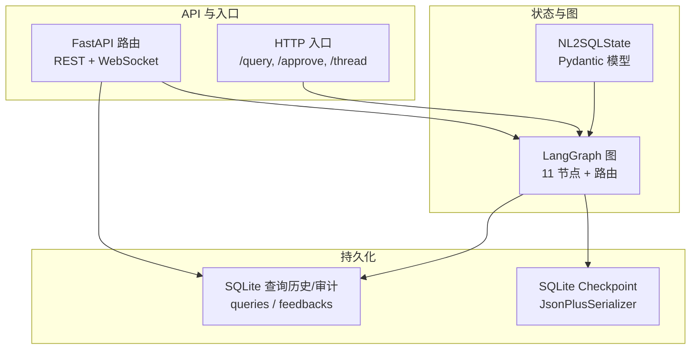
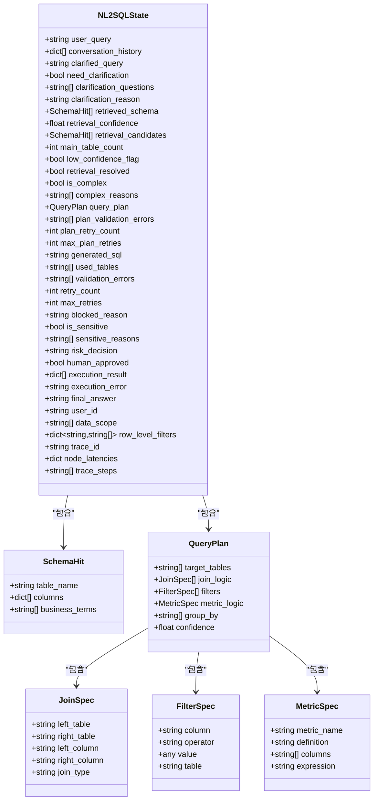
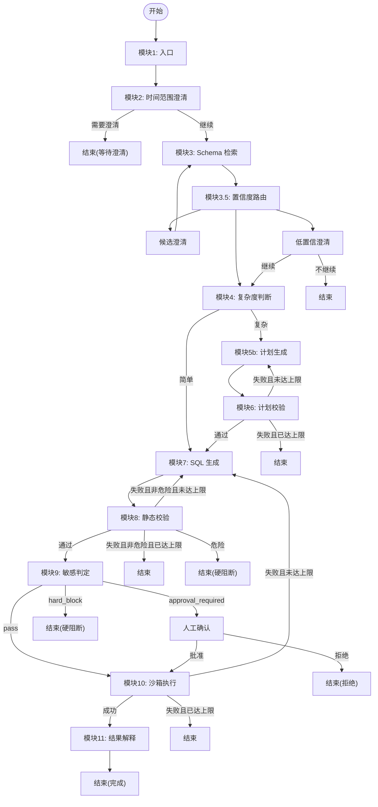
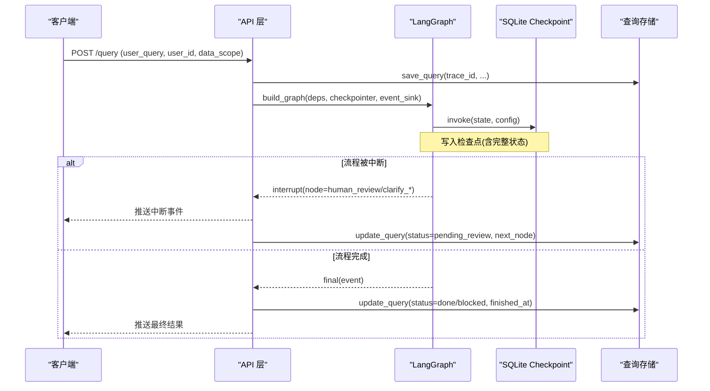
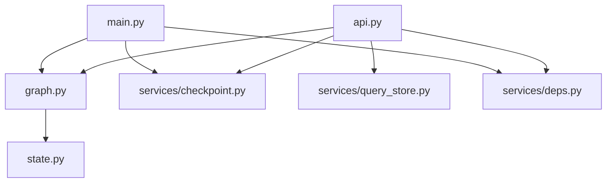

# 状态管理

<cite>
**本文引用的文件**
- [state.py](file://nl2sql_agent/state.py)
- [graph.py](file://nl2sql_agent/graph.py)
- [checkpoint.py](file://nl2sql_agent/services/checkpoint.py)
- [query_store.py](file://nl2sql_agent/services/query_store.py)
- [main.py](file://nl2sql_agent/main.py)
- [api.py](file://nl2sql_agent/api.py)
- [deps.py](file://nl2sql_agent/services/deps.py)
- [m1_entry.py](file://nl2sql_agent/nodes/m1_entry.py)
- [human_review.py](file://nl2sql_agent/nodes/human_review.py)
</cite>

## 目录
1. [简介](#简介)
2. [项目结构](#项目结构)
3. [核心组件](#核心组件)
4. [架构总览](#架构总览)
5. [详细组件分析](#详细组件分析)
6. [依赖关系分析](#依赖关系分析)
7. [性能考量](#性能考量)
8. [故障排查指南](#故障排查指南)
9. [结论](#结论)
10. [附录：使用示例与最佳实践](#附录使用示例与最佳实践)

## 简介
本文件面向 NL2SQL 的状态管理系统，聚焦于 NL2SQLState Pydantic 模型设计、状态流转规则、检查点持久化与恢复机制、查询历史与审计日志存储、以及状态序列化/反序列化的实现细节。文档同时提供状态管理的最佳实践、性能优化建议、常见问题的解决方案和具体使用示例，帮助读者快速理解并正确使用该系统的状态管理能力。

## 项目结构
NL2SQL 的状态管理由以下关键模块组成：
- 状态模型定义：位于 nl2sql_agent/state.py，定义了 NL2SQLState 及其相关子模型（SchemaHit、QueryPlan、JoinSpec、FilterSpec、MetricSpec）。
- 图编排与路由：位于 nl2sql_agent/graph.py，基于 LangGraph 构建 11 个节点的有向图，定义节点间的路由与重试回路。
- 检查点系统：位于 nl2sql_agent/services/checkpoint.py，使用 SQLite + JsonPlusSerializer 实现线程安全、跨进程共享的持久化检查点。
- 查询历史与审计：位于 nl2sql_agent/services/query_store.py，SQLite 存储查询结果、审批动作、反馈等。
- API 层与入口：位于 nl2sql_agent/api.py 与 main.py，提供 REST/WS 接口、事件桥接、断线重连、审批恢复等能力。
- 依赖装配：位于 nl2sql_agent/services/deps.py，负责配置加载、LLM/执行器/向量库等依赖注入。
- 节点实现：如 m1_entry.py、human_review.py 等，体现状态在节点间的更新与传递。

图表来源
- [state.py:83-146](file://nl2sql_agent/state.py#L83-L146)
- [graph.py:172-313](file://nl2sql_agent/graph.py#L172-L313)
- [checkpoint.py:16-40](file://nl2sql_agent/services/checkpoint.py#L16-L40)
- [query_store.py:31-91](file://nl2sql_agent/services/query_store.py#L31-L91)
- [api.py:134-157](file://nl2sql_agent/api.py#L134-L157)
- [main.py:83-121](file://nl2sql_agent/main.py#L83-L121)

章节来源
- [state.py:83-146](file://nl2sql_agent/state.py#L83-L146)
- [graph.py:172-313](file://nl2sql_agent/graph.py#L172-L313)
- [checkpoint.py:16-40](file://nl2sql_agent/services/checkpoint.py#L16-L40)
- [query_store.py:31-91](file://nl2sql_agent/services/query_store.py#L31-L91)
- [api.py:134-157](file://nl2sql_agent/api.py#L134-L157)
- [main.py:83-121](file://nl2sql_agent/main.py#L83-L121)

## 核心组件
- NL2SQLState：统一承载一次查询从输入到输出的全部运行时状态，包括用户提问、澄清、Schema 检索、复杂度判断、计划生成与校验、SQL 生成与静态校验、敏感判定、人工确认、执行与结果解释、身份权限、追踪字段等。
- 子模型：SchemaHit、QueryPlan、JoinSpec、FilterSpec、MetricSpec，用于严格表达 Schema 命中、查询计划与连接/过滤/指标口径等结构化信息。
- 检查点系统：通过 SqliteSaver + JsonPlusSerializer 将完整图状态持久化，支持服务重启后继续审批或澄清。
- 查询存储：记录每次查询的最终状态、trace、审批动作、反馈等，供历史页、审计页、审批队列页查询。
- 图编排：定义 11 个节点及路由逻辑，包含两条重试回路（计划校验失败回 5b；执行报错回 7），以及中断点（human_review、clarify_candidates、clarify_low_confidence）。

章节来源
- [state.py:14-81](file://nl2sql_agent/state.py#L14-L81)
- [state.py:83-146](file://nl2sql_agent/state.py#L83-L146)
- [checkpoint.py:16-40](file://nl2sql_agent/services/checkpoint.py#L16-L40)
- [query_store.py:31-91](file://nl2sql_agent/services/query_store.py#L31-L91)
- [graph.py:172-313](file://nl2sql_agent/graph.py#L172-L313)

## 架构总览
下图展示了 NL2SQL 状态管理的整体架构，包括状态模型、图编排、检查点与查询存储之间的关系。

图表来源
- [state.py:14-81](file://nl2sql_agent/state.py#L14-L81)
- [state.py:83-146](file://nl2sql_agent/state.py#L83-L146)

章节来源
- [state.py:14-81](file://nl2sql_agent/state.py#L14-L81)
- [state.py:83-146](file://nl2sql_agent/state.py#L83-L146)

## 详细组件分析

### NL2SQLState 模型设计与业务含义
- 用户提问与澄清：user_query、conversation_history、clarified_query、need_clarification、clarification_questions、clarification_reason。
- Schema 检索：retrieved_schema、retrieval_confidence、retrieval_candidates、main_table_count、low_confidence_flag、retrieval_resolved。
- 复杂度判断：is_complex、complex_reasons。
- 计划与 SQL：query_plan、plan_validation_errors、plan_retry_count、max_plan_retries、generated_sql、used_tables、validation_errors、retry_count、max_retries、blocked_reason。
- 敏感判定与人工确认：is_sensitive、sensitive_reasons、risk_decision、human_approved。
- 执行与结果：execution_result、execution_error、final_answer。
- 身份与权限：user_id、data_scope、row_level_filters。
- 追踪：trace_id、node_latencies、trace_steps。

这些字段贯穿整个流程，节点只读或更新相应字段，确保状态一致性与可追溯性。

章节来源
- [state.py:83-146](file://nl2sql_agent/state.py#L83-L146)

### 状态流转规则与路由
图的编排定义了严格的节点顺序与条件分支，核心规则如下：
- 模块1 → 模块2 → 模块3 → 模块4
  - 简单路径：模块5a（跳过计划）→ 模块7
  - 复杂路径：模块5b → 模块6（不过则回 5b，上限 max_plan_retries）→ 模块7
- 模块7 → 模块8（不过且非危险则回 7，上限 max_retries；危险操作直接结束）
- 模块9（敏感判定）：approval_required → 人工确认 → 模块10；hard_block → 结束；pass → 模块10
- 模块10（执行）：成功 → 模块11；报错/结果为空 → 回 7（上限 max_retries）；打满 → 结束

图表来源
- [graph.py:172-313](file://nl2sql_agent/graph.py#L172-L313)

章节来源
- [graph.py:172-313](file://nl2sql_agent/graph.py#L172-L313)

### 检查点系统与恢复策略
- 使用 SqliteSaver + JsonPlusSerializer，允许自定义允许的 msgpack 模块，注册 NL2SQLState 及其子模型，避免反序列化告警。
- 创建时启用 WAL 模式与 busy_timeout，保证线程安全与跨进程共享。
- 测试中可通过 InMemorySaver 替换，便于无外部依赖演示。
- 服务重启后，通过相同 thread_id 恢复中断状态，继续审批或澄清。

图表来源
- [checkpoint.py:16-40](file://nl2sql_agent/services/checkpoint.py#L16-L40)
- [api.py:134-157](file://nl2sql_agent/api.py#L134-L157)
- [query_store.py:99-134](file://nl2sql_agent/services/query_store.py#L99-L134)

章节来源
- [checkpoint.py:16-40](file://nl2sql_agent/services/checkpoint.py#L16-L40)
- [api.py:134-157](file://nl2sql_agent/api.py#L134-L157)
- [query_store.py:99-134](file://nl2sql_agent/services/query_store.py#L99-L134)

### 查询存储机制与审计日志
- queries 表：保存 trace_id、用户信息、状态、SQL、计划、Schema 命中、敏感原因、执行结果、最终答案、trace_steps、节点延迟、重试计数、审批信息等。
- feedbacks 表：记录反馈类型、评论、时间戳，按 trace_id 关联。
- 支持历史查询列表、待审批列表、审计详情（含反馈）。
- 自动迁移新增列，兼容旧库。

章节来源
- [query_store.py:31-91](file://nl2sql_agent/services/query_store.py#L31-L91)
- [query_store.py:146-193](file://nl2sql_agent/services/query_store.py#L146-L193)
- [query_store.py:195-214](file://nl2sql_agent/services/query_store.py#L195-L214)

### 状态序列化与反序列化
- 图编译时通过 JsonPlusSerializer 注册 state 模块类型，避免 checkpoint 反序列化告警。
- _to_serializable 函数将 Pydantic 对象/嵌套结构转成可 JSON 序列化的 dict。
- _event_data 精简节点返回数据（如截断 execution_result），避免刷屏。
- _persist 将 state 转为字典并落库，统一字段映射。

章节来源
- [graph.py:47-70](file://nl2sql_agent/graph.py#L47-L70)
- [graph.py:296-313](file://nl2sql_agent/graph.py#L296-L313)
- [api.py:68-99](file://nl2sql_agent/api.py#L68-L99)
- [api.py:101-132](file://nl2sql_agent/api.py#L101-L132)

### 节点间状态传递与更新机制
- 入口节点（m1_entry）：校验 user_id、data_scope、user_query，生成 trace_id。
- 人工确认节点（human_review）：通过 interrupt 暂停流程，恢复时将 Command(resume=...) 的值写回 human_approved。
- 其他节点根据业务逻辑更新 state 字段（如生成的 SQL、校验错误、执行结果等）。

章节来源
- [m1_entry.py:14-28](file://nl2sql_agent/nodes/m1_entry.py#L14-L28)
- [human_review.py:15-32](file://nl2sql_agent/nodes/human_review.py#L15-L32)

## 依赖关系分析
- graph.py 依赖 state.py 中的 NL2SQLState 及各子模型。
- api.py 依赖 graph.py、checkpoint.py、query_store.py、deps.py。
- main.py 依赖 graph.py、checkpoint.py、deps.py。
- deps.py 负责加载配置、构建 LLM、执行器、向量库等依赖。

图表来源
- [graph.py:28-44](file://nl2sql_agent/graph.py#L28-L44)
- [api.py:26-30](file://nl2sql_agent/api.py#L26-L30)
- [main.py:25-28](file://nl2sql_agent/main.py#L25-L28)
- [deps.py:17-24](file://nl2sql_agent/services/deps.py#L17-L24)

章节来源
- [graph.py:28-44](file://nl2sql_agent/graph.py#L28-L44)
- [api.py:26-30](file://nl2sql_agent/api.py#L26-L30)
- [main.py:25-28](file://nl2sql_agent/main.py#L25-L28)
- [deps.py:17-24](file://nl2sql_agent/services/deps.py#L17-L24)

## 性能考量
- 检查点使用 SQLite WAL 模式与 busy_timeout，提升并发写入性能与稳定性。
- 事件推送采用 EventStream 桥接同步线程与异步事件循环，避免阻塞。
- 节点延迟与步骤追踪（node_latencies、trace_steps）有助于定位瓶颈。
- 查询历史与审计存储使用索引与分页查询，限制返回数量（limit=200）。
- 建议在高频场景下考虑缓存热点查询结果或语义缓存（预留扩展点）。

[本节为通用指导，无需特定文件引用]

## 故障排查指南
- 常见问题：
  - 流程中断后无法恢复：确认 thread_id 一致，checkpointer 实例共享。
  - 审批后仍显示 pending_review：检查 _persist 是否正确更新 status 与 next_node。
  - 执行报错频繁重试：查看 validation_errors 与 execution_error，调整 max_retries。
  - 危险操作被阻断：检查 blocked_reason 与 risk_decision。
- 调试技巧：
  - 使用 /thread/{id} 查看当前状态与下一步节点。
  - 查看 Node 延迟与步骤追踪，定位慢节点。
  - 检查 queries 表中的 trace_steps 与 node_latencies。

章节来源
- [api.py:142-157](file://nl2sql_agent/api.py#L142-L157)
- [api.py:266-272](file://nl2sql_agent/api.py#L266-L272)
- [query_store.py:146-193](file://nl2sql_agent/services/query_store.py#L146-L193)

## 结论
NL2SQL 的状态管理系统以强类型的 Pydantic 模型为基础，结合 LangGraph 的图编排与 SQLite 检查点，实现了健壮的状态流转、持久化与恢复能力。查询历史与审计存储提供了完整的可追溯性。通过合理的性能优化与故障排查策略，系统能够稳定支撑复杂的 NL2SQL 业务流程。

[本节为总结，无需特定文件引用]

## 附录：使用示例与最佳实践

### 使用示例
- 发起查询（REST）：POST /api/query，传入 user_query、user_id、data_scope。
- 流式查询（WebSocket）：连接 /ws/query，发送消息触发查询，接收 node_start/complete/retry/interrupt/final/error 事件。
- 人工审批：POST /api/query/{trace_id}/approve，传入 approved、reason、approver。
- 通用恢复：POST /api/query/{trace_id}/resume，传入 resume 字典（如选定表、是否继续等）。
- 查看历史：GET /api/history，支持 user_id、business_line、日期范围过滤。
- 审计详情：GET /api/audit/{trace_id}，返回查询记录与反馈。

章节来源
- [api.py:234-264](file://nl2sql_agent/api.py#L234-L264)
- [api.py:280-315](file://nl2sql_agent/api.py#L280-L315)
- [api.py:322-354](file://nl2sql_agent/api.py#L322-L354)
- [api.py:356-379](file://nl2sql_agent/api.py#L356-L379)

### 最佳实践
- 始终提供 user_id 与 data_scope，确保权限控制生效。
- 合理设置 max_retries 与 max_plan_retries，避免无限重试。
- 使用 trace_id 进行断线重连与状态恢复。
- 定期清理历史数据，避免数据库膨胀。
- 监控 node_latencies 与 trace_steps，优化慢节点。

[本节为通用指导，无需特定文件引用]