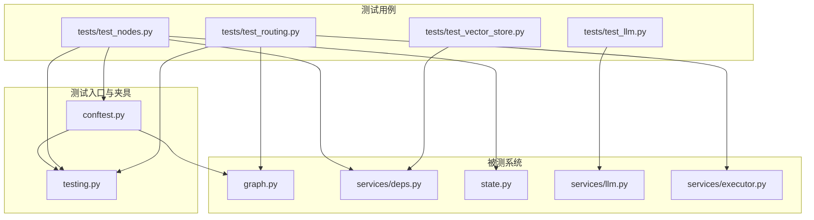
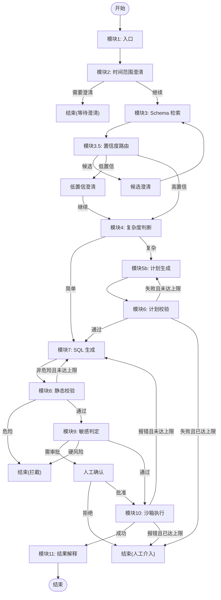
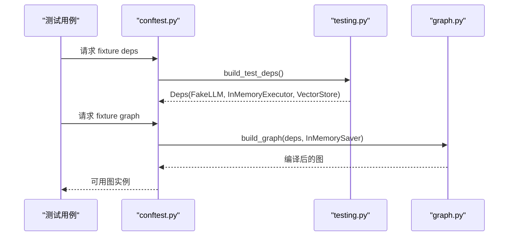
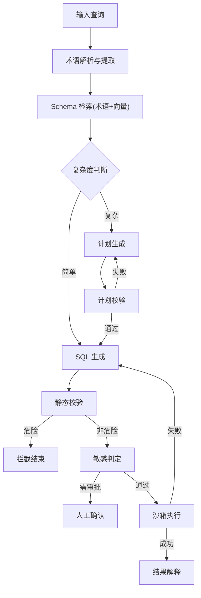
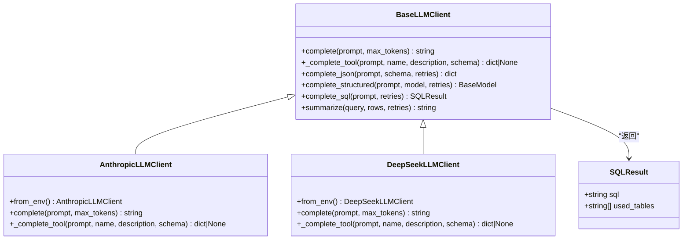
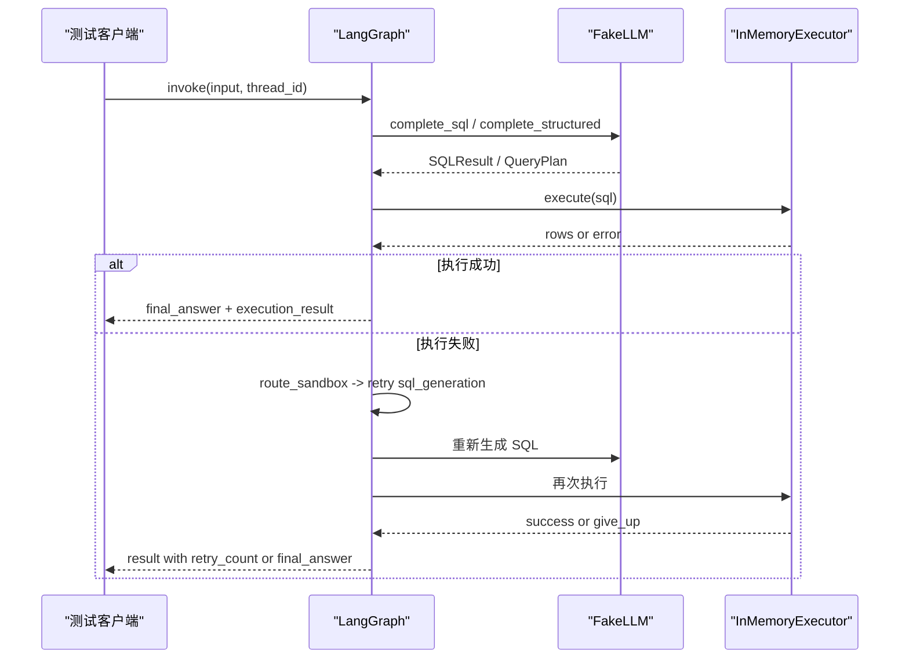
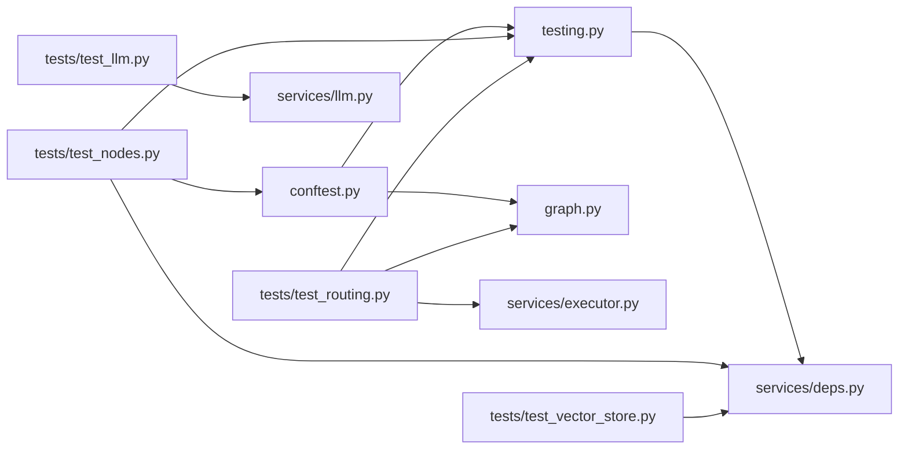

# 单元测试

<cite>
**本文引用的文件**   
- [nl2sql_agent/tests/conftest.py](file://nl2sql_agent/tests/conftest.py)
- [nl2sql_agent/testing.py](file://nl2sql_agent/testing.py)
- [nl2sql_agent/services/deps.py](file://nl2sql_agent/services/deps.py)
- [nl2sql_agent/graph.py](file://nl2sql_agent/graph.py)
- [nl2sql_agent/state.py](file://nl2sql_agent/state.py)
- [nl2sql_agent/services/llm.py](file://nl2sql_agent/services/llm.py)
- [nl2sql_agent/services/executor.py](file://nl2sql_agent/services/executor.py)
- [nl2sql_agent/tests/test_nodes.py](file://nl2sql_agent/tests/test_nodes.py)
- [nl2sql_agent/tests/test_llm.py](file://nl2sql_agent/tests/test_llm.py)
- [nl2sql_agent/tests/test_routing.py](file://nl2sql_agent/tests/test_routing.py)
- [nl2sql_agent/tests/test_vector_store.py](file://nl2sql_agent/tests/test_vector_store.py)
- [nl2sql_agent/config/settings.yaml](file://nl2sql_agent/config/settings.yaml)
- [pyproject.toml](file://pyproject.toml)
</cite>

## 目录
1. [引言](#引言)
2. [项目结构](#项目结构)
3. [核心组件](#核心组件)
4. [架构总览](#架构总览)
5. [详细组件分析](#详细组件分析)
6. [依赖关系分析](#依赖关系分析)
7. [性能考量](#性能考量)
8. [故障排查指南](#故障排查指南)
9. [结论](#结论)
10. [附录](#附录)

## 引言
本文件面向 NL2SQL 项目的单元测试，系统性说明 pytest 框架的使用方式、测试夹具设计（conftest.py 中的 deps、graph 等共享夹具）、节点测试策略、LLM 服务测试方法（模拟外部 API 与响应处理）、测试数据管理（Schema 配置、Mock 数据与环境隔离）、覆盖率要求、断言最佳实践、异步测试处理、调试技巧、性能优化建议以及常见问题解决方案。同时提供测试驱动开发（TDD）指导与测试重构建议，帮助读者快速理解并高效维护测试体系。

## 项目结构
测试代码集中于 nl2sql_agent/tests 目录，采用按功能域划分的测试文件：
- conftest.py：定义会话级隔离配置与共享夹具（deps、graph），确保测试环境稳定、可重复。
- test_nodes.py：覆盖术语解析、Schema 检索、复杂度判断、计划校验、静态校验、敏感判定、时间范围澄清等节点逻辑。
- test_llm.py：验证 LLM 客户端选择、结构化输出解析、JSON 提取鲁棒性，不依赖真实网络。
- test_routing.py：端到端路由验收用例，覆盖两条重试回路的边界不变式与人工确认流程。
- test_vector_store.py：向量存储适配层行为与后端切换。

图表来源
- [nl2sql_agent/tests/conftest.py:1-76](file://nl2sql_agent/tests/conftest.py#L1-L76)
- [nl2sql_agent/testing.py:1-187](file://nl2sql_agent/testing.py#L1-L187)
- [nl2sql_agent/graph.py:174-313](file://nl2sql_agent/graph.py#L174-L313)
- [nl2sql_agent/services/deps.py:110-181](file://nl2sql_agent/services/deps.py#L110-L181)
- [nl2sql_agent/state.py:83-146](file://nl2sql_agent/state.py#L83-L146)
- [nl2sql_agent/services/llm.py:70-160](file://nl2sql_agent/services/llm.py#L70-L160)
- [nl2sql_agent/services/executor.py:161-205](file://nl2sql_agent/services/executor.py#L161-L205)

章节来源
- [pyproject.toml:41-44](file://pyproject.toml#L41-L44)
- [nl2sql_agent/tests/conftest.py:1-76](file://nl2sql_agent/tests/conftest.py#L1-L76)

## 核心组件
- 共享夹具与测试依赖装配
  - conftest.py 通过 _isolated_config 将 config 目录复制到临时路径，并用固定 Schema 覆盖 schema_catalog.yaml，避免被脚本改写影响测试；随后 set_test_config_dir 指向该临时目录。
  - deps 夹具调用 build_test_deps() 构造不含外部依赖的 Deps，注入 FakeLLM、InMemoryExecutor、内存向量存储与确定性 embedding。
  - graph 夹具基于 deps 构建 LangGraph 图，使用 InMemorySaver 作为检查点，便于状态恢复与中断控制。
- 测试双打与 Mock
  - testing.py 提供 FakeLLM，支持 SQL 规则与计划规则的 prompt 正则匹配返回，内置 summarize 模板；FAKE_TABLES 提供内存表数据；build_test_deps 统一装配测试环境。
  - services/deps.py 提供生产 build_deps 与测试 build_test_deps 的对比，后者替换 LLM/Executor/VectorStore 为可测实现。
- 状态模型
  - state.py 定义 NL2SQLState、QueryPlan、FilterSpec、JoinSpec、MetricSpec、SchemaHit 等 Pydantic 模型，约束字段类型与校验规则，保证节点间数据契约稳定。

章节来源
- [nl2sql_agent/tests/conftest.py:46-66](file://nl2sql_agent/tests/conftest.py#L46-L66)
- [nl2sql_agent/testing.py:26-66](file://nl2sql_agent/testing.py#L26-L66)
- [nl2sql_agent/testing.py:148-187](file://nl2sql_agent/testing.py#L148-L187)
- [nl2sql_agent/services/deps.py:110-181](file://nl2sql_agent/services/deps.py#L110-L181)
- [nl2sql_agent/state.py:66-146](file://nl2sql_agent/state.py#L66-L146)

## 架构总览
NL2SQL 工作流由 LangGraph 编排，包含 11 个模块节点与多条条件边，形成两条关键重试回路：
- 计划校验回路：模块 5b（计划生成）↔ 模块 6（计划校验），失败在内部重试，不退回模块 3。
- 执行重试回路：模块 10（沙箱执行）→ 模块 7（SQL 生成），执行报错只退回 SQL 生成，不退回计划路径。

图表来源
- [nl2sql_agent/graph.py:174-313](file://nl2sql_agent/graph.py#L174-L313)

章节来源
- [nl2sql_agent/graph.py:1-18](file://nl2sql_agent/graph.py#L1-L18)

## 详细组件分析

### 夹具与测试环境隔离（conftest.py + testing.py）
- 会话级隔离配置
  - 复制 CONFIG_DIR 到临时目录，覆盖 schema_catalog.yaml 为固定基线，设置测试配置目录，确保所有测试在同一确定环境下运行。
- 共享夹具
  - deps：通过 build_test_deps() 装配无外部依赖的 Deps，注入 FakeLLM、InMemoryExecutor、内存向量存储与 fake_embedding。
  - graph：基于 deps 构建 LangGraph，使用 InMemorySaver 作为检查点，支持中断与恢复。
- 测试输入构造
  - make_input 封装 user_query、user_id、data_scope，简化用例编写。

图表来源
- [nl2sql_agent/tests/conftest.py:46-66](file://nl2sql_agent/tests/conftest.py#L46-L66)
- [nl2sql_agent/testing.py:148-187](file://nl2sql_agent/testing.py#L148-L187)
- [nl2sql_agent/graph.py:174-313](file://nl2sql_agent/graph.py#L174-L313)

章节来源
- [nl2sql_agent/tests/conftest.py:1-76](file://nl2sql_agent/tests/conftest.py#L1-L76)
- [nl2sql_agent/testing.py:1-187](file://nl2sql_agent/testing.py#L1-L187)

### 节点测试策略（test_nodes.py）
- 术语映射与提取
  - 验证全局术语解析、业务线专属映射兜底、未知术语 not found。
- Schema 检索
  - 系统维度隔离（risk_mart vs dw/core）、术语层优先后向量层、列向量检索、直接关联扩展。
- 复杂度判断
  - 复合口径触发复杂路径，单表聚合走简单路径。
- 计划校验
  - 正确计划通过，错误表名或指标定义不一致产生校验错误。
- 静态校验
  - 危险操作（DROP）直接拦截且不进入重试；字段幻觉与非危险错误触发重试；别名引用合法不被误判；行级过滤注入使用别名限定。
- 敏感判定
  - 敏感字段（IDNUM）与金额聚合触发敏感标记。
- 时间范围澄清
  - 缺失时间范围触发澄清；存在时间范围不拦截；模块 2 不再引用术语映射。

图表来源
- [nl2sql_agent/tests/test_nodes.py:44-393](file://nl2sql_agent/tests/test_nodes.py#L44-L393)
- [nl2sql_agent/state.py:83-146](file://nl2sql_agent/state.py#L83-L146)

章节来源
- [nl2sql_agent/tests/test_nodes.py:1-393](file://nl2sql_agent/tests/test_nodes.py#L1-L393)

### LLM 服务测试方法（test_llm.py + services/llm.py）
- Provider 选择
  - 环境变量优先级：显式 LLM_PROVIDER > DEEPSEEK_API_KEY > ANTHROPIC_MODEL；默认 Anthropic。
- DeepSeek 客户端
  - 使用假 OpenAI 兼容客户端模拟 tool_choice 与纯文本路径；complete_json 容忍 markdown 代码块与前后废话；complete_structured 基于 Pydantic 校验。
- JSON 提取鲁棒性
  - extract_json 支持嵌套对象、引号与花括号字符串值，非法输入抛出异常。

图表来源
- [nl2sql_agent/services/llm.py:70-160](file://nl2sql_agent/services/llm.py#L70-L160)
- [nl2sql_agent/services/llm.py:162-243](file://nl2sql_agent/services/llm.py#L162-L243)
- [nl2sql_agent/services/llm.py:31-35](file://nl2sql_agent/services/llm.py#L31-L35)

章节来源
- [nl2sql_agent/tests/test_llm.py:1-166](file://nl2sql_agent/tests/test_llm.py#L1-L166)
- [nl2sql_agent/services/llm.py:1-328](file://nl2sql_agent/services/llm.py#L1-L328)

### 端到端路由与重试回路（test_routing.py + graph.py）
- 简单路径：模块 2 → 3 → 4 → 7 → 8 → 9 → 10 → 11，无计划路径。
- 复合口径：模块 5b → 6 → 7，金额聚合触发敏感 → human_review 暂停 → resume 继续。
- 字段幻觉：模块 8 拦截 → 退回模块 7 → 最终成功。
- 系统隔离：data_scope 控制检索结果。
- 执行报错：模块 10 报错 → 退回模块 7，不退回模块 5b。
- 计划重试回路：模块 5b ↔ 6 内部打转，不退回模块 3。
- 执行给退：max_retries 打满后降级，避免死循环。
- 危险 SQL：直接拦截，不进入重试。

图表来源
- [nl2sql_agent/tests/test_routing.py:22-215](file://nl2sql_agent/tests/test_routing.py#L22-L215)
- [nl2sql_agent/graph.py:174-313](file://nl2sql_agent/graph.py#L174-L313)
- [nl2sql_agent/services/executor.py:161-205](file://nl2sql_agent/services/executor.py#L161-L205)

章节来源
- [nl2sql_agent/tests/test_routing.py:1-215](file://nl2sql_agent/tests/test_routing.py#L1-L215)

### 向量存储适配层（test_vector_store.py + services/deps.py）
- 适配器 upsert 与 search：支持 filters 与语义检索命中相关表。
- 重建索引：保持完整性。
- 后端切换：memory 与 pgvector 通过配置显式选择，缺 url 报错。

章节来源
- [nl2sql_agent/tests/test_vector_store.py:1-68](file://nl2sql_agent/tests/test_vector_store.py#L1-L68)
- [nl2sql_agent/services/deps.py:87-108](file://nl2sql_agent/services/deps.py#L87-L108)

## 依赖关系分析
- 测试夹具与依赖装配
  - conftest.py 依赖 testing.py 的 build_test_deps 与 set_test_config_dir。
  - testing.py 依赖 services/deps.py 的 AppConfig、Deps、build_vector_store、build_executor_from_url。
  - graph.py 依赖 nodes 模块与 services/deps.py 的 Deps。
- 测试用例依赖
  - test_nodes.py 依赖 deps 与 testing.py 的 FakeLLM、FAKE_TABLES。
  - test_llm.py 依赖 services/llm.py 的客户端与工具函数。
  - test_routing.py 依赖 graph.py、services/executor.py、testing.py。
  - test_vector_store.py 依赖 services/deps.py 的 build_vector_store。

图表来源
- [nl2sql_agent/tests/conftest.py:1-76](file://nl2sql_agent/tests/conftest.py#L1-L76)
- [nl2sql_agent/testing.py:1-187](file://nl2sql_agent/testing.py#L1-L187)
- [nl2sql_agent/services/deps.py:110-181](file://nl2sql_agent/services/deps.py#L110-L181)
- [nl2sql_agent/graph.py:174-313](file://nl2sql_agent/graph.py#L174-L313)
- [nl2sql_agent/tests/test_nodes.py:1-393](file://nl2sql_agent/tests/test_nodes.py#L1-L393)
- [nl2sql_agent/tests/test_llm.py:1-166](file://nl2sql_agent/tests/test_llm.py#L1-L166)
- [nl2sql_agent/tests/test_routing.py:1-215](file://nl2sql_agent/tests/test_routing.py#L1-L215)
- [nl2sql_agent/tests/test_vector_store.py:1-68](file://nl2sql_agent/tests/test_vector_store.py#L1-L68)

章节来源
- [nl2sql_agent/tests/conftest.py:1-76](file://nl2sql_agent/tests/conftest.py#L1-L76)
- [nl2sql_agent/testing.py:1-187](file://nl2sql_agent/testing.py#L1-L187)
- [nl2sql_agent/services/deps.py:110-181](file://nl2sql_agent/services/deps.py#L110-L181)
- [nl2sql_agent/graph.py:174-313](file://nl2sql_agent/graph.py#L174-L313)

## 性能考量
- 向量检索与索引
  - 使用内存向量存储与确定性 embedding，避免下载模型与外部依赖，提升测试速度与可复现性。
  - rebuild_index 保证索引重建后数据完整性。
- 执行器与超时
  - InMemoryExecutor 支持 fail_execute_times、empty_result、fail_explain，用于快速验证执行路径与边界。
  - settings.yaml 中 execution.timeout_seconds 与 explain_row_threshold 控制执行前风险评估。
- 图事件与追踪
  - graph.py 的 traced 包装器记录节点延迟与步骤，便于性能分析与定位瓶颈。

章节来源
- [nl2sql_agent/testing.py:174-187](file://nl2sql_agent/testing.py#L174-L187)
- [nl2sql_agent/services/executor.py:161-205](file://nl2sql_agent/services/executor.py#L161-L205)
- [nl2sql_agent/config/settings.yaml:18-23](file://nl2sql_agent/config/settings.yaml#L18-L23)
- [nl2sql_agent/graph.py:88-104](file://nl2sql_agent/graph.py#L88-L104)

## 故障排查指南
- 常见错误与定位
  - LLM 结构化输出多次解析失败：检查 complete_json 的重试逻辑与 extract_json 的鲁棒性。
  - 计划校验失败：确认 target_tables 与 retrieved_schema 一致，metric_logic.definition 与术语库一致。
  - 静态校验误判：检查别名引用合法性与行级过滤注入是否使用别名限定。
  - 执行报错重试：确认 InMemoryExecutor.fail_execute_times 与路由逻辑是否正确退回模块 7。
- 调试技巧
  - 使用 graph.get_state(config).next 查看当前节点与中断状态。
  - 通过 trace_steps 与 node_latencies 分析执行路径与耗时。
  - 利用 FakeLLM 的规则顺序与正则匹配，精准控制返回内容。

章节来源
- [nl2sql_agent/tests/test_routing.py:117-140](file://nl2sql_agent/tests/test_routing.py#L117-L140)
- [nl2sql_agent/tests/test_nodes.py:208-303](file://nl2sql_agent/tests/test_nodes.py#L208-L303)
- [nl2sql_agent/services/llm.py:110-128](file://nl2sql_agent/services/llm.py#L110-L128)

## 结论
本测试体系通过 conftest.py 的隔离配置与共享夹具、testing.py 的双打与依赖装配、services/deps.py 的测试化构建、graph.py 的路由编排与追踪、state.py 的状态契约，构建了稳定、可复现、易维护的单元测试环境。测试用例覆盖节点逻辑、LLM 客户端、端到端路由与向量存储适配层，确保系统在复杂工作流下的正确性与健壮性。遵循本文的最佳实践与故障排查指南，可有效提升测试质量与开发效率。

## 附录
- 测试运行与配置
  - pyproject.toml 中 pytest.ini_options 指定测试路径与选项。
  - settings.yaml 提供运行参数，如 dialect、schema_search_top_k、execution 限制等。
- 覆盖率与断言最佳实践
  - 建议使用 pytest-cov 收集覆盖率，关注分支与语句覆盖。
  - 断言应明确、具体，避免模糊断言；对边界条件与异常路径进行充分覆盖。
- 异步测试处理
  - 当前测试以同步为主，如需异步，可使用 pytest-asyncio 与 async fixtures。
- 测试驱动开发（TDD）指导
  - 先写失败的测试用例，再实现最小可用代码，逐步重构与优化。
- 测试重构建议
  - 抽取公共夹具与辅助函数，减少重复代码。
  - 分离 Mock 数据与测试逻辑，提高可读性与可维护性。

章节来源
- [pyproject.toml:41-44](file://pyproject.toml#L41-L44)
- [nl2sql_agent/config/settings.yaml:1-30](file://nl2sql_agent/config/settings.yaml#L1-L30)