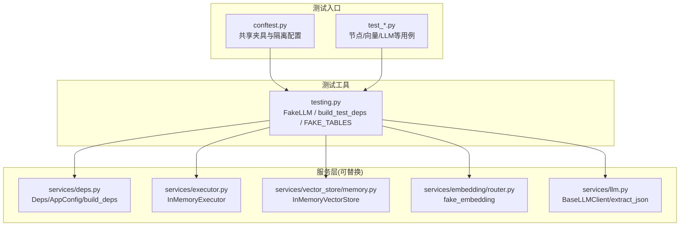
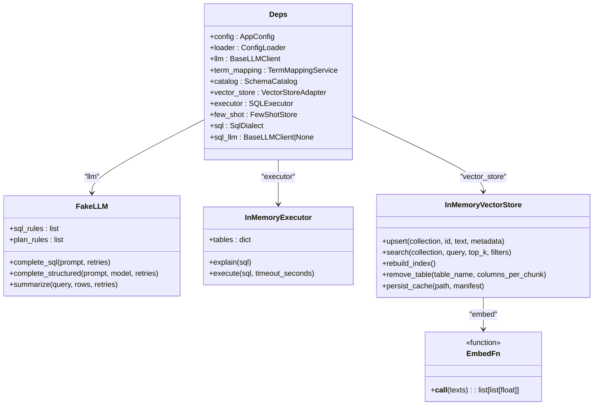
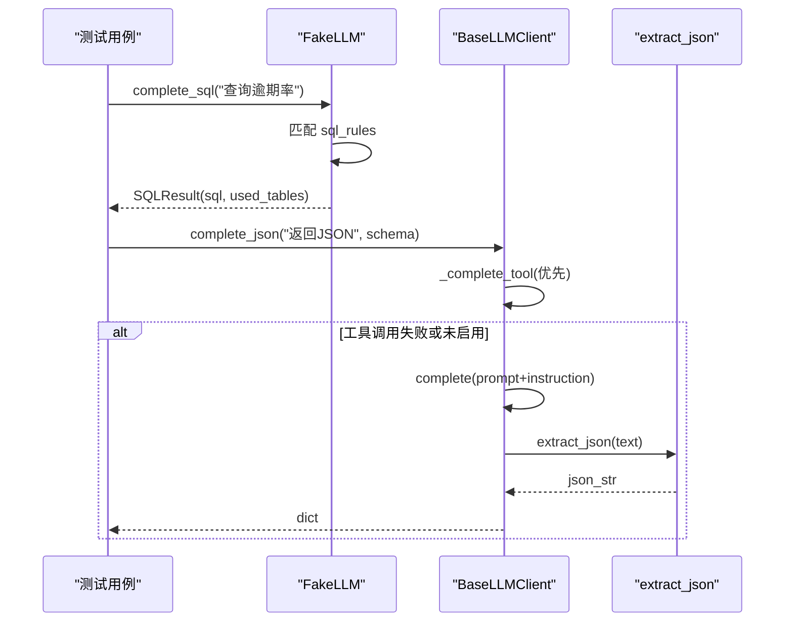
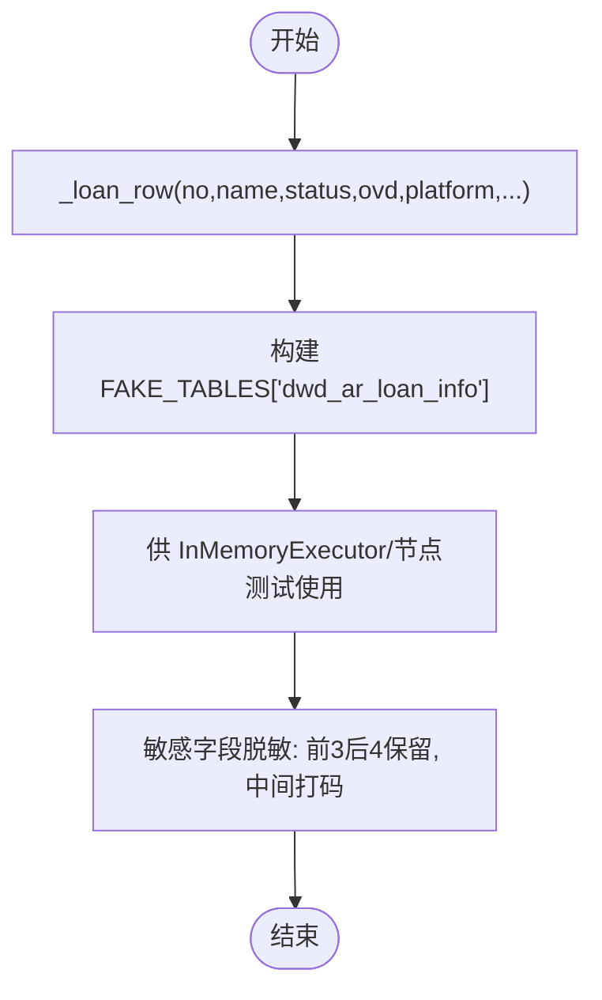
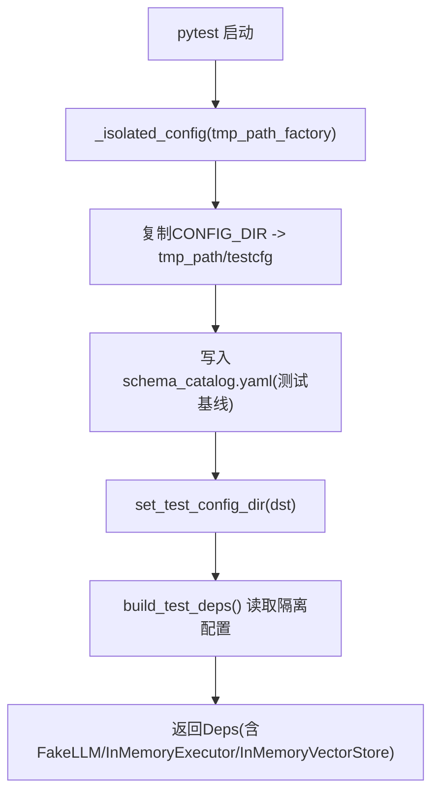
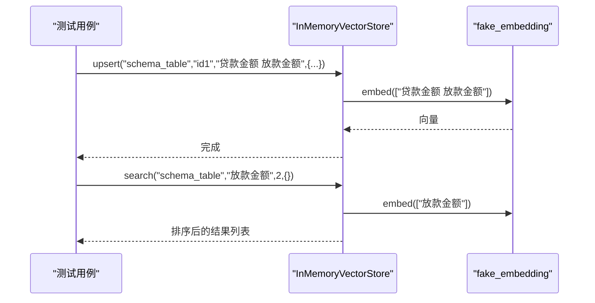
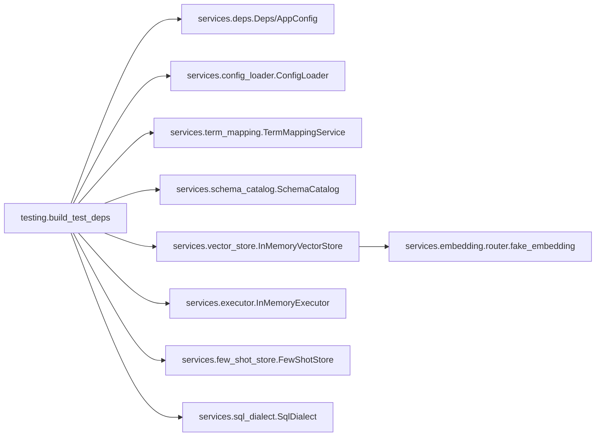

# 测试工具

<cite>
**本文引用的文件**   
- [nl2sql_agent/testing.py](file://nl2sql_agent/testing.py)
- [nl2sql_agent/tests/conftest.py](file://nl2sql_agent/tests/conftest.py)
- [nl2sql_agent/tests/test_llm.py](file://nl2sql_agent/tests/test_llm.py)
- [nl2sql_agent/tests/test_nodes.py](file://nl2sql_agent/tests/test_nodes.py)
- [nl2sql_agent/tests/test_schema_ingest.py](file://nl2sql_agent/tests/test_schema_ingest.py)
- [nl2sql_agent/tests/test_vector_store.py](file://nl2sql_agent/tests/test_vector_store.py)
- [nl2sql_agent/services/llm.py](file://nl2sql_agent/services/llm.py)
- [nl2sql_agent/services/deps.py](file://nl2sql_agent/services/deps.py)
- [nl2sql_agent/services/executor.py](file://nl2sql_agent/services/executor.py)
- [nl2sql_agent/services/vector_store/memory.py](file://nl2sql_agent/services/vector_store/memory.py)
- [nl2sql_agent/services/embedding/router.py](file://nl2sql_agent/services/embedding/router.py)
</cite>

## 目录
1. [简介](#简介)
2. [项目结构](#项目结构)
3. [核心组件](#核心组件)
4. [架构总览](#架构总览)
5. [详细组件分析](#详细组件分析)
6. [依赖关系分析](#依赖关系分析)
7. [性能考量](#性能考量)
8. [故障排查指南](#故障排查指南)
9. [结论](#结论)
10. [附录](#附录)

## 简介
本文件面向 NL2SQL 项目的测试工具库，系统性说明 testing.py 中的测试辅助函数与工具类，以及配套的 pytest 夹具、Mock/Stub 策略、测试数据生成、测试环境管理、调试与性能分析实践。重点覆盖：
- Mock/Stub 使用策略：外部服务模拟、数据库连接模拟、LLM API 模拟
- 测试数据生成：随机数据、边界值、真实数据脱敏
- 测试环境管理：配置隔离、环境变量管理、临时文件处理
- 调试与性能：日志记录、断点调试、性能分析
- 推荐与集成：第三方库集成与自定义工具开发指南
- 最佳实践与常见问题解决方案

## 项目结构
测试相关代码主要分布在 nl2sql_agent/testing.py（测试双打与依赖装配）与 nl2sql_agent/tests/（pytest 夹具与各模块测试）。核心依赖通过 services 层解耦，便于在测试中替换为内存实现或假实现。

图表来源
- [nl2sql_agent/tests/conftest.py:1-76](file://nl2sql_agent/tests/conftest.py#L1-L76)
- [nl2sql_agent/testing.py:1-187](file://nl2sql_agent/testing.py#L1-L187)
- [nl2sql_agent/services/deps.py:1-184](file://nl2sql_agent/services/deps.py#L1-L184)
- [nl2sql_agent/services/executor.py:1-200](file://nl2sql_agent/services/executor.py#L1-L200)
- [nl2sql_agent/services/vector_store/memory.py:1-197](file://nl2sql_agent/services/vector_store/memory.py#L1-L197)
- [nl2sql_agent/services/embedding/router.py:1-81](file://nl2sql_agent/services/embedding/router.py#L1-L81)
- [nl2sql_agent/services/llm.py:1-200](file://nl2sql_agent/services/llm.py#L1-L200)

章节来源
- [nl2sql_agent/tests/conftest.py:1-76](file://nl2sql_agent/tests/conftest.py#L1-L76)
- [nl2sql_agent/testing.py:1-187](file://nl2sql_agent/testing.py#L1-L187)

## 核心组件
- FakeLLM：按 prompt 正则匹配返回脚本化的 SQL/计划，支持结构化输出与摘要，用于完全离线测试。
- build_test_deps：构造不依赖外部服务的 Deps，注入 FakeLLM、InMemoryExecutor、InMemoryVectorStore 与确定性 embedding。
- FAKE_TABLES/_loan_row：借据表样例数据，含敏感字段脱敏示例。
- conftest 夹具：会话级隔离配置目录，覆盖 schema_catalog.yaml，提供 deps/graph/make_input 等常用夹具。
- InMemoryExecutor：内存执行器，支持模拟失败、空结果、EXPLAIN 行为，便于端到端流程验证。
- InMemoryVectorStore：内存向量存储，支持 upsert/search/rebuild_index/remove_table/persist_cache 等，配合 fake_embedding 进行确定性检索。
- extract_json：鲁棒的 JSON 提取工具，容忍 markdown 代码块与前后废话。

章节来源
- [nl2sql_agent/testing.py:26-187](file://nl2sql_agent/testing.py#L26-L187)
- [nl2sql_agent/tests/conftest.py:46-76](file://nl2sql_agent/tests/conftest.py#L46-L76)
- [nl2sql_agent/services/executor.py:161-205](file://nl2sql_agent/services/executor.py#L161-L205)
- [nl2sql_agent/services/vector_store/memory.py:21-197](file://nl2sql_agent/services/vector_store/memory.py#L21-L197)
- [nl2sql_agent/services/embedding/router.py:64-81](file://nl2sql_agent/services/embedding/router.py#L64-L81)
- [nl2sql_agent/services/llm.py:37-68](file://nl2sql_agent/services/llm.py#L37-L68)

## 架构总览
测试时通过 build_test_deps 将 LLM、执行器、向量存储、术语映射、Schema 目录、SQL 方言等统一装配到 Deps，从而在不连接真实外部服务的情况下运行完整图与节点逻辑。

图表来源
- [nl2sql_agent/services/deps.py:40-71](file://nl2sql_agent/services/deps.py#L40-L71)
- [nl2sql_agent/testing.py:26-66](file://nl2sql_agent/testing.py#L26-L66)
- [nl2sql_agent/services/executor.py:161-205](file://nl2sql_agent/services/executor.py#L161-L205)
- [nl2sql_agent/services/vector_store/memory.py:21-197](file://nl2sql_agent/services/vector_store/memory.py#L21-L197)
- [nl2sql_agent/services/embedding/router.py:18-18](file://nl2sql_agent/services/embedding/router.py#L18-L18)

## 详细组件分析

### FakeLLM 与 LLM 抽象
- FakeLLM 基于规则匹配 prompt，返回 SQLResult 或 Pydantic 模型实例；未命中则抛出异常，便于用例显式断言。
- BaseLLMClient 定义 complete/complete_json/complete_structured/complete_sql/summarize 接口，DeepSeek/Anthropic 客户端实现具体调用；测试用 FakeLLM 替换。
- extract_json 从任意文本中提取首个合法 JSON，兼容 markdown 代码块与前后废话。

图表来源
- [nl2sql_agent/testing.py:26-66](file://nl2sql_agent/testing.py#L26-L66)
- [nl2sql_agent/services/llm.py:70-160](file://nl2sql_agent/services/llm.py#L70-L160)
- [nl2sql_agent/services/llm.py:37-68](file://nl2sql_agent/services/llm.py#L37-L68)

章节来源
- [nl2sql_agent/testing.py:26-66](file://nl2sql_agent/testing.py#L26-L66)
- [nl2sql_agent/services/llm.py:70-160](file://nl2sql_agent/services/llm.py#L70-L160)
- [nl2sql_agent/services/llm.py:37-68](file://nl2sql_agent/services/llm.py#L37-L68)

### 测试数据生成与脱敏
- FAKE_TABLES/_loan_row：构造借据表样例行，包含姓名、证件号、金额等字段；证件号采用哈希与尾段拼接的脱敏方式，避免泄露真实信息。
- test_schema_ingest.py 中的 fetch_masked_sample_values：对敏感字段进行“前3后4保留、中间打码”的处理，确保注释草稿与样例值不含真实敏感数据。
- 边界值与覆盖率：通过控制 tables/samples/constraints/indexes 等输入，覆盖注释缺失、增量变更、删表清理等场景。

图表来源
- [nl2sql_agent/testing.py:68-85](file://nl2sql_agent/testing.py#L68-L85)
- [nl2sql_agent/tests/test_schema_ingest.py:185-203](file://nl2sql_agent/tests/test_schema_ingest.py#L185-L203)

章节来源
- [nl2sql_agent/testing.py:68-85](file://nl2sql_agent/testing.py#L68-L85)
- [nl2sql_agent/tests/test_schema_ingest.py:185-203](file://nl2sql_agent/tests/test_schema_ingest.py#L185-L203)

### 测试环境管理与配置隔离
- conftest._isolated_config：会话级自动夹具，复制 CONFIG_DIR 到 tmp_path，覆盖 schema_catalog.yaml，并通过 set_test_config_dir 指向隔离目录，避免被 ingest 脚本改写真实配置影响测试。
- build_test_deps：读取隔离目录 settings.yaml 并组装 Deps；默认使用 FakeLLM、InMemoryExecutor、InMemoryVectorStore(fake_embedding)。
- 环境变量：deps.load_env 加载 .env 文件；测试可通过 monkeypatch 设置/删除环境变量以验证 provider 选择与错误路径。

图表来源
- [nl2sql_agent/tests/conftest.py:46-56](file://nl2sql_agent/tests/conftest.py#L46-L56)
- [nl2sql_agent/testing.py:143-187](file://nl2sql_agent/testing.py#L143-L187)
- [nl2sql_agent/services/deps.py:32-38](file://nl2sql_agent/services/deps.py#L32-L38)

章节来源
- [nl2sql_agent/tests/conftest.py:46-56](file://nl2sql_agent/tests/conftest.py#L46-L56)
- [nl2sql_agent/testing.py:143-187](file://nl2sql_agent/testing.py#L143-L187)
- [nl2sql_agent/services/deps.py:32-38](file://nl2sql_agent/services/deps.py#L32-L38)

### 向量存储与语义检索测试
- InMemoryVectorStore：支持 upsert/search/rebuild_index/remove_table/persist_cache；search_scored 按 data_scope 过滤并返回带置信度的 SchemaHit。
- fake_embedding：确定性词袋向量，保证测试可复现且无需下载模型。
- 测试覆盖：适配器接口、语义检索行为、后端切换（memory/pgvector）、索引重建与缓存持久化。

图表来源
- [nl2sql_agent/services/vector_store/memory.py:21-197](file://nl2sql_agent/services/vector_store/memory.py#L21-L197)
- [nl2sql_agent/services/embedding/router.py:64-81](file://nl2sql_agent/services/embedding/router.py#L64-L81)
- [nl2sql_agent/tests/test_vector_store.py:12-68](file://nl2sql_agent/tests/test_vector_store.py#L12-L68)

章节来源
- [nl2sql_agent/services/vector_store/memory.py:21-197](file://nl2sql_agent/services/vector_store/memory.py#L21-L197)
- [nl2sql_agent/tests/test_vector_store.py:12-68](file://nl2sql_agent/tests/test_vector_store.py#L12-L68)

### 节点级测试与静态校验
- 术语解析、Schema 检索、复杂度检查、计划校验、静态校验（危险操作拦截、字段幻觉、别名处理、行级过滤注入）、敏感判定、澄清规则等均有独立用例覆盖。
- 通过 deps.term_mapping/catalog/vector_store/executor 等依赖，验证各节点在不同输入下的行为与边界条件。

章节来源
- [nl2sql_agent/tests/test_nodes.py:1-450](file://nl2sql_agent/tests/test_nodes.py#L1-L450)

### LLM 层测试与 Provider 选择
- 通过环境变量 LLM_PROVIDER/DEEPSEEK_API_KEY/ANTHROPIC_MODEL 等控制 provider 选择与错误路径。
- DeepSeek 客户端测试覆盖 complete_sql、complete_json（含 markdown 容错）、complete_structured（Pydantic 校验与重试）、多次解析失败抛错等。

章节来源
- [nl2sql_agent/tests/test_llm.py:1-166](file://nl2sql_agent/tests/test_llm.py#L1-L166)
- [nl2sql_agent/services/llm.py:1-200](file://nl2sql_agent/services/llm.py#L1-L200)

### 表结构入库验收测试
- FakeSchemaExecutor 模拟 information_schema 与数据取样，覆盖质量门控、审核队列、approve 覆盖层、脱敏、增量同步、删表清理、mschema 向量化、宽表文本生成、失败回退等场景。

章节来源
- [nl2sql_agent/tests/test_schema_ingest.py:1-394](file://nl2sql_agent/tests/test_schema_ingest.py#L1-L394)

## 依赖关系分析
- testing.build_test_deps 依赖 services.deps 的 AppConfig/Deps 与 config_loader，注入 term_mapping、catalog、vector_store、executor、few_shot、sql。
- vector_store 后端由 build_vector_store 根据 vector_store.yaml 选择 memory/pgvector；测试通过 fake_embedding 注入。
- executor 支持 MySQL/Postgres 只读执行与 InMemoryExecutor 测试模式。

图表来源
- [nl2sql_agent/testing.py:148-187](file://nl2sql_agent/testing.py#L148-L187)
- [nl2sql_agent/services/deps.py:113-184](file://nl2sql_agent/services/deps.py#L113-L184)
- [nl2sql_agent/services/vector_store/memory.py:21-197](file://nl2sql_agent/services/vector_store/memory.py#L21-L197)
- [nl2sql_agent/services/embedding/router.py:64-81](file://nl2sql_agent/services/embedding/router.py#L64-L81)

章节来源
- [nl2sql_agent/testing.py:148-187](file://nl2sql_agent/testing.py#L148-L187)
- [nl2sql_agent/services/deps.py:113-184](file://nl2sql_agent/services/deps.py#L113-L184)

## 性能考量
- 向量索引重建：InMemoryVectorStore.rebuild_index 用于 embedding 模型切换后全量重建；测试中验证重建后条目完整性。
- 缓存持久化：persist_cache 原子写入 vector-cache.json，重启后若语义哈希与模型签名一致则直接加载，减少重复计算。
- EXPLAIN 预估行数：InMemoryExecutor.explain_rows 可触发敏感判定/执行前拒绝；测试覆盖 fail_explain 与空结果场景。
- 确定性嵌入：fake_embedding 避免模型下载与网络开销，提升测试稳定性与速度。

章节来源
- [nl2sql_agent/services/vector_store/memory.py:166-197](file://nl2sql_agent/services/vector_store/memory.py#L166-L197)
- [nl2sql_agent/services/executor.py:161-205](file://nl2sql_agent/services/executor.py#L161-L205)
- [nl2sql_agent/services/embedding/router.py:64-81](file://nl2sql_agent/services/embedding/router.py#L64-L81)

## 故障排查指南
- LLM 结构化输出失败：检查 complete_json 的重试逻辑与 extract_json 的鲁棒性；确认模型是否回显 schema 定义或缺少必填字段。
- 向量检索为空：确认 _ensure_indexed 是否被调用、data_scope 过滤是否正确、embedding 签名与缓存是否一致。
- 执行器报错：InMemoryExecutor.fail_execute_times/fail_explain 用于模拟失败；生产环境需检查只读事务与超时设置。
- 配置隔离失效：确认 _isolated_config 是否在会话级生效，set_test_config_dir 是否正确指向 tmp_path。

章节来源
- [nl2sql_agent/services/llm.py:82-128](file://nl2sql_agent/services/llm.py#L82-L128)
- [nl2sql_agent/services/vector_store/memory.py:69-120](file://nl2sql_agent/services/vector_store/memory.py#L69-L120)
- [nl2sql_agent/services/executor.py:161-205](file://nl2sql_agent/services/executor.py#L161-L205)
- [nl2sql_agent/tests/conftest.py:46-56](file://nl2sql_agent/tests/conftest.py#L46-L56)

## 结论
NL2SQL 的测试工具库通过 FakeLLM、InMemoryExecutor、InMemoryVectorStore 与确定性 embedding，构建了完整的离线测试能力。配合 pytest 夹具与隔离配置，能够稳定、高效地覆盖从 LLM 抽象、Schema 检索、静态校验到向量存储与入库流程的全链路场景。建议在实际项目中沿用该模式，按需扩展 Mock/Stub 与测试数据生成策略，保持测试的可维护性与可复现性。

## 附录

### Mock/Stub 使用策略
- 外部服务模拟：使用 FakeSchemaExecutor 模拟 information_schema 与数据取样；通过 monkeypatch 替换 llm.get_model_for_node 以注入 FakeLLM。
- 数据库连接模拟：InMemoryExecutor 替代 MySQL/Postgres 执行器，支持 explain/execute 的行为定制与失败注入。
- LLM API 模拟：FakeLLM 按 prompt 正则返回 SQL/计划；BaseLLMClient 的 complete_json/complete_structured 提供统一接口。

章节来源
- [nl2sql_agent/tests/test_schema_ingest.py:38-106](file://nl2sql_agent/tests/test_schema_ingest.py#L38-L106)
- [nl2sql_agent/testing.py:26-66](file://nl2sql_agent/testing.py#L26-L66)
- [nl2sql_agent/services/executor.py:161-205](file://nl2sql_agent/services/executor.py#L161-L205)

### 测试数据生成工具
- 随机数据：_loan_row 构造多行借据数据，参数化金额、状态、平台等。
- 边界值：通过控制 explain_rows、fail_execute_times、empty_result、fail_explain 等参数覆盖边界与异常路径。
- 真实数据脱敏：fetch_masked_sample_values 对敏感字段进行前3后4保留、中间打码，确保注释草稿安全。

章节来源
- [nl2sql_agent/testing.py:68-85](file://nl2sql_agent/testing.py#L68-L85)
- [nl2sql_agent/tests/test_schema_ingest.py:185-203](file://nl2sql_agent/tests/test_schema_ingest.py#L185-L203)

### 测试环境管理工具
- 配置隔离：_isolated_config 复制 CONFIG_DIR 到 tmp_path，覆盖 schema_catalog.yaml，避免真实配置被改写。
- 环境变量管理：monkeypatch 设置/删除 LLM_PROVIDER、DEEPSEEK_API_KEY、ANTHROPIC_MODEL 等，验证 provider 选择与错误路径。
- 临时文件处理：tmp_path_factory 提供会话级临时目录，用于 review.db、manifest.json、vector-cache.json 等。

章节来源
- [nl2sql_agent/tests/conftest.py:46-56](file://nl2sql_agent/tests/conftest.py#L46-L56)
- [nl2sql_agent/tests/test_llm.py:19-51](file://nl2sql_agent/tests/test_llm.py#L19-L51)
- [nl2sql_agent/tests/test_schema_ingest.py:110-159](file://nl2sql_agent/tests/test_schema_ingest.py#L110-L159)

### 测试调试工具
- 日志记录：建议在测试中启用 Python logging，捕获关键步骤与异常堆栈。
- 断点调试：使用 pytest --pdb 或 IDE 断点，结合 deps 与 state 对象快速定位问题。
- 性能分析：使用 cProfile/py-spy 对向量重建、embedding 调用、SQL 执行路径进行分析。

[本节为通用指导，不直接分析具体文件]

### 第三方库集成与自定义工具开发指南
- 第三方库：sentence-transformers（本地 embedding）、psycopg/pymysql（数据库连接）、langgraph.checkpoint.memory（图状态保存）。
- 自定义工具：遵循 BaseLLMClient/VectorStoreAdapter/SQLExecutor 抽象，实现新的 provider/后端/执行器，并在 build_test_deps 中注入。

章节来源
- [nl2sql_agent/services/embedding/router.py:27-61](file://nl2sql_agent/services/embedding/router.py#L27-L61)
- [nl2sql_agent/services/deps.py:73-111](file://nl2sql_agent/services/deps.py#L73-L111)
- [nl2sql_agent/testing.py:148-187](file://nl2sql_agent/testing.py#L148-L187)

### 最佳实践与常见问题
- 最佳实践：
  - 所有外部依赖通过 Deps 注入，测试中替换为内存/假实现。
  - 使用隔离配置目录与 tmp_path，避免污染真实环境。
  - 使用确定性 embedding 与固定规则，保证测试可复现。
- 常见问题：
  - LLM 输出非 JSON：检查 extract_json 与重试逻辑，必要时调整 prompt。
  - 向量检索为空：确认 _ensure_indexed 与 data_scope 过滤。
  - 执行器超时/失败：检查 InMemoryExecutor 参数或生产端只读事务与超时设置。

[本节为通用指导，不直接分析具体文件]