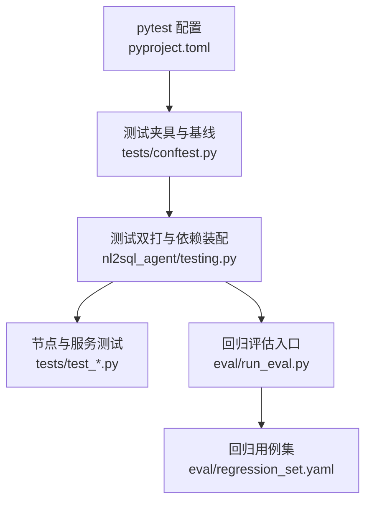
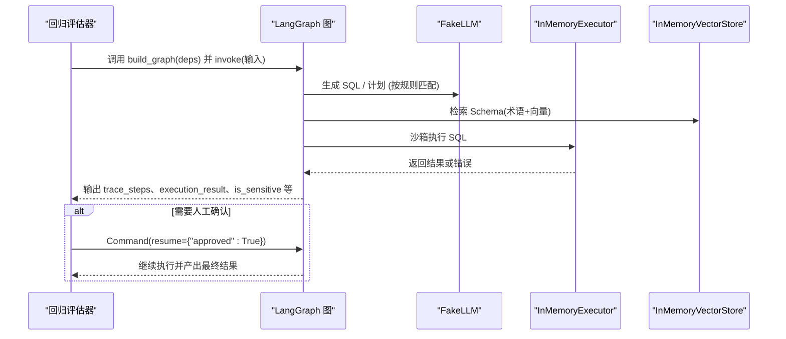
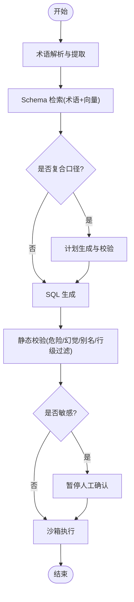
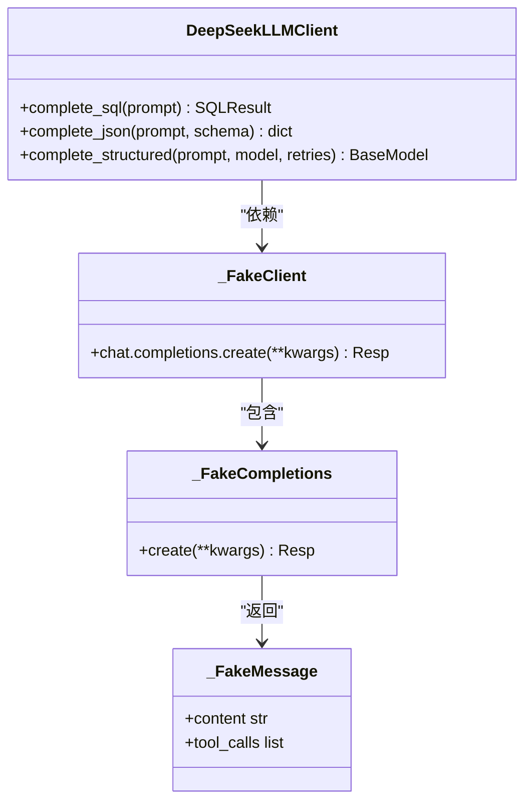
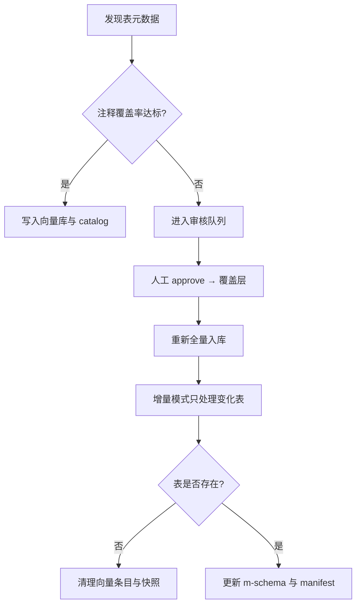
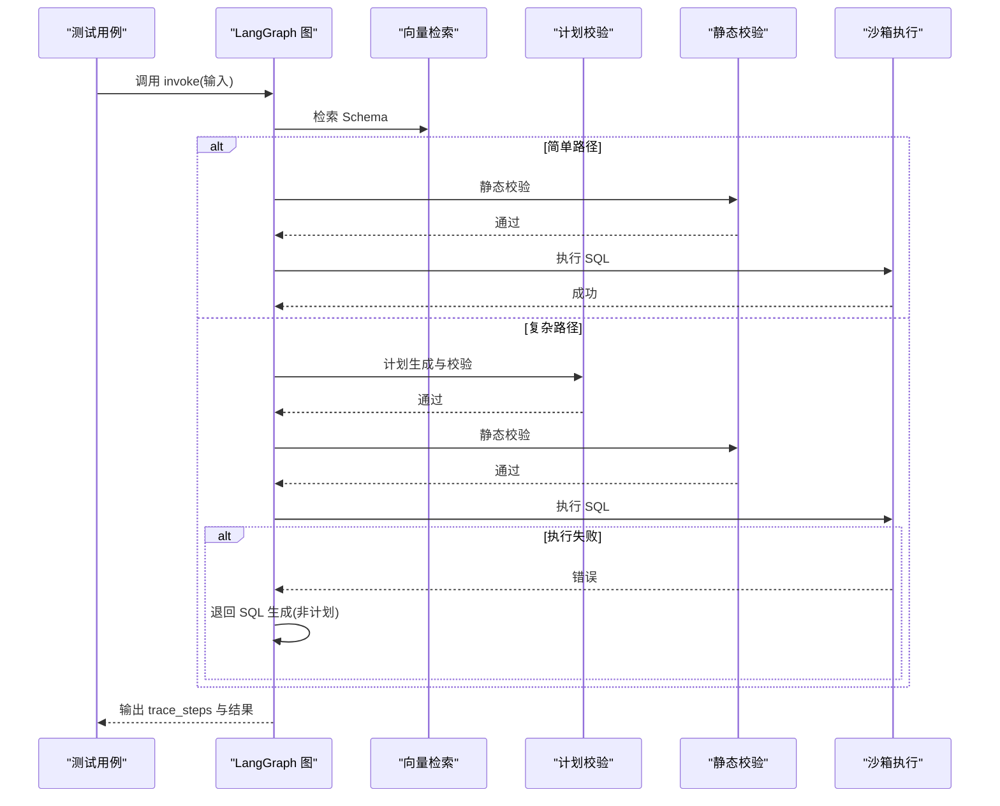
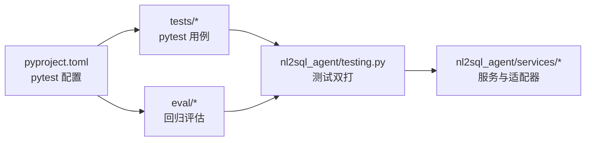

# 测试策略

<cite>
**本文引用的文件**   
- [pyproject.toml](file://pyproject.toml)
- [conftest.py](file://nl2sql_agent/tests/conftest.py)
- [testing.py](file://nl2sql_agent/testing.py)
- [test_nodes.py](file://nl2sql_agent/tests/test_nodes.py)
- [test_llm.py](file://nl2sql_agent/tests/test_llm.py)
- [test_schema_ingest.py](file://nl2sql_agent/tests/test_schema_ingest.py)
- [test_vector_store.py](file://nl2sql_agent/tests/test_vector_store.py)
- [run_eval.py](file://nl2sql_agent/eval/run_eval.py)
- [regression_set.yaml](file://nl2sql_agent/eval/regression_set.yaml)
- [test_architecture_hardening.py](file://nl2sql_agent/tests/test_architecture_hardening.py)
- [test_retrieval_confidence.py](file://nl2sql_agent/tests/test_retrieval_confidence.py)
- [test_routing.py](file://nl2sql_agent/tests/test_routing.py)
</cite>

## 目录
1. [引言](#引言)
2. [项目结构](#项目结构)
3. [核心组件](#核心组件)
4. [架构总览](#架构总览)
5. [详细组件分析](#详细组件分析)
6. [依赖关系分析](#依赖关系分析)
7. [性能与稳定性考量](#性能与稳定性考量)
8. [故障排查指南](#故障排查指南)
9. [结论](#结论)
10. [附录](#附录)

## 引言
本文件面向 NL2SQL 项目的测试体系，系统化阐述单元测试、集成测试与回归评估的策略与实践。内容覆盖：
- 单元测试框架与夹具设计（节点测试、服务测试、Mock 数据生成、测试环境隔离）
- 集成测试策略（端到端路由、向量检索、Schema 入库流水线）
- 回归评估（用例驱动、图执行断言、退出码规范）
- 覆盖率要求、测试数据管理与报告输出
- 自动化流程建议（持续集成、门禁、并行化）
- 最佳实践（用例设计、Mock 策略、数据准备）
- 工具推荐、调试技巧与常见问题解决方案
- 测试驱动开发（TDD）与测试重构建议

目标读者包括初学者与资深测试工程师，既帮助理解基础概念，也提供构建完整测试体系的实操指南。

## 项目结构
测试相关代码集中在 nl2sql_agent/tests 与 nl2sql_agent/eval 两个目录，配合 pyproject.toml 中的 pytest 配置与可选依赖。关键要点：
- pytest 入口与参数在 pyproject.toml 中声明，测试路径为 nl2sql_agent/tests
- 共享夹具与测试基线配置位于 tests/conftest.py，确保测试隔离与可重复性
- 测试双打与依赖装配位于 testing.py，提供 FakeLLM、内存执行器与向量存储
- 回归评估脚本 eval/run_eval.py 读取 regression_set.yaml，驱动 LangGraph 图执行并断言期望

**图表来源** 
- [pyproject.toml:41-44](file://pyproject.toml#L41-L44)
- [conftest.py:46-66](file://nl2sql_agent/tests/conftest.py#L46-L66)
- [testing.py:148-186](file://nl2sql_agent/testing.py#L148-L186)
- [run_eval.py:88-111](file://nl2sql_agent/eval/run_eval.py#L88-L111)
- [regression_set.yaml:1-31](file://nl2sql_agent/eval/regression_set.yaml#L1-L31)

**章节来源**
- [pyproject.toml:1-44](file://pyproject.toml#L1-L44)
- [conftest.py:1-76](file://nl2sql_agent/tests/conftest.py#L1-L76)
- [testing.py:1-187](file://nl2sql_agent/testing.py#L1-L187)
- [run_eval.py:1-111](file://nl2sql_agent/eval/run_eval.py#L1-L111)
- [regression_set.yaml:1-31](file://nl2sql_agent/eval/regression_set.yaml#L1-L31)

## 核心组件
- 测试夹具与隔离环境
  - 会话级自动夹具复制真实配置到临时目录，注入测试基线 schema_catalog，避免被外部脚本改写影响
  - 提供 deps 与 graph 夹具，统一构造 Deps 与带内存检查点的图实例
  - 提供 make_input 辅助函数，标准化输入构造（user_query、user_id、data_scope）

- 测试双打与依赖装配
  - FakeLLM：按 prompt 正则匹配返回 SQLResult 或结构化计划，支持 summarize 模板
  - InMemoryExecutor：基于 FAKE_TABLES 的内存执行器，支持空结果与失败次数控制
  - InMemoryVectorStore：确定性词袋 embedding，保证可复现与无需下载模型
  - build_test_deps：组装 ConfigLoader、AppConfig、TermMappingService、SchemaCatalog、vector_store、executor、few_shot、SqlDialect 等

- 回归评估
  - run_eval.py 读取 regression_set.yaml，逐条用例调用 build_graph(deps) 执行，自动处理澄清与低置信度分支，断言路径、计划、敏感性与执行结果
  - 退出码规范：全部通过返回 0，存在失败返回 1

**章节来源**
- [conftest.py:46-76](file://nl2sql_agent/tests/conftest.py#L46-L76)
- [testing.py:26-66](file://nl2sql_agent/testing.py#L26-L66)
- [testing.py:78-85](file://nl2sql_agent/testing.py#L78-L85)
- [testing.py:148-186](file://nl2sql_agent/testing.py#L148-L186)
- [run_eval.py:18-86](file://nl2sql_agent/eval/run_eval.py#L18-L86)
- [run_eval.py:88-111](file://nl2sql_agent/eval/run_eval.py#L88-L111)

## 架构总览
下图展示测试驱动下的 NL2SQL 图执行与断言流程，涵盖简单路径、复杂计划路径、敏感人工确认与重试回路。

**图表来源** 
- [run_eval.py:18-86](file://nl2sql_agent/eval/run_eval.py#L18-L86)
- [testing.py:26-66](file://nl2sql_agent/testing.py#L26-L66)
- [testing.py:148-186](file://nl2sql_agent/testing.py#L148-L186)

## 详细组件分析

### 单元测试框架与夹具
- 隔离配置与基线数据
  - 会话级夹具复制 CONFIG_DIR 到临时目录，写入测试基线 schema_catalog，确保所有测试使用一致的表结构与业务线归属
  - set_test_config_dir 切换测试配置目录，避免并发干扰

- 依赖与图的快速构造
  - deps 夹具通过 build_test_deps() 构造无外部依赖的 Deps
  - graph 夹具通过 build_graph(deps, checkpointer=InMemorySaver()) 构建可持久化的内存检查点图

- 输入构造
  - make_input 统一封装 user_query、user_id、data_scope，便于跨用例复用

**章节来源**
- [conftest.py:46-76](file://nl2sql_agent/tests/conftest.py#L46-L76)
- [testing.py:148-186](file://nl2sql_agent/testing.py#L148-L186)

### 节点测试（术语、检索、复杂度、计划校验、静态校验、敏感判定、澄清）
- 术语解析与提取
  - 验证全局与业务线专属术语映射、未收录术语的 NOT_FOUND 行为
- Schema 检索
  - 系统维度隔离、术语层优先、向量层补充、直接关联扩展
- 复杂度检查
  - 复合口径指标触发 is_complex=True；单表简单查询不复杂
- 计划校验
  - 字段与表引用一致性、metric_logic 定义一致性校验
- 静态校验
  - 危险操作拦截（如 DROP）、字段幻觉检测、别名处理、行级过滤注入
- 敏感判定
  - 金额聚合与敏感字段识别
- 澄清模块
  - 时间范围缺失拦截；阈值与可靠性规则生效

**图表来源** 
- [test_nodes.py:44-393](file://nl2sql_agent/tests/test_nodes.py#L44-L393)

**章节来源**
- [test_nodes.py:44-393](file://nl2sql_agent/tests/test_nodes.py#L44-L393)

### LLM 层测试（Provider 选择、客户端、结构化输出）
- Provider 选择与环境变量
  - 根据 LLM_PROVIDER 或 DEEPSEEK_API_KEY 自动选择 DeepSeek 或 Anthropic
- DeepSeek 客户端
  - 模拟 OpenAI 兼容端点，支持 tool_choice 与纯文本 fallback
  - JSON 提取鲁棒性（容忍 markdown 代码块与前后废话）
- 结构化输出
  - Pydantic 模型校验与重试机制，多次失败抛出异常

**图表来源** 
- [test_llm.py:55-112](file://nl2sql_agent/tests/test_llm.py#L55-L112)
- [test_llm.py:127-151](file://nl2sql_agent/tests/test_llm.py#L127-L151)

**章节来源**
- [test_llm.py:1-166](file://nl2sql_agent/tests/test_llm.py#L1-L166)

### 向量存储适配层测试
- 接口与语义检索
  - upsert/search 行为验证，filters 生效，重建索引完整性
- 后端显式切换
  - 通过配置 backend=memory/pgvector 切换实现类，缺 url 报错

**章节来源**
- [test_vector_store.py:1-68](file://nl2sql_agent/tests/test_vector_store.py#L1-L68)

### Schema 入库验收测试（质量门、审核队列、脱敏、增量同步、幽灵清理）
- 质量门判断
  - 注释齐全直接入库；不足进入审核队列，不入向量库
- 审核通过
  - approve 写覆盖层，重新入库使用覆盖注释
- 脱敏
  - 身份证样例值中间段打码，避免泄露
- 增量同步
  - 仅重处理变更表；删除表清理向量条目与快照
- m-schema 重写
  - 列分块写入时清理过期 chunk

**图表来源** 
- [test_schema_ingest.py:109-172](file://nl2sql_agent/tests/test_schema_ingest.py#L109-L172)
- [test_schema_ingest.py:196-233](file://nl2sql_agent/tests/test_schema_ingest.py#L196-L233)
- [test_schema_ingest.py:235-275](file://nl2sql_agent/tests/test_schema_ingest.py#L235-L275)

**章节来源**
- [test_schema_ingest.py:1-372](file://nl2sql_agent/tests/test_schema_ingest.py#L1-L372)

### 端到端路由与重试回路不变式
- 简单路径与复杂路径
  - 简单路径跳过计划；复杂路径走 plan_generation 与 plan_validation
- 字段幻觉与执行错误
  - 静态校验失败退回 SQL 生成；执行错误退回 SQL 生成而非计划路径
- 系统隔离
  - data_scope 决定可检索的业务线
- 敏感与人工确认
  - 金额聚合触发敏感，停在 human_review，需 approved 才继续
- 重试边界
  - 计划循环仅在 5b↔6 内；执行打满重试后降级，避免死循环

**图表来源** 
- [test_routing.py:26-215](file://nl2sql_agent/tests/test_routing.py#L26-L215)

**章节来源**
- [test_routing.py:1-215](file://nl2sql_agent/tests/test_routing.py#L1-L215)

### 检索置信度路由验收
- 新指标不被模块 2 拦截，走到检索/3.5
- 多相近候选触发候选澄清，选定后回到模块 3 不再重复
- 低置信用户选择继续 → 强制计划路径与强制人工确认
- 高置信单一候选直接放行
- 缺时间范围仍在模块 2 拦截

**章节来源**
- [test_retrieval_confidence.py:1-159](file://nl2sql_agent/tests/test_retrieval_confidence.py#L1-L159)

### 架构加固测试（重试反馈、Prompt 安全、风险三态、强类型计划、持久化 Checkpoint）
- 重试 Prompt 包含前次失败信息
- Prompt 不暴露 data_scope 作为行级过滤值
- 启用行级过滤但未提供可信值则阻断
- 强类型计划拒绝未知操作符与 join 所有权校验
- SQLite Checkpoint 重启后可恢复状态

**章节来源**
- [test_architecture_hardening.py:1-156](file://nl2sql_agent/tests/test_architecture_hardening.py#L1-L156)

## 依赖关系分析
- 测试依赖与运行配置
  - pytest 作为测试框架，测试路径与选项在 pyproject.toml 中声明
  - 可选依赖 dev 包含 pytest
- 运行时依赖
  - langgraph、langgraph-checkpoint、pydantic、sqlglot、anthropic、openai、PyYAML、python-dotenv、数据库驱动、fastapi、uvicorn、sentence-transformers、modelscope、sqlite checkpoint

**图表来源** 
- [pyproject.toml:25-44](file://pyproject.toml#L25-L44)
- [testing.py:148-186](file://nl2sql_agent/testing.py#L148-L186)

**章节来源**
- [pyproject.toml:1-44](file://pyproject.toml#L1-L44)

## 性能与稳定性考量
- 向量检索性能
  - 使用 InMemoryVectorStore 与确定性词袋 embedding，避免模型下载与网络开销，提升可复现性与速度
- 执行器与重试
  - InMemoryExecutor 支持空结果与失败次数控制，避免无限重试；打满重试后降级，保障稳定性
- 增量同步
  - 仅处理变更表，减少不必要的向量写入与 catalog 更新
- 检查点持久化
  - SQLite Checkpoint 支持中断恢复，提高长链路任务的可恢复性

[本节为通用指导，不直接分析具体文件]

## 故障排查指南
- 常见错误定位
  - 字段幻觉与别名误判：检查静态校验逻辑与别名注入规则
  - 计划校验失败：核对 target_tables、join 左/右表字段归属与 metric_logic 定义一致性
  - 敏感判定误报：检查金额聚合与敏感字段规则
  - 向量检索无关命中：调整相似度阈值或增加业务线过滤
- 调试技巧
  - 使用 trace_steps 与 final_answer 定位失败阶段
  - 借助 FakeLLM 的规则顺序与正则匹配，逐步缩小问题范围
  - 通过 InMemorySaver 与 SQLite Checkpoint 查看中间状态
- 常见问题解决方案
  - 环境变量缺失导致 Provider 选择失败：设置 LLM_PROVIDER 或对应 API Key
  - 行级过滤未生效：确保 enabled 且提供可信权限值
  - 审核队列未推进：检查 approve 流程与覆盖层写入

**章节来源**
- [test_nodes.py:208-321](file://nl2sql_agent/tests/test_nodes.py#L208-L321)
- [test_architecture_hardening.py:50-92](file://nl2sql_agent/tests/test_architecture_hardening.py#L50-L92)
- [test_routing.py:144-215](file://nl2sql_agent/tests/test_routing.py#L144-L215)

## 结论
本项目构建了完善的测试体系：以 pytest 为核心，结合 conftest 夹具与 testing.py 双打，实现了从单元到端到端的全面覆盖。回归评估脚本驱动 LangGraph 图执行，严格断言路径、计划、敏感性与执行结果。通过内存执行器、内存向量存储与确定性嵌入，保证了测试的可复现性与高性能。建议在 CI 中引入并行执行与门禁，结合覆盖率统计与报告生成，进一步提升质量保障能力。

[本节为总结性内容，不直接分析具体文件]

## 附录

### 测试覆盖率要求
- 建议目标
  - 单元测试覆盖率 ≥ 80%
  - 关键路径（检索、计划、静态校验、敏感判定、执行）覆盖率 ≥ 90%
- 度量方式
  - 使用 pytest-cov 或类似工具生成覆盖率报告，关注分支与语句覆盖
- 报告输出
  - 将覆盖率报告与回归评估结果归档，纳入发布前门禁

[本节为通用指导，不直接分析具体文件]

### 测试数据管理
- 基线数据
  - 使用 conftest 中的 _TEST_SCHEMA 固定借据表结构与业务线归属
- 样例数据
  - FAKE_TABLES 提供稳定的样例记录，支持空结果与失败场景
- 脱敏与合规
  - 身份证等敏感字段样例值进行中间段打码，避免泄露

**章节来源**
- [conftest.py:19-43](file://nl2sql_agent/tests/conftest.py#L19-L43)
- [testing.py:78-85](file://nl2sql_agent/testing.py#L78-L85)
- [test_schema_ingest.py:176-194](file://nl2sql_agent/tests/test_schema_ingest.py#L176-L194)

### 测试报告生成
- 回归评估报告
  - run_eval.py 打印每条用例 PASS/FAIL 与断言摘要，退出码指示整体结果
- 覆盖率报告
  - 建议集成 pytest-cov，输出 HTML 与 XML 报告，便于 CI 解析与归档

**章节来源**
- [run_eval.py:88-111](file://nl2sql_agent/eval/run_eval.py#L88-L111)

### 测试自动化流程（CI、门禁、并行）
- 建议流程
  - 安装依赖 → 运行 pytest（含覆盖率）→ 运行回归评估 → 生成报告 → 门禁判定
- 并行化
  - 使用 pytest-xdist 并行执行测试用例，缩短反馈时间
- 门禁规则
  - 覆盖率阈值、回归通过率、关键路径断言均须通过

[本节为通用指导，不直接分析具体文件]

### 最佳实践（用例设计、Mock 策略、数据准备）
- 用例设计
  - 覆盖正常路径、边界条件、异常分支与重试回路不变式
- Mock 策略
  - 使用 FakeLLM 与 InMemoryExecutor，避免外部依赖；必要时替换 vector_store 后端
- 数据准备
  - 使用基线与样例数据，确保可复现；敏感数据脱敏处理

**章节来源**
- [testing.py:26-66](file://nl2sql_agent/testing.py#L26-L66)
- [test_schema_ingest.py:176-194](file://nl2sql_agent/tests/test_schema_ingest.py#L176-L194)

### 工具推荐
- 测试框架：pytest
- 覆盖率：pytest-cov
- 并行：pytest-xdist
- 向量存储：InMemoryVectorStore（测试）、PgVectorStore（生产）
- 检查点：SQLite Checkpoint（持久化）

**章节来源**
- [pyproject.toml:25-44](file://pyproject.toml#L25-L44)
- [test_vector_store.py:44-68](file://nl2sql_agent/tests/test_vector_store.py#L44-L68)

### 调试技巧与常见问题
- 调试技巧
  - 打印 trace_steps 与 final_answer；使用 InMemorySaver 查看中间状态
- 常见问题
  - Provider 选择失败：检查环境变量
  - 行级过滤未生效：确保可信权限值
  - 计划校验失败：核对表与字段归属

**章节来源**
- [test_architecture_hardening.py:50-92](file://nl2sql_agent/tests/test_architecture_hardening.py#L50-L92)
- [test_routing.py:144-215](file://nl2sql_agent/tests/test_routing.py#L144-L215)

### 测试驱动开发（TDD）与测试重构建议
- TDD 实践
  - 先写失败的用例，再实现最小可用功能，逐步完善
- 重构建议
  - 拆分大用例为小用例；抽取公共夹具与辅助函数；保持 Mock 稳定与可维护

[本节为通用指导，不直接分析具体文件]