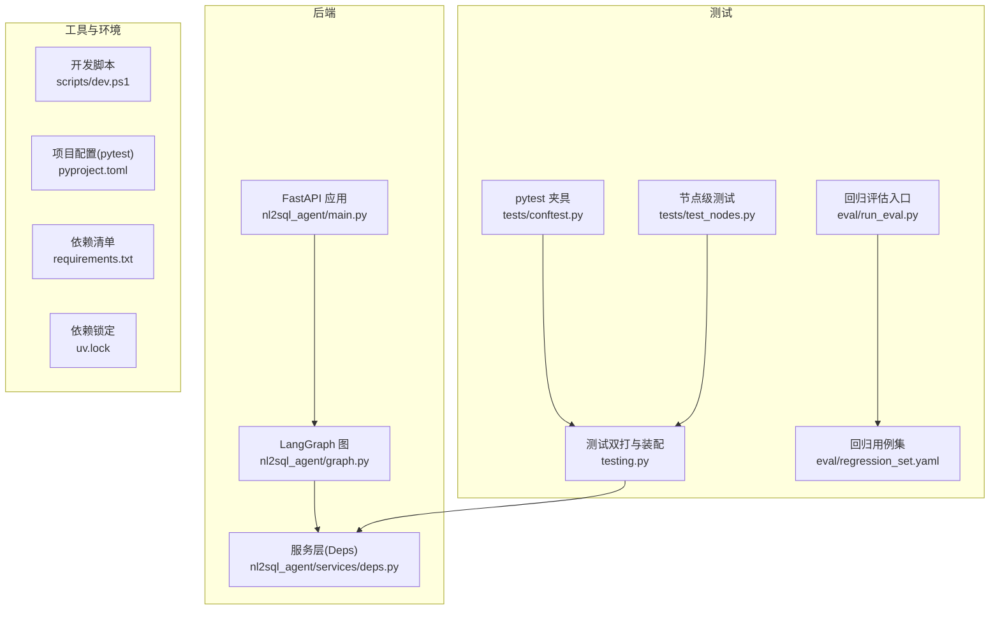
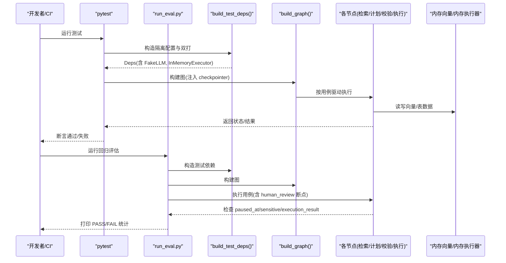
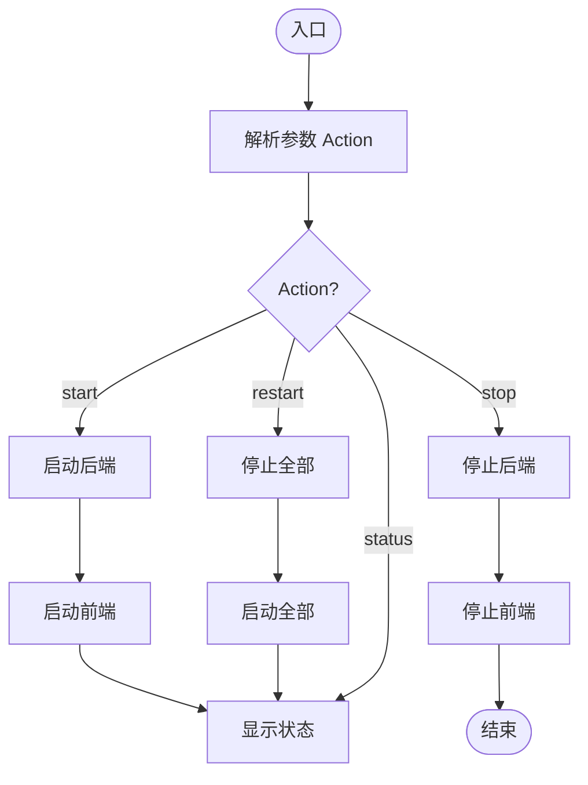
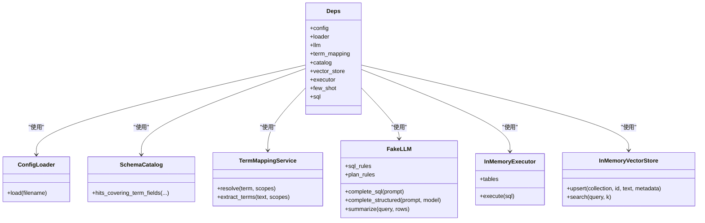
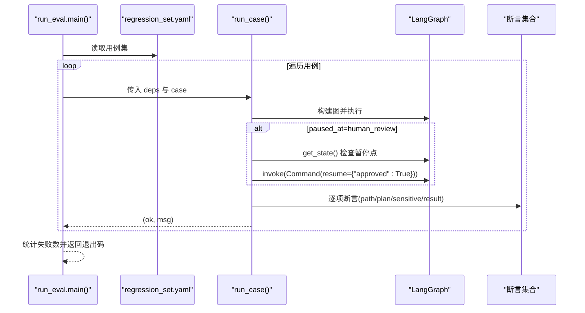
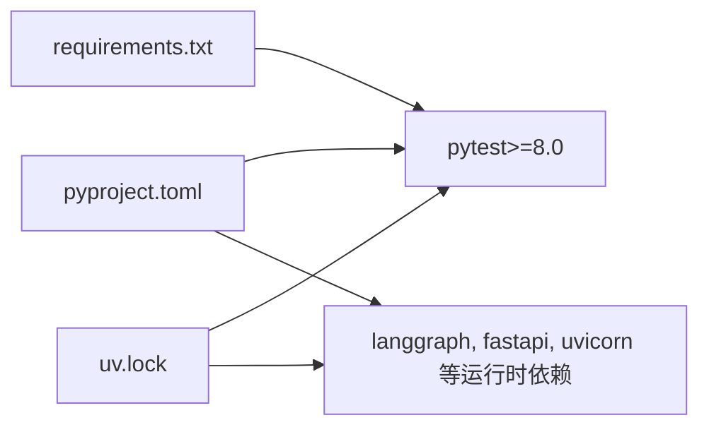

# 测试自动化

<cite>
**本文引用的文件**   
- [scripts/dev.ps1](file://scripts/dev.ps1)
- [pyproject.toml](file://pyproject.toml)
- [requirements.txt](file://requirements.txt)
- [uv.lock](file://uv.lock)
- [nl2sql_agent/tests/conftest.py](file://nl2sql_agent/tests/conftest.py)
- [nl2sql_agent/testing.py](file://nl2sql_agent/testing.py)
- [nl2sql_agent/eval/run_eval.py](file://nl2sql_agent/eval/run_eval.py)
- [nl2sql_agent/eval/regression_set.yaml](file://nl2sql_agent/eval/regression_set.yaml)
- [nl2sql_agent/tests/test_nodes.py](file://nl2sql_agent/tests/test_nodes.py)
</cite>

## 目录
1. [简介](#简介)
2. [项目结构](#项目结构)
3. [核心组件](#核心组件)
4. [架构总览](#架构总览)
5. [详细组件分析](#详细组件分析)
6. [依赖分析](#依赖分析)
7. [性能考虑](#性能考虑)
8. [故障排查指南](#故障排查指南)
9. [结论](#结论)
10. [附录](#附录)

## 简介
本文件面向测试自动化与持续集成（CI/CD）实践，围绕 NL2SQL 项目的测试体系进行系统化说明。内容涵盖：
- 开发环境一键启停与状态管理（PowerShell 脚本 dev.ps1）
- 基于 pytest 的单元测试与回归评估框架
- 无外部依赖的双打（FakeLLM、InMemoryExecutor、内存向量存储）保障可重复执行
- 回归用例集驱动的执行流程与人工确认（human_review）断点
- 在 CI/CD 中如何组织并行、选择性、增量测试
- 报告与门禁策略建议（HTML、JUnit、覆盖率）
- 测试环境管理、依赖锁定与数据备份策略
- 最佳实践、故障排查与性能优化建议

## 项目结构
本项目采用 Python + FastAPI 后端与 Vite 前端双进程开发模式，测试集中在 nl2sql_agent/tests 与 nl2sql_agent/eval 两个目录：
- tests：pytest 单元与节点级测试，使用共享夹具与隔离配置
- eval：回归评估脚本，基于 regression_set.yaml 驱动端到端验收用例
- scripts：Windows 下的一键开发脚本（dev.ps1），用于启动/停止/重启前后端并输出日志
- pyproject.toml：定义项目元信息、依赖、构建系统与 pytest 配置
- requirements.txt：Python 依赖清单（含 pytest）
- uv.lock：依赖版本锁定（由 uv 生成）

图表来源 
- [scripts/dev.ps1:1-134](file://scripts/dev.ps1#L1-L134)
- [pyproject.toml:1-44](file://pyproject.toml#L1-L44)
- [nl2sql_agent/tests/conftest.py:1-76](file://nl2sql_agent/tests/conftest.py#L1-L76)
- [nl2sql_agent/testing.py:1-187](file://nl2sql_agent/testing.py#L1-L187)
- [nl2sql_agent/eval/run_eval.py:72-110](file://nl2sql_agent/eval/run_eval.py#L72-L110)
- [nl2sql_agent/eval/regression_set.yaml:1-31](file://nl2sql_agent/eval/regression_set.yaml#L1-L31)

章节来源
- [scripts/dev.ps1:1-134](file://scripts/dev.ps1#L1-L134)
- [pyproject.toml:1-44](file://pyproject.toml#L1-L44)
- [requirements.txt:1-15](file://requirements.txt#L1-L15)
- [uv.lock:1284-1473](file://uv.lock#L1284-L1473)

## 核心组件
- 开发环境脚本 dev.ps1
  - 功能：启动/停止/重启后端（uvicorn）与前端（Vite），端口监听等待与日志输出，状态查询
  - 关键特性：端口占用检测、超时控制、隐藏窗口后台运行、错误日志分离
- 测试基础设施
  - conftest.py：会话级隔离配置目录，注入 Fake 双打下的 Deps 与编译好的 LangGraph 图
  - testing.py：FakeLLM、InMemoryExecutor、内存向量存储与 TermMappingService 等依赖装配
- 回归评估
  - run_eval.py：读取 regression_set.yaml，逐条执行并断言路径、敏感规则、暂停点与执行结果
  - regression_set.yaml：用例描述（id、user_query、data_scope、expect）

章节来源
- [scripts/dev.ps1:1-134](file://scripts/dev.ps1#L1-L134)
- [nl2sql_agent/tests/conftest.py:1-76](file://nl2sql_agent/tests/conftest.py#L1-L76)
- [nl2sql_agent/testing.py:1-187](file://nl2sql_agent/testing.py#L1-L187)
- [nl2sql_agent/eval/run_eval.py:72-110](file://nl2sql_agent/eval/run_eval.py#L72-L110)
- [nl2sql_agent/eval/regression_set.yaml:1-31](file://nl2sql_agent/eval/regression_set.yaml#L1-L31)

## 架构总览
下图展示测试执行的关键调用链：从 pytest 或回归评估入口到依赖装配、图构建与执行，再到结果断言。

图表来源 
- [nl2sql_agent/tests/conftest.py:46-66](file://nl2sql_agent/tests/conftest.py#L46-L66)
- [nl2sql_agent/testing.py:148-187](file://nl2sql_agent/testing.py#L148-L187)
- [nl2sql_agent/eval/run_eval.py:72-110](file://nl2sql_agent/eval/run_eval.py#L72-L110)

## 详细组件分析

### PowerShell 开发脚本 dev.ps1
- 作用域与参数
  - Action：start/stop/restart/status
  - 端口：后端 8000，前端 5173
  - 日志：logs/backend.log、backend.err.log、frontend.log、frontend.err.log
- 关键函数
  - Get-PidByPort：根据端口获取 PID
  - Wait-PortFree/Wait-PortUp：端口释放/监听等待
  - Start-Backend/Start-Frontend：后台启动 uvicorn 与 vite，重定向标准输出/错误
  - Stop-Service：强制终止进程并等待端口释放
  - Show-Status：输出当前运行状态与访问地址
- 使用方式
  - 启动：powershell -File scripts/dev.ps1 start
  - 停止：powershell -File scripts/dev.ps1 stop
  - 重启：powershell -File scripts/dev.ps1 restart
  - 状态：powershell -File scripts/dev.ps1 status

图表来源 
- [scripts/dev.ps1:14-17](file://scripts/dev.ps1#L14-L17)
- [scripts/dev.ps1:56-88](file://scripts/dev.ps1#L56-L88)
- [scripts/dev.ps1:90-109](file://scripts/dev.ps1#L90-L109)
- [scripts/dev.ps1:111-133](file://scripts/dev.ps1#L111-L133)

章节来源
- [scripts/dev.ps1:1-134](file://scripts/dev.ps1#L1-L134)

### 测试夹具与依赖装配（conftest.py 与 testing.py）
- 隔离配置
  - 会话级 fixture 复制真实配置目录到临时目录，覆盖 schema_catalog.yaml，避免被 ingest 脚本改写影响测试
  - set_test_config_dir 切换配置根目录
- 依赖装配
  - build_test_deps：加载 settings.yaml 与规则 YAML，组装 AppConfig、TermMappingService、SchemaCatalog、FakeLLM、InMemoryExecutor、InMemoryVectorStore 等
  - 默认 FakeLLM 规则：基于正则匹配 prompt，返回 SQLResult 或结构化 plan
- 图构建
  - graph fixture：使用 InMemorySaver 作为 checkpointer，确保测试间隔离与可重复

图表来源 
- [nl2sql_agent/testing.py:26-66](file://nl2sql_agent/testing.py#L26-L66)
- [nl2sql_agent/testing.py:148-187](file://nl2sql_agent/testing.py#L148-L187)
- [nl2sql_agent/tests/conftest.py:46-66](file://nl2sql_agent/tests/conftest.py#L46-L66)

章节来源
- [nl2sql_agent/tests/conftest.py:1-76](file://nl2sql_agent/tests/conftest.py#L1-L76)
- [nl2sql_agent/testing.py:1-187](file://nl2sql_agent/testing.py#L1-L187)

### 回归评估（run_eval.py 与 regression_set.yaml）
- 执行流程
  - 读取 regression_set.yaml 中的 cases
  - 对每个 case 构建输入（user_query、user_id、data_scope）
  - 构建图并执行，断言 path、plan_passed、sensitive、paused_at、execution_result_nonempty 等
  - 当 expect.paused_at == "human_review" 时，首次调用应停在 human_review；随后 resume 并验证最终执行结果
- 输出
  - 每条用例打印 PASS/FAIL 与简要消息
  - 汇总统计并返回非零退出码表示失败

图表来源 
- [nl2sql_agent/eval/run_eval.py:72-110](file://nl2sql_agent/eval/run_eval.py#L72-L110)
- [nl2sql_agent/eval/regression_set.yaml:1-31](file://nl2sql_agent/eval/regression_set.yaml#L1-L31)

章节来源
- [nl2sql_agent/eval/run_eval.py:72-110](file://nl2sql_agent/eval/run_eval.py#L72-L110)
- [nl2sql_agent/eval/regression_set.yaml:1-31](file://nl2sql_agent/eval/regression_set.yaml#L1-L31)

### 节点级测试示例（test_nodes.py）
- 覆盖范围
  - 术语映射与提取
  - Schema 检索（系统隔离、向量+术语混合检索、列向量索引、关系桥接表补充）
  - 候选接近度与动态权重
- 设计要点
  - 使用 make_input 构造统一输入
  - 通过 deps.catalog._tables_by_line 注入额外表定义以验证跨表覆盖
  - 通过 monkeypatch 替换向量源以模拟关系数据

章节来源
- [nl2sql_agent/tests/test_nodes.py:1-200](file://nl2sql_agent/tests/test_nodes.py#L1-L200)

## 依赖分析
- 构建与依赖管理
  - pyproject.toml：声明依赖、可选依赖 dev（包含 pytest）、pytest 配置（testpaths、addopts）
  - requirements.txt：Python 依赖清单（含 pytest）
  - uv.lock：锁定依赖版本，保证 CI 与本地一致
- 测试相关依赖
  - pytest 及其插件（pluggy、packaging 等）
  - python-dotenv、PyYAML 等

图表来源 
- [pyproject.toml:1-44](file://pyproject.toml#L1-L44)
- [requirements.txt:1-15](file://requirements.txt#L1-L15)
- [uv.lock:1284-1473](file://uv.lock#L1284-L1473)

章节来源
- [pyproject.toml:1-44](file://pyproject.toml#L1-L44)
- [requirements.txt:1-15](file://requirements.txt#L1-L15)
- [uv.lock:1284-1473](file://uv.lock#L1284-L1473)

## 性能考虑
- 测试执行
  - 使用内存向量与内存执行器，避免 I/O 瓶颈
  - 合理设置 top_k、limit、timeout_seconds 等参数，减少不必要计算
- 并发与并行
  - pytest-xdist 可用于并行测试（需安装并在 CI 启用）
  - 将独立模块测试分组，避免共享状态竞争
- 资源隔离
  - 会话级隔离配置目录，避免磁盘写入冲突
  - 使用 InMemorySaver 作为 checkpointer，避免持久化开销

[本节为通用指导，不直接分析具体文件]

## 故障排查指南
- 端口占用与启动失败
  - 使用 dev.ps1 的 status 查看端口监听情况
  - 若端口未释放，stop 后等待超时提示，检查 logs 目录下的 .err.log
- 测试失败定位
  - 优先检查 conftest 的隔离配置是否生效（tmp_path_factory 生成的目录）
  - 核对 FakeLLM 的规则是否匹配 prompt 正则
  - 检查 regression_set.yaml 的 expect 字段与实际行为是否一致
- 回归评估异常
  - 关注 paused_at=human_review 分支，确认 resume 逻辑是否触发
  - 检查 sensitive 规则是否命中导致中断

章节来源
- [scripts/dev.ps1:90-109](file://scripts/dev.ps1#L90-L109)
- [nl2sql_agent/tests/conftest.py:46-56](file://nl2sql_agent/tests/conftest.py#L46-L56)
- [nl2sql_agent/testing.py:47-66](file://nl2sql_agent/testing.py#L47-L66)
- [nl2sql_agent/eval/run_eval.py:72-85](file://nl2sql_agent/eval/run_eval.py#L72-L85)

## 结论
本项目已具备完善的测试基础设施与回归评估能力，借助隔离配置与双打实现稳定、可重复的测试执行。结合 CI/CD 平台，可通过并行、选择性与增量策略提升效率，并通过报告与门禁机制保障质量。建议在后续迭代中完善覆盖率统计与 HTML/JUnit 报告集成，形成闭环的质量保障体系。

[本节为总结性内容，不直接分析具体文件]

## 附录

### 持续集成（CI/CD）建议
- 平台选择
  - GitHub Actions：使用 actions/setup-python 安装依赖，uv 或 pip 安装依赖，pytest 执行测试，run_eval.py 执行回归
- 缓存与依赖锁定
  - 缓存 uv 或 pip 依赖目录，加速构建
  - 始终使用 uv.lock 或 requirements.txt 锁定版本
- 并行与选择性测试
  - 使用 pytest -n auto 并行执行
  - 使用 -k 表达式或 --ignore 仅运行变更文件相关测试
- 增量测试
  - 基于 git diff 识别变更模块，仅运行受影响测试
- 报告与归档
  - 生成 JUnit XML（pytest --junitxml=reports/junit.xml）
  - 生成 HTML 报告（pytest-html 或 allure）
  - 上传报告至 CI 工件或平台内置报告视图
- 门禁策略
  - 所有测试必须通过
  - 覆盖率阈值（如行覆盖率≥80%）
  - 回归评估必须全部通过（包括 human_review 分支）

[本节为通用指导，不直接分析具体文件]

### 测试执行策略
- 并行测试
  - 使用 pytest-xdist，按模块划分工作进程
  - 避免共享全局状态，确保线程安全
- 选择性测试
  - 使用 -k 过滤用例名或标记
  - 使用 --ignore 排除无关目录
- 增量测试
  - 基于 git diff 与 pytest-select 或自定义脚本仅运行变更文件

[本节为通用指导，不直接分析具体文件]

### 测试报告与覆盖率
- JUnit 格式
  - pytest --junitxml=reports/junit.xml
- HTML 报告
  - pytest-html 或 allure 生成可视化报告
- 覆盖率统计
  - coverage run -m pytest && coverage report/html
  - 设置阈值并在 CI 阻断失败

[本节为通用指导，不直接分析具体文件]

### 测试环境管理与数据备份
- 环境管理
  - 使用 uv 或 venv 创建隔离环境
  - 使用 .env 管理环境变量（数据库连接、密钥等）
- 依赖版本锁定
  - 使用 uv.lock 或 requirements.txt 锁定版本
- 测试数据备份
  - 使用临时目录与内存存储，避免污染真实数据
  - 如需持久化，定期备份快照并清理

[本节为通用指导，不直接分析具体文件]

### 最佳实践
- 测试隔离：会话级隔离配置与内存存储
- 确定性：FakeLLM 规则与固定种子确保可重复
- 可读性：清晰的用例命名与断言消息
- 可维护性：集中化的依赖装配与夹具
- 安全性：敏感字段与权限隔离在测试中同样验证

[本节为通用指导，不直接分析具体文件]