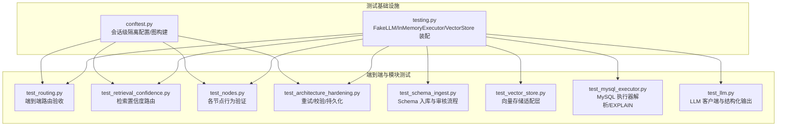
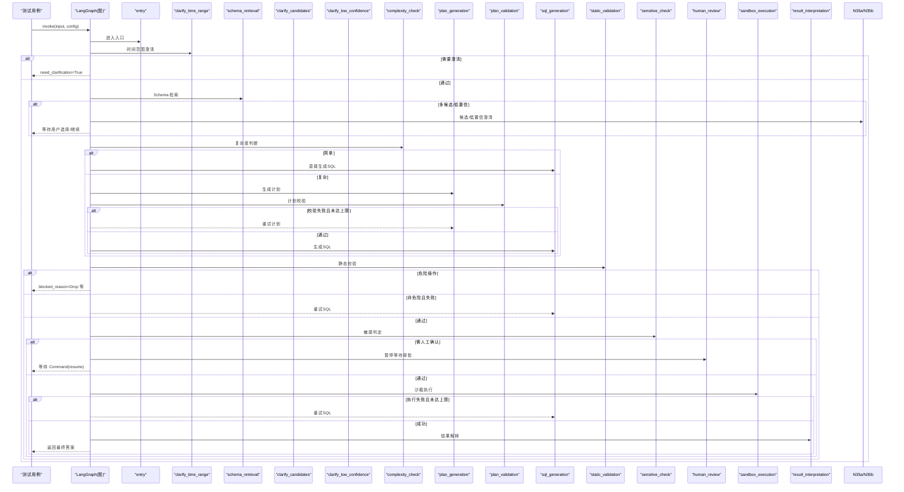
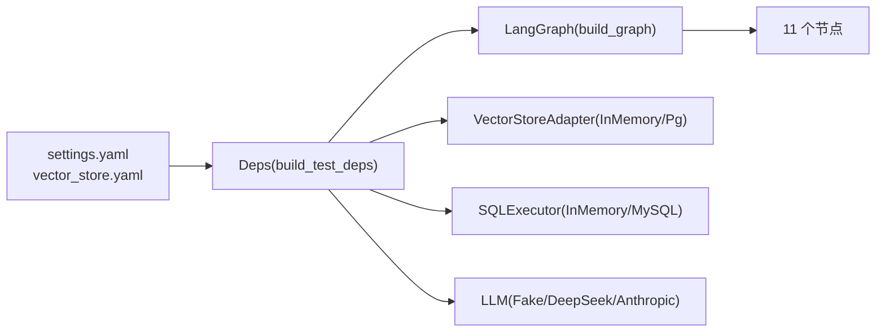

# 集成测试

<cite>
**本文引用的文件**   
- [conftest.py](file://nl2sql_agent/tests/conftest.py)
- [testing.py](file://nl2sql_agent/testing.py)
- [test_architecture_hardening.py](file://nl2sql_agent/tests/test_architecture_hardening.py)
- [test_routing.py](file://nl2sql_agent/tests/test_routing.py)
- [test_schema_ingest.py](file://nl2sql_agent/tests/test_schema_ingest.py)
- [test_vector_store.py](file://nl2sql_agent/tests/test_vector_store.py)
- [test_mysql_executor.py](file://nl2sql_agent/tests/test_mysql_executor.py)
- [test_nodes.py](file://nl2sql_agent/tests/test_nodes.py)
- [test_retrieval_confidence.py](file://nl2sql_agent/tests/test_retrieval_confidence.py)
- [test_llm.py](file://nl2sql_agent/tests/test_llm.py)
- [graph.py](file://nl2sql_agent/graph.py)
- [settings.yaml](file://nl2sql_agent/config/settings.yaml)
- [vector_store.yaml](file://nl2sql_agent/config/vector_store.yaml)
- [pyproject.toml](file://pyproject.toml)
</cite>

## 目录
1. [简介](#简介)
2. [项目结构](#项目结构)
3. [核心组件](#核心组件)
4. [架构总览](#架构总览)
5. [详细组件分析](#详细组件分析)
6. [依赖关系分析](#依赖关系分析)
7. [性能与压力测试](#性能与压力测试)
8. [故障排查指南](#故障排查指南)
9. [结论](#结论)
10. [附录：环境搭建与数据准备](#附录环境搭建与数据准备)

## 简介
本文件面向 NL2SQL 项目的集成测试，覆盖端到端工作流、数据库集成、向量存储集成、架构健壮性（异常处理/错误恢复/稳定性）、路由策略验证、Schema 导入（MySQL/PostgreSQL）与数据同步、以及性能/压力/回归测试的实施方法。文档以仓库现有测试代码为依据，提供可操作的指导与可视化图示，帮助读者快速理解并扩展测试体系。

## 项目结构
测试位于 nl2sql_agent/tests 下，围绕 LangGraph 编排的 11 个节点构建端到端与单元级用例；共享夹具与双打集中在 conftest.py 与 testing.py；配置隔离通过临时目录与 set_test_config_dir 实现。



图表来源
- [conftest.py:1-76](file://nl2sql_agent/tests/conftest.py#L1-L76)
- [testing.py:1-187](file://nl2sql_agent/testing.py#L1-L187)
- [test_routing.py:1-215](file://nl2sql_agent/tests/test_routing.py#L1-L215)
- [test_retrieval_confidence.py:1-159](file://nl2sql_agent/tests/test_retrieval_confidence.py#L1-L159)
- [test_nodes.py:1-450](file://nl2sql_agent/tests/test_nodes.py#L1-L450)
- [test_architecture_hardening.py:1-156](file://nl2sql_agent/tests/test_architecture_hardening.py#L1-L156)
- [test_schema_ingest.py:1-394](file://nl2sql_agent/tests/test_schema_ingest.py#L1-L394)
- [test_vector_store.py:1-68](file://nl2sql_agent/tests/test_vector_store.py#L1-L68)
- [test_mysql_executor.py:1-50](file://nl2sql_agent/tests/test_mysql_executor.py#L1-L50)
- [test_llm.py:1-166](file://nl2sql_agent/tests/test_llm.py#L1-L166)

章节来源
- [conftest.py:1-76](file://nl2sql_agent/tests/conftest.py#L1-L76)
- [testing.py:1-187](file://nl2sql_agent/testing.py#L1-L187)
- [pyproject.toml:41-44](file://pyproject.toml#L41-L44)

## 核心组件
- 测试夹具与配置隔离
  - 会话级隔离配置目录，复制真实配置到临时目录，并用基线 schema_catalog 覆盖，避免被 ingest 脚本改写影响测试。
  - 提供 deps、graph 等 fixture，统一注入 FakeLLM、InMemoryExecutor、内存向量存储与 InMemorySaver 检查点。
- 双打与装配
  - FakeLLM：按 prompt 正则匹配返回 SQLResult/计划，支持统计调用次数与模板摘要。
  - InMemoryExecutor：基于内存表 FAKE_TABLES 模拟执行，支持空结果、失败次数控制。
  - InMemoryVectorStore：确定性 fake_embedding 词袋嵌入，支持 upsert/search/rebuild_index。
  - build_test_deps：组装 Deps，包含配置、术语映射、SchemaCatalog、向量存储、执行器、FewShotStore、SQL 方言等。

章节来源
- [conftest.py:46-76](file://nl2sql_agent/tests/conftest.py#L46-L76)
- [testing.py:26-187](file://nl2sql_agent/testing.py#L26-L187)

## 架构总览
LangGraph 编排了 11 个节点与两条重试回路，测试覆盖了简单路径、复杂口径计划路径、字段幻觉回退、系统隔离、敏感人工确认、执行报错回退、危险操作拦截、计划校验循环边界、执行重试上限等关键场景。



图表来源
- [graph.py:174-200](file://nl2sql_agent/graph.py#L174-L200)
- [test_routing.py:28-215](file://nl2sql_agent/tests/test_routing.py#L28-L215)
- [test_retrieval_confidence.py:44-159](file://nl2sql_agent/tests/test_retrieval_confidence.py#L44-L159)

## 详细组件分析

### 端到端路由测试（完整工作流）
- 目标：覆盖简单路径、复合口径计划路径、字段幻觉回退、系统隔离、敏感暂停、执行报错回退、危险操作拦截、计划校验循环边界、执行重试上限等。
- 关键点：
  - 使用 FakeLLM 注入不同 SQL/计划规则，配合 InMemoryExecutor 控制执行结果。
  - 通过 graph.get_state + Command(resume) 模拟人工审批与候选选择。
  - 断言 trace_steps、retry_count、plan_retry_count、blocked_reason、is_sensitive 等状态不变式。

```mermaid
flowchart TD
Start(["开始"]) --> Simple{"是否简单路径?"}
Simple --> |是| PathA["跳过计划→SQL生成→静态校验→敏感→执行→解释"]
Simple --> |否| PathB["计划生成→计划校验"]
PathB --> PlanOK{"计划校验通过?"}
PlanOK --> |否| RetryPlan["重试计划(上限内)"]
RetryPlan --> PlanOK
PlanOK --> |是| PathC["SQL生成→静态校验→敏感→执行→解释"]
PathA --> Static{"静态校验通过?"}
PathC --> Static
Static --> |否(非危险)| RetrySQL["重试SQL(上限内)"]
RetrySQL --> PathC
Static --> |危险| Block["阻断结束"]
Static --> |是| Sensitive{"敏感?"}
Sensitive --> |是| Human["人工审批"]
Human --> Exec{"批准?"}
Exec --> |否| EndNoExec["结束(不执行)"]
Exec --> |是| Execute["沙箱执行"]
Sensitive --> |否| Execute
Execute --> ExecOK{"执行成功?"}
ExecOK --> |否| RetrySQL
ExecOK --> |是| Interpret["结果解释"]
Interpret --> End(["结束"])
```

图表来源
- [test_routing.py:28-215](file://nl2sql_agent/tests/test_routing.py#L28-L215)
- [graph.py:130-170](file://nl2sql_agent/graph.py#L130-L170)

章节来源
- [test_routing.py:28-215](file://nl2sql_agent/tests/test_routing.py#L28-L215)

### 检索置信度路由（模块 3.5）
- 目标：新指标不被模块 2 拦截；多候选触发候选澄清；选定后回到模块 3 不再重复；低置信继续强制计划+人工确认；高置信单一候选直接放行；缺时间范围仍在模块 2 拦截。
- 关键点：
  - 通过注入共享副本表制造“多相近候选”。
  - 使用 Command(resume={"table": ...}) 或 {"continue": True/False} 驱动分支。
  - 断言 retrieval_confidence、retrieval_candidates、trace 中 clarify_* 出现次数。

章节来源
- [test_retrieval_confidence.py:44-159](file://nl2sql_agent/tests/test_retrieval_confidence.py#L44-L159)

### 节点级测试（术语/Schema/复杂度/计划/静态/敏感/澄清）
- 术语映射：全局与业务线专属映射、提取术语。
- Schema 检索：按系统维度隔离、术语层优先、向量兜底、列向量命中、直接关系补充桥表。
- 复杂度：复合口径 vs 单表聚合。
- 计划校验：目标表存在性、字段归属、metric_logic definition 一致性。
- 静态校验：危险操作拦截、字段幻觉、used_tables 不一致、别名安全注入、行级过滤注入。
- 敏感判定：敏感字段与金额聚合。
- 澄清：仅时间范围检查，不受术语库影响。

章节来源
- [test_nodes.py:44-450](file://nl2sql_agent/tests/test_nodes.py#L44-L450)

### 架构健壮性测试（异常处理/错误恢复/稳定性）
- 重试提示包含上次失败信息；data_scope 不泄露为行过滤值；启用行级过滤但未提供可信值时阻断；系统命名空间误作字段值拦截；空执行结果为成功；扫描限制硬阻断；计划拒绝未知操作符与 join 左表字段校验；SQLite checkpoint 跨进程恢复。

章节来源
- [test_architecture_hardening.py:30-156](file://nl2sql_agent/tests/test_architecture_hardening.py#L30-L156)

### Schema 导入测试（MySQL/PostgreSQL 连接与数据同步）
- 质量门禁：注释齐全直接入库；不足进审核队列不入向量库；approve 写入覆盖层后重新入库生效。
- 脱敏：含身份证字段的数据取样自动脱敏。
- 增量：只重处理变更表；删除表清理向量条目与快照，无幽灵表。
- m-schema 重写：列分块更新时清理过期 chunk。
- 宽表文本：核心字段优先，保留全部字段列表。
- 向量写入失败：不推进增量快照，记录 vector_write 错误。
- 约束与索引提取：生成 m-schema.json、manifest.json、schema_catalog.yaml，运行时 Catalog 一致。

章节来源
- [test_schema_ingest.py:108-394](file://nl2sql_agent/tests/test_schema_ingest.py#L108-L394)

### 向量存储集成测试（pgvector 与内存存储）
- 适配器接口：upsert/search/filters/rebuild_index。
- 语义检索：命中相关表，无关查询低置信。
- 后端切换：memory/pgvector 由配置显式选择；pgvector 缺 url 报错。

章节来源
- [test_vector_store.py:12-68](file://nl2sql_agent/tests/test_vector_store.py#L12-L68)

### MySQL 执行器测试（URL 解析与 EXPLAIN 行数估计）
- URL 解析：host/port/user/password/database/charset。
- 默认端口与非法 scheme 校验。
- EXPLAIN 递归估计最大行数：嵌套连接取最大值，非法值忽略，空 plan 返回 0。

章节来源
- [test_mysql_executor.py:10-50](file://nl2sql_agent/tests/test_mysql_executor.py#L10-L50)

### LLM 层测试（Provider 选择/结构化输出）
- Provider 选择：DeepSeek/Antropic 环境变量优先级与默认行为。
- DeepSeek 客户端：complete_sql/complete_json/complete_structured，容忍 markdown JSON，拒绝 schema 回显，Pydantic 校验与多次解析失败抛错。
- extract_json 鲁棒性：前后废话、代码块包裹、非法输入报错。

章节来源
- [test_llm.py:19-166](file://nl2sql_agent/tests/test_llm.py#L19-L166)

## 依赖关系分析
- 测试对运行时的依赖通过 build_test_deps 解耦，避免真实 LLM/DB/向量库。
- 配置加载与隔离：conftest 将 CONFIG_DIR 复制到 tmp_path，并通过 set_test_config_dir 切换。
- 向量存储后端：vector_store.yaml 显式 backend；测试通过 monkeypatch 与 build_vector_store 切换。
- 执行器：InMemoryExecutor 用于单元测试；MySQLExecutor.from_url 与 estimate_max_rows 独立验证。



图表来源
- [testing.py:148-187](file://nl2sql_agent/testing.py#L148-L187)
- [vector_store.yaml:1-6](file://nl2sql_agent/config/vector_store.yaml#L1-L6)
- [settings.yaml:1-30](file://nl2sql_agent/config/settings.yaml#L1-L30)
- [graph.py:174-200](file://nl2sql_agent/graph.py#L174-L200)

章节来源
- [testing.py:148-187](file://nl2sql_agent/testing.py#L148-L187)
- [vector_store.yaml:1-6](file://nl2sql_agent/config/vector_store.yaml#L1-L6)
- [settings.yaml:1-30](file://nl2sql_agent/config/settings.yaml#L1-L30)
- [graph.py:174-200](file://nl2sql_agent/graph.py#L174-L200)

## 性能与压力测试
- 性能基准
  - 利用 InMemoryExecutor 与内存向量存储，构造固定规模 FAKE_TABLES，批量调用 graph.invoke 统计平均延迟与吞吐。
  - 通过 node_latencies 与 trace_steps 定位瓶颈节点。
- 压力测试
  - 并发线程/进程调用同一图实例（注意线程隔离使用不同 thread_id），观察 checkpointer 与事件 sink 的稳定性。
  - 针对向量重建 rebuild_index 与大量 upsert 的场景进行压测。
- 回归测试
  - 基于 test_routing、test_retrieval_confidence、test_nodes、test_architecture_hardening 等用例集作为回归基线。
  - 每次改动后全量运行 pytest，确保 trace 顺序、重试计数、阻断原因等不变式稳定。

[本节为通用指导，不直接分析具体文件]

## 故障排查指南
- 常见错误与定位
  - 字段幻觉：静态校验会返回 validation_errors 并触发重试；检查 used_tables 与 AST 一致性。
  - 危险操作：blocked_reason 为 Drop 等，不会进入重试；检查 SQL 白名单与语法树。
  - 行级过滤：启用但未提供可信值会被阻断；确认 row_level_filters 注入逻辑。
  - 计划校验失败：在 5b↔6 内部重试，不退回模块 3；检查 target_tables 与 join 字段归属。
  - 执行失败：最多 max_retries 次回退至 SQL 生成；检查 InMemoryExecutor.fail_execute_times 与真实 DB 连接。
  - 向量不可用：sync 报告 vector_write 错误且不推进快照；检查后端配置与连接参数。
- 调试建议
  - 使用 graph.get_state(config).next 与 values.trace_steps 查看当前节点与历史轨迹。
  - 通过 event_sink 回调打印 node_start/node_complete/retry 事件，辅助定位时序问题。
  - 对 SQLite checkpoint 使用 create_sqlite_checkpointer 并在不同进程间恢复，验证持久化。

章节来源
- [test_architecture_hardening.py:62-156](file://nl2sql_agent/tests/test_architecture_hardening.py#L62-L156)
- [test_schema_ingest.py:284-297](file://nl2sql_agent/tests/test_schema_ingest.py#L284-L297)
- [graph.py:88-126](file://nl2sql_agent/graph.py#L88-L126)

## 结论
本项目的集成测试体系以 LangGraph 为核心，围绕端到端路由、节点行为、架构健壮性与外部依赖（LLM/DB/向量）进行了系统化覆盖。通过隔离配置、双打与内存执行器，测试可在无外部服务环境下稳定运行；同时提供 pgvector 与内存存储的后端切换能力，便于在不同环境中验证。结合性能与回归测试实践，可有效保障系统在复杂查询、权限隔离、敏感控制与错误恢复方面的可靠性。

[本节为总结性内容，不直接分析具体文件]

## 附录：环境搭建与数据准备
- 运行测试
  - 使用 pytest 运行所有用例：pytest -q
  - 指定路径：python -m pytest nl2sql_agent/tests
- 配置要点
  - settings.yaml：dialect、schema_search_top_k、execution.*、row_level_filter.enabled/column。
  - vector_store.yaml：backend=memory 或 pgvector；pgvector.url 通过环境变量注入。
- 数据准备
  - 使用 FAKE_TABLES 与 FakeSchemaExecutor 模拟 information_schema 与样本数据。
  - 审核队列 ReviewStore 使用临时 sqlite 文件，approve 后写入覆盖层并重新入库。
- 报告生成
  - pytest 默认输出简洁结果；可通过 --tb=short/--html 等插件扩展报告。
  - 结合 event_sink 收集节点事件，导出为 JSON 供前端或 CI 分析。

章节来源
- [pyproject.toml:41-44](file://pyproject.toml#L41-L44)
- [settings.yaml:1-30](file://nl2sql_agent/config/settings.yaml#L1-L30)
- [vector_store.yaml:1-6](file://nl2sql_agent/config/vector_store.yaml#L1-L6)
- [test_schema_ingest.py:108-159](file://nl2sql_agent/tests/test_schema_ingest.py#L108-L159)