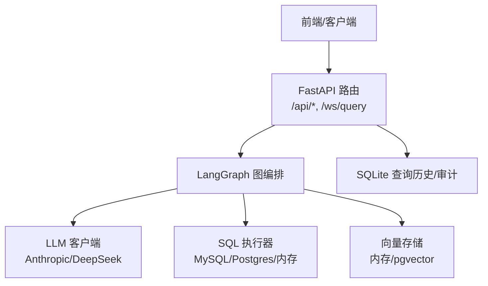
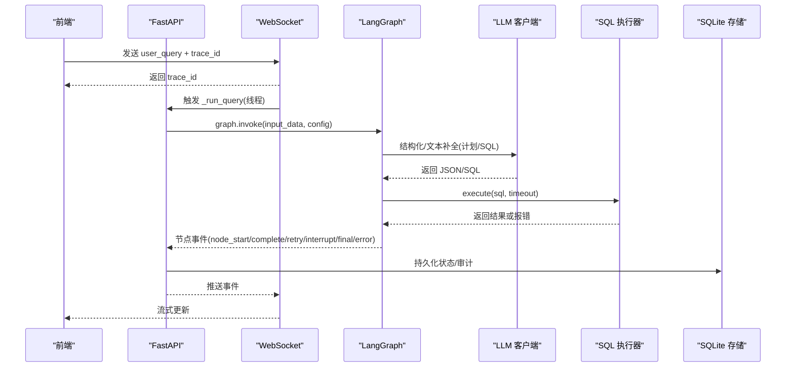
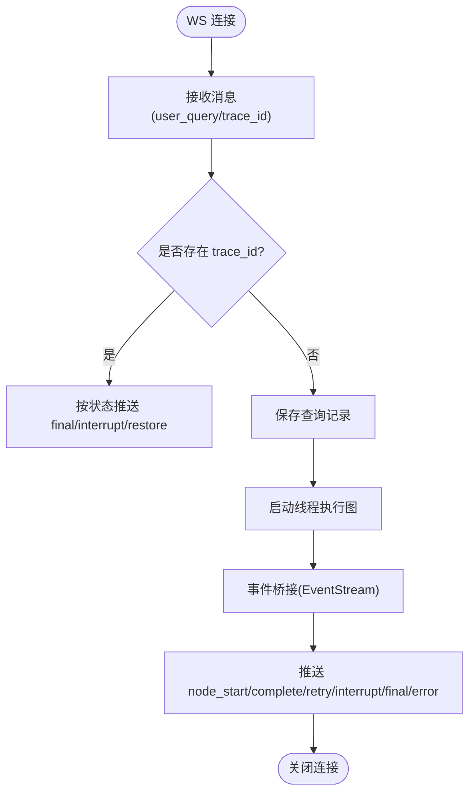
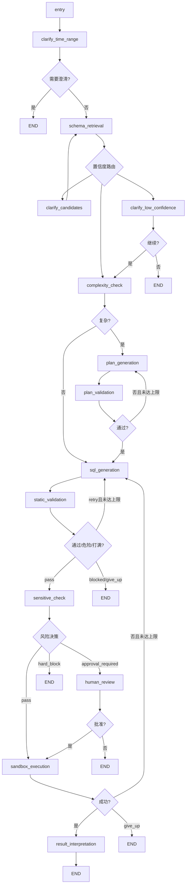
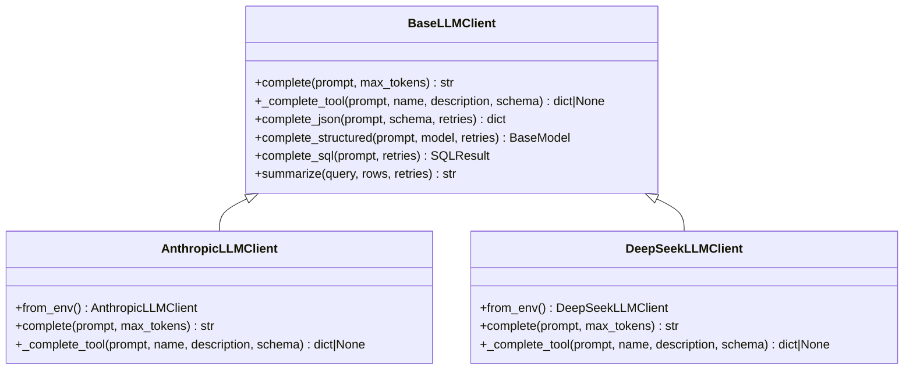
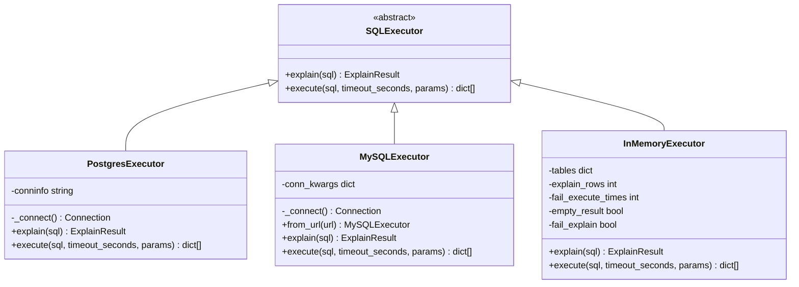
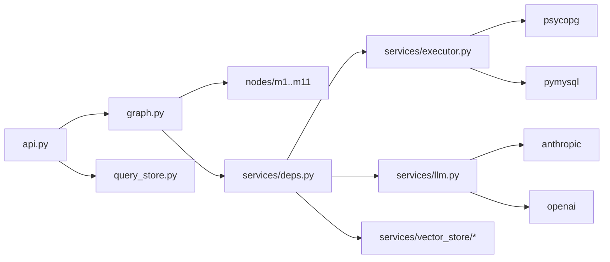

# 故障排查指南

<cite>
**本文引用的文件**   
- [nl2sql_agent/main.py](file://nl2sql_agent/main.py)
- [nl2sql_agent/api.py](file://nl2sql_agent/api.py)
- [nl2sql_agent/graph.py](file://nl2sql_agent/graph.py)
- [nl2sql_agent/services/llm.py](file://nl2sql_agent/services/llm.py)
- [nl2sql_agent/services/executor.py](file://nl2sql_agent/services/executor.py)
- [nl2sql_agent/services/deps.py](file://nl2sql_agent/services/deps.py)
- [nl2sql_agent/services/query_store.py](file://nl2sql_agent/services/query_store.py)
- [nl2sql_agent/config/settings.yaml](file://nl2sql_agent/config/settings.yaml)
- [requirements.txt](file://requirements.txt)
- [NL2SQL.md](file://NL2SQL.md)
</cite>

## 目录
1. [简介](#简介)
2. [项目结构](#项目结构)
3. [核心组件](#核心组件)
4. [架构总览](#架构总览)
5. [详细组件分析](#详细组件分析)
6. [依赖关系分析](#依赖关系分析)
7. [性能注意事项](#性能注意事项)
8. [故障排查指南](#故障排查指南)
9. [结论](#结论)
10. [附录](#附录)

## 简介
本指南面向运维、开发与数据工程师，提供从问题发现到解决的完整排查流程。覆盖网络连接、数据库连接失败、向量检索异常、LLM调用超时与错误、SQL执行错误等常见问题；给出日志分析方法、调试工具与技巧、性能问题定位流程、安全相关问题处理，以及灾难恢复与回滚策略。

## 项目结构
- Web入口与API：FastAPI应用提供REST与WebSocket接口，承载查询提交、审批、历史与审计等能力。
- 图编排：基于LangGraph的11个节点构成NL2SQL流水线，包含意图澄清、Schema检索、复杂度判断、计划生成与校验、SQL生成与静态校验、敏感判定、人工确认、沙箱执行与结果解释。
- 服务层：LLM客户端（Anthropic/DeepSeek）、SQL执行器（MySQL/Postgres/内存）、向量存储（内存/pgvector）、配置加载与环境装配。
- 持久化：SQLite记录查询历史、审计、反馈与审核队列。

**图表来源** 
- [nl2sql_agent/api.py:1-573](file://nl2sql_agent/api.py#L1-L573)
- [nl2sql_agent/graph.py:1-313](file://nl2sql_agent/graph.py#L1-L313)
- [nl2sql_agent/services/llm.py:1-328](file://nl2sql_agent/services/llm.py#L1-L328)
- [nl2sql_agent/services/executor.py:1-205](file://nl2sql_agent/services/executor.py#L1-L205)
- [nl2sql_agent/services/query_store.py:1-214](file://nl2sql_agent/services/query_store.py#L1-L214)

**章节来源**
- [nl2sql_agent/main.py:1-152](file://nl2sql_agent/main.py#L1-L152)
- [nl2sql_agent/api.py:1-573](file://nl2sql_agent/api.py#L1-L573)
- [nl2sql_agent/graph.py:1-313](file://nl2sql_agent/graph.py#L1-L313)

## 核心组件
- FastAPI 应用与路由：提供 /query、/approve、/thread、/api/*、/ws/query 等接口，负责请求解析、状态持久化、事件桥接与线程管理。
- LangGraph 编排：定义节点与路由，支持中断与恢复（human_review、clarify_*），内置重试与上限控制。
- LLM 客户端：统一抽象 BaseLLMClient，实现 Anthropic 与 DeepSeek 两种Provider，支持结构化输出与SQL生成。
- SQL 执行器：PostgresExecutor、MySQLExecutor、InMemoryExecutor，支持只读事务、超时控制与EXPLAIN预估。
- 依赖装配：build_deps 读取 settings.yaml 与环境变量，构建 AppConfig/Deps，选择执行器与向量存储后端。
- 查询存储：SQLite 持久化 trace_id、状态、SQL、计划、执行结果、审计与反馈。

**章节来源**
- [nl2sql_agent/api.py:1-573](file://nl2sql_agent/api.py#L1-L573)
- [nl2sql_agent/graph.py:1-313](file://nl2sql_agent/graph.py#L1-L313)
- [nl2sql_agent/services/llm.py:1-328](file://nl2sql_agent/services/llm.py#L1-L328)
- [nl2sql_agent/services/executor.py:1-205](file://nl2sql_agent/services/executor.py#L1-L205)
- [nl2sql_agent/services/deps.py:1-184](file://nl2sql_agent/services/deps.py#L1-L184)
- [nl2sql_agent/services/query_store.py:1-214](file://nl2sql_agent/services/query_store.py#L1-L214)

## 架构总览
下图展示一次查询从前端到后端的端到端流程，包括WebSocket流式事件、图节点执行、LLM调用、SQL执行与持久化。

**图表来源** 
- [nl2sql_agent/api.py:159-211](file://nl2sql_agent/api.py#L159-L211)
- [nl2sql_agent/graph.py:174-313](file://nl2sql_agent/graph.py#L174-L313)
- [nl2sql_agent/services/llm.py:82-149](file://nl2sql_agent/services/llm.py#L82-L149)
- [nl2sql_agent/services/executor.py:148-158](file://nl2sql_agent/services/executor.py#L148-L158)
- [nl2sql_agent/services/query_store.py:99-144](file://nl2sql_agent/services/query_store.py#L99-L144)

## 详细组件分析

### 网络与API层
- WebSocket 流式事件：EventStream 将同步线程事件桥接到异步队列，避免阻塞主循环。
- REST 接口：/api/query 非流式提交，内部以线程执行并等待结果；/api/query/{trace_id} 查询状态；/api/query/{trace_id}/approve 与 /resume 用于恢复中断。
- 断线重连：根据 trace_id 恢复当前状态，避免重复执行。

**图表来源** 
- [nl2sql_agent/api.py:159-211](file://nl2sql_agent/api.py#L159-L211)
- [nl2sql_agent/api.py:234-263](file://nl2sql_agent/api.py#L234-L263)

**章节来源**
- [nl2sql_agent/api.py:1-573](file://nl2sql_agent/api.py#L1-L573)

### 图编排与节点
- 节点链路：entry → clarify_time_range → schema_retrieval → (clarify_candidates/clarify_low_confidence) → complexity_check → plan_generation → plan_validation → sql_generation → static_validation → sensitive_check → human_review → sandbox_execution → result_interpretation → END。
- 重试与上限：plan_validation 与 static_validation、sandbox_execution 均支持重试，达到上限后降级结束。
- 中断与恢复：human_review、clarify_candidates、clarify_low_confidence 为中断点，通过 Command(resume=...) 恢复。

**图表来源** 
- [nl2sql_agent/graph.py:174-313](file://nl2sql_agent/graph.py#L174-L313)

**章节来源**
- [nl2sql_agent/graph.py:1-313](file://nl2sql_agent/graph.py#L1-L313)

### LLM 客户端
- 抽象接口：BaseLLMClient 提供 complete_json、complete_structured、complete_sql、summarize。
- Provider 选择：build_llm 按环境变量选择 DeepSeek 或 Anthropic；build_sql_llm 支持独立SQL模型。
- 结构化输出：优先 function calling，失败回退纯文本解析，含“回显 schema”检测与重试。

**图表来源** 
- [nl2sql_agent/services/llm.py:70-149](file://nl2sql_agent/services/llm.py#L70-L149)
- [nl2sql_agent/services/llm.py:162-243](file://nl2sql_agent/services/llm.py#L162-L243)

**章节来源**
- [nl2sql_agent/services/llm.py:1-328](file://nl2sql_agent/services/llm.py#L1-L328)

### SQL 执行器
- PostgresExecutor：READ ONLY 事务 + statement_timeout，EXPLAIN FORMAT JSON 提取预估行数。
- MySQLExecutor：START TRANSACTION READ ONLY + MAX_EXECUTION_TIME，EXPLAIN FORMAT=JSON。
- InMemoryExecutor：测试用，可模拟失败、空结果、EXPLAIN失败等场景。

**图表来源** 
- [nl2sql_agent/services/executor.py:23-81](file://nl2sql_agent/services/executor.py#L23-L81)
- [nl2sql_agent/services/executor.py:83-158](file://nl2sql_agent/services/executor.py#L83-L158)
- [nl2sql_agent/services/executor.py:161-205](file://nl2sql_agent/services/executor.py#L161-L205)

**章节来源**
- [nl2sql_agent/services/executor.py:1-205](file://nl2sql_agent/services/executor.py#L1-L205)

### 依赖装配与配置
- build_deps：读取 settings.yaml 与环境变量，构建 AppConfig/Deps，选择执行器与向量存储后端。
- vector_store：根据 vector_store.yaml 选择 pgvector 或内存实现。
- .env：支持 ANTHROPIC_API_KEY、ANTHROPIC_MODEL、DEEPSEEK_*、DATABASE_URL 等。

**章节来源**
- [nl2sql_agent/services/deps.py:1-184](file://nl2sql_agent/services/deps.py#L1-L184)
- [nl2sql_agent/config/settings.yaml:1-30](file://nl2sql_agent/config/settings.yaml#L1-L30)

### 查询历史与审计
- QueryStore：SQLite 表 queries 与 feedbacks，支持状态更新、历史查询、待审批列表、反馈记录。
- 字段扩展：next_node、retrieval_confidence、execution_error、risk_decision 等便于诊断。

**章节来源**
- [nl2sql_agent/services/query_store.py:1-214](file://nl2sql_agent/services/query_store.py#L1-L214)

## 依赖关系分析
- API 层依赖 graph、checkpointer、deps、query_store。
- graph 依赖 nodes（m1-m11）与 services.deps.Deps。
- deps 依赖 config_loader、executor、llm、vector_store、term_mapping、catalog、sql_dialect。
- executor 依赖 psycopg/pymysql/sqlglot。
- llm 依赖 anthropic/openai。

**图表来源** 
- [nl2sql_agent/api.py:1-573](file://nl2sql_agent/api.py#L1-L573)
- [nl2sql_agent/graph.py:1-313](file://nl2sql_agent/graph.py#L1-L313)
- [nl2sql_agent/services/deps.py:1-184](file://nl2sql_agent/services/deps.py#L1-L184)
- [nl2sql_agent/services/executor.py:1-205](file://nl2sql_agent/services/executor.py#L1-L205)
- [nl2sql_agent/services/llm.py:1-328](file://nl2sql_agent/services/llm.py#L1-L328)

**章节来源**
- [requirements.txt:1-15](file://requirements.txt#L1-L15)

## 性能注意事项
- 节点延迟追踪：graph._traced 记录每个节点的耗时与顺序，便于定位慢节点。
- 执行超时：MySQL/Postgres 分别使用 MAX_EXECUTION_TIME 与 statement_timeout。
- EXPLAIN 预估：estimate_max_rows 保守取最大rows，避免低估风险。
- 向量检索Top-K：settings.schema_search_top_k 控制召回数量。

[本节为通用指导，不直接分析具体文件]

## 故障排查指南

### 一、常见问题诊断方法

#### 1. 网络连接问题
- 症状：前端无法连接后端、WebSocket频繁断开、HTTP请求超时。
- 排查步骤：
  - 检查服务器监听地址与端口（uvicorn host/port）。
  - 验证CORS配置是否允许前端域名。
  - 查看防火墙与安全组规则。
  - 使用 curl/wget 测试连通性。
- 关键位置：
  - FastAPI 启动与中间件配置。
  - WebSocket 连接与心跳ping。

**章节来源**
- [nl2sql_agent/main.py:148-152](file://nl2sql_agent/main.py#L148-L152)
- [nl2sql_agent/api.py:48-55](file://nl2sql_agent/api.py#L48-L55)
- [nl2sql_agent/api.py:201-210](file://nl2sql_agent/api.py#L201-L210)

#### 2. 数据库连接失败
- 症状：SQL执行器初始化失败、连接超时、权限不足。
- 排查步骤：
  - 检查 DATABASE_URL 或 settings.database_url 配置。
  - 验证账号权限（只读账号、READ ONLY 事务）。
  - 测试数据库连通性与端口可达性。
  - 查看连接池与超时设置。
- 关键位置：
  - build_executor_from_url 与 from_url。
  - MySQLExecutor/PostgresExecutor 连接参数。

**章节来源**
- [nl2sql_agent/services/deps.py:73-84](file://nl2sql_agent/services/deps.py#L73-L84)
- [nl2sql_agent/services/executor.py:111-135](file://nl2sql_agent/services/executor.py#L111-L135)
- [nl2sql_agent/services/executor.py:56-63](file://nl2sql_agent/services/executor.py#L56-L63)

#### 3. 向量检索异常
- 症状：Schema检索结果为空、置信度低、候选表不准确。
- 排查步骤：
  - 检查 vector_store.yaml 配置（backend、pgvector.url）。
  - 验证 embedding 模型可用性与缓存签名。
  - 查看 schema_catalog 与 term_mapping 是否正确加载。
  - 调整 schema_search_top_k 与置信度阈值。
- 关键位置：
  - build_vector_store 与 InMemoryVectorStore/PgVectorStore。
  - m3_schema_retrieval 与 m3_5_retrieval_confidence_router。

**章节来源**
- [nl2sql_agent/services/deps.py:87-110](file://nl2sql_agent/services/deps.py#L87-L110)
- [nl2sql_agent/graph.py:212-228](file://nl2sql_agent/graph.py#L212-L228)

#### 4. LLM调用超时与错误
- 症状：结构化输出失败、JSON解析错误、模型不可用、token限制。
- 排查步骤：
  - 检查环境变量（ANTHROPIC_API_KEY/MODEL、DEEPSEEK_*）。
  - 验证 provider 选择逻辑与 base_url。
  - 查看 complete_json 重试机制与 extract_json 解析。
  - 监控调用耗时与错误码。
- 关键位置：
  - build_llm/build_sql_llm。
  - AnthropicLLMClient/DeepSeekLLMClient.complete/_complete_tool。
  - extract_json 与 complete_json 重试逻辑。

**章节来源**
- [nl2sql_agent/services/llm.py:280-328](file://nl2sql_agent/services/llm.py#L280-L328)
- [nl2sql_agent/services/llm.py:181-202](file://nl2sql_agent/services/llm.py#L181-L202)
- [nl2sql_agent/services/llm.py:230-242](file://nl2sql_agent/services/llm.py#L230-L242)
- [nl2sql_agent/services/llm.py:37-67](file://nl2sql_agent/services/llm.py#L37-L67)

#### 5. SQL执行错误
- 症状：语法错误、权限拒绝、超时、结果为空、EXPLAIN失败。
- 排查步骤：
  - 查看 execution_error 与 validation_errors。
  - 检查 static_validation 与 sensitive_check 拦截原因。
  - 验证只读事务与超时设置。
  - 分析 EXPLAIN 预估行数是否超过阈值。
- 关键位置：
  - route_static_validation/route_sandbox。
  - MySQLExecutor/PostgresExecutor.execute。
  - estimate_max_rows。

**章节来源**
- [nl2sql_agent/graph.py:146-169](file://nl2sql_agent/graph.py#L146-L169)
- [nl2sql_agent/services/executor.py:148-158](file://nl2sql_agent/services/executor.py#L148-L158)
- [nl2sql_agent/services/executor.py:31-50](file://nl2sql_agent/services/executor.py#L31-L50)

### 二、日志分析方法

#### 1. 关键日志位置
- 节点事件：node_start/node_complete/retry/interrupt/final/error。
- 状态持久化：queries 表的 status、execution_error、trace_steps、node_latencies。
- WebSocket 事件：trace_id、event类型、data内容。

**章节来源**
- [nl2sql_agent/graph.py:72-103](file://nl2sql_agent/graph.py#L72-L103)
- [nl2sql_agent/services/query_store.py:38-76](file://nl2sql_agent/services/query_store.py#L38-L76)
- [nl2sql_agent/api.py:161-211](file://nl2sql_agent/api.py#L161-L211)

#### 2. 错误信息解读
- execution_error：SQL执行异常、超时、权限错误。
- validation_errors：静态校验失败（语法、字段幻觉、危险操作）。
- plan_validation_errors：计划校验失败（表字段不存在、口径不一致）。
- blocked_reason：危险操作被拦截（DROP/DELETE/UPDATE等）。

**章节来源**
- [nl2sql_agent/services/query_store.py:44-66](file://nl2sql_agent/services/query_store.py#L44-L66)
- [nl2sql_agent/graph.py:146-169](file://nl2sql_agent/graph.py#L146-L169)

#### 3. 性能瓶颈定位
- node_latencies：各节点耗时统计，识别慢节点。
- trace_steps：执行路径，分析重试次数与循环。
- EXPLAIN预估行数：estimate_max_rows 过高导致拒绝执行。

**章节来源**
- [nl2sql_agent/graph.py:88-103](file://nl2sql_agent/graph.py#L88-L103)
- [nl2sql_agent/services/executor.py:31-50](file://nl2sql_agent/services/executor.py#L31-L50)

#### 4. 资源使用监控
- 数据库连接数与超时。
- LLM调用频率与token消耗。
- 向量存储缓存命中率。

[本节为通用指导，不直接分析具体文件]

### 三、调试工具与技巧

#### 1. 断点调试
- 在 graph._traced 与 api._run_query 处设置断点，观察state变化。
- 使用 Python debugger（pdb/ipdb）逐步执行。

**章节来源**
- [nl2sql_agent/graph.py:88-103](file://nl2sql_agent/graph.py#L88-L103)
- [nl2sql_agent/api.py:134-157](file://nl2sql_agent/api.py#L134-L157)

#### 2. 内存分析
- 使用 memory_profiler 分析节点函数内存占用。
- 检查大型对象（execution_result、retrieved_schema）是否过大。

[本节为通用指导，不直接分析具体文件]

#### 3. 线程状态检查
- 查看 _run_query 线程是否存活，避免僵尸线程。
- 监控 EventQueue 积压情况。

**章节来源**
- [nl2sql_agent/api.py:197-210](file://nl2sql_agent/api.py#L197-L210)

#### 4. 分布式追踪
- 利用 trace_id 贯穿全流程，关联前后端日志。
- 在 API 层与 graph 层注入 trace_id 上下文。

**章节来源**
- [nl2sql_agent/api.py:161-190](file://nl2sql_agent/api.py#L161-L190)
- [nl2sql_agent/graph.py:72-86](file://nl2sql_agent/graph.py#L72-L86)

### 四、性能问题排查流程

#### 1. 慢查询分析
- 使用 EXPLAIN FORMAT=JSON 分析执行计划。
- 检查索引缺失、全表扫描、连接顺序不当。

**章节来源**
- [nl2sql_agent/services/executor.py:137-146](file://nl2sql_agent/services/executor.py#L137-L146)
- [nl2sql_agent/services/executor.py:65-69](file://nl2sql_agent/services/executor.py#L65-L69)

#### 2. 内存泄漏检测
- 监控长期运行进程内存增长。
- 检查全局缓存（_deps、_checkpointer）是否合理释放。

**章节来源**
- [nl2sql_agent/api.py:36-41](file://nl2sql_agent/api.py#L36-L41)

#### 3. CPU占用过高
- 分析 LLM 调用频率与复杂度。
- 优化 prompt 长度与重试次数。

**章节来源**
- [nl2sql_agent/services/llm.py:82-128](file://nl2sql_agent/services/llm.py#L82-L128)

#### 4. 并发冲突解决
- 使用 SQLite 锁（threading.Lock）保护写操作。
- 避免多进程共享同一 checkpointer 实例。

**章节来源**
- [nl2sql_agent/services/query_store.py:34-35](file://nl2sql_agent/services/query_store.py#L34-L35)
- [nl2sql_agent/api.py:40-41](file://nl2sql_agent/api.py#L40-L41)

### 五、安全相关问题处理

#### 1. 权限错误
- 检查 data_scope 与 row_level_filter 配置。
- 验证用户权限注入 state.user_id/data_scope。

**章节来源**
- [nl2sql_agent/config/settings.yaml:24-30](file://nl2sql_agent/config/settings.yaml#L24-L30)
- [nl2sql_agent/api.py:84-96](file://nl2sql_agent/api.py#L84-L96)

#### 2. 敏感操作拦截
- static_validation 拦截 DROP/DELETE/UPDATE 等危险关键字。
- sensitive_check 基于规则触发人工确认。

**章节来源**
- [nl2sql_agent/graph.py:146-158](file://nl2sql_agent/graph.py#L146-L158)
- [NL2SQL.md:54-58](file://NL2SQL.md#L54-L58)

#### 3. 注入攻击防护
- 使用 sqlglot AST 解析而非正则匹配。
- 强制只读事务与 LIMIT 限制。

**章节来源**
- [NL2SQL.md:54-56](file://NL2SQL.md#L54-L56)
- [nl2sql_agent/services/executor.py:74-80](file://nl2sql_agent/services/executor.py#L74-L80)

#### 4. 审计日志分析
- 查询 queries 表审计字段（status、approved、approver）。
- 结合 feedbacks 表分析用户反馈。

**章节来源**
- [nl2sql_agent/services/query_store.py:38-76](file://nl2sql_agent/services/query_store.py#L38-L76)
- [nl2sql_agent/api.py:372-378](file://nl2sql_agent/api.py#L372-L378)

### 六、灾难恢复与回滚策略

#### 1. 灾难恢复流程
- 使用 langgraph_checkpoints.db 恢复中断流程。
- 通过 trace_id 重建状态与上下文。

**章节来源**
- [nl2sql_agent/api.py:40-41](file://nl2sql_agent/api.py#L40-L41)
- [nl2sql_agent/graph.py:296-312](file://nl2sql_agent/graph.py#L296-L312)

#### 2. 数据一致性检查
- 对比 queries 表状态与 graph state 一致性。
- 验证 execution_result 与 final_answer 完整性。

**章节来源**
- [nl2sql_agent/services/query_store.py:141-144](file://nl2sql_agent/services/query_store.py#L141-L144)
- [nl2sql_agent/api.py:101-131](file://nl2sql_agent/api.py#L101-L131)

#### 3. 系统回滚策略
- 版本化 settings.yaml 与配置文件。
- 使用 Git 管理代码变更，快速回滚到稳定版本。

[本节为通用指导，不直接分析具体文件]

## 结论
本指南提供了从网络、数据库、向量检索、LLM调用、SQL执行到安全与性能的全面排查方法。通过日志分析、调试工具与流程图示，帮助快速定位与解决问题。建议结合生产环境监控与告警，建立完善的故障响应机制。

## 附录

### A. 常用命令与工具
- 启动服务：uvicorn nl2sql_agent.main:app --host 0.0.0.0 --port 8000
- 测试连通性：curl http://localhost:8000/api/history
- 查看状态：curl http://localhost:8000/api/query/{trace_id}

**章节来源**
- [nl2sql_agent/main.py:148-152](file://nl2sql_agent/main.py#L148-L152)
- [nl2sql_agent/api.py:356-364](file://nl2sql_agent/api.py#L356-L364)

### B. 关键配置项说明
- database_url：数据库连接字符串，支持 mysql:// 与 postgres://。
- execution.timeout_seconds：SQL执行超时时间。
- execution.explain_row_threshold：EXPLAIN预估行数阈值。
- schema_search_top_k：向量检索Top-K数量。

**章节来源**
- [nl2sql_agent/config/settings.yaml:1-30](file://nl2sql_agent/config/settings.yaml#L1-L30)