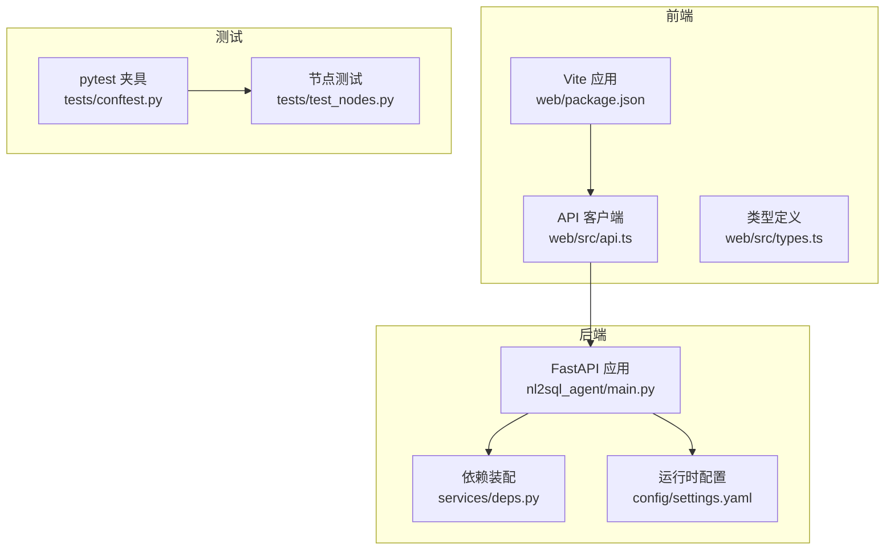
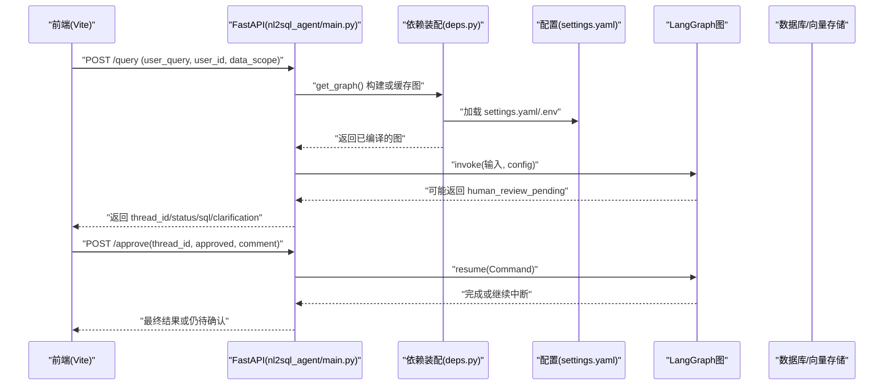
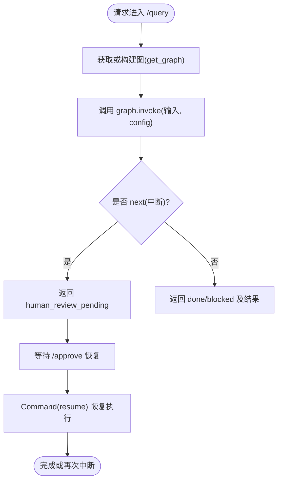
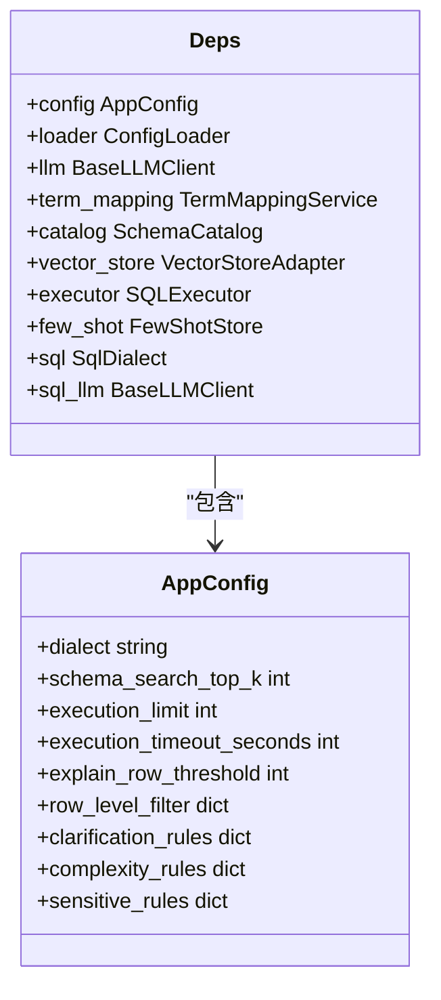
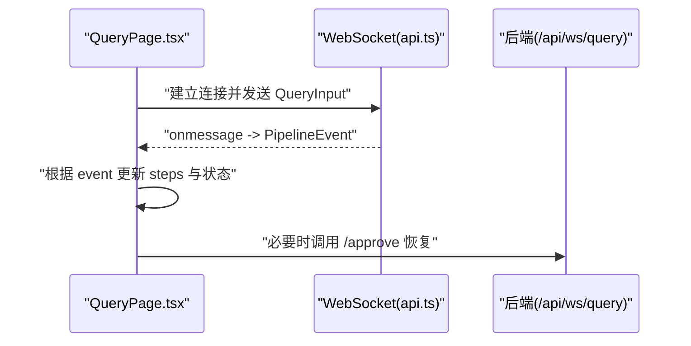
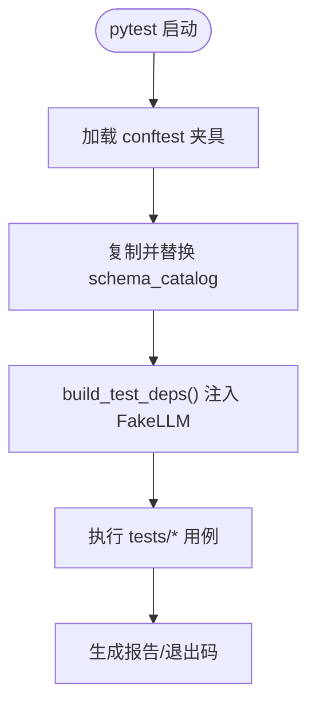
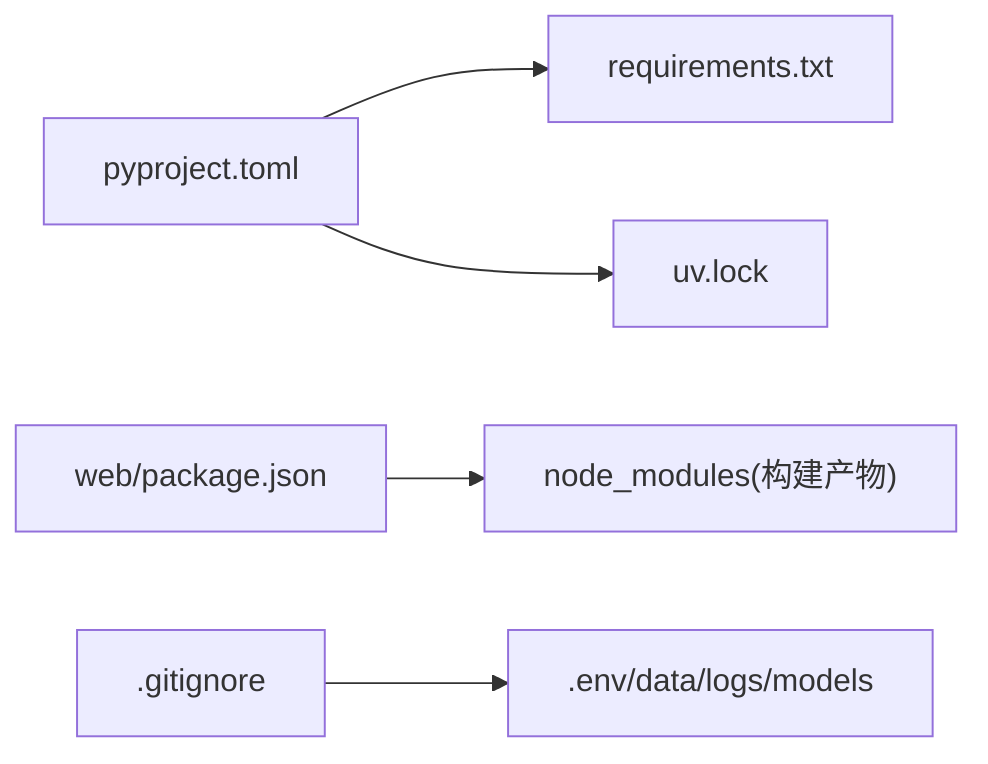

# CI/CD流水线

<cite>
**本文引用的文件**   
- [pyproject.toml](file://pyproject.toml)
- [requirements.txt](file://requirements.txt)
- [main.py](file://main.py)
- [nl2sql_agent/main.py](file://nl2sql_agent/main.py)
- [web/package.json](file://web/package.json)
- [scripts/dev.ps1](file://scripts/dev.ps1)
- [.gitignore](file://.gitignore)
- [nl2sql_agent/tests/conftest.py](file://nl2sql_agent/tests/conftest.py)
- [nl2sql_agent/tests/test_nodes.py](file://nl2sql_agent/tests/test_nodes.py)
- [nl2sql_agent/config/settings.yaml](file://nl2sql_agent/config/settings.yaml)
- [nl2sql_agent/services/deps.py](file://nl2sql_agent/services/deps.py)
- [web/src/api.ts](file://web/src/api.ts)
- [web/src/types.ts](file://web/src/types.ts)
</cite>

## 目录
1. [简介](#简介)
2. [项目结构](#项目结构)
3. [核心组件](#核心组件)
4. [架构总览](#架构总览)
5. [详细组件分析](#详细组件分析)
6. [依赖分析](#依赖分析)
7. [性能考虑](#性能考虑)
8. [故障排查指南](#故障排查指南)
9. [结论](#结论)
10. [附录](#附录)

## 简介
本文件为 NL2SQL 项目的持续集成与持续部署（CI/CD）流水线提供完整文档。内容覆盖：
- 代码提交触发、自动化测试执行与代码质量检查
- 构建打包、镜像推送与环境部署策略
- 自动化测试集成（单元测试、集成测试、端到端测试）
- 发布管理流程（版本控制、灰度发布、回滚策略）
- 环境管理（开发、测试、生产配置差异）
- 现代化 DevOps 实践与自动化部署最佳实践

本项目采用 FastAPI + LangGraph 的 Python 后端，Vite + React 的前端，使用 pytest 进行单元测试，支持 SQLite 检查点与多种向量存储后端。

## 项目结构
- 后端服务入口与路由定义位于 nl2sql_agent/main.py，提供 /query、/approve、/thread 等接口，并内置 CORS 与 WebSocket 事件流能力。
- 前端位于 web 目录，使用 Vite 构建，npm scripts 提供 dev/build/preview。
- 测试位于 nl2sql_agent/tests，使用 pytest 运行，conftest.py 提供隔离配置与共享夹具。
- 配置集中于 nl2sql_agent/config，settings.yaml 控制 SQL 方言、执行限制、行级过滤等关键参数。
- 依赖管理通过 pyproject.toml 与 requirements.txt 共同维护，构建系统使用 hatchling，包索引指向清华源。
- 开发脚本 scripts/dev.ps1 提供一键启停前后端、端口监听与日志输出。

图表来源
- [nl2sql_agent/main.py:1-152](file://nl2sql_agent/main.py#L1-L152)
- [nl2sql_agent/services/deps.py:1-137](file://nl2sql_agent/services/deps.py#L1-L137)
- [nl2sql_agent/config/settings.yaml:1-30](file://nl2sql_agent/config/settings.yaml#L1-L30)
- [web/package.json:1-26](file://web/package.json#L1-L26)
- [web/src/api.ts:1-49](file://web/src/api.ts#L1-L49)
- [web/src/types.ts:37-71](file://web/src/types.ts#L37-L71)
- [nl2sql_agent/tests/conftest.py:1-76](file://nl2sql_agent/tests/conftest.py#L1-L76)
- [nl2sql_agent/tests/test_nodes.py:1-200](file://nl2sql_agent/tests/test_nodes.py#L1-L200)

章节来源
- [pyproject.toml:1-44](file://pyproject.toml#L1-L44)
- [requirements.txt:1-15](file://requirements.txt#L1-L15)
- [main.py:1-7](file://main.py#L1-L7)
- [nl2sql_agent/main.py:1-152](file://nl2sql_agent/main.py#L1-L152)
- [web/package.json:1-26](file://web/package.json#L1-L26)
- [scripts/dev.ps1:1-134](file://scripts/dev.ps1#L1-L134)
- [.gitignore:1-25](file://.gitignore#L1-L25)

## 核心组件
- 后端服务（FastAPI）：提供查询、人工确认、线程状态查看等接口；支持跨域与演示模式（NL2SQL_DEMO=1）。
- 依赖装配（deps）：加载 .env 与 YAML 配置，构建 LLM、向量存储、SQL 执行器、Schema 目录等依赖。
- 前端（Vite+React）：通过 WebSocket 接收 pipeline 事件，展示步骤状态与结果。
- 测试框架（pytest）：隔离配置副本、注入 FakeLLM 与内存执行器，确保稳定可重复的测试。

章节来源
- [nl2sql_agent/main.py:1-152](file://nl2sql_agent/main.py#L1-L152)
- [nl2sql_agent/services/deps.py:1-137](file://nl2sql_agent/services/deps.py#L1-L137)
- [web/src/api.ts:1-49](file://web/src/api.ts#L1-L49)
- [nl2sql_agent/tests/conftest.py:1-76](file://nl2sql_agent/tests/conftest.py#L1-L76)

## 架构总览
下图展示了从前端到后端的请求处理流程，以及 LangGraph 图执行与人工确认中断机制。

图表来源
- [nl2sql_agent/main.py:83-145](file://nl2sql_agent/main.py#L83-L145)
- [nl2sql_agent/services/deps.py:113-137](file://nl2sql_agent/services/deps.py#L113-L137)
- [nl2sql_agent/config/settings.yaml:1-30](file://nl2sql_agent/config/settings.yaml#L1-L30)

## 详细组件分析

### 后端服务（FastAPI）
- 路由与模型：/query、/approve、/thread；请求体使用 Pydantic 校验。
- 图构建与缓存：首次调用时根据环境变量选择真实依赖或演示依赖，构建并缓存 LangGraph 图。
- 中断与恢复：当流程进入人工确认阶段，返回 pending 状态；后续通过 /approve 恢复执行。
- 跨域与演示模式：默认允许本地前端跨域；设置 NL2SQL_DEMO=1 时使用 FakeLLM 与 InMemoryExecutor。

图表来源
- [nl2sql_agent/main.py:63-145](file://nl2sql_agent/main.py#L63-L145)

章节来源
- [nl2sql_agent/main.py:1-152](file://nl2sql_agent/main.py#L1-L152)

### 依赖装配与配置
- 环境变量加载：优先读取项目根目录 .env，不覆盖已有系统变量。
- 配置加载：从 config 目录加载 settings.yaml 与 vector_store.yaml，按 scheme 自动选择 SQL 执行器。
- 向量存储后端：支持 pgvector 与内存实现；MySQL 场景无 pgvector 时自动降级。
- 安全与执行限制：只读事务、LIMIT 上限、超时、EXPLAIN 行数阈值等。

图表来源
- [nl2sql_agent/services/deps.py:40-67](file://nl2sql_agent/services/deps.py#L40-L67)
- [nl2sql_agent/config/settings.yaml:1-30](file://nl2sql_agent/config/settings.yaml#L1-L30)

章节来源
- [nl2sql_agent/services/deps.py:1-137](file://nl2sql_agent/services/deps.py#L1-L137)
- [nl2sql_agent/config/settings.yaml:1-30](file://nl2sql_agent/config/settings.yaml#L1-L30)

### 前端与事件流
- API 客户端：封装 fetch 请求与 WebSocket 连接，统一错误处理。
- 事件类型：trace、node_start、node_complete、retry、interrupt、final、error、done、ping、restore。
- 页面交互：QueryPage 根据事件更新步骤状态，支持中断与恢复。

图表来源
- [web/src/api.ts:30-49](file://web/src/api.ts#L30-L49)
- [web/src/types.ts:37-71](file://web/src/types.ts#L37-L71)
- [web/src/pages/QueryPage.tsx:291-320](file://web/src/pages/QueryPage.tsx#L291-L320)

章节来源
- [web/src/api.ts:1-49](file://web/src/api.ts#L1-L49)
- [web/src/types.ts:37-71](file://web/src/types.ts#L37-L71)

### 测试框架与用例
- 夹具与隔离：conftest.py 复制配置目录，替换 schema_catalog 基线，避免影响真实配置。
- 依赖注入：build_test_deps 注入 FakeLLM 与 InMemoryExecutor，保证测试稳定性。
- 节点测试：test_nodes.py 覆盖术语解析、Schema 检索、复杂度判断、计划校验、静态校验、敏感判定等。

图表来源
- [nl2sql_agent/tests/conftest.py:1-76](file://nl2sql_agent/tests/conftest.py#L1-L76)
- [nl2sql_agent/tests/test_nodes.py:1-200](file://nl2sql_agent/tests/test_nodes.py#L1-L200)

章节来源
- [nl2sql_agent/tests/conftest.py:1-76](file://nl2sql_agent/tests/conftest.py#L1-L76)
- [nl2sql_agent/tests/test_nodes.py:1-200](file://nl2sql_agent/tests/test_nodes.py#L1-L200)

## 依赖分析
- Python 依赖：pyproject.toml 声明主依赖与可选依赖（dev），构建系统为 hatchling，包索引为清华源。
- Node 依赖：web/package.json 定义前端依赖与脚本（dev/build/preview）。
- 锁定文件：uv.lock 记录 Python 依赖版本与哈希，便于可重现构建。
- Git 忽略：.gitignore 排除 .env、data/logs、models、web/node_modules 等。

图表来源
- [pyproject.toml:1-44](file://pyproject.toml#L1-L44)
- [requirements.txt:1-15](file://requirements.txt#L1-L15)
- [web/package.json:1-26](file://web/package.json#L1-L26)
- [.gitignore:1-25](file://.gitignore#L1-L25)

章节来源
- [pyproject.toml:1-44](file://pyproject.toml#L1-L44)
- [requirements.txt:1-15](file://requirements.txt#L1-L15)
- [web/package.json:1-26](file://web/package.json#L1-L26)
- [.gitignore:1-25](file://.gitignore#L1-L25)

## 性能考虑
- 执行限制：settings.yaml 中 read_only、limit、timeout_seconds、explain_row_threshold 保障只读与资源保护。
- 向量存储：pgvector 在 Postgres 下具备更好扩展性；MySQL 场景自动降级为内存实现。
- 图缓存：get_graph() 缓存编译后的图，减少重复构建开销。
- 前端事件流：WebSocket 实时推送节点事件，降低轮询开销。

[本节为通用指导，无需特定文件引用]

## 故障排查指南
- 端口占用与进程管理：scripts/dev.ps1 提供 start/stop/restart/status，自动检测端口占用与进程 PID。
- 日志定位：后端与前端日志分别输出至 logs/backend.log、logs/frontend.log 及其错误日志。
- 环境变量：确认 .env 中的 ANTHROPIC_API_KEY、ANTHROPIC_MODEL、DATABASE_URL 等是否正确加载。
- 测试失败：检查 conftest 隔离配置是否生效，FakeLLM 与 InMemoryExecutor 是否注入成功。

章节来源
- [scripts/dev.ps1:1-134](file://scripts/dev.ps1#L1-L134)
- [.gitignore:1-25](file://.gitignore#L1-L25)
- [nl2sql_agent/services/deps.py:32-38](file://nl2sql_agent/services/deps.py#L32-L38)
- [nl2sql_agent/tests/conftest.py:46-57](file://nl2sql_agent/tests/conftest.py#L46-L57)

## 结论
本 CI/CD 流水线以 FastAPI 与 LangGraph 为核心，结合 pytest 与 Vite，形成前后端一体化开发与测试体验。通过严格的配置管理与依赖装配，确保在不同环境下的一致性与安全性。建议在生产环境中引入容器化与镜像仓库，完善灰度发布与回滚策略，进一步提升交付效率与稳定性。

[本节为总结，无需特定文件引用]

## 附录

### CI 流水线设计（建议）
- 触发条件：push/PR 到 main/develop 分支
- 安装依赖：Python 与 Node 环境准备，安装 uv/pip/npm 依赖
- 代码质量：lint、类型检查（TypeScript）、单元测试（pytest）
- 构建产物：前端静态资源构建，后端包构建（hatchling）
- 测试套件：单元测试、集成测试（Mock 外部依赖）、端到端测试（可选）
- 报告与归档：测试覆盖率、产物上传

[本节为概念性说明，无需特定文件引用]

### CD 流水线设计（建议）
- 镜像构建：基于多阶段 Docker 构建，最小化镜像体积
- 镜像推送：推送到私有镜像仓库（如 Harbor/ECR）
- 环境部署：Kubernetes/Helm 或云平台托管服务
- 灰度发布：蓝绿或金丝雀发布，逐步放量
- 回滚策略：保留历史版本，快速回滚至上一稳定版本

[本节为概念性说明，无需特定文件引用]

### 环境管理（建议）
- 开发环境：本地 .env 配置，NL2SQL_DEMO=1 演示模式
- 测试环境：隔离数据库与向量存储，固定依赖版本
- 生产环境：严格只读、限流、超时、审计日志、密钥管理

[本节为概念性说明，无需特定文件引用]