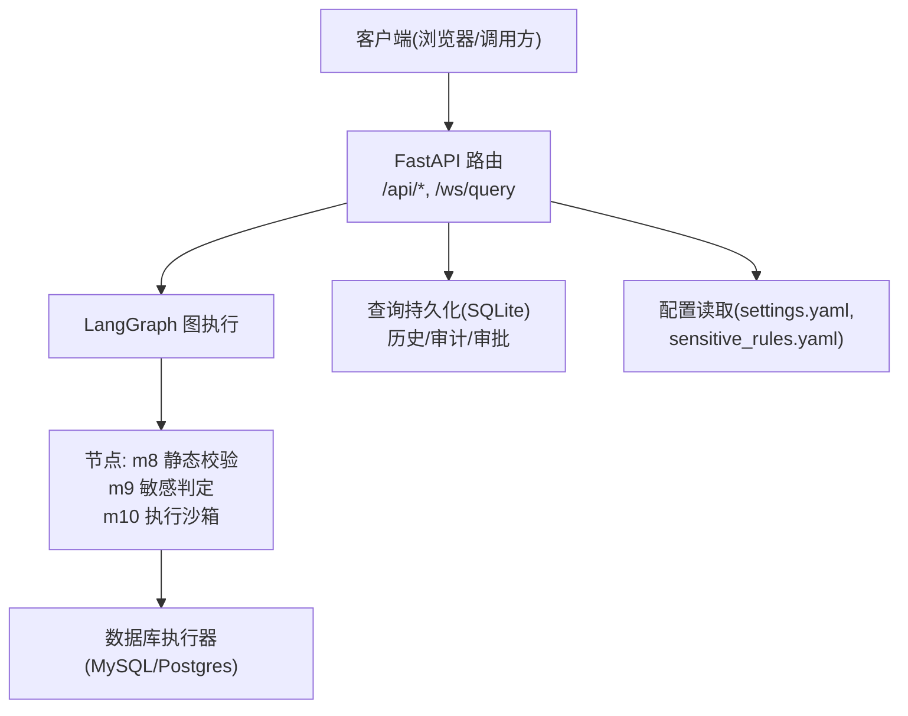
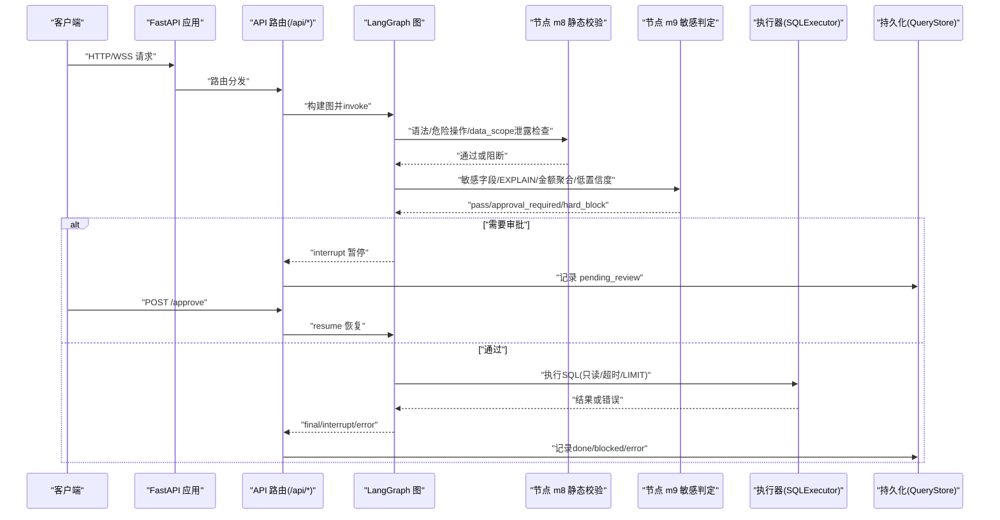
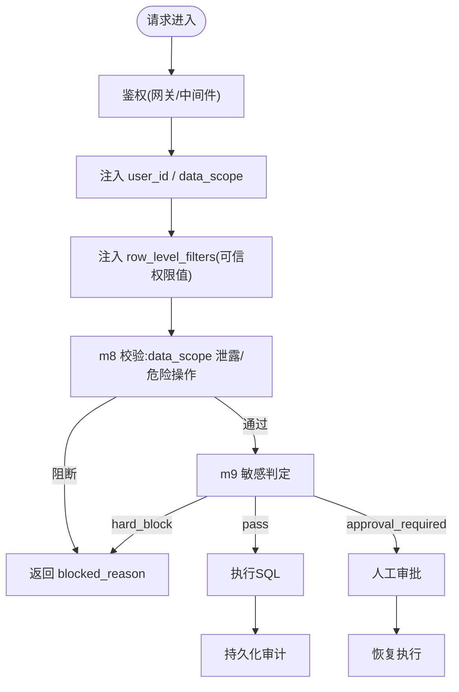
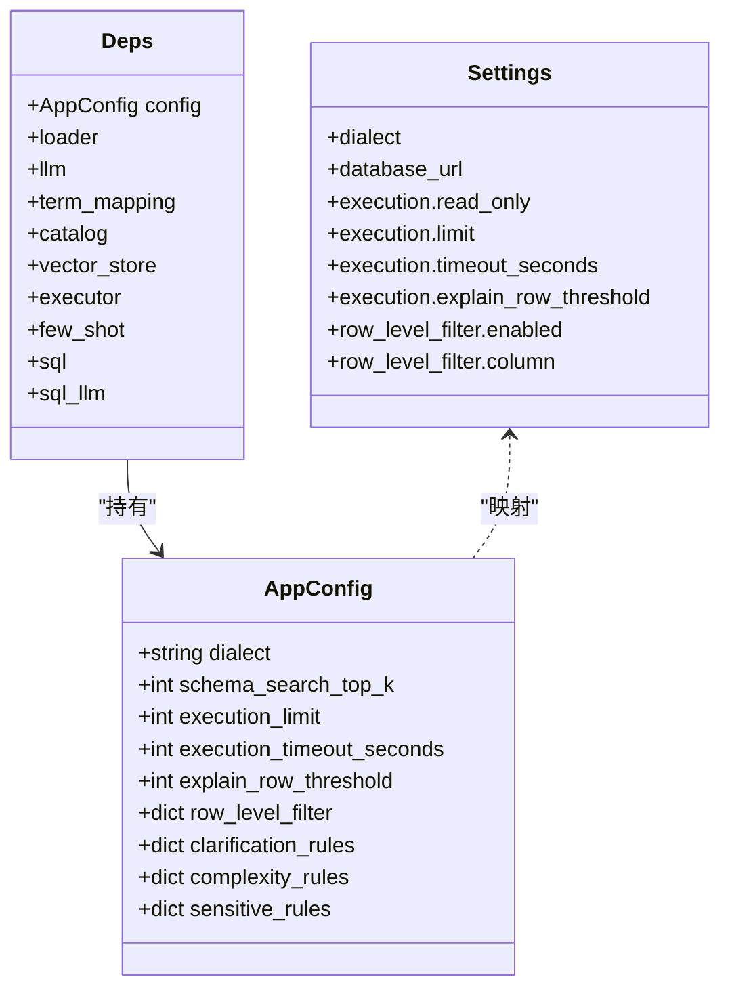
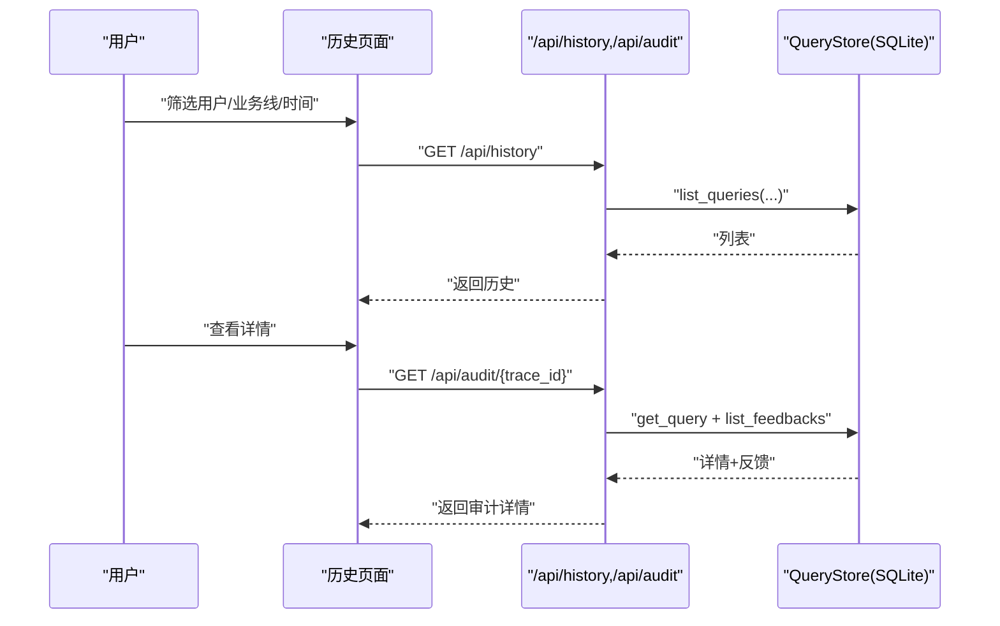
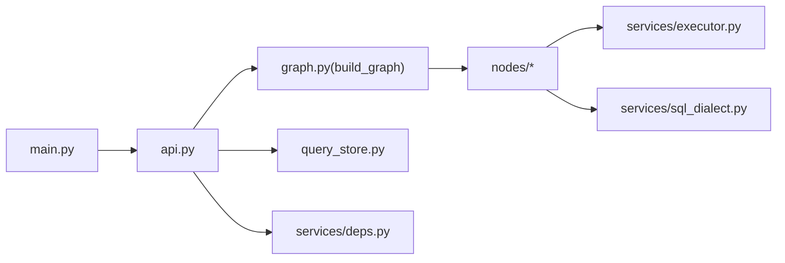

# 安全加固

<cite>
**本文引用的文件**   
- [nl2sql_agent/api.py](file://nl2sql_agent/api.py)
- [nl2sql_agent/main.py](file://nl2sql_agent/main.py)
- [nl2sql_agent/state.py](file://nl2sql_agent/state.py)
- [nl2sql_agent/nodes/m9_sensitive_check.py](file://nl2sql_agent/nodes/m9_sensitive_check.py)
- [nl2sql_agent/nodes/m8_static_validation.py](file://nl2sql_agent/nodes/m8_static_validation.py)
- [nl2sql_agent/config/sensitive_rules.yaml](file://nl2sql_agent/config/sensitive_rules.yaml)
- [nl2sql_agent/config/settings.yaml](file://nl2sql_agent/config/settings.yaml)
- [nl2sql_agent/services/deps.py](file://nl2sql_agent/services/deps.py)
- [nl2sql_agent/services/schema_ingest/comment_generator.py](file://nl2sql_agent/services/schema_ingest/comment_generator.py)
- [nl2sql_agent/services/schema_ingest/profiler.py](file://nl2sql_agent/services/schema_ingest/profiler.py)
- [web/src/pages/HistoryPage.tsx](file://web/src/pages/HistoryPage.tsx)
- [requirements.txt](file://requirements.txt)
- [pyproject.toml](file://pyproject.toml)
</cite>

## 目录
1. [简介](#简介)
2. [项目结构](#项目结构)
3. [核心组件](#核心组件)
4. [架构总览](#架构总览)
5. [详细组件分析](#详细组件分析)
6. [依赖关系分析](#依赖关系分析)
7. [性能与安全权衡](#性能与安全权衡)
8. [故障排查指南](#故障排查指南)
9. [结论](#结论)
10. [附录](#附录)

## 简介
本文件面向企业级安全加固，围绕网络安全策略、身份认证与授权、数据安全措施、安全扫描与漏洞管理、审计日志与合规报告等方面，结合代码实现给出可落地的配置与实践建议。重点覆盖：
- 防火墙与网络隔离：通过反向代理、CORS、端口暴露控制、WebSocket 代理等实现最小暴露面。
- 访问控制与权限：基于 user_id、data_scope 与行级过滤（row_level_filters）的细粒度控制；管理员令牌保护敏感配置接口。
- 数据安全：传输加密（HTTPS）、存储加密（数据库与向量库）、敏感字段识别与脱敏样例采集。
- 安全扫描与漏洞治理：依赖包锁定、静态规则拦截、EXPLAIN 阈值阻断、人工审批闭环。
- 审计与合规：查询全链路记录、审批留痕、历史检索与导出、反馈闭环。

## 项目结构
本项目采用 FastAPI 作为 HTTP/WebSocket 入口，LangGraph 驱动图执行流程，SQL 生成与校验在节点中完成，敏感判定与人工确认构成安全闸门，Schema 导入过程内置脱敏。关键路径包括：
- API 层：REST + WebSocket，统一事件桥接与持久化。
- 图执行：按节点顺序进行澄清、计划、生成、校验、敏感判定、执行与解释。
- 配置中心：settings.yaml、sensitive_rules.yaml 等集中管理运行参数与安全规则。
- 服务装配：deps.py 负责加载 .env、构建依赖、选择执行器与向量存储后端。

图表来源 
- [nl2sql_agent/main.py:46-57](file://nl2sql_agent/main.py#L46-L57)
- [nl2sql_agent/api.py:31-38](file://nl2sql_agent/api.py#L31-L38)
- [nl2sql_agent/nodes/m8_static_validation.py:39-72](file://nl2sql_agent/nodes/m8_static_validation.py#L39-L72)
- [nl2sql_agent/nodes/m9_sensitive_check.py:19-106](file://nl2sql_agent/nodes/m9_sensitive_check.py#L19-L106)
- [nl2sql_agent/config/settings.yaml:18-30](file://nl2sql_agent/config/settings.yaml#L18-L30)
- [nl2sql_agent/config/sensitive_rules.yaml:1-24](file://nl2sql_agent/config/sensitive_rules.yaml#L1-L24)

章节来源
- [nl2sql_agent/main.py:46-57](file://nl2sql_agent/main.py#L46-L57)
- [nl2sql_agent/api.py:31-38](file://nl2sql_agent/api.py#L31-L38)

## 核心组件
- 安全网关与访问控制
  - CORS 白名单限制前端来源，生产应仅允许受信任域名。
  - 管理员令牌 ADMIN_TOKEN 用于修改术语映射等敏感配置。
- SQL 安全校验与阻断
  - 危险操作 AST 检测直接硬阻断，不进入重试。
  - data_scope 泄露防护，禁止将系统命名空间误作业务值。
  - 行级过滤注入，要求服务端提供可信权限值。
- 敏感判定与人工审批
  - 敏感字段命中、EXPLAIN 预估行数超限、金额聚合/导出触发人工确认或硬阻断。
  - 低置信度查询强制人工确认。
- 数据脱敏与采样
  - Schema 导入时仅采集脱敏样例，避免原始敏感数据外泄。
- 审计与历史
  - 所有查询、审批、错误、状态变更均持久化，支持按用户/时间范围检索与导出。

章节来源
- [nl2sql_agent/main.py:49-55](file://nl2sql_agent/main.py#L49-L55)
- [nl2sql_agent/api.py:396-433](file://nl2sql_agent/api.py#L396-L433)
- [nl2sql_agent/nodes/m8_static_validation.py:48-72](file://nl2sql_agent/nodes/m8_static_validation.py#L48-L72)
- [nl2sql_agent/nodes/m9_sensitive_check.py:32-94](file://nl2sql_agent/nodes/m9_sensitive_check.py#L32-L94)
- [nl2sql_agent/services/schema_ingest/comment_generator.py:57-85](file://nl2sql_agent/services/schema_ingest/comment_generator.py#L57-L85)
- [web/src/pages/HistoryPage.tsx:52-70](file://web/src/pages/HistoryPage.tsx#L52-L70)

## 架构总览
下图展示从请求到执行的完整安全路径，包含网络边界、鉴权、SQL 校验、敏感判定、执行与审计。

图表来源 
- [nl2sql_agent/main.py:83-145](file://nl2sql_agent/main.py#L83-L145)
- [nl2sql_agent/api.py:134-157](file://nl2sql_agent/api.py#L134-L157)
- [nl2sql_agent/nodes/m8_static_validation.py:39-72](file://nl2sql_agent/nodes/m8_static_validation.py#L39-L72)
- [nl2sql_agent/nodes/m9_sensitive_check.py:52-94](file://nl2sql_agent/nodes/m9_sensitive_check.py#L52-L94)
- [nl2sql_agent/config/settings.yaml:18-22](file://nl2sql_agent/config/settings.yaml#L18-L22)

## 详细组件分析

### 网络安全策略与访问控制
- 网络边界与跨域
  - 开发环境 CORS 仅允许本地前端地址；生产需严格限定 allow_origins，并启用 HTTPS。
  - 前端代理将 /api 转发至后端，隐藏真实端口。
- 管理员令牌
  - 更新术语映射等写操作需 Header X-Admin-Token，服务端校验环境变量 ADMIN_TOKEN。
- 最小暴露面
  - 仅暴露必要 REST 与 WS 端点；内部服务间通信建议使用内网与鉴权中间件。

章节来源
- [nl2sql_agent/main.py:49-55](file://nl2sql_agent/main.py#L49-L55)
- [nl2sql_agent/api.py:396-433](file://nl2sql_agent/api.py#L396-L433)
- [web/vite.config.ts:12-18](file://web/vite.config.ts#L12-L18)

### 身份认证与授权机制
- 用户身份
  - 请求携带 user_id，用于审计与历史检索；生产建议在网关层做统一认证（如 OAuth2/JWT）。
- 数据范围(data_scope)
  - 控制表级访问的业务线，严禁将其混入 SQL 字面量；m8 节点会拦截泄露。
- 行级过滤(row_level_filters)
  - 由服务端鉴权层注入可信值，m8 节点根据配置注入 WHERE 条件；未提供则阻断。
- API 密钥管理
  - LLM 调用通过环境变量注入密钥；敏感配置接口使用 ADMIN_TOKEN。

图表来源 
- [nl2sql_agent/state.py:135-140](file://nl2sql_agent/state.py#L135-L140)
- [nl2sql_agent/nodes/m8_static_validation.py:57-72](file://nl2sql_agent/nodes/m8_static_validation.py#L57-L72)
- [nl2sql_agent/nodes/m8_static_validation.py:119-143](file://nl2sql_agent/nodes/m8_static_validation.py#L119-L143)
- [nl2sql_agent/nodes/m9_sensitive_check.py:84-94](file://nl2sql_agent/nodes/m9_sensitive_check.py#L84-L94)

章节来源
- [nl2sql_agent/state.py:135-140](file://nl2sql_agent/state.py#L135-L140)
- [nl2sql_agent/nodes/m8_static_validation.py:57-72](file://nl2sql_agent/nodes/m8_static_validation.py#L57-L72)
- [nl2sql_agent/nodes/m8_static_validation.py:119-143](file://nl2sql_agent/nodes/m8_static_validation.py#L119-L143)
- [nl2sql_agent/api.py:396-433](file://nl2sql_agent/api.py#L396-L433)

### 数据安全措施
- 传输加密
  - 生产必须启用 HTTPS（反向代理/TLS 终止），WS 使用 WSS。
- 存储加密
  - 数据库连接使用受管凭据；建议开启数据库侧 TDE/列加密；向量库启用 TLS。
- 敏感数据处理
  - 敏感字段识别：sensitive_rules.yaml 定义敏感字段与关键词。
  - 采样脱敏：comment_generator.py 对敏感列进行掩码处理，避免原始值进入 M-Schema 或 LLM。
  - 执行约束：settings.yaml 设置 read_only、limit、timeout_seconds、explain_row_threshold。

图表来源 
- [nl2sql_agent/services/deps.py:40-71](file://nl2sql_agent/services/deps.py#L40-L71)
- [nl2sql_agent/config/settings.yaml:18-30](file://nl2sql_agent/config/settings.yaml#L18-L30)

章节来源
- [nl2sql_agent/config/sensitive_rules.yaml:1-24](file://nl2sql_agent/config/sensitive_rules.yaml#L1-L24)
- [nl2sql_agent/services/schema_ingest/comment_generator.py:57-85](file://nl2sql_agent/services/schema_ingest/comment_generator.py#L57-L85)
- [nl2sql_agent/services/schema_ingest/profiler.py:23-27](file://nl2sql_agent/services/schema_ingest/profiler.py#L23-L27)
- [nl2sql_agent/config/settings.yaml:18-22](file://nl2sql_agent/config/settings.yaml#L18-L22)

### 安全扫描与漏洞管理
- 依赖包安全
  - 使用 requirements.txt/pyproject.toml 锁定版本；建议引入依赖扫描（如 pip-audit、Dependabot）。
- 代码安全审计
  - m8 节点对 SQL 进行 AST 危险操作检测；m9 节点对敏感字段与 EXPLAIN 阈值进行阻断。
- 渗透测试流程
  - 针对 WS 断线重连、审批绕过、data_scope 注入、EXPLAIN 绕过等进行用例设计；结合测试套件验证。

章节来源
- [requirements.txt:1-15](file://requirements.txt#L1-L15)
- [pyproject.toml:7-23](file://pyproject.toml#L7-L23)
- [nl2sql_agent/nodes/m8_static_validation.py:48-55](file://nl2sql_agent/nodes/m8_static_validation.py#L48-L55)
- [nl2sql_agent/nodes/m9_sensitive_check.py:52-67](file://nl2sql_agent/nodes/m9_sensitive_check.py#L52-L67)

### 审计日志与合规报告
- 操作日志记录
  - 每次查询保存 trace_id、user_id、SQL、计划、敏感原因、执行结果、错误信息、耗时等。
- 安全事件监控
  - 阻断与审批事件通过状态字段区分；支持按用户/时间范围检索。
- 合规性报告
  - 历史页面支持导出 CSV；审计详情包含反馈与步骤轨迹。

图表来源 
- [nl2sql_agent/api.py:356-378](file://nl2sql_agent/api.py#L356-L378)
- [web/src/pages/HistoryPage.tsx:52-70](file://web/src/pages/HistoryPage.tsx#L52-L70)

章节来源
- [nl2sql_agent/api.py:356-378](file://nl2sql_agent/api.py#L356-L378)
- [web/src/pages/HistoryPage.tsx:52-70](file://web/src/pages/HistoryPage.tsx#L52-L70)

## 依赖关系分析
- 外部依赖
  - FastAPI/Uvicorn 提供 Web 能力；PyMySQL/Psycopg 连接数据库；PyYAML 解析配置；python-dotenv 加载 .env。
- 内部模块耦合
  - api.py 依赖 graph、checkpointer、query_store、deps；nodes 依赖 deps.config 与 executor/sql 服务。
- 潜在风险
  - 若未正确配置 DATABASE_URL，执行阶段将失败；ADMIN_TOKEN 缺失会导致配置写入受限。

图表来源 
- [nl2sql_agent/main.py:24-28](file://nl2sql_agent/main.py#L24-L28)
- [nl2sql_agent/api.py:26-30](file://nl2sql_agent/api.py#L26-L30)
- [nl2sql_agent/services/deps.py:113-184](file://nl2sql_agent/services/deps.py#L113-L184)

章节来源
- [nl2sql_agent/services/deps.py:113-184](file://nl2sql_agent/services/deps.py#L113-L184)

## 性能与安全权衡
- 只读事务与 LIMIT
  - settings.execution.read_only=true 与 limit=1000 防止大规模写与无界扫描。
- EXPLAIN 阈值
  - explain_row_threshold=1_000_000 作为硬上限，避免资源耗尽；可通过 sensitive_rules 调整 action。
- 超时控制
  - timeout_seconds=30 确保长尾查询及时失败，释放资源。
- 向量存储
  - pgvector 或内存实现影响检索性能；生产建议启用 pgvector 并优化索引。

章节来源
- [nl2sql_agent/config/settings.yaml:18-22](file://nl2sql_agent/config/settings.yaml#L18-L22)
- [nl2sql_agent/config/sensitive_rules.yaml:12-15](file://nl2sql_agent/config/sensitive_rules.yaml#L12-L15)

## 故障排查指南
- 常见错误
  - 数据库连接未配置：build_deps 抛出运行时错误，需设置 DATABASE_URL 或 settings.database_url。
  - 敏感阻断：查看 risk_decision 与 blocked_reason，定位是敏感字段、EXPLAIN 阈值还是金额聚合触发。
  - 审批卡住：确认状态为 pending_review，调用 /approve 或 /resume 恢复。
- 调试建议
  - 启用 NL2SQL_DEMO=1 使用 FakeLLM/InMemoryExecutor 快速验证逻辑。
  - 查看历史与审计详情，核对 trace_steps 与 node_latencies。

章节来源
- [nl2sql_agent/services/deps.py:165-170](file://nl2sql_agent/services/deps.py#L165-L170)
- [nl2sql_agent/nodes/m9_sensitive_check.py:88-103](file://nl2sql_agent/nodes/m9_sensitive_check.py#L88-L103)
- [nl2sql_agent/main.py:73-79](file://nl2sql_agent/main.py#L73-L79)

## 结论
本项目在 SQL 生成与执行链路中内置了多层次安全控制：AST 危险操作拦截、data_scope 泄露防护、行级过滤注入、敏感字段与 EXPLAIN 阈值判定、人工审批闭环与审计持久化。配合传输加密、依赖锁定与配置化管理，可满足企业级安全基本要求。生产部署建议补充网关级鉴权、WAF、TLS 终止、依赖扫描与定期渗透测试，形成端到端的安全体系。

## 附录
- 最佳实践清单
  - 网络：启用 HTTPS/WSS，限制 CORS，最小化端口暴露。
  - 认证：统一网关鉴权，ADMIN_TOKEN 强管控；LLM 密钥通过环境变量注入。
  - 授权：严格区分 data_scope 与 row_level_filters，禁止前端传入权限值。
  - 数据：开启数据库 TDE/列加密，向量库启用 TLS；采样脱敏。
  - 扫描：依赖锁定与扫描，AST 规则与 EXPLAIN 阈值常态化；渗透测试覆盖审批与注入场景。
  - 审计：保留完整 trace，支持导出与合规报表。