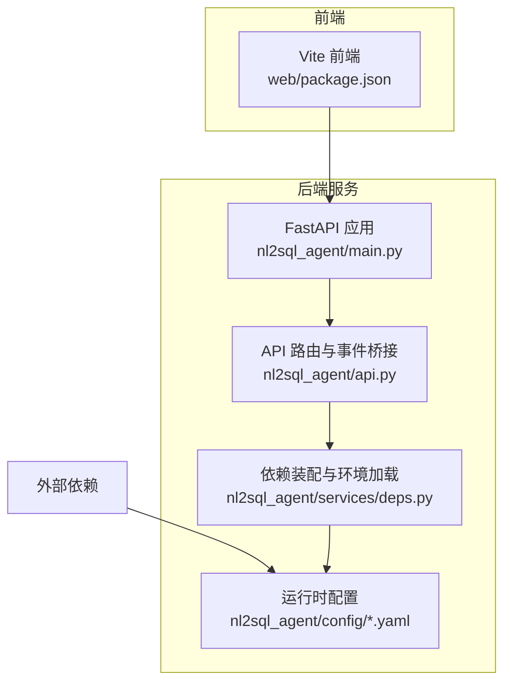
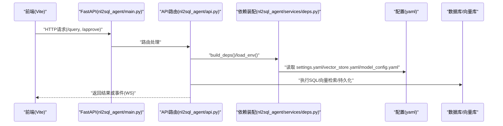
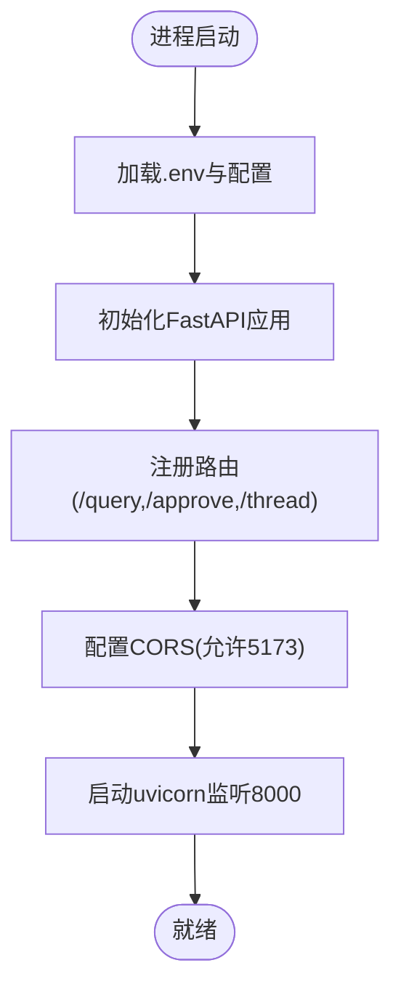
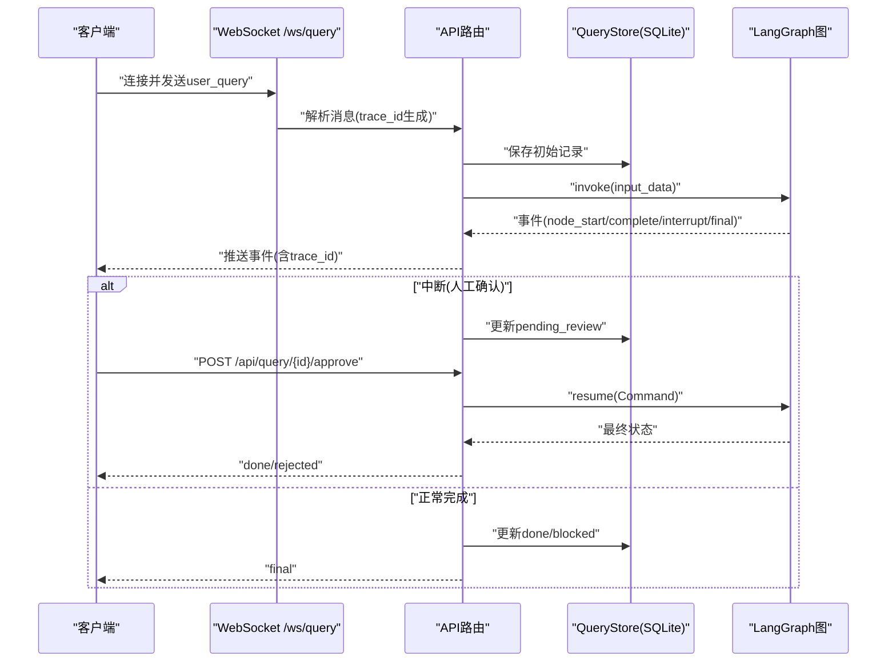
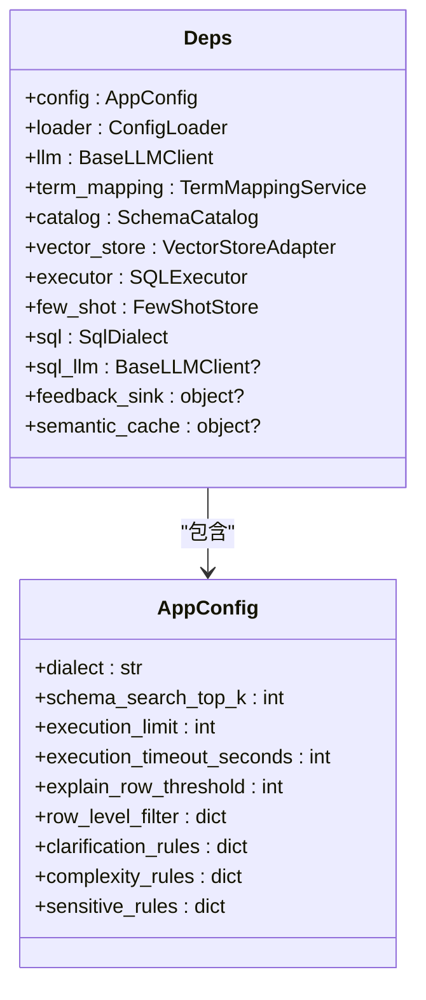
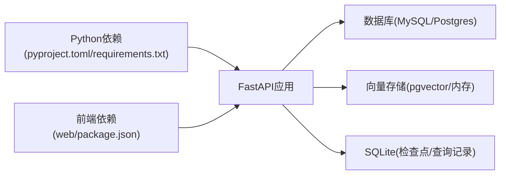

# 容器化部署

<cite>
**本文引用的文件**   
- [nl2sql_agent/main.py](file://nl2sql_agent/main.py)
- [nl2sql_agent/api.py](file://nl2sql_agent/api.py)
- [nl2sql_agent/services/deps.py](file://nl2sql_agent/services/deps.py)
- [nl2sql_agent/config/settings.yaml](file://nl2sql_agent/config/settings.yaml)
- [nl2sql_agent/config/vector_store.yaml](file://nl2sql_agent/config/vector_store.yaml)
- [nl2sql_agent/config/model_config.yaml](file://nl2sql_agent/config/model_config.yaml)
- [pyproject.toml](file://pyproject.toml)
- [requirements.txt](file://requirements.txt)
- [web/package.json](file://web/package.json)
</cite>

## 目录
1. [简介](#简介)
2. [项目结构](#项目结构)
3. [核心组件](#核心组件)
4. [架构总览](#架构总览)
5. [详细组件分析](#详细组件分析)
6. [依赖关系分析](#依赖关系分析)
7. [性能与资源限制](#性能与资源限制)
8. [监控与日志](#监控与日志)
9. [安全策略](#安全策略)
10. [故障排查](#故障排查)
11. [结论](#结论)
12. [附录：Dockerfile 编写规范与最佳实践](#附录dockerfile-编写规范与最佳实践)

## 简介
本文件面向从开发到生产的完整容器化流程，覆盖 Docker 镜像构建（多阶段构建、分层优化、依赖管理）、Dockerfile 编写规范、环境变量与端口暴露、健康检查、容器编排（docker-compose 与 Kubernetes）、资源限制、存储卷挂载、网络配置、监控与日志收集、容器间通信与安全策略。文档内容严格基于仓库现有代码与配置进行推导与说明，确保可落地执行。

## 项目结构
- Python FastAPI 服务入口位于 nl2sql_agent/main.py，提供 REST 与 WebSocket 接口，启动 uvicorn 监听 8000 端口。
- API 路由与事件流在 nl2sql_agent/api.py 中实现，包含查询、审批、历史、审计、反馈、配置管理等。
- 依赖装配与环境加载在 nl2sql_agent/services/deps.py 中完成，支持 .env 与 YAML 配置。
- 运行参数与数据库/向量库配置集中在 nl2sql_agent/config/*.yaml。
- 前端静态资源位于 web/，使用 Vite 构建，默认开发端口 5173。
- Python 依赖通过 pyproject.toml 与 requirements.txt 声明。

**图表来源** 
- [nl2sql_agent/main.py:1-152](file://nl2sql_agent/main.py#L1-L152)
- [nl2sql_agent/api.py:1-573](file://nl2sql_agent/api.py#L1-L573)
- [nl2sql_agent/services/deps.py:1-184](file://nl2sql_agent/services/deps.py#L1-L184)
- [nl2sql_agent/config/settings.yaml:1-30](file://nl2sql_agent/config/settings.yaml#L1-L30)
- [nl2sql_agent/config/vector_store.yaml:1-5](file://nl2sql_agent/config/vector_store.yaml#L1-L5)
- [nl2sql_agent/config/model_config.yaml:1-18](file://nl2sql_agent/config/model_config.yaml#L1-L18)
- [web/package.json:1-26](file://web/package.json#L1-L26)

**章节来源**
- [nl2sql_agent/main.py:1-152](file://nl2sql_agent/main.py#L1-L152)
- [nl2sql_agent/api.py:1-573](file://nl2sql_agent/api.py#L1-L573)
- [nl2sql_agent/services/deps.py:1-184](file://nl2sql_agent/services/deps.py#L1-L184)
- [nl2sql_agent/config/settings.yaml:1-30](file://nl2sql_agent/config/settings.yaml#L1-L30)
- [nl2sql_agent/config/vector_store.yaml:1-5](file://nl2sql_agent/config/vector_store.yaml#L1-L5)
- [nl2sql_agent/config/model_config.yaml:1-18](file://nl2sql_agent/config/model_config.yaml#L1-L18)
- [web/package.json:1-26](file://web/package.json#L1-L26)

## 核心组件
- FastAPI 应用与入口：定义 /query、/approve、/thread 等接口，启动 uvicorn 监听 8000 端口。
- API 路由层：WebSocket /ws/query 流式事件推送；REST /api/* 非流式接口；断线重连恢复状态。
- 依赖装配：加载 .env 与 YAML 配置，构建 LLM、SQL 执行器、向量存储、Schema Catalog 等。
- 配置中心：settings.yaml、vector_store.yaml、model_config.yaml 等集中管理运行参数。

**章节来源**
- [nl2sql_agent/main.py:1-152](file://nl2sql_agent/main.py#L1-L152)
- [nl2sql_agent/api.py:1-573](file://nl2sql_agent/api.py#L1-L573)
- [nl2sql_agent/services/deps.py:1-184](file://nl2sql_agent/services/deps.py#L1-L184)
- [nl2sql_agent/config/settings.yaml:1-30](file://nl2sql_agent/config/settings.yaml#L1-L30)
- [nl2sql_agent/config/vector_store.yaml:1-5](file://nl2sql_agent/config/vector_store.yaml#L1-L5)
- [nl2sql_agent/config/model_config.yaml:1-18](file://nl2sql_agent/config/model_config.yaml#L1-L18)

## 架构总览
后端以 FastAPI 为 HTTP/WebSocket 网关，调用 LangGraph 图执行引擎，结合 SQL 执行器与向量检索，持久化查询结果与检查点。前端通过 Vite 构建静态资源，访问后端 API。

**图表来源** 
- [nl2sql_agent/main.py:1-152](file://nl2sql_agent/main.py#L1-L152)
- [nl2sql_agent/api.py:1-573](file://nl2sql_agent/api.py#L1-L573)
- [nl2sql_agent/services/deps.py:1-184](file://nl2sql_agent/services/deps.py#L1-L184)
- [nl2sql_agent/config/settings.yaml:1-30](file://nl2sql_agent/config/settings.yaml#L1-L30)
- [nl2sql_agent/config/vector_store.yaml:1-5](file://nl2sql_agent/config/vector_store.yaml#L1-L5)
- [nl2sql_agent/config/model_config.yaml:1-18](file://nl2sql_agent/config/model_config.yaml#L1-L18)

## 详细组件分析

### FastAPI 应用与入口
- 端口与启动：uvicorn 监听 0.0.0.0:8000，便于容器内暴露 8000 端口。
- 跨域：允许本地前端 5173 端口访问。
- 环境加载：启动时加载 .env，支持 ANTHROPIC_API_KEY、ANTHROPIC_MODEL、NL2SQL_DEMO 等。
- 健康检查：建议增加 /health 端点用于 K8s 探针。

**图表来源** 
- [nl2sql_agent/main.py:1-152](file://nl2sql_agent/main.py#L1-L152)

**章节来源**
- [nl2sql_agent/main.py:1-152](file://nl2sql_agent/main.py#L1-L152)

### API 路由与事件流
- WebSocket 流式事件：/ws/query 推送节点事件（node_start/complete/retry/interrupt/final/error），支持断线重连恢复。
- REST 接口：/api/query、/api/query/{trace_id}、/api/query/{trace_id}/approve、/api/history、/api/audit/{trace_id}、/api/feedback 等。
- 持久化：QueryStore 将 trace_id、状态、SQL、计划、执行结果、审计信息写入 SQLite。
- 配置管理：术语映射、规则、表结构与注释审核接口。

**图表来源** 
- [nl2sql_agent/api.py:1-573](file://nl2sql_agent/api.py#L1-L573)

**章节来源**
- [nl2sql_agent/api.py:1-573](file://nl2sql_agent/api.py#L1-L573)

### 依赖装配与环境加载
- 环境变量优先级：.env → 系统环境变量 → YAML 配置。
- 数据库连接：settings.yaml 的 database_url 优先，其次 .env 的 DATABASE_URL/PG_DATABASE_URL。
- 向量存储：vector_store.yaml 显式选择 backend=memory 或 pgvector，pgvector.url 支持 ${PGVECTOR_URL}。
- LLM 模型：ANTHROPIC_API_KEY/ANTHROPIC_MODEL、DEEPSEEK_*、SQL_MODEL 等环境变量控制。

**图表来源** 
- [nl2sql_agent/services/deps.py:1-184](file://nl2sql_agent/services/deps.py#L1-L184)

**章节来源**
- [nl2sql_agent/services/deps.py:1-184](file://nl2sql_agent/services/deps.py#L1-L184)
- [nl2sql_agent/config/settings.yaml:1-30](file://nl2sql_agent/config/settings.yaml#L1-L30)
- [nl2sql_agent/config/vector_store.yaml:1-5](file://nl2sql_agent/config/vector_store.yaml#L1-L5)
- [nl2sql_agent/config/model_config.yaml:1-18](file://nl2sql_agent/config/model_config.yaml#L1-L18)

## 依赖关系分析
- Python 依赖：pyproject.toml 与 requirements.txt 声明 FastAPI、uvicorn、langgraph、pydantic、sqlglot、anthropic/openai、psycopg/pymysql、sentence-transformers、modelscope 等。
- 前端依赖：web/package.json 声明 React、Ant Design、Vite、TypeScript 等。
- 运行时依赖：SQLite（Checkpoints/QueryStore）、PostgreSQL/MySQL（SQL执行器）、可选 pgvector（向量存储）。

**图表来源** 
- [pyproject.toml:1-44](file://pyproject.toml#L1-L44)
- [requirements.txt:1-15](file://requirements.txt#L1-L15)
- [web/package.json:1-26](file://web/package.json#L1-L26)

**章节来源**
- [pyproject.toml:1-44](file://pyproject.toml#L1-L44)
- [requirements.txt:1-15](file://requirements.txt#L1-L15)
- [web/package.json:1-26](file://web/package.json#L1-L26)

## 性能与资源限制
- 只读与限流：settings.yaml 中 execution.read_only=true、limit=1000、timeout_seconds=30、explain_row_threshold=1000000。
- 向量检索：Top-K 可调 schema_search_top_k=5，backend 可选择 memory/pgvector。
- 容器资源限制：建议在 docker-compose/K8s 中设置 CPU/内存限制，避免 OOM 与 CPU 争用。
- 存储卷：持久化 data/ 目录（SQLite 文件）与 models/（本地嵌入模型）应挂载为卷。

**章节来源**
- [nl2sql_agent/config/settings.yaml:1-30](file://nl2sql_agent/config/settings.yaml#L1-L30)
- [nl2sql_agent/config/vector_store.yaml:1-5](file://nl2sql_agent/config/vector_store.yaml#L1-L5)

## 监控与日志
- 结构化日志：建议启用 uvicorn access log 与业务日志输出到 stdout/stderr，由容器运行时采集。
- 指标暴露：可在 FastAPI 中添加 /metrics 端点（Prometheus），或使用中间件统计 QPS、延迟、错误率。
- 链路追踪：利用 trace_id 贯穿请求生命周期，便于问题定位。
- 健康检查：新增 /health 端点，供 K8s liveness/readiness 探针调用。

[本节为通用指导，不直接分析具体文件]

## 安全策略
- 管理员权限：ADMIN_TOKEN 环境变量控制 /api/config/* 写操作权限。
- 数据隔离：data_scope 仅控制系统/表权限，行级过滤需上层鉴权注入 row_level_filters。
- 网络安全：生产环境禁用 CORS 通配符，仅允许可信域名；使用反向代理（Nginx/Traefik）统一入口。
- 密钥管理：敏感信息（API Key、数据库 URL）通过环境变量注入，避免硬编码。

**章节来源**
- [nl2sql_agent/api.py:396-399](file://nl2sql_agent/api.py#L396-L399)
- [nl2sql_agent/config/settings.yaml:24-30](file://nl2sql_agent/config/settings.yaml#L24-L30)

## 故障排查
- 常见错误：未配置数据库连接导致执行失败；向量存储 backend=pgvector 但未设置 PGVECTOR_URL；LLM 环境变量缺失。
- 诊断步骤：检查 .env 与 settings.yaml；查看容器日志；验证网络连接；确认 SQLite 文件可写。
- 恢复机制：断线重连通过 trace_id 恢复状态；/api/query/{id}/approve 与 /api/query/{id}/resume 支持人工干预。

**章节来源**
- [nl2sql_agent/services/deps.py:163-170](file://nl2sql_agent/services/deps.py#L163-L170)
- [nl2sql_agent/api.py:165-180](file://nl2sql_agent/api.py#L165-L180)
- [nl2sql_agent/api.py:280-315](file://nl2sql_agent/api.py#L280-L315)

## 结论
本项目具备完整的容器化基础：FastAPI 服务、YAML 配置、.env 环境变量、SQLite 持久化、可选 pgvector 向量存储。通过多阶段构建、资源限制、健康检查、监控日志与安全策略，可实现从开发到生产的稳定部署。

[本节为总结性内容，不直接分析具体文件]

## 附录：Dockerfile 编写规范与最佳实践

### 多阶段构建优化
- 构建阶段：安装 Python 依赖（使用 uv.lock/pyproject.toml），编译前端静态资源（Vite build）。
- 运行阶段：仅包含运行时依赖与构建产物，减小镜像体积。
- 缓存优化：分层放置依赖安装与源码复制，提升构建缓存命中率。

### 镜像分层策略
- 基础镜像：选择官方 Python 精简版（如 python:3.11-slim），减少攻击面。
- 依赖层：先安装系统依赖与 Python 包，再复制源码，避免重复安装。
- 应用层：仅复制必要文件（dist/、nl2sql_agent/、config/、data/）。

### 依赖管理
- Python：使用 pyproject.toml 与 uv.lock，确保依赖版本锁定。
- 前端：web/package.json 与 package-lock.json 锁定依赖。
- 环境变量：DATABASE_URL、ANTHROPIC_API_KEY、ANTHROPIC_MODEL、PGVECTOR_URL、ADMIN_TOKEN 等通过环境变量注入。

### Dockerfile 编写规范
- 基础镜像：python:3.11-slim
- 工作目录：/app
- 环境变量：设置 PYTHONUNBUFFERED=1、TZ=Asia/Shanghai
- 端口：EXPOSE 8000
- 健康检查：HEALTHCHECK 调用 /health（需新增端点）
- 启动命令：uvicorn nl2sql_agent.main:app --host 0.0.0.0 --port 8000

### 环境变量配置
- 数据库：DATABASE_URL（mysql:// 或 postgresql://）
- LLM：ANTHROPIC_API_KEY、ANTHROPIC_MODEL、DEEPSEEK_API_KEY、DEEPSEEK_MODEL、SQL_MODEL
- 向量库：PGVECTOR_URL（backend=pgvector 时必需）
- 其他：ADMIN_TOKEN、NL2SQL_DEMO（测试模式）

### 端口暴露与健康检查
- 端口：8000（FastAPI）
- 健康检查：新增 /health 端点，返回 200 OK
- 探针：K8s livenessProbe 与 readinessProbe 指向 /health

### 容器编排配置

#### docker-compose.yml 结构
- services：
  - app：nl2sql 服务，映射 8000 端口，挂载 data/ 与 config/ 卷
  - db：MySQL/PostgreSQL（根据 DATABASE_URL 选择）
  - redis：可选，用于会话或缓存
  - nginx：反向代理，统一入口与 HTTPS 终止
- volumes：
  - data：持久化 SQLite 文件
  - config：挂载 YAML 配置文件
  - models：挂载本地嵌入模型
- environment：注入所有环境变量

#### Kubernetes 部署清单
- Deployment：副本数、资源限制（CPU/内存）、环境变量、卷挂载
- Service：ClusterIP 暴露 8000 端口
- Ingress：HTTPS 入口与域名绑定
- ConfigMap/Secret：管理配置与敏感信息
- PersistentVolumeClaim：持久化 data/ 与 models/
- HorizontalPodAutoscaler：基于 CPU/内存自动扩缩容

### 容器资源限制配置
- CPU 限制：requests=0.5，limits=1.0
- 内存限制：requests=512Mi，limits=1Gi
- 存储卷：data/（SQLite）、models/（嵌入模型）、config/（YAML）
- 网络：限制出站流量，仅允许访问数据库与 LLM API

### 容器间通信与安全策略
- 内部网络：使用 Docker Network 或 K8s Service 隔离
- 防火墙：仅开放必要端口（8000、数据库端口）
- 身份认证：ADMIN_TOKEN 保护管理接口
- 审计日志：记录所有变更操作

### 监控与日志收集方案
- 日志：stdout/stderr 输出，由容器运行时（Docker/K8s）采集
- 指标：Prometheus 抓取 /metrics 端点
- 链路追踪：trace_id 贯穿请求，便于问题定位
- 告警：基于错误率、延迟、资源使用率设置告警规则

### 从开发到生产的完整流程
- 开发：本地运行 uvicorn，前端 Vite 开发服务器
- 测试：单元测试、集成测试、负载测试
- 预发：镜像构建、部署到预发环境、验证配置
- 生产：灰度发布、监控告警、回滚预案

[本节为通用指导，不直接分析具体文件]