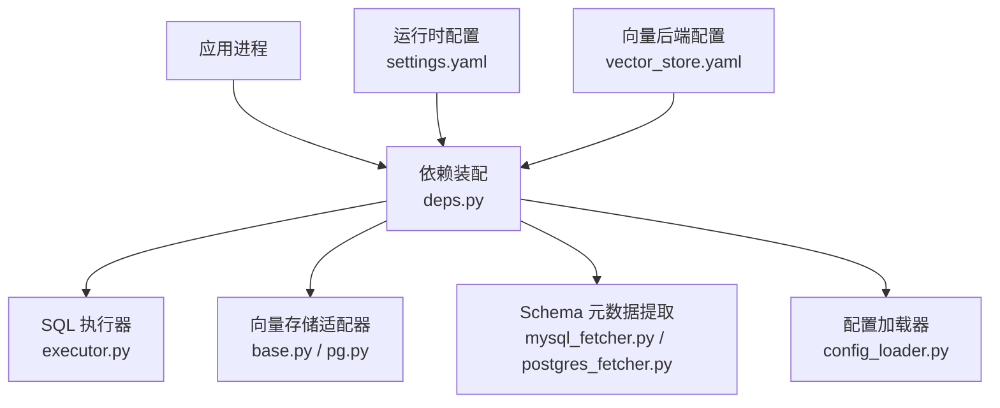
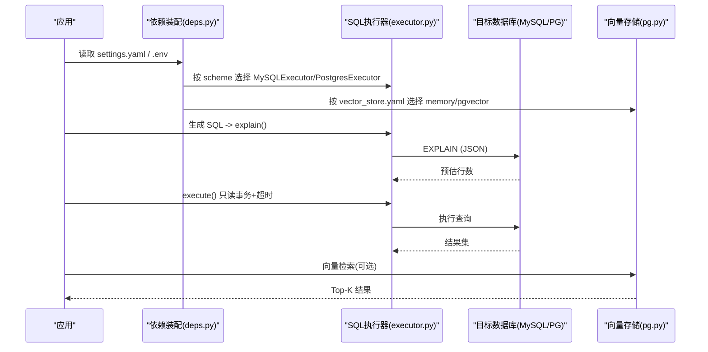
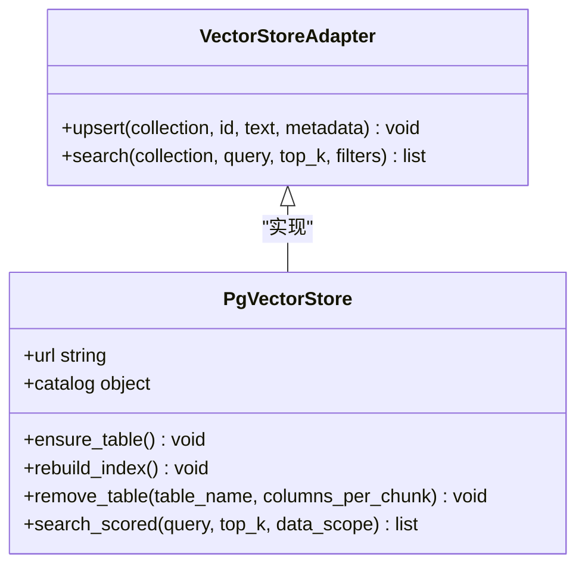
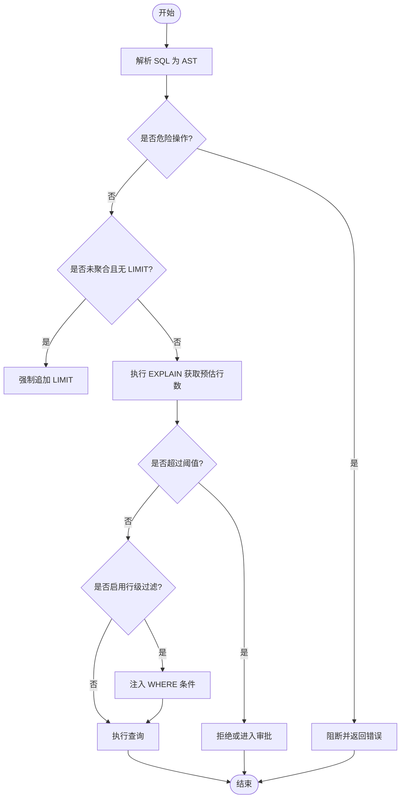
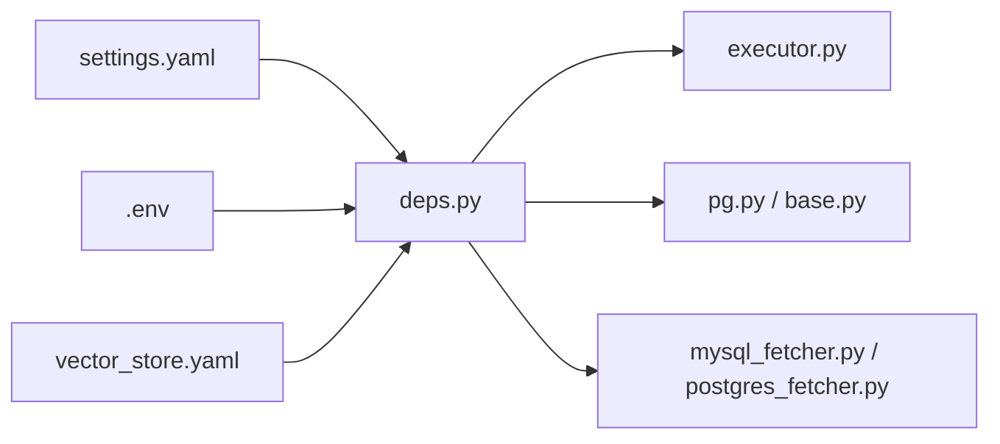

# 数据库部署

<cite>
**本文引用的文件**   
- [settings.yaml](file://nl2sql_agent/config/settings.yaml)
- [vector_store.yaml](file://nl2sql_agent/config/vector_store.yaml)
- [deps.py](file://nl2sql_agent/services/deps.py)
- [executor.py](file://nl2sql_agent/services/executor.py)
- [mysql_fetcher.py](file://nl2sql_agent/services/schema_ingest/mysql_fetcher.py)
- [postgres_fetcher.py](file://nl2sql_agent/services/schema_ingest/postgres_fetcher.py)
- [pg.py](file://nl2sql_agent/services/vector_store/pg.py)
- [base.py](file://nl2sql_agent/services/vector_store/base.py)
- [config_loader.py](file://nl2sql_agent/services/config_loader.py)
- [m9_sensitive_check.py](file://nl2sql_agent/nodes/m9_sensitive_check.py)
- [m8_static_validation.py](file://nl2sql_agent/nodes/m8_static_validation.py)
- [requirements.txt](file://requirements.txt)
</cite>

## 目录
1. [简介](#简介)
2. [项目结构](#项目结构)
3. [核心组件](#核心组件)
4. [架构总览](#架构总览)
5. [详细组件分析](#详细组件分析)
6. [依赖关系分析](#依赖关系分析)
7. [性能考虑](#性能考虑)
8. [故障排查指南](#故障排查指南)
9. [结论](#结论)
10. [附录](#附录)

## 简介
本文件面向生产环境，提供 MySQL 与 PostgreSQL 的部署与运维指南，涵盖安装配置、主从复制要点、连接池与参数调优；向量数据库 pgvector 的部署与索引优化；数据备份恢复策略（全量/增量/灾难恢复）；安全配置（用户权限、SSL、访问控制）；监控告警（慢查询、连接数、容量规划）。文档同时结合代码实现，给出可落地的最佳实践。

## 项目结构
本项目通过配置驱动选择数据库方言与执行器，并支持两种向量存储后端：内存与 pgvector。关键路径如下：
- 运行参数与连接信息：settings.yaml
- 向量后端选择与 pgvector URL：vector_store.yaml
- 依赖装配与执行器构建：deps.py
- SQL 执行器（MySQL/Postgres）：executor.py
- Schema 元数据拉取（MySQL/PostgreSQL）：mysql_fetcher.py、postgres_fetcher.py
- 向量存储接口与 pgvector 实现：base.py、pg.py
- 配置热加载：config_loader.py
- 敏感性与执行前校验：m9_sensitive_check.py、m8_static_validation.py

图表来源 
- [deps.py:113-184](file://nl2sql_agent/services/deps.py#L113-L184)
- [executor.py:53-159](file://nl2sql_agent/services/executor.py#L53-L159)
- [mysql_fetcher.py:83-218](file://nl2sql_agent/services/schema_ingest/mysql_fetcher.py#L83-L218)
- [postgres_fetcher.py:18-159](file://nl2sql_agent/services/schema_ingest/postgres_fetcher.py#L18-L159)
- [base.py:11-21](file://nl2sql_agent/services/vector_store/base.py#L11-L21)
- [pg.py:15-174](file://nl2sql_agent/services/vector_store/pg.py#L15-L174)
- [config_loader.py:14-36](file://nl2sql_agent/services/config_loader.py#L14-L36)
- [settings.yaml:1-29](file://nl2sql_agent/config/settings.yaml#L1-L29)
- [vector_store.yaml:1-6](file://nl2sql_agent/config/vector_store.yaml#L1-L6)

章节来源
- [deps.py:113-184](file://nl2sql_agent/services/deps.py#L113-L184)
- [settings.yaml:1-29](file://nl2sql_agent/config/settings.yaml#L1-L29)
- [vector_store.yaml:1-6](file://nl2sql_agent/config/vector_store.yaml#L1-L6)

## 核心组件
- 配置中心
  - settings.yaml：定义 dialect、schema_search_top_k、database_url/pg_database_url/pgvector_url、execution 限制与超时、行级过滤开关等。
  - vector_store.yaml：显式选择向量后端（memory 或 pgvector），并提供 pgvector.url（支持环境变量替换）。
  - config_loader.py：YAML 配置热加载，基于 mtime 缓存与自动重载。
- 执行器
  - PostgresExecutor：只读事务 + statement_timeout，EXPLAIN JSON 预估行数。
  - MySQLExecutor：START TRANSACTION READ ONLY + MAX_EXECUTION_TIME，EXPLAIN FORMAT=JSON 预估行数。
- 向量存储
  - VectorStoreAdapter：统一 upsert/search 接口。
  - PgVectorStore：使用 psycopg 直连 PG，写入 schema_embeddings 表，余弦距离检索，支持按 collection/business_line 过滤。
- Schema 元数据提取
  - mysql_fetcher.py：从 information_schema 拉取表/列/约束/索引，标注敏感字段。
  - postgres_fetcher.py：从 information_schema 与 pg_* 系统视图拉取等价元数据。

章节来源
- [settings.yaml:1-29](file://nl2sql_agent/config/settings.yaml#L1-L29)
- [vector_store.yaml:1-6](file://nl2sql_agent/config/vector_store.yaml#L1-L6)
- [config_loader.py:14-36](file://nl2sql_agent/services/config_loader.py#L14-L36)
- [executor.py:53-159](file://nl2sql_agent/services/executor.py#L53-L159)
- [base.py:11-21](file://nl2sql_agent/services/vector_store/base.py#L11-L21)
- [pg.py:15-174](file://nl2sql_agent/services/vector_store/pg.py#L15-L174)
- [mysql_fetcher.py:83-218](file://nl2sql_agent/services/schema_ingest/mysql_fetcher.py#L83-L218)
- [postgres_fetcher.py:18-159](file://nl2sql_agent/services/schema_ingest/postgres_fetcher.py#L18-L159)

## 架构总览
下图展示应用启动时如何根据配置选择执行器与向量后端，并在查询链路中执行 EXPLAIN 与只读执行。

图表来源 
- [deps.py:113-184](file://nl2sql_agent/services/deps.py#L113-L184)
- [executor.py:53-159](file://nl2sql_agent/services/executor.py#L53-L159)
- [pg.py:15-174](file://nl2sql_agent/services/vector_store/pg.py#L15-L174)
- [settings.yaml:1-29](file://nl2sql_agent/config/settings.yaml#L1-L29)
- [vector_store.yaml:1-6](file://nl2sql_agent/config/vector_store.yaml#L1-L6)

## 详细组件分析

### MySQL 部署与配置
- 安装与基础配置
  - 使用 InnoDB 引擎，字符集 utf8mb4，开启二进制日志用于备份与复制。
  - 建议启用 GTID 模式，便于主从一致性与快速切换。
- 主从复制
  - 主库：server-id、log-bin、binlog-format、gtid-mode、enforce-gtid-consistency。
  - 从库：server-id、relay-log、read-only、skip-slave-start 配合手动切换。
  - 验证：SHOW MASTER STATUS / SHOW SLAVE STATUS（或新语法下的相应命令）。
- 连接池与执行器
  - 应用层通过 pymysql 连接，设置 connect_timeout、autocommit=False，执行器内部 START TRANSACTION READ ONLY 保证只读。
  - 建议为应用进程配置连接池（如连接池大小=CPU核数×2~4），避免频繁建连。
- 性能参数调优（示例方向）
  - innodb_buffer_pool_size 约为物理内存的 60%~80%。
  - innodb_log_file_size、innodb_flush_log_at_trx_commit、sync_binlog 根据 RPO/RTO 权衡。
  - max_connections、thread_cache_size、table_open_cache 根据并发与表规模调整。
  - 查询超时：MAX_EXECUTION_TIME 由执行器在会话级别设置，避免长查询拖垮资源。
- 备份与恢复
  - 全量：mysqldump --single-transaction --routines --triggers --master-data=2。
  - 增量：基于 binlog 的增量导出与回放（mysqlbinlog）。
  - 灾备：定期全量 + 持续 binlog 归档，演练恢复流程。
- 安全配置
  - 最小权限账号，仅授予 SELECT 权限；必要时开启 SSL 连接。
  - 审计插件与访问控制列表（ACL）按业务隔离。

章节来源
- [executor.py:83-159](file://nl2sql_agent/services/executor.py#L83-L159)
- [settings.yaml:1-29](file://nl2sql_agent/config/settings.yaml#L1-L29)

### PostgreSQL 部署与配置
- 安装与基础配置
  - 启用 WAL 归档与流复制，推荐 streaming replication。
  - 使用只读账号 + BEGIN TRANSACTION READ ONLY，确保只读语义。
- 主从复制
  - 主库：wal_level、max_wal_senders、max_replication_slots、archive_mode。
  - 从库：primary_conninfo、recovery.conf（或 12+ 的 standby.signal 方式）、hot_standby。
  - 监控：pg_stat_replication、pg_stat_wal_receiver。
- 连接池与执行器
  - 应用层通过 psycopg 直连，执行器设置 LOCAL statement_timeout 与只读事务。
  - 建议引入 PgBouncer 做连接池，减少连接开销。
- 性能参数调优（示例方向）
  - shared_buffers、work_mem、maintenance_work_mem、effective_cache_size。
  - wal_buffers、checkpoint_completion_target、max_wal_size。
  - autovacuum 相关参数保障统计信息与索引健康。
- 备份与恢复
  - 全量：pg_basebackup。
  - 增量：WAL 归档 + PITR 时间点恢复。
  - 灾备：异地归档与定期恢复演练。
- 安全配置
  - pg_hba.conf 细粒度访问控制，强制 SSL（ssl=on, ssl_ca_file 等）。
  - 角色与权限最小化，必要时使用 row-level security。

章节来源
- [executor.py:53-81](file://nl2sql_agent/services/executor.py#L53-L81)
- [settings.yaml:1-29](file://nl2sql_agent/config/settings.yaml#L1-L29)

### 向量数据库 pgvector 部署与优化
- 部署要点
  - 安装 pgvector 扩展，创建 schema_embeddings 表（维度来自模型配置）。
  - 通过 vector_store.yaml 指定 backend=pgvector 与 pgvector.url（支持环境变量替换）。
- 索引优化
  - 对 embedding 列建立 ivfflat/hnsw 索引，按 top_k 与数据规模选择参数（lists、m、ef_construction、ef_search）。
  - 重建索引：rebuild_index 会清空并按 catalog 或 M-Schema 源重新写入。
- 查询性能调优
  - 使用 <=> 算子进行余弦相似度排序，结合 business_line 过滤提升命中率。
  - 合理设置 top_k 与 LIMIT，避免大结果集扫描。
- 存储空间管理
  - 定期清理无效集合与过期条目；分 collection 管理不同粒度的向量（表/列/关系）。
  - 监控表膨胀与索引体积，按需 VACUUM/VACUUM FULL。

图表来源 
- [base.py:11-21](file://nl2sql_agent/services/vector_store/base.py#L11-L21)
- [pg.py:15-174](file://nl2sql_agent/services/vector_store/pg.py#L15-L174)

章节来源
- [vector_store.yaml:1-6](file://nl2sql_agent/config/vector_store.yaml#L1-L6)
- [pg.py:15-174](file://nl2sql_agent/services/vector_store/pg.py#L15-L174)

### Schema 元数据同步与入库
- MySQL
  - 通过 information_schema.TABLES/COLUMNS/KEY_COLUMN_USAGE/STATISTICS 拉取表结构、约束、索引与估计行数，自动识别敏感字段。
- PostgreSQL
  - 通过 information_schema 与 pg_class/pg_namespace/pg_indexes 等系统视图拉取等价信息。
- 入库与向量索引
  - 将元数据转换为文本描述，调用 embedding 函数生成向量，写入 schema_embeddings。
  - 支持按 business_line 过滤检索，提高召回精度。

章节来源
- [mysql_fetcher.py:83-218](file://nl2sql_agent/services/schema_ingest/mysql_fetcher.py#L83-L218)
- [postgres_fetcher.py:18-159](file://nl2sql_agent/services/schema_ingest/postgres_fetcher.py#L18-L159)
- [pg.py:67-118](file://nl2sql_agent/services/vector_store/pg.py#L67-L118)

### 执行前校验与安全控制
- 危险操作检测：AST 层面拦截非 SELECT 类语句。
- 行级过滤：在 WHERE 注入平台/业务线过滤条件，防止越权。
- 未聚合强制 LIMIT：避免无界结果集。
- EXPLAIN 阈值：预估行数超过阈值直接拒绝或要求审批。

图表来源 
- [m8_static_validation.py:119-143](file://nl2sql_agent/nodes/m8_static_validation.py#L119-L143)
- [m9_sensitive_check.py:32-67](file://nl2sql_agent/nodes/m9_sensitive_check.py#L32-L67)
- [executor.py:53-159](file://nl2sql_agent/services/executor.py#L53-L159)

章节来源
- [m8_static_validation.py:119-143](file://nl2sql_agent/nodes/m8_static_validation.py#L119-L143)
- [m9_sensitive_check.py:32-67](file://nl2sql_agent/nodes/m9_sensitive_check.py#L32-L67)

## 依赖关系分析
- 依赖装配
  - build_deps 读取 settings.yaml 与 .env，按 database_url scheme 选择执行器。
  - build_vector_store 读取 vector_store.yaml，显式选择 memory 或 pgvector。
- 外部依赖
  - psycopg（PostgreSQL）、pymysql（MySQL）在 requirements.txt 中声明。

图表来源 
- [deps.py:113-184](file://nl2sql_agent/services/deps.py#L113-L184)
- [requirements.txt:1-15](file://requirements.txt#L1-L15)

章节来源
- [deps.py:113-184](file://nl2sql_agent/services/deps.py#L113-L184)
- [requirements.txt:1-15](file://requirements.txt#L1-L15)

## 性能考虑
- 连接与超时
  - MySQL：会话级 MAX_EXECUTION_TIME 限制长查询；PostgreSQL：statement_timeout。
  - 连接池：MySQL 使用连接池减少握手开销；PostgreSQL 建议使用 PgBouncer。
- 执行计划与阈值
  - 通过 EXPLAIN 预估行数，结合 explain_row_threshold 提前拒绝高风险查询。
- 向量检索
  - 选择合适的索引类型与参数，控制 top_k 与过滤条件，降低扫描成本。
- 资源隔离
  - 读写分离与只读账号，避免写操作影响查询稳定性。

[本节为通用指导，不直接分析具体文件]

## 故障排查指南
- 无法执行模块 10
  - 现象：未配置数据库连接导致无法真正执行。
  - 排查：检查 settings.yaml 的 database_url 或 .env 的 DATABASE_URL 是否正确。
- 向量后端未就绪
  - 现象：backend=pgvector 但未提供 pgvector.url。
  - 排查：确认 vector_store.yaml 与 PGVECTOR_URL 环境变量已设置。
- 执行超时或预估行数过大
  - 现象：查询被拒绝或执行失败。
  - 排查：查看 execution.timeout_seconds 与 explain_row_threshold，优化 SQL 与索引。
- 行级过滤未生效
  - 现象：数据越权或未按预期过滤。
  - 排查：确认 row_level_filter.enabled 与注入值是否正确。

章节来源
- [deps.py:162-170](file://nl2sql_agent/services/deps.py#L162-L170)
- [deps.py:97-110](file://nl2sql_agent/services/deps.py#L97-L110)
- [m9_sensitive_check.py:52-67](file://nl2sql_agent/nodes/m9_sensitive_check.py#L52-L67)
- [m8_static_validation.py:121-143](file://nl2sql_agent/nodes/m8_static_validation.py#L121-L143)

## 结论
本项目以配置为中心，灵活支持 MySQL 与 PostgreSQL 的只读执行与向量检索。通过 AST 校验、EXPLAIN 阈值、行级过滤与只读事务，形成完善的安全与稳定性保障。生产部署应结合主从复制、备份恢复、SSL 与访问控制，配合连接池与参数调优，确保高可用与高性能。

[本节为总结性内容，不直接分析具体文件]

## 附录
- 常用命令与脚本
  - 重启脚本：restart.bat（Windows 一键重启后端与前端）。
- 参考配置项
  - settings.yaml：dialect、schema_search_top_k、database_url、execution.*、row_level_filter。
  - vector_store.yaml：backend、pgvector.url。

章节来源
- [restart.bat:1-9](file://restart.bat#L1-L9)
- [settings.yaml:1-29](file://nl2sql_agent/config/settings.yaml#L1-L29)
- [vector_store.yaml:1-6](file://nl2sql_agent/config/vector_store.yaml#L1-L6)