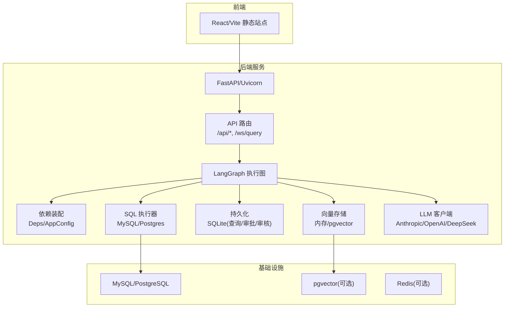
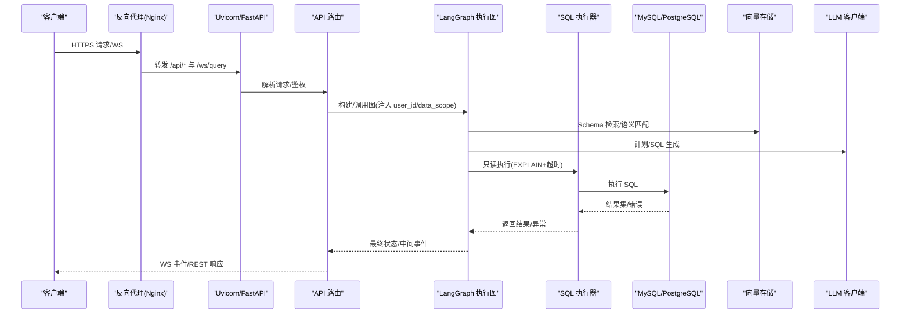
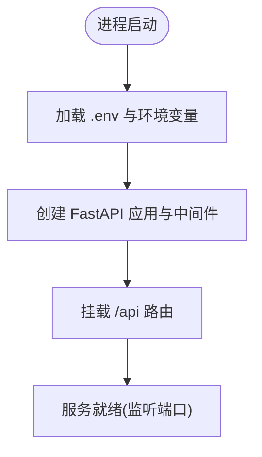
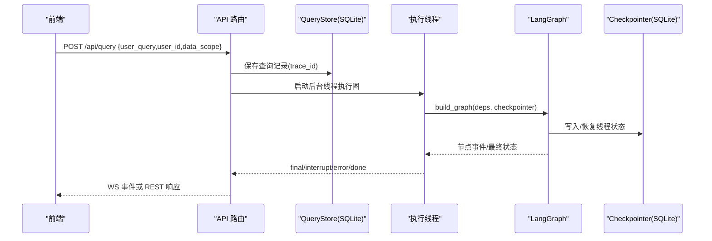
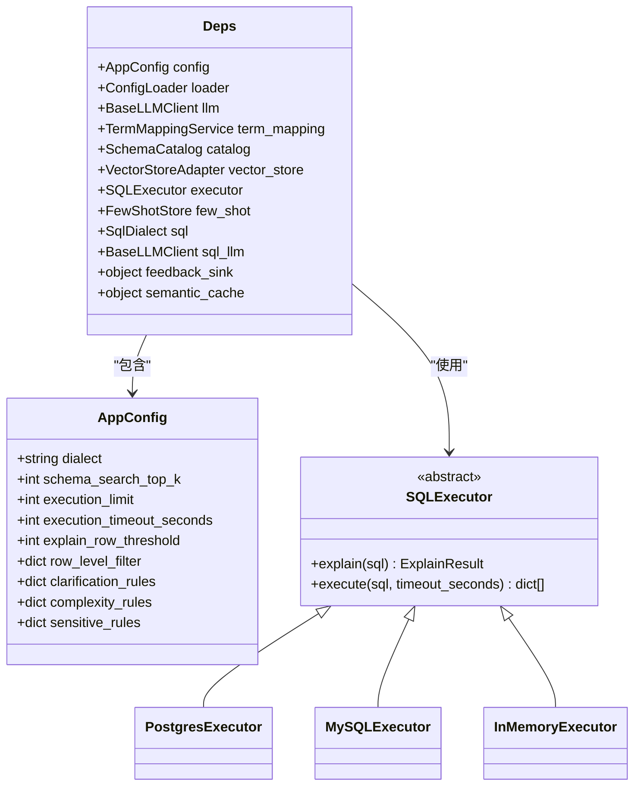
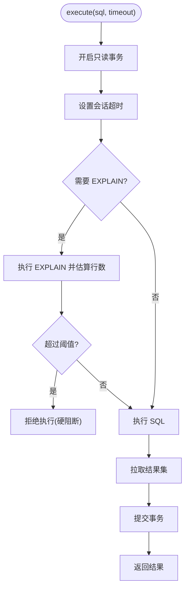
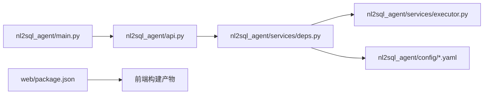
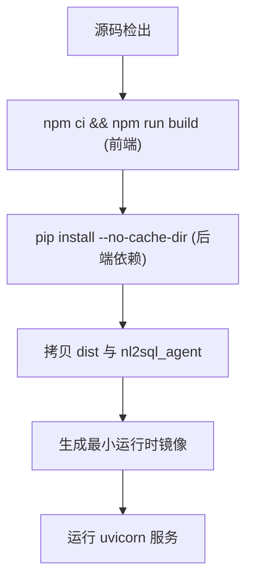

# 生产环境部署

<cite>
**本文引用的文件**   
- [nl2sql_agent/main.py](file://nl2sql_agent/main.py)
- [nl2sql_agent/api.py](file://nl2sql_agent/api.py)
- [nl2sql_agent/services/deps.py](file://nl2sql_agent/services/deps.py)
- [nl2sql_agent/services/executor.py](file://nl2sql_agent/services/executor.py)
- [nl2sql_agent/config/settings.yaml](file://nl2sql_agent/config/settings.yaml)
- [nl2sql_agent/config/vector_store.yaml](file://nl2sql_agent/config/vector_store.yaml)
- [nl2sql_agent/config/sensitive_rules.yaml](file://nl2sql_agent/config/sensitive_rules.yaml)
- [nl2sql_agent/config/model_config.yaml](file://nl2sql_agent/config/model_config.yaml)
- [pyproject.toml](file://pyproject.toml)
- [requirements.txt](file://requirements.txt)
- [web/package.json](file://web/package.json)
</cite>

## 目录
1. [简介](#简介)
2. [项目结构](#项目结构)
3. [核心组件](#核心组件)
4. [架构总览](#架构总览)
5. [详细组件分析](#详细组件分析)
6. [依赖关系分析](#依赖关系分析)
7. [性能与容量规划](#性能与容量规划)
8. [安全加固](#安全加固)
9. [监控与可观测性](#监控与可观测性)
10. [容器化与编排](#容器化与编排)
11. [CI/CD 流水线与发布管理](#cicd-流水线与发布管理)
12. [故障排查指南](#故障排查指南)
13. [结论](#结论)

## 简介
本文件面向生产环境，提供从零到一搭建 NL2SQL Agent 的完整部署文档。内容覆盖：
- 容器镜像构建（多阶段优化）、容器编排与 Kubernetes 清单
- 负载均衡、反向代理、健康检查、故障转移与扩缩容策略
- 数据库部署（MySQL/PostgreSQL）主从复制、连接池、备份恢复与调优
- 安全加固（网络安全、访问控制、SSL/TLS、扫描）
- 监控告警、日志收集与性能监控
- CI/CD 流水线、自动化测试与发布流程

## 项目结构
后端服务基于 FastAPI + Uvicorn，使用 LangGraph 驱动查询图执行；前端为 React + Vite 静态站点。关键目录与职责：
- nl2sql_agent: 后端服务入口、路由、依赖装配、执行器、配置加载
- web: 前端应用（开发/构建脚本在 package.json）
- config: 运行时配置（settings、模型、向量存储、敏感规则等）
- scripts: 数据导入与辅助脚本
- pyproject.toml / requirements.txt: 依赖声明与构建配置

图表来源
- [nl2sql_agent/main.py:1-152](file://nl2sql_agent/main.py#L1-L152)
- [nl2sql_agent/api.py:1-573](file://nl2sql_agent/api.py#L1-L573)
- [nl2sql_agent/services/deps.py:1-181](file://nl2sql_agent/services/deps.py#L1-L181)
- [nl2sql_agent/services/executor.py:1-205](file://nl2sql_agent/services/executor.py#L1-L205)

章节来源
- [nl2sql_agent/main.py:1-152](file://nl2sql_agent/main.py#L1-L152)
- [nl2sql_agent/api.py:1-573](file://nl2sql_agent/api.py#L1-L573)
- [web/package.json:1-26](file://web/package.json#L1-L26)

## 核心组件
- HTTP 服务与路由
  - 入口 FastAPI 应用、CORS、路由挂载、线程状态查看
  - WebSocket 流式事件推送（node_start/complete/retry/interrupt/final/error）
- 依赖装配与配置
  - AppConfig/Deps 组装 LLM、向量存储、执行器、术语映射、Schema 目录
  - settings.yaml 统一开关（dialect、limit、timeout、explain_row_threshold、row_level_filter）
- SQL 执行器
  - PostgresExecutor: READ ONLY 事务 + statement_timeout
  - MySQLExecutor: READ ONLY 事务 + MAX_EXECUTION_TIME + EXPLAIN FORMAT=JSON
- 向量存储
  - memory（默认）或 pgvector（需 PGVECTOR_URL）
- 持久化
  - SQLite 存储查询历史、审批队列、审核队列

章节来源
- [nl2sql_agent/main.py:1-152](file://nl2sql_agent/main.py#L1-L152)
- [nl2sql_agent/api.py:1-573](file://nl2sql_agent/api.py#L1-L573)
- [nl2sql_agent/services/deps.py:1-181](file://nl2sql_agent/services/deps.py#L1-L181)
- [nl2sql_agent/services/executor.py:1-205](file://nl2sql_agent/services/executor.py#L1-L205)
- [nl2sql_agent/config/settings.yaml:1-30](file://nl2sql_agent/config/settings.yaml#L1-L30)
- [nl2sql_agent/config/vector_store.yaml:1-6](file://nl2sql_agent/config/vector_store.yaml#L1-L6)

## 架构总览
系统采用“Web 前端 + FastAPI 网关 + LangGraph 工作流 + 多后端（DB/向量/LLM）”的分层架构。请求进入后由 API 路由分发，WS 通道用于实时事件推送；工作流节点负责意图澄清、Schema 检索、计划生成与校验、SQL 生成与静态校验、敏感判定、沙箱执行与结果解释。

图表来源
- [nl2sql_agent/main.py:1-152](file://nl2sql_agent/main.py#L1-L152)
- [nl2sql_agent/api.py:1-573](file://nl2sql_agent/api.py#L1-L573)
- [nl2sql_agent/services/deps.py:1-181](file://nl2sql_agent/services/deps.py#L1-L181)
- [nl2sql_agent/services/executor.py:1-205](file://nl2sql_agent/services/executor.py#L1-L205)

## 详细组件分析

### HTTP 服务与路由（main.py）
- 启动 FastAPI 应用，启用 CORS（开发用），挂载 API 路由
- 提供 /query、/approve、/thread/{id} 等 REST 接口
- 通过 get_graph() 懒加载并缓存图实例，支持演示模式（NL2SQL_DEMO=1）

图表来源
- [nl2sql_agent/main.py:1-152](file://nl2sql_agent/main.py#L1-L152)

章节来源
- [nl2sql_agent/main.py:1-152](file://nl2sql_agent/main.py#L1-L152)

### API 路由与事件桥接（api.py）
- WebSocket /ws/query：流式推送节点事件，支持断线重连与 trace_id 恢复
- REST /api/query：非流式提交，返回运行中/完成/待审批状态
- 审批与恢复：/api/query/{trace_id}/approve 与 /resume 支持人工确认与任意中断恢复
- 历史与审计：/history、/approvals、/audit/{trace_id}
- 反馈：/feedback
- 配置管理：术语映射读写、规则读取、表结构与注释审核、重新入库

图表来源
- [nl2sql_agent/api.py:1-573](file://nl2sql_agent/api.py#L1-L573)

章节来源
- [nl2sql_agent/api.py:1-573](file://nl2sql_agent/api.py#L1-L573)

### 依赖装配与配置（deps.py）
- AppConfig/Deps：集中管理方言、限制、超时、阈值、行级过滤、规则集合
- build_deps：按 settings.yaml 与 .env 装配 LLM、向量存储、执行器、术语映射、Schema 目录
- build_vector_store：显式选择 memory 或 pgvector（PGVECTOR_URL）
- build_executor_from_url：根据 URL scheme 自动选择 MySQL/Postgres 执行器

图表来源
- [nl2sql_agent/services/deps.py:1-181](file://nl2sql_agent/services/deps.py#L1-L181)
- [nl2sql_agent/services/executor.py:1-205](file://nl2sql_agent/services/executor.py#L1-L205)

章节来源
- [nl2sql_agent/services/deps.py:1-181](file://nl2sql_agent/services/deps.py#L1-L181)

### SQL 执行器（executor.py）
- PostgresExecutor：READ ONLY 事务 + statement_timeout，EXPLAIN JSON 预估行数
- MySQLExecutor：READ ONLY 事务 + MAX_EXECUTION_TIME，EXPLAIN FORMAT=JSON 预估行数
- InMemoryExecutor：测试/演示用，支持模拟失败、空结果、EXPLAIN 失败

图表来源
- [nl2sql_agent/services/executor.py:1-205](file://nl2sql_agent/services/executor.py#L1-L205)

章节来源
- [nl2sql_agent/services/executor.py:1-205](file://nl2sql_agent/services/executor.py#L1-L205)

### 配置与规则（settings.yaml、vector_store.yaml、sensitive_rules.yaml、model_config.yaml）
- settings.yaml：方言、schema_search_top_k、database_url、execution.limit/timeout/explain_row_threshold、row_level_filter
- vector_store.yaml：backend 选择 memory/pgvector，pgvector.url 环境变量注入
- sensitive_rules.yaml：敏感字段、扫描量阈值、金额聚合/导出触发
- model_config.yaml：embedding provider/model/path/dimension，节点专用模型

章节来源
- [nl2sql_agent/config/settings.yaml:1-30](file://nl2sql_agent/config/settings.yaml#L1-L30)
- [nl2sql_agent/config/vector_store.yaml:1-6](file://nl2sql_agent/config/vector_store.yaml#L1-L6)
- [nl2sql_agent/config/sensitive_rules.yaml:1-24](file://nl2sql_agent/config/sensitive_rules.yaml#L1-L24)
- [nl2sql_agent/config/model_config.yaml:1-18](file://nl2sql_agent/config/model_config.yaml#L1-L18)

## 依赖关系分析
- 后端依赖：langgraph、pydantic、fastapi、uvicorn、sqlglot、anthropic/openai、pymysql/psycopg、sentence-transformers、langgraph-checkpoint-sqlite
- 构建系统：hatchling，包名 nl2sql_agent
- 前端依赖：react、antd、vite、typescript

图表来源
- [nl2sql_agent/main.py:1-152](file://nl2sql_agent/main.py#L1-L152)
- [nl2sql_agent/api.py:1-573](file://nl2sql_agent/api.py#L1-L573)
- [nl2sql_agent/services/deps.py:1-181](file://nl2sql_agent/services/deps.py#L1-L181)
- [nl2sql_agent/services/executor.py:1-205](file://nl2sql_agent/services/executor.py#L1-L205)
- [web/package.json:1-26](file://web/package.json#L1-L26)

章节来源
- [pyproject.toml:1-44](file://pyproject.toml#L1-L44)
- [requirements.txt:1-15](file://requirements.txt#L1-L15)
- [web/package.json:1-26](file://web/package.json#L1-L26)

## 性能与容量规划
- 执行限制
  - execution.limit：未聚合查询强制 LIMIT，避免大结果集拖垮服务
  - execution.timeout_seconds：会话级超时熔断
  - explain_row_threshold：EXPLAIN 预估行数过大直接拒绝
- 向量检索
  - schema_search_top_k：控制召回规模，平衡准确率与延迟
- 并发与扩展
  - 无状态服务，水平扩展副本数；WS 长连接建议配合会话亲和
  - 数据库连接池：按副本数与 QPS 评估，预留连接余量
- I/O 与存储
  - SQLite 仅用于轻量持久化（查询/审批/审核），高并发场景建议迁移至独立 DB
  - 向量存储：memory 适合小规模/演示；生产推荐 pgvector

[本节为通用指导，不直接分析具体文件]

## 安全加固
- 网络与安全
  - 反向代理（Nginx）终止 TLS，启用 HSTS、强加密套件
  - 最小权限原则：数据库只读账号、最小网络访问范围
- 访问控制
  - 管理端点鉴权：ADMIN_TOKEN 校验（术语映射写操作）
  - 用户隔离：user_id 与 data_scope 注入 state，作为权限边界
- 敏感与风控
  - sensitive_rules.yaml 定义敏感字段、扫描量阈值、金额聚合/导出触发
  - 高风险查询走人工审批（interrupt/pending_review）
- 代码与依赖安全
  - 定期依赖漏洞扫描（pip-audit/Trivy）
  - 镜像签名与白名单准入

章节来源
- [nl2sql_agent/api.py:396-433](file://nl2sql_agent/api.py#L396-L433)
- [nl2sql_agent/config/sensitive_rules.yaml:1-24](file://nl2sql_agent/config/sensitive_rules.yaml#L1-L24)

## 监控与可观测性
- 指标
  - 暴露 Prometheus 指标：QPS、延迟分布、错误率、WS 连接数、DB 连接池使用率
  - 业务指标：plan_retry_count、retry_count、blocked_reason、human_approved
- 日志
  - 结构化日志（JSON），采集到 ELK/Loki，包含 trace_id、user_id、business_line
  - 敏感信息脱敏（密码、密钥、PII）
- 链路追踪
  - trace_id 贯穿 WS/REST 全链路，便于问题定位
- 告警
  - 错误率突增、超时率、审批积压、DB 慢查询、向量库不可用

[本节为通用指导，不直接分析具体文件]

## 容器化与编排

### Docker 镜像构建（多阶段）
- 阶段一：构建前端静态资源（Node.js）
- 阶段二：构建 Python 应用（仅运行时依赖）
- 基础镜像：Python slim，安装系统依赖（如 gcc/libpq-dev）
- 构建产物：dist（前端）+ nl2sql_agent（后端包）
- 运行命令：uvicorn nl2sql_agent.main:app --host 0.0.0.0 --port 8000

[本节为通用指导，不直接分析具体文件]

### Kubernetes 部署清单（要点）
- Deployment
  - replicas：按 QPS/CPU 利用率设定 HPA 目标
  - resources：requests/limits 合理分配，避免 OOM
  - env：DATABASE_URL、PGVECTOR_URL、ANTHROPIC_API_KEY、DEEPSEEK_API_KEY、ADMIN_TOKEN 等
  - liveness/readiness：HTTP 探针 /health（需在 main.py 暴露）
- Service
  - ClusterIP，暴露 8000 端口
- Ingress
  - 域名、TLS 证书、路径转发 /api 与 /ws
- ConfigMap/Secret
  - settings.yaml、vector_store.yaml、敏感规则等放入 ConfigMap
  - 密钥放入 Secret
- PersistentVolume
  - data 目录持久化（SQLite 文件、checkpoint、审核队列）
- HPA
  - CPU/自定义指标（请求延迟、队列长度）
- NetworkPolicy
  - 仅允许 Ingress 与必要 Pod 间通信

[本节为通用指导，不直接分析具体文件]

### 反向代理与健康检查
- Nginx
  - SSL 终止、Gzip/Brotli、限流、WAF 规则
  - upstream 指向多个 Uvicorn 实例
  - health_check 探测 /health
- 应用健康检查
  - /health：检查 DB 连通、向量库连通、磁盘空间

[本节为通用指导，不直接分析具体文件]

### 负载均衡与高可用
- 多副本部署，跨可用区分布
- 数据库主从/集群：读写分离，连接池按副本数调整
- 向量库：pgvector 集群或托管服务
- 会话亲和：WS 长连接绑定同一副本（Ingress sticky session）

[本节为通用指导，不直接分析具体文件]

### 扩缩容策略
- HPA 基于 CPU/内存/自定义指标
- 冷启动优化：预热依赖（向量索引、模型缓存）
- 优雅停机：SIGTERM 处理，等待 WS 断开与事务提交

[本节为通用指导，不直接分析具体文件]

## CI/CD 流水线与发布管理
- 代码质量
  - lint/format（ruff/black/mypy）
  - 单元测试（pytest）
- 构建与镜像
  - 多阶段构建镜像，镜像扫描（Trivy）
- 部署
  - 蓝绿/金丝雀发布，滚动更新
  - 变更回滚策略（版本标签、快照）
- 数据迁移
  - 数据库迁移脚本前置检查与回滚方案

[本节为通用指导，不直接分析具体文件]

## 故障排查指南
- 常见问题
  - 数据库连接失败：检查 DATABASE_URL、网络策略、账号权限
  - 向量库不可用：检查 PGVECTOR_URL、pgvector 扩展是否启用
  - 执行超时：检查 execution.timeout_seconds、DB 负载、慢查询
  - 敏感拦截：检查 sensitive_rules.yaml 阈值与字段匹配
  - WS 断线：检查代理超时、会话亲和、重试逻辑
- 诊断步骤
  - 通过 trace_id 拉取审计与日志
  - 查看 pending_review 列表与审批队列
  - 检查 EXPLAIN 预估行数与执行计划
  - 验证 settings.yaml 与 .env 配置一致性

章节来源
- [nl2sql_agent/api.py:266-353](file://nl2sql_agent/api.py#L266-L353)
- [nl2sql_agent/config/sensitive_rules.yaml:1-24](file://nl2sql_agent/config/sensitive_rules.yaml#L1-L24)
- [nl2sql_agent/config/settings.yaml:1-30](file://nl2sql_agent/config/settings.yaml#L1-L30)

## 结论
本方案以 FastAPI + LangGraph 为核心，结合只读执行、EXPLAIN 防护、敏感规则与人工审批，形成安全可控的 NL2SQL 生产体系。通过容器化与 K8s 编排实现弹性伸缩与高可用，配合完善的监控、日志与 CI/CD，保障稳定交付与快速迭代。建议在生产环境中优先启用 pgvector、严格的安全策略与完善的可观测性体系，持续优化执行阈值与检索参数，提升准确率与稳定性。