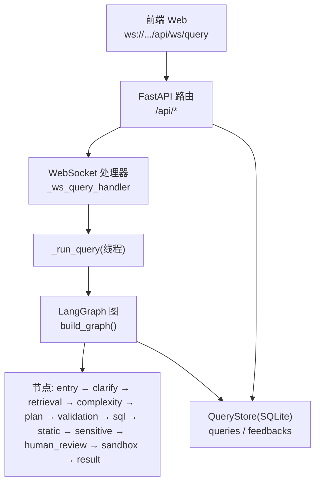
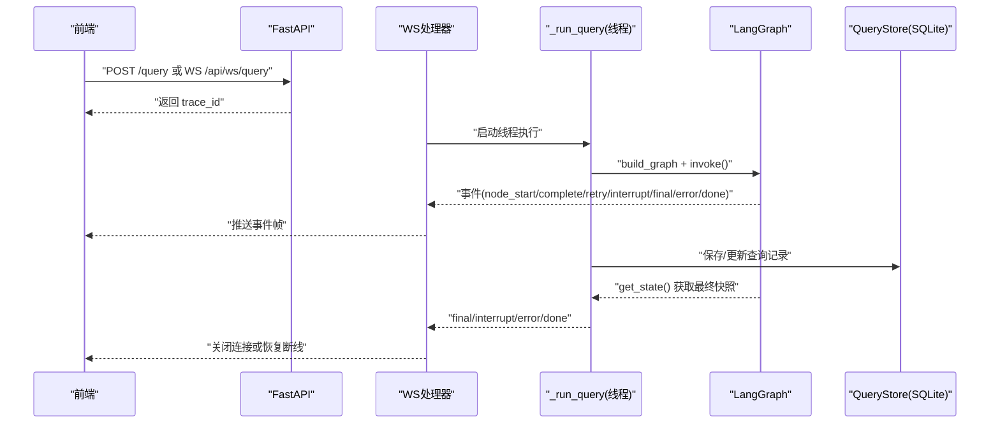
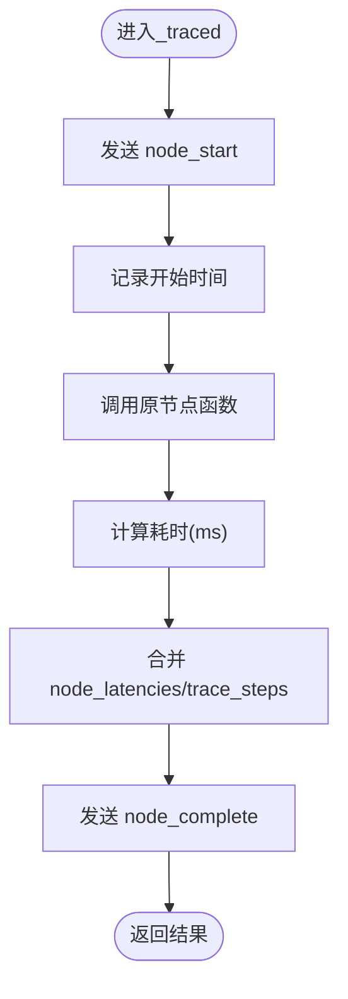
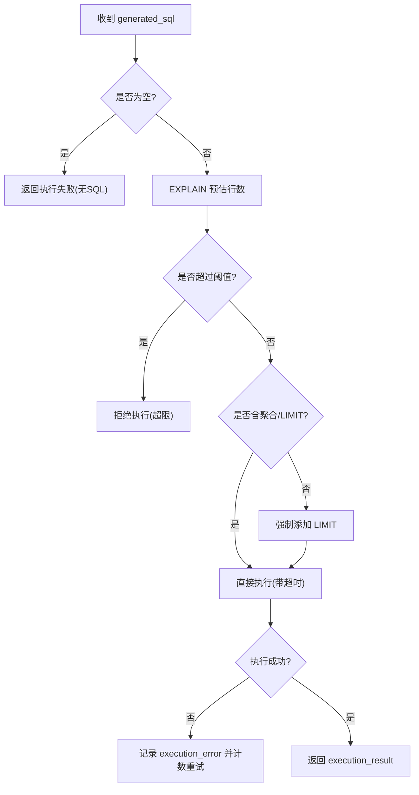
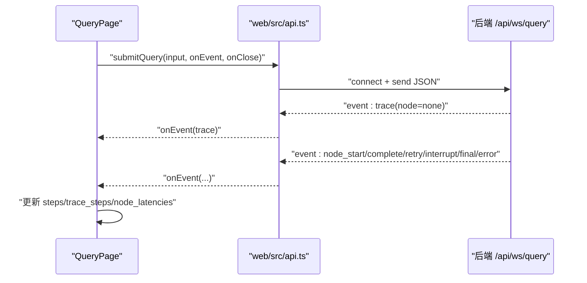
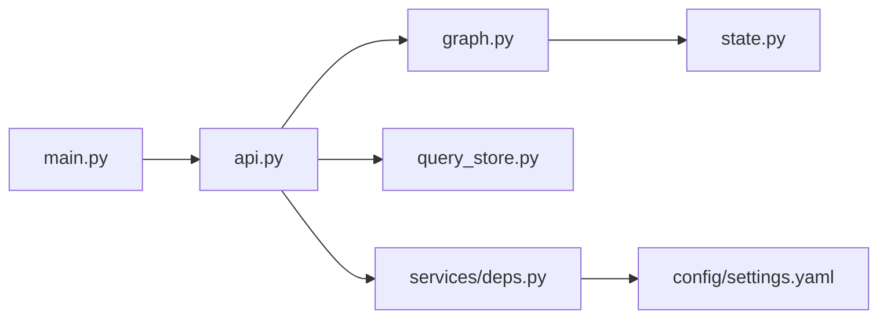

# 监控与日志

<cite>
**本文引用的文件**   
- [nl2sql_agent/main.py](file://nl2sql_agent/main.py)
- [nl2sql_agent/api.py](file://nl2sql_agent/api.py)
- [nl2sql_agent/graph.py](file://nl2sql_agent/graph.py)
- [nl2sql_agent/state.py](file://nl2sql_agent/state.py)
- [nl2sql_agent/services/deps.py](file://nl2sql_agent/services/deps.py)
- [nl2sql_agent/services/query_store.py](file://nl2sql_agent/services/query_store.py)
- [nl2sql_agent/nodes/m10_sandbox_execution.py](file://nl2sql_agent/nodes/m10_sandbox_execution.py)
- [nl2sql_agent/config/settings.yaml](file://nl2sql_agent/config/settings.yaml)
- [web/src/api.ts](file://web/src/api.ts)
- [web/src/pages/QueryPage.tsx](file://web/src/pages/QueryPage.tsx)
- [requirements.txt](file://requirements.txt)
</cite>

## 目录
1. [简介](#简介)
2. [项目结构](#项目结构)
3. [核心组件](#核心组件)
4. [架构总览](#架构总览)
5. [详细组件分析](#详细组件分析)
6. [依赖关系分析](#依赖关系分析)
7. [性能考虑](#性能考虑)
8. [故障排查指南](#故障排查指南)
9. [结论](#结论)
10. [附录](#附录)

## 简介
本文件面向生产环境的监控与日志体系，围绕 NL2SQL Agent 的查询执行链路，系统化说明：
- 关键指标采集：节点耗时、重试次数、执行错误、计划校验失败、敏感拦截等
- 性能监控：EXPLAIN 预估行数阈值、查询超时、只读事务与 LIMIT 强制
- 错误追踪：trace_id 贯穿全链路，事件流式推送与持久化审计
- 日志收集方案：结构化事件（node_start/node_complete/retry/interrupt/final/error）与 SQLite 持久化
- 告警规则建议：基于重试打满、执行失败、阻塞风险、低置信度澄清等阈值
- 可视化仪表板：前端实时步骤卡片、历史与审批队列、审计详情
- 调试工具：分布式追踪（trace_id）、慢查询分析（EXPLAIN + 超时）、内存泄漏检测（进程级监控）

## 项目结构
后端以 FastAPI 提供 REST 与 WebSocket 接口；LangGraph 编排 11 个处理节点；SQLite 存储查询历史与审计；前端通过 WebSocket 实时接收事件并渲染步骤卡片。



**图表来源** 
- [nl2sql_agent/api.py](file://nl2sql_agent/api.py)
- [nl2sql_agent/graph.py](file://nl2sql_agent/graph.py)
- [nl2sql_agent/services/query_store.py](file://nl2sql_agent/services/query_store.py)

**章节来源**
- [nl2sql_agent/main.py:1-152](file://nl2sql_agent/main.py#L1-L152)
- [nl2sql_agent/api.py:1-573](file://nl2sql_agent/api.py#L1-L573)
- [nl2sql_agent/graph.py:1-313](file://nl2sql_agent/graph.py#L1-L313)
- [nl2sql_agent/services/query_store.py:1-214](file://nl2sql_agent/services/query_store.py#L1-L214)

## 核心组件
- 事件与追踪
  - 节点级事件：node_start、node_complete、retry、interrupt、final、error、done
  - trace_id：每次查询唯一标识，贯穿 WS、图执行、持久化
  - 节点耗时：node_latencies 记录每个节点耗时（毫秒）
- 状态与模型
  - NL2SQLState：包含用户输入、检索结果、计划、校验、执行、最终答案、权限与追踪字段
- 持久化
  - QueryStore：SQLite 表 queries/feedbacks，支持历史查询、审批队列、审计与反馈
- 配置
  - settings.yaml：数据库连接、执行限制、超时、EXPLAIN 阈值、行级过滤开关

**章节来源**
- [nl2sql_agent/graph.py:72-107](file://nl2sql_agent/graph.py#L72-L107)
- [nl2sql_agent/state.py:83-146](file://nl2sql_agent/state.py#L83-L146)
- [nl2sql_agent/services/query_store.py:31-96](file://nl2sql_agent/services/query_store.py#L31-L96)
- [nl2sql_agent/config/settings.yaml:1-30](file://nl2sql_agent/config/settings.yaml#L1-L30)

## 架构总览
下图展示从前端发起查询到事件回推、状态落库的全链路流程，以及 LangGraph 节点编排与重试边界。



**图表来源** 
- [nl2sql_agent/api.py:161-221](file://nl2sql_agent/api.py#L161-L221)
- [nl2sql_agent/api.py:134-157](file://nl2sql_agent/api.py#L134-L157)
- [nl2sql_agent/graph.py:174-313](file://nl2sql_agent/graph.py#L174-L313)
- [nl2sql_agent/services/query_store.py:99-144](file://nl2sql_agent/services/query_store.py#L99-L144)

## 详细组件分析

### 事件与追踪（graph.py）
- _traced：包装节点函数，记录 node_start/node_complete 事件，累计 node_latencies 与 trace_steps
- _emit：安全推送事件，异常不影响主流程
- _retry_route：在 retry 分支时推送 retry 事件（attempt + reason），便于定位问题



**图表来源** 
- [nl2sql_agent/graph.py:88-103](file://nl2sql_agent/graph.py#L88-L103)
- [nl2sql_agent/graph.py:72-86](file://nl2sql_agent/graph.py#L72-L86)
- [nl2sql_agent/graph.py:106-126](file://nl2sql_agent/graph.py#L106-L126)

**章节来源**
- [nl2sql_agent/graph.py:72-126](file://nl2sql_agent/graph.py#L72-L126)

### 查询生命周期与持久化（api.py + query_store.py）
- _run_query：线程内执行图，按结果推送 final/interrupt/error 并落库
- _persist：将 state 转为可序列化字典，统一写入 SQLite
- WS 处理器：断线重连恢复（trace_id），根据 status 推送 restore/final/interrupt
- REST 接口：非流式提交、状态查询、审批与恢复

```mermaid
classDiagram
class QueryStore {
+save_query(trace_id, **fields)
+update_query(trace_id, **fields)
+get_query(trace_id) dict
+list_queries(...) list
+list_pending_approvals() list
+add_feedback(trace_id, node, type, comment)
+list_feedbacks(trace_id) list
}
class APIRouter {
+"/ws/query" ws_query()
+"/api/query" api_query()
+"/api/query/{trace_id}" api_query_status()
+"/api/query/{trace_id}/approve" api_approve()
+"/api/query/{trace_id}/resume" api_resume()
+"/api/history" api_history()
+"/api/approvals" api_approvals()
}
APIRouter --> QueryStore : "读写查询记录"
```

**图表来源** 
- [nl2sql_agent/services/query_store.py:31-96](file://nl2sql_agent/services/query_store.py#L31-L96)
- [nl2sql_agent/services/query_store.py:99-144](file://nl2sql_agent/services/query_store.py#L99-L144)
- [nl2sql_agent/api.py:161-221](file://nl2sql_agent/api.py#L161-L221)
- [nl2sql_agent/api.py:234-264](file://nl2sql_agent/api.py#L234-L264)
- [nl2sql_agent/api.py:280-314](file://nl2sql_agent/api.py#L280-L314)
- [nl2sql_agent/api.py:322-353](file://nl2sql_agent/api.py#L322-L353)

**章节来源**
- [nl2sql_agent/api.py:101-157](file://nl2sql_agent/api.py#L101-L157)
- [nl2sql_agent/api.py:161-221](file://nl2sql_agent/api.py#L161-L221)
- [nl2sql_agent/services/query_store.py:99-144](file://nl2sql_agent/services/query_store.py#L99-L144)

### 沙箱执行与性能保护（m10_sandbox_execution.py）
- EXPLAIN 预估行数超过阈值直接拒绝
- 未聚合查询强制 LIMIT
- 设置查询超时，超时视为 execution_error
- 执行报错带具体文本退回 SQL 生成重试；空结果为合法业务结果



**图表来源** 
- [nl2sql_agent/nodes/m10_sandbox_execution.py:31-65](file://nl2sql_agent/nodes/m10_sandbox_execution.py#L31-L65)

**章节来源**
- [nl2sql_agent/nodes/m10_sandbox_execution.py:1-65](file://nl2sql_agent/nodes/m10_sandbox_execution.py#L1-L65)

### 前端事件与可视化（web/src/api.ts + QueryPage.tsx）
- submitQuery：建立 WebSocket，发送 user_query/user_id/data_scope/trace_id，onEvent 接收 PipelineEvent
- QueryPage：维护 sessions，处理 final/error/interrupt 等事件，渲染步骤卡片与延迟信息



**图表来源** 
- [web/src/api.ts:31-49](file://web/src/api.ts#L31-L49)
- [web/src/pages/QueryPage.tsx:316-367](file://web/src/pages/QueryPage.tsx#L316-L367)

**章节来源**
- [web/src/api.ts:1-49](file://web/src/api.ts#L1-L49)
- [web/src/pages/QueryPage.tsx:316-367](file://web/src/pages/QueryPage.tsx#L316-L367)

## 依赖关系分析
- FastAPI 应用入口加载 .env，构建图与检查点
- 依赖装配：settings.yaml 决定 dialect、执行限制、EXPLAIN 阈值、行级过滤
- 向量存储：memory/pgvector 由 vector_store.yaml 选择
- 数据库执行器：mysql/postgres 由 database_url scheme 自动选择



**图表来源** 
- [nl2sql_agent/main.py:1-152](file://nl2sql_agent/main.py#L1-L152)
- [nl2sql_agent/services/deps.py:113-184](file://nl2sql_agent/services/deps.py#L113-L184)
- [nl2sql_agent/config/settings.yaml:1-30](file://nl2sql_agent/config/settings.yaml#L1-L30)

**章节来源**
- [nl2sql_agent/services/deps.py:1-184](file://nl2sql_agent/services/deps.py#L1-L184)
- [nl2sql_agent/config/settings.yaml:1-30](file://nl2sql_agent/config/settings.yaml#L1-L30)

## 性能考虑
- 节点耗时统计：node_latencies 用于识别瓶颈节点（如 plan_generation/sql_generation/sandbox_execution）
- EXPLAIN 阈值：避免大扫描执行，保护数据库稳定性
- 查询超时：execution_timeout_seconds 控制长尾请求
- 只读事务与 LIMIT：降低写风险与数据量过大风险
- 重试上限：max_retries/max_plan_retries 防止死循环

**章节来源**
- [nl2sql_agent/config/settings.yaml:18-23](file://nl2sql_agent/config/settings.yaml#L18-L23)
- [nl2sql_agent/nodes/m10_sandbox_execution.py:37-62](file://nl2sql_agent/nodes/m10_sandbox_execution.py#L37-L62)
- [nl2sql_agent/graph.py:146-170](file://nl2sql_agent/graph.py#L146-L170)

## 故障排查指南
- 快速定位
  - 使用 trace_id 串联前端事件、后端日志与 SQLite 记录
  - 查看 trace_steps 顺序与 node_latencies 分布，定位慢节点
- 常见问题
  - 执行失败：检查 execution_error 与 retry_count，确认 EXPLAIN 阈值与 LIMIT 策略
  - 计划校验失败：关注 plan_validation_errors 与 plan_retry_count
  - 敏感拦截：risk_decision 为 approval_required/hard_block 时，走人工确认或阻断
  - 低置信度澄清：retrieval_confidence 与 clarification_reason 辅助判断
- 恢复机制
  - WS 断线重连：根据 status 恢复 pending_review/done/blocked/rejected
  - 审批/恢复：/approve 与 /resume 接口恢复中断流程

**章节来源**
- [nl2sql_agent/api.py:161-221](file://nl2sql_agent/api.py#L161-L221)
- [nl2sql_agent/api.py:280-353](file://nl2sql_agent/api.py#L280-L353)
- [nl2sql_agent/services/query_store.py:146-193](file://nl2sql_agent/services/query_store.py#L146-L193)

## 结论
本系统通过 LangGraph 节点编排、结构化事件与 SQLite 持久化，构建了完整的 NL2SQL 查询监控与日志体系。结合 EXPLAIN 阈值、超时与只读限制，保障生产环境稳定性；前端实时事件驱动与历史审计能力，满足运维与排障需求。建议在监控平台中接入以下指标与告警：
- 指标采集：node_latencies、retry_count、plan_retry_count、execution_error、blocked_reason、risk_decision、retrieval_confidence
- 告警规则：执行失败率、重试打满、EXPLAIN 超限、低置信度澄清比例、人工确认积压
- 可视化：步骤卡片、历史列表、审批队列、审计详情、延迟热力图

## 附录
- 依赖清单：langgraph、fastapi、uvicorn、pydantic、sqlite 等
- 环境变量：ANTHROPIC_API_KEY、ANTHROPIC_MODEL、DATABASE_URL 等

**章节来源**
- [requirements.txt:1-15](file://requirements.txt#L1-L15)
- [nl2sql_agent/main.py:1-152](file://nl2sql_agent/main.py#L1-L152)