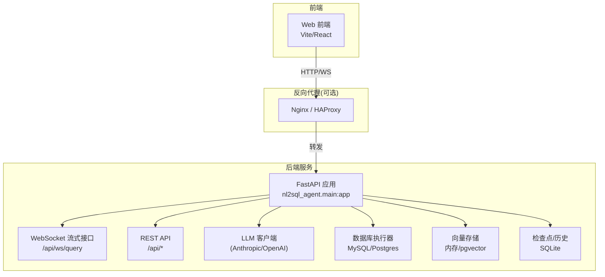
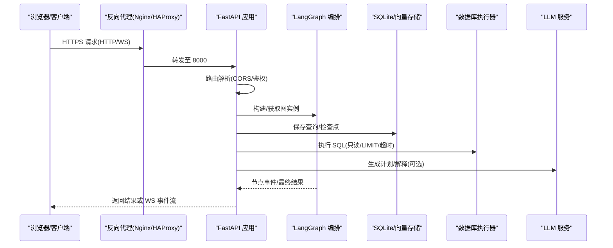
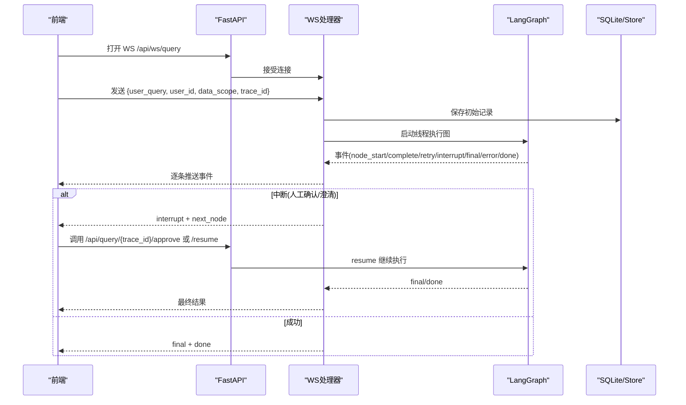
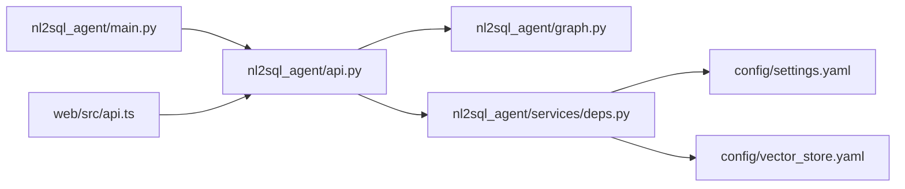

# 负载均衡与高可用

<cite>
**本文引用的文件**   
- [nl2sql_agent/main.py](file://nl2sql_agent/main.py)
- [nl2sql_agent/api.py](file://nl2sql_agent/api.py)
- [nl2sql_agent/graph.py](file://nl2sql_agent/graph.py)
- [nl2sql_agent/services/deps.py](file://nl2sql_agent/services/deps.py)
- [nl2sql_agent/config/settings.yaml](file://nl2sql_agent/config/settings.yaml)
- [nl2sql_agent/config/vector_store.yaml](file://nl2sql_agent/config/vector_store.yaml)
- [pyproject.toml](file://pyproject.toml)
- [requirements.txt](file://requirements.txt)
- [web/src/api.ts](file://web/src/api.ts)
- [scripts/dev.ps1](file://scripts/dev.ps1)
</cite>

## 目录
1. [简介](#简介)
2. [项目结构](#项目结构)
3. [核心组件](#核心组件)
4. [架构总览](#架构总览)
5. [详细组件分析](#详细组件分析)
6. [依赖关系分析](#依赖关系分析)
7. [性能考量](#性能考量)
8. [故障排查指南](#故障排查指南)
9. [结论](#结论)
10. [附录](#附录)

## 简介
本文件面向企业级部署，围绕 NL2SQL Agent 的负载均衡与高可用（HA）实践进行系统化说明。内容覆盖反向代理配置（Nginx/HAProxy）、SSL 终止、请求路由与健康检查；应用健康端点设计、故障检测与自动恢复；无状态服务与水平扩展策略、会话管理与数据一致性；主备切换、数据同步与灾难恢复；以及扩缩容规则、资源监控与性能调优。文档同时结合代码实现给出落地建议，确保可操作、可验证。

## 项目结构
NL2SQL Agent 采用 FastAPI + Uvicorn 提供 HTTP/WS 接口，LangGraph 编排查询流程，SQLite 做轻量持久化与检查点，向量存储支持内存或 pgvector。前端通过 WebSocket 流式接收节点事件，REST 用于非流式提交与状态查询。

**图表来源** 
- [nl2sql_agent/main.py:1-152](file://nl2sql_agent/main.py#L1-L152)
- [nl2sql_agent/api.py:1-573](file://nl2sql_agent/api.py#L1-L573)
- [nl2sql_agent/graph.py:1-313](file://nl2sql_agent/graph.py#L1-L313)
- [nl2sql_agent/services/deps.py:1-184](file://nl2sql_agent/services/deps.py#L1-L184)
- [web/src/api.ts:1-49](file://web/src/api.ts#L1-L49)

**章节来源**
- [nl2sql_agent/main.py:1-152](file://nl2sql_agent/main.py#L1-L152)
- [nl2sql_agent/api.py:1-573](file://nl2sql_agent/api.py#L1-L573)
- [pyproject.toml:1-44](file://pyproject.toml#L1-L44)
- [requirements.txt:1-15](file://requirements.txt#L1-L15)

## 核心组件
- 应用入口与中间件：FastAPI 应用初始化、CORS 配置、路由挂载、进程内图构建与缓存。
- API 层：REST 接口（/api/query、/api/query/{trace_id}、/api/query/{trace_id}/approve 等）与 WebSocket 流式推送（/api/ws/query）。
- 流程编排：LangGraph 图定义、节点追踪、重试与中断（人工确认/澄清）控制流。
- 依赖装配：配置加载、数据库执行器选择、向量存储后端选择、LLM 客户端构建。
- 配置管理：settings.yaml、vector_store.yaml、术语映射与规则热更新。

**章节来源**
- [nl2sql_agent/main.py:1-152](file://nl2sql_agent/main.py#L1-L152)
- [nl2sql_agent/api.py:1-573](file://nl2sql_agent/api.py#L1-L573)
- [nl2sql_agent/graph.py:1-313](file://nl2sql_agent/graph.py#L1-L313)
- [nl2sql_agent/services/deps.py:1-184](file://nl2sql_agent/services/deps.py#L1-L184)
- [nl2sql_agent/config/settings.yaml:1-30](file://nl2sql_agent/config/settings.yaml#L1-L30)
- [nl2sql_agent/config/vector_store.yaml:1-5](file://nl2sql_agent/config/vector_store.yaml#L1-L5)

## 架构总览
下图展示从前端到后端、再到外部依赖的整体交互路径，并标注关键端口与协议。

**图表来源** 
- [nl2sql_agent/main.py:1-152](file://nl2sql_agent/main.py#L1-L152)
- [nl2sql_agent/api.py:1-573](file://nl2sql_agent/api.py#L1-L573)
- [nl2sql_agent/graph.py:1-313](file://nl2sql_agent/graph.py#L1-L313)
- [nl2sql_agent/services/deps.py:1-184](file://nl2sql_agent/services/deps.py#L1-L184)

## 详细组件分析

### 反向代理与 SSL 终止（Nginx/HAProxy）
- 目标
  - 统一入口、HTTPS 终止、静态资源缓存、请求限流与熔断、健康检查与优雅重启。
- Nginx 要点
  - 监听 443，启用 TLS 证书与强密码套件；将 /api 与 /ws 转发至后端 8000。
  - 为 /api/ws/query 设置长连接超时与缓冲参数，避免大响应被截断。
  - 对 /api 开启访问日志与错误日志，便于审计与排障。
  - 使用 upstream 池承载多实例，配合 health_check 与 fail_timeout。
- HAProxy 要点
  - 在 frontend 绑定 443，启用 ssl crt；backend 中配置 multiple servers with check。
  - 针对 WS 路径设置 http-request set-header Upgrade 与 Connection 头透传。
  - 使用 stats 页面与 ACL 限制管理访问。
- 健康检查
  - 对外暴露 /healthz 或复用现有接口（如 /api/history），由代理定期探测存活。
  - 失败阈值与重试次数按业务容忍度设定，避免雪崩。

[本节为通用最佳实践说明，不直接分析具体代码文件]

### 健康检查机制与应用端点
- 健康端点设计
  - 进程级：快速返回存活（CPU/内存正常）。
  - 就绪级：依赖检查（数据库连接、向量存储、LLM 可达性）。
  - 业务级：简单读写校验（如 /api/history 列表为空但可访问）。
- 故障检测与恢复
  - 代理侧：连续失败标记下线，恢复后自动上线。
  - 应用侧：异常捕获与降级（例如 LLM 不可用时回退策略）。
  - 检查点与历史：SQLite 持久化 trace_id 与状态，支持断线重连与恢复。

**章节来源**
- [nl2sql_agent/api.py:356-370](file://nl2sql_agent/api.py#L356-L370)
- [nl2sql_agent/api.py:266-272](file://nl2sql_agent/api.py#L266-L272)
- [nl2sql_agent/api.py:161-211](file://nl2sql_agent/api.py#L161-L211)

### 请求路由策略与 WebSocket 流式
- REST 路由
  - POST /api/query：非流式提交，线程内执行并返回结果或“待审批”状态。
  - GET /api/query/{trace_id}：查询状态，供轮询与恢复。
  - POST /api/query/{trace_id}/approve：人工审批恢复。
- WebSocket 路由
  - /api/ws/query：建立连接后发送 user_query，服务端以事件流推送 node_start/complete/retry/interrupt/final/error/done。
  - 断线重连：携带 trace_id 可恢复到当前阶段（已完成/待审批/执行中）。

**图表来源** 
- [nl2sql_agent/api.py:161-211](file://nl2sql_agent/api.py#L161-L211)
- [nl2sql_agent/api.py:234-264](file://nl2sql_agent/api.py#L234-L264)
- [nl2sql_agent/api.py:280-314](file://nl2sql_agent/api.py#L280-L314)
- [nl2sql_agent/api.py:322-353](file://nl2sql_agent/api.py#L322-L353)

**章节来源**
- [nl2sql_agent/api.py:161-211](file://nl2sql_agent/api.py#L161-L211)
- [nl2sql_agent/api.py:234-264](file://nl2sql_agent/api.py#L234-L264)
- [nl2sql_agent/api.py:280-314](file://nl2sql_agent/api.py#L280-L314)
- [nl2sql_agent/api.py:322-353](file://nl2sql_agent/api.py#L322-L353)

### 水平扩展与无状态设计
- 无状态服务
  - 应用本身无进程间共享状态，所有状态落库（SQLite）或外部依赖（数据库、向量存储、LLM）。
  - 多实例部署时，每个实例独立运行 uvicorn，通过反向代理均衡流量。
- 会话管理
  - 使用 trace_id 标识一次查询生命周期，WS 与 REST 均基于 trace_id 关联。
  - 前端维护 session 列表与 activeTrace，断线重连通过 trace_id 恢复。
- 数据一致性保证
  - LangGraph checkpoint 持久化（SQLite）保障中断恢复。
  - QueryStore 持久化查询历史与状态，支持审计与回溯。
  - 向量存储可选择内存（开发）或 pgvector（生产），需考虑跨实例一致性（pgvector 集中式）。

**章节来源**
- [nl2sql_agent/api.py:36-42](file://nl2sql_agent/api.py#L36-L42)
- [nl2sql_agent/api.py:161-211](file://nl2sql_agent/api.py#L161-L211)
- [nl2sql_agent/graph.py:296-312](file://nl2sql_agent/graph.py#L296-L312)
- [web/src/api.ts:30-49](file://web/src/api.ts#L30-L49)

### 故障转移与主备切换
- 代理层故障转移
  - Nginx/HAProxy 配置多个后端实例，任一失败自动剔除，恢复后自动加入。
  - 合理设置 fail_timeout、max_fails、keepalive，避免频繁抖动。
- 应用层故障转移
  - LLM 不可用：回退策略（如禁用复杂计划、仅走简单路径）。
  - 数据库不可用：拒绝新请求或返回明确错误码，前端提示重试。
  - 向量存储不可用：回退内存模式（功能受限）。
- 数据同步与灾难恢复
  - SQLite 文件备份策略（定时快照、异地副本）。
  - 数据库主从复制与只读副本，执行器指向只读副本。
  - 向量索引重建流程（审核/补充注释后触发 reingest）。

**章节来源**
- [nl2sql_agent/api.py:544-573](file://nl2sql_agent/api.py#L544-L573)
- [nl2sql_agent/services/deps.py:73-84](file://nl2sql_agent/services/deps.py#L73-L84)
- [nl2sql_agent/config/vector_store.yaml:1-5](file://nl2sql_agent/config/vector_store.yaml#L1-L5)

### 扩缩容策略与性能调优
- 自动扩缩容规则
  - 指标：QPS、P95/P99 延迟、CPU/内存使用率、队列长度（WS 连接数）。
  - 阈值：当 QPS > 阈值且 CPU > 80% 持续 5 分钟，扩容；反之缩容。
- 资源监控
  - 应用指标：节点延迟（node_latencies）、重试次数、执行错误率。
  - 基础设施：数据库连接池、向量存储负载、LLM 调用速率限制。
- 性能调优
  - 反向代理：调整 worker、keepalive、缓冲区大小。
  - 应用：uvicorn workers 数量、GIL 影响下的并发模型（WS 异步 + 线程执行）。
  - 数据库：只读事务、LIMIT、超时、EXPLAIN 阈值。
  - 向量存储：pgvector 索引优化、批量写入。

**章节来源**
- [nl2sql_agent/api.py:60-100](file://nl2sql_agent/api.py#L60-L100)
- [nl2sql_agent/graph.py:88-104](file://nl2sql_agent/graph.py#L88-L104)
- [nl2sql_agent/config/settings.yaml:18-23](file://nl2sql_agent/config/settings.yaml#L18-L23)

## 依赖关系分析
- 应用入口依赖 FastAPI、Uvicorn、CORS、LangGraph、Pydantic。
- API 层依赖 QueryStore、Checkpointer、Deps、Graph。
- 依赖装配根据 settings.yaml 与 .env 动态选择数据库执行器与向量存储后端。
- 前端通过 api.ts 封装 fetch 与 WebSocket 调用。

**图表来源** 
- [nl2sql_agent/main.py:1-152](file://nl2sql_agent/main.py#L1-L152)
- [nl2sql_agent/api.py:1-573](file://nl2sql_agent/api.py#L1-L573)
- [nl2sql_agent/graph.py:1-313](file://nl2sql_agent/graph.py#L1-L313)
- [nl2sql_agent/services/deps.py:1-184](file://nl2sql_agent/services/deps.py#L1-L184)
- [nl2sql_agent/config/settings.yaml:1-30](file://nl2sql_agent/config/settings.yaml#L1-L30)
- [nl2sql_agent/config/vector_store.yaml:1-5](file://nl2sql_agent/config/vector_store.yaml#L1-L5)
- [web/src/api.ts:1-49](file://web/src/api.ts#L1-L49)

**章节来源**
- [pyproject.toml:1-44](file://pyproject.toml#L1-L44)
- [requirements.txt:1-15](file://requirements.txt#L1-L15)

## 性能考量
- 并发模型：Uvicorn 多线程/多进程 + 异步 WS；图执行在独立线程，避免阻塞事件循环。
- 资源隔离：WS 连接数上限、请求体大小限制、超时熔断。
- 缓存策略：配置热更新（mtime 比对）、向量检索 Top-K、语义缓存预留。
- 数据库保护：只读事务、LIMIT、EXPLAIN 阈值、超时。
- 监控与观测：节点延迟、重试计数、错误率、trace 链路。

[本节为通用性能指导，不直接分析具体代码文件]

## 故障排查指南
- 常见问题
  - WS 连接断开：检查代理超时设置、网络稳定性、前端重连逻辑。
  - 审批卡住：确认 trace_id 存在、状态为 pending_review、调用 approve/resume。
  - 执行失败：查看 execution_error、blocked_reason、retry_count。
  - 向量存储不可用：检查 vector_store.yaml 配置与 PGVECTOR_URL。
- 定位步骤
  - 查看 /api/query/{trace_id} 状态与 trace_steps。
  - 检查 SQLite 文件是否损坏（langgraph_checkpoints.db、nl2sql.db）。
  - 验证数据库连接与权限（只读账号、行级过滤注入）。
  - 观察代理日志与应用日志，定位瓶颈与错误。

**章节来源**
- [nl2sql_agent/api.py:266-272](file://nl2sql_agent/api.py#L266-L272)
- [nl2sql_agent/api.py:280-314](file://nl2sql_agent/api.py#L280-L314)
- [nl2sql_agent/api.py:322-353](file://nl2sql_agent/api.py#L322-L353)
- [nl2sql_agent/services/deps.py:165-170](file://nl2sql_agent/services/deps.py#L165-L170)

## 结论
NL2SQL Agent 具备清晰的无状态设计与完善的检查点机制，适合通过反向代理进行负载均衡与高可用部署。结合健康检查、故障转移、扩缩容与性能调优，可在企业环境中稳定运行。建议在生产环境启用 pgvector、数据库只读副本、代理层熔断与监控告警，确保端到端的高可用与可观测性。

[本节为总结性内容，不直接分析具体代码文件]

## 附录
- 本地开发脚本：scripts/dev.ps1 提供前后端启停与状态查看。
- 依赖清单：pyproject.toml 与 requirements.txt 列出核心依赖版本。

**章节来源**
- [scripts/dev.ps1:73-133](file://scripts/dev.ps1#L73-L133)
- [pyproject.toml:1-44](file://pyproject.toml#L1-L44)
- [requirements.txt:1-15](file://requirements.txt#L1-L15)