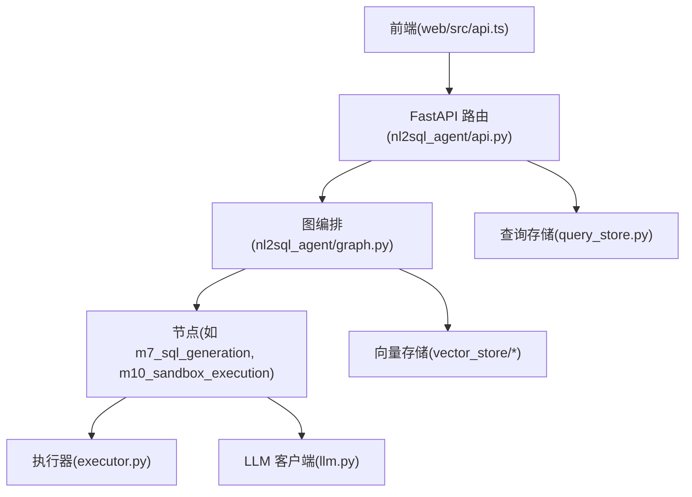
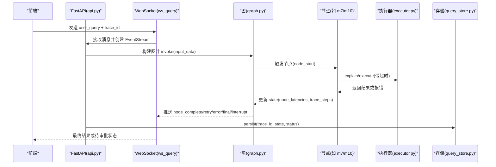
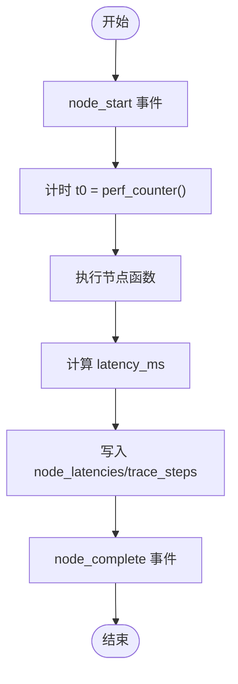
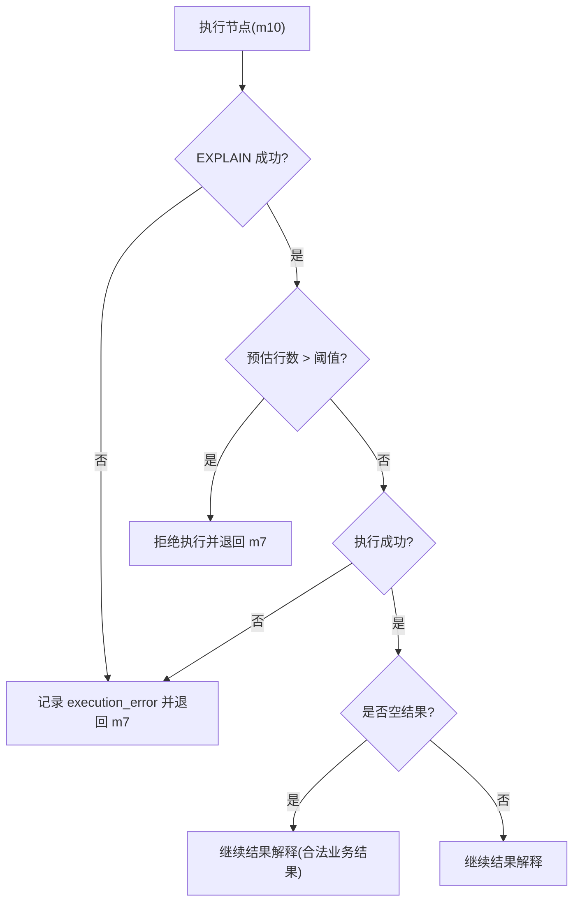
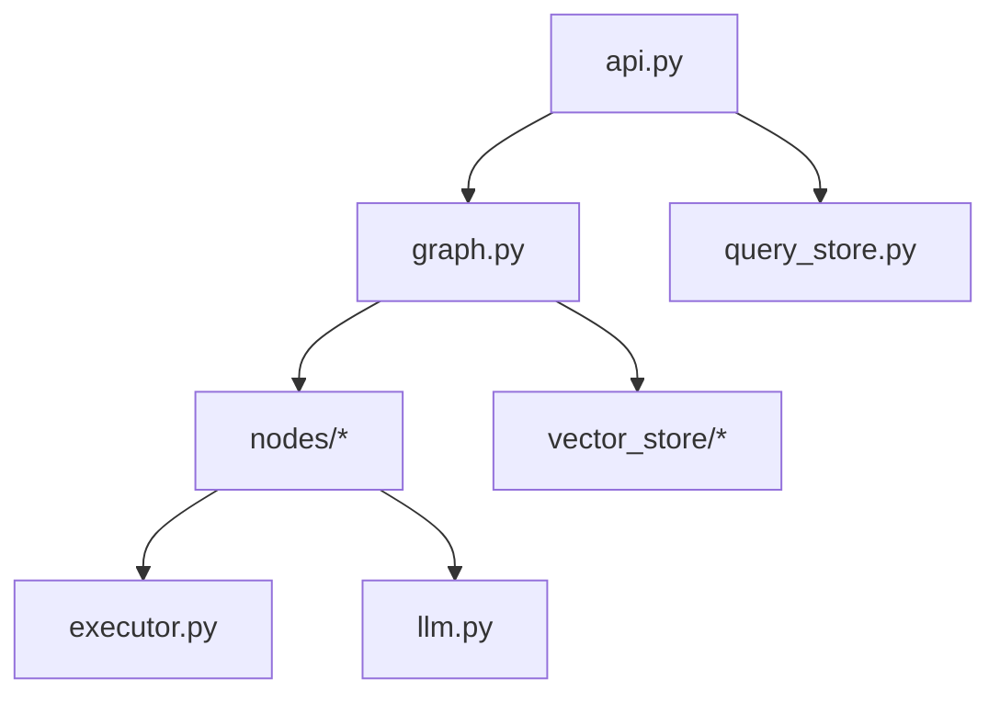

# 监控告警

<cite>
**本文引用的文件**
- [nl2sql_agent/main.py](file://nl2sql_agent/main.py)
- [nl2sql_agent/api.py](file://nl2sql_agent/api.py)
- [nl2sql_agent/graph.py](file://nl2sql_agent/graph.py)
- [nl2sql_agent/state.py](file://nl2sql_agent/state.py)
- [nl2sql_agent/services/executor.py](file://nl2sql_agent/services/executor.py)
- [nl2sql_agent/services/query_store.py](file://nl2sql_agent/services/query_store.py)
- [nl2sql_agent/services/llm.py](file://nl2sql_agent/services/llm.py)
- [nl2sql_agent/nodes/m10_sandbox_execution.py](file://nl2sql_agent/nodes/m10_sandbox_execution.py)
- [nl2sql_agent/nodes/m7_sql_generation.py](file://nl2sql_agent/nodes/m7_sql_generation.py)
- [web/src/api.ts](file://web/src/api.ts)
</cite>

## 目录
1. [简介](#简介)
2. [项目结构](#项目结构)
3. [核心组件](#核心组件)
4. [架构总览](#架构总览)
5. [详细组件分析](#详细组件分析)
6. [依赖关系分析](#依赖关系分析)
7. [性能考虑](#性能考虑)
8. [故障排查指南](#故障排查指南)
9. [结论](#结论)
10. [附录](#附录)

## 简介
本文件为 NL2SQL 监控告警系统的完整文档，面向运维与性能优化人员。内容覆盖：
- 性能监控方案：应用指标采集、数据库性能监控、向量检索性能追踪、LLM 调用监控
- 错误追踪机制：异常捕获、堆栈跟踪、错误分类、告警规则配置
- 日志收集与分析：结构化日志格式、日志级别管理、日志聚合与查询分析
- 告警策略设计：阈值设置、告警分级、通知渠道、告警抑制
- 监控仪表板配置：关键指标展示、趋势分析与容量规划
- 监控数据持久化、历史查询统计与性能报告生成

本系统通过 LangGraph 编排的 11 个节点流水线，结合 WebSocket 流式事件、SQLite 持久化与可插拔执行器/LLM 客户端，形成端到端的可观测性基础。

## 项目结构
- HTTP 服务入口与路由：FastAPI 提供 REST 与 WebSocket 接口，承载查询提交、状态查询、审批与历史审计等能力
- 图编排与追踪：LangGraph 构建 11 个节点，统一注入节点延迟与步骤追踪，并通过 event_sink 推送事件
- 执行层：Postgres/MySQL/内存执行器，支持 EXPLAIN 预估行数、只读事务、超时控制
- LLM 层：Anthropic/DeepSeek 多 Provider，结构化输出与 SQL 生成
- 存储层：SQLite 持久化查询历史、审批、反馈；向量存储（内存/pgvector）用于 Schema 语义检索
- 前端：WebSocket 实时接收 pipeline 事件，展示链路进度与结果

**图表来源**
- [nl2sql_agent/api.py:1-573](file://nl2sql_agent/api.py#L1-L573)
- [nl2sql_agent/graph.py:1-313](file://nl2sql_agent/graph.py#L1-L313)
- [nl2sql_agent/services/executor.py:1-205](file://nl2sql_agent/services/executor.py#L1-L205)
- [nl2sql_agent/services/llm.py:1-328](file://nl2sql_agent/services/llm.py#L1-L328)
- [nl2sql_agent/services/query_store.py:1-214](file://nl2sql_agent/services/query_store.py#L1-L214)
- [web/src/api.ts:1-49](file://web/src/api.ts#L1-L49)

**章节来源**
- [nl2sql_agent/main.py:1-152](file://nl2sql_agent/main.py#L1-L152)
- [nl2sql_agent/api.py:1-573](file://nl2sql_agent/api.py#L1-L573)

## 核心组件
- 事件桥接与流式推送：EventStream 将同步线程事件安全投递到 asyncio 队列，供 WebSocket 推送
- 节点追踪与延迟记录：_traced 包装每个节点，记录 node_start/node_complete 与 node_latencies、trace_steps
- 重试与回退路由：_retry_route 在计划校验失败、静态校验失败、执行失败时按上限回退并推送 retry 事件
- 持久化与审计：QueryStore 维护 queries/feedbacks 表，记录状态、SQL、计划、节点延迟、审批与反馈
- 执行器与 EXPLAIN：Postgres/MySQL 执行器支持只读事务、超时与 EXPLAIN 预估行数，InMemoryExecutor 用于测试
- LLM 客户端：BaseLLMClient 抽象 complete/complete_json/complete_structured/complete_sql，支持 Anthropic/DeepSeek

**章节来源**
- [nl2sql_agent/api.py:52-157](file://nl2sql_agent/api.py#L52-L157)
- [nl2sql_agent/graph.py:72-126](file://nl2sql_agent/graph.py#L72-L126)
- [nl2sql_agent/services/query_store.py:31-214](file://nl2sql_agent/services/query_store.py#L31-L214)
- [nl2sql_agent/services/executor.py:23-205](file://nl2sql_agent/services/executor.py#L23-L205)
- [nl2sql_agent/services/llm.py:70-160](file://nl2sql_agent/services/llm.py#L70-L160)

## 架构总览
下图展示了从前端发起查询到后端执行、事件推送与持久化的整体流程，以及关键监控点（节点延迟、重试、错误）。

**图表来源**
- [nl2sql_agent/api.py:161-222](file://nl2sql_agent/api.py#L161-L222)
- [nl2sql_agent/graph.py:174-313](file://nl2sql_agent/graph.py#L174-L313)
- [nl2sql_agent/services/executor.py:53-159](file://nl2sql_agent/services/executor.py#L53-L159)
- [nl2sql_agent/services/query_store.py:101-131](file://nl2sql_agent/services/query_store.py#L101-L131)

## 详细组件分析

### 性能监控方案
- 应用指标采集
  - 节点级延迟：_traced 在每个节点前后计时，写入 state.node_latencies，并通过 node_start/node_complete 事件推送
  - 链路顺序：state.trace_steps 记录节点执行顺序，便于时序分析
  - 重试计数：state.retry_count / plan_retry_count 反映稳定性
- 数据库性能监控
  - EXPLAIN 预估行数：Postgres/MySQL 执行器的 explain() 解析 JSON 计划，取最大 rows 作为 estimated_rows
  - 执行超时：statement_timeout(MAX_EXECUTION_TIME) 限制长查询
  - 只读事务：确保不写库，降低风险
- 向量检索性能追踪
  - 检索置信度：retrieval_confidence 与 retrieval_candidates 记录候选与分数，辅助低置信澄清
  - 后端实现：内存与 pgvector 均支持 search_scored，可基于 score 做阈值判断
- LLM 调用监控
  - 结构化输出：complete_json/complete_structured/complete_sql 封装重试与解析逻辑
  - Provider 选择：build_llm/build_sql_llm 根据环境变量动态选择模型
  - 节点级模型：get_model_for_node 可按节点配置不同模型

**图表来源**
- [nl2sql_agent/graph.py:88-103](file://nl2sql_agent/graph.py#L88-L103)

**章节来源**
- [nl2sql_agent/graph.py:72-126](file://nl2sql_agent/graph.py#L72-L126)
- [nl2sql_agent/services/executor.py:31-70](file://nl2sql_agent/services/executor.py#L31-L70)
- [nl2sql_agent/services/llm.py:82-149](file://nl2sql_agent/services/llm.py#L82-L149)
- [nl2sql_agent/services/vector_store/base.py:11-20](file://nl2sql_agent/services/vector_store/base.py#L11-L20)
- [nl2sql_agent/services/vector_store/pg.py:139-173](file://nl2sql_agent/services/vector_store/pg.py#L139-L173)

### 错误追踪机制
- 异常捕获
  - 执行器 execute/explain 异常被捕获并转为 execution_error
  - 图事件推送失败不影响流程执行（_emit 内 try/except）
- 堆栈跟踪
  - 审批恢复路径中打印 traceback.print_exc()，便于定位问题
- 错误分类
  - 执行失败：execution_error 文本，驱动回退到 SQL 生成节点重试
  - 计划校验失败：plan_validation_errors，驱动回退到计划生成节点重试
  - 静态校验失败：validation_errors，驱动回退到 SQL 生成节点重试
  - 危险操作：blocked_reason 直接结束，不进入重试
- 告警规则配置
  - 阈值：explain_row_threshold、execution_timeout_seconds、max_retries、max_plan_retries
  - 分级：pass/approval_required/hard_block 三类风险决策
  - 人工确认：human_review 节点暂停，等待审批

**图表来源**
- [nl2sql_agent/nodes/m10_sandbox_execution.py:20-65](file://nl2sql_agent/nodes/m10_sandbox_execution.py#L20-L65)

**章节来源**
- [nl2sql_agent/api.py:307-353](file://nl2sql_agent/api.py#L307-L353)
- [nl2sql_agent/graph.py:106-170](file://nl2sql_agent/graph.py#L106-L170)
- [nl2sql_agent/nodes/m10_sandbox_execution.py:1-65](file://nl2sql_agent/nodes/m10_sandbox_execution.py#L1-L65)
- [nl2sql_agent/nodes/m7_sql_generation.py:17-28](file://nl2sql_agent/nodes/m7_sql_generation.py#L17-L28)

### 日志收集与分析
- 结构化日志格式
  - 事件类型：node_start/node_complete/retry/interrupt/final/error/done/trace/ping/restore
  - 字段：event、node、trace_id、data（包含 execution_result 截断、result_total、node_latencies、trace_steps）
- 日志级别管理
  - 当前以事件为主，未显式分级；可通过 event 类型区分调试/信息/错误
- 日志聚合与查询分析
  - QueryStore.list_queries 支持按 user_id、business_line、时间范围分页查询
  - feedbacks 表记录用户反馈，便于闭环分析
- 建议
  - 引入结构化日志框架（如 Python logging），统一 level、trace_id、span_id
  - 将事件落盘至集中式日志系统（ELK/Loki），建立索引与告警规则

**章节来源**
- [nl2sql_agent/api.py:68-131](file://nl2sql_agent/api.py#L68-L131)
- [nl2sql_agent/services/query_store.py:146-193](file://nl2sql_agent/services/query_store.py#L146-L193)

### 告警策略设计
- 阈值设置
  - explain_row_threshold：超过则拒绝执行
  - execution_timeout_seconds：超时视为执行失败
  - max_retries/max_plan_retries：控制重试上限，避免死循环
- 告警分级
  - pass：无风险
  - approval_required：需人工确认
  - hard_block：危险操作直接阻断
- 通知渠道
  - 当前通过 WebSocket 推送中断事件；可扩展邮件/钉钉/企业微信
- 告警抑制
  - 同一 trace_id 的事件去重；pending_review 状态下避免重复告警

**章节来源**
- [nl2sql_agent/nodes/m10_sandbox_execution.py:42-47](file://nl2sql_agent/nodes/m10_sandbox_execution.py#L42-L47)
- [nl2sql_agent/graph.py:146-170](file://nl2sql_agent/graph.py#L146-L170)
- [nl2sql_agent/api.py:165-180](file://nl2sql_agent/api.py#L165-L180)

### 监控仪表板配置
- 关键指标展示
  - 节点延迟分布（boxplot/histogram）
  - 重试率（retry_count/plan_retry_count）
  - 执行成功率（done/blocked/error 比例）
  - 检索置信度分布（retrieval_confidence）
  - LLM 调用次数与失败率（complete_json/complete_sql 重试）
- 趋势分析
  - 按小时/天聚合 node_latencies、retry_count、error_rate
  - 对比不同业务线（data_scope）的性能差异
- 容量规划
  - 基于 EXPLAIN 预估行数与执行耗时，评估数据库负载
  - 向量检索 QPS 与索引大小增长趋势

[本节为概念性内容，不直接分析具体文件]

### 监控数据持久化、历史查询统计与性能报告生成
- 持久化
  - queries 表：trace_id、user_query、status、generated_sql、plan_json、retrieved_schema、sensitive_reasons、execution_result、final_answer、trace_steps、node_latencies、retry_count、plan_retry_count、approved、approver、next_node、retrieval_confidence、retrieval_candidates、clarification_reason、low_confidence_flag、execution_error、risk_decision、created_at、finished_at
  - feedbacks 表：trace_id、node、feedback_type、comment、created_at
- 历史查询统计
  - list_queries 支持多维度过滤与分页
  - list_pending_approvals 获取待审批列表
- 性能报告生成
  - 基于 node_latencies 与 trace_steps 生成节点耗时报告
  - 基于 retry_count/plan_retry_count 与 error_rate 生成稳定性报告
  - 基于 retrieval_confidence 与 retrieval_candidates 生成检索质量报告

**章节来源**
- [nl2sql_agent/services/query_store.py:31-91](file://nl2sql_agent/services/query_store.py#L31-L91)
- [nl2sql_agent/services/query_store.py:146-193](file://nl2sql_agent/services/query_store.py#L146-L193)

## 依赖关系分析
- FastAPI 路由依赖 graph 构建与 checkpointer，事件通过 EventStream 桥接
- graph 依赖各节点模块与 deps（LLM、执行器、配置、向量存储）
- executor 依赖 sqlglot 解析 SQL，Postgres/MySQL 客户端连接数据库
- llm 依赖 anthropic/openai SDK，按环境变量选择 provider
- query_store 使用 SQLite 持久化，threading.Lock 保证并发安全

**图表来源**
- [nl2sql_agent/api.py:1-573](file://nl2sql_agent/api.py#L1-L573)
- [nl2sql_agent/graph.py:1-313](file://nl2sql_agent/graph.py#L1-L313)
- [nl2sql_agent/services/executor.py:1-205](file://nl2sql_agent/services/executor.py#L1-L205)
- [nl2sql_agent/services/llm.py:1-328](file://nl2sql_agent/services/llm.py#L1-L328)
- [nl2sql_agent/services/query_store.py:1-214](file://nl2sql_agent/services/query_store.py#L1-L214)

**章节来源**
- [nl2sql_agent/main.py:1-152](file://nl2sql_agent/main.py#L1-L152)
- [nl2sql_agent/api.py:1-573](file://nl2sql_agent/api.py#L1-L573)

## 性能考虑
- 节点延迟测量使用 time.perf_counter()，精度较高，适合微秒级计时
- 事件推送失败不影响主流程，避免阻塞
- 执行器使用只读事务与超时控制，防止慢查询拖垮系统
- 向量检索支持内存与 pgvector，生产环境建议使用 pgvector 提升扩展性
- LLM 调用支持重试与结构化输出校验，减少解析失败

[本节为通用指导，不直接分析具体文件]

## 故障排查指南
- 常见问题
  - 执行超时：检查 execution_timeout_seconds 与数据库 statement_timeout/MAX_EXECUTION_TIME
  - EXPLAIN 失败：确认 SQL 语法与数据库权限
  - 检索置信度低：检查向量索引与 embedding 函数
  - LLM 结构化输出失败：检查 schema 定义与模型能力
- 定位方法
  - 通过 trace_id 查询 history/audit 接口，查看 node_latencies 与 trace_steps
  - 查看 pending_review 列表，确认是否需要人工干预
  - 检查 feedbacks 表，了解用户反馈与问题分类

**章节来源**
- [nl2sql_agent/api.py:356-378](file://nl2sql_agent/api.py#L356-L378)
- [nl2sql_agent/services/query_store.py:174-193](file://nl2sql_agent/services/query_store.py#L174-L193)

## 结论
本系统通过统一的节点追踪、事件推送与持久化机制，构建了完整的监控与告警基础。结合 EXPLAIN 预估、只读事务、超时控制与 LLM 结构化输出，有效保障性能与安全。建议进一步引入结构化日志框架与集中式日志系统，完善告警规则与仪表板，提升可观测性与运维效率。

[本节为总结性内容，不直接分析具体文件]

## 附录
- 前端 WebSocket 接入：submitQuery 建立连接，onEvent 处理 pipeline 事件
- 环境变量配置：ANTHROPIC_API_KEY/ANTHROPIC_MODEL、DEEPSEEK_API_KEY/DEEPSEEK_MODEL、SQL_* 等
- 配置热更新：term_mapping 与 rules.yaml 支持运行时加载与刷新

**章节来源**
- [web/src/api.ts:31-49](file://web/src/api.ts#L31-L49)
- [nl2sql_agent/api.py:396-433](file://nl2sql_agent/api.py#L396-L433)