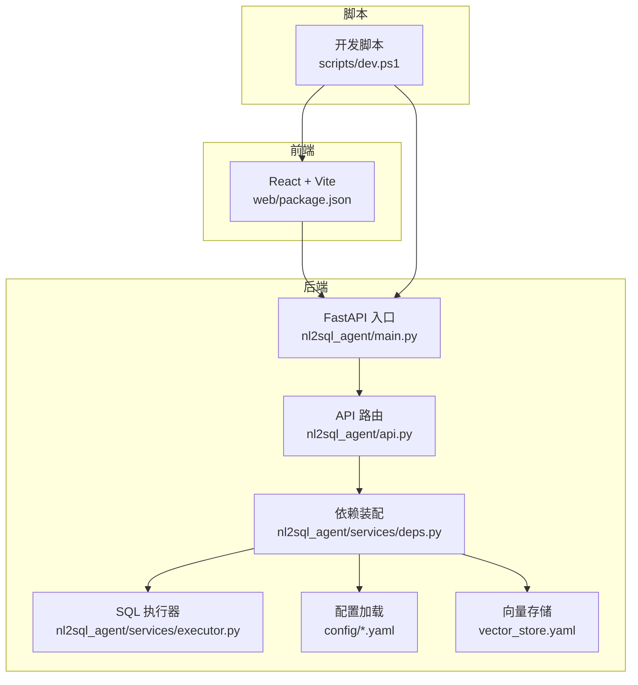
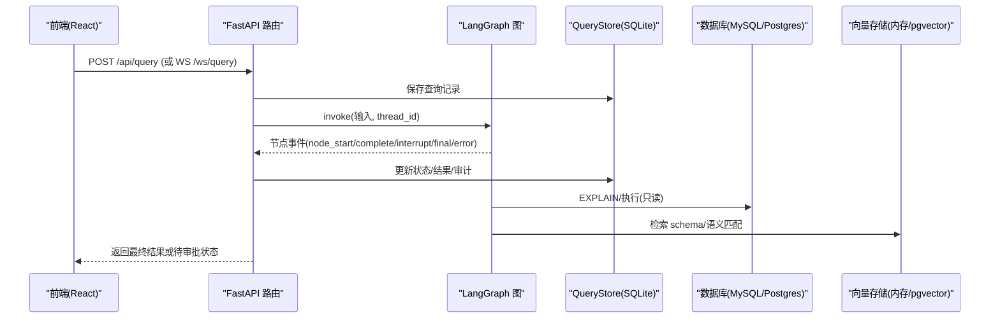
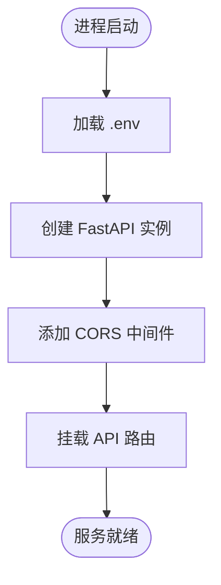
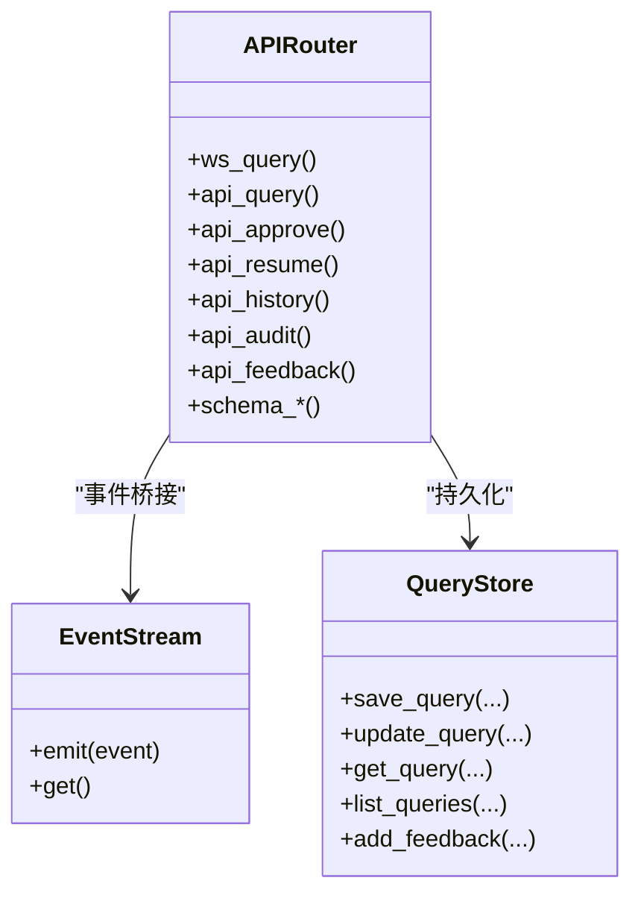
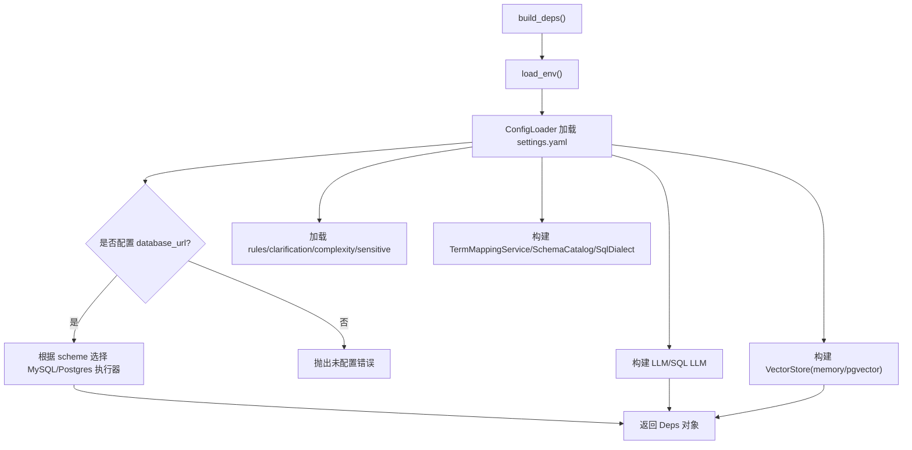
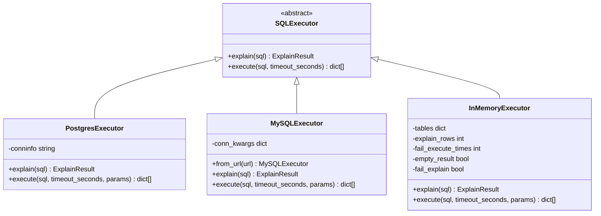
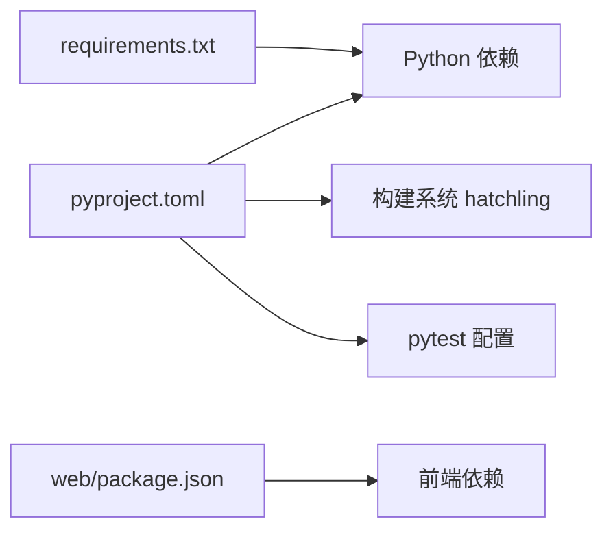

# 部署运维

<cite>
**本文引用的文件**   
- [nl2sql_agent/main.py](file://nl2sql_agent/main.py)
- [nl2sql_agent/api.py](file://nl2sql_agent/api.py)
- [nl2sql_agent/services/deps.py](file://nl2sql_agent/services/deps.py)
- [nl2sql_agent/services/executor.py](file://nl2sql_agent/services/executor.py)
- [nl2sql_agent/config/settings.yaml](file://nl2sql_agent/config/settings.yaml)
- [nl2sql_agent/config/model_config.yaml](file://nl2sql_agent/config/model_config.yaml)
- [nl2sql_agent/config/vector_store.yaml](file://nl2sql_agent/config/vector_store.yaml)
- [pyproject.toml](file://pyproject.toml)
- [requirements.txt](file://requirements.txt)
- [web/package.json](file://web/package.json)
- [scripts/dev.ps1](file://scripts/dev.ps1)
</cite>

## 目录
1. [简介](#简介)
2. [项目结构](#项目结构)
3. [核心组件](#核心组件)
4. [架构总览](#架构总览)
5. [详细组件分析](#详细组件分析)
6. [依赖关系分析](#依赖关系分析)
7. [性能考虑](#性能考虑)
8. [故障排查指南](#故障排查指南)
9. [结论](#结论)
10. [附录](#附录)

## 简介
本文件面向部署与运维人员，提供从开发环境搭建到生产部署、监控告警、备份恢复、安全加固、自动化与发布流程、故障排查与容量规划的全链路文档。系统基于 FastAPI + LangGraph 的 NL2SQL 智能体，支持多业务线、权限控制、人工确认与审计，后端提供 REST 与 WebSocket 接口，前端为 React+Vite 应用。

## 项目结构
- 后端服务：FastAPI 入口、API 路由、依赖装配、执行器、配置加载、向量存储等
- 前端工程：React + Vite，开发时通过 CORS 与后端联调
- 脚本工具：Windows 一键启停前后端、导入数据与审核脚本
- 配置中心：settings.yaml、model_config.yaml、vector_store.yaml 等
- 依赖管理：pyproject.toml 与 requirements.txt

**图表来源** 
- [nl2sql_agent/main.py:1-152](file://nl2sql_agent/main.py#L1-L152)
- [nl2sql_agent/api.py:1-573](file://nl2sql_agent/api.py#L1-L573)
- [nl2sql_agent/services/deps.py:1-178](file://nl2sql_agent/services/deps.py#L1-L178)
- [nl2sql_agent/services/executor.py:1-200](file://nl2sql_agent/services/executor.py#L1-L200)
- [nl2sql_agent/config/settings.yaml:1-30](file://nl2sql_agent/config/settings.yaml#L1-L30)
- [nl2sql_agent/config/vector_store.yaml:1-6](file://nl2sql_agent/config/vector_store.yaml#L1-L6)
- [web/package.json:1-26](file://web/package.json#L1-L26)
- [scripts/dev.ps1:1-134](file://scripts/dev.ps1#L1-L134)

**章节来源**
- [nl2sql_agent/main.py:1-152](file://nl2sql_agent/main.py#L1-L152)
- [nl2sql_agent/api.py:1-573](file://nl2sql_agent/api.py#L1-L573)
- [nl2sql_agent/services/deps.py:1-178](file://nl2sql_agent/services/deps.py#L1-L178)
- [nl2sql_agent/services/executor.py:1-200](file://nl2sql_agent/services/executor.py#L1-L200)
- [nl2sql_agent/config/settings.yaml:1-30](file://nl2sql_agent/config/settings.yaml#L1-L30)
- [nl2sql_agent/config/vector_store.yaml:1-6](file://nl2sql_agent/config/vector_store.yaml#L1-L6)
- [web/package.json:1-26](file://web/package.json#L1-L26)
- [scripts/dev.ps1:1-134](file://scripts/dev.ps1#L1-L134)

## 核心组件
- FastAPI 应用与中间件：CORS、路由挂载、线程状态持久化（SQLite Checkpointer）
- API 层：REST 查询/审批/历史/审计/反馈/配置；WebSocket 流式事件推送
- 依赖装配：读取 .env 与 YAML 配置，构建 LLM、SQL 执行器、向量存储、Schema 目录等
- SQL 执行器：Postgres/MySQL 只读事务、超时控制、EXPLAIN 预估行数保护
- 配置体系：运行参数、模型配置、向量存储后端选择
- 前端：React + Vite，开发模式跨域访问后端

**章节来源**
- [nl2sql_agent/main.py:1-152](file://nl2sql_agent/main.py#L1-L152)
- [nl2sql_agent/api.py:1-573](file://nl2sql_agent/api.py#L1-L573)
- [nl2sql_agent/services/deps.py:1-178](file://nl2sql_agent/services/deps.py#L1-L178)
- [nl2sql_agent/services/executor.py:1-200](file://nl2sql_agent/services/executor.py#L1-L200)
- [nl2sql_agent/config/settings.yaml:1-30](file://nl2sql_agent/config/settings.yaml#L1-L30)
- [nl2sql_agent/config/model_config.yaml:1-16](file://nl2sql_agent/config/model_config.yaml#L1-L16)
- [nl2sql_agent/config/vector_store.yaml:1-6](file://nl2sql_agent/config/vector_store.yaml#L1-L6)

## 架构总览
系统采用“前端 + 后端 API + 图执行引擎 + 数据库/向量存储”的分层架构。请求进入 FastAPI，经 API 路由分发至图执行引擎（LangGraph），执行过程中通过事件桥接将节点级事件推送到 WebSocket 客户端，同时落库持久化。

**图表来源** 
- [nl2sql_agent/api.py:134-211](file://nl2sql_agent/api.py#L134-L211)
- [nl2sql_agent/api.py:234-264](file://nl2sql_agent/api.py#L234-L264)
- [nl2sql_agent/services/deps.py:107-178](file://nl2sql_agent/services/deps.py#L107-L178)
- [nl2sql_agent/services/executor.py:53-159](file://nl2sql_agent/services/executor.py#L53-L159)

## 详细组件分析

### 后端服务入口与中间件
- 启动方式：uvicorn 运行 nl2sql_agent.main:app
- 环境变量：ANTHROPIC_API_KEY、ANTHROPIC_MODEL、NL2SQL_DEMO 等
- CORS：允许本地前端端口跨域
- 路由：包含 /query、/approve、/thread/{id} 等

**图表来源** 
- [nl2sql_agent/main.py:29-57](file://nl2sql_agent/main.py#L29-L57)

**章节来源**
- [nl2sql_agent/main.py:1-152](file://nl2sql_agent/main.py#L1-L152)

### API 路由与事件流
- REST：/api/query、/api/query/{trace_id}、/api/query/{trace_id}/approve、/api/history、/api/audit/{trace_id}、/api/feedback、/api/config/*、/api/schema/*
- WebSocket：/ws/query 流式推送节点事件，支持断线重连恢复
- 状态持久化：SQLite 存储查询记录、审计、反馈、审核队列等

**图表来源** 
- [nl2sql_agent/api.py:54-99](file://nl2sql_agent/api.py#L54-L99)
- [nl2sql_agent/api.py:134-211](file://nl2sql_agent/api.py#L134-L211)
- [nl2sql_agent/api.py:234-354](file://nl2sql_agent/api.py#L234-L354)

**章节来源**
- [nl2sql_agent/api.py:1-573](file://nl2sql_agent/api.py#L1-L573)

### 依赖装配与配置加载
- AppConfig/Deps：集中管理运行参数、LLM、SQL 执行器、向量存储、Schema 目录、术语映射等
- 配置来源：settings.yaml、model_config.yaml、vector_store.yaml、term_mapping/*.yaml
- 环境变量：.env 中的 DATABASE_URL、PGVECTOR_URL、ANTHROPIC_* 等
- 向量存储后端：memory 或 pgvector（显式配置）

**图表来源** 
- [nl2sql_agent/services/deps.py:107-178](file://nl2sql_agent/services/deps.py#L107-L178)
- [nl2sql_agent/config/settings.yaml:1-30](file://nl2sql_agent/config/settings.yaml#L1-L30)
- [nl2sql_agent/config/vector_store.yaml:1-6](file://nl2sql_agent/config/vector_store.yaml#L1-L6)

**章节来源**
- [nl2sql_agent/services/deps.py:1-178](file://nl2sql_agent/services/deps.py#L1-L178)
- [nl2sql_agent/config/settings.yaml:1-30](file://nl2sql_agent/config/settings.yaml#L1-L30)
- [nl2sql_agent/config/model_config.yaml:1-16](file://nl2sql_agent/config/model_config.yaml#L1-L16)
- [nl2sql_agent/config/vector_store.yaml:1-6](file://nl2sql_agent/config/vector_store.yaml#L1-L6)

### SQL 执行器与安全策略
- PostgresExecutor：只读账号 + READ ONLY 事务 + statement_timeout
- MySQLExecutor：READ ONLY 事务 + MAX_EXECUTION_TIME + EXPLAIN FORMAT=JSON
- InMemoryExecutor：测试/演示用，可模拟失败、空结果、EXPLAIN 失败
- 风险防护：EXPLAIN 预估行数阈值拒绝、只读事务、超时限制

**图表来源** 
- [nl2sql_agent/services/executor.py:23-81](file://nl2sql_agent/services/executor.py#L23-L81)
- [nl2sql_agent/services/executor.py:83-159](file://nl2sql_agent/services/executor.py#L83-L159)
- [nl2sql_agent/services/executor.py:161-200](file://nl2sql_agent/services/executor.py#L161-L200)

**章节来源**
- [nl2sql_agent/services/executor.py:1-200](file://nl2sql_agent/services/executor.py#L1-L200)

### 前端开发与联调
- 开发命令：npm run dev（Vite）
- 端口：默认 5173，需与后端 CORS 白名单一致
- 依赖：React、Ant Design、TypeScript、Vite

**章节来源**
- [web/package.json:1-26](file://web/package.json#L1-L26)
- [nl2sql_agent/main.py:48-55](file://nl2sql_agent/main.py#L48-L55)

## 依赖关系分析
- Python 依赖：langgraph、fastapi、uvicorn、pydantic、sqlglot、anthropic/openai、psycopg/pymysql、sentence-transformers、modelscope、langgraph-checkpoint-sqlite 等
- 前端依赖：react、antd、vite、typescript
- 构建系统：hatchling（pyproject.toml）、uv 索引（清华源）

**图表来源** 
- [pyproject.toml:1-44](file://pyproject.toml#L1-L44)
- [requirements.txt:1-15](file://requirements.txt#L1-L15)
- [web/package.json:1-26](file://web/package.json#L1-L26)

**章节来源**
- [pyproject.toml:1-44](file://pyproject.toml#L1-L44)
- [requirements.txt:1-15](file://requirements.txt#L1-L15)
- [web/package.json:1-26](file://web/package.json#L1-L26)

## 性能考虑
- 执行器层面：
  - 使用 EXPLAIN 预估行数，超过阈值直接拒绝，避免大扫描
  - 只读事务与超时控制，防止长事务与慢查询
  - 连接池与超时参数优化（如 connect_timeout）
- 向量存储：
  - 生产建议启用 pgvector，提升检索性能与持久化能力
  - 合理设置 Top-K 与维度，平衡召回率与延迟
- 并发与扩展：
  - 使用多进程 uvicorn worker，结合反向代理（Nginx/Ingress）负载均衡
  - 无状态 API 设计，便于水平扩展
- 缓存与检查点：
  - SQLite Checkpointer 用于线程状态持久化，注意磁盘 IO 与锁竞争
  - 可引入语义缓存（预留扩展点）减少重复计算

[本节为通用指导，不直接分析具体文件]

## 故障排查指南
- 常见问题定位：
  - 端口占用：使用 scripts/dev.ps1 status 查看后端 8000、前端 5173 端口状态
  - 日志位置：logs/backend.log、logs/backend.err.log、logs/frontend.log、logs/frontend.err.log
  - 环境变量缺失：检查 .env 中 DATABASE_URL、ANTHROPIC_API_KEY、ANTHROPIC_MODEL、PGVECTOR_URL
  - 向量存储后端：vector_store.yaml 中 backend 与 pgvector.url 配置一致性
  - 数据库连接：settings.yaml 的 database_url 优先级高于 .env 的 DATABASE_URL
- 调试步骤：
  - 重启服务：scripts/dev.ps1 restart
  - 查看 API 文档：http://localhost:8000/docs
  - 检查线程状态：GET /thread/{thread_id}
  - 审批/恢复：POST /api/query/{trace_id}/approve 或 /resume
- 常见错误：
  - “未配置数据库连接”：检查 settings.yaml 与 .env
  - “不支持的数据库类型”：检查 URL scheme（mysql/postgres）
  - “向量存储未配置 pgvector.url”：检查 vector_store.yaml

**章节来源**
- [scripts/dev.ps1:1-134](file://scripts/dev.ps1#L1-L134)
- [nl2sql_agent/services/deps.py:159-164](file://nl2sql_agent/services/deps.py#L159-L164)
- [nl2sql_agent/api.py:266-272](file://nl2sql_agent/api.py#L266-L272)
- [nl2sql_agent/api.py:280-315](file://nl2sql_agent/api.py#L280-L315)

## 结论
本系统以 FastAPI + LangGraph 为核心，提供安全的 NL2SQL 能力，具备完善的配置管理、执行器隔离、向量检索与审计能力。通过本文档，运维人员可快速完成开发环境搭建、生产部署、监控告警、备份恢复与安全加固，并建立自动化流水线与容量规划体系。

[本节为总结性内容，不直接分析具体文件]

## 附录

### 开发环境搭建
- 前置要求：Python >= 3.11、Node.js（前端）、数据库（MySQL/Postgres）
- 安装依赖：
  - Python：使用 pyproject.toml 或 requirements.txt 安装
  - 前端：cd web && npm install
- 环境变量：在项目根目录创建 .env，配置 ANTHROPIC_API_KEY、ANTHROPIC_MODEL、DATABASE_URL、PGVECTOR_URL 等
- 启动服务：
  - Windows：powershell -File scripts/dev.ps1 start
  - 手动：uvicorn nl2sql_agent.main:app --port 8000 与 npm run dev

**章节来源**
- [pyproject.toml:1-44](file://pyproject.toml#L1-L44)
- [requirements.txt:1-15](file://requirements.txt#L1-L15)
- [web/package.json:1-26](file://web/package.json#L1-L26)
- [scripts/dev.ps1:1-134](file://scripts/dev.ps1#L1-L134)
- [nl2sql_agent/main.py:148-152](file://nl2sql_agent/main.py#L148-L152)

### 生产环境部署
- 容器化：
  - 构建镜像：基于 Python 官方镜像，复制代码与依赖，暴露 8000 端口
  - 前端静态资源：Vite build 输出 dist 目录，由 Nginx 托管
- 负载均衡：
  - 使用 Nginx/Ingress 反向代理，转发 /api 与 /ws 到后端
  - 健康检查：GET /docs 或自定义 /health
- 高可用：
  - 多副本部署，共享外部数据库与向量存储
  - 使用 Redis 替代 SQLite Checkpointer（可扩展）
- 扩缩容：
  - 无状态 API，按 CPU/内存指标自动扩缩容
  - 数据库连接池与只读副本分离

[本节为通用指导，不直接分析具体文件]

### 监控系统集成
- 性能监控：
  - 采集 QPS、延迟、错误率（Prometheus + Grafana）
  - 节点级延迟：node_latencies 字段
- 错误追踪：
  - 结构化日志：trace_id、user_id、status、execution_error
  - 集成 Sentry/OpenTelemetry
- 日志收集：
  - 后端日志：stdout/stderr 统一收集（ELK/Loki）
  - 前端日志：错误上报与用户行为埋点
- 告警配置：
  - 错误率阈值、慢查询告警、数据库连接异常、向量存储不可用

[本节为通用指导，不直接分析具体文件]

### 备份恢复策略
- 数据备份：
  - 数据库：定期全量 + 增量备份（mysqldump/pg_dump）
  - 向量存储：pgvector 表备份或快照
  - 查询记录：SQLite 文件备份（nl2sql.db、langgraph_checkpoints.db、schema_ingest.db）
- 配置备份：
  - config/*.yaml、term_mapping/*.yaml、.env（敏感信息加密）
- 灾难恢复：
  - 恢复顺序：数据库 → 向量存储 → 配置文件 → 应用重启
  - 验证：执行测试查询与审批流程

[本节为通用指导，不直接分析具体文件]

### 安全加固措施
- 网络安全：
  - 仅开放必要端口（8000、5173），使用防火墙/安全组
  - HTTPS 终止于反向代理
- 访问控制：
  - 管理员接口：X-Admin-Token 校验（/api/config/term-mapping）
  - 用户身份：user_id 与 data_scope 注入
- 审计日志：
  - 所有查询与审批操作记录 trace_id、approver、status
- 安全扫描：
  - 依赖漏洞扫描（pip audit、npm audit）
  - 代码静态分析（ruff、eslint）

**章节来源**
- [nl2sql_agent/api.py:396-433](file://nl2sql_agent/api.py#L396-L433)
- [nl2sql_agent/api.py:356-379](file://nl2sql_agent/api.py#L356-L379)

### 运维自动化与 CI/CD
- 自动化脚本：
  - 开发环境：scripts/dev.ps1 一键启停
  - 数据导入：scripts/import_schema_from_db.py、scripts/ingest_schema.py
  - 审核流程：scripts/review_schema_comments.py、scripts/seed_data.py
- CI/CD 流水线：
  - 代码提交触发测试（pytest）
  - 构建镜像与前端静态资源
  - 部署到测试/生产环境（滚动更新）
- 发布管理：
  - 版本标签（Git tag）
  - 灰度发布与回滚策略

**章节来源**
- [scripts/dev.ps1:1-134](file://scripts/dev.ps1#L1-L134)
- [pyproject.toml:41-44](file://pyproject.toml#L41-L44)

### 容量规划方法
- 评估指标：
  - QPS、平均延迟、P95/P99 延迟、错误率
  - 数据库连接数、向量检索 QPS
- 资源估算：
  - CPU/内存：按并发数与模型推理开销估算
  - 存储：查询记录增长速率、向量索引大小
- 扩容策略：
  - 水平扩展 API 服务
  - 数据库读写分离与连接池优化
  - 向量存储集群化（pgvector 分片）

[本节为通用指导，不直接分析具体文件]