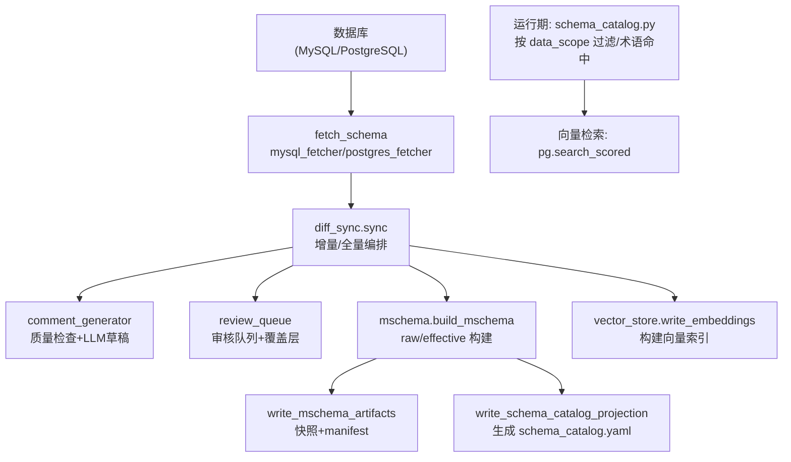
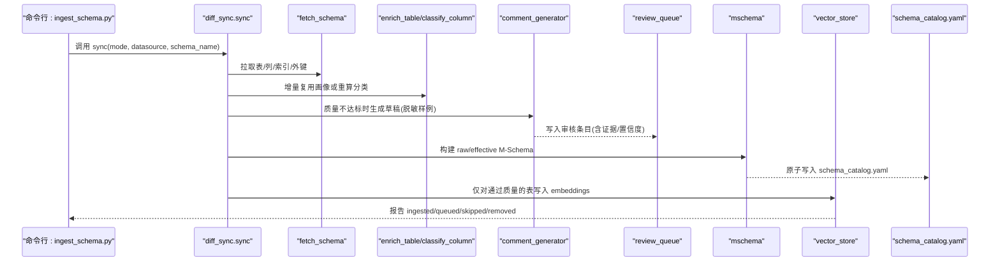
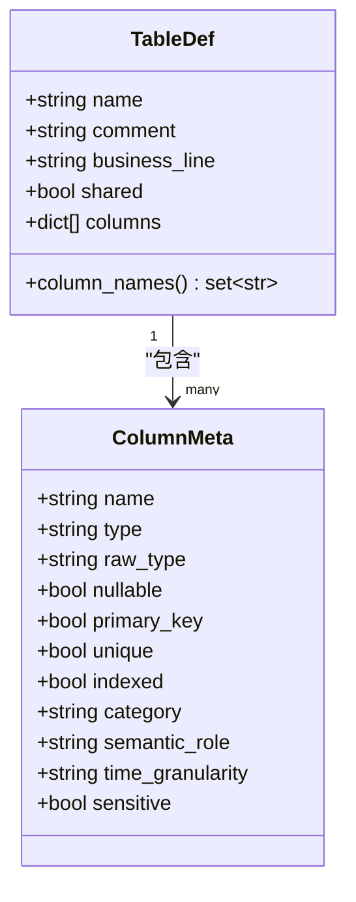
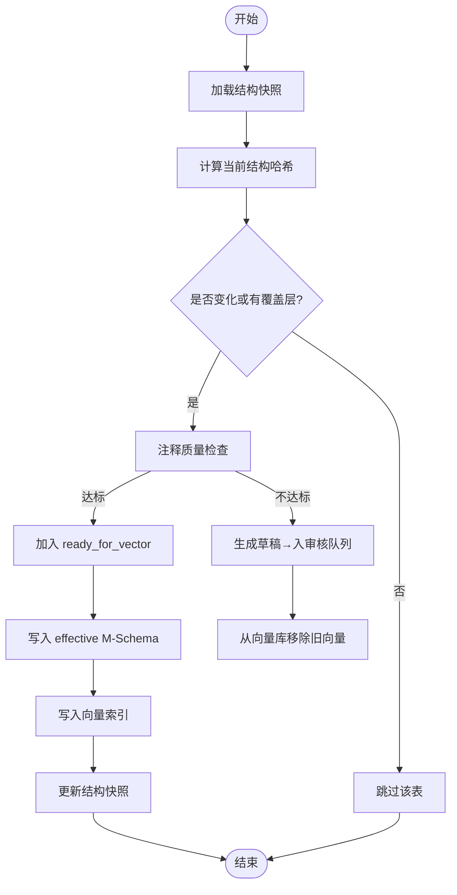
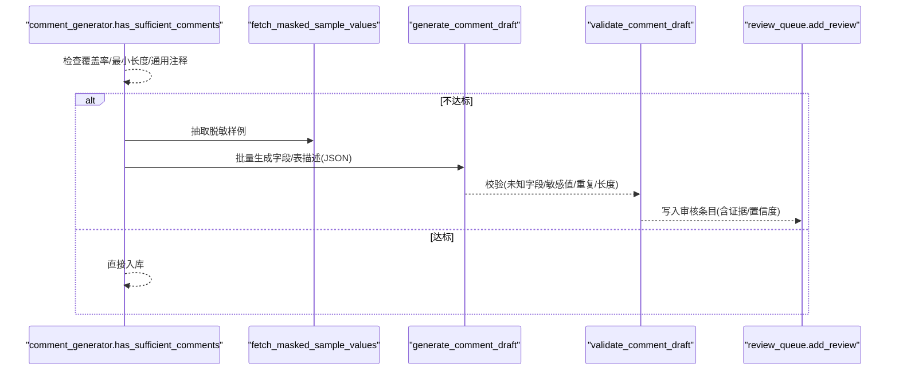
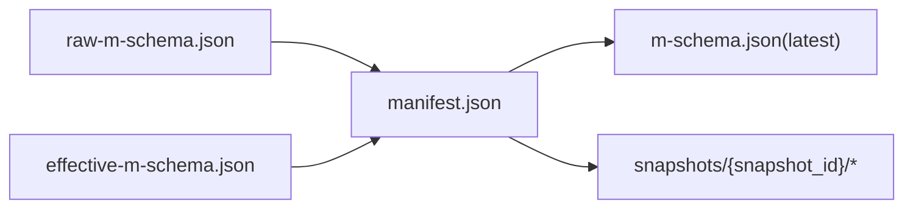
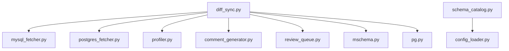

# Schema目录配置

<cite>
**本文引用的文件**   
- [schema_catalog.yaml](file://nl2sql_agent/config/schema_catalog.yaml)
- [schema_catalog.py](file://nl2sql_agent/services/schema_catalog.py)
- [diff_sync.py](file://nl2sql_agent/services/schema_ingest/diff_sync.py)
- [comment_generator.py](file://nl2sql_agent/services/schema_ingest/comment_generator.py)
- [mschema.py](file://nl2sql_agent/services/schema_ingest/mschema.py)
- [review_queue.py](file://nl2sql_agent/services/schema_ingest/review_queue.py)
- [ingest_schema.py](file://scripts/ingest_schema.py)
- [import_schema_from_db.py](file://scripts/import_schema_from_db.py)
- [schema_importer.py](file://nl2sql_agent/services/schema_importer.py)
- [profiler.py](file://nl2sql_agent/services/schema_ingest/profiler.py)
- [mysql_fetcher.py](file://nl2sql_agent/services/schema_ingest/mysql_fetcher.py)
- [postgres_fetcher.py](file://nl2sql_agent/services/schema_ingest/postgres_fetcher.py)
- [pg.py](file://nl2sql_agent/services/vector_store/pg.py)
- [m3_schema_retrieval.py](file://nl2sql_agent/nodes/m3_schema_retrieval.py)
</cite>

## 目录
1. [简介](#简介)
2. [项目结构](#项目结构)
3. [核心组件](#核心组件)
4. [架构总览](#架构总览)
5. [详细组件分析](#详细组件分析)
6. [依赖关系分析](#依赖关系分析)
7. [性能考虑](#性能考虑)
8. [故障排查指南](#故障排查指南)
9. [结论](#结论)
10. [附录](#附录)

## 简介
本文件为“Schema 目录配置”的权威文档，围绕 schema_catalog.yaml 的结构与字段元数据、Schema 同步机制（数据库变更检测、增量策略、冲突解决）、注释生成与审核流程、版本管理与迁移脚本生成、导入工具使用与错误处理，以及索引与查询优化建议进行系统化说明。读者可据此理解从数据库到向量检索的全链路 Schema 工程化实践。

## 项目结构
- 配置层：config/schema_catalog.yaml 由 effective M-Schema 单向投影生成，作为运行时精简视图供检索与 SQL 生成使用。
- 同步层：scripts/ingest_schema.py 驱动 diff_sync.sync，完成全量/增量同步、质量门禁、LLM 辅助注释草稿、审核队列、向量入库。
- 事实源：data/schema/{datasource}/m-schema.json 及其快照目录，保存 raw/effective 双版本与 manifest 清单。
- 运行期：services/schema_catalog.py 加载 catalog，提供按业务线过滤、术语命中、敏感字段收集等能力。
- 向量层：vector_store.pg.py 基于有效 M-Schema 构建表级/字段级 embedding 并支持评分检索。

**图表来源** 
- [diff_sync.py:155-316](file://nl2sql_agent/services/schema_ingest/diff_sync.py#L155-L316)
- [mschema.py:58-140](file://nl2sql_agent/services/schema_ingest/mschema.py#L58-L140)
- [mschema.py:195-223](file://nl2sql_agent/services/schema_ingest/mschema.py#L195-L223)
- [pg.py:137-173](file://nl2sql_agent/services/vector_store/pg.py#L137-L173)

**章节来源**
- [schema_catalog.py:27-62](file://nl2sql_agent/services/schema_catalog.py#L27-L62)
- [diff_sync.py:155-316](file://nl2sql_agent/services/schema_ingest/diff_sync.py#L155-L316)

## 核心组件
- SchemaCatalog：从 config/schema_catalog.yaml 加载并按 data_scope 返回表定义；支持术语命中、跨表覆盖、敏感字段汇总。
- diff_sync.sync：全量/增量同步编排，结构哈希对比、画像复用、质量门禁、LLM 草稿、审核队列、向量写入。
- comment_generator：注释质量规则、脱敏样例抽取、LLM 多阶段提示与 JSON 约束输出、置信度评估。
- mschema：构建 raw/effective M-Schema，写快照与 manifest，原子投影生成 schema_catalog.yaml。
- review_queue：SQLite 存储待审核条目、覆盖层与结构快照，支持 approve/reject 与覆盖层读取。
- vector_store.pg：按 business_line/data_scope 过滤集合，计算相似度得分，返回 SchemaHit。

**章节来源**
- [schema_catalog.py:15-126](file://nl2sql_agent/services/schema_catalog.py#L15-L126)
- [diff_sync.py:40-153](file://nl2sql_agent/services/schema_ingest/diff_sync.py#L40-L153)
- [comment_generator.py:22-54](file://nl2sql_agent/services/schema_ingest/comment_generator.py#L22-L54)
- [mschema.py:58-140](file://nl2sql_agent/services/schema_ingest/mschema.py#L58-L140)
- [review_queue.py:19-107](file://nl2sql_agent/services/schema_ingest/review_queue.py#L19-L107)
- [pg.py:137-173](file://nl2sql_agent/services/vector_store/pg.py#L137-L173)

## 架构总览
下图展示从数据库元数据到运行期 Schema 目录与向量检索的整体流程，强调 effective M-Schema 作为唯一事实源，catalog 为其单向投影。

**图表来源** 
- [ingest_schema.py:31-66](file://scripts/ingest_schema.py#L31-L66)
- [diff_sync.py:155-316](file://nl2sql_agent/services/schema_ingest/diff_sync.py#L155-L316)
- [comment_generator.py:247-307](file://nl2sql_agent/services/schema_ingest/comment_generator.py#L247-L307)
- [mschema.py:226-288](file://nl2sql_agent/services/schema_ingest/mschema.py#L226-L288)

## 详细组件分析

### schema_catalog.yaml 结构与字段元数据
- _meta：包含 projection_version、source、datasource、snapshot_id、semantic_hash、generated_at、m_schema_path 等元信息，指向 effective M-Schema 位置与语义哈希。
- 业务线命名空间（如 risk_mart）：包含 tables 列表，每张表定义 name、comment、business_line、shared、columns。
- 字段 columns：name、type、comment、raw_type、nullable、primary_key、unique、indexed、category、semantic_role、time_granularity、sensitive 等。
- shared：表级共享标记，行级权限通过 row_level_filter 注入 PLATFORM_CODE 实现。
- 语义角色 semantic_role：dimension/measure 等，配合 category（code/text/enum/numeric/datetime）用于检索与 SQL 生成。

**图表来源** 
- [schema_catalog.py:15-24](file://nl2sql_agent/services/schema_catalog.py#L15-L24)
- [schema_catalog.yaml:1-120](file://nl2sql_agent/config/schema_catalog.yaml#L1-L120)

**章节来源**
- [schema_catalog.yaml:1-120](file://nl2sql_agent/config/schema_catalog.yaml#L1-L120)
- [schema_catalog.py:27-62](file://nl2sql_agent/services/schema_catalog.py#L27-L62)

### Schema 同步机制（变更检测、增量策略、冲突解决）
- 变更检测：compute_structure_hash 对表结构（名称、注释、主键/唯一键、索引、关系、列元信息）计算 SHA256，作为增量依据。
- 增量策略：mode=incremental 时，仅处理 structure_hash 变化或存在覆盖层的表；未变化表复用上一版本画像与分类。
- 冲突解决：effective M-Schema 是唯一事实源；若质量不达标则不入向量库，并从向量库移除旧向量，避免陈旧结果污染。
- 幽灵表清理：当前不存在于数据库的表，从向量库删除并清理快照记录。

**图表来源** 
- [diff_sync.py:51-74](file://nl2sql_agent/services/schema_ingest/diff_sync.py#L51-L74)
- [diff_sync.py:193-260](file://nl2sql_agent/services/schema_ingest/diff_sync.py#L193-L260)

**章节来源**
- [diff_sync.py:51-74](file://nl2sql_agent/services/schema_ingest/diff_sync.py#L51-L74)
- [diff_sync.py:193-260](file://nl2sql_agent/services/schema_ingest/diff_sync.py#L193-L260)

### Schema 注释生成配置（自动规则、人工审核、质量评估）
- 质量规则：min_table_comment_length、min_column_comment_length、min_column_comment_coverage、generic_comments、require_all_columns。
- 脱敏样例：fetch_masked_sample_values 对敏感列打码，限制长度，禁止真实值进入 LLM。
- LLM 生成：分批次生成字段描述，再汇总表描述；JSON Schema 约束输出，失败回退空草稿。
- 审核流程：build_review_entries 仅收录缺失/弱注释条目；ReviewStore 支持 list/show/approve/reject；approve 写入覆盖层，后续生效。
- 置信度评估：validate_comment_draft 综合证据比例、分类比例、约束信息与校验错误数，给出保守置信度。

**图表来源** 
- [comment_generator.py:22-54](file://nl2sql_agent/services/schema_ingest/comment_generator.py#L22-L54)
- [comment_generator.py:59-85](file://nl2sql_agent/services/schema_ingest/comment_generator.py#L59-L85)
- [comment_generator.py:247-307](file://nl2sql_agent/services/schema_ingest/comment_generator.py#L247-L307)
- [review_queue.py:68-93](file://nl2sql_agent/services/schema_ingest/review_queue.py#L68-L93)

**章节来源**
- [comment_generator.py:22-54](file://nl2sql_agent/services/schema_ingest/comment_generator.py#L22-L54)
- [comment_generator.py:247-307](file://nl2sql_agent/services/schema_ingest/comment_generator.py#L247-L307)
- [review_queue.py:68-107](file://nl2sql_agent/services/schema_ingest/review_queue.py#L68-L107)

### Schema 版本管理（版本控制、回滚策略、迁移脚本）
- 版本控制：write_mschema_artifacts 生成 raw-m-schema.json、effective-m-schema.json、manifest.json 与 latest m-schema.json；manifest 包含 snapshot_id、structure_hash、semantic_hash、prompt_version、generated_at、table/column_count。
- 快照目录：data/schema/{datasource}/snapshots/{snapshot_id} 下存放内容寻址快照，便于回溯与审计。
- 回滚策略：以 effective M-Schema 为准，回滚即切换 latest 指向历史快照；catalog 随 effective 重新投影。
- 迁移脚本：当前仓库未内置自动生成迁移脚本的工具；建议在外部流程中基于 raw/effective 差异生成 DDL 变更脚本，并在 CI 中执行验证。

**图表来源** 
- [mschema.py:226-288](file://nl2sql_agent/services/schema_ingest/mschema.py#L226-L288)

**章节来源**
- [mschema.py:226-288](file://nl2sql_agent/services/schema_ingest/mschema.py#L226-L288)

### Schema 导入工具使用方法、批量导入配置与错误处理
- 推荐入口：scripts/ingest_schema.py --mode full/incremental，支持 datasource、schema-name、business-line、review-db 参数。
- 旧版兼容：scripts/import_schema_from_db.py 已弃用，内部调用 schema_importer.refresh_catalog_from_db，直写 catalog 且可能绕过 M-Schema 事实源。
- 批量导入：sync 函数内循环处理每张表，ready_for_vector 列表控制向量写入；errors 收集异常信息并打印。
- 错误处理：LLM 调用失败回退空草稿；向量写入失败记录 errors 且不推进快照，确保下次增量重试。

**章节来源**
- [ingest_schema.py:31-66](file://scripts/ingest_schema.py#L31-L66)
- [import_schema_from_db.py:27-43](file://scripts/import_schema_from_db.py#L27-L43)
- [schema_importer.py:97-108](file://nl2sql_agent/services/schema_importer.py#L97-L108)
- [diff_sync.py:234-260](file://nl2sql_agent/services/schema_ingest/diff_sync.py#L234-L260)

### Schema 性能优化、索引建议与查询优化指导
- 画像与分类：profiler.profile_table 限制 sample_size，敏感列抑制统计，避免全表扫描；classify_column 规则优先，减少 LLM 调用。
- 增量优化：hydrate_enrichment 恢复未变化表的画像与分类，降低重复成本。
- 向量检索：pg.search_scored 按 names 过滤集合，使用 <=> 排序与 LIMIT top_k，提升召回效率。
- 索引建议：在高频过滤/连接字段上建立索引；时间维度字段按粒度建索引；数值度量字段按需聚合索引。
- 查询优化：优先使用 data_scope 缩小范围；利用 semantic_role/category 做预过滤；避免大文本列参与 join。

**章节来源**
- [profiler.py:36-76](file://nl2sql_agent/services/schema_ingest/profiler.py#L36-L76)
- [profiler.py:79-113](file://nl2sql_agent/services/schema_ingest/profiler.py#L79-L113)
- [mschema.py:19-40](file://nl2sql_agent/services/schema_ingest/mschema.py#L19-L40)
- [pg.py:137-173](file://nl2sql_agent/services/vector_store/pg.py#L137-L173)

## 依赖关系分析
- 模块耦合：diff_sync 依赖 fetcher、profiler、comment_generator、review_queue、mschema、vector_store；schema_catalog.py 仅依赖 ConfigLoader 与 state。
- 外部依赖：MySQL/PostgreSQL 元数据查询、SQLite 本地存储、向量后端（PG vector）。
- 潜在循环：无直接循环依赖；各模块职责清晰，通过接口契约解耦。

**图表来源** 
- [diff_sync.py:155-316](file://nl2sql_agent/services/schema_ingest/diff_sync.py#L155-L316)
- [schema_catalog.py:27-62](file://nl2sql_agent/services/schema_catalog.py#L27-L62)

**章节来源**
- [diff_sync.py:155-316](file://nl2sql_agent/services/schema_ingest/diff_sync.py#L155-L316)
- [schema_catalog.py:27-62](file://nl2sql_agent/services/schema_catalog.py#L27-L62)

## 性能考虑
- 采样画像：profile_table 默认 sample_size=100，example_limit=3，敏感列抑制统计，避免大数据集开销。
- 增量复用：hydrate_enrichment 恢复未变化表画像与分类，显著降低重复计算。
- 向量写入：仅在 effective M-Schema 落盘后写入，失败不推进快照，保证幂等与可重试。
- 检索优化：search_scored 使用集合过滤与向量相似度排序，top_k 限制返回规模。

[本节为通用性能建议，不直接分析具体文件]

## 故障排查指南
- 注释质量不达标：检查 min_table_comment_length/min_column_comment_length/min_column_comment_coverage 配置；查看 validate_comment_draft 的 validation_errors。
- LLM 调用失败：确认模型节点配置；草稿为空时 ReviewStore 仍会记录条目，需人工补充。
- 向量写入失败：查看 report.errors 中 vector_write 错误；下次增量将重试，直至成功。
- 幽灵表残留：确认 sync 清理逻辑，检查向量库集合与快照一致性。
- 旧版导入警告：import_schema_from_db.py 已弃用，应改用 ingest_schema.py 并通过 effective M-Schema 投影 catalog。

**章节来源**
- [comment_generator.py:205-244](file://nl2sql_agent/services/schema_ingest/comment_generator.py#L205-L244)
- [diff_sync.py:234-260](file://nl2sql_agent/services/schema_ingest/diff_sync.py#L234-L260)
- [import_schema_from_db.py:27-43](file://scripts/import_schema_from_db.py#L27-L43)

## 结论
本方案以 effective M-Schema 为唯一事实源，结合结构化质量门禁、LLM 辅助注释、审核覆盖层与向量索引，形成端到端的 Schema 工程化闭环。通过增量同步与快照管理，保障变更可追踪、可回滚；通过 catalog 投影与检索优化，提升查询与 SQL 生成的准确性与性能。

[本节为总结性内容，不直接分析具体文件]

## 附录
- 常用命令
  - 全量导入：uv run python scripts/ingest_schema.py --mode full --datasource nl2sql
  - 增量同步：uv run python scripts/ingest_schema.py --mode incremental --datasource nl2sql
  - 审核操作：uv run python scripts/review_schema_comments.py list/show/approve/reject
- 关键路径
  - effective M-Schema：data/schema/{datasource}/m-schema.json
  - 快照目录：data/schema/{datasource}/snapshots/{snapshot_id}
  - 运行期目录：config/schema_catalog.yaml

[本节为补充信息，不直接分析具体文件]