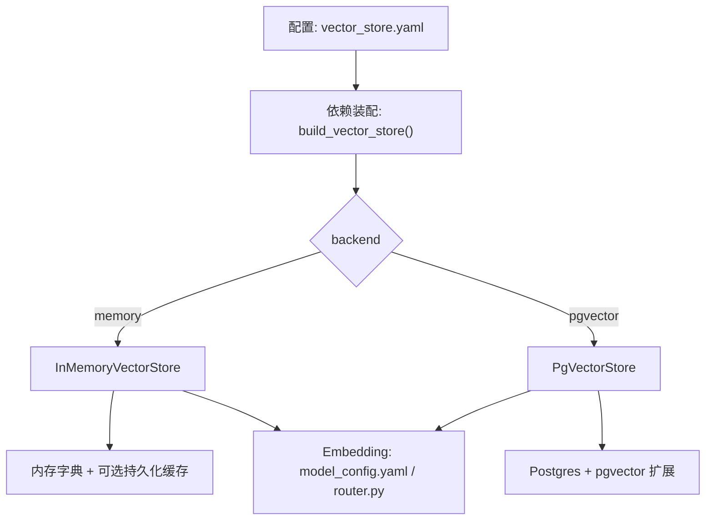
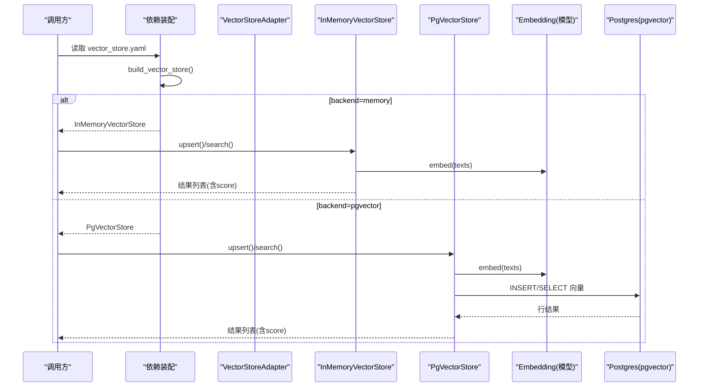
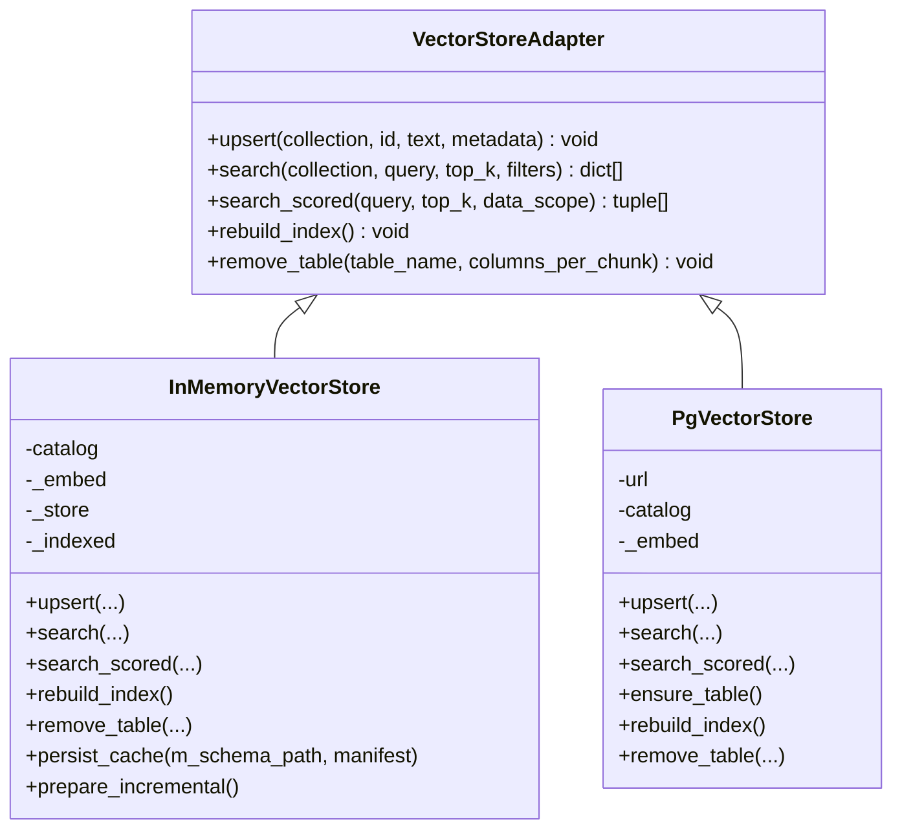
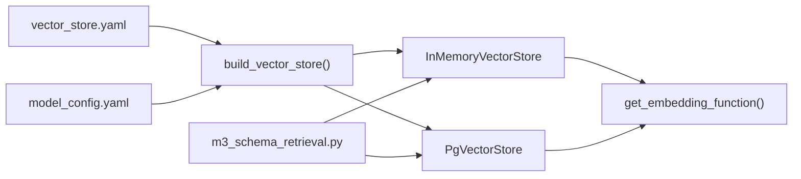
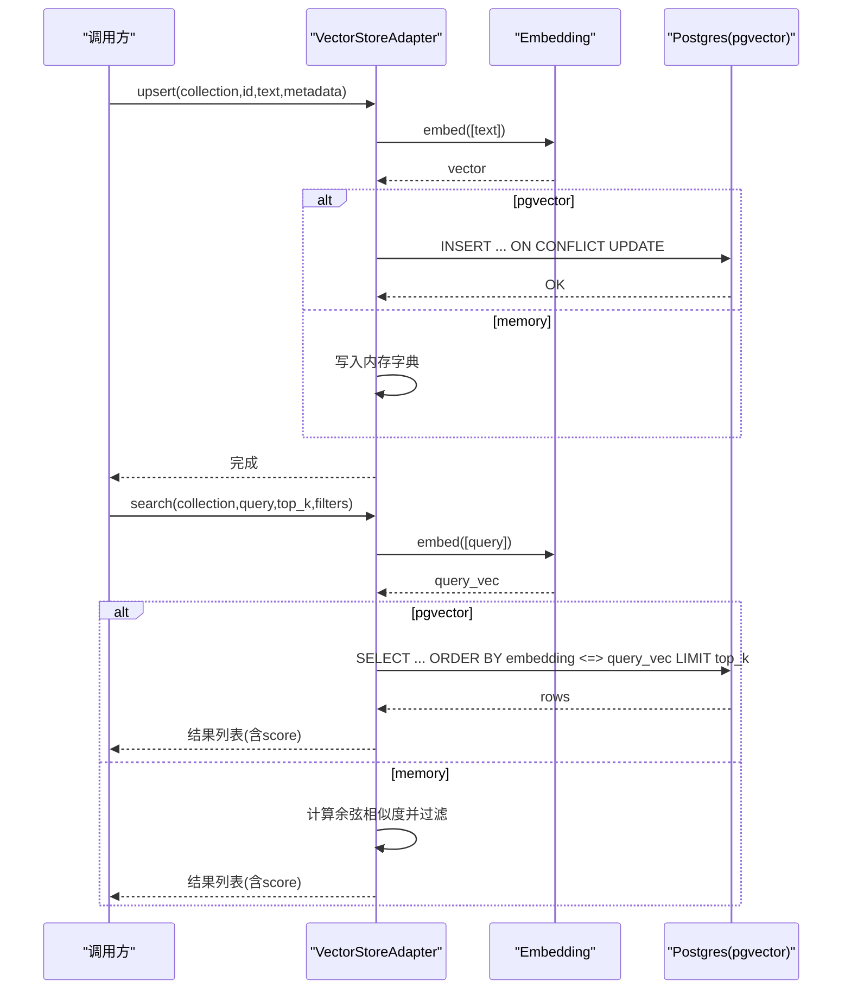
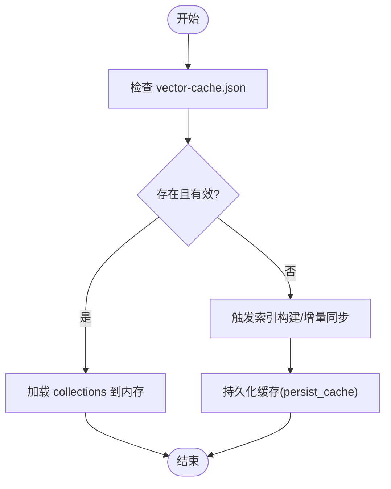
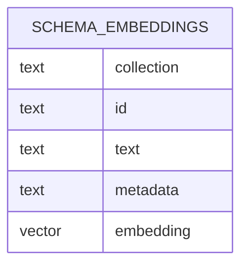

# 向量存储配置

<cite>
**本文引用的文件**   
- [vector_store.yaml](file://nl2sql_agent/config/vector_store.yaml)
- [deps.py](file://nl2sql_agent/services/deps.py)
- [base.py](file://nl2sql_agent/services/vector_store/base.py)
- [memory.py](file://nl2sql_agent/services/vector_store/memory.py)
- [pg.py](file://nl2sql_agent/services/vector_store/pg.py)
- [model_config.yaml](file://nl2sql_agent/config/model_config.yaml)
- [router.py](file://nl2sql_agent/services/embedding/router.py)
- [m3_schema_retrieval.py](file://nl2sql_agent/nodes/m3_schema_retrieval.py)
- [test_vector_store.py](file://nl2sql_agent/tests/test_vector_store.py)
</cite>

## 目录
1. [简介](#简介)
2. [项目结构](#项目结构)
3. [核心组件](#核心组件)
4. [架构总览](#架构总览)
5. [详细组件分析](#详细组件分析)
6. [依赖关系分析](#依赖关系分析)
7. [性能与容量规划](#性能与容量规划)
8. [故障排查指南](#故障排查指南)
9. [结论](#结论)
10. [附录](#附录)

## 简介
本文件面向“向量存储”相关配置与使用，重点解释 vector_store.yaml 的后端选择、pgvector 连接与检索行为、内存向量存储的缓存与清理策略；说明维度来源、相似度算法、Top-K 与过滤条件；并给出批量写入、重建索引、删除表、备份恢复、监控与扩展性建议。文档同时覆盖数据质量评估、重复数据检测与存储空间优化建议，帮助在生产环境中稳定高效地运行语义检索。

## 项目结构
向量存储相关的代码集中在 services/vector_store 包内，通过统一的适配器接口暴露 upsert/search/search_scored/rebuild_index/remove_table 等方法；后端由 config/vector_store.yaml 显式选择（memory 或 pgvector），并由依赖装配模块根据配置构建具体实现。

图表来源
- [deps.py:87-110](file://nl2sql_agent/services/deps.py#L87-L110)
- [vector_store.yaml:1-6](file://nl2sql_agent/config/vector_store.yaml#L1-L6)
- [memory.py:21-42](file://nl2sql_agent/services/vector_store/memory.py#L21-L42)
- [pg.py:15-44](file://nl2sql_agent/services/vector_store/pg.py#L15-L44)
- [router.py:34-61](file://nl2sql_agent/services/embedding/router.py#L34-L61)

章节来源
- [vector_store.yaml:1-6](file://nl2sql_agent/config/vector_store.yaml#L1-L6)
- [deps.py:87-110](file://nl2sql_agent/services/deps.py#L87-L110)

## 核心组件
- 统一接口 VectorStoreAdapter：定义 upsert、search、search_scored、rebuild_index、remove_table 等能力，屏蔽后端差异。
- 内存实现 InMemoryVectorStore：基于内存字典存储 embedding 与元数据，支持按 filters 过滤与余弦相似度排序；提供缓存持久化与重建能力。
- pgvector 实现 PgVectorStore：将文本向量化后写入 Postgres 的 schema_embeddings 表，使用 pgvector 的向量距离算子进行检索；支持按 collection 隔离、按 metadata 过滤、按业务线过滤。

章节来源
- [base.py:11-21](file://nl2sql_agent/services/vector_store/base.py#L11-L21)
- [memory.py:21-66](file://nl2sql_agent/services/vector_store/memory.py#L21-L66)
- [pg.py:15-66](file://nl2sql_agent/services/vector_store/pg.py#L15-L66)

## 架构总览
下图展示从配置到具体实现的装配流程，以及两个后端在 upsert/search 上的调用路径。

图表来源
- [deps.py:87-110](file://nl2sql_agent/services/deps.py#L87-L110)
- [memory.py:35-53](file://nl2sql_agent/services/vector_store/memory.py#L35-L53)
- [pg.py:32-65](file://nl2sql_agent/services/vector_store/pg.py#L32-L65)
- [router.py:34-61](file://nl2sql_agent/services/embedding/router.py#L34-L61)

## 详细组件分析

### 配置项与后端选择
- vector_store.yaml
  - backend: memory | pgvector（显式选择）
  - pgvector.url: 支持环境变量占位符 ${PGVECTOR_URL}
- deps.py 中的 build_vector_store()
  - 读取 vector_store.yaml，若 backend=pgvector 则要求 url 存在（支持环境变量展开），否则抛出运行时错误
  - 若为 memory，则构造 InMemoryVectorStore，并使用 model_config.yaml 的 embedding 配置生成 cache_signature，用于缓存命中判断

章节来源
- [vector_store.yaml:1-6](file://nl2sql_agent/config/vector_store.yaml#L1-L6)
- [deps.py:87-110](file://nl2sql_agent/services/deps.py#L87-L110)

### 维度设置与相似度算法
- 维度 dimension
  - 来自 model_config.yaml 的 embedding.dimension（默认 384）
  - PgVectorStore.ensure_table() 使用该维度创建 vector(dim) 列
- 相似度算法
  - 内存实现：余弦相似度（归一化后的点积）
  - pgvector 实现：使用 <=> 算子计算欧氏距离，并通过 1 - (embedding <=> vec)/2 映射为 [0,1] 的分数

章节来源
- [model_config.yaml:1-18](file://nl2sql_agent/config/model_config.yaml#L1-L18)
- [pg.py:69-79](file://nl2sql_agent/services/vector_store/pg.py#L69-L79)
- [pg.py:46-65](file://nl2sql_agent/services/vector_store/pg.py#L46-L65)
- [memory.py:17-18](file://nl2sql_agent/services/vector_store/memory.py#L17-L18)

### 内存向量存储：容量限制与清理策略
- 容量限制
  - 当前实现无硬上限；受限于进程内存
  - 可通过控制集合大小、减少冗余条目、降低 top_k 等方式缓解内存压力
- 清理策略
  - remove_table(table_name): 删除指定表的表级、字段级、关系级向量条目
  - rebuild_index(): 清空内存并重建索引（切换 embedding 模型后必须调用）
  - 缓存持久化：persist_cache() 原子写入 vector-cache.json，重启时若 semantic_hash 与 embedding_signature 一致则复用

章节来源
- [memory.py:143-152](file://nl2sql_agent/services/vector_store/memory.py#L143-L152)
- [memory.py:166-171](file://nl2sql_agent/services/vector_store/memory.py#L166-L171)
- [memory.py:121-138](file://nl2sql_agent/services/vector_store/memory.py#L121-L138)
- [memory.py:105-119](file://nl2sql_agent/services/vector_store/memory.py#L105-L119)

### pgvector 存储：连接、索引与检索
- 连接字符串
  - 通过 pgvector.url 配置，支持 ${PGVECTOR_URL} 环境变量展开
- 表结构与维度
  - schema_embeddings(collection, id, text, metadata, embedding vector(dim))
  - ensure_table() 自动建表，维度取自 embedding.dimension
- 索引参数
  - 当前实现未显式创建 pgvector 索引；如需高性能可结合 pgvector 的 HNSW/IVF 等索引类型在数据库层创建
- 检索行为
  - search(collection, query, top_k, filters): 对 business_line 做精确过滤，按 embedding <=> vec 排序取 top_k
  - search_scored(query, top_k, data_scope): 仅对指定表名集合进行评分排序

章节来源
- [pg.py:25-28](file://nl2sql_agent/services/vector_store/pg.py#L25-L28)
- [pg.py:69-79](file://nl2sql_agent/services/vector_store/pg.py#L69-L79)
- [pg.py:46-65](file://nl2sql_agent/services/vector_store/pg.py#L46-L65)
- [pg.py:139-173](file://nl2sql_agent/services/vector_store/pg.py#L139-L173)

### 向量数据管理：批量插入、更新删除、备份恢复
- 批量插入/更新
  - upsert(collection, id, text, metadata): 单条写入，内部调用 embedding 函数生成向量；pg 实现使用 ON CONFLICT 更新
  - rebuild_index(): 全量重建，优先从 M-Schema 源写入，否则遍历 catalog 生成表级/字段级/关系级条目
- 删除
  - remove_table(table_name): 删除某表的所有相关向量条目（表级、字段级、关系级）
- 备份与恢复
  - 内存实现：persist_cache() 将向量快照写入 vector-cache.json；重启时 _load_cache() 校验语义哈希与模型签名后恢复
  - pgvector 实现：可直接对 schema_embeddings 表进行数据库级备份/恢复

章节来源
- [pg.py:32-44](file://nl2sql_agent/services/vector_store/pg.py#L32-L44)
- [pg.py:81-118](file://nl2sql_agent/services/vector_store/pg.py#L81-L118)
- [pg.py:120-136](file://nl2sql_agent/services/vector_store/pg.py#L120-L136)
- [memory.py:121-138](file://nl2sql_agent/services/vector_store/memory.py#L121-L138)
- [memory.py:105-119](file://nl2sql_agent/services/vector_store/memory.py#L105-L119)
- [memory.py:166-171](file://nl2sql_agent/services/vector_store/memory.py#L166-L171)

### 向量检索配置：阈值、Top-K、过滤与排序
- Top-K
  - search(top_k)、search_scored(top_k) 直接控制返回数量
  - 上层节点 m3_schema_retrieval.py 会合并表级与字段级得分并按权重排序后截断
- 过滤条件
  - 内存实现：filters 为键值匹配（如 business_line）
  - pg 实现：metadata::jsonb->>'business_line' 精确过滤
- 相似度阈值
  - 当前实现未内置 score 阈值过滤；可在上层逻辑中根据 score 范围筛选
- 排序策略
  - 内存：按 score 降序
  - pg：按 embedding <=> vec 升序（距离越小越相似），再转换为 [0,1] 分数

章节来源
- [memory.py:43-53](file://nl2sql_agent/services/vector_store/memory.py#L43-L53)
- [pg.py:46-65](file://nl2sql_agent/services/vector_store/pg.py#L46-L65)
- [m3_schema_retrieval.py:112-128](file://nl2sql_agent/nodes/m3_schema_retrieval.py#L112-L128)

### 类图：向量存储适配器与实现

图表来源
- [base.py:11-21](file://nl2sql_agent/services/vector_store/base.py#L11-L21)
- [memory.py:21-66](file://nl2sql_agent/services/vector_store/memory.py#L21-L66)
- [pg.py:15-66](file://nl2sql_agent/services/vector_store/pg.py#L15-L66)

## 依赖关系分析
- 配置加载
  - ConfigLoader 负责 yaml 热重载（mtime 比对）
- 依赖装配
  - build_vector_store() 读取 vector_store.yaml 与 model_config.yaml，决定后端与缓存签名
- Embedding
  - get_embedding_function() 根据 provider(local/fake) 返回嵌入函数，dimension 来自 model_config.yaml
- 上层调用
  - nodes/m3_schema_retrieval.py 使用 search 与 search_scored 完成表/字段召回与打分

图表来源
- [deps.py:87-110](file://nl2sql_agent/services/deps.py#L87-L110)
- [router.py:34-61](file://nl2sql_agent/services/embedding/router.py#L34-L61)
- [m3_schema_retrieval.py:112-128](file://nl2sql_agent/nodes/m3_schema_retrieval.py#L112-L128)

章节来源
- [deps.py:87-110](file://nl2sql_agent/services/deps.py#L87-L110)
- [router.py:34-61](file://nl2sql_agent/services/embedding/router.py#L34-L61)
- [m3_schema_retrieval.py:112-128](file://nl2sql_agent/nodes/m3_schema_retrieval.py#L112-L128)

## 性能与容量规划
- 内存模式
  - 优点：零外部依赖、开发调试快
  - 缺点：重启丢失（除非启用缓存）、容量受进程内存限制
  - 建议：合理拆分集合、避免重复条目、控制 top_k、定期 rebuild_index
- pgvector 模式
  - 优点：持久化、可扩展、适合生产
  - 建议：
    - 在数据库层创建合适的向量索引（HNSW/IVF），根据数据规模与查询延迟目标调参
    - 对高频过滤字段（如 business_line）建立普通索引以加速 WHERE 条件
    - 使用连接池与合理的并发度，避免频繁短连接
- 相似度与维度
  - 确保 embedding 维度与 pgvector 表定义一致
  - 更换模型后必须重建索引（rebuild_index）
- 监控指标
  - 入库耗时、检索延迟、命中率、内存占用、数据库连接数、QPS
  - 针对 pgvector：关注索引构建时间、查询计划、扫描行数

[本节为通用指导，不直接分析具体文件]

## 故障排查指南
- 启动时报错：未提供 pgvector.url
  - 现象：当 backend=pgvector 且未设置 url 或环境变量时抛出运行时错误
  - 处理：在 vector_store.yaml 中配置 pgvector.url，或在环境变量中设置 PGVECTOR_URL
- 检索结果为空或分数异常
  - 检查 filters 是否严格匹配（如 business_line）
  - 确认 embedding 维度与表定义一致
  - 确认已执行 rebuild_index 或首次搜索触发了索引构建
- 内存缓存未命中
  - 检查 vector-cache.json 的 semantic_hash 与 embedding_signature 是否与当前模型一致
  - 不一致时需 rebuild_index 并重新 persist_cache
- 测试验证
  - 参考 test_vector_store.py 中对后端切换与基本检索行为的断言

章节来源
- [deps.py:97-105](file://nl2sql_agent/services/deps.py#L97-L105)
- [memory.py:105-119](file://nl2sql_agent/services/vector_store/memory.py#L105-L119)
- [test_vector_store.py:44-67](file://nl2sql_agent/tests/test_vector_store.py#L44-L67)

## 结论
本项目通过统一的 VectorStoreAdapter 抽象了内存与 pgvector 两种后端，借助 vector_store.yaml 显式选择后端，结合 model_config.yaml 控制 embedding 维度与提供者。内存模式便于开发与快速迭代，pgvector 模式适合生产环境持久化与扩展。建议在 pgvector 上按需创建向量索引、完善监控与容量规划，并在模型变更时及时重建索引以保证检索质量。

[本节为总结性内容，不直接分析具体文件]

## 附录

### 关键流程时序：upsert 与 search

图表来源
- [pg.py:32-65](file://nl2sql_agent/services/vector_store/pg.py#L32-L65)
- [memory.py:35-53](file://nl2sql_agent/services/vector_store/memory.py#L35-L53)
- [router.py:34-61](file://nl2sql_agent/services/embedding/router.py#L34-L61)

### 数据流与状态转换：内存缓存

图表来源
- [memory.py:105-119](file://nl2sql_agent/services/vector_store/memory.py#L105-L119)
- [memory.py:121-138](file://nl2sql_agent/services/vector_store/memory.py#L121-L138)

### 数据模型：schema_embeddings 表

图表来源
- [pg.py:69-79](file://nl2sql_agent/services/vector_store/pg.py#L69-L79)

### 向量数据质量评估与去重建议
- 质量评估
  - 使用 Recall@K、字段召回率、Join 路径正确率与澄清率等指标评估不同模型与索引效果
- 去重策略
  - 利用 collection+id 作为主键，避免重复写入
  - 对文本内容进行规范化（去除多余空白、统一编码）后再嵌入
- 存储优化
  - 内存模式：控制集合粒度、减少冗余字段、定期清理无用条目
  - pgvector 模式：合理分库分表、归档历史数据、压缩 metadata

[本节为通用指导，不直接分析具体文件]