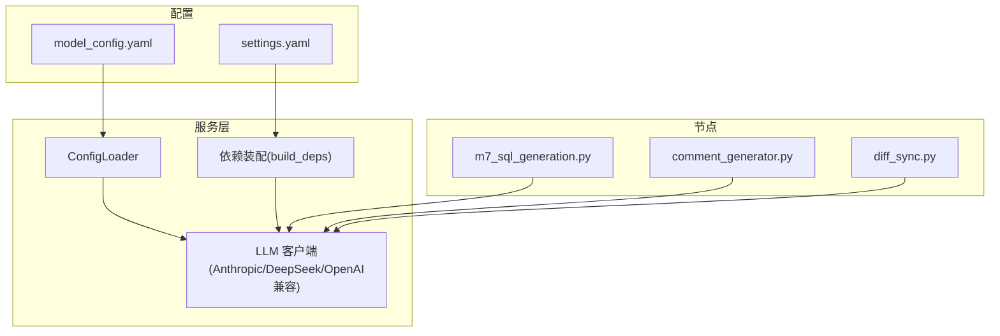
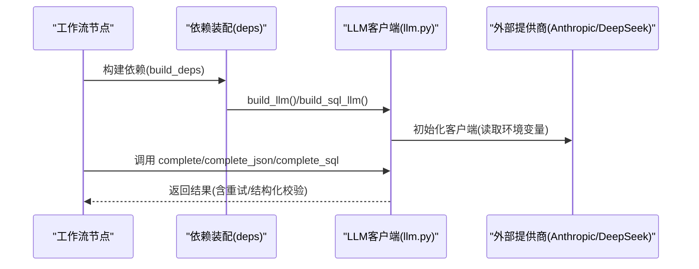
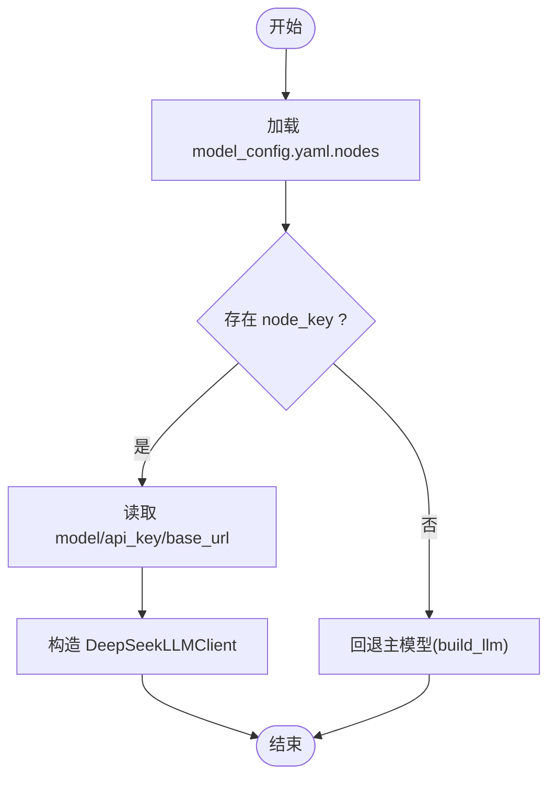
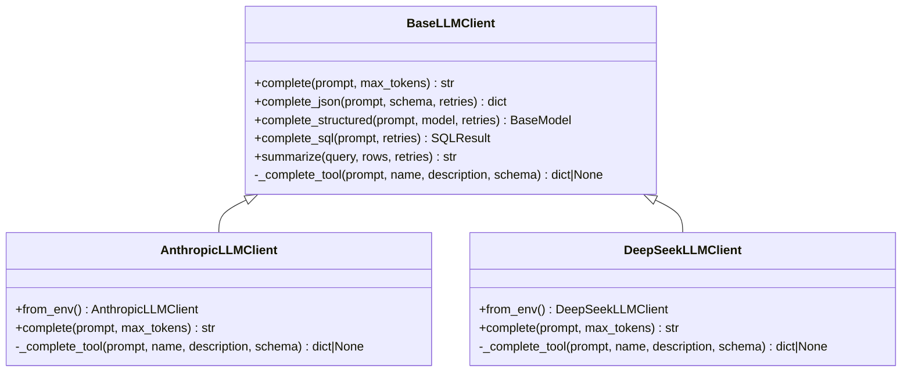
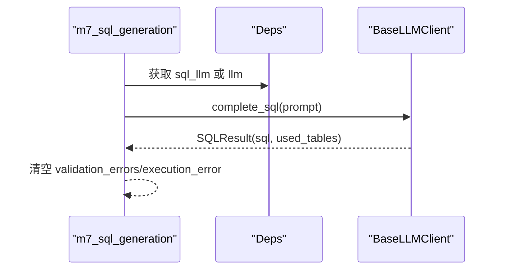
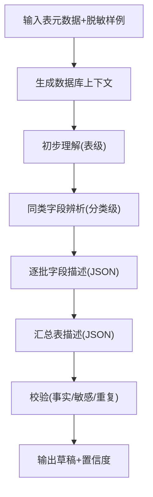
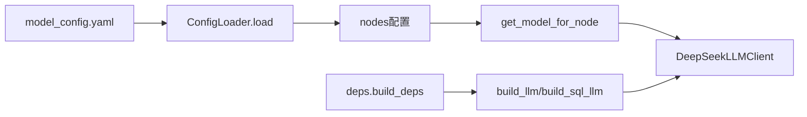

# LLM模型配置

<cite>
**本文引用的文件**   
- [model_config.yaml](file://nl2sql_agent/config/model_config.yaml)
- [llm.py](file://nl2sql_agent/services/llm.py)
- [config_loader.py](file://nl2sql_agent/services/config_loader.py)
- [deps.py](file://nl2sql_agent/services/deps.py)
- [comment_generator.py](file://nl2sql_agent/services/schema_ingest/comment_generator.py)
- [diff_sync.py](file://nl2sql_agent/services/schema_ingest/diff_sync.py)
- [m7_sql_generation.py](file://nl2sql_agent/nodes/m7_sql_generation.py)
- [settings.yaml](file://nl2sql_agent/config/settings.yaml)
- [test_llm.py](file://nl2sql_agent/tests/test_llm.py)
</cite>

## 目录
1. [简介](#简介)
2. [项目结构](#项目结构)
3. [核心组件](#核心组件)
4. [架构总览](#架构总览)
5. [详细组件分析](#详细组件分析)
6. [依赖关系分析](#依赖关系分析)
7. [性能与成本优化](#性能与成本优化)
8. [故障排查指南](#故障排查指南)
9. [结论](#结论)

## 简介
本文件面向 NL2SQL 系统中的 LLM 模型配置，重点说明 nodes 配置段中各节点的模型设置，尤其是 schema_comment_generation 节点使用 deepseek-chat 模型的用途与配置方式。文档还涵盖：
- 如何为不同工作流节点配置合适的 LLM 模型（含离线任务更便宜的模型策略）
- 支持的 LLM 提供商（Anthropic Claude、DeepSeek、OpenAI 兼容端点等）的配置方法、API 密钥管理与请求参数设置
- 模型切换机制、负载均衡与故障转移策略（基于环境变量与配置的动态选择）
- 模型性能调优、并发控制与错误处理的最佳实践

## 项目结构
与 LLM 配置相关的关键位置：
- 配置文件：nl2sql_agent/config/model_config.yaml（nodes 节点模型映射）、settings.yaml（运行参数）
- 服务层：services/llm.py（LLM 客户端抽象与 provider 选择）、services/config_loader.py（YAML 热加载）
- 依赖装配：services/deps.py（构建主模型与 SQL 专用模型）
- 节点调用：nodes/m7_sql_generation.py（SQL 生成节点使用 sql_llm 或 llm）
- 注释生成：services/schema_ingest/comment_generator.py（通过 LLM 生成候选注释）
- 离线同步：services/schema_ingest/diff_sync.py（按节点 key 获取对应 LLM 客户端）

**图表来源** 
- [model_config.yaml:1-18](file://nl2sql_agent/config/model_config.yaml#L1-L18)
- [llm.py:245-283](file://nl2sql_agent/services/llm.py#L245-L283)
- [deps.py:113-184](file://nl2sql_agent/services/deps.py#L113-L184)

**章节来源**
- [model_config.yaml:1-18](file://nl2sql_agent/config/model_config.yaml#L1-L18)
- [settings.yaml:1-30](file://nl2sql_agent/config/settings.yaml#L1-L30)

## 核心组件
- BaseLLMClient：统一接口，提供 complete_json、complete_structured、complete_sql、summarize 等方法，封装结构化输出与重试逻辑
- AnthropicLLMClient：基于 Anthropic Messages API，支持 tool_use
- DeepSeekLLMClient：基于 OpenAI 兼容接口（默认 base_url 可配），thinking/reasoning 模式不支持 tool_choice，回退纯文本解析
- build_llm()：按环境变量选择主模型（DeepSeek 优先，否则 Anthropic）
- build_sql_llm()：可选的 SQL 专用模型（独立端点或同 provider 的不同模型名）
- get_model_for_node(node_key)：按 model_config.yaml 的 nodes.<node_key> 返回对应 LLM 客户端；未配置则回退主模型

关键职责与交互：
- deps.py 负责构建 Deps，注入 llm（主模型）与 sql_llm（可选）
- m7_sql_generation.py 在 SQL 生成时优先使用 sql_llm，否则回退到 llm
- comment_generator.py 与 diff_sync.py 通过 get_model_for_node("schema_comment_generation") 获取专用 LLM 客户端

**章节来源**
- [llm.py:70-160](file://nl2sql_agent/services/llm.py#L70-L160)
- [llm.py:162-243](file://nl2sql_agent/services/llm.py#L162-L243)
- [llm.py:254-283](file://nl2sql_agent/services/llm.py#L254-L283)
- [deps.py:155-156](file://nl2sql_agent/services/deps.py#L155-L156)
- [m7_sql_generation.py:94-113](file://nl2sql_agent/nodes/m7_sql_generation.py#L94-L113)

## 架构总览
下图展示 LLM 客户端选择与节点调用流程：

**图表来源** 
- [deps.py:113-184](file://nl2sql_agent/services/deps.py#L113-L184)
- [llm.py:280-328](file://nl2sql_agent/services/llm.py#L280-L328)

## 详细组件分析

### nodes 配置段与 schema_comment_generation 节点
- model_config.yaml 的 nodes 段用于为特定节点指定模型，例如 schema_comment_generation 使用 deepseek-chat，适合离线任务降低成本
- get_model_for_node(node_key) 会读取该配置并构造对应的 DeepSeekLLMClient；若未配置则回退主模型

**图表来源** 
- [model_config.yaml:13-18](file://nl2sql_agent/config/model_config.yaml#L13-L18)
- [llm.py:245-273](file://nl2sql_agent/services/llm.py#L245-L273)

**章节来源**
- [model_config.yaml:13-18](file://nl2sql_agent/config/model_config.yaml#L13-L18)
- [llm.py:245-273](file://nl2sql_agent/services/llm.py#L245-L273)

### LLM 客户端与结构化输出
- BaseLLMClient.complete_json：优先 function calling（Anthropic 支持 tool_use），DeepSeek thinking 模式不支持 tool_choice，回退纯文本 + extract_json；包含“回显 schema”检测与重试
- complete_structured：基于 Pydantic 模型进行强类型校验
- complete_sql：固定 JSON Schema 要求返回 sql 与 used_tables，便于后续静态校验

**图表来源** 
- [llm.py:70-160](file://nl2sql_agent/services/llm.py#L70-L160)
- [llm.py:162-243](file://nl2sql_agent/services/llm.py#L162-L243)

**章节来源**
- [llm.py:70-160](file://nl2sql_agent/services/llm.py#L70-L160)
- [llm.py:162-243](file://nl2sql_agent/services/llm.py#L162-L243)

### SQL 生成节点（模块 7）
- 根据是否有查询计划构建 prompt，同时输出 used_tables 供模块 8 交叉比对
- 优先使用 deps.sql_llm（SQL 专用模型），未配置则回退 deps.llm（主模型）

**图表来源** 
- [m7_sql_generation.py:94-113](file://nl2sql_agent/nodes/m7_sql_generation.py#L94-L113)
- [deps.py:155-156](file://nl2sql_agent/services/deps.py#L155-L156)

**章节来源**
- [m7_sql_generation.py:94-113](file://nl2sql_agent/nodes/m7_sql_generation.py#L94-L113)
- [deps.py:155-156](file://nl2sql_agent/services/deps.py#L155-L156)

### 注释生成（离线任务）
- comment_generator.py 通过 LLM 生成表/字段注释草稿，并进行事实/敏感/重复校验，计算置信度
- diff_sync.py 在离线同步流程中通过 get_model_for_node("schema_comment_generation") 获取专用 LLM 客户端，降低离线任务成本

**图表来源** 
- [comment_generator.py:103-173](file://nl2sql_agent/services/schema_ingest/comment_generator.py#L103-L173)
- [comment_generator.py:247-307](file://nl2sql_agent/services/schema_ingest/comment_generator.py#L247-L307)

**章节来源**
- [comment_generator.py:103-173](file://nl2sql_agent/services/schema_ingest/comment_generator.py#L103-L173)
- [comment_generator.py:247-307](file://nl2sql_agent/services/schema_ingest/comment_generator.py#L247-L307)

## 依赖关系分析
- ConfigLoader：热加载 YAML 配置（基于 mtime），避免重启服务
- deps.build_deps：组装 AppConfig、TermMappingService、SchemaCatalog、VectorStore、Executor、FewShotStore，以及 llm/sql_llm
- llm.get_model_for_node：按节点 key 从 model_config.yaml 读取模型配置，构造 DeepSeekLLMClient；未配置回退主模型

**图表来源** 
- [config_loader.py:14-36](file://nl2sql_agent/services/config_loader.py#L14-L36)
- [llm.py:245-273](file://nl2sql_agent/services/llm.py#L245-L273)
- [deps.py:113-184](file://nl2sql_agent/services/deps.py#L113-L184)

**章节来源**
- [config_loader.py:14-36](file://nl2sql_agent/services/config_loader.py#L14-L36)
- [llm.py:245-273](file://nl2sql_agent/services/llm.py#L245-L273)
- [deps.py:113-184](file://nl2sql_agent/services/deps.py#L113-L184)

## 性能与成本优化
- 节点级模型配置：在 model_config.yaml 的 nodes 段为离线任务（如 schema_comment_generation）配置更便宜的模型（deepseek-chat），降低整体成本
- SQL 专用模型：通过 build_sql_llm() 配置独立的 SQL 模型（支持任意 OpenAI 兼容端点），提高 SQL 生成质量与可控性
- 结构化输出与重试：complete_json/complete_structured 内置重试与“回显 schema”检测，减少无效调用
- 执行限制：settings.yaml 中的 execution.limit、timeout_seconds、explain_row_threshold 等参数控制 SQL 执行风险与资源占用

建议实践：
- 在线推理（计划生成、结果解释）使用高质量模型（Anthropic Claude 或 DeepSeek 高配）
- 离线任务（注释生成、批量处理）使用低成本模型（deepseek-chat）
- 对 SQL 生成单独配置专用模型，提升稳定性与可维护性

**章节来源**
- [model_config.yaml:13-18](file://nl2sql_agent/config/model_config.yaml#L13-L18)
- [llm.py:285-328](file://nl2sql_agent/services/llm.py#L285-L328)
- [settings.yaml:18-23](file://nl2sql_agent/config/settings.yaml#L18-L23)

## 故障排查指南
常见问题与定位要点：
- 环境变量缺失：Anthropic 需要 ANTHROPIC_MODEL、ANTHROPIC_API_KEY；DeepSeek 需要 DEEPSEEK_MODEL、DEEPSEEK_API_KEY；独立 SQL 模型需 SQL_MODEL、SQL_API_KEY、SQL_BASE_URL
- 结构化输出失败：complete_json/complete_structured 多次重试后仍失败会抛出异常，检查提示词与 schema 定义
- DeepSeek tool_choice 不支持：thinking/reasoning 模式下 _complete_tool 返回 None，走纯文本路径；确保 extract_json 能正确解析
- 节点模型未生效：确认 model_config.yaml 的 nodes.<node_key>.model 已配置，且 get_model_for_node 被正确调用

调试步骤：
- 检查 .env 或系统环境变量是否设置完整
- 查看测试用例 test_llm.py 中的行为断言，验证 provider 选择与客户端行为
- 对于 SQL 生成问题，检查 used_tables 与实际 SQL 的一致性，结合模块 8 的静态校验反馈

**章节来源**
- [llm.py:170-179](file://nl2sql_agent/services/llm.py#L170-L179)
- [llm.py:216-228](file://nl2sql_agent/services/llm.py#L216-L228)
- [llm.py:239-243](file://nl2sql_agent/services/llm.py#L239-L243)
- [test_llm.py:19-51](file://nl2sql_agent/tests/test_llm.py#L19-L51)

## 结论
本项目通过统一的 LLM 客户端抽象与灵活的配置机制，实现了多提供商支持与节点级模型定制。借助 model_config.yaml 的 nodes 段，可以为离线任务配置更经济的模型（如 deepseek-chat），并通过 build_sql_llm() 为 SQL 生成提供专用模型。结构化输出、重试与校验机制提升了鲁棒性。生产环境中建议结合业务需求与成本目标，合理选择模型与参数，并持续监控与调优。